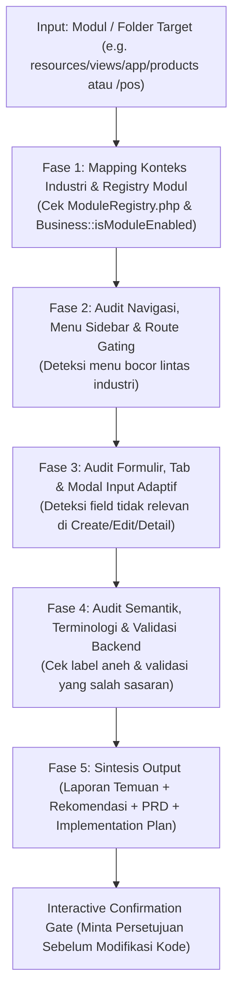

# MULTI-INDUSTRY SYSTEM AUDIT & CONTEXT-AWARE AUTO-HIDING SKILL

Skill operasional ini memandu AI Agent dalam mengeksekusi **audit kesesuaian alur kerja, menu antarmuka, dan formulir sistem terhadap kebutuhan spesifik 20 sektor industri bisnis di Cooca**. Skill ini memastikan bahwa sistem menerapkan arsitektur **antarmuka sadar konteks (*Context-Aware & Zero Irrelevant Clutter UI*)**:

> 🎯 **Mandat Auto-Hiding Multi-Sektor**:  
> Jika suatu fitur, menu, tab, modal, atau field input **TIDAK RELATE** dengan industri aktif tenant, sistem **WAJIB OTOMATIS MENYEMBUNYIKANNYA (AUTO-HIDE)**.  
> **Contoh Nyata:**  
> - Industri **Bengkel / Servis Otomotif** membutuhkan formulir **Perintah Kerja Bengkel (PKB / SPK)**, Nomor Polisi, Odometer KM, dan Teknisi/Mekanik. Fitur ini **DILARANG KERAS MUNCUL DI F&B / RESTORAN**.  
> - Sebaliknya, fitur **Denah Meja Restoran (Dine-In)**, **Tiket Dapur KDS (KOT)**, dan **Resep BOM Gramasi Makanan** **DILARANG KERAS MUNCUL DI BENGKEL ATAU TOKO BAJU**.

---

## 🧭 File Referensi Pendukung

Sebelum atau saat menjalankan audit multi-industri, buka dan pelajari referensi berikut:

* [`references/industry-dos-and-donts-matrix.md`](file:///c:/laragon/www/cooca_core/.agents/skills/multi-industry-system-audit/references/industry-dos-and-donts-matrix.md) — Matriks lengkap kebutuhan modul, fitur wajib (*DO*), fitur terlarang (*DON'T*), dan adaptasi form untuk seluruh 20 industri di 6 klaster Cooca.
* [`references/industry-prd-template.md`](file:///c:/laragon/www/cooca_core/.agents/skills/multi-industry-system-audit/references/industry-prd-template.md) — Cetak biru PRD untuk penataan sistem adaptif lintas industri, penyembunyian menu/form kondisional, dan terminologi dinamis.
* [`references/industry-implementation-plan-template.md`](file:///c:/laragon/www/cooca_core/.agents/skills/multi-industry-system-audit/references/industry-implementation-plan-template.md) — Format rencana implementasi bertahap untuk integrasi `ModuleRegistry`, Blade conditional gating (`isModuleEnabled`), dan pengujian regresi lintas industri.

---

## 🗺️ Peta 6 Klaster & 20 Sektor Industri Cooca

Sistem Cooca melayani 20 template industri yang dikelompokkan ke dalam 6 klaster bisnis utama (berdasarkan `app/Domain/Template/ModuleRegistry.php` & `IndustryPresets.php`):

```
┌────────────────────────────────────────────────────────────────────────────────────────┐
│                        PETA 6 KLASTER DARI 20 INDUSTRI COOCA                           │
├─────────────────────────┬──────────────────────────┬───────────────────────────────────┤
│ 1. KULINER & F&B (5)    │ 2. MANUFAKTUR & HPP (5)  │ 3. RITEL & APOTEK (2)             │
│ • Restoran Dine-in      │ • Konveksi & Garment     │ • Minimarket / Kelontong          │
│ • Coffee Shop & Cafe    │ • Percetakan & Offset    │ • Apotek & Toko Obat              │
│ • Bakery & Roti         │ • Mebel & Furniture Kayu ├───────────────────────────────────┤
│ • Cloud Kitchen         │ • Bubut & Logam Presisi  │ 4. JASA OPERASIONAL HARIAN (4)    │
│ • Katering Prasmanan    │ • Kerajinan & Craft      │ • Bengkel Mobil & Motor (PKB)     │
├─────────────────────────┼──────────────────────────┤ • Barbershop & Salon              │
│ 5. JASA PROYEK (3)      │ 6. DISTRIBUSI & AGRO (2) │ • Laundry Kiloan (Kg / Loker)     │
│ • Kontraktor Bangunan   │ • Distributor Grosir     │ • Cuci Mobil & Detailing          │
│ • Event / Wedding Org   │ • Pertanian & Peternakan │                                   │
│ • Digital IT Agency     │                          │                                   │
└─────────────────────────┴──────────────────────────┴───────────────────────────────────┘
```

---

## ⚖️ Prinsip Universal Do's & Don'ts Lintas Industri

1. **Zero Irrelevant Clutter & Context-Aware Dynamic Auto-Hiding**:
   - **DO:** Tampilkan **HANYA** menu, tab navigasi, widget bento, tombol aksi, dan field input formulir yang memiliki relevansi operasional langsung dengan industri aktif tenant (`$business->template_code` atau `$business->isModuleEnabled()`).
   - **DON'T:** Dilarang keras menampilkan fitur, menu, atau field yang tidak relate dengan industri aktif. Wajib otomatis di-hide:
     - **Bengkel Mobil/Motor (`service_workshop`)**: Wajib tampil Formulir PKB (Perintah Kerja Bengkel / SPK), Nomor Polisi, KM Odometer, Teknisi/Mekanik, Part vs Jasa, Kartu Riwayat Servis Kendaraan. **DILARANG KERAS MUNCUL**: Meja Dine-in / Reservasi Meja, Layar Dapur (KDS), Saluran Ojol (GoFood/GrabFood), Level Pedas/Gula, Resep Porsi Makanan.
     - **Kuliner & F&B (`fnb_resto`, `fnb_cafe`, `fnb_bakery`, `fnb_cloud_kitchen`, `fnb_catering`)**: Wajib tampil Denah Meja Dine-in, Tiket Dapur KDS, Resep BOM Gramasi Makanan, Modifier Varian Rasa. **DILARANG KERAS MUNCUL**: Formulir PKB Bengkel, Plat Nomor Kendaraan, Odometer KM, Berat Kg Timbangan Laundry, No BPOM Obat, IMEI Gadget, Tarif Jam Mesin Bubut Pabrik.
     - **Laundry Kiloan & Satuan (`service_laundry`)**: Wajib tampil Kalkulator Berat Timbangan (Kg), Nomor Rak/Loker Penyimpanan, Pilihan Pewangi/Parfum, Status Alur Cuci-Kering-Setrika-Siap Ambil. **DILARANG KERAS MUNCUL**: Plat Nomor Mobil, Resep Dokter, atau Denah Meja Makan.
     - **Apotek & Toko Obat (`retail_pharmacy`)**: Wajib tampil Nomor Batch Produksi, Expired Date (ED / Kadaluarsa), Dosis & Aturan Pakai, Nomor Resep Dokter & SIP, Peringatan Obat Keras (K). **DILARANG KERAS MUNCUL**: Pilihan Ukuran Baju (S/M/L/XL), Pilihan Level Es/Gula, atau Denah Meja Restoran.
     - **Konveksi & Percetakan (`mfg_garment`, `mfg_printing`)**: Wajib tampil Kalkulator HPP Multi-Tier (Bahan Baku + Ongkos Jahit/Operator + Listrik/Mesin), Termin Pembayaran DP 50%, File Mockup Desain, Estimasi Lead Time. **DILARANG KERAS MUNCUL**: Kasir Cepat Ritel Thermal, Meja Makan, atau Layar Dapur KDS.
     - **Toko Kelontong & Minimarket (`retail_reseller`)**: Wajib tampil Barcode Scanner Cepat, Multi-Satuan (Dus ➔ Pack ➔ Pcs), Low-Stock Threshold Alert, Rak Etalase. **DILARANG KERAS MUNCUL**: Resep Formula BOM Gramasi, SPK Bengkel, atau Jam Kerja Mesin.
2. **Terminologi Adaptif (Domain-Specific Semantics)**:
   - **DO:** Gunakan kamus istilah yang natural dan akrab bagi pemilik bisnis industri tersebut:
     - F&B: *"Daftar Menu"*, *"Pesanan Meja"*, *"Dapur"*, *"Bahan Masak / Resep"*, *"Tamu / Pelanggan"*.
     - Bengkel: *"Jasa Servis & Suku Cadang"*, *"Kendaraan / Pelat Nomor"*, *"Mekanik / Teknisi"*, *"Perintah Kerja Bengkel (PKB / SPK)"*.
     - Retail: *"Produk / Barang Jadi"*, *"Struk Kasir"*, *"Rak / Etalase"*, *"Stok Opname Fisik"*, *"Member"*.
     - Salon / Barbershop: *"Layanan / Treatment"*, *"Stylist / Terapis"*, *"Reservasi Jam Layanan"*.
     - Proyek / Agensi: *"Proyek / SPK"*, *"Surat Penawaran (Quotation)"*, *"Faktur Termin / Progress Billing"*, *"Klien"*.
   - **DON'T:** Dilarang memaksakan istilah generik kaku atau istilah milik industri lain (misal: menyebut penggantian kampas rem di bengkel sebagai "Pembelian Menu").
3. **Formulir & Validasi Request Adaptif**:
   - **DO:** Validasi form di backend wajib diselaraskan dengan modul aktif. Field opsional bagi industri A tidak boleh di-set `required` jika bisnis tersebut tidak menggunakannya.
   - **DON'T:** Dilarang menyebabkan kegagalan simpan (422 Unprocessable Entity) akibat validasi field yang disembunyikan di UI.
4. **Proteksi Integritas Data saat Beralih Template**:
   - **DO:** Jika tenant mengganti preset template atau menonaktifkan modul via `disabled_modules`, data lama tetap tersimpan utuh di database (*zero data deletion*).
   - **DON'T:** Dilarang menghapus baris database historis saat modul dinonaktifkan dari UI.

---

## 🔄 Protokol Kerja 5-Fase Audit Multi-Industri

Saat user meminta audit multi-industri pada folder atau sistem:



---

### Fase 1: Mapping Konteks Industri & Registry Modul

1. Identifikasi keterkaitan file target dengan modul di `App\Domain\Template\ModuleRegistry`:
   - `MODULE_POS_DINEIN` (Meja & Kitchen KDS)
   - `MODULE_POS_RETAIL` (Kasir POS Cepat)
   - `MODULE_B2B_SALES` (Penawaran & Faktur B2B)
   - `MODULE_RECIPE_BOM` (Resep Formula & Bahan Baku)
   - `MODULE_LABOR_MACHINES` (Upah Buruh & Jam Mesin)
   - `MODULE_INVENTORY_WAREHOUSE` (Multi-Gudang & Opname)
   - `MODULE_PROCUREMENT` (PO Supplier & Hutang)
   - `MODULE_CRM_LOYALTY` (Poin Member & Voucher)
   - `MODULE_CHANNELS_MARKETING` (WhatsApp Gateway & CMS)
   - `MODULE_STOREFRONT_CHECKOUT` (Toko Online & Checkout)
   - `MODULE_RESERVATION` (Reservasi Meja & Booking Jadwal)
2. Periksa pemetaan industri di `ModuleRegistry::templateDisabledModulesMap()`:
   - Apakah industri yang sedang diuji memiliki modul ini dalam daftar *disabled*?

---

### Fase 2: Audit Navigasi, Menu Sidebar & Route Gating

Periksa apakah navigasi aplikasi menyaring menu dengan benar:
1. **Sidebar (`sidebar.blade.php`) & Topbar (`topbar.blade.php`)**:
   - Apakah link menu dibungkus pemeriksaan:  
     `@if($business->isModuleEnabled(\App\Domain\Template\ModuleRegistry::MODULE_...))`?
   - Cek apakah menu Resto (Meja/KDS) muncul saat login sebagai Bengkel atau Toko Baju.
2. **Bottom Floating Navbar (Mobile/Tablet)**:
   - Apakah menu cepat di mobile navbar ikut menyaring menu yang dinonaktifkan?
3. **Route & Middleware Protection**:
   - Jika user mengakses URL langsung via browser (misal `/pos/tables` atau `/labor-machines`), apakah middleware memblokir atau me-redirect jika modul dinonaktifkan untuk industri tersebut?

---

### Fase 3: Audit Formulir, Tab & Modal Input Adaptif

Periksa berkas formulir dan modal sheet (contoh: `products/index.blade.php` atau `pos/terminal.blade.php`):
1. **Modal Tambah & Ubah Data**:
   - Apakah ada section bento yang tidak relevan bagi industri tertentu?
   - *Contoh pada Master Produk:*
     - Bento "Resep BOM": Wajib hanya muncul jika `$business->isModuleEnabled('recipe_bom')`.
     - Bento "Multi-Harga Saluran POS (F&B Ojol)": Wajib hanya muncul jika industri berbasis FnB/Resto atau modul POS Dinein/Delivery aktif.
     - Bento "Paket Kombo": Apakah relevan untuk jasa servis murni tanpa produk fisik?
2. **Tab Navigasi di Halaman Index**:
   - Apakah tab filter (misal tab "Bahan Baku", "Barang Jadi", "Jasa") menyembunyikan kategori yang tidak dimiliki industri tersebut?
3. **Komponen Quick-Add Inline**:
   - Apakah dropdown master data hanya memuat pilihan yang relevan?

---

### Fase 4: Audit Semantik, Terminologi & Validasi Backend

1. **Terminologi Dinamis**:
   - Apakah antarmuka menggunakan helper dinamis untuk istilah inti?
   - Contoh: Di POS kasir, apakah tombol "Pilih Meja" otomatis berubah menjadi "Pilih Kendaraan / Stall" pada Bengkel, atau "Pilih Kursi / Stylist" pada Salon?
2. **Validasi Request Backend**:
   - Periksa `FormRequest` atau Controller validator: Apakah ada field yang di-set `required` padahal di frontend field tersebut disembunyikan untuk industri tertentu? (Ini penyebab bug klasik form tidak bisa di-submit!).

---

### Fase 5: Sintesis Output (4 Dokumen Wajib)

Sajikan hasil audit secara terstruktur dalam 4 deliverables:

#### 1. Laporan Temuan Audit Multi-Industri & Pelanggaran Do's/Don'ts
- Tabel temuan pelanggaran Do's & Don'ts per industri.
- File sumber kode, baris kode, dan elemen UI yang bocor (*irrelevant clutter*).
- Dampak terhadap pengalaman pengguna UMKM (*cognitive overload* bagi pengguna gaptek).

#### 2. Rekomendasi Perbaikan & Matriks Fitur Adaptif
- Matriks rekomendasi: Industri vs Fitur (Tampil / Sembunyi / Modifikasi Label).
- Potongan kode Blade perbaikan menggunakan `@if($business->isModuleEnabled(...))` atau helper industri.

#### 3. Dokumen PRD Sistem Adaptif Lintas Industri
- Tersusun sesuai [`references/industry-prd-template.md`](file:///c:/laragon/www/cooca_core/.agents/skills/multi-industry-system-audit/references/industry-prd-template.md):
  - Ringkasan Eksekutif & Latar Belakang Kebutuhan 20 Industri
  - Kebutuhan Fungsional (FR) + Acceptance Criteria Gherkin per Klaster Industri
  - Aturan Penyembunyian Menu, Form, dan Field Dinamis
  - Spesifikasi Kamus Istilah Adaptif (Dynamic Terminology Dictionary)

#### 4. Rencana Implementasi Bertahap (Implementation Plan)
- Tersusun sesuai [`references/industry-implementation-plan-template.md`](file:///c:/laragon/www/cooca_core/.agents/skills/multi-industry-system-audit/references/industry-implementation-plan-template.md):
  - Roadmap Eksekusi Bedah (Fase 1: Sidebar & Navigation Gating ➔ Fase 2: Form & Modal Sheet Hardening ➔ Fase 3: Dynamic Terminology Helper ➔ Fase 4: Automated Testing 20 Industri).
  - Matriks Berkas Sumber Kode Terdampak.
  - Skenario Pengujian Otomatis (`php artisan test`).

---

## 🚦 Interactive Confirmation Gate (Pemberhentian Wajib)

> **MANDAT KESELAMATAN:**  
> Setelah menyajikan Laporan Audit, Rekomendasi, PRD, dan Implementation Plan, AI Agent **DILARANG KERAS** langsung mengubah atau memodifikasi kode sumber secara sepihak.  
> Agen **WAJIB** meminta persetujuan eksplisit dari pengguna mengenai:
> 1. Apakah ada aturan Do's and Don'ts industri tertentu yang ingin disesuaikan.
> 2. Apakah rencana implementasi disetujui untuk dieksekusi bertahap.
