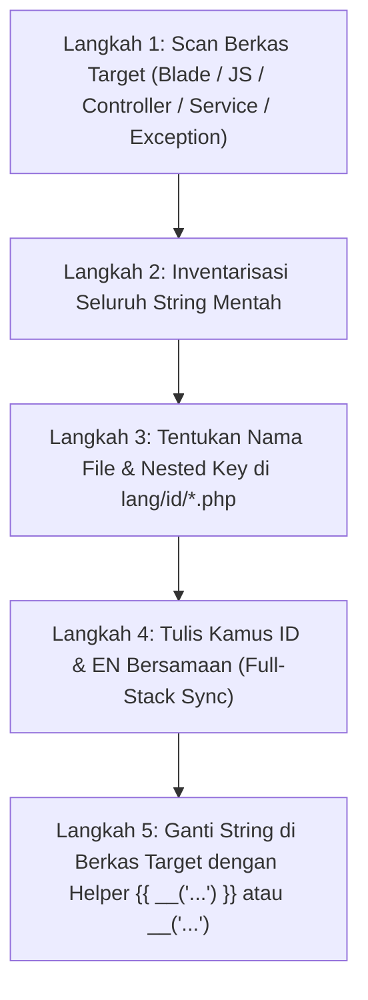

# Protokol Audit Teks & Ekstraksi String Mentah (Full-Stack Hardcoded Text Extraction Protocol)

Dokumen ini menjelaskan prosedur teknis bagi AI Agent dalam mendeteksi teks statis bahasa Indonesia yang tertinggal di seluruh lapisan sistem (Frontend Blade/JS, Backend Controller, Domain Exceptions, Notifikasi, dan Flash Messages) dan mengubahnya menjadi implementasi multi-bahasa yang bersih dan translatable.

---

## 🔍 1. Pola Deteksi String Mentah (*Search Patterns*) Lintas Layer

Saat mengaudit berkas `.blade.php`, `.php`, atau `.js`, gunakan pola pencarian berikut:

| Area & Layer | Pola yang Harus Diwaspadai (❌ Hardcoded String) | Pola yang Seharusnya (✅ Translatable Helper) |
|---|---|---|
| **Judul & Paragraf Blade** | `<h1>Daftar Produk</h1>`, `<p>Kelola harga...</p>` | `<h1>{{ __('inventory.products.title') }}</h1>` |
| **Placeholder Input Form** | `placeholder="Masukkan nama meja..."` | `placeholder="{{ __('pos.tables.name_placeholder') }}"` |
| **Tombol Aksi UI** | `<button>Tambah Meja Baru</button>` | `<button>{{ __('pos.tables.add_table') }}</button>` |
| **Alert JS & Toast Alpine** | `AppAlert.confirm({ title: 'Hapus Meja?' })` | `AppAlert.confirm({ title: window.COOCA_I18N.pos.delete_title })` |
| **Flash Message Controller** | `->with('success', 'Data berhasil disimpan')` | `->with('success', __('messages.created', ['entity' => __('inventory.product')]))` |
| **Domain Exception Class** | `throw new DomainException('Stok tidak cukup')` | `throw new DomainException(__('exceptions.stock.insufficient', ['item' => $item]))` |
| **JSON API Error Response** | `return response()->json(['message' => 'PIN salah'], 422)` | `return response()->json(['message' => __('exceptions.pos.invalid_pin')], 422)` |
| **Template Pesan WhatsApp** | `$wa->send("Halo {$name}, pesanan Anda...")` | `$wa->send(__('notifications.whatsapp.pos_receipt', ['name' => $name]))` |
| **Email HTML Notification** | `->subject('Faktur Pembayaran Toko')` | `->subject(__('notifications.email.invoice_subject', ['business' => $biz]))` |
| **Audit Log Action Event** | `AuditLog::record('Kasir membuka laci kas manual')`| `AuditLog::record(__('audit.pos.drawer_opened_no_sale'))` |

---

## 🛠️ 2. Langkah Demi Langkah Ekstraksi Teks (5 Langkah)



---

## 💻 3. Contoh Refactoring Nyata: Backend & Frontend

### A. Refactoring Controller & Domain Exception (Backend)

#### ❌ Sebelum Refactoring (Hardcoded String di Backend):
```php
class TableWebController extends Controller
{
    public function store(Request $request)
    {
        $tableNumber = $request->input('table_number');
        if (Table::where('table_number', $tableNumber)->exists()) {
            throw new DomainException("Nomor meja {$tableNumber} sudah digunakan!");
        }

        Table::create($request->all());

        return back()->with('success', 'Meja baru berhasil ditambahkan.');
    }
}
```

#### ✅ Sesudah Refactoring (Clean Translatable Backend):
```php
class TableWebController extends Controller
{
    public function store(StoreTableRequest $request)
    {
        $tableNumber = $request->input('table_number');
        if (Table::where('table_number', $tableNumber)->exists()) {
            throw new DomainException(__('exceptions.pos.table_duplicate', [
                'number' => $tableNumber
            ]));
        }

        Table::create($request->validated());

        return back()->with('success', __('messages.created', [
            'entity' => __('pos.tables.entity_name')
        ]));
    }
}
```

---

### B. Refactoring Blade & Alpine.js Dialog (Frontend)

#### ❌ Sebelum Refactoring:
```html
<div class="p-6">
    <h1 class="text-2xl font-bold">Manajemen Meja Restoran</h1>
    <p class="text-sm text-gray-500">Kelola denah meja dan cetak kartu QR akrilik.</p>
    
    <button @click="confirmDelete(table.number)" class="btn-danger">
        Hapus Meja
    </button>
</div>

<script>
function confirmDelete(num) {
    if (confirm("Apakah Anda yakin ingin menghapus Meja #" + num + "?")) {
        // execute delete
    }
}
</script>
```

#### ✅ Sesudah Refactoring:
```blade
<div class="p-6" x-data="{
    i18n: {
        confirmDelete: @json(__('pos.tables.delete_confirm'))
    },
    confirmDelete(num) {
        const msg = this.i18n.confirmDelete.replace(':number', num);
        if (confirm(msg)) {
            // execute delete
        }
    }
}">
    <h1 class="text-2xl font-bold">{{ __('pos.tables.title') }}</h1>
    <p class="text-sm text-gray-500">{{ __('pos.tables.subtitle') }}</p>
    
    <button @click="confirmDelete(table.number)" class="btn-danger">
        {{ __('common.delete') }}
    </button>
</div>
```

---

## 📋 4. Checklist Lolos Audit Multi-Bahasa (Frontend + Backend)

- [ ] **Blade Views:** 100% bebas dari teks statis mentah di dalam tag HTML.
- [ ] **JavaScript / Alpine.js:** Seluruh dialog alert/confirm/toast mengambil string dari objek terjemahan `@json(__('domain'))` atau `window.COOCA_I18N`.
- [ ] **Backend Flash Messages:** Seluruh `->with('success'|'error', ...)` menggunakan key `messages.*` atau `domain.*`.
- [ ] **Domain Exceptions:** Seluruh `throw new Exception(...)` menggunakan key `exceptions.*` dengan parameter dinamis.
- [ ] **Form Requests:** Validasi form dan custom attributes terdefinisi di `validation.php`.
- [ ] **Notifikasi (WA & Email):** Template pesan terisolasi dalam `notifications.php`.
- [ ] **Sinkronisasi Dwibahasa:** Seluruh key di `lang/id/*.php` memiliki padanan yang valid dan seimbang di `lang/en/*.php`.
- [ ] **Format Locale:** Angka moneter diformat dengan class Tailwind `tabular-nums` dan format angka/tanggal menyesuaikan `app()->getLocale()`.
