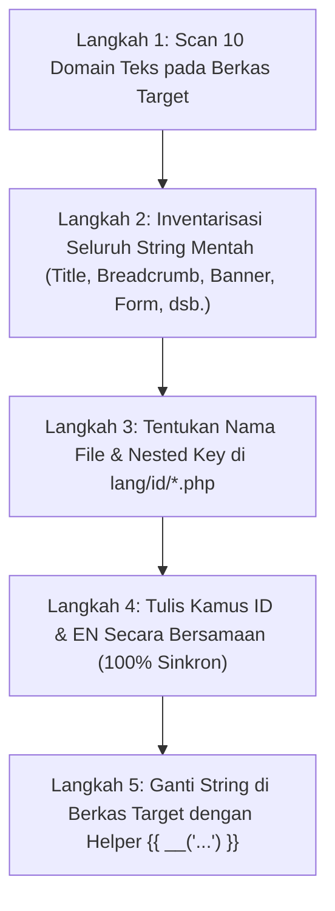

# Protokol Audit Teks & Ekstraksi String Mentah 100% Menyeluruh (Full-Stack Zero Hardcoded Text Protocol)

Dokumen ini menjelaskan prosedur teknis bagi AI Agent dalam mendeteksi dan mengekstraksi **100% seluruh teks statis bahasa Indonesia** yang tertinggal di berkas kode sumber (Frontend Markup, UI Components, Navigation, Forms, Dev Banners, Backend Controllers, Domain Exceptions, Notifikasi, hingga Audit Logs) menjadi implementasi multi-bahasa yang translatable (`id` $\leftrightarrow$ `en`).

---

## 🔍 1. Matriks 10 Domain Sasaran Audit & Pola Pencarian Regex

Saat mengaudit berkas `.blade.php`, `.php`, atau `.js`, gunakan panduan pola pencarian berikut:

| No | Domain Sasaran | Contoh Teks Mentah (❌ Hardcoded) | Standar Refactoring (✅ Translatable) |
|---|---|---|---|
| 1 | **Page & Document Title** | `@extends('layouts.app', ['title' => 'Verifikasi WhatsApp'])` | `@extends('layouts.app', ['title' => __('auth.verify_whatsapp_title')])` |
| 2 | **Breadcrumb & Overline** | `<a href="...">Dashboard</a>`, `<span>Penjualan</span>` | `<a href="...">{{ __('nav.dashboard') }}</a>`, `<span>{{ __('nav.sales') }}</span>` |
| 3 | **Header H1/H2/Subtitle** | `<h1>Verifikasi WhatsApp</h1>`, `<p>Masukkan kode...</p>` | `<h1>{{ __('auth.verify_whatsapp_title') }}</h1>`, `<p>{{ __('auth.otp_sent_to', ['phone' => $p]) }}</p>` |
| 4 | **Form Labels & Hints** | `<label>Nomor Telepon</label>`, `placeholder="0812..."` | `<label>{{ __('auth.phone_label') }}</label>`, `placeholder="{{ __('auth.phone_placeholder') }}"` |
| 5 | **Dev / Sandbox Alerts** | `<span><strong>Bypass / Pengujian:</strong> Gunakan...</span>` | `<span><strong>{{ __('auth.testing_bypass_label') }}:</strong> {{ __('auth.testing_bypass_message', ['code' => '123456']) }}</span>` |
| 6 | **Validation Headings** | `<span>Verifikasi Belum Berhasil:</span>` | `<span>{{ __('validation.errors_heading') }}</span>` |
| 7 | **Buttons & Action Menus** | `<button>Kirim Ulang Kode OTP</button>`, `<button>Batal</button>`| `<button>{{ __('auth.resend_otp_button') }}</button>`, `<button>{{ __('common.cancel') }}</button>` |
| 8 | **Modals & Dialog Prompts**| `<h3>Konfirmasi Hapus</h3>`, `Apakah Anda yakin?` | `<h3>{{ __('common.confirm_delete_title') }}</h3>`, `{{ __('pos.tables.delete_confirm', ['number' => $n]) }}` |
| 9 | **Tables, Badges & Empty** | `<th>Nama Produk</th>`, `<span>Stok Aman</span>`, `Belum ada data` | `<th>{{ __('inventory.product_name') }}</th>`, `<span>{{ __('common.status_safe') }}</span>`, `{{ __('common.empty_data') }}` |
| 10 | **Backend Exceptions & Log**| `throw new DomainException('Stok tidak cukup')`, `->with('success', 'Tersimpan')` | `throw new DomainException(__('exceptions.stock.insufficient', ['item' => $name]))`, `->with('success', __('messages.created', ['entity' => __('pos.tables.entity_name')]))` |

---

## 🛠️ 2. Langkah Demi Langkah Ekstraksi Teks (5 Langkah Wajib)



---

## 💻 3. Contoh Refactoring Nyata: `register-otp.blade.php`

### ❌ Sebelum Refactoring (Banyak Hardcoded Teks):
```blade
<div class="text-center mb-8">
    <h1 class="text-2xl font-bold">Verifikasi WhatsApp</h1>
    <p class="mt-2 text-sm text-slate-600">
        Masukkan kode 6 digit yang dikirim ke <span class="font-mono">{{ $phone }}</span>
    </p>
</div>

@if (app()->environment('local', 'testing'))
    <div class="alert-info">
        <span><strong>Bypass / Pengujian:</strong> Gunakan kode OTP <code>123456</code> untuk verifikasi instan.</span>
    </div>
@endif

@if ($errors->any())
    <div class="alert-danger">
        <div class="font-semibold text-sm">
            <span>Verifikasi Belum Berhasil:</span>
        </div>
    </div>
@endif

<button type="submit">Verifikasi & Masuk</button>
```

### ✅ Sesudah Refactoring (100% Translatable & Zero Hardcoded String):
```blade
<div class="text-center mb-8">
    <h1 class="text-2xl font-bold">{{ __('auth.verify_whatsapp_title') }}</h1>
    <p class="mt-2 text-sm text-slate-600">
        {{ __('auth.otp_sent_to', ['phone' => $phone]) }}
    </p>
</div>

@if (app()->environment('local', 'testing'))
    <div class="alert-info">
        <span>
            <strong>{{ __('auth.testing_bypass_label') }}:</strong>
            {{ __('auth.testing_bypass_message', ['code' => '123456']) }}
        </span>
    </div>
@endif

@if ($errors->any())
    <div class="alert-danger">
        <div class="font-semibold text-sm">
            <span>{{ __('validation.errors_heading') }}</span>
        </div>
    </div>
@endif

<button type="submit">{{ __('auth.verify_and_login_button') }}</button>
```

---

## 📋 4. Checklist Audit Teks Bebas Residu (*Zero-Residue QA Checklist*)

Sebelum menyetujui sebuah berkas Blade atau PHP selesai dilokalisasi:
- [ ] Apakah `['title' => __('...')]` pada `@extends` layout sudah translatable?
- [ ] Apakah seluruh breadcrumb links dan category kickers menggunakan `__('nav....')`?
- [ ] Apakah seluruh judul `<h1>` s/d `<h6>` dan tag `<p>` translatable?
- [ ] Apakah seluruh `<label>`, `placeholder=""`, dan teks bantuan form translatable?
- [ ] Apakah banner bypass developer/testing menggunakan `__('auth.testing_bypass_...')`?
- [ ] Apakah header daftar error validasi menggunakan `__('validation.errors_heading')`?
- [ ] Apakah teks tombol aksi dan dropdown menu menggunakan kamus `common.php` atau domain terkait?
- [ ] Apakah dialog modal konfirmasi menggunakan `@json(__('...'))` atau `window.COOCA_I18N`?
- [ ] Apakah flash messages Controller dan Domain Exceptions melempar string dari `messages.php` & `exceptions.php`?
- [ ] Apakah seluruh key di `lang/id/*.php` memiliki padanan bahasa Inggris yang seimbang di `lang/en/*.php`?
