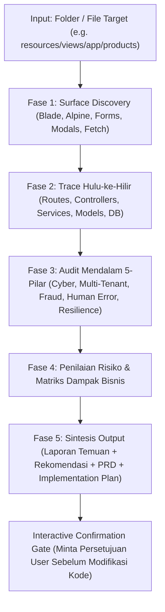

# SECURITY, FRAUD, & HUMAN ERROR AUDIT SKILL (END-TO-END)

Skill operasional ini memandu AI Agent dalam mengeksekusi **audit keamanan, deteksi fraud, dan pencegahan human error secara otonom, menyeluruh, dan berbasis kode nyata (code-first, zero-assumption)** pada modul atau folder mana pun di sistem Cooca (contoh: `resources/views/app/products`).

Dari hasil audit, agen secara otomatis menyusun:
1. **Laporan Temuan Audit Keamanan & Fraud (Audit Findings Report)**
2. **Rekomendasi Perbaikan Defensif (Defensive Remediation)**
3. **Dokumen PRD Keamanan & Anti-Fraud (Product Requirement Document)**
4. **Rencana Implementasi Bertahap (Implementation Plan)**

---

## 🧭 File Referensi Pendukung

Sebelum atau saat menjalankan audit, pelajari file referensi berikut:

* [`references/security-and-fraud-matrix.md`](file:///c:/laragon/www/cooca_core/.agents/skills/security-and-fraud-audit/references/security-and-fraud-matrix.md) — Katalog lengkap 5 pilar kerentanan, modus fraud (kasir, gudang, keuangan), dan pola human error di Cooca.
* [`references/prd-template.md`](file:///c:/laragon/www/cooca_core/.agents/skills/security-and-fraud-audit/references/prd-template.md) — Cetak biru standar penulisan PRD perbaikan keamanan & proteksi fraud berstandar enterprise.
* [`references/implementation-plan-template.md`](file:///c:/laragon/www/cooca_core/.agents/skills/security-and-fraud-audit/references/implementation-plan-template.md) — Format rencana implementasi bertahap, matriks berkas terdampak, dan checklist verifikasi pengujian otomatis.

---

## 🛡️ 5 Pilar Audit Keamanan & Fraud Cooca

Setiap penelusuran audit **WAJIB** mengevaluasi sistem terhadap 5 pilar fundamental berikut:

```
┌─────────────────────────────────────────────────────────────────────────────┐
│ 1. CYBER SECURITY & WEB APPLICATION VULNERABILITIES                         │
│    • OWASP Top 10 • IDOR • SQLi • XSS • CSRF • Mass Assignment             │
│    • Broken Auth • Rate Limiting • Zero Plaintext Credential Exposure       │
├─────────────────────────────────────────────────────────────────────────────┤
│ 2. MULTI-TENANCY & EXTERNAL FRAUD ABUSE                                     │
│    • Kebocoran Context::requireBusiness() • Eksploitasi Keranjang Toko      │
│    • Modifikasi Harga Sisi Klien • Race Condition Stok • Webhook Spoofing   │
├─────────────────────────────────────────────────────────────────────────────┤
│ 3. INTERNAL OPERATIONAL FRAUD (KASIR, GUDANG, KEUANGAN)                     │
│    • Void/Refund Pasca Bayar • Diskon Siluman • Penyesuaian Stok Minus      │
│    • Bypass Two-Step Transfer • Phantom Waste BOM • Lapping Piutang         │
├─────────────────────────────────────────────────────────────────────────────┤
│ 4. HUMAN ERROR & OPERATIONAL SLIPS (RAMAH BOOMER & ERGONOMI)                │
│    • Double-Submit Transaksi • Salah Titik Ribuan • Konversi Satuan         │
│    • Potong Stok Minus Tak Sengaja • Hapus Data Vital Tanpa Konfirmasi      │
├─────────────────────────────────────────────────────────────────────────────┤
│ 5. SYSTEM RESILIENCE, INTEGRITAS TRANSAKSI & AUDIT TRAIL                    │
│    • DB::transaction() Rollback • Immutabilitas Transaksi Final / Posted    │
│    • Keseimbangan Double-Entry • Audit Log Terstruktur • Maker-Checker      │
└─────────────────────────────────────────────────────────────────────────────┘
```

---

## 🔄 Protokol Kerja 5-Fase Audit Otomatis (The 5-Phase Protocol)

Ketika user memasukkan folder (misal: `resources/views/app/products`) dan meminta audit keamanan:



---

### Fase 1: Ingestion & Surface Discovery (Pemetaan Permukaan Serangan)

1. **Daftar Seluruh Berkas Target**:
   Gunakan `list_dir` untuk memindai berkas dalam folder target.
   *Contoh `resources/views/app/products`:*
   - `index.blade.php`: List produk, modal tambah/ubah, dynamic repeater paket kombo, multi-harga saluran.
   - `bom.blade.php`: Resep bahan baku, kalkulasi HPP, batch yield, biaya tenaga kerja/mesin.
   - `modifiers.blade.php`: Opsi tambahan (topping, varian level).
2. **Ekstraksi Input Gates & State Interactivity**:
   - Form `<form action="..." method="...">`, method spoofing `@method('PUT')`, `@method('DELETE')`.
   - CSRF protection `@csrf`.
   - Alpine.js state `x-data`: Variabel reaktif, array input, kalkulasi live sisi browser.
   - Asynchronous endpoints: `fetch(...)`, `axios`, URL query parameter.
   - File upload: Input gambar/dokumen `<input type="file">`.
   - Action triggers: Tombol hapus, modal void/adjust, tombol submit.

---

### Fase 2: Trace Hulu-ke-Hilir & Resolusi Ketergantungan

Untuk setiap route dan action yang ditemukan di Fase 1, telusuri rantai eksekusi lengkap:

1. **Routing & Middlewares**:
   - Buka `routes/owner.php`, `admin.php`, `customer.php`, `api.php`.
   - Periksa middleware: `auth`, `require.permission:*`, `entitlement:*`, `throttle:*`.
2. **Controller & FormRequest**:
   - Buka controller terkait (misal `ProductWebController.php`, `ProductBomWebController.php`).
   - Periksa validasi input: Apakah ada `FormRequest` khusus atau inline `$request->validate()`?
   - Cek penggunaan `$request->all()` yang rentan Mass Assignment.
3. **Domain Services & Logika Perhitungan**:
   - Periksa service (misal `StockService`, `CostingEngineService`).
   - Cek kalkulasi moneter, pembagian nol, dan presisi desimal.
4. **Model Eloquent & Skema Basis Data**:
   - Buka Model (misal `app/Models/Product.php`, `ProductBom.php`).
   - Periksa `$fillable` vs `$guarded`, `$hidden` untuk field sensitif.
   - Periksa migrasi tabel di `database/migrations/`: foreign keys, cascade delete rules, indeks.

---

### Fase 3: Audit Mendalam 5-Pilar Keamanan & Fraud

Lakukan inspeksi kode secara cermat menggunakan kriteria berikut:

#### 1. Cyber Security & Web Exploitation
- **IDOR (Insecure Direct Object References)**: Apakah endpoint `/products/{id}` memverifikasi kepemilikan tenant melalui `where('business_id', $businessId)`? Bisakah user mengganti ID di payload untuk mengedit produk toko lain?
- **Mass Assignment**: Apakah ada `$request->all()` langsung dilempar ke `create()` atau `update()` tanpa whitelist kolom?
- **SQL Injection**: Apakah ada query mentah `DB::raw()` dengan penggabungan string langsung tanpa parameterized binding?
- **Cross-Site Scripting (XSS)**: Apakah input nama produk, catatan BOM, atau nama modifier dirender menggunakan `{!! !!}` tanpa sanitasi `e()` / HTML Purifier?
- **File Upload Security**: Apakah upload foto produk memvalidasi ekstensi asli, MIME type, ukuran file (max 2MB), dan menggunakan storage disk yang aman tanpa eksekusi skrip?
- **Zero Plaintext Credential Exposure**: Pastikan tidak ada token, password, atau supervisor PIN yang terpapar di JSON response atau atribut DOM HTML.

#### 2. Multi-Tenancy & External Fraud Abuse
- **Scoping Multi-Tenant**: Apakah setiap pemanggilan data terisolasi oleh `Context::requireBusiness()`?
- **Eksploitasi Toko Online / Storefront**: Apakah harga produk diambil dari database saat checkout, atau mempercayai harga dari payload request browser pelanggan?
- **Manipulasi Kuantitas Negatif**: Apakah ada validasi `min:1` pada penambahan produk ke keranjang untuk mencegah pengurangan total tagihan?
- **Race Condition Stok Terbatas**: Apakah ada mekanisme penguncian atomik (`lockForUpdate()` atau optimistik concurrency) saat kasir/pelanggan membeli stok barang yang hampir habis?

#### 3. Internal Operational Fraud (Kasir, Gudang, Keuangan)
- **Manipulasi Harga Jual & HPP**: Siapa yang berhak mengubah harga jual produk atau mengubah komposisi modal HPP BOM? Apakah ada otorisasi khusus?
- **Phantom Recipe / Mark-up Scrap**: Apakah pengurangan bahan baku resep BOM diproteksi batas toleransi yield, atau koki dapat mengubah resep sepihak untuk menggelapkan bahan baku?
- **Circular Bundling / Loop Exploit**: Bisakah staf membuat Produk A berisikan Produk B, dan Produk B berisikan Produk A hingga menyebabkan loop pemotongan stok tak terhingga?
- **Audit Trail Immutability**: Apakah setiap perubahan harga, resep, atau status produk mencatat log audit ke tabel `audit_logs` (`user_id`, `payload_before`, `payload_after`, `ip_address`)?

#### 4. Human Error & Operational Slips (Pencegahan Kesalahan Manusia)
- **Double-Submit Prevention**: Apakah form submit dilindungi indikator loading Alpine `x-bind:disabled="loading"` dan spinner agar klik ganda tidak membuat produk duplikat?
- **Format Ribuan Otomatis**: Apakah input harga jual/beli otomatis diformat titik ribuan (`Rp 150.000`) dan disanitasi angka bersih sebelum disimpan ke DB (mencegah salah ketik kurang/lebih nol)?
- **Konversi Satuan (Unit Mismatch)**: Apakah takaran resep BOM (gram, kg, ml, liter, pcs) divalidasi konversinya agar tidak terjadi kesalahan 1 kg dihitung 1 gram?
- **Accidental Cascading Delete**: Jika produk dihapus, apakah ada proteksi jika produk tersebut masih memiliki sisa stok fisik atau masih tercatat dalam transaksi aktif?
- **No-Panic Confirmation Dialog**: Apakah penghapusan atau perubahan vital dilindungi modal konfirmasi dua langkah dengan pesan penenang?

#### 5. System Resilience & Integritas Transaksi
- **Transactional Atomicity**: Apakah pembuatan produk bundling / BOM dibungkus dalam `DB::transaction()` sehingga jika salah satu item anak gagal, seluruh operasi ter-rollback tanpa meninggalkan data yatim (*orphan records*)?
- **Kepatuhan Kuota SaaS (No Data Punishment)**: Jika tenant downgrade paket langganan dan jumlah produk melebihi kuota, apakah produk hanya di-suspend dari POS/Online Store dan TIDAK dihapus dari database?

---

### Fase 4: Penilaian Risiko & Matriks Dampak Bisnis

Setiap temuan wajib diberi skor keparahan berdasarkan dampak finansial dan kemudahan eksploitasi:

| Tingkat Risiko | Kriteria | Tindakan Wajib |
|:---:|---|---|
| **CRITICAL** | Celah IDOR lintas tenant, kebocoran uang langsung, SQLi, bypass otentikasi | Wajib Hotfix Segera (Blocker) |
| **HIGH** | Modus fraud kasir/gudang tanpa supervisor PIN, mass assignment, manipulasi harga keranjang | Prioritas Tinggi (Fase 1 Plan) |
| **MEDIUM** | Human error double-submit, kurangnya audit trail, tidak ada sanitasi format ribuan | Prioritas Menengah (Fase 2 Plan) |
| **LOW** | Minor UX confusion, pesan error kurang informatif, inkonsistensi badge status | Prioritas Pemolesan (Fase 3 Plan) |

---

### Fase 5: Sintesis Output (4 Dokumen Wajib)

Setelah audit selesai, sajikan 4 output terstruktur:

#### Output 1: Laporan Temuan Audit Keamanan & Fraud
- Tabel ringkasan temuan (ID, Pilar, Deskripsi Celah, Berkas & Baris Kode, Tingkat Risiko).
- Rincian skenario ancaman / modus operandi untuk setiap temuan.

#### Output 2: Rekomendasi Perbaikan Defensif
- Panduan kode defensif konkret (potongan kode `Before` vs `After`).
- Pola arsitektur mitigasi (FormRequest rules, `DB::transaction()`, `supervisor_pin`, masking UI).

#### Output 3: Dokumen PRD Keamanan & Anti-Fraud
- Tersusun sesuai [`references/prd-template.md`](file:///c:/laragon/www/cooca_core/.agents/skills/security-and-fraud-audit/references/prd-template.md):
  - Ringkasan Eksekutif & Latar Belakang Masalah
  - Batasan Ruang Lingkup (Scope & Non-Scope)
  - Kebutuhan Fungsional (FR) + Acceptance Criteria format Gherkin (`Given - When - Then`)
  - Kebutuhan Non-Fungsional (NFR): Keamanan, Performa, Multi-Tenant, Zero Credential Exposure
  - Spesifikasi UI/UX Bento Apple HIG & Ergonomi Pencegahan Human Error

#### Output 4: Rencana Implementasi Bertahap (Implementation Plan)
- Tersusun sesuai [`references/implementation-plan-template.md`](file:///c:/laragon/www/cooca_core/.agents/skills/security-and-fraud-audit/references/implementation-plan-template.md):
  - Roadmap Eksekusi Bertahap (Fase 1 s/d Fase 4)
  - Matriks Pembaruan Berkas Sumber Kode
  - Strategi Pengujian Otomatis (`php artisan test`) & Kasus Uji Regresi

---

## 🚦 Interactive Confirmation Gate (Pemberhentian Wajib)

> **MANDAT KESELAMATAN:**  
> Setelah menyajikan Laporan Audit, Rekomendasi, PRD, dan Implementation Plan, AI Agent **DILARANG KERAS** langsung mengubah atau memodifikasi kode sumber secara sepihak.  
> Agen **WAJIB** meminta persetujuan eksplisit dari pengguna mengenai:
> 1. Apakah ada temuan atau prioritas yang ingin disesuaikan.
> 2. Apakah rencana implementasi disetujui untuk dieksekusi bertahap.
