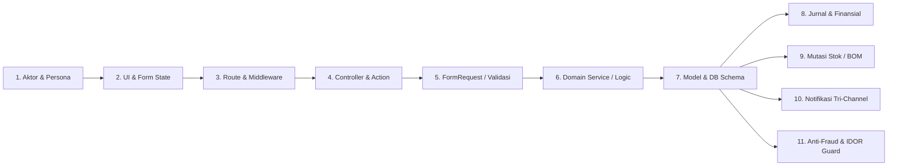

# SYSTEM WORKFLOW AUDIT & CONSOLIDATION SKILL

Skill operasional ini memandu AI Agent dalam mengeksekusi **audit alur kerja sistem end-to-end secara faktual berbasis kode nyata (code-first)** mulai dari folder/file input apa pun (seperti `resources/views/app/warehouse`), menelusuri rantai logika hulu-ke-hilir (*User ➔ UI ➔ Route ➔ Controller ➔ Validation ➔ Service ➔ Database ➔ Side Effects ➔ Notifications*), mendokumentasikannya secara presisi ke dalam `docs/system/`, dan menggabungkannya (*merge & consolidate*) secara harmonis ke dalam peta pengetahuan sistem (`docs/system/INDEX.md`, `docs/SYSTEM_GUIDE.md`, dan `docs/AiWorkHistory.md`).

---

## 🧭 File Referensi Pendukung

Sebelum atau saat menjalankan audit mendalam, buka file referensi berikut sesuai kebutuhan:

* [`references/workflow-audit-checklist.md`](file:///c:/laragon/www/cooca_core/.agents/skills/system-workflow-audit/references/workflow-audit-checklist.md) — Checklist teknis lengkap penelusuran 11 layer kode Laravel DDD & Blade/Alpine.
* [`references/documentation-template.md`](file:///c:/laragon/www/cooca_core/.agents/skills/system-workflow-audit/references/documentation-template.md) — Cetak biru standar dokumentasi workflow Markdown siap pakai dengan Mermaid diagram.
* [`references/index-and-guide-consolidation.md`](file:///c:/laragon/www/cooca_core/.agents/skills/system-workflow-audit/references/index-and-guide-consolidation.md) — Prosedur sinkronisasi & penggabungan pengetahuan ke `INDEX.md`, `SYSTEM_GUIDE.md`, dan resolusi konflik.

---

## 🏛️ Prinsip Utama & Hierarki Kebenaran

1. **Kode Sumber Nyata adalah Hukum Tertinggi (Code-First Factuality)**:
   ```
   Kode Aktual (Source Code) > Skema Database / Migrasi > Pengujian Otomatis (Tests)
                             > Dokumentasi Lama > AiWorkHistory > Asumsi (DILARANG KERAS)
   ```
2. **Zero-Assumption Rule**:
   Jangan pernah menyimpulkan suatu alur terjadi karena "biasanya framework bekerja seperti ini". Buktikan dari pemanggilan method, query database, event listener, atau file routing nyata.
3. **Penta-Prinsip**:
   `Clarity → Deference → Depth → Empathy → Simplicity`. Dokumentasi harus mudah dipahami pemilik bisnis namun cukup presisi bagi arsitek perangkat lunak.

---

## 🔄 Protokol Kerja 5-Fase (The 5-Phase Audit Protocol)

Saat user memberikan folder atau file target (contoh: `resources/views/app/warehouse`), jalankan 5 fase berikut secara sistematis:

```
┌───────────────────────────────────────────────────────────────────────────────┐
│ FASE 1: INGESTION & DISCOVERY TITIK MASUK (ENTRY POINTS)                      │
│         Pemetaan semua file di target folder (Blade, JS, Controller, dsb.)    │
├───────────────────────────────────────────────────────────────────────────────┤
│                                       ↓                                       │
│ FASE 2: TRACE HULU-KE-HILIR (THE 11-NODE EXECUTION CHAIN)                     │
│         Telusuri: Aktor → UI → Route → Controller → Validation → Service →    │
│                   Model → DB → AutoJournal/Stok → Notifikasi → Guardrails     │
├───────────────────────────────────────────────────────────────────────────────┤
│                                       ↓                                       │
│ FASE 3: KLASIFIKASI & EKSTRAKSI WORKFLOW                                      │
│         Pisahkan alur utama (Core Flow), alur pendukung, & penanganan error   │
├───────────────────────────────────────────────────────────────────────────────┤
│                                       ↓                                       │
│ FASE 4: PEMBUATAN DOKUMENTASI SISTEM (docs/system/)                           │
│         Tulis dokumen komprehensif berstandar CURRENT STATE + Mermaid diagram │
├───────────────────────────────────────────────────────────────────────────────┤
│                                       ↓                                       │
│ FASE 5: PENGGABUNGAN & KONSOLIDASI SISTEM (INDEX & SYSTEM_GUIDE)              │
│         Sinkronkan ke docs/system/INDEX.md, docs/SYSTEM_GUIDE.md, & History   │
└───────────────────────────────────────────────────────────────────────────────┘
```

---

### Fase 1: Ingestion & Discovery Titik Masuk (Entry Points)

Langkah awal ketika menerima folder/file target:

1. **Inventarisasi Berkas**:
   Daftar seluruh file dalam folder target menggunakan `list_dir` atau `grep_search`.
   *Contoh pada `resources/views/app/warehouse`:*
   - `index.blade.php`: Halaman katalog cabang/gudang, modal create/edit, filter status, geocoding.
   - `show.blade.php`: Detail gudang, tab stok, mutasi barang, surat jalan penerimaan (GR), opname, transfer.

2. **Ekstraksi Elemen Interaktif (UI Entry Points)**:
   Periksa isi berkas untuk menemukan:
   - Form submission: `<form action="..." method="...">`, method spoofing `@method('PUT')`, `@method('DELETE')`.
   - Route helper Laravel: `{{ route('...') }}`, `route('warehouse.store')`, `route('inventory.stocks.adjust')`.
   - Alpine.js triggers & state: `x-data`, `@click`, `x-on:submit`, `@change`, fetch call async (`fetch(...)`), modal openers (`showCreateModal = true`).
   - Action links: Tombol CTA, anchor tag navigasi antar-modul (`a href="{{ route(...) }}"`).
   - Query parameter handlers: `window.location.search`, `new URLSearchParams(...)`.

---

### Fase 2: Trace Hulu-ke-Hilir (The 11-Node Execution Chain)

Untuk setiap aksi atau endpoint yang ditemukan di Fase 1, telusuri 11 simpul rantai eksekusi:



1. **Aktor & Persona**:
   Siapa yang menginisiasi aksi? (Superadmin platform, Owner/Tenant, Manajer Toko, Kasir POS, Staf Gudang, Pelanggan online, atau Scheduler sistem).
2. **UI & Form State**:
   Data apa saja yang dikumpulkan dari form? Format input, masking rupiah, file upload, koordinat GPS, dropdown select.
3. **Route & Middleware Gates**:
   Cari route terkait di `routes/` (`owner.php`, `admin.php`, `customer.php`, `api.php`).
   Catat HTTP Verb (`GET`, `POST`, `PUT`, `DELETE`), middleware keamanan (`auth`, `require.permission:*`, `entitlement:*`, `verified`).
4. **Controller & Action**:
   Buka file controller (misal `WarehouseWebController.php`). Amati method penangan (`index`, `store`, `show`, `update`, `destroy`).
5. **FormRequest & Validasi**:
   Aturan validasi input (`required`, `uuid`, `exists`, `min`, `max`, `regex`). Bagaimana error ditampilkan kembali ke user?
6. **Domain Service & Logic**:
   Apakah controller mendelegasikan logika ke Service (misal `StockService`, `LocationService`) atau Action class? Periksa kalkulasi bisnisnya.
7. **Model, Database Schema & Transaksi**:
   Model Eloquent terkait, tabel basis data, kolom, tipe data, foreign key, soft delete (`deleted_at`), dan pembungkus transaksi `DB::transaction()`.
8. **Dampak Finansial & Auto-Journal**:
   Apakah memicu pencatatan jurnal akuntansi berpasangan (`AutoJournalService`, `JournalEntry`, `cash_account_transactions`)?
9. **Dampak Mutasi Stok & Resep**:
   Apakah memicu pemotongan stok bahan baku BOM, penguncian stok, atau mutasi fisik (`StockMovement`, `GoodsReceipt`, `StockTransfer`)?
10. **Notifikasi Tri-Channel**:
    Apakah memicu dispatch pesan? (UI In-App Notification Center, WhatsApp Cloud API Meta, atau Email responsif via queue `ShouldQueue`).
11. **Anti-Fraud, IDOR, & Scoping Multi-Tenant**:
    Verifikasi isolasi tenant via `Context::requireBusiness()` atau `business_id`. Periksa proteksi IDOR, PIN supervisor, atau audit log immutability.

---

### Fase 3: Klasifikasi & Ekstraksi Workflow

Kelompokkan hasil penelusuran menjadi beberapa alur kerja terstruktur:

1. **Alur Utama (Core Happy Path)**:
   Skenario operasional ideal dari awal hingga akhir (contoh: Pendaftaran Cabang Baru ➔ Penentuan Koordinat Geofence ➔ Assign Gudang Logistik).
2. **Alur Turunan / Relasi (Related Workflows)**:
   Alur yang bersinggungan langsung (contoh: Pemindahan Stok Antar-Gudang, Penerimaan Surat Jalan PO ke Gudang Tertentu).
3. **Siklus Status / State Machine**:
   Transisi status entitas (contoh: `draft ➔ pending_approval ➔ approved ➔ in_transit ➔ completed / rejected`).
4. **Penanganan Kasus Tepi & Kegagalan (Failure & Edge Cases)**:
   Apa yang terjadi jika jaringan GPS mati, kuota paket langganan habis (`entitlement`), stok gudang tidak cukup, atau ada upaya akses lintas tenant (IDOR).

---

### Fase 4: Pembuatan Dokumentasi Sistem (`docs/system/`)

Susun dokumentasi sistem dengan format standar Layer 2 Cooca:

* **Lokasi Penyimpanan**:
  - Untuk alur proses end-to-end: `docs/system/workflows/<nama-alur>-flow.md`
  - Untuk modul fitur terpadu: `docs/system/modules/<nama-modul>.md`
  - Untuk aturan bisnis & validasi: `docs/system/business-rules/<nama-aturan>.md`

* **Struktur Wajib Dokumen**:
  1. **Metadata Header**:
     ```markdown
     # Alur & Panduan Teknis: [Nama Workflow]
     
     > **Status:** CURRENT STATE & VERIFIED  
     > **Terakhir Diverifikasi:** [YYYY-MM-DD]  
     > **Ruang Lingkup:** [Daftar ringkas berkas, tabel DB, dan aktor yang terlibat]
     ```
  2. **Latar Belakang & Konteks Bisnis**: Nilai bisnis dan masalah operasional yang diselesaikan.
  3. **Diagram Alur Visual (Mermaid)**:
     - Diagram alur relasi sistem (`graph TD` atau `graph LR`).
     - Sequence diagram interaksi (`sequenceDiagram`).
  4. **Skema Database & Model Terkait**: Tabel database, kolom kunci, foreign keys, tipe data, dan fungsi relasi Eloquent.
  5. **Rincian Langkah Eksekusi (Step-by-Step Execution Table)**:
     Tabel detail memuat: Tahap, Aktor, Input/Aksi UI, Endpoint & Method, Service/Logika, Perubahan DB, Respons/Feedback.
  6. **Aturan Bisnis & Guardrails**: Validasi, isolasi tenant, proteksi fraud, dan mitigasi risiko.
  7. **Spesifikasi UI/UX (Bento Apple HIG)**: Modal sheet XXL, sentuhan mobile/tablet, progressive disclosure, no-panic microcopy.
  8. **Matriks Hak Akses (Permissions)**: Izin RBAC yang dibutuhkan (`require.permission`).

*(Gunakan template lengkap di [`references/documentation-template.md`](file:///c:/laragon/www/cooca_core/.agents/skills/system-workflow-audit/references/documentation-template.md)).*

---

### Fase 5: Penggabungan & Konsolidasi Pengetahuan ("Menggabungkannya Nanti")

Dokumentasi audit tidak boleh terisolasi atau menjadi dokumen yatim (*orphaned file*). AI Agent **WAJIB** menggabungkannya ke seluruh ekosistem dokumentasi Cooca:

1. **Sinkronisasi ke `docs/system/INDEX.md`**:
   * Tambahkan tautan dokumen baru pada kategori yang sesuai (`### 2. Modul Sistem` atau `### 3. Alur Kerja End-to-End`).
   * Cantumkan status audit (`[COMPLETE]` / `[VERIFIED]`) dan deskripsi 1-kalimat yang padat.
   * Daftarkan atau perbarui baris pada tabel `## 📊 Matriks Status Dokumentasi Sistem` lengkap dengan referensi source code dan tanggal verifikasi.

2. **Sinkronisasi ke `docs/SYSTEM_GUIDE.md`**:
   * Perbarui atau tambahkan ringkasan operasional pada **Bab 3 (Panduan Pemilik Usaha)** agar bahasa non-teknisnya jelas.
   * Perbarui atau tambahkan blueprint teknis pada **Bab 4 (Panduan Rekayasa Developer & AI Agent)**.
   * Pastikan **Bab 5 (Matriks Penelusuran Pengetahuan)** mencantumkan tautan silang (*cross-reference*) ke dokumen workflow baru.

3. **Resolusi Konflik & Deduplikasi Dokumen**:
   * Jika sudah ada dokumentasi lama yang membahas topik serupa (misal `multi-hierarchy-branch-and-warehouse-flow.md`), lakukan audit perbandingan (*diff comparison*).
   * Lakukan integrasi bedah (*surgical merge*): satukan fakta kode terbaru, buang informasi usang (*outdated*), dan hindari duplikasi file dengan nama berbeda yang membahas hal yang sama.

4. **Pencatatan Audit Trail ke `docs/AiWorkHistory.md`**:
   Buat entri riwayat dengan 7 komponen wajib: Tanggal, Tujuan, Hasil Audit, Modifikasi/Dokumen Dibuat, File yang Ditinjau, Hasil Verifikasi (100% lolos), dan Catatan/Risiko tersisa.

---

## 💡 Panduan Praktis Contoh: Audit `resources/views/app/warehouse`

Jika user meminta audit folder `resources/views/app/warehouse`:

1. **File Ingestion**:
   - Analisis `index.blade.php`: Deteksi form penambahan outlet & gudang, deteksi geocoding Biteship, koordinat GPS HTML5, toggle online fulfillment & storefront pickup, modal edit.
   - Analisis `show.blade.php`: Deteksi tab kartu bento gudang, tabel stok barang gudang, modal quick adjustment stok, tab surat penerimaan barang (Goods Receipt), PO supplier, kartu transfer stok, kartu opname.
2. **Route Tracing**:
   - `warehouse.index` ➔ `WarehouseWebController@index` (Permission: `warehouse.view`)
   - `warehouse.store` ➔ `WarehouseWebController@store` (Permission: `warehouse.manage`, Entitlement: `warehouse`)
   - `warehouse.show` ➔ `WarehouseWebController@show` (Permission: `warehouse.view`)
   - `warehouse.update` ➔ `WarehouseWebController@update` (Permission: `warehouse.manage`)
   - `warehouse.destroy` ➔ `WarehouseWebController@destroy` (Permission: `warehouse.manage`)
   - `inventory.stocks.adjust` ➔ `StockWebController@adjust`
   - `geo.reverse-geocode` ➔ `GeoController@reverseGeocode`
   - `geo.search-areas` ➔ `GeoController@searchAreas`
3. **Database & Domain Tracing**:
   - Model `Location` (`parent_id`, `type`, `code`, `is_primary`, `is_online_fulfillment`, `biteship_area_id`, `latitude`, `longitude`, `geofence_radius_meters`).
   - Hubungan hierarki self-referencing (`Location::parent()`, `Location::childWarehouses()`).
   - Integrasi stok multi-gudang (`StockService`, `Stock`, `StockMovement`).
   - Hubungan logistik pengadaan (`GoodsReceipt`, `PurchaseOrder`).
4. **Dokumentasi & Konsolidasi**:
   - Evaluasi kesesuaian dengan `docs/system/workflows/multi-hierarchy-branch-and-warehouse-flow.md` dan modul inventori.
   - Perbarui atau perkaya dokumentasi hingga status `COMPLETE`.
   - Pastikan entri di `docs/system/INDEX.md` dan `docs/SYSTEM_GUIDE.md` tersinkronisasi sempurna.
