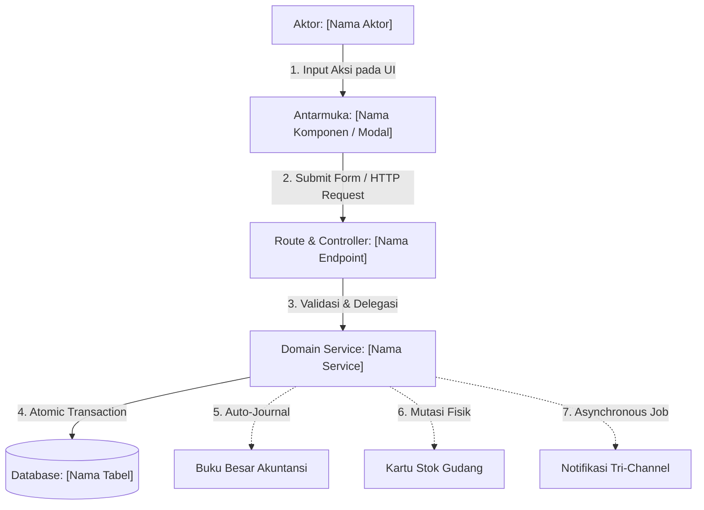
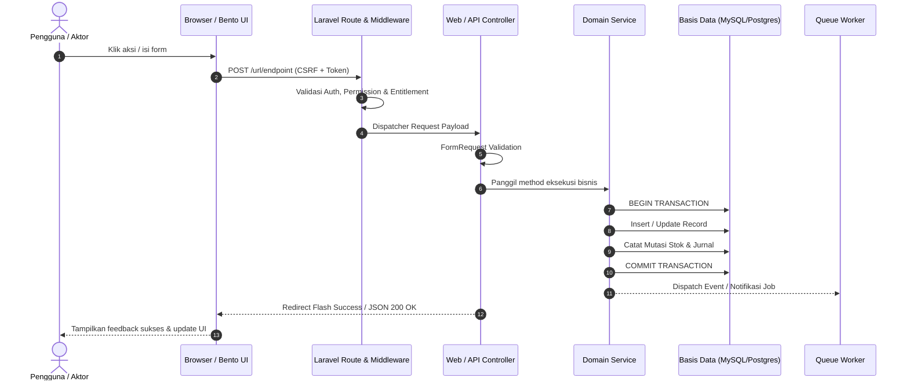

# Template Standar Dokumentasi Workflow Sistem Cooca (Layer 2)

Gunakan cetak biru ini saat membuat file baru di `docs/system/workflows/<nama-alur>-flow.md` atau `docs/system/modules/<nama-modul>.md`.

---

```markdown
# Alur & Panduan Teknis: [Nama Alur Kerja / Modul]

> **Status:** CURRENT STATE & VERIFIED  
> **Terakhir Diverifikasi:** [YYYY-MM-DD]  
> **Ruang Lingkup:** [Daftar file kode, tabel database, migrasi, dan aktor utama]

---

## 1. Latar Belakang & Nilai Bisnis

Jelaskan dalam 2–3 paragraf ringkas:
- Masalah operasional atau bisnis riil yang diselesaikan oleh alur kerja ini bagi pemilik UMKM atau staf operasional.
- Perbedaan alur sebelum dan sesudah fitur ini diterapkan.
- Dampak terhadap efisiensi waktu, pencegahan fraud, akurasi stok, atau kecepatan layanan pelanggan.

---

## 2. Diagram Alur Visual & Interaksi Sistem

### Diagram Topologi & Relasi Entitas


### Sequence Diagram Interaksi Eksekusi


---

## 3. Skema Basis Data & Relasi Model

### Tabel Utama: `[nama_tabel_1]`
| Kolom | Tipe Data | Nullable | Keterangan & Makna Bisnis |
|---|---|:---:|---|
| `id` | UUID | Tidak | Primary key unik entitas |
| `business_id` | UUID | Tidak | Foreign key tenant (`businesses.id`) - Isolasi Multi-Tenant |
| `[kolom_lain]` | VARCHAR / INT / DECIMAL | ... | ... |
| `status` | ENUM | Tidak | Status entitas (`draft`, `active`, `completed`, dsb.) |
| `created_at` | TIMESTAMP | Ya | Waktu pembuatan data |

### Relasi Model Eloquent
```php
// app/Models/[ModelName].php
public function relationName(): BelongsTo
{
    return $this->belongsTo(RelatedModel::class, 'foreign_key');
}
```

### State Machine / Siklus Transisi Status
| Status Awal | Aksi Pemicu | Status Tujuan | Aktor Diizinkan | Syarat & Validasi |
|---|---|---|---|---|
| `draft` | Submit Pengajuan | `pending_approval` | Staf Operasional | Semua field mandatory terisi |
| `pending_approval` | Setujui Dokumen | `approved` | Supervisor / Owner | Memerlukan otorisasi PIN |
| `approved` | Selesaikan Proses | `completed` | Sistem / Staf | Stok & kas mencukupi |

---

## 4. Rincian Langkah Eksekusi End-to-End

| Langkah | Aktor | Titik Masuk UI | Endpoint & Method | Service / Handler | Perubahan Database | Umpan Balik Pengguna |
|:---:|---|---|---|---|---|---|
| **1** | [Aktor] | [Tombol / Form UI] | `POST /route/path` | `Controller@method` | Insert ke tabel `x` | Modal tertutup, banner sukses |
| **2** | [Aktor] | [Aksi lanjutan] | `PUT /route/path/{id}` | `Service@method` | Update status ➔ `completed` | Badge status berubah |

---

## 5. Aturan Bisnis, Validasi, & Integritas Data

1. **Aturan Validasi Input**:
   - [Sebutkan aturan validasi kritis yang ditegakkan backend]
2. **Ketetapan Data (Immutability)**:
   - [Dokumen apa yang tidak boleh diedit/dihapus setelah disetujui?]
3. **Kalkulasi & Presisi**:
   - [Rumus perhitungan harga, stok, atau pajak jika ada]

---

## 6. Keamanan, Isolasi Multi-Tenant, & Anti-Fraud Guardrails

- **Scoping Multi-Tenant**: Seluruh query basis data wajib menyertakan `where('business_id', $businessId)` atau melalui relasi resmi tenant.
- **Proteksi IDOR**: Endpoint menerima UUID dan memverifikasi kepemilikan tenant aktif sebelum memproses.
- **Guardrail Anti-Fraud**:
  - [Otorisasi PIN Supervisor / Pembatasan kuota / Audit trail log]

---

## 7. Desain Antarmuka & Interaksi (Bento Apple HIG)

- **Modal-First & Progressive Disclosure**: Form berukuran Full-Layout XXL pada Desktop dan Bottom Sheet pada Mobile.
- **Sentuhan Mobile**: Touch target minimal 48px, font input minimal 16px (anti-zoom Safari).
- **No-Panic Microcopy**:
  > *"Tenang: Riwayat data Anda tetap aman dan tidak akan terhapus secara permanen."*

---

## 8. Matriks Hak Akses & Peran (Permissions)

| Peran (Role) | Hak Akses Kode (`require.permission`) | Akses Lihat | Akses Buat / Ubah | Akses Hapus / Void |
|---|---|:---:|:---:|:---:|
| **Superadmin** | `*` | Ya | Ya | Ya |
| **Business Owner** | `[modul].*` | Ya | Ya | Ya |
| **Store Manager** | `[modul].view`, `[modul].manage` | Ya | Ya | Terbatas PIN |
| **Staf Kasir / Gudang** | `[modul].view`, `[modul].create` | Ya | Ya | Tidak |

---

## 9. Matriks Endpoint & Routing

| HTTP Verb | Path URI | Route Name | Controller & Action | Middleware Pipeline |
|---|---|---|---|---|
| `GET` | `/module` | `module.index` | `ModuleWebController@index` | `auth`, `require.permission:...` |
| `POST` | `/module` | `module.store` | `ModuleWebController@store` | `auth`, `require.permission:...` |

---

## 10. Penanganan Error, Kasus Tepi, & Rollback

- **Kegagalan Database / Rollback**: Jika terjadi kegagalan di tengah transaksi, `DB::rollBack()` mengembalikan data ke kondisi semula tanpa data gantung.
- **Penanganan Offline / Timeout Eksternal**: Jika WhatsApp/Email gateway timeout, transaksi utama tetap tersimpan sukses dan sistem menyediakan opsi retry manual.
```
