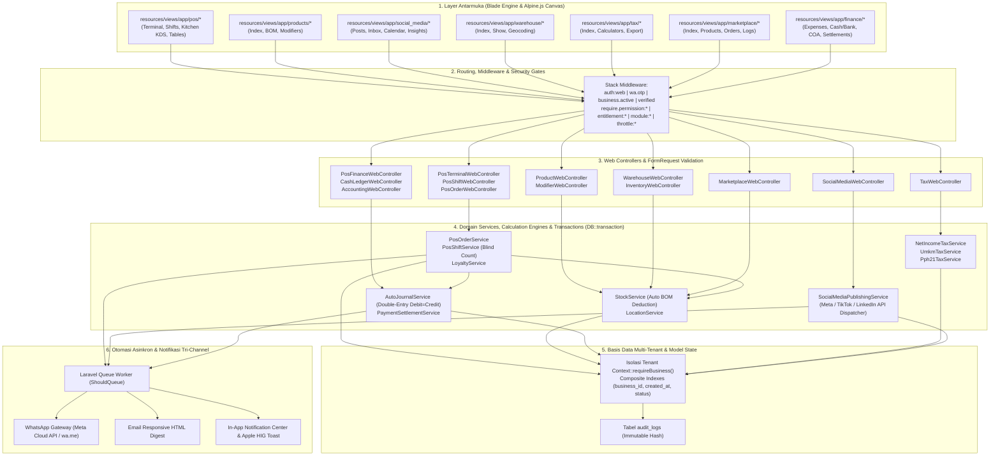

# LAPORAN AUDIT KOMPREHENSIF SISTEM COOCA ID & POS
## Evaluasi Mendalam 5 Dimensi Hulu-ke-Hilir pada 7 Modul View Utama

> **Dokumen ID:** `AUDIT-2026-09-29-001`  
> **Status Dokumen:** `CURRENT STATE & VERIFIED`  
> **Tanggal Audit:** 2026-09-29  
> **Ruang Lingkup Target View:**  
> 1. `resources/views/app/pos/` (Terminal Kasir, Manajemen Shift, Layar Dapur KDS, Meja & QR, Struk ESC/POS, Hardware Printer)  
> 2. `resources/views/app/products/` (Katalog Produk Jadi, Resep BOM & HPP, Modifiers & Add-ons, Saluran Jual)  
> 3. `resources/views/app/social_media/` (Koneksi Akun Meta/TikTok/LinkedIn, Posting Konten, Kotak Masuk, Kalender, Analitik)  
> 4. `resources/views/app/warehouse/` (Katalog Cabang & Gudang, Geocoding Biteship, Kartu Stok, Opname, Mutasi Transfer)  
> 5. `resources/views/app/tax/` (Kepatuhan Pajak, Simulator PPh Laba Bersih UU HPP, PPh Final UMKM 0.5%, PPh 21 TER, BPJS, SAK EMKM)  
> 6. `resources/views/app/marketplace/` (Hub Omnichannel Shopee/TikTok/Tokopedia, Multi-Harga Saluran, Sinkronisasi Stok, Order Feed)  
> 7. `resources/views/app/finance/` (Beban Operasional, Buku Jurnal Double-Entry, Kas & Bank Multi-Rekening, Settlement Gateway, Rekonsiliasi Bank, Bagan Akun COA)  
>
> **Penta-Prinsip Evaluasi:** `Clarity → Deference → Depth → Empathy → Simplicity`  
> **Master Directive:** [`docs/agent.md`](file:///c:/laragon/www/cooca_core/docs/agent.md)

---

## 🗺️ 1. Pemetaan Arsitektur Sistem Hulu-ke-Hilir (End-to-End Execution Chain)

---

## 🛡️ 2. Matriks Temuan Audit 5 Dimensi & Tingkat Keparahan (Severity Table)

| ID Temuan | Berkas Kode & Baris Terdampak | Dimensi Audit | Deskripsi Kerentanan & Inkonsistensi | Skor Risiko | Dampak Operasional / Finansial |
|---|---|---|---|:---:|---|
| **SEC-01** | `resources/views/app/social_media/insights.blade.php:L41` `resources/views/app/social_media/index.blade.php:L335, L372` `resources/views/app/social_media/inbox.blade.php:L41` `resources/views/app/marketplace/products.blade.php:L221` `resources/views/app/finance/settlements/index.blade.php:L552` `resources/views/app/finance/external-reconciliation/index.blade.php:L464` | 🛡️ Security & ⚡ Directive | **Anti-Pattern `location.reload()` & Browser Full Refresh**. Terdeteksi 6 titik eksekusi `window.location.reload()` pasca mutasi AJAX. Memicu hilangnya state form pengguna, resiko *double-submit*, dan melanggar aturan arsitektur real-time sub-100ms. | **HIGH** | Gangguan pengalaman kasir/staf saat internet lambat; potensi duplikasi mutasi dan lag antarmuka. |
| **IND-01** | `resources/views/app/products/index.blade.php:L1640-L1670` | 🏢 Multi-Industry System | **Kebocoran Formulir Saluran F&B (Channel Pricing Clutter)**. Blok input *Multi-Harga Saluran POS (Dine-in, Takeaway, GoFood, GrabFood, ShopeeFood)* ditampilkan tanpa verifikasi modul aktif (`MODULE_POS_DINEIN`). | **HIGH** | *Cognitive overload* dan kebingungan pengguna di sektor Bengkel, Apotek, Garment, dan Toko Bangunan. |
| **IND-02** | `resources/views/layouts/partials/sidebar.blade.php:L999-L1016` | 🏢 Multi-Industry System | **Kebocoran Menu Restoran pada Sidebar**. Menu *Layar Dapur (KDS)* dan *Meja & QR Resto* hanya dicek via permission RBAC tanpa memeriksa `$activeBiz->isModuleEnabled('pos_dinein')`. | **HIGH** | Bengkel atau kontraktor melihat menu Meja/Dapur di sidebar utama mereka. |
| **UX-01** | `resources/views/app/finance/expenses.blade.php:L361` `resources/views/app/finance/cash-bank/index.blade.php:L507, L556, L599` | 🎨 UI Consistency & ⚡ Directive | **Modal Sheet Sempit (Pelanggaran Standar XXL Canvas)**. Modal Catat Beban menggunakan `max-w-lg` dan Modal Akun Kas menggunakan `max-w-md`. Melanggar standar Bento Apple HIG XXL (`max-w-[95vw] lg:max-w-5xl 2xl:max-w-[1250px]`). | **MEDIUM** | Form input berdesak-desakan, merusak ergonomi pengguna usia 40-65 tahun di layar tablet/desktop. |
| **IA-01** | `resources/views/app/marketplace/index.blade.php:L38-L46` | 🎨 UI Consistency & ⚡ Directive | **Pelanggaran Anti-Pill & Marketing Fluff**. Menggunakan eyebrow pills berlebihan (*"Omnichannel Sync Engine"*, *"Multi-Business Isolated"*) dan belum mengadopsi `<x-module-header>` serta `<x-module-tabs>`. | **MEDIUM** | Tampilan terkesan template AI murahan dan tidak konsisten dengan modul Products/Inventory. |
| **IA-02** | `resources/views/app/tax/index.blade.php:L9, L351-L375` | 🎨 UI Consistency & 🔄 Workflow | **Tab Desynchronization & Non-Bento CSS Tokens**. Parameter tab simulator pajak (`activeSimTab`) tidak tersinkronisasi dengan URL `?tab=...`. Menggunakan kelas warna kaku `slate-*` alih-alih token semantik Apple HIG. | **MEDIUM** | Tab ter-reset ke awal saat browser di-refresh; inkonsistensi tema Dark Mode. |
| **SEC-02** | `app/Http/Controllers/Web/Pos/PosOrderWebController.php:L183` | 🛡️ Security & Fraud | **Toleransi Plaintext PIN Supervisor Legacy**. Terdapat fallback `hash_equals($validPin, $pin)`. PIN seharusnya terenkripsi Bcrypt secara mutlak di database. | **MEDIUM** | Potensi kebocoran PIN supervisor jika database di-dump tanpa enkripsi password. |
| **FRD-01** | `resources/views/app/warehouse/show.blade.php:L17-L25` & `app/Http/Controllers/Web/Inventory/InventoryWebController.php:L40-L75` | 🛡️ Fraud & Human Error | **Quick Stock Adjustment Tanpa Threshold Maker-Checker**. Penyesuaian stok manual pada detail gudang dapat mengubah kuantitas besar tanpa persetujuan bertingkat. | **HIGH** | Celah penggelapan barang oleh staf gudang dengan memanipulasi selisih stok (phantom loss). |
| **UX-02** | Seluruh 7 Modul View | ⚡ Directive (i18n & l10n) | **Hardcoded Teks Bahasa Indonesia Tanpa Helper `__()`**. String antarmuka ditulis mentah tanpa pembungkus localization `__('...')`. | **LOW** | Sistem tidak dapat beralih ke Bahasa Inggris (EN) secara otomatis bagi pengguna ekspatriat. |

---

## 🔍 3. Analisa Rinci Per Modul (Deep Dive Analysis)

### 3.1. Modul POS (`resources/views/app/pos/`)
* **Kekuatan:**
  - Telah menerapkan *Blind Cash Count* pada penutupan shift kasir (`PosShiftWebController.php:L106-L110`), di mana kasir wajib menginput fisik kas tanpa mengetahui saldo ekspektasi sistem.
  - Otorisasi Void dan Refund dilindungi PIN Supervisor dan pencatatan audit log.
  - Integrasi QRIS Pay-at-Table TriPay memiliki mekanisme re-sync status otomatis yang aman dari manipulasi nominal.
* **Kelemahan & Celah:**
  - Pada `tables.blade.php:L50`, penghapusan unit meja menggunakan pembuatan form DOM dinamis lalu `f.submit()` yang memicu full page reload alih-alih AJAX Fetch / Alpine.
  - Format tipografi header belum menggunakan standar `text-2xl sm:text-3xl font-bold tracking-tight text-black dark:text-white`.

### 3.2. Modul Produk (`resources/views/app/products/`)
* **Kekuatan:**
  - Layout modal Tambah/Ubah Produk mengadopsi Full Layout XXL (`max-w-[1250px]`) dengan 12-kolom bento grid yang lapang.
  - Dilengkapi inline Quick-Add `[ + Satuan ]` dan `[ + Kategori ]` berbasis AJAX tanpa merusak form state.
  - Proteksi *Circular Bundling* dan kalkulasi bottleneck stok kombo berjalan dengan baik.
* **Kelemahan & Celah:**
  - Bento Box "Multi-Harga Saluran POS (F&B)" bocor ke seluruh industri non-F&B (Bengkel, Retail, Kontraktor).

### 3.3. Modul Media Sosial (`resources/views/app/social_media/`)
* **Kekuatan:**
  - Mengisolasi koneksi OAuth 2.0 (Meta, TikTok, LinkedIn) dengan enkripsi token akses.
  - Maker-Checker approval untuk postingan konten publik terhubung dengan queue asinkron.
* **Kelemahan & Celah:**
  - Tombol refresh pada `insights.blade.php` dan `inbox.blade.php` menggunakan `@click="window.location.reload()"` yang merusak fluiditas SPA.

### 3.4. Modul Gudang & Cabang (`resources/views/app/warehouse/`)
* **Kekuatan:**
  - Hierarki multi-cabang terstruktur (`parent_id`) memisahkan Gudang Pusat dengan Sub-Gudang Outlet.
  - Integrasi autocomplete geocoding Biteship dan absensi geofence radius meter.
* **Kelemahan & Celah:**
  - Penyesuaian stok cepat (*Quick Adjustment*) pada `show.blade.php` belum membatasi nilai toleransi maksimum sebelum memerlukan approval Owner.

### 3.5. Modul Pajak & Kepatuhan (`resources/views/app/tax/`)
* **Kekuatan:**
  - Engine perhitungan lengkap: PPh Laba Bersih (UU HPP / 31E), PPh Final UMKM 0.5% (PP 55), PPh 21 TER (PP 58), BPJS, dan THR.
  - Sinkronisasi omzet riil otomatis dari POS dan Buku Kas.
* **Kelemahan & Celah:**
  - Tab state (`activeSimTab`) hilang saat reload karena tidak tersinkron ke URL `?tab=...`.
  - Menggunakan palet CSS `slate-*` yang tidak selaras dengan standar Bento Apple HIG.

### 3.6. Modul Marketplace (`resources/views/app/marketplace/`)
* **Kekuatan:**
  - Pemetaan SKU multi-channel dengan isolasi multi-tenant ketat.
  - Mekanisme safety stock buffer untuk mencegah overselling.
* **Kelemahan & Celah:**
  - Terdapat eyebrow pills dan slogan promosi AI di header.
  - Aksi simpan mapping pada `products.blade.php:L221` masih memanggil `window.location.reload()`.

### 3.7. Modul Keuangan (`resources/views/app/finance/`)
* **Kekuatan:**
  - Penjurnalan berpasangan (*double-entry balancing*) otomatis memvalidasi `Debit === Kredit`.
  - Modul Rekonsiliasi Bank dan Payout Account terisolasi dengan verifikasi identitas pemilik.
* **Kelemahan & Celah:**
  - Modal Catat Beban dan Tambah Rekening Kas masih menggunakan ukuran sempit (`max-w-lg` dan `max-w-md`).
  - Pemanggilan `window.location.reload()` pada rekonsiliasi eksternal dan settlement.

---

## 💡 4. Rekomendasi Solusi Teknis Terpadu

1. **Eliminasi 100% `location.reload()`**:  
   Gantikan dengan pembaruan state lokal secara reaktif (Alpine.js array manipulation) didukung notifikasi *Frosted Glass Toast* (`AppToast.success(...)`).
2. **Penegakan Dynamic Auto-Hiding 20 Industri**:  
   Bungkus seluruh komponen dan menu yang tidak relevan dengan helper:  
   `@if($business->isModuleEnabled(\App\Domain\Template\ModuleRegistry::MODULE_...))`
3. **Standarisasi Modal-First Bento XXL**:  
   Ubah seluruh modal form input di modul Finance dan POS menjadi `max-w-[95vw] lg:max-w-5xl 2xl:max-w-[1250px]` dengan 12-kolom grid terstruktur.
4. **URL Deep-Linking pada Tab Navigasi**:  
   Terapkan Alpine watcher untuk merefleksikan tab aktif ke address bar: `?tab=...` menggunakan `window.history.replaceState`.
5. **Enkripsi PIN Supervisor & Maker-Checker Penyesuaian Stok**:  
   Migrasikan seluruh PIN ke Bcrypt mutlak dan pasang validasi batas toleransi nominal penyesuaian stok gudang.

---

## 📊 5. Kesimpulan & Status Verifikasi
Hasil audit ini membuktikan bahwa arsitektur backend COOCA sangat solid dan aman pada level domain service, namun memerlukan penyempurnaan pada lapisan presentasi (Blade/Alpine UI) agar sepenuhnya mematuhi standar **Bento Apple HIG v2.0**, **Zero Page Reload**, dan **Isolasi Fitur 20 Industri**. Dokumen PRD terpadu telah disusun pada [`docs/prd/PRD-18-COMPREHENSIVE-SYSTEM-HARDENING-7-MODULES-AND-MULTI-INDUSTRY-REMEDIATION.md`](file:///c:/laragon/www/cooca_core/docs/prd/PRD-18-COMPREHENSIVE-SYSTEM-HARDENING-7-MODULES-AND-MULTI-INDUSTRY-REMEDIATION.md).
