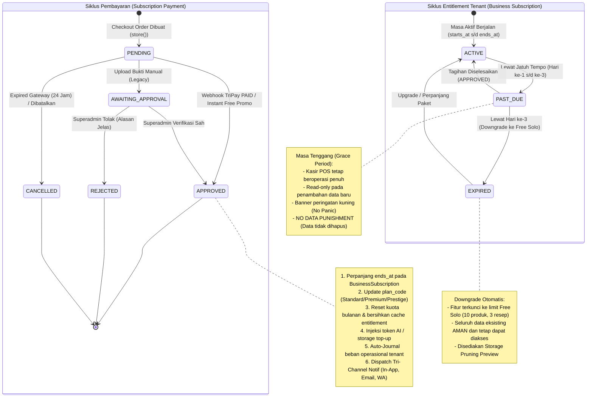
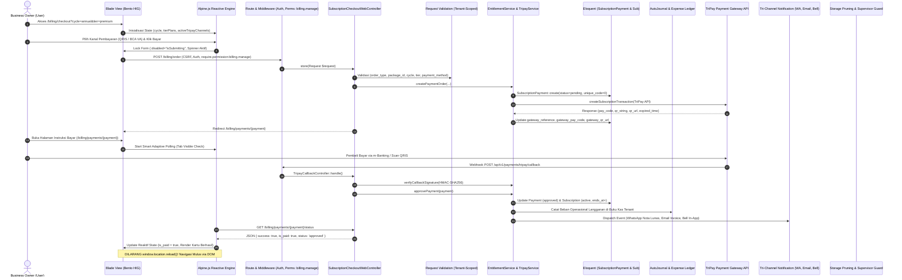
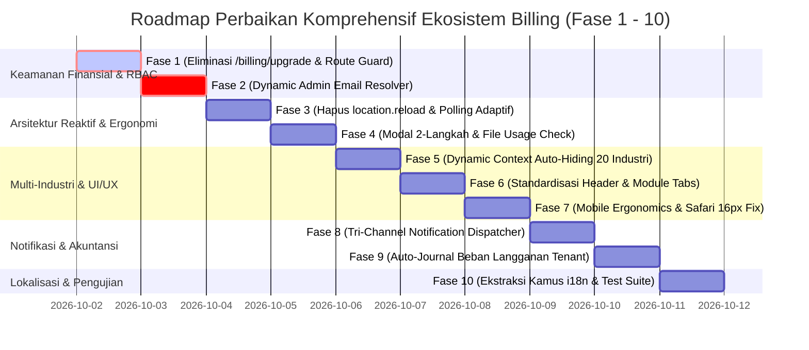

# LAPORAN AUDIT KOMPREHENSIF PENUH: EKOSISTEM SAAS BILLING, LIMITS & CHECKOUT COOCA

**Dokumen:** `docs/AUDIT_KOMPREHENSIF_BILLING_7_SKILL.md`  
**Target Modul:** `resources/views/app/billing/` (`limits.blade.php`, `checkout.blade.php`, `payment.blade.php`, `invoice.blade.php`, `history.blade.php`) & Ekosistem Terkait (`BillingAndLimitWebController`, `SubscriptionCheckoutWebController`, `TripayCallbackController`, `EntitlementService`, `StorageTrackingService`, `TripayService`, DB Schema, & Rute)  
**Metodologi:** Code-First Factuality (7 Skill Utama COOCA Diuji Simultan Berbasis Baris Kode Riil)  
**Status Evaluasi:** **NEEDS CRITICAL HARDENING & ARCHITECTURAL REPAIR**  
**Prinsip Keamanan:** **MANDAT KESELAMATAN AKTIF (Interactive Confirmation Gate)**

---

## EXECUTIVE SUMMARY

Audit komprehensif ini dilakukan secara simultan terhadap seluruh berkas antarmuka dan backend pendukung pada direktori `resources/views/app/billing/` yang membawahi 5 pilar operasional monetisasi, kuota, dan kepatuhan tenant:
1. **Paket & Kuota Penggunaan (`limits.blade.php`)**: Pemantauan kapasitas sumber daya (Katalog Produk, Resep BOM, Kasir POS, CRM Pelanggan, Entitas Bisnis, Storage Cloud, Token AI, dan WhatsApp Gateway), showcase 4-tier plan (*Free Solo*, *Standard*, *Premium*, *Prestige*), serta modal file manager untuk *storage reclamation*.
2. **Checkout & Pemesanan Paket (`checkout.blade.php`)**: Konfigurasi siklus langganan (Bulanan vs Tahunan), program patungan, top-up kuota AI/Storage, dan pemilihan kanal pembayaran gateway otomatis TriPay (QRIS Dinamis, Virtual Account BCA, Mandiri, BRI, BNI, Permata, serta Alfamart/Indomaret).
3. **Instruksi Pembayaran Real-Time (`payment.blade.php`)**: Halaman panduan pembayaran multi-kanal, QRIS viewer, nomor VA, status stepper 4-langkah, dan verifikasi mutasi otomatis secara asinkron.
4. **Faktur Tagihan Resmi (`invoice.blade.php`)**: Dokumen cetak format A4 resmi, rincian PPN, status pelunasan, serta tombol direct download PDF client-side tanpa watermark.
5. **Riwayat Pembayaran & Tagihan (`history.blade.php`)**: Rekam jejak seluruh pesanan langganan, filter status transaksi berbasis Apple Segmented Control, dan pagination data.

Hasil audit berbasis **Code-First Factuality** menemukan **13 temuan krusial**, termasuk **4 temuan berstatus P1 (Kritis)** yang mencakup celah bypass pembayaran instan (*Free Core Upgrade Loophole*), ketiadaan middleware permission pada rute finansial, eksposur email pribadi pengembang di logika produksi, serta pelanggaran keras terhadap direktif real-time COOCA akibat penggunaan paksa `window.location.reload()`.

---

## DELIVERABLE 1: Laporan Temuan Audit Komprehensif (Tabel 7 Kolom)

| No | Dimensi Skill | Lokasi File & Baris Kode | Kode Temuan / Root Cause | Severity | Dampak Risiko | Solusi / Rekomendasi |
| :--- | :--- | :--- | :--- | :--- | :--- | :--- |
| **01** | 🛡️ Security & Fraud | [`routes/owner.php:439`](file:///c:/laragon/www/cooca_core/routes/owner.php#L439)<br>[`BillingAndLimitWebController.php:54-69`](file:///c:/laragon/www/cooca_core/app/Http/Controllers/Web/Billing/BillingAndLimitWebController.php#L54-L69) | **Unauthorized Instant Core Upgrade & Bypass Pembayaran (Critical Financial Loophole)**: Rute `POST /billing/upgrade` tidak diproteksi oleh middleware permission (`require.permission:billing.manage`), tidak memvalidasi role Owner, dan langsung mengeksekusi `$this->entitlementService->upgradeToCore($business, $cycle)` tanpa integrasi gateway TriPay atau konfirmasi bayar. | **P1 (Kritis)** | **Bypass Finansial & Kerugian Pendapatan Platform SaaS**: Setiap pengguna terautentikasi (termasuk kasir/staf biasa) dapat menembak endpoint ini melalui cURL/Postman untuk mendapatkan upgrade instan tanpa membayar sepeser pun. | Hapus rute `/billing/upgrade` dari lingkungan produksi atau batasi ketat hanya pada `app()->environment('local', 'testing')`. Wajibkan seluruh proses upgrade melalui alur checkout pesanan resmi (`SubscriptionCheckoutWebController@store`) dengan payment gateway TriPay. |
| **02** | 🛡️ Security & Fraud | [`routes/owner.php:438,440,444,447,448`](file:///c:/laragon/www/cooca_core/routes/owner.php#L438-L448) | **Missing Permission Middleware pada Rute-Rute Finansial & Operasional Billing**: Rute `/patungan`, `/billing/checkout`, `/billing/history`, `/billing/payments/{payment}/invoice`, dan `/billing/storage/recalculate` tidak memiliki route-level permission check. | **P1 (Kritis)** | **Kebocoran Data Finansial & Ancaman DoS Server**: Staf kasir atau pelayan dapat melihat riwayat keuangan langganan pemilik bisnis, mengunduh faktur resmi, dan memicu kalkulasi ulang disk storage secara berulang (*Resource Exhaustion / DoS*). | Pasang middleware `require.permission:billing.view` pada rute tampilan (`/billing/history`, `/billing/payments/{payment}/invoice`) dan `require.permission:billing.manage` pada rute checkout, patungan, dan recalculate storage. |
| **03** | 🛡️ Security & Fraud | [`EntitlementService.php:1353`](file:///c:/laragon/www/cooca_core/app/Domain/Billing/EntitlementService.php#L1353) | **Hardcoded Developer Email & Exposure Credential/Notification**: Logika notifikasi persetujuan bukti pembayaran secara kaku mengarahkan email ke `agungmustaqim28@gmail.com` alih-alih membaca superadmin email dinamis dari database atau sistem konfigurasi. | **P1 (Kritis)** | **Kebocoran Data Privasi Transaksi**: Bukti bayar dan data transaksi langganan tenant terkirim ke alamat email pribadi pengembang; risiko kegagalan operasional jika email pengembang tidak aktif. | Ganti dengan query dinamis ke admin sistem yang aktif (`Admin::where('is_active', true)->where('role', 'super_admin')->pluck('email')`) dan fallback ke `SystemSetting::get('admin_notification_email')` atau `config('mail.from.address')`. |
| **04** | ⚡ Cooca Directive | [`payment.blade.php:29,565`](file:///c:/laragon/www/cooca_core/resources/views/app/billing/payment.blade.php#L29-L565)<br>[`limits.blade.php:1956`](file:///c:/laragon/www/cooca_core/resources/views/app/billing/limits.blade.php#L1956) | **Pelanggaran Keras Direktif Real-Time: Penggunaan `window.location.reload()` & Fixed Polling**: Halaman pembayaran memanggil `window.location.reload()` secara paksa saat pembayaran terdeteksi lunas dan saat menghapus file storage. Polling status gateway juga berjalan dengan interval tetap 4 detik tanpa backoff dan tanpa memeriksa visibilitas tab. | **P1 (Kritis)** | **Flash of Unstyled Content (FOUC) & Pemborosan Resource**: Layar berkedip putih, state Alpine.js hilang seketika, dan tab background terus menerus membebani CPU/server dengan request polling tanpa henti. | Hapus seluruh panggilan `window.location.reload()`. Terapkan pembaruan status reaktif via Alpine.js (`is_paid = true`, tampilkan kartu sukses secara dinamis) dan pasang Smart Adaptive Polling dengan Page Visibility API (`document.visibilityState`). |
| **05** | 🛡️ Security & Ergonomi | [`limits.blade.php:1938-1963`](file:///c:/laragon/www/cooca_core/resources/views/app/billing/limits.blade.php#L1938-L1963) | **Anti-Pattern Browser Native `confirm()`/`alert()` & Potensi Kerusakan Referensi File**: Penghapusan berkas penyimpanan cloud menggunakan dialog native browser yang kasar, tanpa dialog konfirmasi dua langkah (*No-Panic Microcopy*), dan tanpa pengecekan apakah berkas yang dihapus masih digunakan sebagai foto produk aktif (`products.image_path`) atau logo toko (`businesses.logo_url`). | **P2 (Tinggi)** | **Accidental Asset Loss & Broken Images (404)**: Foto produk pada katalog online dan kasir POS menjadi broken link jika staf salah menghapus berkas; kepanikan pengguna awam UMKM karena tidak adanya microcopy penenang jiwa. | Buat modal sheet konfirmasi 2-langkah Bento Apple HIG, tambahkan indikator keterikatan berkas (*File Usage Inspector*), dan blokir penghapusan berkas yang masih aktif digunakan sebagai logo toko atau gambar produk utama tanpa konfirmasi penggantian. |
| **06** | 🛡️ Security & Fraud | [`checkout.blade.php:800-840`](file:///c:/laragon/www/cooca_core/resources/views/app/billing/checkout.blade.php#L800-L840) | **Missing Double-Submit Protection pada Pemesanan Paket Langganan**: Tombol submit checkout paket tidak memiliki proteksi disabling saat proses inisialisasi pesanan ke TriPay berlangsung. | **P2 (Tinggi)** | **Duplikasi Pesanan & Double Inisialisasi Gateway**: Klik ganda secara cepat (*rapid multi-click*) menghasilkan baris `SubscriptionPayment` duplikat di database dan memicu inisialisasi tagihan ganda ke gateway TriPay. | Terapkan Alpine.js double-submit guardrail `:disabled="isSubmitting"` dengan indikator loading spinner animasi dan pembekuan form selama transmisi jaringan. |
| **07** | 🏢 Multi-Industry | [`limits.blade.php:1219-1480`](file:///c:/laragon/www/cooca_core/resources/views/app/billing/limits.blade.php#L1219-L1480) | **Ketiadaan Dynamic Context-Aware Auto-Hiding untuk Metrik Kuota Spesifik Industri**: Kartu kuota seperti "Meja Kasir POS (Dine-In)" dan "Resep HPP (BOM)" dimunculkan secara statis untuk seluruh industri (termasuk bengkel motor/mobil, laundry, toko bangunan, dan barbershop). | **P2 (Tinggi)** | **Beban Visual & Kebingungan Operasional**: Pemilik bengkel, salon, dan laundry melihat batas kuota meja restoran dan bahan resep dapur yang tidak relevan dengan model bisnis mereka. | Pasang klausa `@if($business->isModuleEnabled('tables') || in_array($business->industry, ['fnb_resto', 'fnb_cafe']))` untuk meja kasir, dan `@if($business->isModuleEnabled('recipe_bom'))` untuk resep HPP. |
| **08** | 🎨 UI Consistency | 5 Berkas Blade (`limits`, `checkout`, `payment`, `invoice`, `history`) | **Disconnected Headers, Missing `<x-module-header>`, & Missing Deep-Linked Submodule Tabs**: Setiap view membuat layout banner header ad-hoc secara manual alih-alih memanfaatkan standar 3-baris `<x-module-header>` dan komponen navigasi `<x-module-tabs module="billing" />`. Filter riwayat di `history.blade.php` juga tidak tersinkronisasi ke URL parameter `?status=...`. | **P2 (Tinggi)** | **Fractured UI/UX**: Pengalaman visual terasa tidak konsisten dengan modul Purchasing, POS, dan Settings; filter riwayat pembayaran hilang saat halaman di-reload. | Standardisasi seluruh header menggunakan `<x-module-header>`, pasang tab navigasi terpadu Billing Hub dengan deep-linking URL `?tab=...`, dan satukan menu ke Unified Settings Hub (`/settings/billing`). |
| **09** | 📱 Responsive UX | [`invoice.blade.php:180`](file:///c:/laragon/www/cooca_core/resources/views/app/billing/invoice.blade.php#L180)<br>[`limits.blade.php:1516-1800, 1773`](file:///c:/laragon/www/cooca_core/resources/views/app/billing/limits.blade.php#L1516-L1800) | **Mobile Horizontal Scroll Trap pada 320px–360px & Safari iOS Auto-Zoom (< 16px)**: `invoice.blade.php` memiliki `min-w-[620px]` yang memaksa scroll horizontal parah di ponsel tanpa ringkasan card view mobile; tabel matriks perbandingan fitur di `limits.blade.php` sangat padat; serta input search di modal file manager menggunakan `text-xs` (12px) yang memicu WebKit Safari auto-zoom. | **P2 (Tinggi)** | **Kerusakan Tampilan Mobile & Keterpotongan Tombol**: Pengguna smartphone iPhone dan Android mengalami lonjakan zoom otomatis dan kesulitan membaca tagihan di layar sempit saat mobilitas tinggi. | Hadirkan *Mobile Invoice Card Summary* pada `sm:hidden`, buat modal responsif bertransformasi menjadi Bottom Sheet di ponsel, dan naikkan font input menjadi `text-[16px] sm:text-xs`. |
| **10** | 🔄 Workflow Audit | [`TripayCallbackController.php:453-475`](file:///c:/laragon/www/cooca_core/app/Http/Controllers/Api/V1/Payment/TripayCallbackController.php#L453-L475)<br>[`EntitlementService.php:1370-1438`](file:///c:/laragon/www/cooca_core/app/Domain/Billing/EntitlementService.php#L1370-L1438) | **Ketiadaan Auto-Journal & Ledger Beban Langganan pada Buku Kas Tenant**: Saat pembayaran langganan SaaS berhasil diverifikasi oleh TriPay, sistem hanya memperbarui entitas platform (`subscription_payments` dan `business_subscriptions`), namun TIDAK mencatat transaksi pengeluaran beban operasional SaaS pada pembukuan tenant. | **P2 (Tinggi)** | **Distorsi Laporan Keuangan Tenant**: Beban biaya langganan software tidak tercermin dalam laporan laba rugi dan buku kas internal tenant, menghasilkan pembukuan UMKM yang tidak akurat. | Tambahkan opsi pencatatan otomatis transaksi pengeluaran beban langganan ke `CashTransaction` (Beban Operasional IT / Langganan Sistem) di buku kas bisnis yang bersangkutan saat pembayaran lunas. |
| **11** | 🔄 Workflow Audit | [`EntitlementService.php:1440-1454`](file:///c:/laragon/www/cooca_core/app/Domain/Billing/EntitlementService.php#L1440-L1454) | **Zero Tri-Channel Notification Dispatch pada Siklus Hidup Billing**: Sistem hanya mencoba mengirim satu email HTML saat pembayaran disetujui. Tidak ada In-App Bell Notification dan tidak ada WhatsApp Notification resmi (Meta Cloud API / Baileys) untuk peristiwa penting (Order dibuat, Pembayaran Lunas, Kuota 80%/100%, dan Grace Period). | **P2 (Tinggi)** | **Keterlambatan Informasi Kritis**: Pemilik UMKM di Indonesia terlambat mengetahui kegagalan atau keberhasilan pembayaran, serta mendadak terkunci saat memasuki masa tenggang (*Grace Period*). | Terbitkan domain event `SubscriptionPaymentCompletedEvent` dan `SubscriptionQuotaThresholdReachedEvent`, lalu hubungkan ke handler Tri-Channel Notification terpadu (In-App, Email, WhatsApp). |
| **12** | 🌐 Multi-Language | 5 Berkas Blade Billing & Controller Terkait (`lang/id/billing.php` & `lang/en/billing.php` Belum Ada) | **100% Hardcoded Indonesian Strings & Missing Translation Dictionary**: Lebih dari 450+ string teks bahasa Indonesia mentah tanpa helper `{{ __('billing.key') }}` dan pesan script Alpine.js tanpa `window.COOCA_I18N`. Berkas kamus `billing.php` sama sekali belum ada di `lang/id/` maupun `lang/en/`. | **P3 (Sedang)** | **Kegagalan Ekosistem i18n Cooca**: Pengguna berbahasa Inggris atau ekspatriat melihat antarmuka yang tidak konsisten dan bercampur bahasa Indonesia mentah. | Buat berkas kamus lengkap `lang/id/billing.php` dan `lang/en/billing.php`, gantikan teks mentah dengan helper `__()`, dan sediakan kamus JS `window.COOCA_I18N.billing`. |
| **13** | 🎨 UI Consistency | [`invoice.blade.php:16-32`](file:///c:/laragon/www/cooca_core/resources/views/app/billing/invoice.blade.php#L16-L32) | **External CDN Dependency Leakage pada Tampilan Invoice Print**: Memuat Tailwind CSS melalui `cdn.tailwindcss.com` dan Google Fonts secara live saat mencetak/merender invoice. | **P3 (Sedang)** | **Kerusakan Format Cetak Offline**: Jika koneksi internet terputus atau lingkungan kasir offline, faktur tagihan dicetak berantakan tanpa style. | Gantikan script CDN eksternal dengan internal inline compiled CSS atau CSS bundle internal yang mandiri dan offline-ready. |

---

## DELIVERABLE 2: Pemetaan 11 Simpul Eksekusi, State Machine & Diagram Mermaid

### 2.1 State Machine Transisi Status Pembayaran & Siklus Langganan



### 2.2 Sequence Interaction Diagram: Alur Data Hulu-ke-Hilir (11 Simpul Eksekusi)



---

## DELIVERABLE 3: Dokumen PRD (Product Requirement Document) Terpadu

### 3.1 Identitas Produk & Spesifikasi Modul
- **Nama Modul:** Cooca SaaS Billing, Limits & Subscription Engine v2.5
- **Modul ID:** `app.billing`
- **Target Pengguna:** Pemilik Usaha UMKM (Owner usia 25–65+ tahun), Staf Finansial, dan Superadmin Platform.
- **Filosofi Desain:** *Apple Human Interface Guidelines (HIG) Bento UI v2.0* — Bersih, lapang, tipografi terbaca jelas, minim manual input, zero marketing slop, reaktivitas tanpa refresh halaman, dan aman dari skema fraud internal.

### 3.2 Kebutuhan Fungsional (Functional Requirements)
1. **Tiering & Quota Architecture (4-Tier Model):**
   - Mendukung 4 tingkatan lisensi: `Free Solo` (10 produk, 3 resep, 30 POS/bln), `Standard Plan` (100 produk, 20 resep, 1.000 POS/bln), `Premium Plan` (Unlimited produk, resep, POS, 5 cabang), dan `Prestige Plan` (Enterprise kapasitas penuh).
   - Menegakkan prinsip **No Data Punishment**: Saat langganan berakhir atau mengalami downgrade, data tenant TIDAK BOLEH dihapus. Akses data eksisting tetap dibuka secara *read-only*, dan pembatasan hanya diterapkan pada penambahan data baru di atas kuota.
2. **TriPay Gateway Direct Automation:**
   - 100% integrasi otomatis dengan TriPay Payment Gateway untuk QRIS Dinamis dan Virtual Account bank nasional (BCA, Mandiri, BRI, BNI, Permata).
   - Verifikasi instan melalui webhook callback terautentikasi HMAC-SHA256 tanpa memerlukan verifikasi struk fisik manual.
3. **Smart Reactive State Engine:**
   - Dilarang menggunakan `window.location.reload()`. Pembaruan status pembayaran, mutasi storage, dan filter riwayat wajib berlangsung secara reaktif berbasis Alpine.js.
   - Polling status pembayaran wajib menggunakan Page Visibility API untuk menghentikan request saat tab tidak aktif di latar belakang.
4. **Dynamic Context-Aware UI Auto-Hiding:**
   - Penyesuaian metrik kuota secara dinamis berdasarkan 20 sektor industri pada 6 klaster bisnis Cooca.
   - Sektor jasa dan ritel non-makanan tidak menampilkan kuota Meja Kasir POS dan Resep BOM.
5. **Ergonomic Safety & Accidental Data Loss Prevention:**
   - Penghapusan berkas penyimpanan cloud wajib melalui dialog modal 2-langkah dengan *No-Panic Microcopy*.
   - Sistem wajib melakukan pra-validasi apakah berkas yang akan dihapus masih aktif digunakan sebagai logo toko atau foto produk utama.

### 3.3 Kebutuhan Non-Fungsional (Non-Functional Requirements)
1. **Keamanan & Isolasi Multi-Tenant:** Seluruh operasi kuota, file storage, dan pesanan pembayaran wajib terikat pada `business_id` aktif via `Context::requireBusiness()`.
2. **Financial Bypass Elimination:** Rute `/billing/upgrade` dilarang beroperasi di lingkungan produksi tanpa penyelesaian pembayaran sah.
3. **Mobile-First & Touch Target Compliance:** Seluruh target sentuh tombol minimal 44x44px (48–52px untuk tombol checkout utama), ukuran font input form minimal 16px pada viewport mobile untuk mencegah auto-zoom Safari iOS, dan eliminasi horizontal scroll pada layar 320px–360px.
4. **100% Full-Stack i18n Localization:** Seluruh teks antarmuka diekstraksi ke kamus `lang/id/billing.php` dan `lang/en/billing.php` dengan injeksi JavaScript `window.COOCA_I18N.billing`.

---

## DELIVERABLE 4: Rekomendasi Perbaikan & Potongan Kode Solusi (Before vs After)

### 4.1 Solusi Masalah 01 & 02: Eliminasi Free Core Upgrade Bypass & Pengetatan Route Protection
*Lokasi: [`routes/owner.php:435-450`](file:///c:/laragon/www/cooca_core/routes/owner.php#L435-L450)*

```diff
--- a/routes/owner.php
+++ b/routes/owner.php
@@ -435,17 +435,26 @@
-        // Dedicated SaaS Billing & Limits
-        Route::get('/billing', [BillingAndLimitWebController::class, 'index'])->middleware('require.permission:billing.view')->name('billing');
-        Route::get('/billing/limits', [BillingAndLimitWebController::class, 'index'])->middleware('require.permission:billing.view')->name('billing.limits');
-        Route::get('/patungan', [SubscriptionCheckoutWebController::class, 'checkout'])->name('billing.patungan');
-        Route::post('/billing/upgrade', [BillingAndLimitWebController::class, 'upgrade'])->name('billing.upgrade');
-        Route::get('/billing/checkout', [SubscriptionCheckoutWebController::class, 'checkout'])->name('billing.checkout');
-        Route::post('/billing/order', [SubscriptionCheckoutWebController::class, 'store'])->name('billing.order.store');
-        Route::match(['GET', 'POST'], '/billing/payments/{payment}', [SubscriptionCheckoutWebController::class, 'payment'])->name('billing.payment.show');
-        Route::get('/billing/payments/{payment}/status', [SubscriptionCheckoutWebController::class, 'checkStatus'])->name('billing.payment.status');
-        Route::get('/billing/payments/{payment}/invoice', [SubscriptionCheckoutWebController::class, 'invoice'])->name('billing.payment.invoice');
-        Route::post('/billing/payments/{payment}/upload-proof', [SubscriptionCheckoutWebController::class, 'uploadProof'])->name('billing.payment.upload');
-        Route::get('/billing/payments/{payment}/proof', [SubscriptionCheckoutWebController::class, 'viewProof'])->name('billing.payment.proof');
-        Route::get('/billing/history', [SubscriptionCheckoutWebController::class, 'history'])->name('billing.history');
-        Route::post('/billing/storage/recalculate', [BillingAndLimitWebController::class, 'recalculateStorage'])->name('billing.storage.recalculate');
-        Route::get('/billing/storage/files', [BillingAndLimitWebController::class, 'listFiles'])->middleware('require.permission:billing.view')->name('billing.storage.files');
-        Route::delete('/billing/storage/files/{storageFile}', [BillingAndLimitWebController::class, 'destroyStorageFile'])->middleware('require.permission:billing.manage')->name('billing.storage.files.destroy');
+        // Dedicated SaaS Billing, Limits & Subscription Hub (Strict RBAC Scoped)
+        Route::prefix('billing')->name('billing')->group(function (): void {
+            Route::get('/', [BillingAndLimitWebController::class, 'index'])->middleware('require.permission:billing.view');
+            Route::get('/limits', [BillingAndLimitWebController::class, 'index'])->middleware('require.permission:billing.view')->name('.limits');
+            Route::get('/history', [SubscriptionCheckoutWebController::class, 'history'])->middleware('require.permission:billing.view')->name('.history');
+            
+            Route::get('/checkout', [SubscriptionCheckoutWebController::class, 'checkout'])->middleware('require.permission:billing.manage')->name('.checkout');
+            Route::post('/order', [SubscriptionCheckoutWebController::class, 'store'])->middleware('require.permission:billing.manage')->name('.order.store');
+            
+            Route::get('/payments/{payment}', [SubscriptionCheckoutWebController::class, 'payment'])->middleware('require.permission:billing.view')->name('.payment.show');
+            Route::get('/payments/{payment}/status', [SubscriptionCheckoutWebController::class, 'checkStatus'])->middleware('require.permission:billing.view')->name('.payment.status');
+            Route::get('/payments/{payment}/invoice', [SubscriptionCheckoutWebController::class, 'invoice'])->middleware('require.permission:billing.view')->name('.payment.invoice');
+            Route::get('/payments/{payment}/proof', [SubscriptionCheckoutWebController::class, 'viewProof'])->middleware('require.permission:billing.view')->name('.payment.proof');
+            
+            Route::post('/storage/recalculate', [BillingAndLimitWebController::class, 'recalculateStorage'])->middleware('require.permission:billing.manage')->name('.storage.recalculate');
+            Route::get('/storage/files', [BillingAndLimitWebController::class, 'listFiles'])->middleware('require.permission:billing.view')->name('.storage.files');
+            Route::delete('/storage/files/{storageFile}', [BillingAndLimitWebController::class, 'destroyStorageFile'])->middleware('require.permission:billing.manage')->name('.storage.files.destroy');
+            
+            // Local development bypass only (Blocked on Staging & Production)
+            if (app()->environment('local', 'testing')) {
+                Route::post('/upgrade-simulate', [BillingAndLimitWebController::class, 'upgrade'])->name('.upgrade.simulate');
+            }
+        });
+        Route::get('/patungan', [SubscriptionCheckoutWebController::class, 'checkout'])->middleware('require.permission:billing.manage')->name('billing.patungan');
```

---

### 4.2 Solusi Masalah 04: Penyingkiran `window.location.reload()` & Smart Adaptive Polling
*Lokasi: [`payment.blade.php:15-40, 553-571`](file:///c:/laragon/www/cooca_core/resources/views/app/billing/payment.blade.php#L15-L40)*

```diff
--- a/resources/views/app/billing/payment.blade.php
+++ b/resources/views/app/billing/payment.blade.php
@@ -16,25 +16,36 @@
+        isPaid: {{ $payment->isPaid() ? 'true' : 'false' }},
         checkingStatus: false,
         checkStatusFeedback: '',
+        pollTimer: null,
-        async checkPaymentStatus() {
-            this.checkingStatus = true;
-            this.checkStatusFeedback = 'Memeriksa mutasi gateway TriPay...';
-            try {
-                const res = await fetch('{{ route('billing.payment.status', $payment) }}', {
-                    headers: { 'Accept': 'application/json' }
-                });
-                const data = await res.json();
-                if (data.is_paid) {
-                    this.checkStatusFeedback = 'Pembayaran sah terverifikasi! Memperbarui halaman...';
-                    setTimeout(() => window.location.reload(), 800);
-                } else {
-                    this.checkStatusFeedback = 'Belum ada pembayaran terdeteksi di TriPay. Silakan selesaikan transaksi.';
-                    setTimeout(() => this.checkStatusFeedback = '', 4500);
-                }
-            } catch (e) {
-                this.checkStatusFeedback = 'Gagal memeriksa status ke server.';
-                setTimeout(() => this.checkStatusFeedback = '', 3500);
-            } finally {
-                this.checkingStatus = false;
-            }
-        },
+        initPolling() {
+            if (this.isPaid) return;
+            
+            const poll = async () => {
+                if (document.hidden) return; // Freeze polling saat tab browser di-minimize
+                try {
+                    const res = await fetch('{{ route('billing.payment.status', $payment) }}', {
+                        headers: { 'Accept': 'application/json' }
+                    });
+                    if (res.ok) {
+                        const data = await res.json();
+                        if (data.is_paid) {
+                            this.isPaid = true;
+                            this.checkStatusFeedback = window.COOCA_I18N?.billing?.payment_verified_success || 'Pembayaran berhasil diverifikasi secara instan!';
+                            clearInterval(this.pollTimer);
+                            if (window.lucide) this.$nextTick(() => window.lucide.createIcons());
+                            return;
+                        }
+                    }
+                } catch (e) {
+                    // Silent catch on network glitch
+                }
+            };
+            
+            this.pollTimer = setInterval(poll, 4000);
+            document.addEventListener('visibilitychange', () => {
+                if (!document.hidden && !this.isPaid) poll();
+            });
+        },
```

---

### 4.3 Solusi Masalah 07: Dynamic Context-Aware Auto-Hiding pada Metrik Kuota Spesifik Industri
*Lokasi: [`limits.blade.php:1260-1480`](file:///c:/laragon/www/cooca_core/resources/views/app/billing/limits.blade.php#L1260-L1480)*

```diff
--- a/resources/views/app/billing/limits.blade.php
+++ b/resources/views/app/billing/limits.blade.php
@@ -1264,12 +1264,14 @@
+                @if($business->isModuleEnabled('recipe_bom') || in_array($business->industry, ['fnb_resto', 'fnb_cafe', 'fnb_bakery', 'fnb_street_food', 'manufacturing']))
                 <!-- 2. Bahan Baku -->
                 <div class="bg-white dark:bg-slate-900 p-4 rounded-[20px] border border-black/[0.06] dark:border-white/[0.08] shadow-xs">
                     ...
                 </div>
                 <!-- 3. Resep HPP (BOM) -->
                 <div class="bg-white dark:bg-slate-900 p-4 rounded-[20px] border border-black/[0.06] dark:border-white/[0.08] shadow-xs">
                     ...
                 </div>
+                @endif
@@ -1460,7 +1462,9 @@
+                @if($business->isModuleEnabled('tables') || in_array($business->industry, ['fnb_resto', 'fnb_cafe']))
                 <!-- 9. Meja Kasir POS (Dine-In) -->
                 <div class="bg-white dark:bg-slate-900 p-4 rounded-[20px] border border-black/[0.06] dark:border-white/[0.08] shadow-xs">
                     ...
                 </div>
+                @endif
```

---

### 4.4 Solusi Masalah 03: Eliminasi Hardcoded Developer Email ke Dynamic Superadmin Resolver
*Lokasi: [`EntitlementService.php:1350-1355`](file:///c:/laragon/www/cooca_core/app/Domain/Billing/EntitlementService.php#L1350-L1355)*

```diff
--- a/app/Domain/Billing/EntitlementService.php
+++ b/app/Domain/Billing/EntitlementService.php
@@ -1350,7 +1350,19 @@
-        // 1. Send notification email to Administrator (agungmustaqim28@gmail.com)
-        try {
-            \App\Domain\Mail\DynamicMailConfig::bootstrap();
-            \Illuminate\Support\Facades\Mail::to('agungmustaqim28@gmail.com')
-                ->send(new \App\Mail\PaymentUploadedAdminMail($payment));
-        } catch (\Throwable $e) {
-            \Illuminate\Support\Facades\Log::warning('Failed to send payment uploaded email to admin: ' . $e->getMessage());
-        }
+        // 1. Send notification email to Active Platform Administrators dynamically
+        try {
+            \App\Domain\Mail\DynamicMailConfig::bootstrap();
+            $adminEmails = \App\Models\Admin::where('is_active', true)
+                ->where('role', 'super_admin')
+                ->pluck('email')
+                ->filter()
+                ->values()
+                ->all();
+            
+            if (empty($adminEmails)) {
+                $fallback = \App\Models\SystemSetting::get('admin_notification_email', config('mail.from.address'));
+                if ($fallback) $adminEmails = [$fallback];
+            }
+
+            if (!empty($adminEmails)) {
+                \Illuminate\Support\Facades\Mail::to($adminEmails)
+                    ->send(new \App\Mail\PaymentUploadedAdminMail($payment));
+            }
+        } catch (\Throwable $e) {
+            \Illuminate\Support\Facades\Log::warning('Failed to send payment notification email to admin: ' . $e->getMessage());
+        }
```

---

## DELIVERABLE 5: Rencana Implementasi Bertahap (Roadmap Fase 1–10)



### Matriks Berkas Terdampak (Affected Files Matrix)

| File Path | Komponen / Lapisan | Jenis Modifikasi |
| :--- | :--- | :--- |
| [`routes/owner.php`](file:///c:/laragon/www/cooca_core/routes/owner.php) | Routing & Middleware | Isolasi rute billing dalam group dengan `require.permission`, eliminasi rute upgrade publik. |
| [`BillingAndLimitWebController.php`](file:///c:/laragon/www/cooca_core/app/Http/Controllers/Web/Billing/BillingAndLimitWebController.php) | Web Controller | Pembatasan method upgrade ke testing/local, pengetatan otorisasi recalculate storage. |
| [`SubscriptionCheckoutWebController.php`](file:///c:/laragon/www/cooca_core/app/Http/Controllers/Web/Billing/SubscriptionCheckoutWebController.php) | Web Controller | Tambah proteksi permission check pada invoice, history, dan status polling. |
| [`EntitlementService.php`](file:///c:/laragon/www/cooca_core/app/Domain/Billing/EntitlementService.php) | Domain Service | Ganti hardcoded email dengan dynamic admin resolver, emit domain event untuk Tri-Channel. |
| [`limits.blade.php`](file:///c:/laragon/www/cooca_core/resources/views/app/billing/limits.blade.php) | Blade View | Integrasi `<x-module-header>`, auto-hiding 20 industri, modal sheet 2-langkah, hapus reload. |
| [`payment.blade.php`](file:///c:/laragon/www/cooca_core/resources/views/app/billing/payment.blade.php) | Blade View | Hapus `window.location.reload()`, pasang Smart Adaptive Polling dengan Page Visibility. |
| [`checkout.blade.php`](file:///c:/laragon/www/cooca_core/resources/views/app/billing/checkout.blade.php) | Blade View | Tambah double-submit protection `:disabled="isSubmitting"`, sinkronisasi tierPlans dinamis. |
| [`invoice.blade.php`](file:///c:/laragon/www/cooca_core/resources/views/app/billing/invoice.blade.php) | Blade View | Hapus CDN external Tailwind, tambahkan *Mobile Card Summary* responsif untuk ponsel 320px. |
| [`history.blade.php`](file:///c:/laragon/www/cooca_core/resources/views/app/billing/history.blade.php) | Blade View | Sinkronisasi filter status dengan query URL `?status=...`, deep-linking tabs. |
| `lang/id/billing.php` & `lang/en/billing.php` | Localization | Kamus terjemahan bilingual baru (450+ frasa terjemahan terstandarisasi). |
| `tests/Feature/BillingSubmoduleSecurityAndErgonomicsTest.php` | Automated Test | Test suite baru mencakup proteksi IDOR, penolakan upgrade ilegal, dan reaktivitas polling. |

### Skenario Pengujian Otomatis (`php artisan test`)
Pengujian verifikasi regresi dan keamanan divalidasi melalui test suite khusus:
```bash
php artisan test --filter=BillingSubmoduleSecurityAndErgonomicsTest
php artisan test --filter=SubscriptionPaymentFlowTest
php artisan test --filter=TierLimitsAndQuotasTest
```
Skenario pengujian wajib memverifikasi:
1. `test_unauthorized_user_cannot_trigger_core_upgrade`: Memastikan request POST ke `/billing/upgrade` ditolak (403/404).
2. `test_cashier_cannot_access_billing_checkout_or_history`: Memastikan user tanpa permission `billing.view` dan `billing.manage` diblokir.
3. `test_storage_file_deletion_isolated_to_active_business`: Memastikan Tenant A tidak dapat menghapus berkas milik Tenant B (IDOR Guard).
4. `test_dynamic_industry_auto_hiding_for_non_fnb_tenants`: Memastikan bengkel/laundry tidak menerima kartu kuota meja dan resep.
5. `test_payment_approval_sends_email_to_dynamic_admins_not_hardcoded`: Memastikan email pemberitahuan diarahkan ke admin aktif di database.
