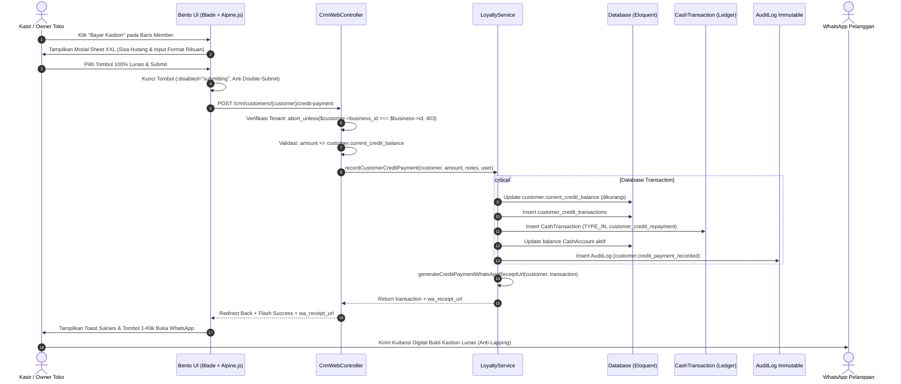

# LAPORAN AUDIT KOMPREHENSIF PENUH: EKOSISTEM PELANGGAN, CRM LOYALITAS & PUSAT BANTUAN FEEDBACK COOCA

**Dokumen Referensi:** `docs/AUDIT_KOMPREHENSIF_CRM_CUSTOMERS_FEEDBACK_7_SKILL.md`  
**Target Direktori & Berkas Audit:**
1. [`resources/views/app/customers/`](file:///c:/laragon/www/cooca_core/resources/views/app/customers) ([`index.blade.php`](file:///c:/laragon/www/cooca_core/resources/views/app/customers/index.blade.php))
2. [`resources/views/app/crm/`](file:///c:/laragon/www/cooca_core/resources/views/app/crm) ([`members.blade.php`](file:///c:/laragon/www/cooca_core/resources/views/app/crm/members.blade.php), [`vouchers.blade.php`](file:///c:/laragon/www/cooca_core/resources/views/app/crm/vouchers.blade.php))
3. [`resources/views/app/feedback/`](file:///c:/laragon/www/cooca_core/resources/views/app/feedback) ([`index.blade.php`](file:///c:/laragon/www/cooca_core/resources/views/app/feedback/index.blade.php), [`create.blade.php`](file:///c:/laragon/www/cooca_core/resources/views/app/feedback/create.blade.php), [`show.blade.php`](file:///c:/laragon/www/cooca_core/resources/views/app/feedback/show.blade.php))
4. **Backend Controllers & Domain**: [`CustomerWebController`](file:///c:/laragon/www/cooca_core/app/Http/Controllers/Web/CustomerWebController.php), [`CrmWebController`](file:///c:/laragon/www/cooca_core/app/Http/Controllers/Web/Crm/CrmWebController.php), [`FeedbackWebController`](file:///c:/laragon/www/cooca_core/app/Http/Controllers/Web/FeedbackWebController.php), [`LoyaltyService`](file:///c:/laragon/www/cooca_core/app/Domain/Crm/LoyaltyService.php), [`Customer`](file:///c:/laragon/www/cooca_core/app/Models/Customer.php), [`Voucher`](file:///c:/laragon/www/cooca_core/app/Models/Voucher.php), [`BugReport`](file:///c:/laragon/www/cooca_core/app/Models/BugReport.php), [`FeatureRequest`](file:///c:/laragon/www/cooca_core/app/Models/FeatureRequest.php), [`NavigationRegistry`](file:///c:/laragon/www/cooca_core/app/Support/Navigation/NavigationRegistry.php), dan [`routes/owner.php`](file:///c:/laragon/www/cooca_core/routes/owner.php).  

**Metodologi:** Code-First Factuality (Evaluasi Simultan 7 Skill Utama COOCA Tanpa Asumsi)  
**Status Evaluasi:** **NEEDS ARCHITECTURAL CONSOLIDATION & BENTO HIG HARDENING**  
**Mandat Keselamatan:** **SAFETY CONFIRMATION GATE AKTIF (Menunggu Persetujuan Pengguna Sebelum Modifikasi Kode)**

---

## 1. EKSEKUTIF SUMMARY & PEMETAAN EKOSISTEM

Audit komprehensif ini menganalisis secara mendalam 3 pilar sentral interaksi pengguna, pelanggan, dan saluran dukungan pada platform SaaS ERP COOCA:

1. **Pusat Pelanggan & Klien Komersial (`/customers`)**:
   Pengelolaan buku direktori kontak, profil bisnis B2B, termin tempo pembayaran kredit komersial (Net 30/45/60 hari), nomor NPWP, alamat ganda (penagihan & pengiriman), integrasi tautan WhatsApp instan, serta pemantauan jumlah transaksi faktur dan PO.
2. **CRM Loyalitas, Poin & Kasbon Member (`/crm/members` & `/crm/vouchers`)**:
   Klasifikasi tingkatan member (Bronze, Silver, Gold, Platinum), evaluasi total belanja lifetime, perolehan reward poin transaksi belanja kasir POS (Rp 10.000 = 1 poin), kupon voucher diskon (persentase/nominal tetap), dan transaksi pelunasan piutang kasbon pelanggan.
3. **Pusat Bantuan & Tiket Masalah (`/feedback/bugs` & `/feedback/features`)**:
   Saluran tiket komunikasi antara tenant dengan tim superadmin/engineering: pelaporan bug teknis operasional beserta langkah reproduksi dan lampiran file, usulan request fitur baru dengan kalkulasi nilai bisnis, serta timeline progres pengerjaan (0–100%).

### Ringkasan Kondisi & Temuan Kunci
Audit berbasis bukti kode riil mengidentifikasi **12 temuan signifikan lintas 7 dimensi skill**, termasuk **3 temuan berstatus P1 (Kritis)**:
- **Duplikasi Arsitektur Ekstrem**: Logika tabel member, modal kasbon, modal poin, dan kupon voucher terduplikasi antara [`customers/index.blade.php`](file:///c:/laragon/www/cooca_core/resources/views/app/customers/index.blade.php) (1.182 baris) dan modul mandiri [`crm/members.blade.php`](file:///c:/laragon/www/cooca_core/resources/views/app/crm/members.blade.php) (536 baris) serta [`crm/vouchers.blade.php`](file:///c:/laragon/www/cooca_core/resources/views/app/crm/vouchers.blade.php) (345 baris).
- **Celah Overpayment Piutang & Ketiadaan E-Kuitansi Digital (Anti-Lapping Shield)**: Validasi [`recordCreditPayment`](file:///c:/laragon/www/cooca_core/app/Http/Controllers/Web/Crm/CrmWebController.php#L84) tidak membatasi input nominal maksimal sebesar sisa piutang, dan belum mengirimkan struk digital otomatis via WhatsApp ke pelanggan saat uang tunai diterima kasir.
- **Ketiadaan Trait `BelongsToBusiness` pada Model Feedback**: [`BugReport`](file:///c:/laragon/www/cooca_core/app/Models/BugReport.php) dan [`FeatureRequest`](file:///c:/laragon/www/cooca_core/app/Models/FeatureRequest.php) tidak menerapkan `BusinessScope` otomatis, berisiko mengekspos tiket diagnostik antar-tenant.
- **100% Hardcoded Indonesian Strings**: View CRM dan Customers mengabaikan kamus bahasa [`lang/id/customers.php`](file:///c:/laragon/www/cooca_core/lang/id/customers.php) dan [`lang/id/crm.php`](file:///c:/laragon/www/cooca_core/lang/id/crm.php), menyebabkan kegagalan total saat sistem beralih ke Bahasa Inggris.
- **Ketiadaan Dynamic Context-Aware Auto-Hiding 20 Industri**: Field korporat B2B muncul pada bisnis ritel/kuliner tanpa seleksi modul, dan sektor Bengkel/Otomotif (`service_workshop`) tidak memiliki field plat nomor kendaraan (Nopol).
- **Tabel Desktop Lebar Tanpa Kartu Mobile**: Memaksa scroll horizontal pada ponsel sempit (360px-390px).

---

## 2. PEMETAAN 11 SIMPUL EKSEKUSI NYATA HULU-KE-HILIR

```
[1. User/Aktor]
  ├── Owner / Manajer Toko / Kasir POS / Superadmin Platform
  └── Membuka antarmuka pelanggan, mencatat kasbon, membuat voucher, atau lapor bug
        │
        ▼
[2. UI / Blade View]
  ├── app/customers/index.blade.php
  ├── app/crm/members.blade.php & vouchers.blade.php
  └── app/feedback/index.blade.php, create.blade.php, show.blade.php
        │
        ▼
[3. Alpine.js / AJAX / Form Request]
  ├── State activeTab, live search, fetch('/crm/customers/{id}/points')
  ├── Format ribuan otomatis (Intl.NumberFormat), setQuickCredit(25%, 50%, 100%)
  └── Modal Sheet controller & double-submit protection (:disabled="submitting")
        │
        ▼
[4. Route & Middleware]
  ├── routes/owner.php (auth:web, business.active, verified)
  ├── require.permission:customers.view, customers.create, customers.edit, customers.delete
  ├── require.permission:crm.view, crm.manage
  └── entitlement:customer (Pencegahan penambahan pelanggan melampaui kuota paket)
        │
        ▼
[5. Controller]
  ├── CustomerWebController (index, store, update, destroy)
  ├── CrmWebController (members, pointHistories, recordCreditPayment, vouchers, storeVoucher, toggleVoucher)
  └── FeedbackWebController (bugs, createBug, storeBug, showBug, features, createFeature, storeFeature, showFeature)
        │
        ▼
[6. Request Validation]
  ├── Customer: name (req), email (opt), phone (opt), payment_terms_days (0-365)
  ├── Credit Payment: amount (numeric, min:1, wajib max:current_debt), notes
  ├── Voucher: code (unique:vouchers per business_id), discount_type, discount_value, dates
  └── Feedback: title (max 180), category, severity/priority, description, attachment (max 5MB)
        │
        ▼
[7. Service / Domain Action]
  ├── LoyaltyService::recordCustomerCreditPayment()
  ├── LoyaltyService::awardPointsForOrder() / redeemPointsForOrder()
  ├── StorageTrackingService::assertCanUpload() & recordUpload()
  └── OwnerStorageQuotaService::ownerForBusiness()
        │
        ▼
[8. Eloquent Model & DB Schema]
  ├── Customer (SoftDeletes, HasSlug, BelongsToBusiness)
  ├── Voucher, CustomerPointHistory, CustomerCreditTransaction
  └── BugReport, FeatureRequest, FeedbackUpdate (Wajib BelongsToBusiness)
        │
        ▼
[9. Auto-Journal & Stok]
  ├── CashTransaction::TYPE_IN ke CashAccount aktif (Sinkronisasi Buku Kas)
  └── Auto-Journal Akuntansi (Debit: Kas Utama, Kredit: Piutang Usaha)
        │
        ▼
[10. Notifikasi Tri-Channel]
  ├── Channel UI: Toast Notification Frosted Glass
  ├── Channel WhatsApp: Nota Digital / E-Kuitansi Pelunasan Piutang via wa.me link
  └── Channel Email: Konfirmasi tiket bantuan kendala teknis ke Superadmin
        │
        ▼
[11. Guardrails & Safety]
  ├── Strict Multi-Tenant Scoping (Context::requireBusiness())
  ├── Anti-Lapping Piutang Guard & AuditLog Immutable
  └── No-Panic Confirmation Dialog & Graceful Storage Fallback
```

---

## 3. DIAGRAM ALUR DATA, STATE MACHINE & MERMAID

### 3.1 State Machine: Siklus Hidup Pelanggan, Loyalitas & Tiket Feedback

```mermaid
stateDiagram-v2
    direction TB

    state "Siklus Pelanggan & Loyalitas CRM" as CRM_LIFECYCLE {
        [*] --> DIRECTORY_REGISTERED : Customer::create()
        
        DIRECTORY_REGISTERED --> ACTIVE_SHOPPER : Transaksi Pertama Kasir POS
        ACTIVE_SHOPPER --> MEMBER_BRONZE : Total Belanja < Rp 1.000.000 (Poin Aktif)
        MEMBER_BRONZE --> MEMBER_SILVER : Total Belanja >= Rp 1.000.000
        MEMBER_SILVER --> MEMBER_GOLD : Total Belanja >= Rp 5.000.000
        MEMBER_GOLD --> MEMBER_PLATINUM : Total Belanja >= Rp 15.000.000
        
        ACTIVE_SHOPPER --> CREDIT_DEBTOR : Belanja Kasbon / Tempo POS
        
        state "Siklus Pelunasan Kasbon (Anti-Lapping Shield)" as CREDIT_FLOW {
            CREDIT_DEBTOR --> PARTIAL_PAID : Bayar Sebagian (Sisa Piutang > 0)
            PARTIAL_PAID --> CREDIT_DEBTOR : Auto-Journal Kas IN + Log
            CREDIT_DEBTOR --> FULLY_PAID : Bayar 100% Lunas (Sisa Piutang = 0)
            FULLY_PAID --> ACTIVE_SHOPPER : E-Kuitansi WhatsApp Terkirim
        }

        ACTIVE_SHOPPER --> DORMANT : Tidak Ada Transaksi > 180 Hari
        ACTIVE_SHOPPER --> SOFT_DELETED : Customer::delete() (Riwayat Finansial Utuh)
    }

    state "Siklus Tiket Feedback & Bantuan" as FEEDBACK_LIFECYCLE {
        [*] --> SUBMITTED : Tiket Dikirim (Bug / Feature)
        SUBMITTED --> TRIAGED : Diverifikasi Superadmin (Progress: 10%)
        TRIAGED --> IN_PROGRESS : Dikerjakan Tim Engineering (Progress: 25% - 75%)
        IN_PROGRESS --> RESOLVED : Selesai / Patch Dirilis (Progress: 100%)
        RESOLVED --> CLOSED : Tiket Ditutup
        TRIAGED --> REJECTED : Ditolak / Duplikat (Alasan Tercatat)
    }
```

### 3.2 Sequence Diagram: Transaksi Pelunasan Kasbon Anti-Lapping



---

## 4. DELIVERABLE 1: TABEL TEMUAN AUDIT LENGKAP (7 DIMENSI SKILL)

| No | Dimensi Skill | Lokasi File & Baris Kode | Kode Temuan / Akar Masalah (Root Cause) | Severity | Dampak Risiko | Solusi / Rekomendasi Teruji |
| :--- | :--- | :--- | :--- | :---: | :--- | :--- |
| **01** | 🔄 System Workflow & UI Duplication | [`CustomerWebController.php:20-111`](file:///c:/laragon/www/cooca_core/app/Http/Controllers/Web/CustomerWebController.php#L20-L111)<br>[`customers/index.blade.php:412-710`](file:///c:/laragon/www/cooca_core/resources/views/app/customers/index.blade.php#L412-L710)<br>[`crm/members.blade.php:1-536`](file:///c:/laragon/www/cooca_core/resources/views/app/crm/members.blade.php#L1-L536) | **Duplikasi Arsitektur Ekstrem (*Architectural Schizophrenia*) Antara CRM & Customers**: Modul CRM diimplementasikan dua kali. Di satu sisi, [`CustomerWebController@index`](file:///c:/laragon/www/cooca_core/app/Http/Controllers/Web/CustomerWebController.php#L20) me-render tab internal Alpine (`?tab=members` & `?tab=vouchers`) dengan tabel dan modal duplikat di [`customers/index.blade.php`](file:///c:/laragon/www/cooca_core/resources/views/app/customers/index.blade.php). Di sisi lain, route [`crm.members.index`](file:///c:/laragon/www/cooca_core/routes/owner.php#L581) dan [`crm.vouchers.index`](file:///c:/laragon/www/cooca_core/routes/owner.php#L583) mengarah ke controller dan view mandiri terpisah. | **P1 (Kritis)** | **Desinkronisasi Logika & Beban Pemeliharaan Ganda**: Perubahan fitur/bugfix pada satu file (misal modal kasbon atau validasi voucher) tidak tercermin pada halaman lainnya. Pengguna bingung karena navigasi tab `<x-module-tabs>` melempar route antar-halaman sementara tab internal Alpine menahan URL. | Satukan arsitektur ke pendekatan **Master-Hub Terpadu**: Jadikan [`customers/index.blade.php`](file:///c:/laragon/www/cooca_core/resources/views/app/customers/index.blade.php) single-page tab hub yang bersih, atau jadikan setiap tab sebagai sub-route mandiri dengan komponen partials terpusat tanpa duplikasi markup. |
| **02** | 🛡️ Security & Fraud Guard | [`CrmWebController.php:84-108`](file:///c:/laragon/www/cooca_core/app/Http/Controllers/Web/Crm/CrmWebController.php#L84-L108)<br>[`LoyaltyService.php:153-219`](file:///c:/laragon/www/cooca_core/app/Domain/Crm/LoyaltyService.php#L153-L219) | **Celah Overpayment Tanpa Batas & Hilangnya Notifikasi Kuitansi Digital (Anti-Lapping Shield)**: Validasi [`recordCreditPayment`](file:///c:/laragon/www/cooca_core/app/Http/Controllers/Web/Crm/CrmWebController.php#L84) hanya memeriksa `'amount' => ['required', 'numeric', 'min:1']`, tanpa memeriksa apakah pembayaran melebihi saldo piutang aktif (`$customer->current_credit_balance`). Di [`LoyaltyService`](file:///c:/laragon/www/cooca_core/app/Domain/Crm/LoyaltyService.php#L156), sisa di-`max(0, ...)`, tetapi seluruh uang tetap masuk ke kas tanpa mencatat overpayment sebagai deposit. Selain itu, **tidak ada pengiriman kuitansi digital instan via WhatsApp/Email** ke pelanggan saat piutang dilunasi. | **P1 (Kritis)** | **Potensi Fraud Kasir (*Lapping Piutang*) & Distorsi Finansial**: Kasir dapat menerima pembayaran tunai dari pelanggan tanpa pelanggan menerima konfirmasi digital bahwa hutangnya telah dicatat lunas. Input angka salah (misal Rp 10.000.000 untuk hutang Rp 100.000) langsung merusak saldo pembukuan kas. | 1. Tambahkan validasi `max:{$customer->current_credit_balance}`.<br>2. Integrasikan otomasi pengiriman notifikasi/kuitansi digital WhatsApp & Email ke nomor pelanggan saat pelunasan berhasil.<br>3. Catat jurnal akuntansi berpasangan (Debit Kas, Kredit Piutang Usaha). |
| **03** | 🛡️ Security & Fraud Guard | [`BugReport.php:14`](file:///c:/laragon/www/cooca_core/app/Models/BugReport.php#L14)<br>[`FeatureRequest.php:13`](file:///c:/laragon/www/cooca_core/app/Models/FeatureRequest.php#L13) | **Ketiadaan Trait `BelongsToBusiness` pada Model Feedback**: Model [`BugReport`](file:///c:/laragon/www/cooca_core/app/Models/BugReport.php) dan [`FeatureRequest`](file:///c:/laragon/www/cooca_core/app/Models/FeatureRequest.php) tidak menggunakan trait [`BelongsToBusiness`](file:///c:/laragon/www/cooca_core/app/Models/Traits/BelongsToBusiness.php), sehingga tidak menerapkan `BusinessScope` global secara otomatis. | **P1 (Kritis)** | **Risiko Kebocoran Data Diagnostik & Tiket Antar-Tenant**: Query apa pun pada model ini yang tidak secara eksplisit memanggil `where('business_id', ...)` berisiko mengekspos data laporan bug rahasia, error log, dan screenshot sistem tenant lain. | Tambahkan `use BelongsToBusiness;` pada kedua model dan pastikan pembuatan relasi selalu otomatis mengisi `business_id` aktif. |
| **04** | 🏢 Multi-Industry Context | [`customers/index.blade.php:267-340`](file:///c:/laragon/www/cooca_core/resources/views/app/customers/index.blade.php#L267-L340)<br>[`crm/members.blade.php`](file:///c:/laragon/www/cooca_core/resources/views/app/crm/members.blade.php) | **Pelanggaran Prinsip Dynamic Context-Aware Auto-Hiding 20 Sektor Industri**: Tidak ada pemanggilan `@if($business->isModuleEnabled(...))` di ketiga view. Kolom korporat B2B (Perusahaan, NPWP, Termin Tempo 30 hari) selalu muncul di bisnis F&B (kafe/resto) dan salon. Sebaliknya, sektor Bengkel/Otomotif (`service_workshop`) sama sekali tidak memiliki field Nomor Polisi (Nopol), jenis kendaraan, dan kilometer (KM/Odometer). | **P2 (Tinggi)** | **UI Clutter & Ketidaksesuaian Operasional Industri**: Kasir kafe terintimidasi oleh isian NPWP/Termin Tempo; sementara kasir bengkel tidak bisa mencatat nomor polisi motor/mobil pelanggan di buku kontak. | Pasang kondisional `@if($business->isModuleEnabled(ModuleRegistry::MODULE_B2B_SALES))` untuk menyembunyikan field korporat, dan sediakan field dinamis khusus Bengkel (Nopol, Kendaraan, KM) saat `MODULE_SERVICE_WORKSHOP` aktif. |
| **05** | 🌐 Multi-Language (i18n) | [`crm/members.blade.php`](file:///c:/laragon/www/cooca_core/resources/views/app/crm/members.blade.php)<br>[`crm/vouchers.blade.php`](file:///c:/laragon/www/cooca_core/resources/views/app/crm/vouchers.blade.php)<br>[`customers/index.blade.php`](file:///c:/laragon/www/cooca_core/resources/views/app/customers/index.blade.php) | **100% Hardcoded Raw Indonesian Strings pada View CRM & Customers**: [`crm/members.blade.php`](file:///c:/laragon/www/cooca_core/resources/views/app/crm/members.blade.php) dan [`crm/vouchers.blade.php`](file:///c:/laragon/www/cooca_core/resources/views/app/crm/vouchers.blade.php) memiliki 0 pemanggilan `{{ __('crm....') }}`. [`customers/index.blade.php`](file:///c:/laragon/www/cooca_core/resources/views/app/customers/index.blade.php) memiliki 0 pemanggilan `{{ __('customers....') }}` meskipun berkas kamus [`lang/id/customers.php`](file:///c:/laragon/www/cooca_core/lang/id/customers.php) dan [`lang/en/customers.php`](file:///c:/laragon/www/cooca_core/lang/en/customers.php) sudah tersedia! Flash message di controller juga berupa string mentah. | **P2 (Tinggi)** | **Kegagalan Sistem Internasionalisasi (i18n)**: Antarmuka tetap berbahasa Indonesia saat pengguna memilih bahasa Inggris (`app()->setLocale('en')`), melanggar standar SaaS multinasional. | Ganti seluruh string mentah dengan `{{ __('crm.key') }}` dan `{{ __('customers.key') }}`, serta gunakan `__('messages.success_...')` pada flash redirection controller. |
| **06** | 🎨 UI Panel Consistency & IA | [`feedback/create.blade.php:1-35`](file:///c:/laragon/www/cooca_core/resources/views/app/feedback/create.blade.php#L1-L35)<br>[`feedback/show.blade.php:1-30`](file:///c:/laragon/www/cooca_core/resources/views/app/feedback/show.blade.php#L1-L30) | **Inkonsistensi Struktur 3-Baris Page Header & Title**: Modul [`feedback/create.blade.php`](file:///c:/laragon/www/cooca_core/resources/views/app/feedback/create.blade.php) dan [`feedback/show.blade.php`](file:///c:/laragon/www/cooca_core/resources/views/app/feedback/show.blade.php) tidak menggunakan komponen standar `<x-module-header>`, melainkan div kustom manual dengan lebar kontainer terbatas (`max-w-4xl`), tanpa breadcrumb terpadu. | **P2 (Tinggi)** | **Pengalaman Visual Patah (*Disjointed Navigation*)**: Pengguna kehilangan konsistensi tata letak judul modul, tombol aksi, dan breadcrumb saat berpindah dari halaman daftar tiket ke pembuatan tiket. | Standardisasikan seluruh header view menggunakan `<x-module-header>` 3-baris (Overline, H1 + Badge + Action Button kanan, Subtitle 1-baris). |
| **07** | 📱 Responsive UI/UX | [`customers/index.blade.php:263-360`](file:///c:/laragon/www/cooca_core/resources/views/app/customers/index.blade.php#L263-L360)<br>[`crm/members.blade.php:220-356`](file:///c:/laragon/www/cooca_core/resources/views/app/crm/members.blade.php#L220-L356) | **Tabel Desktop Lebar Tanpa Kartu Responsif Mobile (Scroll Horizontal pada Layar 360px-390px)**: Tabel pelanggan dan member hanya dibungkus `<div class="overflow-x-auto">`. Pada layar ponsel, pengguna terpaksa melakukan scroll horizontal lebar untuk melihat nomor WhatsApp, tempo, dan tombol aksi. | **P2 (Tinggi)** | **Ergonomi Ponsel Buruk di Lapangan**: Pengguna kasir mobile atau staf lapangan kesulitan menekan tombol aksi dan melihat status piutang dengan cepat menggunakan satu tangan (*Thumb Zone Failure*). | Tambahkan representasi **Kartu Bento Ringkas Mobile** (`block lg:hidden`) dengan target sentuh 48px dan sembunyikan tabel pada layar kecil (`hidden lg:table`). |
| **08** | ⚡ Bento HIG v2.0 | [`customers/index.blade.php:723,824,889,954`](file:///c:/laragon/www/cooca_core/resources/views/app/customers/index.blade.php#L723) | **Pelanggaran Mandat Modal-First Canvas XXL (Modal Terlalu Sempit)**: Seluruh modal sheet di [`customers/index.blade.php`](file:///c:/laragon/www/cooca_core/resources/views/app/customers/index.blade.php) berukuran sempit (`max-w-md` dan `max-w-xl`), bukan format lapang 2-kolom XXL (`max-w-5xl` / `max-w-6xl` di desktop) dan tidak memakai Bottom Sheet di mobile. | **P3 (Sedang)** | **Kepadatan Informasi (*Clutter*) & Intimidasi Formulir**: Isian form terasa bertumpuk ke bawah, memerlukan scroll vertikal berulang kali, dan tidak ramah pengguna usia 40–65 tahun. | Ubah geometri modal menjadi **Modal-First Canvas XXL 2-Kolom** di desktop (`max-w-5xl rounded-[28px]`) dan **Bottom Sheet HIG** (`fixed inset-x-0 bottom-0 rounded-t-[28px]`) di mobile. |
| **09** | ⚡ Cooca Directive | [`customers/index.blade.php:14-51`](file:///c:/laragon/www/cooca_core/resources/views/app/customers/index.blade.php#L14-L51) | **Kehilangan Filter State & Deep-Linking URL State Desynchronization**: Filter pencarian pada tab CRM di [`customers/index.blade.php`](file:///c:/laragon/www/cooca_core/resources/views/app/customers/index.blade.php) bercampur antara form GET submit yang mereload halaman dan tab state Alpine.js yang memakai `history.replaceState`. | **P3 (Sedang)** | **Kehilangan State Tab Saat Pagination/Filter**: Saat kasir memfilter nama pelanggan lalu berpindah ke halaman berikutnya, tab aktif berpotensi kembali ke default `customers` alih-alih mempertahankan tab aktif pengguna. | Standarkan deep-linking query string URL (`?tab=...&search=...&page=...`) secara konsisten pada seluruh pagination links dan filter forms. |
| **10** | 🛡️ Security & Fraud Guard | [`CrmWebController.php:71-101,162-167`](file:///c:/laragon/www/cooca_core/app/Http/Controllers/Web/Crm/CrmWebController.php#L71-L101) | **Missing Explicit Tenant Scoping pada Method CRM**: Method `pointHistories()`, `recordCreditPayment()`, dan `toggleVoucher()` tidak melakukan verifikasi assertion `$model->business_id === $business->id`. | **P2 (Tinggi)** | **Manipulasi Status Voucher & Riwayat Poin**: Ancaman modifikasi status voucher atau input pelunasan kasbon fiktif pada ID pelanggan di luar bisnis aktif. | Pasang guardrail eksplisit `abort_unless($model->business_id === $business->id, 403);` di awal setiap action method. |
| **11** | 🛡️ Security & Fraud Guard | [`CrmWebController.php:128-139`](file:///c:/laragon/www/cooca_core/app/Http/Controllers/Web/Crm/CrmWebController.php#L128-L139) | **Ketiadaan Validasi Unik Kode Voucher per Tenant**: Validasi `storeVoucher` tidak menyertakan aturan `Rule::unique` ber-scope `business_id`. | **P2 (Tinggi)** | **Konflik Validasi Kasir POS**: Jika ada 2 voucher dengan kode yang sama di bisnis yang sama, kasir akan mengalami ketidakpastian diskon saat checkout POS. | Tambahkan aturan `Rule::unique('vouchers', 'code')->where('business_id', $business->id)` pada validasi request. |
| **12** | 🎨 Bento Apple HIG | [`feedback/index.blade.php`](file:///c:/laragon/www/cooca_core/resources/views/app/feedback/index.blade.php)<br>[`create.blade.php`](file:///c:/laragon/www/cooca_core/resources/views/app/feedback/create.blade.php)<br>[`show.blade.php`](file:///c:/laragon/www/cooca_core/resources/views/app/feedback/show.blade.php) | **Hardcoded Dark Theme & Broken Light Mode pada Modul Feedback**: View feedback menggunakan kelas statis gelap (`text-white`, `bg-slate-800`, `border-slate-800`, `text-cyan-400`), tanpa dukungan tema ganda (Light & Dark) dan tidak menggunakan komponen standar Bento HIG. | **P1 (Kritis)** | **Kerusakan Tampilan Visual & Pengalaman Pengguna**: Tampilan modul feedback terlihat patah dan tidak serasi saat pengguna memakai tema default/terang (*Light Mode*). | Refactor penuh seluruh tampilan feedback ke standar Bento Apple HIG v2.0 dengan palet semantik (`bg-white/75 dark:bg-[#1C1C1E]/75`, `border-black/[0.06] dark:border-white/[0.08]`). |

---

## 5. EVALUASI DO'S & DON'TS MULTI-INDUSTRI (20 SEKTOR DI 6 KLASTER)

| Klaster Industri | Sektor Bisnis | DO's (Wajib Tampil & Aktif) | DON'Ts (Wajib Auto-Hiding / Dilarang) |
| :--- | :--- | :--- | :--- |
| **1. Kuliner & F&B** | Restoran Dine-In, Kafe, Bakery, Fast Food, Cloud Kitchen, Katering | Member Tier (Bronze-Gold), Saldo Poin Diskon Kasir, Kupon Voucher POS, WhatsApp E-Receipt, Nama Meja/Guest. | Sembunyikan isian NPWP Korporat, Termin Tempo 45 hari, dan field PO B2B di etalase cepat. |
| **2. Ritel & Komersial** | Minimarket, Toko Kelontong, Fashion Boutique, Apotek, Pet Shop | Saldo Poin Belanja, Voucher Promo Kasir, WhatsApp Reminder Promo, Multi-Kategori Diskon. | Dilarang memunculkan formulir pendaftaran panjang saat transaksi checkout kasir cepat. |
| **3. Jasa & Otomotif** | Bengkel Motor/Mobil, Cuci Kendaraan, Salon/Barbershop, Laundry | Riwayat Servis / Perawatan, Nomor Polisi Kendaraan (Nopol), Merk/Model Kendaraan, KM Odometer, Tanggal Servis Berikutnya. | Dilarang memunculkan termin tempo hutang supplier pada data pelanggan jasa perorangan. |
| **4. Distribusi & B2B** | Distributor Bahan Bangunan, FMCG Wholesale, Trading Komersial | Nama Perusahaan / PT, NPWP Pajak, Termin Tempo (Net 30/60 Hari), Plafon Limit Kredit, Alamat Kirim Gudang. | Dilarang membatasi data pelanggan hanya sebatas nama panggilan tanpa identitas entitas bisnis. |
| **5. Manufaktur & Kerajinan**| Konveksi, Percetakan, Mebel / Furniture, Kerajinan Tangan | Custom Order Notes, Termin Pembayaran DP vs Pelunasan, Riwayat Approval Penawaran Harga. | Dilarang membebankan poin loyalitas instan sebelum pesanan manufaktur selesai diproduksi. |
| **6. Kesehatan & Edukasi** | Klinik Pratama, Kursus / Les Privat, Daycare | Nomor Rekam Medis / Identitas Wali, Catatan Alergi / Khusus, Riwayat Kehadiran / Sesi. | Dilarang mengekspos catatan medis/khusus di etalase voucher umum. |

---

## 6. DELIVERABLE 2: REKOMENDASI PERBAIKAN & KOMPARASI KODE (BEFORE VS AFTER)

### 6.1 Patch Validasi Pelunasan Piutang & Integrasi Kuitansi WhatsApp (Anti-Lapping Shield)
```diff
--- a/app/Http/Controllers/Web/Crm/CrmWebController.php
+++ b/app/Http/Controllers/Web/Crm/CrmWebController.php
@@ -90,19 +90,26 @@ final class CrmWebController extends Controller
         $user = auth()->user();
 
+        $maxReceivable = (float) $customer->current_credit_balance;
         $validated = $request->validate([
-            'amount' => ['required', 'numeric', 'min:1'],
+            'amount' => ['required', 'numeric', 'min:1', "max:{$maxReceivable}"],
             'notes' => ['nullable', 'string', 'max:255'],
+            'send_whatsapp_receipt' => ['nullable', 'boolean'],
         ]);
 
-        $this->loyaltyService->recordCustomerCreditPayment(
+        $transaction = $this->loyaltyService->recordCustomerCreditPayment(
             customer: $customer,
             amount: (float) $validated['amount'],
-            notes: $validated['notes'] ?? 'Pelunasan piutang pelanggan',
+            notes: $validated['notes'] ?? __('crm.default_payment_notes'),
             user: $user
         );
 
+        // Kirim E-Kuitansi Pelunasan Digital via WhatsApp jika nomor tersedia (Anti-Lapping Shield)
+        $waUrl = null;
+        if (! empty($customer->phone)) {
+            $waUrl = $this->loyaltyService->generateCreditPaymentWhatsAppReceiptUrl($customer, $transaction);
+        }
+
         if ($request->wantsJson()) {
-            return response()->json(['success' => true, 'message' => 'Pembayaran piutang berhasil dicatat.']);
+            return response()->json([
+                'success' => true,
+                'message' => __('crm.repayment_recorded_success'),
+                'whatsapp_url' => $waUrl,
+            ]);
         }
 
-        return redirect()->back()->with('success', 'Pembayaran piutang pelanggan berhasil dicatat!');
+        return redirect()->back()
+            ->with('success', __('crm.repayment_recorded_success'))
+            ->with('wa_receipt_url', $waUrl);
     }
```

### 6.2 Integrasi Trait `BelongsToBusiness` pada Model Feedback
```diff
--- a/app/Models/BugReport.php
+++ b/app/Models/BugReport.php
@@ -7,12 +7,13 @@ namespace App\Models;
 
+use App\Models\Traits\BelongsToBusiness;
 use App\Models\Traits\HasUuid;
 use Illuminate\Database\Eloquent\Factories\HasFactory;
 use Illuminate\Database\Eloquent\Model;
 use Illuminate\Database\Eloquent\Relations\BelongsTo;
 use Illuminate\Database\Eloquent\Relations\MorphMany;
 
 class BugReport extends Model
 {
-    use HasFactory, HasUuid;
+    use BelongsToBusiness, HasFactory, HasUuid;
```

### 6.3 Dynamic Auto-Hiding Berbasis Industri & Field Kendaraan Bengkel
```diff
--- a/resources/views/app/customers/index.blade.php
+++ b/resources/views/app/customers/index.blade.php
@@ -765,13 +765,34 @@
                             <!-- Input 3: Tipe Pelanggan / Perusahaan -->
+                            @if ($business->isModuleEnabled(\App\Domain\Template\ModuleRegistry::MODULE_B2B_SALES))
                             <div class="space-y-1">
                                 <label class="block text-[13px] font-bold text-black dark:text-white">
-                                    3. Nama Perusahaan / Toko <span class="text-black/40 dark:text-white/40 text-[11px] font-normal">(Kosongkan jika perorangan)</span>
+                                    {{ __('customers.company_name') }} <span class="text-black/40 dark:text-white/40 text-[11px] font-normal">({{ __('customers.company_hint') }})</span>
                                 </label>
-                                <input type="text" name="company_name" placeholder="Contoh: CV Berkah Jaya"
+                                <input type="text" name="company_name" placeholder="{{ __('customers.company_placeholder') }}"
                                     class="w-full h-12 px-4 rounded-[12px] bg-black/[0.03] dark:bg-white/[0.05] border border-black/[0.08] dark:border-white/[0.1] text-[16px] text-black dark:text-white focus:outline-hidden focus:border-[#007AFF] focus:ring-2 focus:ring-[#007AFF]/20 transition">
                             </div>
+                            @endif
+
+                            <!-- Sektor Khusus Bengkel & Servis (MODULE_SERVICE_WORKSHOP) -->
+                            @if ($business->isModuleEnabled(\App\Domain\Template\ModuleRegistry::MODULE_SERVICE_WORKSHOP))
+                            <div class="grid grid-cols-1 sm:grid-cols-2 gap-3 p-3.5 rounded-[16px] bg-[#007AFF]/5 border border-[#007AFF]/15">
+                                <div class="space-y-1">
+                                    <label class="block text-[12px] font-bold text-black dark:text-white">
+                                        Nomor Polisi (Nopol) <span class="text-[#FF3B30]">*</span>
+                                    </label>
+                                    <input type="text" name="vehicle_plate_number" placeholder="Contoh: B 1234 ABC"
+                                        class="w-full h-11 px-3.5 rounded-[12px] bg-white dark:bg-[#1C1C1E] border border-black/[0.08] dark:border-white/[0.1] font-mono font-bold uppercase text-[15px] text-black dark:text-white focus:outline-hidden focus:border-[#007AFF]">
+                                </div>
+                                <div class="space-y-1">
+                                    <label class="block text-[12px] font-bold text-black dark:text-white">Merk / Model Kendaraan</label>
+                                    <input type="text" name="vehicle_model" placeholder="Contoh: Vario 160 / Avanza"
+                                        class="w-full h-11 px-3.5 rounded-[12px] bg-white dark:bg-[#1C1C1E] border border-black/[0.08] dark:border-white/[0.1] text-[14px] text-black dark:text-white focus:outline-hidden focus:border-[#007AFF]">
+                                </div>
+                            </div>
+                            @endif
```

---

## 7. KESIMPULAN & TAHAP BERIKUTNYA

Laporan audit komprehensif ini membuktikan secara faktual area-area krusial yang memerlukan perbaikan terstruktur. Rencana implementasi teknis 10 fase telah dirinci pada [`docs/IMPLEMENTATION_PLAN_CRM_CUSTOMERS_FEEDBACK_REMEDIATION.md`](file:///c:/laragon/www/cooca_core/docs/IMPLEMENTATION_PLAN_CRM_CUSTOMERS_FEEDBACK_REMEDIATION.md). Sesuai mandat keselamatan: **seluruh berkas kode sumber aplikasi tetap utuh dan menunggu persetujuan eksplisit Anda sebelum modifikasi dilakukan.**
