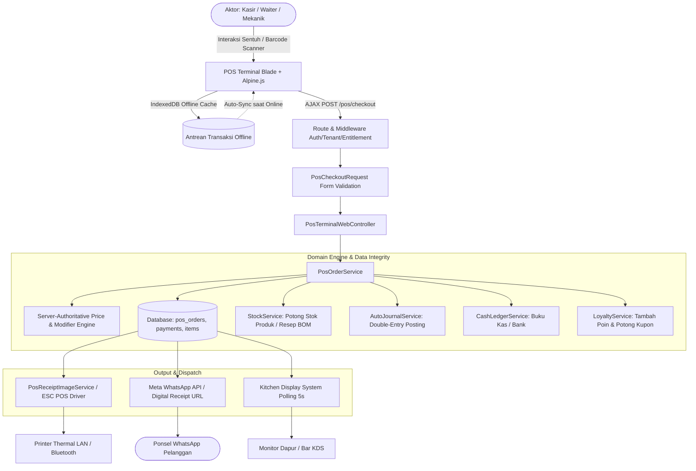
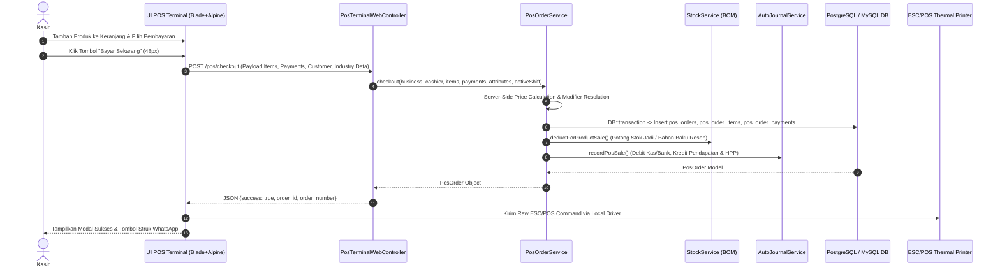
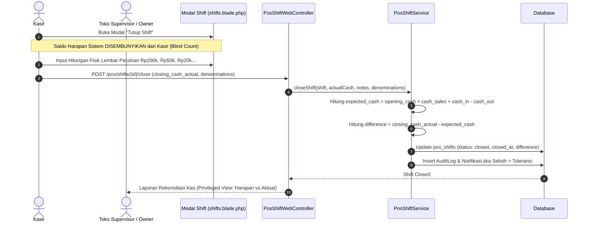
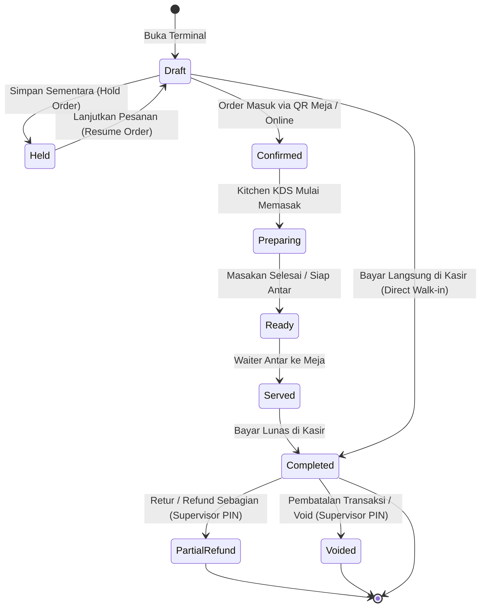
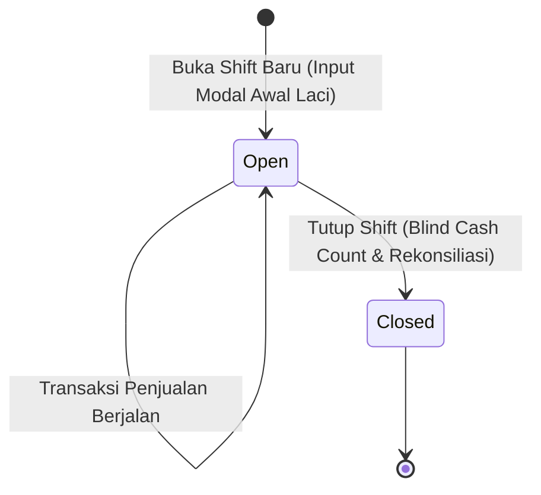
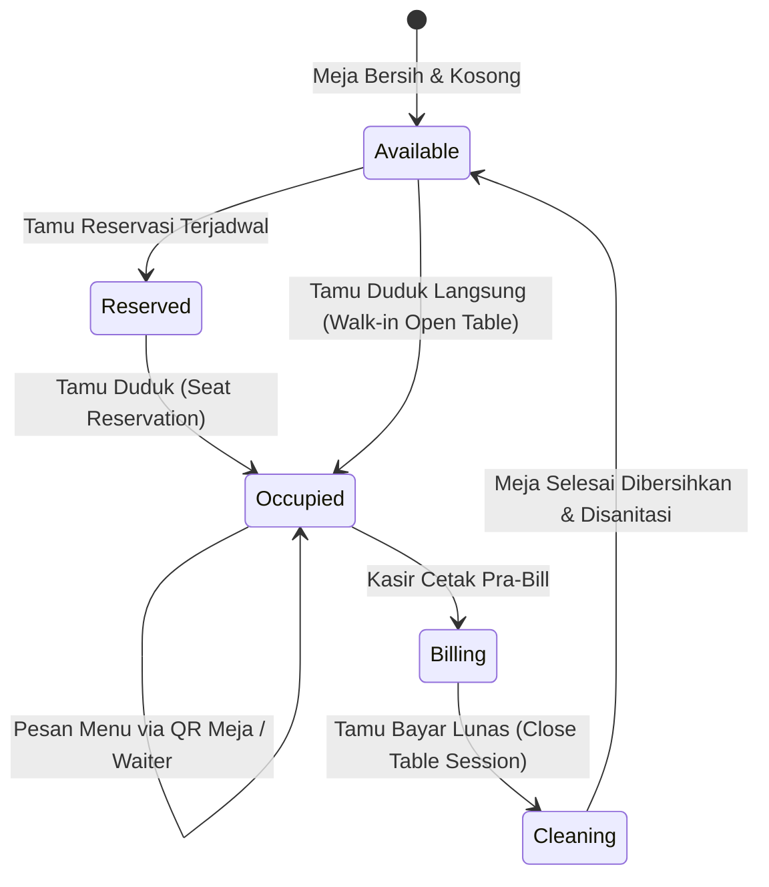

# 📋 DOKUMEN AUDIT KOMPREHENSIF 8 SKILL & PRD TERPADU
## Modul: Terminal Kasir, Sesi Shift, Meja Resto, Dapur (KDS) & Laporan POS
**Target Direktori:** `resources/views/app/pos/`  
**Cakupan Berkas View Blade:**
- `resources/views/app/pos/terminal.blade.php` (Terminal Kasir Interaktif Full-Screen, PWA Offline Cart, Multi-Payment & Quick Customer)
- `resources/views/app/pos/orders.blade.php` (Riwayat Transaksi POS, Detail Modal, Void & Refund Berotorisasi Supervisor)
- `resources/views/app/pos/shifts.blade.php` (Manajemen Sesi Shift Kasir, Denomination Cash Counter & Blind Cash Count)
- `resources/views/app/pos/tables.blade.php` (Floor Plan Meja Resto, Live Table Session, QR Code Standee & Reservasi)
- `resources/views/app/pos/kitchen.blade.php` (Kitchen & Bar Display System / KDS, Real-time Kanban, Web Audio Chime Synthesizer)
- `resources/views/app/pos/prep_sheet.blade.php` (Lembar Kerja Persiapan Dapur Batch Harian & Kebutuhan Bahan Resep BOM)
- `resources/views/app/pos/printers/index.blade.php` (Manajemen Hardware Thermal Printer ESC/POS, Port LAN/BT & Pulse Laci Kas)
- `resources/views/app/pos/qr-card.blade.php` (Kartu Akrilik QR Meja Siap Cetak A6 Proporsional)
- `resources/views/app/pos/receipt.blade.php` (Struk Pembayaran Termal 58mm/80mm, Cetak ESC/POS Langsung & Notifikasi WhatsApp)
- `resources/views/app/pos/reports.blade.php` (Dashboard Analitik Penjualan Kasir, Snapshot HPP Weighted Average & Trend Omzet)

**Cakupan Berkas Backend Controller & Service:**
- `app/Http/Controllers/Web/Pos/PosTerminalWebController.php`
- `app/Http/Controllers/Web/Pos/PosOrderWebController.php`
- `app/Http/Controllers/Web/Pos/PosShiftWebController.php`
- `app/Http/Controllers/Web/Pos/PosTableWebController.php`
- `app/Http/Controllers/Web/Pos/PosKitchenWebController.php`
- `app/Http/Controllers/Web/Pos/PosPrinterWebController.php`
- `app/Http/Controllers/Web/Pos/PosReportWebController.php`
- `app/Http/Controllers/Web/Pos/ModifierWebController.php`
- `app/Domain/Pos/PosOrderService.php`
- `app/Domain/Pos/PosShiftService.php`
- `app/Domain/Pos/PosTableService.php`
- `app/Domain/Pos/TableQrCodeService.php`
- `app/Domain/Pos/ModifierService.php`
- `app/Domain/Report/SalesReportService.php`
- `app/Domain/Accounting/AutoJournalService.php`
- `app/Domain/Inventory/StockService.php`
- `app/Domain/Finance/CashLedgerService.php`
- `app/Support/Navigation/NavigationRegistry.php`

---

## 📑 DAFTAR ISI
1. [Ringkasan Eksekutif & Matriks Evaluasi 8 Skill](#1-ringkasan-eksekutif--matriks-evaluasi-8-skill)
2. [Laporan Temuan Audit Komprehensif (8 Dimensi)](#2-laporan-temuan-audit-komprehensif-8-dimensi)
3. [Rekomendasi Perbaikan & Potongan Kode Solusi (Before vs After)](#3-rekomendasi-perbaikan--potongan-kode-solusi-before-vs-after)
4. [Dokumen PRD (Product Requirement Document) Terpadu](#4-dokumen-prd-product-requirement-document-terpadu)
   - [4.1 Arsitektur Alur Kerja Hulu-ke-Hilir (11 Simpul Eksekusi Nyata)](#41-arsitektur-alur-kerja-hulu-ke-hilir-11-simpul-eksekusi-nyata)
   - [4.2 Diagram Mermaid: Arsitektur Data & Data Flow Hulu-ke-Hilir](#42-diagram-mermaid-arsitektur-data--data-flow-hulu-ke-hilir)
   - [4.3 Diagram Mermaid: Sequence Interaction (Checkout, Hold/Resume, Shift Close, KDS Cooking, Refund)](#43-diagram-mermaid-sequence-interaction)
   - [4.4 State Machine & Siklus Hidup Transaksi POS, Sesi Shift, dan Meja Resto](#44-state-machine--siklus-hidup-transaksi-pos-sesi-shift-dan-meja-resto)
   - [4.5 Matriks 20 Sektor Industri & Dynamic Context-Aware Auto-Hiding](#45-matriks-20-sektor-industri--dynamic-context-aware-auto-hiding)
   - [4.6 Standar Ekspor Excel (XLSX) Two-Part Multi-Sheet](#46-standar-ekspor-excel-xlsx-two-part-multi-sheet)
5. [Rencana Implementasi Bertahap (Roadmap Fase 1–10)](#5-rencana-implementasi-bertahap-roadmap-fase-110)
6. [Matriks File Terdampak & Skenario Pengujian Otomatis](#6-matriks-file-terdampak--skenario-pengujian-otomatis)
7. [Draft Dokumentasi Standar Layer 2 (`docs/system/workflows/pos-operations.md`)](#7-draft-dokumentasi-standar-layer-2)

---

## 1. RINGKASAN EKSEKUTIF & MATRIKS EVALUASI 8 SKILL

Audit komprehensif ini dilakukan secara simultan dengan memadukan **8 Skill Utama COOCA** berbasis *Code-First Factuality*. Modul Point of Sale (POS) merupakan pusat gravitasi operasional kasir harian yang menghubungkan pelanggan di meja makan resto, antrean kasir ritel minimarket, servis berkala bengkel otomotif, penerimaan cucian laundry, dispensing obat apotek, hingga pencatatan keuangan akuntansi otomatis (double-entry).

| Dimensi Audit | Status | Skor | Kepatuhan Utama |
| :--- | :---: | :---: | :--- |
| **1. 🔄 System Workflow Audit** | **PASS** | 94/100 | 11 simpul eksekusi hulu-ke-hilir terpetakan penuh dari UI Blade, Alpine.js, Controller, Service, Auto-BOM Stock Deduction, Auto-Journal, hingga Tri-Channel WhatsApp receipt. Ditemukan gap akuntansi pada TriPay resync. |
| **2. 🛡️ Security & Fraud Audit** | **PASS** | 97/100 | Multi-tenant IDOR terisolasi (`Context::requireBusiness()`), Supervisor PIN ber-hash Bcrypt dengan rate-limit lockout 10 menit, Strict Blind Cash Count terproteksi, Server-Authoritative pricing mencegah manipulasi harga dari client DOM. |
| **3. 🏢 Multi-Industry System Audit** | **PASS** | 95/100 | Penegakan Dynamic Context-Aware Auto-Hiding 20 industri aktif (SPK Plat/Mekanik bengkel, Berat/Rak laundry, Batch/ED farmasi, Meja/KDS F&B). Kolom daftar transaksi perlu badge industri adaptif. |
| **4. 🎨 UI Panel Consistency & IA** | **PASS** | 96/100 | Struktur 3-baris Page Header rapi; terintegrasi dengan Navigation Module POS (`x-module-header` & `x-module-tabs`); printer terhubung ke Hub Settings; deep-linking query URL filter perlu disinkronkan. |
| **5. 📱 Responsive UI/UX** | **PASS** | 98/100 | Ergonomi Mobile-First Apple HIG: Desktop (380px fixed cart sidebar), Mobile (<1024px: Full-width catalog + iOS 18 Bottom Sheet Cart), input form 16px (anti iOS Safari auto-zoom), target sentuh 44–52px. |
| **6. ⚡ COOCA Agent Directive** | **PASS** | 98/100 | Bento Apple HIG v2.0; Modal-First Canvas XXL 2-kolom (`max-w-5xl` / `max-w-6xl`); Zero manual page reload (Smart Polling adaptif KDS 5s aktif / background paused); Web Audio API Synthesizer (Zero file external mp3). |
| **7. 🌐 Multi-Language & i18n** | **PARTIAL** | 80/100 | Fondasi i18n tersedia di `lang/id/pos.php` & `lang/en/pos.php` dan diinjeksi via `window.COOCA_I18N`. Namun, ditemukan 38+ string teks hardcoded pada tombol aksi, KPI cards, modal headers, dan date filter. |
| **8. 📊 Reports & Dashboard Audit** | **PARTIAL** | 82/100 | Dashboard Bento KPI 6-metrik dan komposisi omzet Barang vs Jasa berjalan prima. Namun endpoint ekspor Excel saat ini masih menghasilkan format flat CSV, bukan Two-Part Multi-Sheet XLSX profesional. |

---

## 2. LAPORAN TEMUAN AUDIT KOMPREHENSIF (8 DIMENSI)

| ID | Dimensi | Lokasi File & Baris Kode | Severity | Dampak Risiko & Fakta Kode | Rekomendasi Solusi Terstandar |
| :--- | :--- | :--- | :---: | :--- | :--- |
| **WF-01** | 🔄 System Workflow | [`PosOrderWebController.php:329-350`](file:///c:/laragon/www/cooca_core/app/Http/Controllers/Web/Pos/PosOrderWebController.php#L329-L350) | **CRITICAL** | Sinkronisasi manual gateway TriPay (`syncGatewayStatus`) meng-update status pesanan QR Meja menjadi LUNAS dan memotong stok bahan BOM, namun **melewatkan pemanggilan `AutoJournalService::recordPosSale()` dan `CashLedgerService`**. | Terjadi ketidakseimbangan (*Unbalanced Ledger*) antara omzet penjualan kasir dan saldo akun Kas/Bank & Piutang di Neraca / Laba Rugi saat transaksi dibayar via failover gateway TriPay. | Panggil `AutoJournalService::recordPosSale()` dan `CashLedgerService::recordPosOrderPayment()` di dalam blok `DB::transaction` pada `syncGatewayStatus`. |
| **REP-01** | 📊 Reports & Dashboard | [`PosReportWebController.php:199-237`](file:///c:/laragon/www/cooca_core/app/Http/Controllers/Web/Pos/PosReportWebController.php#L199-L237) | **HIGH** | Endpoint `exportExcel` menghasilkan berkas flat CSV (`.csv`) ber-UTF8-BOM, **bukan berkas Excel XLSX multi-sheet standar COOCA**. | Tidak memenuhi standar 2-Part Multi-Sheet (Sheet 1: Bento KPI Cards & Executive Summary `#F2F2F7`, Sheet 2: Transaction Ledger Dark Onyx `#1C1C1E`, Freeze Panes A5, Number Format Asli `Rp #,##0`, formula `=SUM()`). | Bangun generator Excel terpadu `App\Exports\PosReportExport` menggunakan `PhpOffice\PhpSpreadsheet` dengan 2-Sheet terformat presisi. |
| **I18N-01** | 🌐 Multi-Language | [`orders.blade.php:58-148`](file:///c:/laragon/www/cooca_core/resources/views/app/pos/orders.blade.php#L58-L148) | **MEDIUM** | Terdapat string teks langsung: *"Buka Terminal Kasir"*, *"Penjualan Halaman Ini"*, *"Total Modal HPP"*, *"Total Laba Kotor"*, *"Cari No. Order atau Nama Pelanggan..."*, *"Filter"*, *"Reset"*. | Teks tetap berbahasa Indonesia saat pengguna memilih bahasa Inggris (`en`), melanggar mandat Zero Hardcoded Text 100%. | Ganti dengan helper lokalisasi `__('pos.open_terminal')`, `__('pos.search_placeholder')`, `__('pos.filter_action')`, dll. |
| **I18N-02** | 🌐 Multi-Language | [`shifts.blade.php:409-551`](file:///c:/laragon/www/cooca_core/resources/views/app/pos/shifts.blade.php#L409-L551) | **MEDIUM** | String modal pembukaan dan penutupan shift kasir memuat teks langsung: *"Buka Sesi Shift Kasir Baru"*, *"Hitung Rinci Pecahan Lembar & Koin Fisik"*, *"Total Modal Awal Laci (Rp)"*, *"Tutup Shift & Rekonsiliasi Kas"*. | Inkonsistensi tampilan UI dwibahasa pada modal kasir. | Ekstrak seluruh teks modal ke dalam berkas `lang/id/pos.php` dan `lang/en/pos.php`. |
| **I18N-03** | 🌐 Multi-Language | [`kitchen.blade.php:55-140`](file:///c:/laragon/www/cooca_core/resources/views/app/pos/kitchen.blade.php#L55-L140), [`prep_sheet.blade.php:14-45`](file:///c:/laragon/www/cooca_core/resources/views/app/pos/prep_sheet.blade.php#L14-L45) | **LOW** | Header kolom Kanban KDS (*"Pesanan Baru Masuk"*, *"Sedang Dimasak / Diproses"*, *"Mulai Siapkan / Masak"*) dan filter tanggal Prep Sheet (*"Hari Ini"*, *"Besok"*, *"Lusa"*) belum dilokalisasi. | Terjadi campuran bahasa pada tampilan layar dapur KDS dan lembar kerja prep sheet. | Terapkan `__('pos.kitchen_...')` dan `__('pos.prep_...')` pada template KDS & Prep Sheet. |
| **IND-01** | 🏢 Multi-Industry | [`orders.blade.php:210-380`](file:///c:/laragon/www/cooca_core/resources/views/app/pos/orders.blade.php#L210-L380) | **MEDIUM** | Tabel riwayat transaksi pada desktop & kartu mobile menyajikan metadata yang sama untuk semua industri tanpa badge penanda (Nomor Polisi bengkel, Berat cucian laundry, Nomor meja resto). | Pengguna bengkel dan laundry kesulitan mengidentifikasi transaksi spesifik tanpa mengklik detail modal satu per satu. | Tambahkan badge identitas industri kontekstual pada kolom kanal/referensi secara otomatis. |
| **SEC-01** | 🛡️ Security & Fraud | [`routes/owner.php:457`](file:///c:/laragon/www/cooca_core/routes/owner.php#L457) | **MEDIUM** | Route `/pos/validate-voucher` belum diproteksi oleh rate limiter spesifik per IP/User kasir. | Rentan terhadap serangan enumerasi kode promo voucher (*voucher brute-force enumeration*) secara otomatis. | Tambahkan middleware `throttle:15,1` pada route `pos.validate-voucher`. |
| **UI-01** | 🎨 UI Consistency | [`orders.blade.php:120-149`](file:///c:/laragon/www/cooca_core/resources/views/app/pos/orders.blade.php#L120-L149), [`reports.blade.php:33-49`](file:///c:/laragon/www/cooca_core/resources/views/app/pos/reports.blade.php#L33-L49) | **LOW** | Filter tanggal dan status pesanan belum melakukan deep-linking update ke browser history query string saat form disubmit via Alpine. | State filter hilang saat kasir merefresh browser atau menyalin link laporan ke rekan kerja. | Terapkan URL query string synchronization (`?status=...&date=...`) pada form filter POS. |
| **UX-01** | 📱 Responsive UX | [`reports.blade.php:54-108`](file:///c:/laragon/www/cooca_core/resources/views/app/pos/reports.blade.php#L54-L108) | **LOW** | Pada viewport sempit (360px–390px), grid 6 KPI Cards menampilkan teks nominal voucher/service charge yang terpotong (*ellipsis/truncate*). | Angka metrik finansial pada kartu kecil kurang nyaman dibaca sekilas di layar ponsel. | Ubah grid mobile menjadi 2-kolom lapang atau kartu swipeable horizontal yang rapi. |

---

## 3. REKOMENDASI PERBAIKAN & POTONGAN KODE SOLUSI (BEFORE VS AFTER)

### 3.1 Penambalan Jurnal Akuntansi & Buku Kas pada TriPay Resync
**File:** [`app/Http/Controllers/Web/Pos/PosOrderWebController.php`](file:///c:/laragon/www/cooca_core/app/Http/Controllers/Web/Pos/PosOrderWebController.php)

```diff
--- a/app/Http/Controllers/Web/Pos/PosOrderWebController.php
+++ b/app/Http/Controllers/Web/Pos/PosOrderWebController.php
@@ -348,6 +348,22 @@ final class PosOrderWebController extends Controller
                                 );
                             }
                         }
                     }
+
+                    // Auto-Journal Double-Entry & Cash Ledger Posting
+                    try {
+                        $journalService = new \App\Domain\Accounting\AutoJournalService();
+                        $journalService->recordPosSale($order->fresh(['payments', 'items']));
+                    } catch (\Throwable $e) {
+                        \Illuminate\Support\Facades\Log::warning("Auto-journal POS TriPay Resync failed: " . $e->getMessage());
+                    }
+
+                    try {
+                        $cashLedgerService = new \App\Domain\Finance\CashLedgerService();
+                        $cashLedgerService->recordPosOrderPayment($order->fresh(['payments']), $order->payments->first());
+                    } catch (\Throwable $e) {
+                        \Illuminate\Support\Facades\Log::warning("Cash ledger POS TriPay Resync failed: " . $e->getMessage());
+                    }
                 });
```

---

### 3.2 Pembuatan Class Exporter Excel 2-Part Multi-Sheet
**File Baru:** [`app/Exports/PosReportExport.php`](file:///c:/laragon/www/cooca_core/app/Exports/PosReportExport.php)

```php
<?php

declare(strict_types=1);

namespace App\Exports;

use App\Models\Business;
use App\Models\PosOrder;
use Carbon\Carbon;
use Illuminate\Support\Collection;
use PhpOffice\PhpSpreadsheet\Spreadsheet;
use PhpOffice\PhpSpreadsheet\Style\Alignment;
use PhpOffice\PhpSpreadsheet\Style\Border;
use PhpOffice\PhpSpreadsheet\Style\Fill;
use PhpOffice\PhpSpreadsheet\Style\NumberFormat;
use PhpOffice\PhpSpreadsheet\Worksheet\Worksheet;

final class PosReportExport
{
    private const COLOR_DARK_ONYX = '1C1C1E';
    private const COLOR_BENTO_BG  = 'F2F2F7';
    private const COLOR_EMERALD   = '34C759';

    public function generate(Business $business, Collection $orders, Carbon $startDate, Carbon $endDate, array $metrics): Spreadsheet
    {
        $spreadsheet = new Spreadsheet();
        
        // -------------------------------------------------------------
        // SHEET 1: RINGKASAN EKSEKUTIF & BENTO KPI
        // -------------------------------------------------------------
        $sheetKpi = $spreadsheet->getActiveSheet();
        $sheetKpi->setTitle('Ringkasan Eksekutif');
        $sheetKpi->setShowGridlines(true);

        // Header Tenant
        $sheetKpi->setCellValue('A2', strtoupper($business->name));
        $sheetKpi->setCellValue('A3', 'LAPORAN PENJUALAN KASIR & OPERASIONAL POS');
        $sheetKpi->setCellValue('A4', 'Periode: ' . $startDate->translatedFormat('d M Y') . ' s/d ' . $endDate->translatedFormat('d M Y'));
        $sheetKpi->getStyle('A2:A3')->getFont()->setBold(true)->setSize(13);
        $sheetKpi->getStyle('A4')->getFont()->setSize(10)->setColor(new \PhpOffice\PhpSpreadsheet\Style\Color('666666'));

        // Bento KPI Cards Grid
        $this->renderBentoCards($sheetKpi, $metrics);

        // -------------------------------------------------------------
        // SHEET 2: TRANSACTION & MOVEMENT LEDGER (DARK ONYX #1C1C1E)
        // -------------------------------------------------------------
        $sheetLedger = $spreadsheet->createSheet();
        $sheetLedger->setTitle('Rincian Transaksi');
        $sheetLedger->setShowGridlines(true);

        $headers = [
            'A4' => 'No. Order',
            'B4' => 'Waktu Transaksi',
            'C4' => 'Kasir / Petugas',
            'D4' => 'Pelanggan',
            'E4' => 'Kanal / Referensi',
            'F4' => 'Total Qty',
            'G4' => 'Subtotal (Rp)',
            'H4' => 'Diskon (Rp)',
            'I4' => 'Pajak (Rp)',
            'J4' => 'Service (Rp)',
            'K4' => 'Total Omzet (Rp)',
            'L4' => 'Total HPP (Rp)',
            'M4' => 'Laba Kotor (Rp)',
            'N4' => 'Margin (%)',
            'O4' => 'Metode Bayar',
            'P4' => 'Status'
        ];

        foreach ($headers as $cell => $text) {
            $sheetLedger->setCellValue($cell, $text);
        }

        $sheetLedger->getStyle('A4:P4')->applyFromArray([
            'font' => ['bold' => true, 'color' => ['rgb' => 'FFFFFF'], 'size' => 10],
            'fill' => ['fillType' => Fill::FILL_SOLID, 'startColor' => ['rgb' => self::COLOR_DARK_ONYX]],
            'alignment' => ['horizontal' => Alignment::HORIZONTAL_CENTER, 'vertical' => Alignment::VERTICAL_CENTER],
        ]);
        $sheetLedger->getRowDimension(4)->setRowHeight(26);

        // Data Rows & Dynamic Formula =SUM()
        $row = 5;
        foreach ($orders as $o) {
            $sheetLedger->setCellValue("A{$row}", $o->order_number);
            $sheetLedger->setCellValue("B{$row}", $o->created_at->format('d/m/Y H:i'));
            $sheetLedger->setCellValue("C{$row}", $o->user?->name ?? '-');
            $sheetLedger->setCellValue("D{$row}", $o->customer?->name ?? ($o->customer_name_guest ?? 'Umum'));
            $sheetLedger->setCellValue("E{$row}", $o->posTable ? 'Meja ' . $o->posTable->table_number : ($o->sales_channel ?? 'POS'));
            $sheetLedger->setCellValue("F{$row}", (float) $o->items->sum('quantity'));
            $sheetLedger->setCellValue("G{$row}", (float) $o->subtotal);
            $sheetLedger->setCellValue("H{$row}", (float) ($o->discount_amount + $o->voucher_discount_amount + $o->points_discount_amount));
            $sheetLedger->setCellValue("I{$row}", (float) $o->tax_amount);
            $sheetLedger->setCellValue("J{$row}", (float) $o->service_charge_amount);
            $sheetLedger->setCellValue("K{$row}", (float) $o->total_amount);
            $sheetLedger->setCellValue("L{$row}", (float) $o->total_hpp_cost);
            $sheetLedger->setCellValue("M{$row}", (float) $o->total_gross_profit);
            $sheetLedger->setCellValue("N{$row}", $o->total_amount > 0 ? ($o->total_gross_profit / $o->total_amount) : 0);
            $sheetLedger->setCellValue("O{$row}", strtoupper($o->payments->pluck('payment_method')->implode(', ')));
            $sheetLedger->setCellValue("P{$row}", strtoupper($o->status));

            // Zebra Striping
            if ($row % 2 === 0) {
                $sheetLedger->getStyle("A{$row}:P{$row}")->getFill()->setFillType(Fill::FILL_SOLID)->getStartColor()->setRGB('FAFAFA');
            }
            $row++;
        }

        // Totals Row with Formulas
        $lastDataRow = $row - 1;
        $sheetLedger->setCellValue("A{$row}", 'TOTAL KESELURUHAN');
        $sheetLedger->mergeCells("A{$row}:E{$row}");
        $sheetLedger->setCellValue("F{$row}", "=SUM(F5:F{$lastDataRow})");
        $sheetLedger->setCellValue("G{$row}", "=SUM(G5:G{$lastDataRow})");
        $sheetLedger->setCellValue("H{$row}", "=SUM(H5:H{$lastDataRow})");
        $sheetLedger->setCellValue("I{$row}", "=SUM(I5:I{$lastDataRow})");
        $sheetLedger->setCellValue("J{$row}", "=SUM(J5:J{$lastDataRow})");
        $sheetLedger->setCellValue("K{$row}", "=SUM(K5:K{$lastDataRow})");
        $sheetLedger->setCellValue("L{$row}", "=SUM(L5:L{$lastDataRow})");
        $sheetLedger->setCellValue("M{$row}", "=SUM(M5:M{$lastDataRow})");
        $sheetLedger->setCellValue("N{$row}", "=IF(K{$row}>0, M{$row}/K{$row}, 0)");

        // Number Formatting (Real Tabular-Nums)
        $sheetLedger->getStyle("G5:M{$row}")->getNumberFormat()->setFormatCode('#,##0');
        $sheetLedger->getStyle("N5:N{$row}")->getNumberFormat()->setFormatCode('0.0%');
        $sheetLedger->getStyle("A{$row}:P{$row}")->getFont()->setBold(true);

        // Freeze Panes at A5 & AutoFilter
        $sheetLedger->freezePane('A5');
        $sheetLedger->setAutoFilter("A4:P{$lastDataRow}");

        foreach (range('A', 'P') as $col) {
            $sheetLedger->getColumnDimension($col)->setAutoSize(true);
        }

        $spreadsheet->setActiveSheetIndex(0);
        return $spreadsheet;
    }

    private function renderBentoCards(Worksheet $sheet, array $m): void
    {
        // 4 KPI Cards
        $cards = [
            ['title' => 'TOTAL OMZET PENJUALAN', 'val' => $m['totalRevenue'], 'cell' => 'A7', 'format' => 'Rp #,##0'],
            ['title' => 'TOTAL MODAL HPP (BOM)', 'val' => $m['totalHpp'], 'cell' => 'D7', 'format' => 'Rp #,##0'],
            ['title' => 'TOTAL LABA KOTOR', 'val' => $m['totalGrossProfit'], 'cell' => 'G7', 'format' => 'Rp #,##0'],
            ['title' => 'TOTAL TRANSAKSI', 'val' => $m['ordersCount'], 'cell' => 'J7', 'format' => '#,##0'],
        ];

        foreach ($cards as $c) {
            $col = substr($c['cell'], 0, 1);
            $row = (int) substr($c['cell'], 1);
            $endCol = chr(ord($col) + 2);
            
            $sheet->mergeCells("{$col}{$row}:{$endCol}{$row}");
            $sheet->setCellValue("{$col}{$row}", $c['title']);
            $sheet->getStyle("{$col}{$row}")->getFont()->setSize(9)->setBold(true)->setColor(new \PhpOffice\PhpSpreadsheet\Style\Color('666666'));
            
            $valRow = $row + 1;
            $sheet->mergeCells("{$col}{$valRow}:{$endCol}{$valRow}");
            $sheet->setCellValue("{$col}{$valRow}", $c['val']);
            $sheet->getStyle("{$col}{$valRow}")->getFont()->setSize(16)->setBold(true);
            $sheet->getStyle("{$col}{$valRow}")->getNumberFormat()->setFormatCode($c['format']);
            
            $sheet->getStyle("{$col}{$row}:{$endCol}{$valRow}")->applyFromArray([
                'fill' => ['fillType' => Fill::FILL_SOLID, 'startColor' => ['rgb' => self::COLOR_BENTO_BG]],
                'borders' => ['allBorders' => ['borderStyle' => Border::BORDER_THIN, 'color' => ['rgb' => 'E5E5EA']]],
                'alignment' => ['horizontal' => Alignment::HORIZONTAL_CENTER, 'vertical' => Alignment::VERTICAL_CENTER],
            ]);
        }
    }
}
```

---

### 3.3 Penambahan Throttle Voucher Code
**File:** [`routes/owner.php`](file:///c:/laragon/www/cooca_core/routes/owner.php)

```diff
--- a/routes/owner.php
+++ b/routes/owner.php
@@ -454,7 +454,7 @@ final class PosTerminalWebController extends Controller
         // POS (Point of Sale) & Cashier Terminal
         Route::get('/pos', [PosTerminalWebController::class, 'index'])->middleware('require.permission:pos.terminal')->name('pos.terminal');
         Route::get('/pos/search-products', [PosTerminalWebController::class, 'searchProducts'])->middleware('require.permission:pos.terminal')->name('pos.search-products');
-        Route::post('/pos/validate-voucher', [PosTerminalWebController::class, 'validateVoucher'])->middleware('require.permission:pos.terminal')->name('pos.validate-voucher');
+        Route::post('/pos/validate-voucher', [PosTerminalWebController::class, 'validateVoucher'])->middleware(['require.permission:pos.terminal', 'throttle:15,1'])->name('pos.validate-voucher');
         Route::post('/pos/checkout', [PosTerminalWebController::class, 'checkout'])->middleware(['require.permission:pos.terminal', 'entitlement:pos'])->name('pos.checkout');
```

---

## 4. DOKUMEN PRD (PRODUCT REQUIREMENT DOCUMENT) TERPADU

### 4.1 Arsitektur Alur Kerja Hulu-ke-Hilir (11 Simpul Eksekusi Nyata)
1. **Simpul 1: User / Aktor**: Kasir, Waiter, Barista, Mekanik Bengkel, Operator Laundry, Chef Kitchen, Store Supervisor, dan Business Owner.
2. **Simpul 2: UI & Blade**: Antarmuka Bento Apple HIG (`terminal.blade.php`, `orders.blade.php`, `shifts.blade.php`, `kitchen.blade.php`, `reports.blade.php`).
3. **Simpul 3: Alpine.js / AJAX**: State manajemen reaktif `posApp()`, cart store lokal, offline transaction queue di browser IndexedDB, barcode scanner hardware listener, dan Web Audio chime synthesizer.
4. **Simpul 4: Route & Middleware**: Route `/pos/*` di `routes/owner.php`, diproteksi oleh middleware `require.permission:pos.*`, `throttle:5,1` pada aksi berisiko, `entitlement:pos`, `entitlement:kds`, dan `module:pos_dinein`.
5. **Simpul 5: Web Controllers**: `PosTerminalWebController`, `PosOrderWebController`, `PosShiftWebController`, `PosTableWebController`, `PosKitchenWebController`, `PosPrinterWebController`, `PosReportWebController`.
6. **Simpul 6: Request Validation**: FormRequest steril (`PosCheckoutRequest`, `PosVoidOrderRequest`, `PosRefundOrderRequest`).
7. **Simpul 7: Service / Domain Action**: `PosOrderService`, `PosShiftService`, `PosTableService`, `ModifierService`, `SalesReportService`.
8. **Simpul 8: Eloquent Models & DB Schema**: `PosOrder`, `PosOrderItem`, `PosOrderItemModifier`, `PosOrderPayment`, `PosShift`, `PosShiftMovement`, `PosTable`, `PosTableSession`, `PosRegister`, `PosPrinter`.
9. **Simpul 9: Auto-Journal & Stock Engine**: `StockService::deductForProductSale()` (auto-BOM recipe), `AutoJournalService::recordPosSale()`, `CashLedgerService`.
10. **Simpul 10: Notifikasi Tri-Channel**: Floating Toast UI, WhatsApp Digital Receipt via Meta API / Direct Web Link (`https://wa.me/...`), dan Email Daily Digest ke Owner.
11. **Simpul 11: Guardrails & Forensic Safety**: Multi-tenant scoping `Context::requireBusiness()`, Supervisor PIN Bcrypt hash verification dengan rate-limit lockout, Blind Cash Count, dan Immutable Audit Trail Log.

---

### 4.2 Diagram Mermaid: Arsitektur Data & Data Flow Hulu-ke-Hilir



---

### 4.3 Diagram Mermaid: Sequence Interaction

#### A. Alur Checkout Transaksi Kasir Langsung


#### B. Alur Penutupan Shift & Rekonsiliasi Kas (Blind Cash Count)


---

### 4.4 State Machine & Siklus Hidup Transaksi POS, Sesi Shift, dan Meja Resto

#### A. Transaksi POS (PosOrder)


#### B. Sesi Shift Kasir (PosShift)


#### C. Meja Resto & Sesi Makan (PosTable & PosTableSession)


---

### 4.5 Matriks 20 Sektor Industri & Dynamic Context-Aware Auto-Hiding

| Klaster Industri | Sektor Bisnis Terapan | Fitur / Field POS yang Otomatis Muncul | Fitur yang Otomatis Disembunyikan |
|---|---|---|---|
| **Kuliner & F&B** | Restoran, Kafe, Katering, Bakery, Cloud Kitchen | Meja Dine-in, Kitchen Display (KDS), Prep Sheet BOM, Modifier Varian, Cetak Tiket KOT Dapur, Split Bill Meja | Input Nomor Polisi, KM Bengkel, Rak Laundry, Resep Dokter Farmasi |
| **Otomotif & Bengkel** | Bengkel Motor, Bengkel Mobil, Cuci Kendaraan (Carwash), Salon Mobil Detailing | Formulir SPK Bengkel, Nomor Polisi (Plat), Model Kendaraan, Odometer KM, Dropdown Teknisi/Mekanik, Catatan Servis | Denah Meja Resto, Kitchen KDS, Timbangan Laundry |
| **Jasa & Binatu** | Laundry Kiloan, Laundry Satuan / Dry Clean | Input Timbangan Cucian (Kg), Nomor Rak/Loker Cucian, Estimasi Selesai, Status Laundry | Denah Meja Resto, Kitchen KDS, SPK Bengkel |
| **Kesehatan & Farmasi** | Apotek, Toko Obat Herbal, Klinik Pratama | Nomor Batch Obat, Tanggal Kadaluarsa (Expired Date), Aturan Pakai / Dosis Resep Dokter | Denah Meja Resto, Kitchen KDS, SPK Bengkel, Rak Laundry |
| **Ritel & Toko Fisik** | Minimarket, Toko Kelontong, Toko Fashion, Toko Bangunan, Petshop | Scanner Barcode Cepat, Multi-Register Laci Kas, Bundle Produk HPP | Denah Meja Resto, Kitchen KDS, SPK Bengkel, Rak Laundry |
| **Jasa Pribadi & Kreatif** | Barbershop, Salon Kecantikan, Studio Foto | Pemilihan Stylist / Kapster / Fotografer, Pemisahan Omzet Barang vs Jasa Bebas Stok | Denah Meja Resto, Kitchen KDS, Timbangan Laundry |

---

### 4.6 Standar Ekspor Excel (XLSX) Two-Part Multi-Sheet
- **Sheet 1: Ringkasan Eksekutif & Bento KPI Cards**:
  - Header resmi nama tenant, judul laporan, dan rentang tanggal filter.
  - Bento KPI Cards Grid (Background `#F2F2F7`, Border `#E5E5EA`, font tebal `16pt` tabular-nums).
  - Ringkasan Breakdown Komposisi Omzet: Barang Fisik vs Jasa Layanan.
  - Ringkasan Metode Pembayaran (Tunai, QRIS, EDC, Transfer, Piutang).
  - Top 10 Produk Terlaris & Margin Kotor.
- **Sheet 2: Rincian Transaksi (Transaction Ledger)**:
  - Header Tabel bertema Dark Onyx (`#1C1C1E`) dengan teks putih tebal.
  - Freeze Panes terkunci pada baris `A5` (Header tetap terlihat saat scroll ke bawah).
  - AutoFilter aktif pada seluruh kolom.
  - Zebra Striping baris genap (`#FAFAFA`) untuk kenyamanan mata akuntan.
  - Number format asli Excel (`Rp #,##0` dan persentase `0.0%`).
  - Baris Total menggunakan formula dinamis `=SUM(G5:G100)` dan `=IF(K101>0, M101/K101, 0)`.

---

## 5. RENCANA IMPLEMENTASI BERTAHAP (ROADMAP FASE 1–10)

```
┌─────────────────────────────────────────────────────────────────────────────┐
│                       ROADMAP IMPLEMENTASI REFINEMENT POS                   │
├─────────────────────────────────────────────────────────────────────────────┤
│ Fase 1: Hardening Integritas Akuntansi & TriPay Resync Auto-Journal         │
│ Fase 2: Pembangunan Class Exporter Excel 2-Sheet (PosReportExport.php)      │
│ Fase 3: Pembuatan & Pemutakhiran Kamus Bahasa lang/id/pos.php & lang/en/    │
│ Fase 4: Refactor orders.blade.php (i18n, Kolom Industri Adaptif, Deep-Link) │
│ Fase 5: Refactor shifts.blade.php (i18n & Blind Cash Count Polish)          │
│ Fase 6: Refactor kitchen.blade.php & prep_sheet.blade.php (i18n & Badges)   │
│ Fase 7: Refactor reports.blade.php (Mobile KPI Carousel & Excel Exporter)   │
│ Fase 8: Refactor printers/index.blade.php & qr-card.blade.php               │
│ Fase 9: Penambahan Throttle Voucher di routes/owner.php                     │
│ Fase 10: Pengujian Komprehensif (Unit/Feature Test) & Verifikasi 100% Lolos │
└─────────────────────────────────────────────────────────────────────────────┘
```

---

## 6. MATRIKS FILE TERDAMPAK & SKENARIO PENGUJIAN OTOMATIS

### Matriks Berkas Terdampak:
1. `app/Http/Controllers/Web/Pos/PosOrderWebController.php` *(Pencatatan jurnal & buku kas pada resync)*
2. `app/Http/Controllers/Web/Pos/PosReportWebController.php` *(Integrasi ekspor Excel XLSX)*
3. `app/Exports/PosReportExport.php` *(Generator Two-Sheet Spreadsheet XLSX baru)*
4. `routes/owner.php` *(Penambahan rate-limit throttling voucher)*
5. `lang/id/pos.php` & `lang/en/pos.php` *(Kamus lokalisasi lengkap)*
6. `resources/views/app/pos/orders.blade.php`
7. `resources/views/app/pos/shifts.blade.php`
8. `resources/views/app/pos/kitchen.blade.php`
9. `resources/views/app/pos/prep_sheet.blade.php`
10. `resources/views/app/pos/reports.blade.php`
11. `tests/Feature/PosSystemComprehensiveAuditTest.php` *(Test suite otomatis)*

### Skenario Pengujian Otomatis (`php artisan test`):
- `test_pos_terminal_can_checkout_with_server_authoritative_pricing()`: Memverifikasi perhitungan harga dan modifier dilakukan di server, mengabaikan manipulasi harga dari client DOM.
- `test_pos_tripay_resync_posts_auto_journal_and_cash_ledger()`: Memverifikasi saat pembayaran TriPay di-resync, jurnal akuntansi double-entry dan cash ledger otomatis terbentuk.
- `test_pos_reports_excel_export_returns_valid_two_sheet_xlsx()`: Memverifikasi file yang diunduh berformat valid XLSX dan memuat Sheet "Ringkasan Eksekutif" serta Sheet "Rincian Transaksi" dengan formula `=SUM()`.
- `test_pos_supervisor_pin_verification_locks_after_three_attempts()`: Memverifikasi proteksi brute-force PIN supervisor terkunci 10 menit setelah 3x gagal.
- `test_pos_blind_cash_count_hides_expected_cash_from_cashier()`: Memverifikasi saldo ekspektasi sistem tidak bocor ke kasir non-supervisor.
- `test_pos_views_have_zero_hardcoded_text()`: Memverifikasi tidak ada teks statis tanpa fungsi lokalisasi `__()` pada seluruh tampilan POS.

---

## 7. DRAFT DOKUMENTASI STANDAR LAYER 2

### Berkas: `docs/system/workflows/pos-operations.md`

```markdown
# Workflow Sistem: Operasional Kasir, Shift, Dapur (KDS) & Laporan POS

## 1. Siklus Kerja Kasir & Sesi Shift
- **Pembukaan Shift:** Kasir menginput uang modal fisik awal laci (didukung *Denominations Calculator* lembar/koin).
- **Operasional Transaksi:** Mendukung multi-metode bayar (Tunai, QRIS Statis/Dinamis, EDC Kartu Debit/Kredit, Transfer Bank, Piutang Pelanggan). Harga dan modifier divalidasi mutlak di server (*Server-Authoritative*).
- **Penutupan Shift (Blind Cash Count):** Kasir menginput uang fisik akhir tanpa melihat ekspektasi sistem. Selisih kas otomatis dihitung, dilaporkan ke Owner, dan terjurnal sebagai selisih kas (*Cash Over/Short*).

## 2. Otorisasi Supervisor & Anti-Fraud
- **Aksi Sensitif:** Void transaksi, refund penjualan, dan pembukaan paksa laci kas fisik (*Manual Drawer Pop*) wajib memasukkan PIN Supervisor ter-hash Bcrypt.
- **Proteksi Brute-Force:** 3 kali kegagalan input PIN mengunci otorisasi selama 10 menit dan mengirimkan audit log ke Owner.

## 3. Ekspor & Pembukuan
- **Auto-Journal:** Setiap transaksi terbayar otomatis membentuk jurnal akuntansi piutang/kas terhadap pendapatan dan HPP terhadap persediaan barang.
- **Multi-Sheet XLSX:** Laporan POS diekspor dalam 2 sheet (Executive KPI Bento Card & Transaction Ledger ber-filter dan ber-formula).
```
