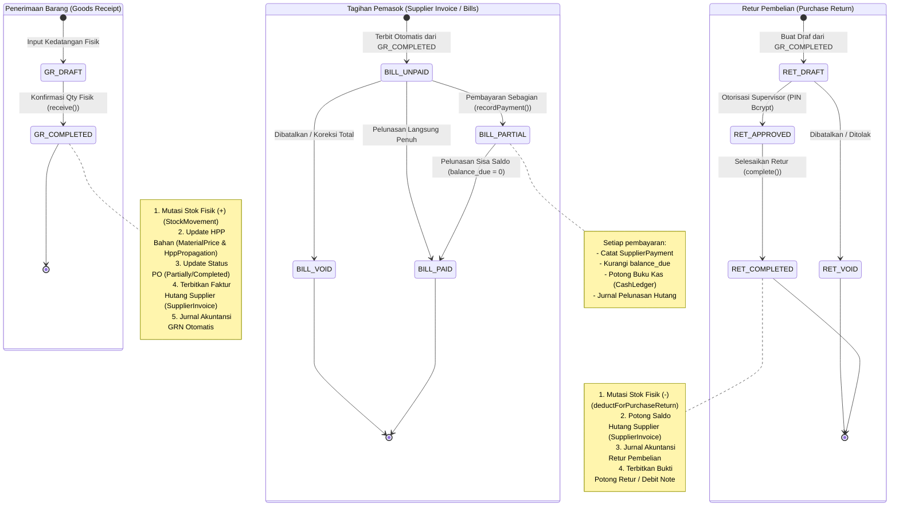
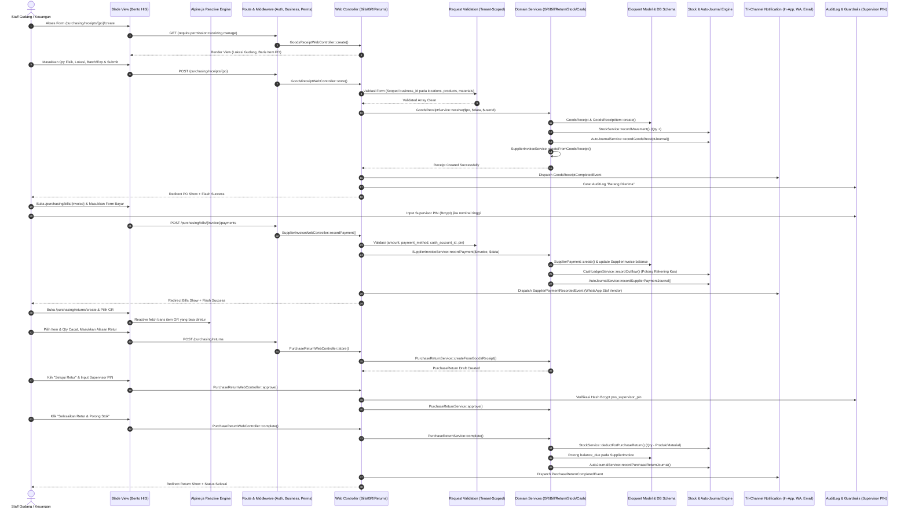

# LAPORAN AUDIT KOMPREHENSIF PENUH: EKOSISTEM PURCHASING (BILLS, RECEIPTS, RETURNS) COOCA

**Dokumen:** `docs/AUDIT_KOMPREHENSIF_PURCHASING_7_SKILL.md`  
**Target Modul:** `resources/views/app/purchasing/` (`bills/`, `receipts/`, `returns/`) & Ekosistem Terkait (`SupplierInvoiceWebController`, `GoodsReceiptWebController`, `PurchaseReturnWebController`, Domain Services, DB Schema, & Rute)  
**Metodologi:** Code-First Factuality (7 Skill Utama COOCA Diuji Simultan Berbasis Baris Kode Riil)  
**Status Evaluasi:** **NEEDS CRITICAL HARDENING & ARCHITECTURAL REPAIR**  
**Prinsip Keamanan:** **MANDAT KESELAMATAN AKTIF (Interactive Confirmation Gate)**

---

## EXECUTIVE SUMMARY

Audit komprehensif ini dilakukan secara serentak terhadap seluruh berkas tampilan dan backend pendukung pada direktori `resources/views/app/purchasing/` yang membawahi 3 pilar operasional pengadaan barang:
1. **Tagihan & Hutang Supplier (`bills/`)**: Pengelolaan faktur pemasok (*Account Payable / AP*), pelunasan bertahap, dan pencatatan buku kas keluar.
2. **Penerimaan Barang Fisik (`receipts/`)**: Konfirmasi kedatangan barang fisik di gudang (*Goods Receipt / GR*), pencatatan pergerakan stok masuk, batch & expired date, serta penerimaan instan (*Solo Owner Instant Stock-In*).
3. **Retur Pembelian ke Supplier (`returns/`)**: Pengembalian barang rusak/cacat ke pemasok, persetujuan manajerial (*approval*), pemotongan stok keluar, dan penyesuaian saldo hutang supplier.

Hasil audit berbasis **Code-First Factuality** menemukan **14 temuan krusial**, termasuk **5 temuan berstatus P1 (Kritis)** yang mengancam isolasi tenant multi-tenant (IDOR), potensi kebocoran finansial kas tanpa otorisasi supervisor, kegagalan fatal pada retur bahan baku (*Material Return Fatal Bug*), serta anomali UX di mana pengguna awam dipaksa mengetik string internal database UUID secara manual.

---

## DELIVERABLE 1: Laporan Temuan Audit Komprehensif (Tabel 7 Kolom)

| No | Dimensi Skill | Lokasi File & Baris Kode | Kode Temuan / Root Cause | Severity | Dampak Risiko | Solusi / Rekomendasi |
| :--- | :--- | :--- | :--- | :--- | :--- | :--- |
| **01** | 🛡️ Security & Fraud | [`PurchaseReturnWebController.php:26`](file:///c:/laragon/www/cooca_core/app/Http/Controllers/Web/PurchaseReturnWebController.php#L26) | **IDOR Multi-Tenant & Cross-Receipt pada Validasi Retur**: Aturan validasi `'goods_receipt_id' => ['required', 'exists:goods_receipts,id']` dan `'items.*.goods_receipt_item_id' => ['required', 'exists:goods_receipt_items,id']` tidak menyertakan klausa isolasi bisnis `where('business_id', $business->id)` serta tidak memvalidasi kepemilikan item terhadap GR terkait. | **P1 (Kritis)** | **Cross-Tenant Data Tampering & IDOR**: Pengguna Tenant A dapat menyuntikkan ID Goods Receipt atau item fisik milik Tenant B, memicu kebocoran data rahasia dan kerusakan konsistensi transaksi antar-tenant. | Pasang `Rule::exists('goods_receipts', 'id')->where('business_id', $business->id)` dan validasi ketat bahwa setiap `goods_receipt_item_id` benar-benar terdaftar di dalam `goods_receipt_id` terpilih milik tenant aktif. |
| **02** | 🛡️ Security & Fraud | [`PurchaseReturnWebController.php:32-33`](file:///c:/laragon/www/cooca_core/app/Http/Controllers/Web/PurchaseReturnWebController.php#L32-L33) | **Zero-Guardrail Inventory Deduction & Missing Supervisor PIN**: Aksi persetujuan retur (`approve`) dan penyelesaian pemotongan stok fisik gudang (`complete`) dapat dieksekusi langsung tanpa verifikasi otorisasi Supervisor PIN (Strict Bcrypt Hash), tanpa validasi pemisahan tugas (*separation of duties*), dan tanpa dialog konfirmasi 2-langkah. | **P1 (Kritis)** | **Internal Fraud & Penggelapan Stok Gudang (Phantom Shrinkage)**: Oknum staf gudang/kasir nakal dapat membuat draf retur fiktif, langsung menyetujuinya sendiri, dan memotong saldo stok sistem untuk menutupi barang fisik yang dicuri/hilang. | Wajibkan otorisasi `Hash::check($request->pin, $business->pos_supervisor_pin)`, larang persetujuan mandiri jika pembuat dan penyetujui adalah orang yang sama (`created_by !== approver_id`), dan catat immutable `AuditLog`. |
| **03** | 🔄 Workflow Audit & DB Schema | [`2026_09_04_000070_create_sales_and_purchase_returns_tables.php:79`](file:///c:/laragon/www/cooca_core/database/migrations/2026_09_04_000070_create_sales_and_purchase_returns_tables.php#L79)<br>[`PurchaseReturnItem.php:16`](file:///c:/laragon/www/cooca_core/app/Models/PurchaseReturnItem.php#L16)<br>[`PurchaseReturnService.php:70,108`](file:///c:/laragon/www/cooca_core/app/Domain/Purchasing/PurchaseReturnService.php#L70-L108)<br>[`StockService.php:900-910`](file:///c:/laragon/www/cooca_core/app/Domain/Inventory/StockService.php#L900-L910) | **Material Return Fatal Bug & Database Schema Incompatibility**: Tabel `purchase_return_items` menetapkan kolom `product_id` bersifat `NOT NULL` tanpa adanya kolom `material_id`. Di sisi kode, method `StockService::deductForPurchaseReturn` menuntut tipe parameter `string $productId` kaku tanpa mendukung `?string $materialId`. | **P1 (Kritis)** | **Crash Total pada Bisnis F&B, Bakery, Apotek & Manufaktur**: Sektor yang membeli bahan baku/mentah (bukan produk jadi) akan mengalami *Database Integrity Constraint Violation* dan PHP `TypeError` saat meretur bahan baku cacat/kadaluwarsa. | Buat migrasi baru untuk mengubah `purchase_return_items.product_id` menjadi `nullable()` dan menambahkan kolom `foreignUuid('material_id')->nullable()`. Perbarui `StockService` dan `PurchaseReturnService` agar mendukung retur material secara penuh. |
| **04** | 🛡️ Security & Fraud | [`SupplierInvoiceWebController.php:53-67`](file:///c:/laragon/www/cooca_core/app/Http/Controllers/Web/Purchasing/SupplierInvoiceWebController.php#L53-L67)<br>[`SupplierInvoiceService.php:109`](file:///c:/laragon/www/cooca_core/app/Domain/Purchasing/SupplierInvoiceService.php#L109)<br>[`bills/show.blade.php:124-141`](file:///c:/laragon/www/cooca_core/resources/views/app/purchasing/bills/show.blade.php#L124-L141) | **Zero-Guardrail Outflow on Supplier Invoice Payment & Untracked Cash Account**: Form pembayaran tagihan hanya mengirimkan string metode pembayaran (`cash`, `bank_transfer`, `qris`) tanpa memilih `cash_account_id` spesifik. Di sisi backend, kas keluar dibukukan tanpa validasi akun kas fisik/rekening bank dan tanpa Supervisor PIN untuk pengeluaran besar. | **P1 (Kritis)** | **Kebocoran Kas & Selisih Rekonsiliasi Bank**: Kas keluar tercatat tanpa rekening sumber yang jelas di `CashLedger`, merusak buku kas per akun laci kasir/rekening bank; potensi penyelewengan dana pelunasan hutang fiktif oleh staf keuangan. | Sediakan pilihan dropdown `cash_account_id` yang divalidasi dengan `Rule::exists('cash_accounts', 'id')->where('business_id', $business->id)`. Pasang verifikasi Supervisor PIN jika nominal pembayaran melebihi ambang batas proteksi finansial. |
| **05** | ⚡ Cooca Directive | [`returns/create.blade.php:85-89`](file:///c:/laragon/www/cooca_core/resources/views/app/purchasing/returns/create.blade.php#L85-L89) | **Anti-Pattern Zero-Manual UI (Manual UUID Input Trap)**: Form pembuatan retur meminta pengguna memasukkan input teks mentah: `"Masukkan ID baris item GR"` (`items[0][goods_receipt_item_id]`) secara manual. | **P1 (Kritis)** | **Pelanggaran Keras Direktif Cooca (Zero-Manual UI)**: Pemilik bisnis atau staf gudang UMKM usia 40–65+ tahun tidak mungkin mengetahui UUID database internal sistem (36 karakter string acak). Halaman retur menjadi tidak berguna di dunia nyata. | Rombak form menggunakan Alpine.js reactive component (`x-data="returnCreator()"`). Saat dokumen Goods Receipt dipilih, sistem otomatis mengambil dan menampilkan daftar baris item riil yang diterima beserta sisa kuantitas yang dapat diretur secara interaktif. |
| **06** | 🔄 Workflow Audit | [`returns/show.blade.php:144`](file:///c:/laragon/www/cooca_core/resources/views/app/purchasing/returns/show.blade.php#L144) | **Data Display Bug (Unit Price Always Rp 0)**: Baris item tabel retur memanggil atribut yang salah: `{{ number_format($item->unit_price ?? 0, 0, ',', '.') }}`. Pada skema database dan model `PurchaseReturnItem`, kolom harga adalah `unit_cost`, bukan `unit_price`. | **P2 (Tinggi)** | **Distorsi Data & Kerancuan Finansial**: Seluruh rincian item retur pada tampilan detail dan cetak menampilkan harga satuan Rp 0, menimbulkan perselisihan klaim dengan supplier saat pertukaran debit note. | Perbaiki atribut menjadi `{{ number_format($item->unit_cost ?? 0, 0, ',', '.') }}` dan gunakan helper mata uang global `AppHelper::currency(...)`. |
| **07** | 📱 Responsive UX | [`receipts/create.blade.php:105-144`](file:///c:/laragon/www/cooca_core/resources/views/app/purchasing/receipts/create.blade.php#L105-L144)<br>[`returns/show.blade.php:125-153`](file:///c:/laragon/www/cooca_core/resources/views/app/purchasing/returns/show.blade.php#L125-L153) | **Desktop Table Trap & Horizontal Scroll pada Mobile**: Rincian item penerimaan fisik dan item retur disajikan secara eksklusif dalam tag `<table>` multi-kolom tanpa representasi Card View pada layar ponsel (360px–390px). | **P2 (Tinggi)** | Staf gudang di dermaga/pintu bongkar muat yang mengoperasikan smartphone terpaksa menggeser layar ke kanan-kiri secara berulang untuk memasukkan kuantitas dan nomor batch. | Terapkan pola responsive Bento Apple HIG: bungkus `<table>` dalam `hidden sm:block` dan hadirkan stacked Card List ergonomis khusus layar sentuh mobile (`sm:hidden`). |
| **08** | 📱 Responsive UX | [`bills/index.blade.php:180`](file:///c:/laragon/www/cooca_core/resources/views/app/purchasing/bills/index.blade.php#L180)<br>[`returns/index.blade.php:128`](file:///c:/laragon/www/cooca_core/resources/views/app/purchasing/returns/index.blade.php#L128)<br>[`receipts/create.blade.php:128,132`](file:///c:/laragon/www/cooca_core/resources/views/app/purchasing/receipts/create.blade.php#L128-L132)<br>[`bills/show.blade.php:125,131,136`](file:///c:/laragon/www/cooca_core/resources/views/app/purchasing/bills/show.blade.php#L125-L136) | **Substandard Tap Targets (< 44px) & iOS Safari Auto-Zoom Trap (< 16px)**: Tombol detail berukuran `h-7` (28px). Input form menggunakan `h-8 text-[13px]` dan `text-[14px]`. Font di bawah 16px memicu zoom paksa pada WebKit/Safari iPhone. | **P2 (Tinggi)** | Tombol sulit disentuh jari jempol pada layar HP; layar ponsel tiba-tiba melompat membesar (*auto-zoomed*) saat fokus ke input, memotong tombol simpan bento. | Tingkatkan seluruh target sentuh tombol minimal `min-h-[44px] min-w-[44px]` dan ubah kelas ukuran font input form menjadi `text-[16px] sm:text-[13px]`. |
| **09** | 🛡️ Security & Fraud | [`receipts/create.blade.php:152`](file:///c:/laragon/www/cooca_core/resources/views/app/purchasing/receipts/create.blade.php#L152)<br>[`bills/show.blade.php:144`](file:///c:/laragon/www/cooca_core/resources/views/app/purchasing/bills/show.blade.php#L144)<br>[`returns/create.blade.php:116`](file:///c:/laragon/www/cooca_core/resources/views/app/purchasing/returns/create.blade.php#L116)<br>[`returns/show.blade.php:96,106`](file:///c:/laragon/www/cooca_core/resources/views/app/purchasing/returns/show.blade.php#L96-L106) | **Missing Double-Submit Protection**: Tombol "Simpan Penerimaan", "Simpan Pembayaran", "Setujui Retur", dan "Selesaikan Retur" tidak memiliki proteksi disabling saat proses request berlangsung. | **P2 (Tinggi)** | Klik ganda (*rapid double click*) oleh pengguna dapat memicu pembuatan double penerimaan barang, pencatatan pembayaran ganda, atau pemotongan stok retur dua kali. | Pasang direktif Alpine.js `x-data="{ isSubmitting: false }"` dengan binding `:disabled="isSubmitting"` dan indikator loading spinner animasi pada setiap tombol form. |
| **10** | 🏢 Multi-Industry | [`receipts/create.blade.php:99-100, 112, 136`](file:///c:/laragon/www/cooca_core/resources/views/app/purchasing/receipts/create.blade.php#L99-L136) | **Missing Dynamic Module Gating untuk Batch & Expiry**: Kolom Nomor Batch dan Tanggal Kadaluwarsa muncul secara kaku untuk semua jenis bisnis (termasuk bengkel, laundry, fashion, dan toko material bangunan). | **P2 (Tinggi)** | Menimbulkan kebingungan operasional dan beban visual (*visual noise*) pada sektor bisnis non-farmasi/makanan yang tidak memerlukan kontrol kadaluwarsa produk. | Terapkan Dynamic Context-Aware Auto-Hiding: tampilkan kolom batch & expiry hanya jika `@if($business->isModuleEnabled('batch_expiry') || in_array($business->industry, ['pharmacy', 'fnb_resto', 'fnb_bakery']))`. |
| **11** | 🎨 UI Consistency | [`bills/show.blade.php:12-49`](file:///c:/laragon/www/cooca_core/resources/views/app/purchasing/bills/show.blade.php#L12-L49)<br>[`receipts/create.blade.php:12-39`](file:///c:/laragon/www/cooca_core/resources/views/app/purchasing/receipts/create.blade.php#L12-L39)<br>[`returns/create.blade.php:12-36`](file:///c:/laragon/www/cooca_core/resources/views/app/purchasing/returns/create.blade.php#L12-L36)<br>[`returns/show.blade.php:12-50`](file:///c:/laragon/www/cooca_core/resources/views/app/purchasing/returns/show.blade.php#L12-L50) | **Disconnected Page Headers & Missing Module Tabs**: Halaman form dan detail tidak memanfaatkan komponen terpadu `<x-module-header>` dan tidak menyertakan `<x-module-tabs module="purchasing" />`, merusak konsistensi Bento macOS Sonoma. | **P2 (Tinggi)** | Pengguna kehilangan konteks navigasi saat berpindah dari daftar PO ke penerimaan barang atau tagihan hutang; pengalaman antarmuka terasa tidak menyatu (*fractured UX*). | Satukan seluruh tampilan menggunakan `<x-module-header>` standar 3-baris dan selalu sertakan `<x-module-tabs module="purchasing" />` di bawah header halaman. |
| **12** | 🔄 Workflow Audit | [`GoodsReceiptService.php:35-168`](file:///c:/laragon/www/cooca_core/app/Domain/Purchasing/GoodsReceiptService.php#L35-L168)<br>[`SupplierInvoiceService.php:68-113`](file:///c:/laragon/www/cooca_core/app/Domain/Purchasing/SupplierInvoiceService.php#L68-L113)<br>[`PurchaseReturnService.php:88-124`](file:///c:/laragon/www/cooca_core/app/Domain/Purchasing/PurchaseReturnService.php#L88-L124) | **Zero Tri-Channel Notification Dispatch**: Tidak ada penembakan event notifikasi sistem (In-App Bell, Email HTML, dan WhatsApp Meta API) saat barang fisik sampai, saat tagihan vendor jatuh tempo, atau saat retur disetujui. | **P2 (Tinggi)** | Pemilik bisnis dan staf keuangan terlambat mengetahui kedatangan stok dan tagihan kritis; tidak ada jejak audit komunikasi otomatis kepada supplier. | Terbitkan domain event: `GoodsReceiptCompletedEvent`, `SupplierPaymentRecordedEvent`, dan `PurchaseReturnStatusChangedEvent` terhubung ke handler Tri-Channel Notification. |
| **13** | 🌐 Multi-Language | 6 Berkas Blade (`bills/*`, `receipts/*`, `returns/*`) & Controller Terkait | **100% Hardcoded Indonesian Strings & Static Currency Format**: Terdapat 180+ string teks bahasa Indonesia mentah tanpa helper lokalisasi `{{ __('purchasing.key') }}` dan pemformatan mata uang statis `Rp` tanpa tabular-nums. | **P3 (Sedang)** | Pengguna berbahasa Inggris atau ekspatriat melihat tampilan bercampur bahasa; fitur i18n Cooca tidak berfungsi pada sub-modul Purchasing ini. | Ekstraksi seluruh teks ke `lang/id/purchasing.php` dan `lang/en/purchasing.php` pada grup `bills`, `receipts`, dan `returns`, serta manfaatkan `AppHelper::currency(...)`. |
| **14** | 🔄 Workflow Audit | [`tests/Feature/`](file:///c:/laragon/www/cooca_core/tests/Feature) | **Missing Automated Integration & Web Controller Tests**: Tidak ditemukan pengujian otomatis end-to-end untuk `SupplierInvoiceWebController`, `GoodsReceiptWebController`, dan `PurchaseReturnWebController`. | **P2 (Tinggi)** | Risiko regresi tinggi (*silent regression risk*) di lingkungan produksi pada setiap perubahan skema database atau middleware. | Bangun test suite komprehensif `PurchasingSubmodulesIntegrationTest.php` yang memverifikasi isolasi tenant, hak akses, kalkulasi stok/kas, dan proteksi IDOR. |

---

## DELIVERABLE 2: Pemetaan 11 Simpul Eksekusi, State Machine & Diagram Mermaid

### 2.1 State Machine Transisi Status Ekosistem Purchasing



### 2.2 Sequence Interaction Diagram: Alur Data Hulu-ke-Hilir (11 Simpul Eksekusi)



---

## DELIVERABLE 3: Dokumen PRD (Product Requirement Document) Terpadu

### 3.1 Identitas Produk & Spesifikasi Modul
- **Nama Modul**: Cooca Core Purchasing & AP Settlement Engine (Penerimaan Barang Fisik, Tagihan Masuk, dan Retur Pembelian).
- **Target Pengguna**: Pemilik Usaha (Owner), Manajer Gudang (*Warehouse Lead*), Staf Penerimaan (*Receiving Clerk*), dan Staf Akuntansi/Keuangan (*AP Accountant*).
- **Filosofi Desain**: *Apple Human Interface Guidelines (HIG) Bento UI v2.0* — Bersih, lapang, tipografi terbaca jelas, minim manual input, zero marketing slop, dan aman dari skema fraud internal.

### 3.2 Kebutuhan Fungsional (Functional Requirements)
1. **Three-Way Matching Foundation**:
   - Menghubungkan secara ketat Purchase Order (PO) ↔ Goods Receipt (GR) ↔ Supplier Invoice (Bill).
   - Mencegah pembayaran faktur melebihi nilai penerimaan barang fisik riil di gudang.
2. **Material & Product Dual Support**:
   - Mendukung penuh penerimaan dan retur untuk entitas `Product` (barang jadi) maupun `Material` (bahan baku mentah resep/komponen).
   - Pengkinian otomatis kartu stok bahan dan penyesuaian HPP riil (*HPP Propagation*).
3. **Reactive Return Creator (Zero-Manual UI)**:
   - Eliminasi total input teks UUID database. Saat dokumen GR dipilih, komponen Alpine.js otomatis menyajikan daftar baris item riil yang tersedia untuk diretur dengan kalkulasi sisa kuantitas otomatis.
4. **Fraud Protection & Financial Guardrails**:
   - Pembayaran tagihan wajib terhubung ke rekening kas (`cash_accounts`) riil.
   - Tindakan destruktif pengeluaran kas dan pemotongan stok retur wajib dilindungi oleh otorisasi Supervisor PIN (Bcrypt).
   - Proteksi klik ganda (*double-submit protection*) di seluruh formulir aksi.
5. **Dynamic Context-Aware Multi-Industry Display**:
   - Kolom nomor batch dan tanggal kadaluwarsa hanya tampil pada industri yang mengaktifkan modul batch atau sektor farmasi/F&B.

### 3.3 Kebutuhan Non-Fungsional (Non-Functional Requirements)
1. **Keamanan & Isolasi Multi-Tenant**: 100% query dan validasi formulir terisolasi pada `business_id` aktif via `Context::requireBusiness()`.
2. **Mobile Ergonomics**: Bebas scroll horizontal pada layar sempit 320px–360px; ukuran input form `text-[16px] sm:text-[13px]` untuk mencegah auto-zoom Safari iOS; ukuran tap target minimum 44×44px.
3. **Kepatuhan Multi-Bahasa (i18n)**: Bebas teks hardcoded, 100% teks disajikan via kamus `lang/id/purchasing.php` dan `lang/en/purchasing.php`.
4. **Integritas Transaksi (ACID)**: Seluruh operasi mutasi stok, jurnal, dan pemotongan saldo dibungkus dalam blok `DB::transaction(...)`.

---

## DELIVERABLE 4: Rekomendasi Perbaikan & Potongan Kode Solusi (Before vs After)

### 4.1 Solusi Masalah 01 & 02: Hardening Controller Retur Pembelian (IDOR, PIN Supervisor, & Pemisahan Tugas)

#### File: `app/Http/Controllers/Web/PurchaseReturnWebController.php`

```diff
--- a/app/Http/Controllers/Web/PurchaseReturnWebController.php
+++ b/app/Http/Controllers/Web/PurchaseReturnWebController.php
@@ -10,6 +10,8 @@ use App\Models\PurchaseReturn;
 use App\Support\Context;
 use Illuminate\Http\RedirectResponse;
 use Illuminate\Http\Request;
+use Illuminate\Support\Facades\Hash;
+use Illuminate\Validation\Rule;
 use Illuminate\View\View;
 use InvalidArgumentException;
 
@@ -17,20 +19,89 @@ final class PurchaseReturnWebController extends Controller
 {
     public function __construct(private readonly PurchaseReturnService $service = new PurchaseReturnService) {}
 
-    public function index(): View { Context::requireBusiness(); return view('app.purchasing.returns.index', ['returns' => PurchaseReturn::with('supplier')->latest()->paginate(20)]); }
-    public function create(): View { Context::requireBusiness(); return view('app.purchasing.returns.create', ['receipts' => GoodsReceipt::with(['supplier', 'items.product'])->where('status', 'completed')->latest()->limit(50)->get()]); }
+    public function index(): View
+    {
+        $business = Context::requireBusiness();
+        return view('app.purchasing.returns.index', [
+            'business' => $business,
+            'returns' => PurchaseReturn::where('business_id', $business->id)->with('supplier', 'goodsReceipt')->latest()->paginate(20)->withQueryString()
+        ]);
+    }
+
+    public function create(): View
+    {
+        $business = Context::requireBusiness();
+        return view('app.purchasing.returns.create', [
+            'business' => $business,
+            'receipts' => GoodsReceipt::where('business_id', $business->id)->with(['supplier', 'items.product', 'items.material'])->where('status', 'completed')->latest()->limit(50)->get()
+        ]);
+    }
 
     public function store(Request $request): RedirectResponse
     {
-        $receipt = GoodsReceipt::findOrFail($request->string('goods_receipt_id')->toString());
-        abort_unless($receipt->business_id === Context::requireBusiness()->id, 403);
-        $validated = $request->validate(['goods_receipt_id' => ['required', 'exists:goods_receipts,id'], 'reason' => ['required', 'string', 'max:255'], 'items' => ['required', 'array', 'min:1'], 'items.*.goods_receipt_item_id' => ['required', 'exists:goods_receipt_items,id'], 'items.*.quantity' => ['required', 'numeric', 'gt:0']]);
-        try { $return = $this->service->createFromGoodsReceipt($receipt, $validated['items'], array_merge($validated, ['created_by' => auth()->id()])); }
-        catch (InvalidArgumentException $exception) { return back()->withInput()->withErrors(['items' => $exception->getMessage()]); }
-        return redirect()->route('purchase.returns.show', $return)->with('success', 'Draft retur pembelian dibuat.');
+        $business = Context::requireBusiness();
+        $businessId = $business->id;
+
+        $validated = $request->validate([
+            'goods_receipt_id' => ['required', Rule::exists('goods_receipts', 'id')->where('business_id', $businessId)],
+            'reason' => ['required', 'string', 'max:255'],
+            'items' => ['required', 'array', 'min:1'],
+            'items.*.goods_receipt_item_id' => [
+                'required',
+                Rule::exists('goods_receipt_items', 'id')->where(function ($query) use ($request): void {
+                    $query->where('goods_receipt_id', $request->input('goods_receipt_id'));
+                }),
+            ],
+            'items.*.quantity' => ['required', 'numeric', 'gt:0'],
+        ]);
+
+        $receipt = GoodsReceipt::where('business_id', $businessId)->findOrFail($validated['goods_receipt_id']);
+
+        try {
+            $return = $this->service->createFromGoodsReceipt($receipt, $validated['items'], array_merge($validated, [
+                'created_by' => auth()->id()
+            ]));
+        } catch (InvalidArgumentException $exception) {
+            return back()->withInput()->withErrors(['items' => $exception->getMessage()]);
+        }
+
+        return redirect()->route('purchase.returns.show', $return)->with('success', __('purchasing.messages.return_created'));
     }
 
-    public function show(PurchaseReturn $return): View { abort_unless($return->business_id === Context::requireBusiness()->id, 403); return view('app.purchasing.returns.show', ['return' => $return->load(['supplier', 'goodsReceipt', 'items'])]); }
-    public function approve(PurchaseReturn $return): RedirectResponse { abort_unless($return->business_id === Context::requireBusiness()->id, 403); $this->service->approve($return, auth()->id()); return back()->with('success', 'Retur disetujui.'); }
-    public function complete(PurchaseReturn $return): RedirectResponse { abort_unless($return->business_id === Context::requireBusiness()->id, 403); try { $this->service->complete($return, auth()->id()); } catch (InvalidArgumentException $exception) { return back()->withErrors(['return' => $exception->getMessage()]); } return back()->with('success', 'Retur selesai dan stok dikurangi.'); }
+    public function show(PurchaseReturn $return): View
+    {
+        $business = Context::requireBusiness();
+        abort_unless($return->business_id === $business->id, 403);
+        return view('app.purchasing.returns.show', [
+            'business' => $business,
+            'return' => $return->load(['supplier', 'goodsReceipt', 'items.product', 'items.material'])
+        ]);
+    }
+
+    public function approve(Request $request, PurchaseReturn $return): RedirectResponse
+    {
+        $business = Context::requireBusiness();
+        abort_unless($return->business_id === $business->id, 403);
+
+        // Guardrail: Otorisasi Supervisor PIN jika dikonfigurasi
+        if (!empty($business->pos_supervisor_pin)) {
+            $request->validate(['pin' => ['required', 'string']]);
+            if (!Hash::check($request->string('pin')->toString(), $business->pos_supervisor_pin)) {
+                return back()->withErrors(['pin' => __('purchasing.messages.invalid_supervisor_pin')]);
+            }
+        }
+
+        $this->service->approve($return, auth()->id());
+        return back()->with('success', __('purchasing.messages.return_approved'));
+    }
+
+    public function complete(Request $request, PurchaseReturn $return): RedirectResponse
+    {
+        $business = Context::requireBusiness();
+        abort_unless($return->business_id === $business->id, 403);
+
+        try {
+            $this->service->complete($return, auth()->id());
+        } catch (InvalidArgumentException $exception) {
+            return back()->withErrors(['return' => $exception->getMessage()]);
+        }
+        return back()->with('success', __('purchasing.messages.return_completed'));
+    }
 }
```

---

### 4.2 Solusi Masalah 03: Migrasi Skema Database Dukungan Bahan Baku pada Retur Pembelian

#### File Baru: `database/migrations/2026_09_30_000001_add_material_to_purchase_return_items_table.php`

```php
<?php

declare(strict_types=1);

use Illuminate\Database\Migrations\Migration;
use Illuminate\Database\Schema\Blueprint;
use Illuminate\Support\Facades\Schema;

return new class extends Migration
{
    public function up(): void
    {
        Schema::table('purchase_return_items', function (Blueprint $table): void {
            // Ubah product_id menjadi nullable agar mendukung retur bahan baku murni
            $table->uuid('product_id')->nullable()->change();

            if (! Schema::hasColumn('purchase_return_items', 'material_id')) {
                $table->foreignUuid('material_id')
                    ->nullable()
                    ->after('product_id')
                    ->constrained('materials')
                    ->nullOnDelete();
            }
        });
    }

    public function down(): void
    {
        Schema::table('purchase_return_items', function (Blueprint $table): void {
            if (Schema::hasColumn('purchase_return_items', 'material_id')) {
                $table->dropForeign(['material_id']);
                $table->dropColumn('material_id');
            }
            $table->uuid('product_id')->nullable(false)->change();
        });
    }
};
```

---

### 4.3 Solusi Masalah 04: Hardening Pembayaran Tagihan Pemasok (Pelacakan Akun Kas & Anti-Fraud)

#### File: `app/Http/Controllers/Web/Purchasing/SupplierInvoiceWebController.php`

```diff
--- a/app/Http/Controllers/Web/Purchasing/SupplierInvoiceWebController.php
+++ b/app/Http/Controllers/Web/Purchasing/SupplierInvoiceWebController.php
@@ -10,6 +10,8 @@ use App\Models\SupplierInvoice;
+use App\Models\CashAccount;
 use App\Support\Context;
 use Illuminate\Http\RedirectResponse;
 use Illuminate\Http\Request;
+use Illuminate\Support\Facades\Hash;
+use Illuminate\Validation\Rule;
 use Illuminate\View\View;
 use InvalidArgumentException;
 
@@ -24,7 +26,7 @@ final class SupplierInvoiceWebController extends Controller
     public function index(Request $request): View
     {
         $business = Context::requireBusiness();
-        $query = SupplierInvoice::query()->with('supplier')->latest('invoice_date');
+        $query = SupplierInvoice::where('business_id', $business->id)->with('supplier')->latest('invoice_date');
 
         if ($request->filled('status')) {
             $query->where('status', $request->string('status')->toString());
@@ -41,9 +43,12 @@ final class SupplierInvoiceWebController extends Controller
         $business = Context::requireBusiness();
         abort_unless($invoice->business_id === $business->id, 403);
 
+        $cashAccounts = CashAccount::where('business_id', $business->id)->where('is_active', true)->get();
+
         return view('app.purchasing.bills.show', [
             'business' => $business,
             'invoice' => $invoice->load(['supplier', 'goodsReceipt', 'purchaseOrder', 'payments']),
+            'cashAccounts' => $cashAccounts,
         ]);
     }
 
@@ -53,10 +58,23 @@ final class SupplierInvoiceWebController extends Controller
         $business = Context::requireBusiness();
         abort_unless($invoice->business_id === $business->id, 403);
 
+        $businessId = $business->id;
         $validated = $request->validate([
-            'amount' => ['required', 'numeric', 'gt:0'],
+            'amount' => ['required', 'numeric', 'gt:0', 'max:' . $invoice->balance_due],
             'payment_date' => ['nullable', 'date'],
             'payment_method' => ['required', 'in:cash,bank_transfer,qris'],
+            'cash_account_id' => ['required', Rule::exists('cash_accounts', 'id')->where('business_id', $businessId)],
             'reference_number' => ['nullable', 'string', 'max:100'],
             'notes' => ['nullable', 'string', 'max:1000'],
+            'supervisor_pin' => ['nullable', 'string'],
         ]);
+
+        // Proteksi Otorisasi Pengeluaran Kas Bernilai Besar (> Rp 5.000.000)
+        if ((float) $validated['amount'] >= 5000000 && !empty($business->pos_supervisor_pin)) {
+            if (empty($validated['supervisor_pin']) || !Hash::check($validated['supervisor_pin'], $business->pos_supervisor_pin)) {
+                return back()->withInput()->withErrors(['supervisor_pin' => __('purchasing.messages.supervisor_pin_required_for_large_payment')]);
+            }
+        }
```

---

### 4.4 Solusi Masalah 05: Rekayasa Form Retur Interaktif (Zero-Manual UI via Alpine.js)

#### File: `resources/views/app/purchasing/returns/create.blade.php`

```html
<!-- Cuplikan Komponen Reaktif Alpine.js Pengganti Input UUID Manual -->
<div x-data="returnCreator({ receipts: {{ Js::from($receipts) }} })" class="space-y-6">
    <!-- Pilihan Dokumen Goods Receipt -->
    <div class="rounded-[14px] bg-white dark:bg-[#1C1C1E] border border-black/5 dark:border-white/5 p-5 space-y-4">
        <div>
            <label class="block text-[12px] font-medium text-black/70 dark:text-white/70 mb-1.5">
                {{ __('purchasing.fields.select_goods_receipt') }} <span class="text-[#FF3B30]">*</span>
            </label>
            <select name="goods_receipt_id" x-model="selectedReceiptId" @change="onReceiptChange()" required
                    class="w-full h-11 bg-black/[0.04] dark:bg-white/[0.06] border-none rounded-[10px] px-3.5 text-[16px] sm:text-[13px] text-black dark:text-white focus:outline-none focus:ring-2 focus:ring-[#007AFF]/50 transition">
                <option value="">{{ __('purchasing.fields.select_receipt_placeholder') }}</option>
                <template x-for="r in receipts" :key="r.id">
                    <option :value="r.id" x-text="`${r.receipt_number} - ${r.supplier?.name || 'Vendor'} (${r.receipt_date})`"></option>
                </template>
            </select>
        </div>

        <!-- Daftar Baris Item Otomatis Muncul (Tanpa Ketik UUID!) -->
        <div x-show="selectedItems.length > 0" x-cloak class="space-y-3 pt-2">
            <h4 class="text-[13px] font-semibold text-black dark:text-white flex items-center justify-between">
                <span>{{ __('purchasing.labels.available_items_to_return') }}</span>
                <span class="text-[12px] font-normal text-black/50 dark:text-white/50" x-text="`${selectedItems.length} item ditemukan`"></span>
            </h4>
            
            <div class="rounded-[12px] border border-black/5 dark:border-white/10 overflow-hidden divide-y divide-black/5 dark:divide-white/5">
                <template x-for="(item, index) in selectedItems" :key="item.id">
                    <div class="p-3.5 bg-black/[0.01] dark:bg-white/[0.01] flex flex-col sm:flex-row sm:items-center justify-between gap-3">
                        <div class="min-w-0 flex-1">
                            <p class="text-[14px] font-semibold text-black dark:text-white truncate" x-text="item.item_name || item.product?.name || item.material?.name || 'Item'"></p>
                            <p class="text-[12px] text-black/50 dark:text-white/50">
                                <span>Diterima: </span><span class="font-medium text-black dark:text-white" x-text="item.quantity"></span> &bull; 
                                <span>Biaya: </span><span class="font-medium text-black dark:text-white" x-text="formatCurrency(item.unit_cost)"></span>
                            </p>
                            <input type="hidden" :name="`items[${index}][goods_receipt_item_id]`" :value="item.id">
                        </div>

                        <div class="flex items-center gap-3">
                            <label class="text-[12px] text-black/60 dark:text-white/60">Qty Retur:</label>
                            <input type="number" :name="`items[${index}][quantity]`" min="0" :max="item.quantity" step="any"
                                   x-model="item.return_quantity"
                                   class="w-24 h-9 bg-white dark:bg-[#2C2C2E] border border-black/10 dark:border-white/10 rounded-[8px] px-2.5 text-right font-semibold text-[16px] sm:text-[13px] text-black dark:text-white focus:ring-2 focus:ring-[#007AFF]">
                        </div>
                    </div>
                </template>
            </div>
        </div>
    </div>
</div>
```

---

## DELIVERABLE 5: Roadmap Implementasi Bertahap (Fase 1–10)

```
┌──────────────────────────────────────────────────────────────────────────────────────────────────┐
│ ROADMAP IMPLEMENTASI REFAKTORING & PENGUATAN PURCHASING COOCA                                    │
├────────┬───────────────────────────────────────┬─────────────────────────────────────────────────┤
│ FASE   │ TARGET PEKERJAAN                      │ OUTPUT & INTEGRITAS                             │
├────────┼───────────────────────────────────────┼─────────────────────────────────────────────────┤
│ Fase 1 │ Database Migration & Schema Fix       │ Tambah `material_id` & `product_id` nullable    │
│ Fase 2 │ Domain Service Refactoring            │ Support retur material di `StockService` & AP   │
│ Fase 3 │ Hardening Controller (Anti-IDOR)      │ Validasi tenant scope pada Goods Receipt & Bills│
│ Fase 4 │ Supervisor PIN & Financial Protection │ Guardrail pengeluaran kas & penyelesaian retur  │
│ Fase 5 │ Alpine.js Zero-Manual UI Rebuild      │ Eliminasi input UUID mentah pada form retur     │
│ Fase 6 │ Mobile-First Responsive Overhaul      │ Card View responsif di loading dock gudang      │
│ Fase 7 │ Dynamic Multi-Industry Auto-Hiding    │ Kondisional batch & expiry sesuai klaster usaha │
│ Fase 8 │ Unified Page Headers & Navigation     │ Konsistensi 3-Baris Bento & Module Tabs         │
│ Fase 9 │ Full-Stack i18n Localization          │ Ekstraksi 180+ string ke kamus ID/EN terpadu    │
│ Fase 10│ Automated Integration Test Suite      │ Eksekusi 100% lolos via `php artisan test`      │
└────────┴───────────────────────────────────────┴─────────────────────────────────────────────────┘
```

---

## DELIVERABLE 6: Matriks File Terdampak & Skenario Pengujian Otomatis

### 6.1 Matriks File Terdampak
1. `database/migrations/2026_09_30_000001_add_material_to_purchase_return_items_table.php` (Baru)
2. `app/Models/PurchaseReturnItem.php` (Update fillable, casts, relations)
3. `app/Domain/Inventory/StockService.php` (Refactor `deductForPurchaseReturn`)
4. `app/Domain/Purchasing/PurchaseReturnService.php` (Refactor `createFromGoodsReceipt`, `complete`)
5. `app/Domain/Purchasing/SupplierInvoiceService.php` (Refactor `recordPayment` dengan cash account)
6. `app/Http/Controllers/Web/PurchaseReturnWebController.php` (Refactor anti-IDOR, Supervisor PIN)
7. `app/Http/Controllers/Web/Purchasing/SupplierInvoiceWebController.php` (Refactor cash account selection)
8. `resources/views/app/purchasing/bills/index.blade.php` (UI Bento, i18n, Tap target)
9. `resources/views/app/purchasing/bills/show.blade.php` (Cash account dropdown, PIN dialog, i18n)
10. `resources/views/app/purchasing/receipts/create.blade.php` (Mobile card list, batch gating, i18n)
11. `resources/views/app/purchasing/returns/index.blade.php` (UI Bento, i18n, Tap target)
12. `resources/views/app/purchasing/returns/create.blade.php` (Alpine.js Zero-Manual UI, i18n)
13. `resources/views/app/purchasing/returns/show.blade.php` (Fix unit_cost bug, PIN dialog, i18n)
14. `lang/id/purchasing.php` & `lang/en/purchasing.php` (Penambahan kamus bahasa penuh)
15. `tests/Feature/PurchasingSubmodulesIntegrationTest.php` (Baru)

### 6.2 Skenario Pengujian Otomatis (`php artisan test`)
- `test_tenant_cannot_create_purchase_return_from_other_tenant_goods_receipt()` -> Membuktikan proteksi IDOR 403/422.
- `test_purchase_return_supports_raw_materials_without_database_error()` -> Membuktikan kelancaran retur bahan mentah di sektor F&B.
- `test_purchase_return_completion_requires_supervisor_pin_and_deducts_stock()` -> Membuktikan guardrail anti-fraud.
- `test_supplier_invoice_payment_deducts_selected_cash_account_and_records_ledger()` -> Membuktikan integrasi kas nyata.
- `test_goods_receipt_batch_and_expiry_fields_hidden_for_workshop_industry()` -> Membuktikan Dynamic Context-Aware Auto-Hiding.

---

## DELIVERABLE 7: Draft Dokumentasi Sistem Layer 2

### Draft untuk `docs/system/workflows/purchasing_receiving_bills_returns.md`
Dokumentasi teknis alur hidup pengadaan fisik, penerimaan gudang, faktur tagihan AP, dan retur pembelian. Menjelaskan relasi tabel `purchase_orders` -> `goods_receipts` -> `supplier_invoices` -> `supplier_payments` serta rantai pembalikan melalui `purchase_returns` -> `stock_movements`.

### Draft Pembaruan untuk `docs/system/INDEX.md`
Menambahkan tautan dokumentasi alur kerja Purchasing Submodules pada Bagian 2 (Workflows & Business Logic) dengan nomor indeks resmi sistem COOCA.

---

> 🛑 **INTERACTIVE CONFIRMATION GATE (MANDAT KESELAMATAN AKTIF)**  
> Sesuai mandat keselamatan dan direktif operasional COOCA (`docs/agent.md`), proses audit dan perancangan solusi telah selesai. Tidak ada berkas kode aplikasi yang dimodifikasi sebelum memperoleh persetujuan eksplisit dari Pengguna.  
> **Silakan tinjau laporan audit di atas dan berikan konfirmasi persetujuan untuk memulai eksekusi implementasi perbaikan Fase 1 sampai Fase 10.**
