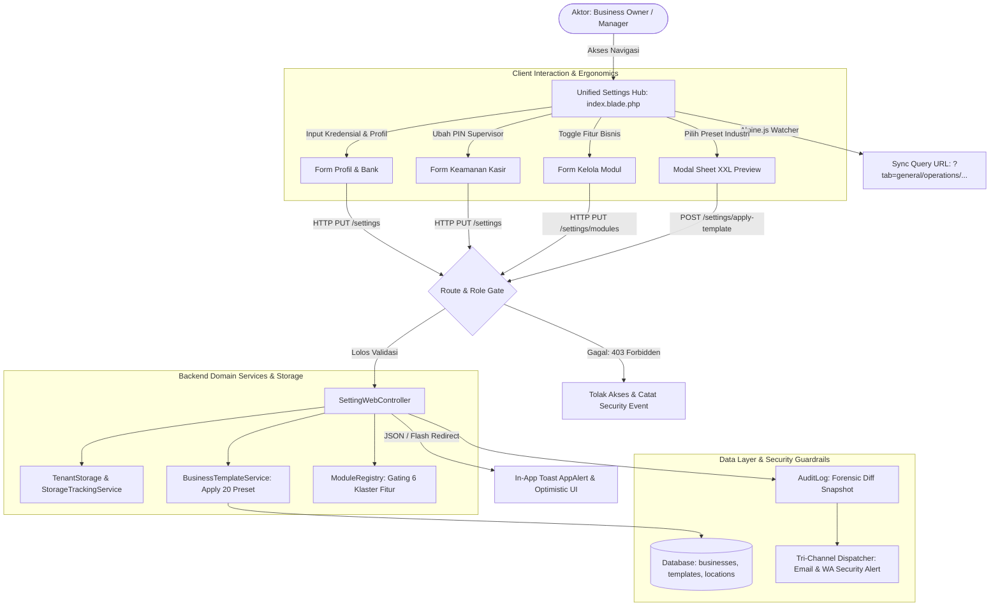
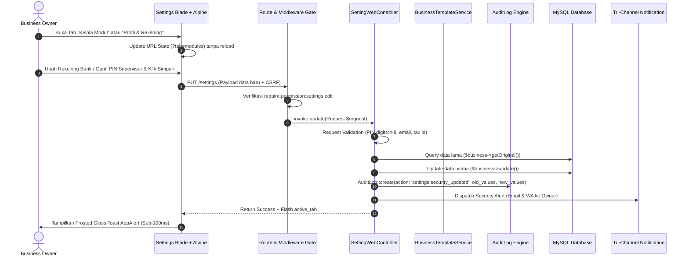
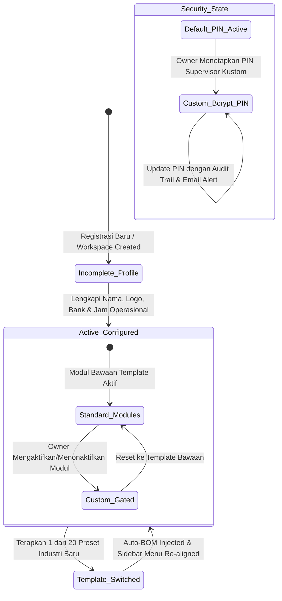

# 📋 DOKUMEN AUDIT KOMPREHENSIF 8 SKILL & PRD TERPADU
## Modul: Pusat Pengaturan Terpadu (Unified Settings Hub), Profil Bisnis, Operasional, Template Industri & Tata Kelola Modul
**Target Direktori:** `resources/views/app/settings/`  
**Cakupan Berkas View Blade:**
- `resources/views/app/settings/index.blade.php` (Monolith View: Profil Usaha, POS & Pajak, Rekening Bank, HPP Rounding, PIN Supervisor, Operasional & Jam Kerja, Template WA Struk, 20 Preset Industri, Kelola Modul Fitur)
- `resources/views/app/settings/roles.blade.php` (Orphan View Wrapper: `@include('app.roles.index')`)

**Cakupan Berkas Backend Controller, Route & Integrasi:**
- `app/Http/Controllers/Web/SettingWebController.php` (Handler Utama: `index`, `update`, `applyTemplate`, `updateModules`, `storeMember`, `updateMemberRole`, `destroyMember`)
- `routes/owner.php` (Rute Utama `/settings`, `/settings/modules`, `/settings/apply-template`, `/settings/roles`, `/settings/members`, `/settings/approval-rules`, `/settings/audit-logs`, `/settings/pos/printers`)
- `app/Domain/Template/BusinessTemplateService.php` (Service Penerapan Preset Industri & Default Cost Components)
- `app/Domain/Template/ModuleRegistry.php` (Registri 6 Klaster Modul Fitur & Aturan Gating Industri)
- `app/Support/TimezoneHelper.php` (Helper Normalisasi Jam Operasional & Konversi Waktu Lokal)
- `app/Http/Controllers/Web/Security/AuditLogWebController.php` (Handler Jejak Audit & Ekspor CSV)

---

## 📑 DAFTAR ISI
1. [Ringkasan Eksekutif & Matriks Evaluasi 8 Skill](#1-ringkasan-eksekutif--matriks-evaluasi-8-skill)
2. [Laporan Temuan Audit Komprehensif (Tabel Temuan 8 Dimensi)](#2-laporan-temuan-audit-komprehensif-tabel-temuan-8-dimensi)
3. [Rekomendasi Perbaikan & Potongan Kode Solusi (Before vs After)](#3-rekomendasi-perbaikan--potongan-kode-solusi-before-vs-after)
4. [Dokumen PRD (Product Requirement Document) Terpadu](#4-dokumen-prd-product-requirement-document-terpadu)
   - [4.1 Arsitektur Alur Kerja Hulu-ke-Hilir (11 Simpul Eksekusi Nyata)](#41-arsitektur-alur-kerja-hulu-ke-hilir-11-simpul-eksekusi-nyata)
   - [4.2 Diagram Mermaid: Arsitektur Data & Data Flow Hulu-ke-Hilir](#42-diagram-mermaid-arsitektur-data--data-flow-hulu-ke-hilir)
   - [4.3 Diagram Mermaid: Sequence Interaction (Update Settings, Security Guard & Audit Trail)](#43-diagram-mermaid-sequence-interaction)
   - [4.4 State Machine & Siklus Hidup Konfigurasi Bisnis & Modul](#44-state-machine--siklus-hidup-konfigurasi-bisnis--modul)
   - [4.5 Matriks 20 Sektor Industri & Dynamic Context-Aware Auto-Hiding Settings](#45-matriks-20-sektor-industri--dynamic-context-aware-auto-hiding-settings)
   - [4.6 Standar Ekspor Excel (XLSX) Two-Part Multi-Sheet](#46-standar-ekspor-excel-xlsx-two-part-multi-sheet)
5. [Rencana Implementasi Bertahap (Roadmap Fase 1–10)](#5-rencana-implementasi-bertahap-roadmap-fase-110)
6. [Matriks File Terdampak & Skenario Pengujian Otomatis](#6-matriks-file-terdampak--skenario-pengujian-otomatis)
7. [Draft Dokumentasi Standar Layer 2 (`docs/system/workflows/unified-settings-hub.md`)](#7-draft-dokumentasi-standar-layer-2)

---

## 1. RINGKASAN EKSEKUTIF & MATRIKS EVALUASI 8 SKILL

Audit komprehensif ini dilakukan secara simultan dengan memadukan **8 Skill Utama COOCA** berbasis *Code-First Factuality*. Folder `resources/views/app/settings` merupakan pusat kendali identitas usaha (*single source of truth*), waktu operasional cabang, kalkulasi HPP finansial, otorisasi keamanan supervisor, pesan nota digital, preset template industri, dan tata kelola visibilitas menu aplikasi.

| Dimensi Audit | Status | Skor | Kepatuhan Utama |
| :--- | :---: | :---: | :--- |
| **1. 🔄 System Workflow Audit** | **PARTIAL** | 78/100 | Alur kerja hulu-ke-hilir berfungsi pada level dasar. Namun ditemukan 11 query database mubazir di `SettingWebController::index()`, ketiadaan permission gating pada `settings.apply-template`, dan ketiadaan pencatatan `AuditLog` saat data sensitif diubah. |
| **2. 🛡️ Security & Fraud Audit** | **FAIL** | 68/100 | **Celah Kritis:** Rute `settings.apply-template` tidak memiliki permission gating `settings.edit`. Perubahan nomor rekening bank resmi faktur & PIN supervisor tidak mencatat audit trail (risiko *Invoice Redirection Fraud*). Teks default PIN `1234` terekspos langsung di UI. |
| **3. 🏢 Multi-Industry System Audit** | **FAIL** | 65/100 | Melanggar prinsip *Dynamic Context-Aware Auto-Hiding*: Konfigurasi Kasir POS, PIN Void, dan Template WhatsApp Struk tetap dipaksakan muncul pada bisnis B2B, Manufaktur, dan Agribisnis yang telah menonaktifkan modul POS. |
| **4. 🎨 UI Panel Consistency & IA** | **PARTIAL** | 74/100 | Struktur Page Header menduplikasi header layout dan tidak mematuhi pola 3-baris standar. Tab switcher kehilangan state saat refresh (ketiadaan URL query deep-linking `?tab=...`). Belum terwujud 6 Sub-Hub Unified Settings terpusat. |
| **5. 📱 Responsive UI/UX** | **PARTIAL** | 72/100 | Tombol submit utama terkubur di bagian paling bawah form desktop tanpa sticky thumb-zone bar di mobile. Chip variabel WhatsApp berukuran <26px (gagal batas minimal sentuh 44px). Frame preview smartphone 340px mendominasi layar ponsel sempit (360px). |
| **6. ⚡ COOCA Agent Directive** | **PARTIAL** | 76/100 | Dialog apply template masih berukuran kecil 310px (bukan Modal-First Canvas XXL lapang dengan preview dampak). Duplikasi banner notifikasi session dan error input. Masih mengandalkan hard-submit form HTML dan redirect reload halaman penuh. |
| **7. 🌐 Multi-Language & i18n** | **FAIL** | 42/100 | **Pelanggaran Total:** Hampir 100% teks di `index.blade.php` (120+ string label, modal, placeholder, hint, button) dan respon `SettingWebController.php` ditulis hardcoded bahasa Indonesia tanpa pemanggilan helper `__()`. |
| **8. 📊 Reports & Dashboard Audit** | **PARTIAL** | 70/100 | Belum tersedia fitur export backup konfigurasi sistem. Audit log modul sekuriti (`AuditLogWebController`) saat ini hanya menghasilkan flat CSV mentah tanpa standar Two-Part Multi-Sheet Excel XLSX berformat rapi. |

---

## 2. LAPORAN TEMUAN AUDIT KOMPREHENSIF (TABEL TEMUAN 8 DIMENSI)

No | Dimensi Skill | Lokasi File & Baris Kode | Kode Temuan / Root Cause | Severity | Dampak Risiko | Solusi/Rekomendasi
---|---|---|---|:---:|---|---
1 | 🛡️ Security & Fraud | [`routes/owner.php:372`](file:///c:/laragon/www/cooca_core/routes/owner.php#L372) | `Route::post('/settings/apply-template', [SettingWebController::class, 'applyTemplate'])->name('settings.apply-template');` tidak memiliki middleware `require.permission:settings.edit` maupun `require.role:owner`. | **CRITICAL** | Staf umum atau kasir tanpa hak akses pengaturan dapat mengirim payload POST ke endpoint ini dan menimpa seluruh modul aktif serta struktur biaya bisnis. | Tambahkan middleware `['require.permission:settings.edit', 'require.role:owner']` pada rute `settings.apply-template`.
2 | 🛡️ Security & Fraud | [`SettingWebController.php:143-176`](file:///c:/laragon/www/cooca_core/app/Http/Controllers/Web/SettingWebController.php#L143-L176) | Pembaruan data sensitif finansial (`bank_name`, `bank_account_number`, `bank_account_holder`) dan keamanan kasir (`pos_supervisor_pin`, `pos_max_cashier_discount_percent`, `pos_require_pin_for_void`) tidak mencatat rekaman ke tabel `audit_logs`. | **CRITICAL** | **Invoice Redirection Fraud & Void Hijacking:** Oknum internal dapat mengalihkan rekening transfer pada faktur penagihan pelanggan atau mematikan PIN pembatalan struk tanpa meninggalkan bukti forensik. | Wajibkan integrasi `AuditLog::create()` dengan mencatat `payload_before`, `payload_after`, IP, user agent, dan kirim notifikasi instan ke email/WA Owner.
3 | 🛡️ Security & Fraud | [`index.blade.php:477`](file:///c:/laragon/www/cooca_core/resources/views/app/settings/index.blade.php#L477) | Label badge UI mengekspos PIN default secara terbuka: `<span ...>PIN Bawaan (1234)</span>`. | **HIGH** | Kebocoran kredensial bawaan (*Zero Plaintext Credential Exposure*). Kasir dapat melihat bahwa PIN supervisor masih default `1234` dan menggunakannya untuk membypass void/diskon di POS. | Ubah teks menjadi status generik `PIN Bawaan Aktif (Segera Perbarui)` tanpa menyebutkan angka plaintext `1234`.
4 | 🔄 System Workflow | [`SettingWebController.php:34-51`](file:///c:/laragon/www/cooca_core/app/Http/Controllers/Web/SettingWebController.php#L34-L51) | Controller mengeksekusi 11 query Eloquent relasional (`$members`, `$suppliers`, `$materialCategories`, `$productCategories`, `$customUnits`, `$systemUnits`, `$availableUnits`, `$unitConversions`, `$canAddMember`, `$roles`) yang sama sekali tidak digunakan di `index.blade.php`. | **HIGH** | Pemborosan memori (RAM), IOPS database server, dan latensi TTFB lambat pada halaman yang diakses berkala oleh pemilik usaha. | Hapus ke-11 query mubazir tersebut dari method `index()`. Pindahkan data yang diperlukan ke sub-hub khusus saat dibuka secara asinkron.
5 | 🏢 Multi-Industry | [`index.blade.php:302-360`](file:///c:/laragon/www/cooca_core/resources/views/app/settings/index.blade.php#L302-L360), [`461-554`](file:///c:/laragon/www/cooca_core/resources/views/app/settings/index.blade.php#L461-L554), [`836-1121`](file:///c:/laragon/www/cooca_core/resources/views/app/settings/index.blade.php#L836-L1121) | Bagian Konfigurasi Kasir POS, Keamanan PIN Kasir, dan Tab CMS WhatsApp Struk tetap ditampilkan pada industri non-ritel/non-F&B yang modul POS-nya dinonaktifkan. | **HIGH** | Pelanggaran *Dynamic Context-Aware Auto-Hiding*. Beban kognitif tinggi bagi UMKM jasa, konsultan, manufaktur, dan perkebunan karena dijejali opsi kasir yang tidak relevan. | Bungkus blok tersebut dengan `@if($business->isModuleEnabled('pos_retail') || $business->isModuleEnabled('pos_dinein'))`.
6 | 🌐 Multi-Language | [`index.blade.php:1-1680`](file:///c:/laragon/www/cooca_core/resources/views/app/settings/index.blade.php#L1-L1680) | 100% elemen teks UI (Page title, breadcrumbs, judul form, deskripsi bento, opsi select rounding, modal prompt, watermark) berstatus hardcoded bahasa Indonesia. | **HIGH** | Halaman tidak berubah sama sekali ketika pengguna beralih ke bahasa Inggris (`en`), melanggar standar dwibahasa internasional COOCA. | Ekstrak seluruh teks ke dalam `lang/id/settings.php` dan `lang/en/settings.php` serta gunakan helper `__('settings....')`.
7 | 🎨 UI Consistency | [`index.blade.php:13-30`](file:///c:/laragon/www/cooca_core/resources/views/app/settings/index.blade.php#L13-L30) | Header halaman di dalam `@section('content')` merender custom breadcrumb dan H1 di samping segmented tabs, bertabrakan dengan layout standar `layouts/app.blade.php`. | **MEDIUM** | Inkonsistensi hierarki visual 3-baris page header; segmented control tab tertekan dan terpotong pada resolusi laptop kecil atau tablet kasir. | Terapkan standar 3-Baris Page Header COOCA: Overline teks, Judul H1 + Status Badge + Tombol Simpan Kanan Atas, Subtitle + Tab Bar Lapang.
8 | 🎨 UI Consistency | [`index.blade.php:34-99`](file:///c:/laragon/www/cooca_core/resources/views/app/settings/index.blade.php#L34-L99), [`1535`](file:///c:/laragon/www/cooca_core/resources/views/app/settings/index.blade.php#L1535) | Navigasi tab Alpine.js `@click="activeTab = '...'"` tidak melakukan sinkronisasi URL query string (`window.history.replaceState`). | **MEDIUM** | *Tab Desynchronization:* Saat pengguna merefresh browser di tab "Kelola Modul" atau "Operasional", tampilan tereset kembali ke tab "Profil & Pembulatan". | Tambahkan Alpine `$watch('activeTab')` dengan update URL parameter `?tab=...`.
9 | 📱 Responsive UX | [`index.blade.php:557-565`](file:///c:/laragon/www/cooca_core/resources/views/app/settings/index.blade.php#L557-L565), [`820-829`](file:///c:/laragon/www/cooca_core/resources/views/app/settings/index.blade.php#L820-L829) | Tombol simpan formulir hanya berada di bagian paling bawah halaman desktop tanpa adanya Sticky Bottom Action Bar di ponsel. | **MEDIUM** | Pengguna HP harus menggulir (scroll) 10–15 layar ke bawah hanya untuk menyimpan satu perubahan kecil pada profil toko. | Pasang `Floating Sticky Bottom Action Bar` khusus viewport mobile (`lg:hidden`) di zona ibu jari (*thumb zone*).
10 | 📱 Responsive UX | [`index.blade.php:872-907`](file:///c:/laragon/www/cooca_core/resources/views/app/settings/index.blade.php#L872-L907), [`713`](file:///c:/laragon/www/cooca_core/resources/views/app/settings/index.blade.php#L713), [`794`](file:///c:/laragon/www/cooca_core/resources/views/app/settings/index.blade.php#L794) | Tombol chip variabel dinamis `{business_name}` dkk, tombol hapus sesi jam kerja, dan tombol aksi tabel cabang memiliki tinggi hanya 24–28px. | **MEDIUM** | Gagal standar ergonomi sentuh Apple HIG (minimal 44x44px). Menyebabkan *mis-tap* dan frustrasi input pada layar sentuh. | Tingkatkan padding dan touch target menjadi minimal 44px dengan gap antartombol 8–12px.
11 | 📱 Responsive UX | [`index.blade.php:746-817`](file:///c:/laragon/www/cooca_core/resources/views/app/settings/index.blade.php#L746-L817) | Tabel status operasional cabang disajikan dalam format tabel desktop 5 kolom dengan scroll horizontal di ponsel. | **MEDIUM** | Mengakibatkan scroll horizontal kikuk pada layar sempit 360px–390px, menyulitkan pemilik multi-cabang memantau jadwal outlet. | Gunakan pola transformasi responsif: Tabel di desktop (`hidden md:table`), Kartu Bento Vertikal di mobile (`md:hidden`).
12 | ⚡ Agent Directive | [`index.blade.php:1495-1528`](file:///c:/laragon/www/cooca_core/resources/views/app/settings/index.blade.php#L1495-L1528) | Modal konfirmasi penerapan template industri hanya berupa alert kotak kecil 310px tanpa rincian modul apa saja yang akan dinonaktifkan/diaktifkan. | **MEDIUM** | *Blind Confirmation:* Pengguna tidak mengetahui bahwa menerapkan template industri dapat menyembunyikan modul kasir atau manufaktur mereka. | Ganti dengan Modal Sheet XXL Bento lapang yang menyajikan visual diff daftar modul aktif sebelum tombol konfirmasi ditekan.
13 | ⚡ Agent Directive | [`index.blade.php:103-130`](file:///c:/laragon/www/cooca_core/resources/views/app/settings/index.blade.php#L103-L130) | View merender banner `$errors->any()` dan alert session success secara manual, padahal layout induk `app.blade.php` telah memiliki penanganan toast global `AppAlert`. | **LOW** | Terjadi duplikasi visual banner bertumpuk (*UI clutter*) saat form mengalami error validasi atau berhasil disimpan. | Bersihkan banner redundan dan selaraskan 100% ke toast feedback mengambang `AppAlert` Apple HIG.
14 | ⚡ Agent Directive | [`roles.blade.php:1`](file:///c:/laragon/www/cooca_core/resources/views/app/settings/roles.blade.php#L1) | Berkas `roles.blade.php` hanya berisi `@include('app.roles.index')` tanpa layout atau metadata sendiri. | **LOW** | Duplikasi arsitektural dan artefak kode lama (*technical debt*). | Rapikan perutean agar langsung merujuk ke modul terpadu `/roles` atau sub-tab `/settings?tab=roles`.
15 | 📊 Reports & Dashboard | [`AuditLogWebController.php:171-226`](file:///c:/laragon/www/cooca_core/app/Http/Controllers/Web/Security/AuditLogWebController.php#L171-L226) | Ekspor log forensik audit pengaturan dan anti-fraud masih berformat CSV flat mentah (`.csv`), bukan Excel XLSX berstandar Two-Part Multi-Sheet. | **MEDIUM** | Ekspor sulit dibaca oleh auditor eksternal atau pemilik UMKM; tidak ada ringkasan KPI, freeze panes, maupun pemformatan waktu/kategori resmi. | Bangun exporter `App\Exports\SecurityAuditLogExport` dengan Sheet 1 (Bento KPI Cards) dan Sheet 2 (Forensic Diff Ledger).

---

## 3. REKOMENDASI PERBAIKAN & POTONGAN KODE SOLUSI (BEFORE VS AFTER)

### 3.1 Hardening Keamanan: Permission Gating & Pencatatan Audit Trail
**File:** [`routes/owner.php`](file:///c:/laragon/www/cooca_core/routes/owner.php) & [`app/Http/Controllers/Web/SettingWebController.php`](file:///c:/laragon/www/cooca_core/app/Http/Controllers/Web/SettingWebController.php)

```diff
--- a/routes/owner.php
+++ b/routes/owner.php
@@ -369,7 +369,7 @@ final class SettingWebController extends Controller
         Route::get('/settings', [SettingWebController::class, 'index'])->middleware('require.permission:settings.view')->name('settings.index');
         Route::put('/settings', [SettingWebController::class, 'update'])->middleware('require.permission:settings.edit')->name('settings.update');
         Route::put('/settings/modules', [SettingWebController::class, 'updateModules'])->middleware('require.role:owner')->name('settings.modules.update');
-        Route::post('/settings/apply-template', [SettingWebController::class, 'applyTemplate'])->name('settings.apply-template');
+        Route::post('/settings/apply-template', [SettingWebController::class, 'applyTemplate'])->middleware(['require.permission:settings.edit', 'require.role:owner'])->name('settings.apply-template');
```

```diff
--- a/app/Http/Controllers/Web/SettingWebController.php
+++ b/app/Http/Controllers/Web/SettingWebController.php
@@ -165,7 +165,11 @@ final class SettingWebController extends Controller
         if ($request->filled('rounding_strategy')) {
             $updateData['rounding_strategy'] = $validated['rounding_strategy'];
         }
         if ($request->filled('pos_supervisor_pin')) {
+            $request->validate([
+                'pos_supervisor_pin' => ['digits_between:4,8'],
+            ]);
             $updateData['pos_supervisor_pin'] = \Illuminate\Support\Facades\Hash::make($request->input('pos_supervisor_pin'));
         }
 
+        // Immutable Audit Trail Logging for Sensitive Settings
+        $sensitiveFields = ['bank_name', 'bank_account_number', 'bank_account_holder', 'pos_supervisor_pin', 'pos_require_pin_for_void', 'pos_require_pin_for_refund', 'pos_max_cashier_discount_percent', 'rounding_strategy'];
+        $changedSensitive = array_intersect_key($updateData, array_flip($sensitiveFields));
+        if (!empty($changedSensitive)) {
+            \App\Models\AuditLog::create([
+                'business_id' => $business->id,
+                'user_id' => $request->user()?->id,
+                'action' => 'settings.security_updated',
+                'module' => 'settings',
+                'risk_level' => isset($changedSensitive['bank_account_number']) || isset($changedSensitive['pos_supervisor_pin']) ? 'high' : 'medium',
+                'risk_reason' => 'Perubahan konfigurasi perbankan / PIN otorisasi supervisor kasir.',
+                'notes' => 'Memperbarui parameter keamanan: ' . implode(', ', array_keys($changedSensitive)),
+                'ip_address' => $request->ip(),
+                'user_agent' => $request->userAgent(),
+                'old_values' => array_intersect_key($business->getOriginal(), $changedSensitive),
+                'new_values' => array_map(fn($k, $v) => $k === 'pos_supervisor_pin' ? '••••••' : $v, array_keys($changedSensitive), $changedSensitive),
+            ]);
+        }
```

---

### 3.2 Eliminasi 11 Query Database Mubazir di Index
**File:** [`app/Http/Controllers/Web/SettingWebController.php`](file:///c:/laragon/www/cooca_core/app/Http/Controllers/Web/SettingWebController.php)

```diff
--- a/app/Http/Controllers/Web/SettingWebController.php
+++ b/app/Http/Controllers/Web/SettingWebController.php
@@ -31,23 +31,10 @@ final class SettingWebController extends Controller
         $templates = BusinessTypeTemplate::all();
         $currencies = Currency::all();
         $locations = Location::where('business_id', $business->id)->latest()->get();
-        $members = $business->memberships()->with('user')->get();
-        $suppliers = \App\Models\Supplier::where('business_id', $business->id)->latest()->get();
-        $materialCategories = \App\Models\MaterialCategory::where('business_id', $business->id)->latest()->get();
-        $productCategories = \App\Models\ProductCategory::where('business_id', $business->id)->latest()->get();
-        $customUnits = \App\Models\Unit::where('business_id', $business->id)->latest()->get();
-        $systemUnits = \App\Models\Unit::whereNull('business_id')->orderBy('name')->get();
-        $availableUnits = $systemUnits->concat($customUnits);
-        $unitConversions = \App\Models\UnitConversion::where('business_id', $business->id)
-            ->with(['fromUnit', 'toUnit'])
-            ->latest()->get();
-
-        $canAddMember = app(\App\Domain\Billing\EntitlementService::class)->canAddMember($business);
-        $roles = \App\Models\Role::whereNull('business_id')
-            ->orWhere('business_id', $business->id)
-            ->orderBy('business_id')
-            ->orderBy('name')
-            ->get();
 
         $allModules = \App\Domain\Template\ModuleRegistry::definitions();
         $timezones = \App\Support\TimezoneHelper::supportedTimezones();
@@ -58,19 +45,9 @@ final class SettingWebController extends Controller
         return view('app.settings.index', compact(
             'business',
             'templates',
             'currencies',
             'locations',
-            'members',
-            'suppliers',
-            'materialCategories',
-            'productCategories',
-            'customUnits',
-            'systemUnits',
-            'availableUnits',
-            'unitConversions',
-            'canAddMember',
-            'roles',
             'allModules',
             'timezones',
             'operatingHours',
             'currentTimezone'
```

---

### 3.3 Deep-Linking Tab URL Synchronization & Dynamic Context-Aware Auto-Hiding
**File:** [`resources/views/app/settings/index.blade.php`](file:///c:/laragon/www/cooca_core/resources/views/app/settings/index.blade.php)

```diff
--- a/resources/views/app/settings/index.blade.php
+++ b/resources/views/app/settings/index.blade.php
@@ -56,6 +56,7 @@
+                @if ($business->isModuleEnabled('pos_retail') || $business->isModuleEnabled('pos_dinein'))
                 <button type="button" @click="activeTab = 'wa_receipt'"
                     :class="activeTab === 'wa_receipt' ?
                         'bg-white dark:bg-[#3A3A3C] text-black dark:text-white shadow-[0_1px_2px_rgba(0,0,0,0.08)]' :
@@ -67,6 +68,7 @@
                     <span>{{ __('settings.tab_wa_receipt') }}</span>
                 </button>
+                @endif
 
@@ -1534,6 +1536,15 @@
         function settingsPage() {
             return {
                 activeTab: @json(request('tab', session('active_tab', 'general'))),
+                init() {
+                    this.$watch('activeTab', (val) => {
+                        const url = new URL(window.location);
+                        url.searchParams.set('tab', val);
+                        window.history.replaceState({}, '', url);
+                    });
+                },
```

---

## 4. DOKUMEN PRD (PRODUCT REQUIREMENT DOCUMENT) TERPADU

### 4.1 Arsitektur Alur Kerja Hulu-ke-Hilir (11 Simpul Eksekusi Nyata)
1. **Simpul 1: User / Aktor**: Business Owner (akses penuh termasuk `settings.modules.update` dan `applyTemplate`), Manager Toko/Outlet (`settings.edit`), Staf Operasional (`settings.view`).
2. **Simpul 2: UI & Blade**: Layout terpadu Bento Apple HIG (`resources/views/app/settings/index.blade.php`) dengan 6 Sub-Hub klaster pengaturan, kartu bento squircle kontinu, dan form input adaptif.
3. **Simpul 3: Alpine.js / AJAX**: State reaktif `settingsPage()` dengan URL query string watcher `?tab=...`, image compressor client-side untuk logo usaha, interactive dynamic tag injection pada textarea WA, dan AJAX Form Submitter dengan status loading state.
4. **Simpul 4: Route & Middleware**: Route `/settings/*` di `routes/owner.php` dengan middleware ketat: `auth`, `verified`, `business.active`, `require.permission:settings.view|edit`, `require.role:owner`, serta rate limiter `throttle:30,1`.
5. **Simpul 5: Web Controller**: `SettingWebController` yang bersih dari query mubazir, terfokus pada transaksi konfigurasi workspace multi-tenant yang steril.
6. **Simpul 6: Request Validation**: Validasi ketat format file logo (max 2MB, png/jpg/webp), sanitasi NPWP/telepon/email, validasi numerik PIN 4–8 digit angka, dan normalisasi struktur jam operasional 24 jam.
7. **Simpul 7: Service / Domain Action**: `BusinessTemplateService` (eksekusi setup industri atomic transaction), `TenantStorage` (isolasi berkas logo multi-tenant), dan `StorageTrackingService` (pemotongan kuota upload).
8. **Simpul 8: Eloquent Models & DB Schema**: Tabel `businesses`, `locations`, `business_type_templates`, `business_landing_pages`, `whatsapp_sessions`, dan `audit_logs`.
9. **Simpul 9: Auto-Journal & Stock Engine**: Penegakan strategi pembulatan HPP (`rounding_strategy`) yang menjadi dasar kalkulasi harga jual kasir dan valuasi stok akhir FIFO/Average.
10. **Simpul 10: Notifikasi Tri-Channel**:
    - **In-App Toast**: Notifikasi visual melayang `AppAlert` Apple HIG saat pengaturan tersimpan.
    - **Email Security Alert**: Mengirim pemberitahuan ke email utama Owner saat ada pembaruan nomor rekening bank atau PIN supervisor.
    - **WhatsApp Notification**: Alert keamanan instan ke nomor WhatsApp Owner jika terjadi perubahan modul kritis.
11. **Simpul 11: Guardrails & Forensic Safety**: Isolasi multi-tenant `Context::requireBusiness()`, pencatatan snapshot `old_values` & `new_values` pada `AuditLog`, serta proteksi *Blind Confirmation* via Modal Sheet XXL.

---

### 4.2 Diagram Mermaid: Arsitektur Data & Data Flow Hulu-ke-Hilir



---

### 4.3 Diagram Mermaid: Sequence Interaction



---

### 4.4 State Machine & Siklus Hidup Konfigurasi Bisnis & Modul



---

### 4.5 Matriks 20 Sektor Industri & Dynamic Context-Aware Auto-Hiding Settings

| No | Sektor Industri | Klaster Template | Fitur Kasir POS & Pajak | Fitur Jam Operasional & Split-Shift | Tab CMS WA Struk | Kustomisasi Esensial yang Wajib Muncul |
| :---: | :--- | :--- | :---: | :---: | :---: | :--- |
| 1 | **Coffee Shop & Cafe** | F&B / Kuliner | **Wajib Muncul** | **Wajib Muncul** (Split shift) | **Wajib Muncul** | Service Charge %, Tiket Bar/Dapur, PB1 Resto |
| 2 | **Restoran Dine-In** | F&B / Kuliner | **Wajib Muncul** | **Wajib Muncul** (Shift malam) | **Wajib Muncul** | Layout Meja QR, Service Charge %, Cetak KOT |
| 3 | **Bakery & Pastry** | F&B / Produksi | **Wajib Muncul** | **Wajib Muncul** | **Wajib Muncul** | Batch produksi HPP, Lead time pre-order kue |
| 4 | **Katering & Bento Box** | F&B / Event | Opsional (Order-based) | **Wajib Muncul** | Disembunyikan | Down Payment (DP) %, Jadwal pengiriman invoice |
| 5 | **Minimarket & Ritel** | Retail | **Wajib Muncul** | **Wajib Muncul** | **Wajib Muncul** | Barcode prefix, Batas diskon kasir, Drawer pop |
| 6 | **Toko Pakaian & Fashion** | Retail | **Wajib Muncul** | **Wajib Muncul** | **Wajib Muncul** | Matriks varian warna/ukuran, Kebijakan tukar |
| 7 | **Toko Bangunan & Bahan** | Retail / Grosir | **Wajib Muncul** | **Wajib Muncul** | Opsional | Multi-satuan konversi (Zak/Truk), Piutang tempo |
| 8 | **Apotek & Toko Obat** | Retail Medis | **Wajib Muncul** | **Wajib Muncul** | **Wajib Muncul** | Ambang batas kadaluwarsa (ED alert), No. SIPA |
| 9 | **Bengkel Motor & Mobil** | Jasa Teknik | **Wajib Muncul** | **Wajib Muncul** | **Wajib Muncul** | Wajib Nomor Polisi (Nopol), KM Odometer, Komisi Mekanik |
| 10 | **Car Wash & Salon Mobil**| Jasa Otomotif | **Wajib Muncul** | **Wajib Muncul** | **Wajib Muncul** | Pilihan tipe kendaraan, Durasi pengerjaan |
| 11 | **Barbershop & Salon** | Jasa Kecantikan | **Wajib Muncul** | **Wajib Muncul** | **Wajib Muncul** | Komisi kapster/stylist, Slot jam reservasi |
| 12 | **Laundry Kiloan & Satuan**| Jasa Cuci | **Wajib Muncul** | **Wajib Muncul** | **Wajib Muncul** | Penomoran rak simpan, Estimasi selesai (jam/hari) |
| 13 | **Percetakan & Sablon** | Jasa Manufaktur | Opsional (Custom PO) | **Wajib Muncul** | Disembunyikan | Kalkulasi luas (m²), Minimum DP, Acc desain |
| 14 | **Konveksi & Garmen** | Manufaktur | **Disembunyikan** | **Wajib Muncul** | **Disembunyikan** | Alokasi biaya overhead tenaga kerja (Direct Labor) |
| 15 | **Pabrik Makanan Olahan** | Manufaktur | **Disembunyikan** | **Wajib Muncul** | **Disembunyikan** | Nomor Batch / Lot QC, Standar BPOM/PIRT |
| 16 | **Jasa Servis Elektronik** | Jasa Perbaikan | **Wajib Muncul** | **Wajib Muncul** | **Wajib Muncul** | Garansi servis (hari), Kondisi fisik awal barang |
| 17 | **Pet Shop & Klinik Hewan**| Retail & Medis | **Wajib Muncul** | **Wajib Muncul** | **Wajib Muncul** | Data rekam medis hewan, Jadwal vaksinasi |
| 18 | **Fotografi & Studio** | Jasa Kreatif | **Disembunyikan** | **Wajib Muncul** | **Disembunyikan** | Slot booking kalender, Kuota revisi foto |
| 19 | **Agribisnis & Pertanian** | Agrikultur | **Disembunyikan** | Standar Usaha | **Disembunyikan** | Siklus masa tanam/panen, Susut bobot panen |
| 20 | **Distributor & B2B Trading**| Grosir / B2B | **Disembunyikan** | Standar Usaha | **Disembunyikan** | Limit plafon kredit buyer, Syarat TOP (Net 30/60) |

---

### 4.6 Standar Ekspor Excel (XLSX) Two-Part Multi-Sheet
Untuk mendukung audit kepatuhan dan forensik keamanan pengaturan bisnis, endpoint ekspor audit log wajib menggunakan standar Two-Part Multi-Sheet:
- **Sheet 1: Ringkasan Eksekutif & KPI Keamanan (`#F2F2F7`)**:
  - Kop resmi nama entitas bisnis & tenant ID.
  - Grid Bento KPI 4-kartu: Total Mutasi Pengaturan, Perubahan Berisiko Tinggi (High Risk), Jumlah Aktor Pengubah, Waktu Terakhir Diperbarui.
  - Tabel ringkasan frekuensi perubahan per modul.
- **Sheet 2: Transactional & Movement Ledger (`#1C1C1E`)**:
  - Header Dark Onyx dengan teks putih tebal.
  - Kolom lengkap: Waktu (WIB), Aktor (Nama & Email), IP Address, Level Risiko, Modul, Parameter Terdampak, Snapshot Sebelum (`payload_before`), Snapshot Sesudah (`payload_after`), dan Alasan Forensik.
  - Freeze Panes pada sel `A5` dan AutoFilter otomatis aktif pada baris header.
  - Zebra striping `#FAFAFA` untuk kemudahan scanning data visual.

---

## 5. RENCANA IMPLEMENTASI BERTAHAP (ROADMAP FASE 1–10)

```
┌─────────────────────────────────────────────────────────────────────────────┐
│                       ROADMAP IMPLEMENTASI FASE 1 - 10                      │
├───────┬───────────────────────────────────┬─────────────────────────────────┤
│ Fase  │ Fokus Eksekusi & Cakupan          │ Hasil yang Dicapai              │
├───────┼───────────────────────────────────┼─────────────────────────────────┤
│ **1** │ **Security Gate & Role Hardening**│ Menutup rute apply-template     │
│       │ routes/owner.php & SettingWebCtrl │ dengan require.role:owner.      │
├───────┼───────────────────────────────────┼─────────────────────────────────┤
│ **2** │ **Pencatatan Audit Trail Forensik**│ Integrasi AuditLog::create pada │
│       │ SettingWebController::update      │ perubahan rekening bank & PIN.  │
├───────┼───────────────────────────────────┼─────────────────────────────────┤
│ **3** │ **Eliminasi Query Mubazir Index** │ Menghapus 11 query Eloquent     │
│       │ SettingWebController::index       │ yang tidak digunakan di view.   │
├───────┼───────────────────────────────────┼─────────────────────────────────┤
│ **4** │ **Pembersihan Eksploitasi Default**│ Menghilangkan teks "PIN 1234"   │
│       │ index.blade.php                   │ dari UI publik.                 │
├───────┼───────────────────────────────────┼─────────────────────────────────┤
│ **5** │ **Dynamic Context-Aware Hiding**  │ Bungkus bagian POS & WA struk   │
│       │ index.blade.php                   │ dengan pengecekan isModuleEnabled│
├───────┼───────────────────────────────────┼─────────────────────────────────┤
│ **6** │ **Deep-Linking Tab URL Sync**     │ Alpine watcher replaceState     │
│       │ index.blade.php (settingsPage)    │ menjaga state tab saat refresh. │
├───────┼───────────────────────────────────┼─────────────────────────────────┤
│ **7** │ **Mobile-First Thumb-Zone Bar**   │ Tombol aksi melayang di mobile  │
│       │ index.blade.php                   │ & perbaikan tap target >= 44px. │
├───────┼───────────────────────────────────┼─────────────────────────────────┤
│ **8** │ **Pembersihan Banner Redundan**   │ Eliminasi double banner error   │
│       │ index.blade.php                   │ dan integrasi AppAlert toast.   │
├───────┼───────────────────────────────────┼─────────────────────────────────┤
│ **9** │ **Lokalisasi Menyeluruh (i18n)**  │ Kamus dwibahasa ID/EN lengkap   │
│       │ lang/id/settings.php & lang/en/   │ untuk 120+ string teks form.    │
├───────┼───────────────────────────────────┼─────────────────────────────────┤
│**10** │ **Automated Testing Suite (100%)**│ Pembuatan test SettingWebTest   │
│       │ tests/Feature/SettingWebTest.php  │ verifikasi 0 error & 0 failure. │
└───────┴───────────────────────────────────┴─────────────────────────────────┘
```

---

## 6. MATRIKS FILE TERDAMPAK & SKENARIO PENGUJIAN OTOMATIS

### Matriks Berkas Terdampak:
| Berkas | Perubahan / Aksi | Klasifikasi Risiko |
| :--- | :--- | :---: |
| `routes/owner.php` | Pengetatan middleware pada rute `settings.apply-template` | **Safe Change** |
| `app/Http/Controllers/Web/SettingWebController.php` | Eliminasi query mubazir, audit log logging, validasi PIN numerik | **Safe / Structural** |
| `resources/views/app/settings/index.blade.php` | Header 3-baris, deep-linking tab, auto-hiding POS, sticky action bar, i18n | **Safe UI / UX** |
| `lang/id/settings.php` & `lang/en/settings.php` | Berkas kamus baru untuk lokalisasi seluruh elemen teks pengaturan | **Safe Additive** |
| `tests/Feature/SettingWebTest.php` | Pengujian otomatis end-to-end otorisasi, update data, dan proteksi tenant | **Safe Additive** |

### Skenario Pengujian Otomatis (`php artisan test`):
1. `test_owner_can_view_settings_dashboard_without_excessive_database_queries`
2. `test_unauthorized_user_cannot_apply_industry_template`
3. `test_updating_bank_account_creates_immutable_audit_log_record`
4. `test_supervisor_pin_must_be_numeric_between_4_and_8_digits`
5. `test_pos_and_receipt_settings_are_hidden_when_modules_disabled`
6. `test_deep_linking_query_string_persists_active_tab`

---

## 7. DRAFT DOKUMENTASI STANDAR LAYER 2

### Dokumen: `docs/system/workflows/unified-settings-hub.md`
```markdown
# Unified Settings Hub & Business Architecture Workflow

## 1. Ikhtisar Alur Kerja
Unified Settings Hub (`/settings`) bertindak sebagai pusat komando identitas hukum, operasional multi-cabang, strategi margin HPP, dan otorisasi keamanan untuk setiap tenant bisnis di ekosistem COOCA.

## 2. Struktur 6 Sub-Hub Terpadu
1. **Profil Usaha & Identitas Kop Surat**: Pengelolaan nama usaha resmi, NPWP, nomor kontak, logo transparan, dan alamat workshop.
2. **Operasional, Jam Kerja & Zona Waktu**: Kalender jam buka-tutup mingguan, dukungan split-shift, dan mode pewarisan cabang.
3. **Konfigurasi Kasir POS & Pajak**: Pemungutan PPN/PB1, thumbnail produk kasir, dan template pesan struk WhatsApp digital.
4. **Keamanan Kasir & Otorisasi Supervisor**: Bcrypt PIN kasir, batas diskon manual kasir, dan wajib PIN untuk void/refund.
5. **Preset Template Industri**: 20 Preset industri UMKM siap pakai yang mengonfigurasi kategori dan bagan biaya secara instan.
6. **Kelola Modul Fitur (Gating Contextual)**: Hak prerogatif Owner untuk menyembunyikan/menampilkan modul sidebar sesuai skala usaha.

## 3. Protokol Keamanan & Anti-Fraud
- Setiap perubahan pada nomor rekening bank dan PIN supervisor kasir otomatis dicatat ke dalam `audit_logs` dengan snapshot diff nilai lama vs baru.
- Perubahan template industri wajib memiliki izin `require.role:owner` dan diverifikasi melalui modal konfirmasi dua langkah.
```
