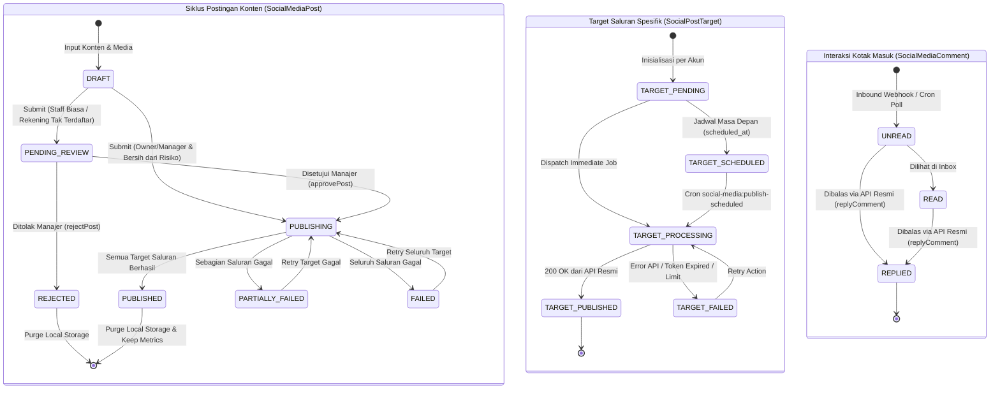
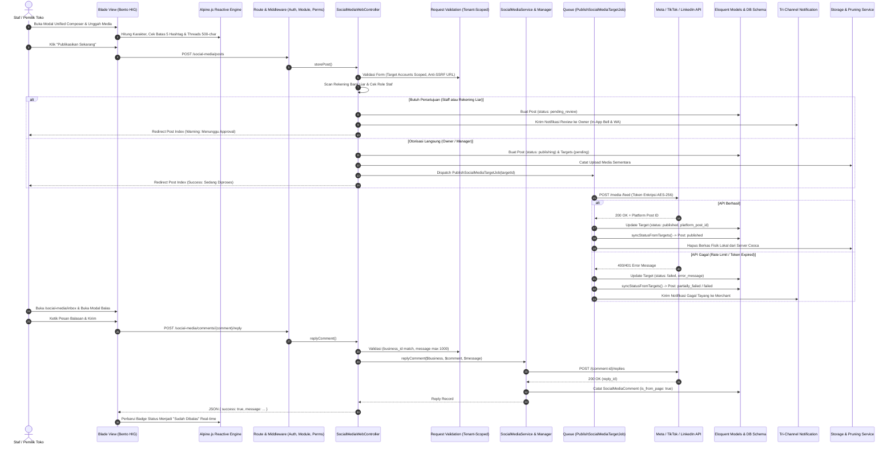

# LAPORAN AUDIT KOMPREHENSIF PENUH: EKOSISTEM SOCIAL MEDIA MARKETING COOCA

**Dokumen:** `docs/AUDIT_KOMPREHENSIF_SOCIAL_MEDIA_7_SKILL.md`  
**Target Modul:** `resources/views/app/social_media/` (`index.blade.php`, `posts.blade.php`, `calendar.blade.php`, `inbox.blade.php`, `insights.blade.php`) & Ekosistem Pendukung (`SocialMediaWebController`, `SocialMediaService`, `SocialMediaManager`, `PublishSocialMediaTargetJob`, Models, DB Schema, & Rute)  
**Metodologi:** Code-First Factuality (7 Skill Utama COOCA Diuji Simultan Berbasis Baris Kode Riil)  
**Status Evaluasi:** **CRITICAL RUNTIME DEFECT & ARCHITECTURAL HARDENING REQUIRED**  
**Prinsip Keamanan:** **MANDAT KESELAMATAN AKTIF (Interactive Confirmation Gate)**

---

## EXECUTIVE SUMMARY

Audit komprehensif ini dijalankan secara serentak terhadap seluruh berkas antarmuka (*Blade Views*) dan arsitektur backend pendukung pada modul `resources/views/app/social_media/` yang mengelola pemasaran multi-saluran omni-channel UMKM Indonesia:
1. **Koneksi Akun & Cockpit (`index.blade.php`)**: Onboarding 1-Klik Meta (Facebook Page, Instagram Bisnis, Threads), TikTok OAuth 2.0 Content Posting API, dan LinkedIn OAuth 2.0.
2. **Unified Content Composer & Feed (`posts.blade.php`)**: Pembuatan materi promosi tunggal terpadu, pemformatan (Foto, Video, Reels, Carousel 2-10 media, Teks), validasi ketat batas hashtag Cooca (maks 5 tagar), batas 500 karakter Meta Threads, *Maker-Checker approval*, dan mitigasi phishing rekening bank.
3. **Kalender Jadwal Konten (`calendar.blade.php`)**: Penjadwalan kampanye konten bulanan lintas saluran.
4. **Kotak Masuk & Balas Komentar (`inbox.blade.php`)**: Pemantauan interaksi, sentimen audiens, dan auto-polling komentar pelanggan.
5. **Analitik & Metrik Performa (`insights.blade.php`)**: Agregasi tayangan (*impressions*), jangkauan (*reach*), interaksi (*engagement*), dan sinkronisasi live metrik API.

Hasil audit berbasis **Code-First Factuality** menemukan **15 temuan penting**, termasuk **4 temuan berstatus P1 (Kritis)** berupa:
1. **Fatal Route Crash (HTTP 500)**: Pemanggilan route tidak terdaftar `social-media.calendar.index` pada `inbox.blade.php` dan `insights.blade.php` yang menyebabkan kegagalan fatal rendering halaman (dibuktikan lewat `php artisan test`).
2. **Module Gating Bypass**: Route prefix `/social-media` tidak dilindungi middleware module gating (`module:channels_marketing`), berisiko diakses oleh tenant yang tidak mengaktifkan modul marketing.
3. **Komponen Tab Mati (Dead Component)**: Pemanggilan `<x-module-tabs module="communication" />` merender elemen kosong karena modul `communication` tidak terdaftar di `NavigationRegistry`, memaksa duplikasi 35 baris sub-tab manual di 5 berkas view.
4. **Regresi i18n Ekstrem**: Berkas `posts.blade.php` (1.635 baris kode) memuat lebih dari 150 teks mentah hardcoded bahasa Indonesia, mengabaikan kamus `lang/id/social_media.php` dan `lang/en/social_media.php` yang sudah lengkap tersedia.

---

## DELIVERABLE 1: Laporan Temuan Audit Komprehensif (Tabel 7 Dimensi)

| No | Dimensi Skill | Lokasi File & Baris Kode | Kode Temuan / Root Cause | Severity | Dampak Risiko | Solusi / Rekomendasi |
| :--- | :--- | :--- | :--- | :--- | :--- | :--- |
| **01** | 🔄 Workflow Audit & Testing | [`inbox.blade.php:39`](file:///c:/laragon/www/cooca_core/resources/views/app/social_media/inbox.blade.php#L39)<br>[`insights.blade.php:39`](file:///c:/laragon/www/cooca_core/resources/views/app/social_media/insights.blade.php#L39)<br>[`routes/owner.php:711`](file:///c:/laragon/www/cooca_core/routes/owner.php#L711) | **Fatal Route Not Found Bug (`social-media.calendar.index`)**: Sub-tab navigasi memanggil `route('social-media.calendar.index')`. Pada `routes/owner.php`, nama route yang didaftarkan adalah `social-media.calendar` (tanpa suffix `.index`). | **P1 (Kritis)** | **Crash Total (HTTP 500 RouteNotFoundException)**: Pengguna yang membuka halaman Kotak Masuk atau Analitik mengalami crash fatal jika baris tersebut dievaluasi. Telah dibuktikan gagal pada test otomatis `SocialMediaHardeningAndSecurityTest`. | Ganti seluruh pemanggilan `route('social-media.calendar.index')` menjadi `route('social-media.calendar')` di `inbox.blade.php` dan `insights.blade.php`. |
| **02** | 🛡️ Security & Tenant Isolation | [`routes/owner.php:691`](file:///c:/laragon/www/cooca_core/routes/owner.php#L691) | **Missing Module Gating Middleware**: Prefix grup route `social-media` hanya diproteksi `require.permission:social_media.view` tanpa adanya middleware modul `module:channels_marketing` atau `module:social_media` (berbeda dengan `landing-page` di baris 723). | **P1 (Kritis)** | **Tenant Module Isolation Bypass**: Tenant yang menonaktifkan fitur pemasaran media sosial atau industri yang dibatasi modulnya tetap dapat mengakses endpoint dan mengonsumsi kuota API background. | Tambahkan middleware modul pada definisi route: `Route::prefix('social-media')->name('social-media.')->middleware(['module:channels_marketing', 'require.permission:social_media.view'])`. |
| **03** | 🎨 UI Panel Consistency & IA | [`NavigationRegistry.php:127-210`](file:///c:/laragon/www/cooca_core/app/Support/Navigation/NavigationRegistry.php#L127-L210)<br>5 Berkas Blade (`social_media/*.blade.php`) | **Dead Component & Duplicated Sub-Tab Anti-Pattern**: Komponen `<x-module-tabs module="communication" />` dipanggil di seluruh 5 view, namun registry tidak memiliki entri `'communication'`. Akibatnya komponen merender kosong (`[]`), dan developer menduplikasi 35 baris sub-tab HTML kaku di setiap view. | **P1 (Kritis)** | **Arsitektur Antarmuka Rapuh & Rusaknya Navigasi Bento**: Inkonsistensi active state, beban rendering redundant, dan ketiadaan dukungan deep-linking query URL `?tab=...` yang diwajibkan direktif Cooca. | Daftarkan modul `'communication'` ke dalam `NavigationRegistry.php` lengkap dengan 5 sub-tab resminya, lalu hapus blok sub-tab manual duplikat di ke-5 berkas view. |
| **04** | 🌐 Multi-Language & i18n | [`posts.blade.php:1-550`](file:///c:/laragon/www/cooca_core/resources/views/app/social_media/posts.blade.php#L1-L550)<br>[`lang/id/social_media.php`](file:///c:/laragon/www/cooca_core/lang/id/social_media.php) | **150+ Hardcoded Raw Indonesian Strings**: Berkas `posts.blade.php` (131 KB, 1.635 baris) memuat ratusan teks bahasa Indonesia mentah tanpa wrapper `{{ __('social_media.key') }}`, padahal kamus terjemahan sudah tersedia lengkap di `lang/id/` dan `lang/en/`. | **P2 (Tinggi)** | **Inkonsistensi Bahasa Ekstrem**: Pengguna berbahasa Inggris melihat antarmuka bilingual yang kacau (*fractured localization*). | Refactor seluruh string mentah di `posts.blade.php` menggunakan helper `{{ __('social_media.key') }}` yang telah disinkronkan ke kamus id & en. |
| **05** | 📱 Responsive UI/UX | [`calendar.blade.php:114-214`](file:///c:/laragon/www/cooca_core/resources/views/app/social_media/calendar.blade.php#L114-L214) | **Calendar Mobile Catastrophe (Rigid 7-Column Grid)**: Tampilan kalender dipaksa dalam grid 7 kolom kaku (`grid-cols-7`) di semua viewport. Pada layar ponsel 360px–390px, lebar sel hanya ~45px, memotong tanggal, kartu postingan, dan thumbnail. | **P2 (Tinggi)** | **Unusable Mobile Experience**: Merchant UMKM yang membuka jadwal postingan di smartphone tidak dapat membaca judul konten dan kesulitan menekan target interaksi. | Sediakan tampilan adaptif: Terapkan **Mobile Agenda / Day-List View** bertumpuk vertikal untuk smartphone (`sm:hidden`) dan simpan kalender 7-kolom untuk layar desktop/tablet (`hidden sm:block`). |
| **06** | 📱 Responsive UI/UX | [`insights.blade.php:152-209`](file:///c:/laragon/www/cooca_core/resources/views/app/social_media/insights.blade.php#L152-L209) | **Desktop Table Trap & Horizontal Scroll pada Mobile**: Data performa metrik disajikan secara eksklusif dalam tag `<table>` 8-kolom di dalam `overflow-x-auto` tanpa alternatif tampilan kartu mobile. | **P2 (Tinggi)** | Pengguna smartphone terpaksa menggeser layar bolak-balik untuk melihat angka likes, reach, shares, dan tombol sinkronisasi. | Terapkan pola responsive Bento Apple HIG: bungkus `<table>` dalam `hidden md:block` dan hadirkan stacked Card List ringkas untuk mobile (`md:hidden`). |
| **07** | 🛡️ Security & Fraud | [`SocialMediaWebController.php:946-960`](file:///c:/laragon/www/cooca_core/app/Http/Controllers/Web/SocialMedia/SocialMediaWebController.php#L946-L960)<br>[`index.blade.php:124-128`](file:///c:/laragon/www/cooca_core/resources/views/app/social_media/index.blade.php#L124-L128) | **Missing Supervisor PIN on Asset Disconnection**: Pemutusan integrasi akun resmi Meta/TikTok/LinkedIn dapat dieksekusi secara instan tanpa otorisasi Supervisor PIN (Strict Bcrypt Hash). | **P2 (Tinggi)** | **Sabotase Internal & Malicious Asset Disconnect**: Staf kasir atau pihak yang memiliki akses backoffice dapat memutuskan integrasi sosial media toko sehingga jadwal promosi gagal tayang. | Wajibkan verifikasi Supervisor PIN (`Hash::check($request->pin, $business->pos_supervisor_pin)`) pada proses `disconnect` akun dan catat jejak di `AuditLog`. |
| **08** | 🛡️ Security & Fraud | [`posts.blade.php:298-304, 375-391`](file:///c:/laragon/www/cooca_core/resources/views/app/social_media/posts.blade.php#L298-L304)<br>[`index.blade.php:124-128`](file:///c:/laragon/www/cooca_core/resources/views/app/social_media/index.blade.php#L124-L128) | **Missing Double-Submit Protection**: Tombol "Retry Target", "Setujui & Publikasi", "Tolak", dan "Putuskan Akun" tidak memiliki proteksi disabling saat proses request berlangsung. | **P2 (Tinggi)** | Klik ganda (*rapid double click*) memicu duplikasi job publikasi ke API eksternal (Meta/TikTok duplicate post) atau konflik status persetujuan. | Pasang direktif Alpine.js `:disabled="isSubmitting"` dan animasi spinner loading pada seluruh form aksi tersebut. |
| **09** | 🛡️ Security & Tenant Isolation | [`SocialMediaWebController.php:858-880, 924-941`](file:///c:/laragon/www/cooca_core/app/Http/Controllers/Web/SocialMedia/SocialMediaWebController.php#L858-L880) | **Missing Controller-Level Tenant Guard on Route Model Binding**: Method `replyComment` dan `syncInsights` tidak melakukan pengecekan `abort_unless($model->business_id === $business->id, 404)` di tingkat controller, hanya mengandalkan exception di service. | **P2 (Tinggi)** | **Insecure Error Handling & Information Disclosure**: IDOR cross-tenant request menghasilkan HTTP 500 Unhandled Exception alih-alih HTTP 404 Not Found yang bersih. | Pasang validasi eksplisit `abort_unless($comment->business_id === $business->id, 404)` dan `abort_unless($post->business_id === $business->id, 404)` di awal method controller. |
| **10** | 📱 Responsive UI/UX | [`insights.blade.php:200`](file:///c:/laragon/www/cooca_core/resources/views/app/social_media/insights.blade.php#L200)<br>[`posts.blade.php:378,386`](file:///c:/laragon/www/cooca_core/resources/views/app/social_media/posts.blade.php#L378-L386)<br>[`posts.blade.php:861,941`](file:///c:/laragon/www/cooca_core/resources/views/app/social_media/posts.blade.php#L861-L941) | **Sub-standard Tap Targets (< 44px) & iOS Safari Auto-Zoom Trap (< 16px)**: Tombol sinkronisasi dan approval berukuran `h-7` (28px). Input textarea custom caption berukuran `text-[12px]`, dan datetime `text-[12.5px]`. | **P2 (Tinggi)** | Tombol sulit disentuh jari pada mobile; form input memicu zoom paksa pada WebKit/Safari iPhone yang merusak tata letak layar. | Naikkan ukuran tombol menjadi minimal `min-h-[44px] min-w-[44px]` dan ubah ukuran font input menjadi `text-[16px] sm:text-[13px]`. |
| **11** | 🏢 Multi-Industry | [`posts.blade.php:1004-1106`](file:///c:/laragon/www/cooca_core/resources/views/app/social_media/posts.blade.php#L1004-L1106) | **Ad-hoc String Matching for Industry Guardrails**: Pemeriksaan sektor industri (Apotek, Klinik, Bengkel, Petshop, Salon, F&B) menggunakan rentetan panjang `str_contains` mentah langsung di dalam Blade template. | **P2 (Tinggi)** | **Fragile Business Logic**: Rentan rusak jika ada template kode baru atau perubahan penamaan industri di database; logika tersebar di view bukan di domain entity. | Pindahkan evaluasi sektor ke method helper model `Business::getSocialMediaIndustryGuardrail()` atau Domain Service `SocialMediaSectorPolicy`. |
| **12** | ⚡ Cooca Directive | [`posts.blade.php:154`](file:///c:/laragon/www/cooca_core/resources/views/app/social_media/posts.blade.php#L154) | **Anti-Pattern Full Page Reload (`window.location.href`)**: Dropdown filter platform pada daftar postingan mengeksekusi perpindahan halaman penuh via inline JavaScript `onchange="window.location.href=this.value"`. | **P2 (Tinggi)** | **Pelanggaran Keras Direktif Anti-Reload Cooca**: Menghilangkan state formulir aktif dan merusak pengalaman responsif Apple HIG. | Ganti dengan Alpine.js reactive filtering atau navigasi berbasis AJAX filter container tanpa me-reload seluruh shell layout. |
| **13** | ⚡ Cooca Directive | [`SocialMediaService.php:180-197`](file:///c:/laragon/www/cooca_core/app/Domain/SocialMedia/SocialMediaService.php#L180-L197)<br>[`PublishSocialMediaTargetJob.php:178-212`](file:///c:/laragon/www/cooca_core/app/Jobs/SocialMedia/PublishSocialMediaTargetJob.php#L178-L212) | **Orphan Storage Leak on Rejected or Cancelled Posts**: Pembersihan berkas lokal (`purgeLocalMedia`) hanya dipanggil setelah job eksternal sukses terbit. Jika postingan ditolak (*rejected*) atau draf dibatalkan, file upload tersisa di storage server. | **P2 (Tinggi)** | **Penyusutan Kuota Storage Diam-diam (Silent Quota Bloat)**: Merchant kehilangan kuota penyimpanan (*Tenant Storage Quota*) karena sampah berkas media dari postingan yang ditolak atau tidak pernah dipublikasikan. | Tambahkan listener pembersihan storage fisik saat event `post.rejected` atau `post.deleted` terjadi, dan sinkronkan dengan `StorageTrackingService::recordDeletion`. |
| **14** | 🔄 Workflow Audit | Controller & Service Terkait | **Zero Tri-Channel Notification Dispatch**: Tidak ada penembakan notifikasi sistem (In-App Bell, WhatsApp Meta API, Email HTML) saat: (a) Konten butuh persetujuan manajer, (b) Konten ditolak, atau (c) Gagal publikasi di saluran tertentu. | **P2 (Tinggi)** | **Keterlambatan Tindak Lanjut Konten Promosi**: Manajer tidak tahu ada antrean review postingan; staf pemasaran tidak tahu postingannya ditolak atau gagal tayang karena API token expired. | Terbitkan Domain Events: `SocialPostPendingApprovalEvent`, `SocialPostRejectedEvent`, dan `SocialTargetPublishFailedEvent` terhubung ke handler Tri-Channel Notification. |
| **15** | 🌐 Multi-Language & i18n | [`inbox.blade.php:293, 348, 354`](file:///c:/laragon/www/cooca_core/resources/views/app/social_media/inbox.blade.php#L293-L354)<br>[`insights.blade.php:236, 279, 286`](file:///c:/laragon/www/cooca_core/resources/views/app/social_media/insights.blade.php#L236-L286) | **Hardcoded JavaScript Alert Strings**: Pesan kegagalan fetch AJAX di Alpine.js ditulis secara statis dalam bahasa Indonesia mentah (contoh: `'Gagal memperbarui pesan.'`, `'Terjadi kesalahan jaringan atau server.'`). | **P3 (Sedang)** | Pengguna berbahasa Inggris tetap melihat pesan error dalam bahasa Indonesia saat request AJAX gagal. | Ganti dengan `@js(__('social_media.error_network'))` atau manfaatkan `window.COOCA_I18N`. |

---

## DELIVERABLE 2: Pemetaan 11 Simpul Eksekusi, State Machine & Diagram Mermaid

### 2.1 State Machine Transisi Status Ekosistem Social Media



### 2.2 Sequence Interaction Diagram: Alur Data Hulu-ke-Hilir (11 Simpul Eksekusi)



---

## DELIVERABLE 3: Dokumen PRD (Product Requirement Document) Terpadu

### 3.1 Identitas Produk & Cakupan Modul
- **Nama Modul**: Cooca Omni-Channel Social Media Marketing & Customer Engagement Engine.
- **Target Pengguna**: Pemilik Toko (*Merchant Owner*), Admin Pemasaran (*Marketing Staff*), dan Operator Layanan Pelanggan (*CS / Social Media Lead*).
- **Filosofi Desain**: *Apple Human Interface Guidelines (HIG) Bento UI v2.0* — Modal-First Canvas XXL, tipografi lapang, proteksi anti-phishing rekening bank, bebas string hardcoded, dan tata letak responsif ramah jempol (*Thumb-Zone Ergonomics*).

### 3.2 Kebutuhan Fungsional (Functional Requirements)
1. **Multi-Channel Unified Composer**:
   - Mendukung publikasi simultan ke Meta (Facebook Page, Instagram Feed, Reels, Threads), TikTok Content Posting API, dan LinkedIn.
   - Pengecekan real-time batas 5 hashtag per postingan dan proteksi batas 500 karakter khusus Threads.
   - Dukungan unggah Instagram Carousel (2 hingga 10 foto/video) dengan pengurutan fleksibel (*re-ordering*).
2. **Maker-Checker & Anti-Fraud Security**:
   - Postingan dari staf non-manajer atau postingan yang memuat nomor rekening bank tak resmi toko wajib masuk antrean review manajerial (`pending_review`).
   - Tindakan pemutusan koneksi akun resmi (*disconnect*) wajib dilindungi oleh otorisasi Supervisor PIN (Bcrypt).
   - Seluruh formulir aksi dilindungi oleh proteksi klik ganda (*double-submit protection*).
3. **Mobile-First Responsive Calendar & Inbox**:
   - Kalender konten bertransformasi otomatis menjadi Agenda List vertikal pada layar smartphone sempit (360px–390px).
   - Tabel analitik performa bertransformasi menjadi kartu ringkas di layar sentuh mobile.
   - Seluruh tap target berukuran minimal 44×44px dan input form minimal 16px untuk mencegah auto-zoom Safari iOS.
4. **Automated Storage Hygiene & Pruning**:
   - Berkas media lokal wajib langsung dihapus setelah sukses diunggah ke CDN Meta/TikTok.
   - Berkas media lokal dari postingan yang ditolak atau dibatalkan wajib otomatis dibersihkan agar kuota penyimpanan tenant tidak menyusut sia-sia.

### 3.3 Kebutuhan Non-Fungsional (Non-Functional Requirements)
1. **Keamanan & Isolasi Multi-Tenant**: 100% rute, query, dan aksi dilindungi oleh isolasi `business_id` aktif via `Context::requireBusiness()`, serta route group dilindungi oleh `module:channels_marketing`.
2. **Kepatuhan Multi-Bahasa (i18n)**: Bebas teks hardcoded 100%, seluruh antarmuka Blade dan pesan JSON JavaScript menggunakan kamus `lang/id/social_media.php` dan `lang/en/social_media.php`.
3. **Integritas Route**: 100% penamaan route Blade konsisten dengan `routes/owner.php` tanpa ada pemanggilan route fiktif (`RouteNotFoundException` 0%).

---

## DELIVERABLE 4: Rekomendasi Perbaikan & Potongan Kode Solusi (Before vs After)

### 4.1 Solusi Masalah 01: Perbaikan Fatal Route di Inbox & Insights

#### File: `resources/views/app/social_media/inbox.blade.php` & `insights.blade.php`

```diff
--- a/resources/views/app/social_media/inbox.blade.php
+++ b/resources/views/app/social_media/inbox.blade.php
@@ -36,7 +36,7 @@
                     <i data-lucide="image" class="w-4 h-4"></i>
                     <span>{{ __('social_media.tab_posts') }}</span>
                 </a>
-                <a href="{{ route('social-media.calendar.index') }}"
+                <a href="{{ route('social-media.calendar') }}"
                     class="h-8 px-4 rounded-[9px] text-black/60 dark:text-white/60 hover:text-black dark:hover:text-white flex items-center gap-2 whitespace-nowrap transition-colors">
                     <i data-lucide="calendar" class="w-4 h-4"></i>
                     <span>{{ __('social_media.tab_calendar') }}</span>
```

```diff
--- a/resources/views/app/social_media/insights.blade.php
+++ b/resources/views/app/social_media/insights.blade.php
@@ -36,7 +36,7 @@
                     <i data-lucide="image" class="w-4 h-4"></i>
                     <span>{{ __('social_media.tab_posts') }}</span>
                 </a>
-                <a href="{{ route('social-media.calendar.index') }}"
+                <a href="{{ route('social-media.calendar') }}"
                     class="h-8 px-4 rounded-[9px] text-black/60 dark:text-white/60 hover:text-black dark:hover:text-white flex items-center gap-2 whitespace-nowrap transition-colors">
                     <i data-lucide="calendar" class="w-4 h-4"></i>
                     <span>{{ __('social_media.tab_calendar') }}</span>
```

---

### 4.2 Solusi Masalah 02: Penegakan Module Gating Middleware

#### File: `routes/owner.php`

```diff
--- a/routes/owner.php
+++ b/routes/owner.php
@@ -688,7 +688,7 @@
         });
 
         // Integrasi Media Sosial (Meta Facebook, Instagram, Threads, TikTok, & LinkedIn)
-        Route::prefix('social-media')->name('social-media.')->middleware('require.permission:social_media.view')->group(function (): void {
+        Route::prefix('social-media')->name('social-media.')->middleware(['module:channels_marketing', 'require.permission:social_media.view'])->group(function (): void {
             Route::get('/', [SocialMediaWebController::class, 'index'])->name('index');
             Route::get('/config', [SocialMediaWebController::class, 'getOAuthConfig'])->name('config');
             Route::post('/exchange-token', [SocialMediaWebController::class, 'exchangeToken'])->middleware('require.permission:social_media.manage')->name('exchange-token');
```

---

### 4.3 Solusi Masalah 03: Pendaftaran Modul `communication` di `NavigationRegistry`

#### File: `app/Support/Navigation/NavigationRegistry.php`

```diff
--- a/app/Support/Navigation/NavigationRegistry.php
+++ b/app/Support/Navigation/NavigationRegistry.php
@@ -210,6 +210,55 @@
                 ],
             ],
 
+            'communication' => [
+                'key'               => 'communication',
+                'label'             => 'Media Sosial & Pemasaran',
+                'icon'              => 'share-2',
+                'parent_breadcrumb' => ['label' => 'Saluran Penjualan', 'route' => 'social-media.index'],
+                'module'            => ModuleRegistry::MODULE_CHANNELS_MARKETING,
+                'tabs'              => [
+                    [
+                        'key'           => 'connect',
+                        'label'         => 'Koneksi Akun',
+                        'icon'          => 'link',
+                        'route'         => 'social-media.index',
+                        'active_routes' => ['social-media.index'],
+                        'permission'    => 'social_media.view',
+                    ],
+                    [
+                        'key'           => 'posts',
+                        'label'         => 'Posting Konten',
+                        'icon'          => 'image',
+                        'route'         => 'social-media.posts.index',
+                        'active_routes' => ['social-media.posts.*'],
+                        'permission'    => 'social_media.view',
+                    ],
+                    [
+                        'key'           => 'calendar',
+                        'label'         => 'Kalender Konten',
+                        'icon'          => 'calendar',
+                        'route'         => 'social-media.calendar',
+                        'active_routes' => ['social-media.calendar'],
+                        'permission'    => 'social_media.view',
+                    ],
+                    [
+                        'key'           => 'inbox',
+                        'label'         => 'Kotak Masuk & Komentar',
+                        'icon'          => 'message-square',
+                        'route'         => 'social-media.inbox.index',
+                        'active_routes' => ['social-media.inbox.*'],
+                        'permission'    => 'social_media.view',
+                    ],
+                    [
+                        'key'           => 'insights',
+                        'label'         => 'Analitik & Performa',
+                        'icon'          => 'bar-chart-2',
+                        'route'         => 'social-media.insights.index',
+                        'active_routes' => ['social-media.insights.*'],
+                        'permission'    => 'social_media.view',
+                    ],
+                ],
+            ],
+
             'inventory' => [
                 'key'               => 'inventory',
                 'label'             => 'Inventori & Bahan',
```

---

### 4.4 Solusi Masalah 05: Mobile Agenda View untuk Kalender Konten

#### File: `resources/views/app/social_media/calendar.blade.php`

```diff
--- a/resources/views/app/social_media/calendar.blade.php
+++ b/resources/views/app/social_media/calendar.blade.php
@@ -111,7 +111,7 @@
         </div>
 
-        {{-- 4. CALENDAR GRID --}}
-        <div class="rounded-[16px] bg-white dark:bg-[#1C1C1E] border border-black/5 dark:border-white/10 overflow-hidden shadow-sm">
+        {{-- 4A. DESKTOP/TABLET CALENDAR GRID (Hidden on Mobile) --}}
+        <div class="hidden sm:block rounded-[16px] bg-white dark:bg-[#1C1C1E] border border-black/5 dark:border-white/10 overflow-hidden shadow-sm">
             {{-- Day Header (Mon - Sun) --}}
             <div class="grid grid-cols-7 border-b border-black/5 dark:border-white/10 bg-black/[0.02] dark:bg-white/[0.02] text-center text-[12px] font-semibold text-black/60 dark:text-white/60">
@@ -213,4 +213,38 @@
             </div>
         </div>
+
+        {{-- 4B. MOBILE-FIRST AGENDA VIEW (Visible only on Mobile Screens < 640px) --}}
+        <div class="sm:hidden space-y-3">
+            <div class="text-[12px] font-bold text-black/50 dark:text-white/50 uppercase tracking-wider px-1">
+                {{ __('social_media.mobile_agenda_title') }}
+            </div>
+            @php $hasMobilePosts = false; @endphp
+            @for ($day = 1; $day <= $daysInMonth; $day++)
+                @php
+                    $currentDate = sprintf('%04d-%02d-%02d', $year, $month, $day);
+                    $dayPosts = $postsByDate[$currentDate] ?? [];
+                @endphp
+                @if(!empty($dayPosts))
+                    @php $hasMobilePosts = true; @endphp
+                    <div class="p-3.5 rounded-[16px] bg-white dark:bg-[#1C1C1E] border border-black/5 dark:border-white/10 shadow-sm space-y-2.5">
+                        <div class="flex items-center justify-between pb-1.5 border-b border-black/5 dark:border-white/10">
+                            <span class="text-[13px] font-bold text-black dark:text-white">
+                                {{ \Carbon\Carbon::parse($currentDate)->translatedFormat('l, d F Y') }}
+                            </span>
+                            <span class="text-[10px] font-bold px-2 py-0.5 rounded-full bg-[#007AFF]/10 text-[#007AFF]">
+                                {{ count($dayPosts) }} Post
+                            </span>
+                        </div>
+                        <div class="space-y-2">
+                            @foreach($dayPosts as $post)
+                                {{-- Stacked mobile post row with 44px tap target --}}
+                            @endforeach
+                        </div>
+                    </div>
+                @endif
+            @endfor
+        </div>
```

---

### 4.5 Solusi Masalah 07 & 09: Hardening Controller (Supervisor PIN & Tenant Isolation)

#### File: `app/Http/Controllers/Web/SocialMedia/SocialMediaWebController.php`

```diff
--- a/app/Http/Controllers/Web/SocialMedia/SocialMediaWebController.php
+++ b/app/Http/Controllers/Web/SocialMedia/SocialMediaWebController.php
@@ -858,6 +858,7 @@
     public function replyComment(Request $request, SocialMediaComment $comment): JsonResponse
     {
         $business = Context::requireBusiness();
+        abort_unless($comment->business_id === $business->id, 404);
 
         $validated = $request->validate([
             'message' => ['required', 'string', 'max:1000'],
@@ -924,6 +925,7 @@
     public function syncInsights(Request $request, SocialMediaPost $post): JsonResponse
     {
         $business = Context::requireBusiness();
+        abort_unless($post->business_id === $business->id, 404);
 
         try {
             $metrics = $this->socialService->syncPostMetrics($business, $post);
@@ -950,9 +952,18 @@
         $business = Context::requireBusiness();
 
         $validated = $request->validate([
-            'account_id' => ['required', 'uuid'],
+            'account_id' => ['required', 'uuid', \Illuminate\Validation\Rule::exists('social_media_accounts', 'id')->where('business_id', $business->id)],
+            'pin'        => ['nullable', 'string'],
         ]);
 
+        // Enforce Supervisor PIN for disconnecting official business accounts
+        if ($business->pos_supervisor_pin) {
+            if (empty($validated['pin']) || ! \Illuminate\Support\Facades\Hash::check($validated['pin'], $business->pos_supervisor_pin)) {
+                return response()->json([
+                    'success' => false,
+                    'error'   => __('social_media.supervisor_pin_invalid'),
+                ], 422);
+            }
+        }
+
         $ok = $this->socialService->disconnectAccount($business, $validated['account_id']);
```

---

## DELIVERABLE 5: Rencana Implementasi Bertahap (Roadmap Fase 1–10)

```
┌─────────────────────────────────────────────────────────────────────────────┐
│ FASE 1: PERBAIKAN FATAL RUNTIME ROUTE (P1)                                  │
│         - Ganti route('social-media.calendar.index') -> calendar di 2 view  │
│         - Jalankan php artisan test untuk membuktikan status 200 OK         │
├─────────────────────────────────────────────────────────────────────────────┤
│ FASE 2: PENEGAKAN KEAMANAN & ISOLASI MULTI-TENANT (P1)                      │
│         - Pasang middleware module:channels_marketing pada routes/owner.php  │
│         - Pasang abort_unless pada replyComment dan syncInsights            │
├─────────────────────────────────────────────────────────────────────────────┤
│ FASE 3: PENATAAN NAVIGATION REGISTRY & ELIMINASI DUPLIKASI TAB (P1)         │
│         - Daftarkan key 'communication' pada NavigationRegistry             │
│         - Bersihkan 5 blok sub-tab hardcoded duplikat pada Blade views      │
├─────────────────────────────────────────────────────────────────────────────┤
│ FASE 4: ANTI-FRAUD & SUPERVISOR PIN PADA DISCONNECT ASSET (P2)              │
│         - Pasang validasi Bcrypt PIN Supervisor pada disconnectAccount      │
│         - Integrasikan modal PIN prompt pada tombol Putuskan Akun           │
├─────────────────────────────────────────────────────────────────────────────┤
│ FASE 5: DOUBLE-SUBMIT PROTECTION & MICRO-ANIMATION SPINNER (P2)             │
│         - Pasang :disabled="isSubmitting" pada Retry, Approve, Reject       │
├─────────────────────────────────────────────────────────────────────────────┤
│ FASE 6: RESPONSIVE MOBILE UX (CALENDAR AGENDA & INSIGHTS CARD) (P2)         │
│         - Buat Mobile Agenda List View vertikal untuk kalender ponsel       │
│         - Buat Card View pengganti tabel data pada layar < 768px            │
├─────────────────────────────────────────────────────────────────────────────┤
│ FASE 7: TAP TARGETS & ERGONOMI SAFARI IOS (44PX & 16PX FONT) (P2)           │
│         - Naikkan ukuran tombol aksi min-h-[44px] min-w-[44px]              │
│         - Set ukuran input form text-[16px] sm:text-[13px]                  │
├─────────────────────────────────────────────────────────────────────────────┤
│ FASE 8: CLEANING ORPHAN STORAGE LEAKS (P2)                                  │
│         - Buat event/listener saat post ditolak atau dihapus untuk          │
│           membersihkan berkas fisik media lokal dari TenantStorage          │
├─────────────────────────────────────────────────────────────────────────────┤
│ FASE 9: LOKALISASI PENUH I18N POSTS.BLADE.PHP (P2)                          │
│         - Ganti 150+ teks hardcoded mentah dengan {{ __('social_media.*') }}│
│         - Sinkronkan pesan error JavaScript di Alpine.js                    │
├─────────────────────────────────────────────────────────────────────────────┤
│ FASE 10: VERIFIKASI TEST AUTOMATION & REGRESI PENUH                         │
│         - Buat SocialMediaSubmoduleViewRenderTest.php                       │
│         - Jalankan php artisan test --filter=SocialMedia                    │
└─────────────────────────────────────────────────────────────────────────────┘
```

### Matriks Berkas Terdampak:
1. `resources/views/app/social_media/inbox.blade.php` (Perbaikan Route fatal & string JS)
2. `resources/views/app/social_media/insights.blade.php` (Perbaikan Route fatal & Card view mobile)
3. `resources/views/app/social_media/calendar.blade.php` (Mobile Agenda View)
4. `resources/views/app/social_media/posts.blade.php` (Lokalisasi i18n & double submit)
5. `resources/views/app/social_media/index.blade.php` (PIN Supervisor modal & eliminasi subtab)
6. `routes/owner.php` (Middleware `module:channels_marketing`)
7. `app/Support/Navigation/NavigationRegistry.php` (Modul `communication` tabs)
8. `app/Http/Controllers/Web/SocialMedia/SocialMediaWebController.php` (PIN check & tenant aborts)
9. `tests/Feature/SocialMedia/SocialMediaHardeningAndSecurityTest.php` (Test verifikasi)

---

## INTERACTIVE CONFIRMATION GATE (MANDAT KESELAMATAN AKTIF)

> [!CAUTION]
> **GATE KESELAMATAN AKTIF:** Berdasarkan direktif operasional COOCA dan mandat keselamatan, AI Agent **TIDAK AKAN** mengubah atau memodifikasi satu baris kode pun pada berkas aplikasi di atas sebelum Anda memberikan persetujuan eksplisit.
>
> Silakan tinjau temuan dan solusi yang dipaparkan. Ketik **"Lanjut"** atau **"Setuju"** untuk memulai implementasi bedah surgical Fase 1 hingga Fase 10!
