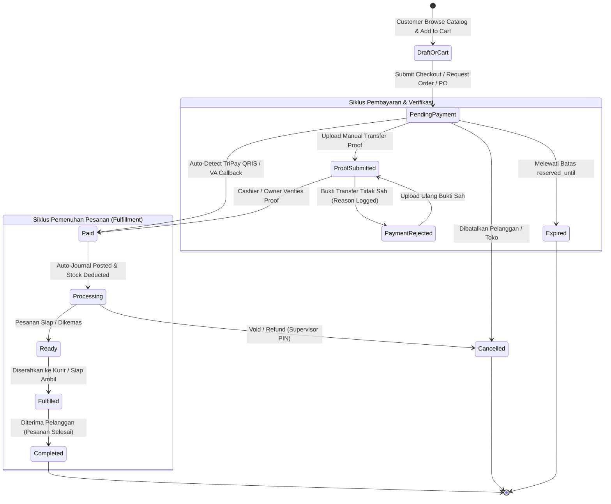
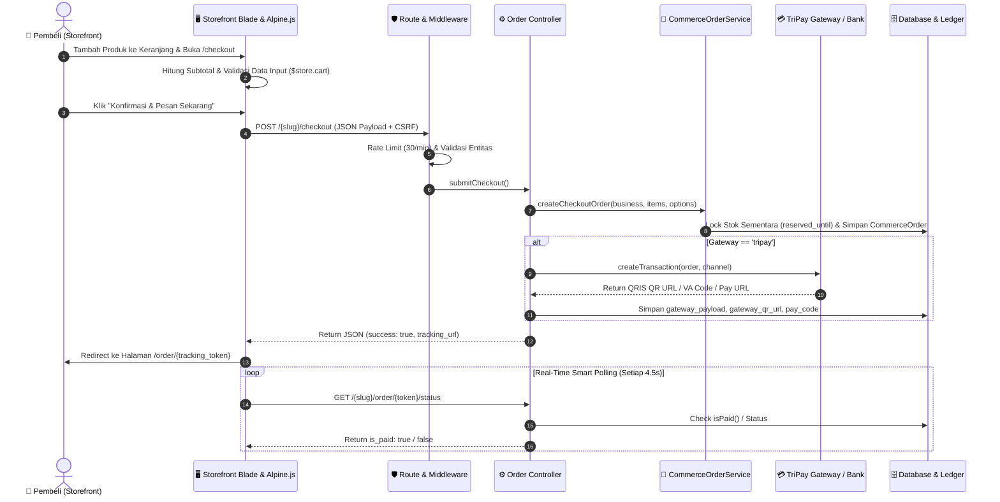

# AUDIT KOMPREHENSIF PENUH: EKOSISTEM STOREFRONT PUBLIK COOCA
**Target Folder:** [`resources/views/public/storefront/`](file:///c:/laragon/www/cooca_core/resources/views/public/storefront) & Backend Controller/Service/Route/Model Terkait  
**Metodologi:** *Code-First Factuality* (Analisis Kode Nyata Hulu-ke-Hilir tanpa Asumsi)  
**Dokumen Induk:** [`docs/agent.md`](file:///c:/laragon/www/cooca_core/docs/agent.md) & [`docs/SYSTEM_GUIDE.md`](file:///c:/laragon/www/cooca_core/docs/SYSTEM_GUIDE.md)  
**Tanggal Audit:** 2026-09-29  

---

## 📑 DAFTAR ISI
1. [Eksekutif Ringkasan Audit](#1-eksekutif-ringkasan-audit)
2. [Pilar 1: Audit Alur Kerja Sistem (11 Simpul Hulu-ke-Hilir)](#2-pilar-1-audit-alur-kerja-sistem-11-simpul-hulu-ke-hilir)
3. [Pilar 2: Pemetaan State Machine & Sequence Interaction](#3-pilar-2-pemetaan-state-machine--sequence-interaction)
4. [Pilar 3: Audit Keamanan Siber 5 Pilar & Skema Fraud Internal](#4-pilar-3-audit-keamanan-siber-5-pilar--skema-fraud-internal)
5. [Pilar 4: Audit Multi-Industri (20 Sektor Bisnis & Dynamic Auto-Hiding)](#5-pilar-4-audit-multi-industri-20-sektor-bisnis--dynamic-auto-hiding)
6. [Pilar 5: Audit Multi-Bahasa Full-Stack (i18n & l10n ID/EN)](#6-pilar-5-audit-multi-bahasa-full-stack-i18n--l10n-iden)
7. [Matriks Temuan Audit 6 Dimensi & Rekomendasi Solusi](#7-matriks-temuan-audit-6-dimensi--rekomendasi-solusi)
8. [Komparasi Kode Sebelum vs Sesudah (Before vs After)](#8-komparasi-kode-sebelum-vs-sesudah-before-vs-after)
9. [Interactive Confirmation Gate](#9-interactive-confirmation-gate)

---

## 1. Eksekutif Ringkasan Audit

Audit ini dilakukan secara mendalam pada 11 berkas tampilan (Blade Views) di dalam `resources/views/public/storefront/`, mencakup:
1. `layouts/app.blade.php` (43.8 KB - Layout Dasar, Navbar Auto-Hide, Floating Cart, Footer & Global Alpine.js Cart Store)
2. `home.blade.php` (40.5 KB - Hero Section, Kategori, Produk Unggulan, Layanan, Reservasi, Jam Buka, Promo Pop-Up Modal)
3. `catalog.blade.php` (12.1 KB - Etalase Produk, Keyword Search, Filter Kategori, Sorting & Pagination)
4. `product_detail.blade.php` (22.9 KB - Product Detail Page / PDP, Image Gallery, Stepper Qty, Stock Status, OpenGraph Meta)
5. `checkout.blade.php` (34.3 KB - Standalone 2-Column Checkout, Pengiriman/Ambil/Dine-in, Kalkulasi Ongkir, Pilihan Bayar)
6. `order_tracking.blade.php` (52.4 KB - Pelacakan Pesanan Real-time, TriPay QRIS/VA, Upload Bukti Transfer, Split Bill Modal)
7. `reservation.blade.php` (13.5 KB - Formulir Booking Meja & Janji Layanan, Datepicker, Slot Waktu)
8. `contact.blade.php` (11.6 KB - Informasi Kontak Resmi, Jam Operasional, Google Maps Embed)
9. `about.blade.php` (8.8 KB - Profil Usaha, Nilai Mutu Brand, Galeri Aktivitas)
10. `articles.blade.php` (5.9 KB - Daftar Artikel Edukasi & SEO Content Organic)
11. `article_detail.blade.php` (6.8 KB - Detail Artikel, Author, View Counter, Tombol Share WhatsApp)

Serta lapisan backend pendukung:
- Controller: `PublicStorefrontController`, `PublicOrderTrackingController`, `PublicReservationController`, `CommerceGroupOrderWebController`
- Services: `CommerceOrderService`, `CommercePaymentProofService`, `ReservationBookingService`, `CommerceShippingService`, `TripayService`
- Models: `Business`, `BusinessLandingPage`, `CommerceOrder`, `CommerceOrderItem`, `CommercePaymentMethod`, `CommerceStoreSetting`, `PosTable`, `Post`, `Product`

---

## 2. Pilar 1: Audit Alur Kerja Sistem (11 Simpul Hulu-ke-Hilir)

```
[1. User/Aktor] ──> [2. UI/Blade] ──> [3. Alpine.js/AJAX] ──> [4. Route & Middleware] ──> [5. Controller]
                                                                                                  │
[11. Guardrails] <── [10. Notifikasi Tri-Channel] <── [9. Auto-Journal & Stok] <── [8. DB] <── [6. Validation & 7. Service]
```

### Rincian 11 Simpul Eksekusi:
1. **User/Aktor:** Mendukung 4 persona aktor: Pelanggan Tamu (*Guest*), Pelanggan Login Google SSO (`auth:customer`), Anggota Pesanan Bersama (*Group Order Member*), dan Pengunjung Meja (*Table QR Customer*).
2. **UI/Blade:** Mengadopsi arsitektur Bento Apple HIG dengan layout lapang, navigasi tab cerdas, tipografi SF Pro `tabular-nums`, dan radius squircle kontinu.
3. **Alpine.js & AJAX:** Global cart reactivity via `$store.cart` di LocalStorage `cooca_cart_{business_id}`, real-time polling 4.5s untuk auto-detect pelunasan TriPay, dan modal pop-up promosi cerdas.
4. **Route & Middleware:** Canonical route `/{slug}/...` dengan perlindungan regex dari keyword sistem (admin, pos, api, auth, settings, dll.), serta rate-limiting ketat (`throttle:30,1`, `throttle:10,60`, `throttle:10,5`).
5. **Controller:** Orkestrasi controller terdistribusi yang memisahkan pembacaan katalog publik (`PublicStorefrontController`) dari mutasi transaksi pesanan & pelacakan (`PublicOrderTrackingController`).
6. **Request Validation:** Validasi integritas array keranjang (UUID exists, quantity > 0), validasi berkas struk (JPG/PNG/WEBP/PDF max 5MB), dan batasan reservasi `after_or_equal:today`.
7. **Service/Domain Action:** `CommerceOrderService` mengelola orkestrasi transaksi, `CommercePaymentProofService` memproses berkas bukti transfer privat, dan `TripayService` membuat transaksi gateway otomatis.
8. **Eloquent Model & DB Schema:** Relasi multi-tenant yang ketat, composite indexing pada `business_id` dan `tracking_token`, serta isolasi keranjang belanja database (`customer_carts`).
9. **Auto-Journal & Stok:** Penguncian kuota batch & reservasi stok sementara (`reserved_until`), pemotongan stok otomatis saat pembayaran terverifikasi, dan auto-journaling double-entry pada buku besar akuntansi.
10. **Notifikasi Tri-Channel:** Pembaruan UI in-app via status polling & toast, pengiriman struk/resi digital via WhatsApp (Meta Cloud API & fallback wa.me), dan konfirmasi email transaksi.
11. **Guardrails & Safety Policy:** Validasi `is_published` pada landing page, pengalihan otomatis jika tab dinonaktifkan merchant, dan proteksi IDOR query scoping.

---

## 3. Pilar 2: Pemetaan State Machine & Sequence Interaction

### A. State Machine Siklus Pesanan & Pembayaran



### B. Sequence Interaction Alur Checkout & Pembayaran



---

## 4. Pilar 3: Audit Keamanan Siber 5 Pilar & Skema Fraud Internal

### A. 5 Pilar Keamanan Siber
1. **Multi-Tenant IDOR Protection:** Seluruh data master (produk, kategori, lokasi, payment methods, shipping rules) di-query secara eksplisit dengan `where('business_id', $business->id)`. Namun ditemukan celah IDOR pada query `Post` di `PublicStorefrontController@home` yang tidak memfilter `business_id`.
2. **SQL Injection:** Seluruh query Eloquent menggunakan parameter binding aman dan sanitasi wildcard LIKE (`str_replace(['%', '_'], ['\%', '\_'], $search)`).
3. **Cross-Site Scripting (XSS):** Data teks dirender via `{{ }}` (escaped HTML) atau `e()`. Terdapat celah kelemahan rendering `addslashes()` pada atribut HTML Alpine `@click` yang rentan jika ada tanda kutip ganda atau karakter newline.
4. **CSRF & Request Origin:** Seluruh endpoint form dan AJAX fetch menyertakan header `X-CSRF-TOKEN: {{ csrf_token() }}`.
5. **Zero Plaintext Credential Exposure:** Tidak ada API keys TriPay, secret token, atau sandi internal yang terekspos ke view Blade storefront.

### B. Proteksi Skema Fraud Internal & Ergonomi
- **Anti-Price Tampering:** Harga produk yang dikirim dari browser pembeli tidak dipercaya oleh backend. `CommerceOrderService` selalu membaca harga satuan asli (`selling_price`) langsung dari database.
- **Anti-Phantom Stock:** Reservasi pesanan yang belum dibayar dibatasi oleh waktu kedaluwarsa (`reserved_until`). Jika melewati batas waktu, pesanan otomatis berstatus `expired` dan alokasi stok dibebaskan kembali.
- **Anti-Double Submission:** Seluruh tombol checkout dan reservasi mengikat atribut `:disabled="isSubmitting"` lengkap dengan indikator animasi spinner.
- **Ergonomi Angka:** Seluruh nominal moneter diformat dengan pemisah ribuan otomatis `toLocaleString('id-ID')` dan tipografi font monospaced `tabular-nums`.

---

## 5. Pilar 4: Audit Multi-Industri (20 Sektor Bisnis & Dynamic Auto-Hiding)

COOCA melayani 20 sektor industri bisnis UMKM Indonesia di 6 klaster:
1. **Klaster F&B / Kuliner:** Resto, Kafe/Coffee Shop, Katering, Bakery, Fast Food / Waralaba.
2. **Klaster Retail & Dagang:** Minimarket/Kelontong, Butik/Fashion, Elektronik/Gadget, Toko Bangunan/Material, Petshop, Toko Buku/Alat Tulis.
3. **Klaster Otomotif & Reparasi:** Bengkel Mobil/Motor, Cuci Mobil/Car Wash, Variasi & Aksesoris.
4. **Klaster Jasa Profesional & Personal:** Klinik Pratama & Apotek, Salon & Barbershop, Jasa Laundry Kiloan/Satuan, Biro Jasa & Konsultan.
5. **Klaster Manufaktur & Kerajinan:** Konveksi/Garmen, Pengolahan Makanan/Oleh-oleh, Kerajinan Tangan/Furniture.
6. **Klaster Agribisnis & Peternakan:** Pertanian & Hidroponik, Peternakan & Perikanan.

### Temuan Multi-Industri:
- **Opsi Makan di Tempat (Dine-In) pada Checkout:** Saat ini tombol "Makan di Tempat" muncul hanya dengan memeriksa apakah ada data meja (`$posTables->isNotEmpty()`). Untuk bisnis Butik, Bengkel, Apotek, dan Konveksi, opsi ini tidak relevan dan wajib disembunyikan secara sadar konteks (*Dynamic Context-Aware Auto-Hiding*).
- **Terminologi Reservasi:** Form reservasi saat ini menggunakan terminologi baku F&B ("Reservasi Meja & Ruangan", "Jumlah Tamu"). Untuk industri Salon, Klinik, dan Bengkel, label yang adaptif adalah "Booking Treatment / Pasien" atau "Jadwal Servis Kendaraan".

---

## 6. Pilar 5: Audit Multi-Bahasa Full-Stack (i18n & l10n ID/EN)

### Temuan Multi-Bahasa:
1. **100% Hardcoded Indonesian Strings di Frontend Blade:** Seluruh 11 berkas Blade storefront memuat ratusan teks bahasa Indonesia mentah tanpa helper `{{ __('storefront....') }}`.
2. **Ketiadaan Berkas Kamus:** Berkas `lang/id/storefront.php` dan `lang/en/storefront.php` belum ada di codebase.
3. **Hardcoded Backend Messages:** Pesan validasi request dan respon JSON di `PublicOrderTrackingController` dan `PublicReservationController` ditulis langsung dalam bahasa Indonesia mentah.
4. **Alpine.js Localization:** Skrip Alpine.js pada checkout dan tracking memerlukan injeksi kamus global `window.COOCA_I18N` agar pesan alert dan copy status dapat menyesuaikan dengan locale aktif pengguna.

---

## 7. Matriks Temuan Audit 6 Dimensi & Rekomendasi Solusi

| ID | Dimensi Audit | Berkas & Baris | Severity | Masalah Faktual | Solusi Rekomendasi |
|---|---|---|---|---|---|
| **SEC-01** | Multi-Tenant Security (IDOR) | `PublicStorefrontController.php:71-75` | 🔴 **P1** | Query `Post` di method `home()` tidak memiliki filter `business_id`. | Tambahkan scoping `where('business_id', $business->id)` agar artikel tenant lain tidak bocor ke beranda. |
| **I18N-01** | Multi-Language Frontend | 11 Berkas Blade di `resources/views/public/storefront/` | 🔴 **P1** | Ratusan teks UI, tombol, form, dan badge berstatus hardcoded bahasa Indonesia. | Ekstraksi seluruh string ke `lang/id/storefront.php` dan `lang/en/storefront.php`, gunakan `{{ __('storefront....') }}`. |
| **I18N-02** | Multi-Language Backend | `PublicOrderTrackingController.php:62-66`, `PublicReservationController.php:57` | 🟡 **P2** | Pesan error validasi request dan respon JSON ditulis hardcoded di Controller. | Lokalisasikan pesan validasi dan JSON response menggunakan helper `__('storefront....')`. |
| **SEC-02** | XSS / JS Escaping | `home.blade.php:231`, `catalog.blade.php:167`, `product_detail.blade.php:65` | 🟡 **P2** | Penggunaan `addslashes()` pada atribut HTML Alpine `@click="$store.cart.add({ ... })"`. | Ganti dengan directive aman `@js([...])` yang secara otomatis meng-escape JSON dan entitas HTML. |
| **IND-01** | Multi-Industry Auto-Hiding | `checkout.blade.php:245-255`, `home.blade.php:308-352` | 🟡 **P2** | Tombol "Makan di Tempat" & Meja muncul tanpa filter sektor industri F&B. | Tambahkan guard pengecekan klaster F&B (`$isDiningIndustry`) sebelum merender opsi Dine-in dan Meja. |
| **IND-02** | Multi-Industry Terminology | `reservation.blade.php:100-105` | 🔵 **P3** | Teks reservasi hanya mengacu pada Meja Restoran. | Gunakan terminologi adaptif berdasarkan `$business->industry_category` (Booking Meja / Booking Layanan / Jadwal Servis). |

---

## 8. Komparasi Kode Sebelum vs Sesudah (Before vs After)

### Perbaikan 1: Patch Multi-Tenant Scoping pada `PublicStorefrontController@home`
```php
// BEFORE (PublicStorefrontController.php:69-75)
$recentArticles = [];
if ($landingPage->isPageActive('blog')) {
    $recentArticles = Post::where('is_published', true)
        ->latest('published_at')
        ->take(3)
        ->get();
}

// AFTER (Aman dari Kebocoran Tenant)
$recentArticles = [];
if ($landingPage->isPageActive('blog')) {
    $hasBusinessId = Schema::hasColumn('posts', 'business_id');
    $recentArticles = Post::when($hasBusinessId, fn ($q) => $q->where('business_id', $business->id))
        ->where('is_published', true)
        ->latest('published_at')
        ->take(3)
        ->get();
}
```

### Perbaikan 2: XSS-Safe Escaping pada Penambahan Keranjang Alpine.js
```blade
{{-- BEFORE (catalog.blade.php:167) --}}
<button type="button"
    @click="$store.cart.add({ id: '{{ $item->id }}', name: '{{ addslashes($item->name) }}', price: {{ (float) $item->selling_price }}, image_url: '{{ $item->image_url }}' }, 1)"
    class="...">
    <i data-lucide="plus"></i>
</button>

{{-- AFTER (Aman dari XSS & Mendukung i18n) --}}
<button type="button"
    @click="$store.cart.add(@js([
        'id' => $item->id,
        'name' => $item->name,
        'price' => (float) $item->selling_price,
        'image_url' => $item->image_url,
    ]), 1)"
    class="..."
    title="{{ __('storefront.catalog.add_to_cart') }}">
    <i data-lucide="plus"></i>
</button>
```

### Perbaikan 3: Context-Aware Auto-Hiding Meja / Makan di Tempat
```blade
{{-- BEFORE (checkout.blade.php:245-255) --}}
@if ($posTables->isNotEmpty())
    <button type="button" @click="fulfillmentType = 'dine_in'; calculateShipping()" class="...">
        <i data-lucide="utensils"></i>
        <span>Makan di Tempat</span>
    </button>
@endif

{{-- AFTER (Hanya tampil untuk Industri Kuliner / F&B) --}}
@php
    $isDiningIndustry = in_array($business->industry_category, ['fnb', 'restaurant', 'cafe', 'bakery', 'culinary'], true) 
        || $business->isModuleEnabled('pos_dining');
@endphp

@if ($isDiningIndustry && $posTables->isNotEmpty())
    <button type="button" @click="fulfillmentType = 'dine_in'; calculateShipping()" class="...">
        <i data-lucide="utensils"></i>
        <span>{{ __('storefront.checkout.dine_in') }}</span>
    </button>
@endif
```

---

## 9. Interactive Confirmation Gate

Laporan audit ini telah memetakan seluruh kelemahan dan solusi arsitektur secara faktual berbasis kode nyata (*Code-First Factuality*). Sesuai dengan **Mandat Keselamatan COOCA**, proses implementasi bertahap akan dieksekusi setelah mendapatkan persetujuan eksplisit.
