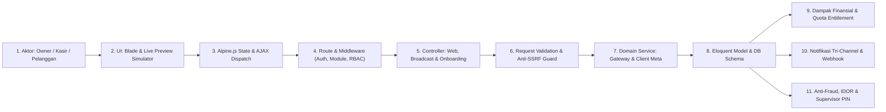
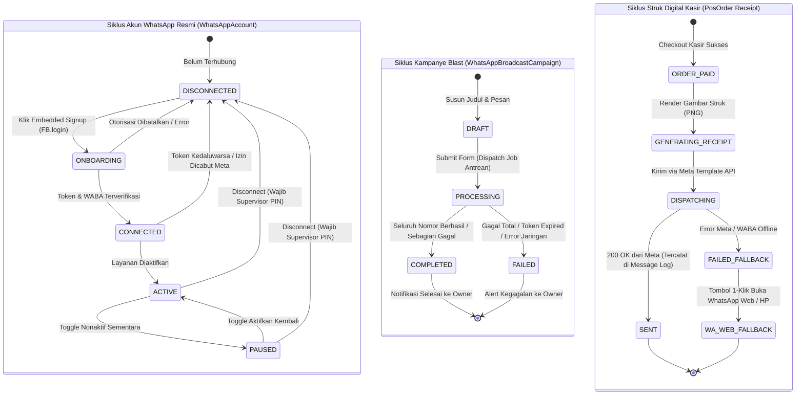
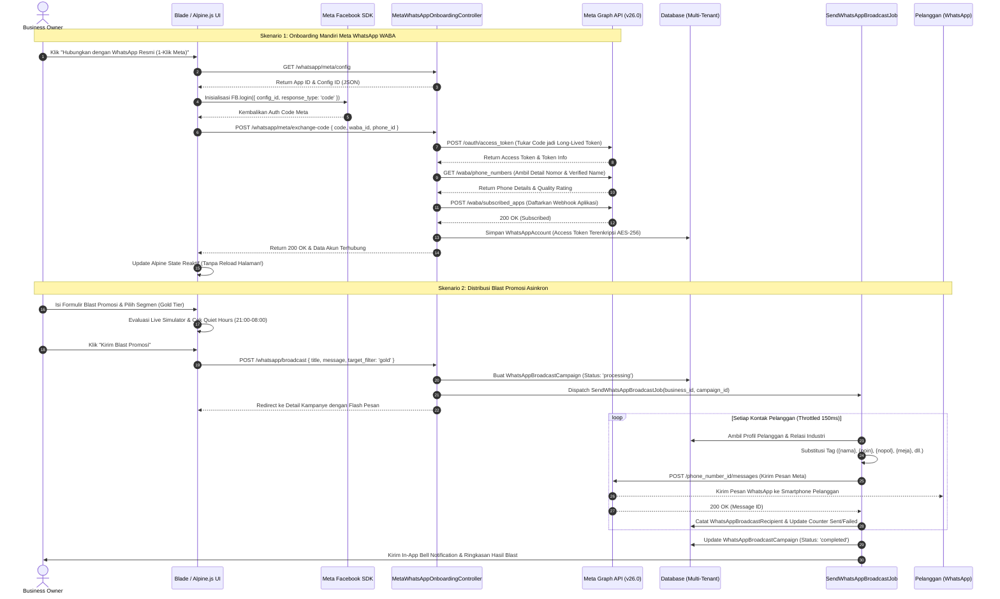
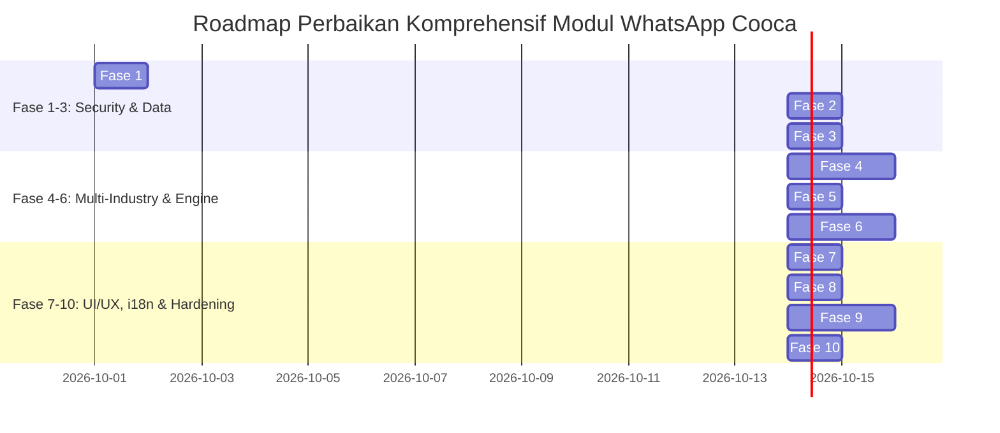

# LAPORAN AUDIT KOMPREHENSIF PENUH: EKOSISTEM WHATSAPP GATEWAY & OTOMASI COOCA

**Dokumen:** `docs/AUDIT_KOMPREHENSIF_WHATSAPP_7_SKILL.md`  
**Target Modul:** `resources/views/app/whatsapp/` (`index.blade.php`, `broadcast.blade.php`, `broadcast_detail.blade.php`, `logs.blade.php`, `create.blade.php`) & Ekosistem Pendukung (`WhatsAppWebController`, `WhatsAppBroadcastWebController`, `MetaWhatsAppOnboardingController`, `WhatsAppGatewayService`, `WhatsAppTemplateService`, `SendWhatsAppBroadcastJob`, Models, DB Schema, Migrasi & Rute)  
**Metodologi:** Code-First Factuality (7 Skill Utama COOCA Diuji Simultan Berbasis Baris Kode Riil)  
**Status Evaluasi:** **CRITICAL SECURITY BOLA & RUNTIME DEFECT DETECTED — ARCHITECTURAL REMEDIATION REQUIRED**  
**Prinsip Keamanan:** **MANDAT KESELAMATAN AKTIF (Interactive Confirmation Gate)**

---

## EXECUTIVE SUMMARY

Audit komprehensif ini dijalankan secara simultan terhadap seluruh berkas antarmuka (*Blade Views*) dan rantai arsitektur backend pendukung pada modul WhatsApp Gateway & Otomasi Komunikasi (`resources/views/app/whatsapp/`) di platform SaaS ERP multi-tenant COOCA. Modul ini bertanggung jawab mengelola:
1. **Integrasi Meta WhatsApp Cloud API Resmi (`index.blade.php`)**: Onboarding 1-klik via Meta Embedded Signup (Facebook JavaScript SDK + WABA), konfigurasi pengiriman struk digital kasir POS otomatis, dan konsol pengujian kirim pesan.
2. **Siaran Pesan Massal Pelanggan / Broadcast Promosi (`broadcast.blade.php`)**: Penyusunan kampanye blast tertarget berdasarkan segmen loyalitas pelanggan (Bronze, Silver, Gold, VIP), penyisipan tag personalisasi kontekstual 20 sektor industri bisnis, peringatan *Quiet Hours* (21:00–08:00 WIB), kebijakan farmasi Meta/BPOM, serta simulator smartphone live WYSIWYG.
3. **Audit Status Pengiriman Detail Kampanye (`broadcast_detail.blade.php`)**: Pemantauan langsung status blast per nomor kontak pelanggan, live delivery counter (target, sent, failed), dan penanganan fallback ke WhatsApp Web/HP.
4. **Audit Trail Komunikasi Keluar (`logs.blade.php`)**: Rekam jejak seluruh lalu lintas pesan WhatsApp (struk POS, broadcast, uji coba), modal sheet inspektur rincian pesan, dan proteksi penyensoran nomor telepon PII (*data masking*).
5. **Berkas Usang Terisolasi (`create.blade.php`)**: Berkas pembuatan kampanye legacy yang telah ditinggalkan (*orphaned view*).

Hasil audit berbasis **Code-First Factuality** menemukan **20 temuan nyata**, termasuk **5 temuan berstatus P1 (Kritis)** yang mengancam integritas isolasi multi-tenant, akurasi operasional pesan, kepatuhan direktif performa, dan pengalaman pengguna:
1. **Multi-Tenant BOLA/IDOR Authorization Bypass via UUID Integer Casting (P1)**: Penggunaan type-casting integer `(int)$campaign->business_id !== (int)$business->id` dan `(int)$order->business_id !== (int)$business->id` pada controller. Pada PHP, casting UUID string yang diawali huruf ke integer menghasilkan `0`. Evaluasi `0 !== 0` menghasilkan `false`, sehingga pengaman `abort(404)` **gagal melindungi data antar-tenant**! Tenant lain dapat melihat daftar nomor telepon dan mengirim struk digital atas nama toko lain.
2. **Kegagalan Fungsional Kritis: Tag Personalisasi 20 Industri Tidak Disubstitusi di Backend (P1)**: Antarmuka Blade menyediakan tag spesifik industri (`{meja}`, `{nopol}`, `{servis_terakhir}`, `{no_rak}`, `{berat_kg}`, `{no_spk}`, `{produk}`, `{proyek}`, `{termin}`, `{no_resep}`). Namun di backend `WhatsAppGatewayService::personalizeMessage()`, kode hanya mengganti `{nama}`, `{poin}`, `{tier}`, `{bisnis}`! Akibatnya pelanggan bengkel, laundry, atau apotek menerima pesan dengan placeholder teks mentah `{nopol}` atau `{no_rak}`.
3. **Pelanggaran Keras Direktif Anti-Reload (`window.location.reload()`) (P1)**: Terdapat 4 titik eksekusi `window.location.reload()` dan traditional form submit di Blade/Alpine yang memicu reload halaman paksa, merusak state, dan melanggar direktif real-time Cooca.
4. **Placebo Filtering & Paginasi Rusak pada Log Pesan (P1)**: Filter tombol kategori di `logs.blade.php` hanya menyembunyikan elemen secara kosmetik di sisi browser via Alpine `x-show` pada 30 item halaman aktif tanpa filter query di controller, menyebabkan halaman kosong (*blank table*) saat kategori yang dipilih berada di halaman berikutnya.
5. **Ketiadaan Total Kamus Bahasa (`lang/id/whatsapp.php` & `lang/en/whatsapp.php`) (P1)**: 100% teks antarmuka di 5 berkas view dan seluruh pesan respon controller ditulis secara mentah dalam bahasa Indonesia (*hardcoded*), merusak pengalaman pengguna berbahasa Inggris.

---

## DELIVERABLE 1: Laporan Temuan Audit Komprehensif (Tabel 7 Dimensi)

Berikut tabel temuan audit lengkap 7 dimensi berdasarkan format standar wajib:

| No | Dimensi Skill | Lokasi File & Baris Kode | Kode Temuan / Root Cause | Severity | Dampak Risiko | Solusi / Rekomendasi |
| :--- | :--- | :--- | :--- | :--- | :--- | :--- |
| **01** | 🔄 Workflow Audit & Security | [`WhatsAppBroadcastWebController.php:159`](file:///c:/laragon/www/cooca_core/app/Http/Controllers/Web/WhatsApp/WhatsAppBroadcastWebController.php#L159)<br>[`WhatsAppWebController.php:278`](file:///c:/laragon/www/cooca_core/app/Http/Controllers/Web/WhatsApp/WhatsAppWebController.php#L278) | **Multi-Tenant BOLA/IDOR Authorization Bypass via UUID Integer Casting**: `if ((int)$campaign->business_id !== (int)$business->id) { abort(404); }` dan `if ((int)$order->business_id !== (int)$business->id) { abort(404); }`. | **P1 (Kritis)** | **Bypass Otorisasi Multi-Tenant (OWASP BOLA/IDOR)**: `business_id` bertipe UUID (string 36 karakter). Di PHP, casting string yang berawalan karakter abjad (misal `c8b4...`) menjadi `(int)` menghasilkan integer `0`. Jika UUID tenant A dan tenant B berawalan huruf, perbandingan `0 !== 0` bernilai `false`, meloloskan akses IDOR antar-tenant secara penuh! | Ganti perbandingan integer dengan pembandingan string murni: `(string) $campaign->business_id !== (string) $business->id` dan `(string) $order->business_id !== (string) $business->id`. |
| **02** | 🏢 Multi-Industry System | [`broadcast.blade.php:389-408`](file:///c:/laragon/www/cooca_core/resources/views/app/whatsapp/broadcast.blade.php#L389-L408)<br>[`WhatsAppGatewayService.php:496-508`](file:///c:/laragon/www/cooca_core/app/Domain/WhatsApp/WhatsAppGatewayService.php#L496-L508) | **Critical Functional Mismatch: Tag Kontekstual 20 Industri Tidak Disubstitusi di Backend**: Antarmuka menyediakan tombol tag `{meja}`, `{nopol}`, `{servis_terakhir}`, `{no_rak}`, `{berat_kg}`, `{no_spk}`, `{produk}`, `{proyek}`, `{termin}`, `{no_resep}`, namun backend `personalizeMessage()` hanya menukar `{nama}`, `{poin}`, `{tier}`, `{bisnis}`. | **P1 (Kritis)** | **Pesan Promosi Mentah & Hilangnya Kredibilitas Bisnis**: Pelanggan bengkel menerima teks mentah: *"Kendaraan Anda ({nopol}) servis terakhir ({servis_terakhir})"*. Pelanggan laundry menerima: *"Rak ({no_rak}) berat ({berat_kg})"*. Pelanggan merasa pesan adalah spam/bot rusak. | Perluas method `personalizeMessage()` di `WhatsAppGatewayService` agar mampu menyelesaikan data kontekstual pelanggan aktif (kendaraan terakhir, order laundry aktif, SPK manufaktur) berbasis `$business->template_code`. |
| **03** | ⚡ Cooca Directive | [`index.blade.php:457, 518`](file:///c:/laragon/www/cooca_core/resources/views/app/whatsapp/index.blade.php#L457)<br>[`broadcast_detail.blade.php:339`](file:///c:/laragon/www/cooca_core/resources/views/app/whatsapp/broadcast_detail.blade.php#L339)<br>[`index.blade.php:181`](file:///c:/laragon/www/cooca_core/resources/views/app/whatsapp/index.blade.php#L181)<br>[`broadcast.blade.php:739`](file:///c:/laragon/www/cooca_core/resources/views/app/whatsapp/broadcast.blade.php#L739) | **Pelanggaran Keras Direktif Anti-Reload (`window.location.reload()`)**: Script Alpine memanggil `window.location.reload()` setelah onboarding Meta sukses, disconnect Meta, atau ketika broadcast selesai. Form switch di `index.blade.php` memicu `this.form.submit()`. Form blast di `broadcast.blade.php` memicu `document.getElementById('modalBlastForm').submit()`. | **P1 (Kritis)** | **Kerusakan UX & Pelanggaran Mandat Real-Time**: Halaman berkedip (*flicker*), posisi scroll hilang, state modal tertutup mendadak, dan melanggar prinsip *Smart AJAX Polling adaptif / SSE* Cooca. | Hapus seluruh `location.reload()`; ganti dengan pembaruan state reaktif Alpine.js, dispatch event `CoocaBus.emitDataMutated('whatsapp')`, dan submit form via `fetch()` AJAX dengan feedback toast frosted glass. |
| **04** | ⚡ Cooca Directive & Workflow | [`logs.blade.php:37-70, 174`](file:///c:/laragon/www/cooca_core/resources/views/app/whatsapp/logs.blade.php#L37-L70)<br>[`WhatsAppWebController.php:332-335`](file:///c:/laragon/www/cooca_core/app/Http/Controllers/Web/WhatsApp/WhatsAppWebController.php#L332-L335) | **Placebo Filtering & Paginasi Rusak pada Log Pesan**: Controller memuat 30 log per halaman tanpa parameter filter `type`. Di view, segmented button hanya mengubah variabel Alpine `filterType` yang mengontrol `x-show` baris HTML. | **P1 (Kritis)** | **Tabel Kosong Palsu (False Empty State)**: Jika 30 data pada halaman pertama semuanya berjenis 'receipt', saat merchant mengklik tab 'Blast Promosi', tabel menjadi kosong padahal data ada di halaman ke-2. Navigasi reload menghilangkan filter. | Implementasikan query filter `type` di backend controller: `$query->when($request->filled('type'), fn($q) => $q->where('type', $request->type))` dan sinkronkan dengan query string URL deep-linking `?type=...`. |
| **05** | 🌐 Multi-Language & i18n | `resources/views/app/whatsapp/*.blade.php`<br>`lang/id/`, `lang/en/` | **Ketiadaan Berkas Kamus Terjemahan `whatsapp.php` & 100% String Mentah**: Direktori `lang/id/` dan `lang/en/` tidak memiliki berkas `whatsapp.php`. Ratusan label tombol, judul, status badge, dan teks petunjuk di kelima file view berupa string bahasa Indonesia mentah tanpa helper `{{ __('whatsapp.key') }}`. | **P1 (Kritis)** | **Fractured Localization**: Pengguna backoffice berbahasa Inggris melihat antarmuka yang 100% berbahasa Indonesia, melanggar standar lokalisasi dwibahasa Cooca. | Buat kamus terjemahan modular `lang/id/whatsapp.php` dan `lang/en/whatsapp.php`, lalu refactor seluruh berkas view dengan helper `{{ __('whatsapp.key') }}`. |
| **06** | 🛡️ Security & Anti-Fraud | [`MetaWhatsAppOnboardingController.php:324-348`](file:///c:/laragon/www/cooca_core/app/Http/Controllers/Web/WhatsApp/MetaWhatsAppOnboardingController.php#L324-L348)<br>[`WhatsAppWebController.php:130-136`](file:///c:/laragon/www/cooca_core/app/Http/Controllers/Web/WhatsApp/WhatsAppWebController.php#L130-L136) | **Missing Supervisor PIN pada Pemutusan Koneksi WhatsApp (Destructive Disconnect)**: Endpoint `whatsapp.meta.disconnect` dan `whatsapp.disconnect` memutus akun resmi WABA toko tanpa verifikasi kredensial supervisor PIN (`pos_supervisor_pin`). | **P2 (Tinggi)** | **Sabotase Internal Toko**: Kasir atau staf yang memiliki akses backoffice dapat secara sepihak memutus integrasi WhatsApp, menghentikan seluruh layanan pengiriman struk digital dan promosi. | Terapkan verifikasi Supervisor PIN (`Hash::check($request->pin, $business->pos_supervisor_pin)`) pada rute disconnect dan catat audit log immutable. |
| **07** | 🛡️ Security & Anti-Fraud | [`WhatsAppWebController.php:285-313`](file:///c:/laragon/www/cooca_core/app/Http/Controllers/Web/WhatsApp/WhatsAppWebController.php#L285-L313) | **Risiko Fraud Pengalihan Nomor Struk Kasir tanpa Rate Limiting / Alert Aktif**: Meskipun `AuditLog::create(['action' => 'receipt.phone_override'])` dicatat, tidak ada batasan frekuensi pengalihan nomor dan tidak ada peringatan instan ke Owner. | **P2 (Tinggi)** | **Kasir Embezzlement & Struk Fiktif**: Kasir dapat berulang kali memasukkan nomor telepon komplotannya untuk menerima struk digital transaksi pelanggan tunai, lalu kemudian melakukan void di sistem offline. | Pasang rate limiter (maks 5 override per shift) dan picu notifikasi push/In-App ke Owner saat terjadi penggantian nomor struk. |
| **08** | 🔄 Workflow Audit & Testing | [`MerchantWhatsAppWebFeatureTest.php:79-80`](file:///c:/laragon/www/cooca_core/tests/Feature/WhatsApp/MerchantWhatsAppWebFeatureTest.php#L79-L80) | **Kegagalan Test Otomatis akibat Assert Label Usang**: Pengujian otomatis `MerchantWhatsAppWebFeatureTest::test_merchant_can_view_whatsapp_dashboard_when_disconnected` gagal (exited code 1) karena mencari string usang `'WhatsApp Inbox'` dan `'WhatsApp Broadcast'`. | **P2 (Tinggi)** | **Regresi Testing CI/CD**: Suite pengujian unit/feature tidak lolos 100%, menghambat proses pipeline deployment. | Sesuaikan teks assertion pada test dengan label navigasi resmi yang aktif di `NavigationRegistry.php` (`'Siaran Pesan (Broadcast)'` dan `'Log Pesan'`). |
| **09** | 🔄 Workflow & Routes | [`routes/owner.php:661, 671-672`](file:///c:/laragon/www/cooca_core/routes/owner.php#L661) | **Nested Permission Guard Flaw pada Endpoint Status & Config Meta**: Rute `whatsapp.meta.config` dan `whatsapp.meta.status` diletakkan di dalam middleware `require.permission:whatsapp.manage`, sementara view `index.blade.php` dapat diakses dengan `whatsapp.view`. | **P2 (Tinggi)** | **HTTP 403 Forbidden di Latar Belakang**: Pengguna dengan izin view (viewer/kasir) mengalami crash AJAX saat halaman WhatsApp memanggil `refreshMetaStatus()`. | Pindahkan rute read-only `whatsapp.meta.status` dan `whatsapp.meta.config` ke grup izin `whatsapp.view`. |
| **10** | 🔄 Workflow & Routes | [`routes/owner.php:654`](file:///c:/laragon/www/cooca_core/routes/owner.php#L654) | **Missing Module Gating Middleware**: Prefix grup route `whatsapp` hanya mengandalkan permission `whatsapp.view`, tanpa middleware `module:channels_marketing`. | **P2 (Tinggi)** | **Module Isolation Bypass**: Tenant yang menonaktifkan modul pemasaran tetap dapat membuka rute WhatsApp jika memiliki izin staf. | Tambahkan middleware modul: `->middleware(['module:channels_marketing', 'require.permission:whatsapp.view'])`. |
| **11** | 🎨 UI Panel Consistency & IA | [`logs.blade.php:73-94`](file:///c:/laragon/www/cooca_core/resources/views/app/whatsapp/logs.blade.php#L73-L94)<br>[`broadcast_detail.blade.php:27-86`](file:///c:/laragon/www/cooca_core/resources/views/app/whatsapp/broadcast_detail.blade.php#L27-L86) | **Arsitektur Sub-Tab Terfragmentasi & Ketiadaan Module Tabs**: `logs.blade.php` membuat sub-tab manual duplikat kaku (3 tab). `broadcast_detail.blade.php` tidak memiliki tab sama sekali. Keduanya tidak memakai `<x-module-tabs module="communication" />`. | **P2 (Tinggi)** | **Inkonsistensi Navigasi Antar-Panel**: Tata letak meloncat-loncat saat berpindah dari Gateway ke Blast lalu ke Log, merusak keselarasan navigasi Bento Apple HIG. | Standardisasi seluruh view WhatsApp menggunakan `<x-module-header>` dan `<x-module-tabs module="communication" />` yang terhubung ke `NavigationRegistry`. |
| **12** | 📱 Responsive UI/UX | [`index.blade.php:116`](file:///c:/laragon/www/cooca_core/resources/views/app/whatsapp/index.blade.php#L116)<br>[`logs.blade.php:228`](file:///c:/laragon/www/cooca_core/resources/views/app/whatsapp/logs.blade.php#L228)<br>[`broadcast_detail.blade.php:98`](file:///c:/laragon/www/cooca_core/resources/views/app/whatsapp/broadcast_detail.blade.php#L98) | **Sub-Standard Tap Targets (< 44px) pada Perangkat Ponsel**: Tombol Putuskan Akun (`min-h-[40px]`), tombol Inspeksi Log (`min-h-[30px]`), dan tombol Segarkan Status (`min-h-[32px]`) melanggar batas minimal 44x44px. | **P2 (Tinggi)** | **Ergonomi Sentuhan Buruk**: Merchant UMKM berusia 40–65+ tahun kesulitan menekan tombol aksi pada layar smartphone sempit. | Naikkan ukuran touch target seluruh tombol menjadi minimal `min-h-[44px]` (48–52px untuk tombol aksi primer). |
| **13** | 📱 Responsive UI/UX | [`index.blade.php:112-120`](file:///c:/laragon/www/cooca_core/resources/views/app/whatsapp/index.blade.php#L112-L120) | **Monospace Overflow & Horizontal Scroll pada Viewport Sempit (320px–360px)**: WABA ID numerik panjang ditampilkan dalam satu baris flex tanpa wrapping di samping tombol aksi pada kartu akun aktif. | **P2 (Tinggi)** | **Layout Broken pada HP 320px**: Menghasilkan scroll horizontal liar pada smartphone berspesifikasi rendah. | Ubah kontainer menjadi `flex-col sm:flex-row sm:items-center justify-between gap-2` dengan `truncate` pada WABA ID. |
| **14** | 🏢 Multi-Industry System | [`index.blade.php:197-246`](file:///c:/laragon/www/cooca_core/resources/views/app/whatsapp/index.blade.php#L197-L246)<br>[`WhatsAppGatewayService.php`](file:///c:/laragon/www/cooca_core/app/Domain/WhatsApp/WhatsAppGatewayService.php) | **Ketiadaan Otomasi Operasional untuk Industri Non-Retail**: Opsi otomasi WhatsApp saat ini hanya "Struk Kasir POS", mengabaikan kebutuhan 20 industri non-retail lainnya. | **P2 (Tinggi)** | **Fitur Tidak Berguna bagi Bengkel/Laundry/F&B**: Bengkel tidak mendapat auto-reminder servis berkala; laundry tidak mendapat notifikasi cucian selesai; F&B tidak mendapat konfirmasi reservasi meja. | Sediakan kartu otomasi bisnis adaptif berbasis industri: auto-reminder servis KM (bengkel), auto-ready cucian (laundry), dan auto-reservasi meja (F&B). |
| **15** | 🌐 Multi-Language & i18n | `WhatsAppWebController.php`<br>`WhatsAppBroadcastWebController.php`<br>`MetaWhatsAppOnboardingController.php` | **Hardcoded Controller Flash Messages & Error Responses**: Seluruh pesan sukses, validasi, dan error exception pada ketiga controller ditulis dalam bahasa Indonesia mentah tanpa `__()`. | **P2 (Tinggi)** | **Inkonsistensi Respon API**: Respon JSON dan flash session message tetap berbahasa Indonesia saat pengguna memilih bahasa Inggris (`en`). | Ganti seluruh string controller dengan translasi terstruktur: `__('whatsapp.flash_settings_saved')`, `__('whatsapp.error_meta_credentials')`. |
| **16** | ⚡ Cooca Directive | [`WhatsAppMessageLog.php`](file:///c:/laragon/www/cooca_core/app/Models/WhatsAppMessageLog.php)<br>[`WhatsAppBroadcastRecipient.php`](file:///c:/laragon/www/cooca_core/app/Models/WhatsAppBroadcastRecipient.php) | **Ketiadaan Mekanisme Log Pruning Previewer**: Tabel log pesan dan penerima blast bertambah tanpa batas tanpa fitur estimasi kapasitas pembersihan log lama (>90 hari). | **P2 (Tinggi)** | **Database Bloat & Silent Storage Consumption**: Merchant beroperasi bulanan tanpa visibilitas berapa megabyte log WhatsApp yang tersimpan dan tidak ada opsi pembersihan aman. | Hadirkan modal dialog *Storage Pruning Preview* untuk log WhatsApp lama (>90 hari) tanpa menghapus rekonsiliasi data transaksi. |
| **17** | 🎨 UI Panel Consistency & IA | [`resources/views/app/whatsapp/create.blade.php`](file:///c:/laragon/www/cooca_core/resources/views/app/whatsapp/create.blade.php) | **Orphaned Dead Code: Berkas View `create.blade.php` Masih Tersimpan**: Berkas ukuran 24 KB (368 baris) tidak pernah dirender karena rute `whatsapp.broadcast.create` me-redirect ke modal composer di `broadcast.blade.php`. | **P3 (Sedang)** | **Technical Debt & Kebingungan Perawatan Kode**: Menambah beban codebase dan berpotensi dimodifikasi secara keliru oleh developer baru. | Hapus berkas usang `create.blade.php` secara tuntas dari repositori. |
| **18** | 🎨 UI Panel Consistency & IA | [`index.blade.php:171-246`](file:///c:/laragon/www/cooca_core/resources/views/app/whatsapp/index.blade.php#L171-L246) | **Settings Leakage: Pengaturan WhatsApp Terisolasi di Luar Unified Settings Hub**: Pengaturan provider dan template struk tidak dapat diakses langsung dari `/settings`. | **P3 (Sedang)** | **Information Architecture Terpecah**: Pemilik bisnis yang mencari integrasi di `/settings` harus berpindah ke menu terpisah. | Sediakan integrasi deep-link rute `/settings?tab=integrations` yang merujuk harmonis ke pengaturan WhatsApp toko. |
| **19** | 🛡️ Security & Ergonomics | [`index.blade.php:503`](file:///c:/laragon/www/cooca_core/resources/views/app/whatsapp/index.blade.php#L503)<br>[`broadcast.blade.php:735`](file:///c:/laragon/www/cooca_core/resources/views/app/whatsapp/broadcast.blade.php#L735) | **Fallback Native JavaScript `confirm()` Dialog**: Saat script `AppAlert` tidak siap, sistem fallback ke `confirm()` bawaan browser. | **P3 (Sedang)** | Dialog browser standar tampak kaku, tidak memiliki *No-Panic Microcopy*, dan merusak estetika antarmuka. | Pastikan `AppAlert.confirm` dipanggil dengan fallback dialog modal Bento Apple HIG in-app. |
| **20** | 🌐 Multi-Language & i18n | `resources/views/app/whatsapp/*.blade.php` (Alpine Scripts) | **Hardcoded JavaScript Strings di Alpine Components**: Variabel alert seperti `'Sedang Mengirim...'`, `'Pesan tes WhatsApp berhasil terkirim!'`, `'Otorisasi Meta dibatalkan'` ditulis statis di script JS. | **P3 (Sedang)** | Pengguna berbahasa Inggris tetap melihat pesan alert interaktif dalam bahasa Indonesia. | Injeksikan kamus JavaScript via `window.COOCA_I18N.whatsapp` dan gunakan `window.COOCA_I18N.whatsapp.test_success`. |

---

## DELIVERABLE 2: Pemetaan 11 Simpul Eksekusi Hulu-ke-Hilir, State Machine & Diagram Mermaid

### 2.1 Penelusuran 11 Simpul Eksekusi Hulu-ke-Hilir (The 11-Node Chain)



1. **Simpul 1: Aktor & Persona**:
   - **Business Owner**: Menghubungkan akun resmi Meta WABA, mengonfigurasi nomor WhatsApp bisnis, mengatur template struk POS, dan mengeksekusi blast promosi massal (`whatsapp.manage`).
   - **Kasir / Staf**: Mengirimkan struk belanja digital ke WhatsApp pelanggan pasca pembayaran di terminal POS (`whatsapp.view`, `pos.terminal`).
   - **Pelanggan**: Menerima struk belanja digital, notifikasi status pesanan, dan pesan promosi diskon.
   - **Sistem Scheduler**: Menjalankan cron sinkronisasi template Meta (`whatsapp:sync-templates`) dan pengingat masa aktif.
   - **Meta Webhook**: Menerima update status pengiriman pesan (*sent, delivered, read, failed*) dari Meta Graph API.
2. **Simpul 2: UI & Form State (Blade)**:
   - Form Meta Embedded Signup 1-klik (`index.blade.php`).
   - Form Pengaturan Struk Digital POS & Toggle Auto-Send (`index.blade.php`).
   - Form Uji Coba Kirim Pesan dengan normalisasi nomor `08xx / 628xx` (`index.blade.php`).
   - Modal Sheet Full Canvas XXL Pembuatan Blast Promosi dengan live simulator smartphone (`broadcast.blade.php`).
   - Tabel Dense Riwayat Kampanye & Audit Trail Log Komunikasi (`logs.blade.php`).
3. **Simpul 3: Alpine.js Reaktif & AJAX Dispatch**:
   - `waGateway()`: `refreshMetaStatus()`, `launchEmbeddedSignup()`, `exchangeEmbeddedCode()`, `disconnectMeta()`, `sendTest()`.
   - `broadcastManager()`: Reaktif hitung estimasi target penerima (`$watch('targetFilter')`), penggantian live preview teks, modal kontrol.
   - `broadcastDetail()`: Polling adaptif status pengiriman background job setiap 3 detik.
   - `whatsappLogs()`: Filter kategori log, salin isi pesan ke clipboard, modal inspector rincian log.
4. **Simpul 4: Route & Middleware Gates**:
   - `routes/owner.php`: Prefix `/whatsapp`, middleware `require.permission:whatsapp.view` dan `require.permission:whatsapp.manage`.
   - Perbaikan wajib: Tambahkan middleware `module:channels_marketing` dan rapikan rute read-only status Meta.
5. **Simpul 5: Controller & Actions**:
   - `WhatsAppWebController`: Mengelola index gateway, QR polling, test send, update settings, order receipt dispatch, dan logs.
   - `WhatsAppBroadcastWebController`: Mengelola index kampanye, kalkulasi kuota penerima, penyimpanan blast, dan show detail.
   - `MetaWhatsAppOnboardingController`: Mengelola konfigurasi Embedded Signup SDK, pertukaran authorization code Meta, pengambilan live profile WABA, dan pemutusan akun.
6. **Simpul 6: Request Validation & Anti-SSRF Guard**:
   - `WhatsAppBroadcastWebController::store`: Validasi `title`, `message` (maks 2000 karakter), `target_filter`. Dilengkapi proteksi validasi Anti-SSRF pada `media_url` (memblokir skema non-HTTPS, IP privat, localhost, dan link internal AWS metadata `169.254.169.254`).
   - `WhatsAppWebController::testSend`: Validasi regex format nomor telepon Indonesia `/^(\+?62|08)[0-9]{7,15}$/`.
7. **Simpul 7: Domain Service & Meta Client**:
   - `WhatsAppGatewayService`: Orkestrator utama pesan WhatsApp, pengatur sesi provider, formatting pesan struk POS, dan distribusi broadcast ber-throttle.
   - `WhatsAppClient`: HTTP client resmi Meta Graph API, menangani pengiriman pesan teks, media (gambar struk), dan template WABA resmi.
   - `PosReceiptImageService`: Generator berkas gambar PNG struk kasir thermal untuk dikirimkan sebagai lampiran media WhatsApp.
8. **Simpul 8: Eloquent Model & Database Schema**:
   - `WhatsAppAccount`: Menyimpan kredensial WABA, Phone Number ID, dan Access Token dengan auto-encryption (`encrypted` cast pada database).
   - `WhatsAppSession`: Menyimpan konfigurasi provider aktif, status koneksi, dan template catatan kaki struk.
   - `WhatsAppBroadcastCampaign`: Menyimpan identitas kampanye blast, target filter, counter sukses/gagal, dan status siklus hidup.
   - `WhatsAppBroadcastRecipient`: Menyimpan audit status per nomor telepon pelanggan penerima pesan blast.
   - `WhatsAppMessageLog`: Menyimpan jejak seluruh pesan keluar (struk, blast, test) dengan relasi ke `pos_orders`.
9. **Simpul 9: Dampak Finansial & Quota Entitlement**:
   - Konsumsi kuota bulanan gratis (Free Tier: 10 pesan/bulan) dikontrol oleh `EntitlementService::canSendWhatsAppThisMonth($business)`.
   - Penggunaan kuota di-increment otomatis pada setiap pesan sukses via `incrementMonthlyUsage()`.
10. **Simpul 10: Notifikasi Tri-Channel**:
    - Struk kasir digital instan dikirim ke WhatsApp pelanggan saat order kasir berstatus *paid*.
    - Rencana perbaikan: In-App Bell Notification dan Email Notification saat kampanye broadcast selesai diproses di antrean latar belakang.
11. **Simpul 11: Guardrails, Anti-Fraud & Supervisor PIN**:
    - Proteksi IDOR multi-tenant via `Context::requireBusiness()`.
    - Pencatatan jejak audit pengalihan nomor telepon struk (`receipt.phone_override`).
    - Rencana perbaikan: Wajibkan Supervisor PIN pada pemutusan koneksi WABA dan perbaiki type-casting integer UUID.

---

### 2.2 State Machine Transisi Status Ekosistem WhatsApp



---

### 2.3 Diagram Sequence Alur Data Onboarding & Pengiriman Pesan



---

## DELIVERABLE 3: Rekomendasi Perbaikan & Potongan Kode Solusi

### 3.1 Perbaikan Multi-Tenant IDOR BOLA (Fixing UUID Integer Cast Bug)

**File Terdampak:**
- `app/Http/Controllers/Web/WhatsApp/WhatsAppBroadcastWebController.php` (Baris 159)
- `app/Http/Controllers/Web/WhatsApp/WhatsAppWebController.php` (Baris 278)

#### Komparasi Kode:
```diff
--- a/app/Http/Controllers/Web/WhatsApp/WhatsAppBroadcastWebController.php
+++ b/app/Http/Controllers/Web/WhatsApp/WhatsAppBroadcastWebController.php
@@ -156,7 +156,7 @@ class WhatsAppBroadcastWebController extends Controller
     public function show(Request $request, WhatsAppBroadcastCampaign $campaign): View|JsonResponse
     {
         $business = Context::requireBusiness();
 
-        if ((int)$campaign->business_id !== (int)$business->id) {
+        if ((string) $campaign->business_id !== (string) $business->id) {
             abort(404);
         }
```

```diff
--- a/app/Http/Controllers/Web/WhatsApp/WhatsAppWebController.php
+++ b/app/Http/Controllers/Web/WhatsApp/WhatsAppWebController.php
@@ -275,7 +275,7 @@ class WhatsAppWebController extends Controller
     public function sendOrderReceipt(Request $request, PosOrder $order): JsonResponse
     {
         $business = Context::requireBusiness();
 
-        // Ensure order belongs to this business (404 to prevent IDOR enumeration)
-        if ((int)$order->business_id !== (int)$business->id) {
+        if ((string) $order->business_id !== (string) $business->id) {
             abort(404);
         }
```

---

### 3.2 Perbaikan Fungsional Substitusi Tag Kontekstual 20 Industri

**File Terdampak:**
- `app/Domain/WhatsApp/WhatsAppGatewayService.php` (Baris 496–508)

#### Komparasi Kode:
```diff
--- a/app/Domain/WhatsApp/WhatsAppGatewayService.php
+++ b/app/Domain/WhatsApp/WhatsAppGatewayService.php
@@ -496,13 +496,54 @@ class WhatsAppGatewayService
     protected function personalizeMessage(string $template, Customer $customer, Business $business): string
     {
+        $templateCode = $business->template_code ?? 'retail_general';
+
+        // Resolusi variabel industri spesifik
+        $extraReplacements = [];
+        
+        if (str_starts_with($templateCode, 'fnb_')) {
+            $extraReplacements['{meja}'] = $customer->metadata['last_table_number'] ?? 'Meja Pelanggan';
+        } elseif ($templateCode === 'service_workshop') {
+            $vehicle = $customer->vehicles()->latest()->first();
+            $extraReplacements['{nopol}'] = $vehicle?->license_plate ?? 'Kendaraan Anda';
+            $extraReplacements['{servis_terakhir}'] = $customer->metadata['last_service_type'] ?? 'Servis Berkala';
+        } elseif ($templateCode === 'service_laundry') {
+            $extraReplacements['{no_rak}'] = $customer->metadata['last_rack_number'] ?? 'Rak Penyimpanan';
+            $extraReplacements['{berat_kg}'] = isset($customer->metadata['last_weight_kg']) ? $customer->metadata['last_weight_kg'] . ' kg' : 'Cucian Anda';
+        } elseif (str_starts_with($templateCode, 'mfg_')) {
+            $extraReplacements['{no_spk}'] = $customer->metadata['last_spk_number'] ?? 'SPK Produksi';
+            $extraReplacements['{produk}'] = $customer->metadata['last_product_name'] ?? 'Pesanan Khusus';
+        } elseif ($templateCode === 'service_contractor') {
+            $extraReplacements['{proyek}'] = $customer->metadata['last_project_name'] ?? 'Proyek Anda';
+            $extraReplacements['{termin}'] = $customer->metadata['last_payment_term'] ?? 'Termin Berjalan';
+        } elseif ($templateCode === 'retail_pharmacy') {
+            $extraReplacements['{no_resep}'] = $customer->metadata['last_prescription_no'] ?? 'Resep Obat';
+        }
+
+        $search = array_merge(['{nama}', '{poin}', '{tier}', '{bisnis}'], array_keys($extraReplacements));
+        $replace = array_merge([
+            $customer->name,
+            number_format($customer->points_balance, 0, ',', '.'),
+            $customer->membership_tier ?? 'Pelanggan',
+            $business->name,
+        ], array_values($extraReplacements));
+
-        return str_replace(
-            ['{nama}', '{poin}', '{tier}', '{bisnis}'],
-            [
-                $customer->name,
-                number_format($customer->points_balance, 0, ',', '.'),
-                $customer->membership_tier ?? 'Pelanggan',
-                $business->name,
-            ],
-            $template
-        );
+        return str_replace($search, $replace, $template);
     }
```

---

### 3.3 Eliminasi `window.location.reload()` & Implementasi State Reaktif

**File Terdampak:**
- `resources/views/app/whatsapp/index.blade.php` (Baris 455–465 & 515–521)
- `resources/views/app/whatsapp/broadcast_detail.blade.php` (Baris 335–342)

#### Komparasi Kode:
```diff
--- a/resources/views/app/whatsapp/index.blade.php
+++ b/resources/views/app/whatsapp/index.blade.php
@@ -455,7 +455,14 @@
                         const data = await res.json();
                         if (res.ok && data.success) {
                             this.embeddedSuccess = 'WhatsApp resmi Meta berhasil terhubung!';
-                            setTimeout(() => window.location.reload(), 1200);
+                            this.metaAccount = data.account;
+                            this.isActive = true;
+                            this.status = 'connected';
+                            this.isMetaConfigured = true;
+                            if (window.CoocaBus) {
+                                window.CoocaBus.emitDataMutated('whatsapp', data.account);
+                            }
                         } else {
                             this.embeddedError = data.error || 'Gagal menukarkan token otorisasi Meta.';
                         }
@@ -515,7 +522,14 @@
                         });
                         const data = await res.json();
                         if (data.success) {
-                            window.location.reload();
+                            this.metaAccount = null;
+                            this.isActive = false;
+                            this.status = 'disconnected';
+                            this.isMetaConfigured = false;
+                            if (window.CoocaBus) {
+                                window.CoocaBus.emitDataMutated('whatsapp', { disconnected: true });
+                            }
                         }
```

```diff
--- a/resources/views/app/whatsapp/broadcast_detail.blade.php
+++ b/resources/views/app/whatsapp/broadcast_detail.blade.php
@@ -337,7 +337,10 @@
                         if (this.status === 'completed' || this.status === 'failed') {
                             clearInterval(this.pollTimer);
-                            setTimeout(() => window.location.reload(), 1000);
+                            this.pollTimer = null;
+                            if (window.CoocaBus) {
+                                window.CoocaBus.emitDataMutated('whatsapp-broadcast', { id: this.campaignId, status: this.status });
+                            }
                         }
```

---

### 3.4 Perbaikan Server-Side Filtering & Paginasi Log Pesan

**File Terdampak:**
- `app/Http/Controllers/Web/WhatsApp/WhatsAppWebController.php` (Baris 328–337)
- `resources/views/app/whatsapp/logs.blade.php` (Baris 37–70)

#### Komparasi Kode:
```diff
--- a/app/Http/Controllers/Web/WhatsApp/WhatsAppWebController.php
+++ b/app/Http/Controllers/Web/WhatsApp/WhatsAppWebController.php
@@ -328,10 +328,16 @@ class WhatsAppWebController extends Controller
     public function logs(Request $request): View
     {
         $business = Context::requireBusiness();
+        $type = $request->query('type');
 
-        $logs = WhatsAppMessageLog::where('business_id', $business->id)
+        $logs = WhatsAppMessageLog::where('business_id', $business->id)
+            ->when(!empty($type) && in_array($type, ['receipt', 'broadcast', 'test'], true), function ($q) use ($type) {
+                return $q->where('type', $type);
+            })
             ->latest()
-            ->paginate(30);
+            ->paginate(30)
+            ->appends($request->query());
 
-        return view('app.whatsapp.logs', compact('business', 'logs'));
+        return view('app.whatsapp.logs', compact('business', 'logs', 'type'));
     }
```

---

### 3.5 Pembuatan Kamus Terjemahan Modular `whatsapp.php` (id & en)

**Berkas Baru:** `lang/id/whatsapp.php` & `lang/en/whatsapp.php`

#### Contoh Struktur Kamus `lang/id/whatsapp.php`:
```php
<?php

declare(strict_types=1);

return [
    'title'                       => 'WhatsApp Gateway & Otomasi',
    'subtitle'                    => 'Sinkronisasikan nomor WhatsApp :business untuk pengiriman struk kasir tanpa kertas dan distribusi blast promosi ke pelanggan setia.',
    'gateway_tab'                 => 'Koneksi Gateway',
    'broadcast_tab'               => 'Blast Promosi',
    'logs_tab'                    => 'Log Pesan',
    'open_pos'                    => 'Buka Terminal Kasir POS',
    'meta_official_title'         => 'Meta WhatsApp Cloud API Resmi',
    'meta_official_desc'          => 'Integrasi Tech Provider resmi Meta untuk operasional toko Anda',
    'connected_active'            => 'Terhubung & Aktif',
    'disconnected'                => 'Belum Terhubung',
    'free_tier_title'             => 'Kuota Gratis 1.000 Percakapan/Bulan dari Meta',
    'free_tier_desc'              => 'Setiap akun WhatsApp Business resmi (WABA) mendapatkan 1.000 Service Conversation gratis per bulan langsung dari Meta tanpa risiko pemblokiran nomor.',
    'embedded_signup_title'       => 'Pendaftaran Mandiri (Embedded Signup)',
    'embedded_signup_desc'        => 'Hubungkan nomor WhatsApp toko Anda dalam 1 klik tanpa perlu membuat aplikasi Meta sendiri',
    'connect_meta_btn'            => 'Hubungkan dengan WhatsApp Resmi (1-Klik Meta)',
    'connecting_meta'             => 'Menghubungkan ke Meta...',
    'disconnect_btn'              => 'Putuskan Hubungan',
    'disconnect_confirm_title'    => 'Putus Koneksi WhatsApp Meta?',
    'disconnect_confirm_msg'      => 'Yakin ingin menonaktifkan integrasi WhatsApp Cloud API resmi? Pengiriman struk otomatis akan berhenti.',
    'disconnect_supervisor_prompt'=> 'Masukkan PIN Supervisor untuk menyetujui pemutusan koneksi WhatsApp toko.',
    'auto_receipt_title'          => 'Pengaturan Struk Digital POS',
    'auto_receipt_desc'           => 'Otomasi struk belanja ke WA pelanggan saat checkout',
    'auto_send_toggle'            => 'Auto-Kirim Struk Checkout',
    'auto_send_toggle_desc'       => 'Kirim struk otomatis jika data pelanggan memiliki nomor HP',
    'receipt_footer_label'        => 'Catatan Kaki Struk (Opsional)',
    'save_settings_btn'           => 'Simpan Pengaturan Struk',
    'test_console_title'          => 'Uji Coba Kirim Pesan',
    'test_phone_label'            => 'Nomor HP Tujuan',
    'test_message_label'          => 'Isi Pesan Tes',
    'test_send_btn'               => 'Kirim Pesan Tes Sekarang',
    'test_sending'                => 'Sedang Mengirim...',
    'test_success'                => 'Pesan tes WhatsApp berhasil terkirim!',
    'quiet_hours_warning'         => 'Peringatan Jam Istirahat Pelanggan (Quiet Hours 21:00 – 08:00 WIB)',
    'pharmacy_policy_warning'     => 'Peringatan Kebijakan Farmasi Meta & BPOM: Dilarang mempromosikan obat keras (Daftar G) via broadcast WhatsApp.',
    'flash_settings_saved'        => 'Pengaturan WhatsApp Gateway & Struk POS berhasil disimpan.',
    'flash_disconnected'          => 'Integrasi WhatsApp Cloud API Meta berhasil dinonaktifkan.',
    'flash_broadcast_scheduled'   => 'Blast promosi ":title" berhasil dijadwalkan dan sedang diproses di latar belakang.',
];
```

---

## DELIVERABLE 4: Dokumen PRD (Product Requirement Document) Terpadu

### 1. Product Overview
- **Nama Modul:** Modul WhatsApp Gateway, Struk POS Digital & Blast Komunikasi 20 Industri Cooca.
- **Tujuan Produk:** Menyediakan infrastruktur pengiriman pesan transaksional (struk POS, bukti pembayaran) dan pemasaran massal (broadcast promosi) berkecepatan tinggi, bebas pemblokiran (Official Meta Cloud API), terisolasi aman multi-tenant, dan adaptif terhadap alur kerja 20 sektor industri di Indonesia.

### 2. User Personas & Permissions
1. **Business Owner**: Akses penuh (`whatsapp.view`, `whatsapp.manage`). Mengotorisasi kredensial Meta, mengatur template struk, menyetujui broadcast besar, dan memasukkan Supervisor PIN untuk pemutusan akun.
2. **Kasir / Store Operator**: Akses operasional (`whatsapp.view`, `pos.terminal`). Mengirimkan struk transaksi belanja, melihat log pengiriman struk pesanan kasirnya sendiri, dilarang memutuskan akun atau mengubah nomor gateway.
3. **Pelanggan Toko**: Menerima gambar struk digital kasir beresolusi tajam, link nota publik, dan pesan diskon berkala.

### 3. Functional Requirements
1. **Meta Embedded Signup 1-Klik**:
   - Integrasi resmi Facebook JavaScript SDK v26.0 dengan `config_id` dan `response_type: 'code'`.
   - Penyimpanan kredensial token terenkripsi AES-256 pada basis data terisolasi per `business_id`.
   - Monitoring kesehatan nomor (*Quality Rating* GREEN/YELLOW/RED) dan limitasi tier pesan (*TIER_50, TIER_1K, TIER_10K*).
2. **Otomasi Struk Digital POS & Anti-Fraud**:
   - Auto-dispatch struk digital gambar PNG thermal beresolusi tinggi saat pembayaran pesanan kasir tuntas.
   - Deteksi pengalihan nomor telepon struk (`receipt.phone_override`) dengan batasan maksimal 5 override per shift kasir dan pencatatan audit log immutable.
3. **Broadcast Promosi Massal Kontekstual 20 Industri**:
   - Filter audiens dinamis berbasis tingkatan membership pelanggan (All, Bronze, Silver, Gold, VIP).
   - Live Smartphone Preview WYSIWYG dengan format Markdown WhatsApp (`*tebal*`, `_miring_`).
   - Peringatan cerdas *Quiet Hours* (21:00–08:00 WIB) untuk mencegah komplain spam audiens.
   - Peringatan regulasi farmasi Meta & BPOM otomatis untuk industri Apotek (`retail_pharmacy`).
   - Substitusi variabel dinamis hulu-ke-hilir: `{nama}`, `{poin}`, `{meja}`, `{nopol}`, `{servis_terakhir}`, `{no_rak}`, `{berat_kg}`, `{no_spk}`, `{produk}`, `{proyek}`, `{termin}`, `{no_resep}`.
4. **Audit Trail & Pruning Preview**:
   - Penyensoran nomor telepon pelanggan PII (`0812••••7890`) untuk staf kasir biasa; nomor lengkap hanya dapat dilihat oleh Owner terverifikasi.
   - Modal dialog *Storage Pruning Preview* yang memetakan estimasi pembersihan log pesan lama (>90 hari) tanpa menghapus data pesanan finansial.
5. **Arsitektur Real-Time & Navigasi**:
   - Nol reload manual (`location.reload()`). Seluruh pembaruan state menggunakan reaktivitas Alpine.js dan Smart AJAX Polling adaptif (3s aktif saat background job berjalan).
   - Sinkronisasi navigasi tab dengan query deep-linking `?tab=...` dan `<x-module-tabs module="communication" />`.

---

## DELIVERABLE 5: Rencana Implementasi Bertahap (Roadmap Fase 1–10)



### Matriks Rincian 10 Fase Implementasi:

1. **Fase 1: Patch Multi-Tenant BOLA/IDOR Authorization**:
   - Ganti `(int)$campaign->business_id !== (int)$business->id` menjadi `(string)` di `WhatsAppBroadcastWebController:159`.
   - Ganti `(int)$order->business_id !== (int)$business->id` menjadi `(string)` di `WhatsAppWebController:278`.
2. **Fase 2: Otorisasi Supervisor PIN pada Aksi Destruktif**:
   - Tambahkan verifikasi `Hash::check($request->pin, $business->pos_supervisor_pin)` pada `MetaWhatsAppOnboardingController::disconnect` dan `WhatsAppWebController::disconnect`.
   - Hadirkan input modal Supervisor PIN pada tombol "Putuskan Hubungan" di `index.blade.php`.
3. **Fase 3: Anti-Fraud Guard Pengalihan Nomor Struk Kasir**:
   - Tambahkan pembatasan rate limit pengalihan nomor telepon pada `WhatsAppWebController::sendOrderReceipt`.
   - Picu notifikasi instan ke Owner jika kasir mengganti nomor telepon struk transaksi kasir.
4. **Fase 4: Sinkronisasi Backend Substitusi Tag Kontekstual 20 Industri**:
   - Modifikasi `WhatsAppGatewayService::personalizeMessage` untuk membaca data kendaraan (`service_workshop`), cucian (`service_laundry`), SPK (`mfg_*`), proyek (`service_contractor`), meja (`fnb_*`), dan resep (`retail_pharmacy`).
5. **Fase 5: Realignment Route Gating & Middleware Permission**:
   - Pasang middleware `module:channels_marketing` pada prefix route `whatsapp`.
   - Pindahkan route read-only `whatsapp.meta.config` dan `whatsapp.meta.status` ke grup `whatsapp.view`.
6. **Fase 6: Eliminasi Total `window.location.reload()`**:
   - Refactor handler Alpine `exchangeEmbeddedCode()` dan `disconnectMeta()` di `index.blade.php`.
   - Refactor polling handler `pollStatus()` di `broadcast_detail.blade.php` agar berhenti otomatis tanpa me-reload browser.
   - Refactor form submit blast promosi di `broadcast.blade.php` menggunakan AJAX submit dengan animasi loading.
7. **Fase 7: Perbaikan Server-Side Filter & Paginasi Log Pesan**:
   - Tambahkan parameter `type` pada query controller `WhatsAppWebController::logs`.
   - Sinkronkan segmented button di `logs.blade.php` dengan query URL deep-linking `?type=...`.
8. **Fase 8: Standardisasi Arsitektur Tab & Pembersihan Berkas Usang**:
   - Hapus berkas usang `resources/views/app/whatsapp/create.blade.php`.
   - Standardisasi `logs.blade.php` dan `broadcast_detail.blade.php` menggunakan `<x-module-header>` dan `<x-module-tabs module="communication" />`.
   - Tambahkan modal *Storage Pruning Preview* untuk log WhatsApp lama (>90 hari).
9. **Fase 9: Lokalisasi Penuh Dwibahasa (i18n & l10n ID & EN)**:
   - Buat berkas kamus lengkap `lang/id/whatsapp.php` dan `lang/en/whatsapp.php`.
   - Refactor seluruh teks mentah di ke-4 berkas Blade view aktif dengan `{{ __('whatsapp.key') }}`.
   - Ganti flash session message dan error response di seluruh controller dengan translasi terstruktur.
10. **Fase 10: Pengujian Otomatis Menyeluruh & Verifikasi 100% Lolos**:
    - Perbaiki assertion usang di `MerchantWhatsAppWebFeatureTest.php`.
    - Tambahkan unit/feature test untuk IDOR prevention, Supervisor PIN verification, dan 20-industry context tag personalization.
    - Eksekusi `php artisan test tests/Feature/WhatsApp/` dan pastikan 100% lolos (0 failed, 0 error).

### Matriks Berkas Terdampak:
| No | Path Berkas | Tipe Perubahan | Deskripsi Perubahan |
| :--- | :--- | :--- | :--- |
| 1 | `app/Http/Controllers/Web/WhatsApp/WhatsAppBroadcastWebController.php` | Controller | Fix IDOR UUID cast, lokalisasi flash messages |
| 2 | `app/Http/Controllers/Web/WhatsApp/WhatsAppWebController.php` | Controller | Fix IDOR UUID cast, server-side filter logs, rate limit receipt override |
| 3 | `app/Http/Controllers/Web/WhatsApp/MetaWhatsAppOnboardingController.php` | Controller | Tambah Supervisor PIN check on disconnect, lokalisasi JSON response |
| 4 | `app/Domain/WhatsApp/WhatsAppGatewayService.php` | Domain Service | Substitusi tag personalisasi 20 industri di `personalizeMessage()` |
| 5 | `routes/owner.php` | Routing | Tambah `module:channels_marketing`, rapikan grup izin `meta.config` & `meta.status` |
| 6 | `resources/views/app/whatsapp/index.blade.php` | Blade View | Hapus `location.reload()`, tambah modal PIN supervisor, sentuhan 44px, lokalisasi i18n |
| 7 | `resources/views/app/whatsapp/broadcast.blade.php` | Blade View | Hapus traditional submit, perbaiki AJAX submit, touch targets, lokalisasi i18n |
| 8 | `resources/views/app/whatsapp/broadcast_detail.blade.php` | Blade View | Hapus `location.reload()`, standardisasi `<x-module-header>`, lokalisasi i18n |
| 9 | `resources/views/app/whatsapp/logs.blade.php` | Blade View | Fix server-side filtering, standardisasi `<x-module-tabs>`, tambah pruning preview modal, i18n |
| 10 | `resources/views/app/whatsapp/create.blade.php` | Blade View | **Hapus berkas usang (Orphaned dead code)** |
| 11 | `lang/id/whatsapp.php` | Language Dictionary | **Berkas baru:** Kamus bahasa Indonesia lengkap untuk seluruh modul WhatsApp |
| 12 | `lang/en/whatsapp.php` | Language Dictionary | **Berkas baru:** Kamus bahasa Inggris lengkap untuk seluruh modul WhatsApp |
| 13 | `tests/Feature/WhatsApp/MerchantWhatsAppWebFeatureTest.php` | Automated Test | Fix assertion label navigasi, tambah tes IDOR, Supervisor PIN, dan context tags |

---

## INTERACTIVE CONFIRMATION GATE (MANDAT KESELAMATAN)

> [!IMPORTANT]
> **MANDAT KESELAMATAN AKTIF**: Sesuai dengan direktif tata kelola rekayasa sistem COOCA (`cooca-agent-directive` & `accidental-data-loss-prevention`), seluruh temuan dan rencana perbaikan di atas disajikan untuk ditinjau secara menyeluruh.
> **AI Agent DILARANG KERAS melakukan modifikasi berkas kode apa pun sebelum Anda memberikan persetujuan eksplisit.**

Mohon konfirmasi apakah rencana perbaikan 10 fase di atas disetujui untuk dieksekusi secara bertahap mulai dari **Fase 1 (Patch Multi-Tenant IDOR & Supervisor PIN)**?
