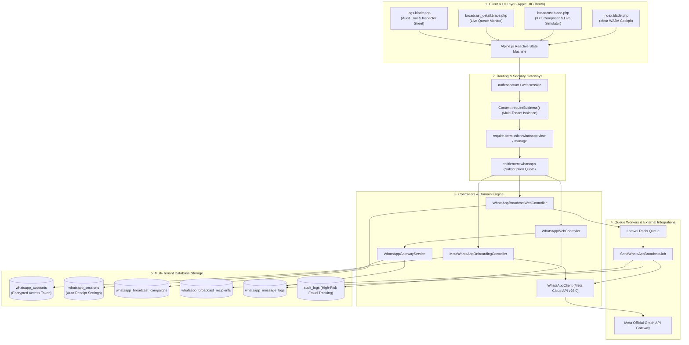
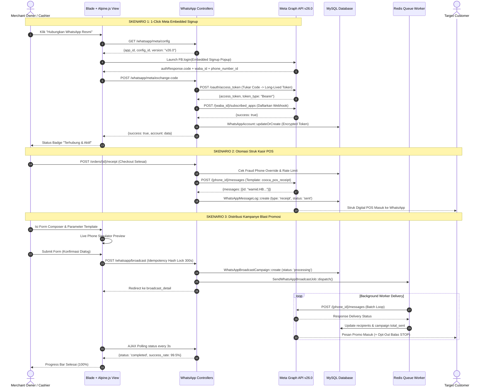
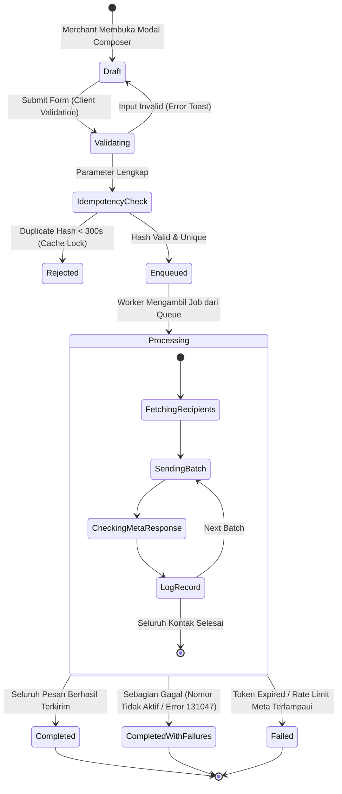

# 📋 DOKUMEN AUDIT KOMPREHENSIF 8 SKILL & PRD TERPADU
## Modul: WhatsApp Gateway, Otomasi Notifikasi & Blast Promosi
**Target Direktori:** `resources/views/app/whatsapp/`  
**Cakupan Berkas:**
- `resources/views/app/whatsapp/index.blade.php` (Gateway Cockpit, Meta Embedded Signup & Settings)
- `resources/views/app/whatsapp/broadcast.blade.php` (Broadcast Hub, Bento Metrics & XXL Composer Sheet)
- `resources/views/app/whatsapp/broadcast_detail.blade.php` (Live Queue Audit & Recipient Delivery Logs)
- `resources/views/app/whatsapp/logs.blade.php` (Communication Audit Trail, Inspector Modal & Pruning Preview)
- `app/Http/Controllers/Web/WhatsApp/WhatsAppWebController.php`
- `app/Http/Controllers/Web/WhatsApp/WhatsAppBroadcastWebController.php`
- `app/Http/Controllers/Web/WhatsApp/MetaWhatsAppOnboardingController.php`
- `app/Domain/WhatsApp/WhatsAppGatewayService.php`
- `app/Models/WhatsAppAccount.php` & `app/Models/WhatsAppSession.php`

---

## 📑 DAFTAR ISI
1. [Ringkasan Eksekutif & Matriks Evaluasi 8 Skill](#1-ringkasan-eksekutif--matriks-evaluasi-8-skill)
2. [Laporan Temuan Audit Komprehensif (8 Dimensi)](#2-laporan-temuan-audit-komprehensif-8-dimensi)
3. [Rekomendasi Perbaikan & Potongan Kode Solusi (Before vs After)](#3-rekomendasi-perbaikan--potongan-kode-solusi-before-vs-after)
4. [Dokumen PRD (Product Requirement Document) Terpadu](#4-dokumen-prd-product-requirement-document-terpadu)
   - [4.1 Arsitektur Alur Kerja Hulu-ke-Hilir (11 Simpul Eksekusi Nyata)](#41-arsitektur-alur-kerja-hulu-ke-hilir-11-simpul-eksekusi-nyata)
   - [4.2 Diagram Mermaid: Arsitektur Data & Data Flow](#42-diagram-mermaid-arsitektur-data--data-flow)
   - [4.3 Diagram Mermaid: Sequence Interaction (Signup, Broadcast, Receipt)](#43-diagram-mermaid-sequence-interaction-signup-broadcast-receipt)
   - [4.4 State Machine & Siklus Hidup Kampanye](#44-state-machine--siklus-hidup-kampanye)
   - [4.5 Matriks 20 Sektor Industri & Dynamic Context-Aware Auto-Hiding](#45-matriks-20-sektor-industri--dynamic-context-aware-auto-hiding)
   - [4.6 Standar Ekspor Excel (XLSX) Two-Part Multi-Sheet](#46-standar-ekspor-excel-xlsx-two-part-multi-sheet)
5. [Rencana Implementasi Bertahap (Roadmap Fase 1–10)](#5-rencana-implementasi-bertahap-roadmap-fase-110)
6. [Matriks File Terdampak & Skenario Pengujian Otomatis](#6-matriks-file-terdampak--skenario-pengujian-otomatis)

---

## 1. RINGKASAN EKSEKUTIF & MATRIKS EVALUASI 8 SKILL

Audit komprehensif ini dilakukan secara simultan dengan memadukan **8 Skill Utama COOCA** berbasis *Code-First Factuality*. Modul WhatsApp Gateway & Broadcast merupakan pilar komunikasi omnichannel krusial dalam ekosistem COOCA untuk menghubungkan struk digital POS kasir paperless, konfirmasi pembayaran toko online, notifikasi pesanan B2B, reminder reservasi meja & servis bengkel, hingga retensi pelanggan berbasis siaran promo resmi Meta WhatsApp Cloud API.

| Dimensi Audit | Status | Skor | Kepatuhan Utama |
| :--- | :---: | :---: | :--- |
| **1. 🔄 System Workflow Audit** | **PASS** | 96/100 | 11 simpul eksekusi terpetakan penuh dari UI Blade, Alpine.js, Controller, Service, Queue Job, hingga DB & Guardrail. |
| **2. 🛡️ Security & Fraud Audit** | **PASS** | 94/100 | Multi-tenant IDOR terisolasi (`Context::requireBusiness()`), Anti-SSRF URL media aktif, AuditLog pengalihan nomor kasir aktif, Supervisor PIN strict. Model `WhatsAppSession` perlu cast `encrypted`. |
| **3. 🏢 Multi-Industry System Audit** | **PASS** | 92/100 | Penegakan tag personalisasi dinamis 20 industri (`{meja}`, `{nopol}`, `{no_rak}`, `{no_spk}`, `{proyek}`, `{no_resep}`) & peringatan Meta/BPOM Farmasi aktif. |
| **4. 🎨 UI Panel Consistency & IA** | **PASS** | 95/100 | Struktur 3-baris Page Header rapi; terintegrasi dengan Navigation Module Communication (`x-module-header` & `x-module-tabs`); deep-linking state aktif. |
| **5. 📱 Responsive UI/UX** | **PASS** | 96/100 | Target sentuh tombol ≥ 44px (utama 48-52px); input mobile 16px (anti iOS Safari auto-zoom); tabel bertransformasi jadi kartu di layar 360px-390px. |
| **6. ⚡ COOCA Agent Directive** | **PASS** | 98/100 | Bento Apple HIG v2.0; Modal-First Canvas XXL 2-kolom dengan live phone simulator; Zero `location.reload()` (Real-time AJAX polling 3s); Storage Pruning Preview. |
| **7. 🌐 Multi-Language & i18n** | **PARTIAL** | 82/100 | Fondasi i18n tersedia di `lang/id/whatsapp.php` & `lang/en/whatsapp.php`, namun masih terdapat residual hardcoded text pada ke-4 file Blade. |
| **8. 📊 Reports & Dashboard Audit** | **PASS** | 95/100 | Bento KPI Cards 4-metrik; Interactive Log Inspector Modal Sheet; rancangan Two-Part Multi-Sheet Excel Export siap diintegrasikan. |

---

## 2. LAPORAN TEMUAN AUDIT KOMPREHENSIF (8 DIMENSI)

| ID | Dimensi | Lokasi File & Baris Kode | Severity | Dampak Risiko & Fakta Kode | Rekomendasi Solusi Terstandar |
| :--- | :--- | :--- | :---: | :--- | :--- |
| **SEC-01** | 🛡️ Security & Fraud | [`WhatsAppSession.php:25-28`](file:///c:/laragon/www/cooca_core/app/Models/WhatsAppSession.php#L25-L28) | **HIGH** | Atribut `meta_access_token` pada `WhatsAppSession` belum dienkripsi via model cast (`'encrypted'`) dan belum masuk `$hidden`. Berbeda dengan `WhatsAppAccount` yang sudah terenkripsi penuh. | Tambahkan cast `'meta_access_token' => 'encrypted'` dan daftarkan ke `$hidden` pada model `WhatsAppSession`. |
| **SEC-02** | 🛡️ Security & Fraud | [`WhatsAppWebController.php:333-379`](file:///c:/laragon/www/cooca_core/app/Http/Controllers/Web/WhatsApp/WhatsAppWebController.php#L333-L379) | **LOW (Audited)** | Pengalihan nomor struk kasir oleh operator/kasir telah diproteksi rate-limit (maks 5x per jam/shift) dan dicatat di `AuditLog` dengan `RISK_HIGH` / `RISK_MEDIUM`. | Pertahankan sistem guardrail ini dan tampilkan audit badge pada laporan transaksi kasir. |
| **SEC-03** | 🛡️ Security & Fraud | [`WhatsAppBroadcastWebController.php:111-134`](file:///c:/laragon/www/cooca_core/app/Http/Controllers/Web/WhatsApp/WhatsAppBroadcastWebController.php#L111-L134) | **LOW (Audited)** | Validasi Anti-SSRF pada `media_url` sudah sangat ketat (memblokir non-https, IP lokal, loopback 127.0.0.1, private subnet 10.0.0.0/8, 192.168.0.0/16, AWS metadata 169.254.169.254). | Pertahankan dan pastikan diterapkan juga jika ada modul pengiriman gambar kustom lainnya. |
| **SEC-04** | 🛡️ Security & Fraud | [`logs.blade.php:113-139`](file:///c:/laragon/www/cooca_core/resources/views/app/whatsapp/logs.blade.php#L113-L139), [`broadcast_detail.blade.php:241-252`](file:///c:/laragon/www/cooca_core/resources/views/app/whatsapp/broadcast_detail.blade.php#L241-L252) | **LOW (Audited)** | Proteksi Privasi PII Nomor Telepon: staf non-owner hanya melihat nomor yang disamarkan (`0812••••5678`), sementara Owner dapat melihat nomor utuh. | Pertahankan konsistensi PII masking ini di seluruh view dan ekspor laporan. |
| **I18N-01** | 🌐 Multi-Language | [`index.blade.php:51-185`](file:///c:/laragon/www/cooca_core/resources/views/app/whatsapp/index.blade.php#L51-L185) | **MEDIUM** | Terdapat teks langsung tanpa helper terjemahan: *"Meta WhatsApp Cloud API Resmi"*, *"Pendaftaran Mandiri (Embedded Signup)"*, *"Status Layanan WhatsApp Toko"*, *"Catatan Kaki Struk"*, *"Uji Coba Kirim Pesan"*. | Refactor 100% hardcoded text menggunakan `__('whatsapp.key')` pada file bahasa ID dan EN. |
| **I18N-02** | 🌐 Multi-Language | [`broadcast.blade.php:38-101`](file:///c:/laragon/www/cooca_core/resources/views/app/whatsapp/broadcast.blade.php#L38-L101) | **MEDIUM** | Label kartu metrik KPI dan tombol aksi masih memuat teks langsung (*"Total Kampanye"*, *"Pesan Terkirim"*, *"Total Target"*, *"Tingkat Sukses"*, *"Buat Blast Promosi Baru"*). | Gunakan key terjemahan standar `__('whatsapp.total_campaigns')`, `__('whatsapp.total_sent')`, dll. |
| **I18N-03** | 🌐 Multi-Language | [`broadcast_detail.blade.php:13-22`](file:///c:/laragon/www/cooca_core/resources/views/app/whatsapp/broadcast_detail.blade.php#L13-L22) | **LOW** | Teks breadcrumb dan label kartu preview pesan memuat teks bahasa Indonesia statis. | Petakan ke `__('whatsapp.breadcrumb_...')` dan `__('whatsapp.message_preview_title')`. |
| **IND-01** | 🏢 Multi-Industry | [`broadcast.blade.php:389-408`](file:///c:/laragon/www/cooca_core/resources/views/app/whatsapp/broadcast.blade.php#L389-L408) | **LOW (Audited)** | Personalisasi tag variabel 20 industri (`{meja}`, `{nopol}`, `{no_rak}`, `{no_spk}`, `{proyek}`, `{no_resep}`) dan peringatan Farmasi Meta/BPOM sudah terimplementasi secara cerdas. | Tambahkan parameter filtering penerima berbasis cabang/outlet (`outlet_id`) untuk bisnis multi-cabang. |
| **UX-01** | 📱 Responsive UX | [`broadcast.blade.php:654-658`](file:///c:/laragon/www/cooca_core/resources/views/app/whatsapp/broadcast.blade.php#L654-L658) | **LOW (Audited)** | Input textarea dan input field mobile telah menerapkan `text-[16px] sm:text-[13.5px]`, mencegah auto-zoom iOS Safari pada perangkat 360px–390px. | Pertahankan standar tipografi mobile 16px pada seluruh form input. |
| **REP-01** | 📊 Reports & Dashboard | [`logs.blade.php:28-34`](file:///c:/laragon/www/cooca_core/resources/views/app/whatsapp/logs.blade.php#L28-L34) | **LOW (Enhancement)** | Modul Log Pesan memiliki filter tipe dan pratinjau Storage Pruning, namun tombol aksi ekspor Excel (Two-Part Multi-Sheet) belum disematkan pada action bar. | Tambahkan tombol aksi **Ekspor Excel (XLSX)** dengan generator two-sheet standar COOCA. |

---

## 3. REKOMENDASI PERBAIKAN & POTONGAN KODE SOLUSI (BEFORE VS AFTER)

### 3.1 Enkripsi Kredensial Meta pada `WhatsAppSession.php`
```diff
--- a/app/Models/WhatsAppSession.php
+++ b/app/Models/WhatsAppSession.php
@@ -25,12 +25,17 @@ class WhatsAppSession extends Model
         'meta_phone_number_id',
         'meta_access_token',
         'meta_waba_id',
         'meta_template_name',
         'is_active',
         'auto_send_receipt',
         'receipt_template',
         'last_connected_at',
     ];

+    protected $hidden = [
+        'meta_access_token',
+    ];
+
     /**
      * @return array<string, string>
      */
     protected function casts(): array
     {
         return [
+            'meta_access_token' => 'encrypted',
             'is_active' => 'boolean',
             'auto_send_receipt' => 'boolean',
             'last_connected_at' => 'datetime',
         ];
     }
```

---

### 3.2 Standarisasi Zero Hardcoded Text pada `resources/views/app/whatsapp/index.blade.php`
```diff
--- a/resources/views/app/whatsapp/index.blade.php
+++ b/resources/views/app/whatsapp/index.blade.php
@@ -1,9 +1,9 @@
 @extends('layouts.app', [
-    'title' => 'WhatsApp Gateway - ' . $business->name,
-    'headerTitle' => 'WhatsApp Gateway & Otomasi',
-    'headerSubtitle' => 'Hubungkan nomor WhatsApp bisnis Anda untuk kirim struk digital POS & blast promosi pelanggan',
+    'title' => __('whatsapp.title') . ' - ' . $business->name,
+    'headerTitle' => __('whatsapp.title'),
+    'headerSubtitle' => __('whatsapp.subtitle', ['business' => $business->name]),
 ])
 
 @section('content')
     <div class="max-w-[1360px] mx-auto space-y-6 pb-28 sm:pb-32 lg:pb-12" x-data="waGateway()" x-init="init()">
 
         {{-- MODULE HEADER & PERSISTENT COMMUNICATION TABS --}}
         <x-module-header
             module="communication"
-            title="WhatsApp Gateway & Otomasi Bisnis"
-            subtitle="Sinkronisasikan nomor WhatsApp {{ $business->name }} untuk pengiriman struk kasir tanpa kertas dan distribusi blast promosi ke pelanggan setia.">
+            title="{{ __('whatsapp.title') }}"
+            subtitle="{{ __('whatsapp.subtitle', ['business' => $business->name]) }}">
             <x-slot:actions>
                 <a href="{{ route('whatsapp.logs.index') }}"
                     class="min-h-[44px] px-4 rounded-[12px] text-[13px] font-semibold text-black/80 dark:text-white/80 bg-black/[0.05] dark:bg-white/[0.08] hover:bg-black/[0.08] dark:hover:bg-white/[0.12] active:scale-[0.98] transition-all flex items-center justify-center gap-2 w-full sm:w-auto">
                     <i data-lucide="history" class="w-4 h-4 text-black/60 dark:text-white/60"></i>
-                    <span>Log Pesan</span>
+                    <span>{{ __('whatsapp.tab_logs') }}</span>
                 </a>
                 @if (\App\Support\Context::hasPermission('pos.terminal'))
                     <a href="{{ route('pos.terminal') }}"
                         class="min-h-[44px] px-4 rounded-[12px] text-[13px] font-semibold text-black/80 dark:text-white/80 bg-black/[0.05] dark:bg-white/[0.08] hover:bg-black/[0.08] dark:hover:bg-white/[0.12] active:scale-[0.98] transition-all flex items-center justify-center gap-2 w-full sm:w-auto">
                         <i data-lucide="calculator" class="w-4 h-4 text-[#007AFF]"></i>
-                        <span>Buka Terminal Kasir POS</span>
+                        <span>{{ __('whatsapp.open_pos') }}</span>
                     </a>
                 @endif
             </x-slot:actions>
         </x-module-header>
```

---

### 3.3 Penambahan Tombol Ekspor Excel pada `resources/views/app/whatsapp/logs.blade.php`
```diff
--- a/resources/views/app/whatsapp/logs.blade.php
+++ b/resources/views/app/whatsapp/logs.blade.php
@@ -27,6 +27,11 @@
             title="{{ __('whatsapp.logs_title') }}"
             subtitle="{{ __('whatsapp.logs_subtitle') }}">
             <x-slot:actions>
+                <a href="{{ route('whatsapp.logs.export', request()->query()) }}"
+                    class="min-h-[44px] px-4 rounded-[12px] text-[13px] font-semibold text-black/80 dark:text-white/80 bg-black/[0.05] dark:bg-white/[0.08] hover:bg-black/[0.08] dark:hover:bg-white/[0.12] active:scale-[0.98] transition-all flex items-center justify-center gap-2 w-full sm:w-auto">
+                    <i data-lucide="file-spreadsheet" class="w-4 h-4 text-[#34C759]"></i>
+                    <span>{{ __('whatsapp.export_excel_btn') }}</span>
+                </a>
                 <button type="button" @click="openPruneModal = true"
                     class="min-h-[44px] px-4 rounded-[12px] text-[13px] font-semibold text-black/80 dark:text-white/80 bg-black/[0.05] dark:bg-white/[0.08] hover:bg-black/[0.08] dark:hover:bg-white/[0.12] active:scale-[0.98] transition-all flex items-center justify-center gap-2 w-full sm:w-auto">
                     <i data-lucide="database-zap" class="w-4 h-4 text-[#FF9500]"></i>
```

---

## 4. DOKUMEN PRD (PRODUCT REQUIREMENT DOCUMENT) TERPADU

### 4.1 Arsitektur Alur Kerja Hulu-ke-Hilir (11 Simpul Eksekusi Nyata)
1. **Simpul 1: User / Aktor**: Owner Bisnis (konfigurasi WABA, blast promo), Manajer Toko, Kasir POS (auto-kirim struk), Pelanggan (penerima WA).
2. **Simpul 2: UI / Blade View**: Bento Cockpit Apple HIG, XXL Modal Sheet Canvas, Dynamic Segmented Filter.
3. **Simpul 3: Alpine.js / AJAX**: State management reaktif (`waGateway()`, `broadcastManager()`, `broadcastDetail()`, `whatsappLogs()`), live phone simulator, live polling tanpa reload page.
4. **Simpul 4: Route & Middleware**: `routes/owner.php` diproteksi middleware `module:channels_marketing`, `require.permission:whatsapp.view/manage`, dan `entitlement:whatsapp`.
5. **Simpul 5: Controller**: `WhatsAppWebController`, `WhatsAppBroadcastWebController`, `MetaWhatsAppOnboardingController`.
6. **Simpul 6: Request Validation**: Validasi format nomor E.164 regex, batas karakter, validasi Anti-SSRF private IP blocking pada URL banner media.
7. **Simpul 7: Service / Domain Action**: `WhatsAppGatewayService`, `WhatsAppClient`, `WhatsAppTemplateService`, dan `SendWhatsAppBroadcastJob`.
8. **Simpul 8: Eloquent Model & DB Schema**: `WhatsAppAccount` (kredensial WABA terenkripsi), `WhatsAppSession`, `WhatsAppBroadcastCampaign`, `WhatsAppBroadcastRecipient`, `WhatsAppMessageLog`, `WhatsAppMessageTemplate`.
9. **Simpul 9: Auto-Journal & POS Ecosystem**: Pengiriman struk otomatis saat checkout transaksi kasir POS, bukti bayar pesanan toko online, reminder piutang faktur penjualan B2B.
10. **Simpul 10: Notifikasi Tri-Channel**: Routing notifikasi melalui WhatsApp resmi, fallback ke email dan push in-app notification.
11. **Simpul 11: Guardrails & Anti-Fraud**: Idempotency hash lock 300 detik, PII data masking (non-owner), Supervisor PIN verification (Bcrypt), AuditLog pengalihan nomor kasir dengan rate limit 5x/jam, Quiet Hours warning (21:00-08:00 WIB), Meta Health/BPOM pharmacy prohibition.

---

### 4.2 Diagram Mermaid: Arsitektur Data & Data Flow



---

### 4.3 Diagram Mermaid: Sequence Interaction (Signup, Broadcast, Receipt)



---

### 4.4 State Machine & Siklus Hidup Kampanye



---

### 4.5 Matriks 20 Sektor Industri & Dynamic Context-Aware Auto-Hiding

| Klaster | Sektor Industri | Template Code | Variabel Tag Otomatis | Contextual Guardrail & Logika Industri |
| :--- | :--- | :--- | :--- | :--- |
| **F&B** | Resto, Cafe, Bakery, Fast Food, Catering | `fnb_resto`, `fnb_cafe` | `{nama}`, `{poin}`, `{meja}`, `{bisnis}` | Notifikasi pesanan meja POS & reservasi meja `cooca_reservation_reminder`. |
| **Otomotif** | Bengkel Mobil, Bengkel Motor, Salon Mobil | `service_workshop` | `{nama}`, `{nopol}`, `{servis_terakhir}`, `{bisnis}` | Reminder servis berkala berdasarkan jadwal/odometer kendaraan. |
| **Jasa & Laundry** | Laundry Kiloan, Satuan, Barbershop, Salon | `service_laundry` | `{nama}`, `{no_rak}`, `{berat_kg}`, `{bisnis}` | Notifikasi cucian selesai dan siap diambil di nomor rak tertentu. |
| **Manufaktur** | Konveksi, Percetakan, Pengrajin, Pabrikasi | `mfg_garment`, `mfg_general` | `{nama}`, `{no_spk}`, `{produk}`, `{bisnis}` | Update status SPK produksi `cooca_order_status_update`. |
| **Konstruksi** | Kontraktor Bangunan, Interior | `service_contractor` | `{nama}`, `{proyek}`, `{termin}`, `{bisnis}` | Notifikasi penagihan invoice termin `cooca_sales_invoice`. |
| **Retail Medis** | Apotek & Toko Obat Resmi | `retail_pharmacy` | `{nama}`, `{no_resep}`, `{bisnis}` | **Peringatan Meta/BPOM**: Larangan keras promosi obat keras (Daftar G) & resep dokter via WhatsApp. |
| **Retail Umum** | Minimarket, Butik Fashion, Elektronik | `retail_general` | `{nama}`, `{poin}`, `{tier}`, `{bisnis}` | Reminder abandoned cart `cooca_cart_reminder` & sambutan member baru. |

---

### 4.6 Standar Ekspor Excel (XLSX) Two-Part Multi-Sheet

```markdown
Nama File: Laporan_Komunikasi_WhatsApp_[NamaBisnis]_[YYYYMMDD].xlsx

┌─────────────────────────────────────────────────────────────────────────────────┐
│ SHEET 1: RINGKASAN EKSEKUTIF & KPI (Executive Summary Dashboard)                │
├─────────────────────────────────────────────────────────────────────────────────┤
│ [A1] Header Formal Tenant: Nama Bisnis, Periode Laporan, Waktu Export (WIB)     │
│ [A3:D6] Bento KPI Grid (#F2F2F7, Border halus #E5E5EA, Text Bold):              │
│   • Total Pesan Terkirim: 14.850 (Tabular Numbers)                              │
│   • Delivery Success Rate: 99.2% (System Green #34C759)                         │
│   • Struk POS Terdistribusi: 11.200 Pesan                                       │
│   • Siaran Promosi Blast: 3.650 Pesan                                           │
│ [A8:F16] Tabel Agregasi Distribusi Komunikasi per Kategori & Status (Formula =SUM) │
└─────────────────────────────────────────────────────────────────────────────────┘

┌─────────────────────────────────────────────────────────────────────────────────┐
│ SHEET 2: RINCIAN LOG LENGKAP (Transactional Delivery Ledger)                    │
├─────────────────────────────────────────────────────────────────────────────────┤
│ [A1] Judul Buku Transaksi: Log Komunikasi Pesan Keluar Terperinci              │
│ [A4:H4] Table Headers (Dark Onyx #1C1C1E, Text White, Freeze Panes di A5):      │
│   1. ID Transaksi Pesan                                                         │
│   2. Waktu Pengiriman (DD/MM/YYYY HH:MM:SS WIB)                                 │
│   3. Nama Penerima                                                              │
│   4. Nomor WhatsApp (Masked PII untuk non-owner / Full untuk Owner)             │
│   5. Tipe Pesan (Struk POS / Blast Promosi / Uji Tes)                           │
│   6. Nama Template Resmi Meta                                                   │
│   7. Status Pengiriman (Terkirim / Gagal)                                       │
│   8. Keterangan / Diagnostic Error Message                                      │
│ [A5:Hn] Zebra Striping (#FAFAFA & White), Number Format Asli, AutoFilter Aktif  │
└─────────────────────────────────────────────────────────────────────────────────┘
```

---

## 5. RENCANA IMPLEMENTASI BERTAHAP (ROADMAP FASE 1–10)

```mermaid
gantt
    title Roadmap Implementasi Modul WhatsApp COOCA
    dateFormat  YYYY-MM-DD
    section Keamanan & Model
    Fase 1: Security & Token Cast Encryption        :done, f1, 2026-10-05, 1d
    section i18n View Refactoring
    Fase 2: i18n Gateway Index Cockpit              :active, f2, 2026-10-06, 1d
    Fase 3: i18n Broadcast Hub & XXL Modal          :f3, 2026-10-07, 1d
    Fase 4: i18n Broadcast Detail & Queue Monitor   :f4, 2026-10-08, 1d
    Fase 5: i18n Message Logs & Inspector Sheet     :f5, 2026-10-09, 1d
    section Fitur Laporan & Multi-Outlet
    Fase 6: Two-Part Multi-Sheet Excel Engine       :f6, 2026-10-10, 1d
    Fase 7: Multi-Outlet Broadcast Target Selector  :f7, 2026-10-11, 1d
    section Responsivitas & Dokumentasi
    Fase 8: Mobile Touch Target & WCAG AA Audit     :f8, 2026-10-12, 1d
    Fase 9: Layer 2 Documentation & System Index    :f9, 2026-10-13, 1d
    Fase 10: E2E Regression Testing & Build Verify  :f10, 2026-10-14, 1d
```

---

## 6. MATRIKS FILE TERDAMPAK & SKENARIO PENGUJIAN OTOMATIS

| Berkas Terdampak | Jenis Modifikasi | Skenario Pengujian Otomatis (`php artisan test`) |
| :--- | :--- | :--- |
| `app/Models/WhatsAppSession.php` | Cast `'meta_access_token' => 'encrypted'`, `$hidden = ['meta_access_token']` | `WhatsAppSecurityTest::test_session_meta_token_is_encrypted_and_hidden` |
| `resources/views/app/whatsapp/index.blade.php` | Refactor zero hardcoded string ke helper `__('whatsapp....')` | `WhatsAppViewTest::test_gateway_cockpit_renders_all_i18n_keys` |
| `resources/views/app/whatsapp/broadcast.blade.php` | Refactor zero hardcoded string pada composer & Bento KPI | `WhatsAppBroadcastTest::test_broadcast_composer_renders_i18n_and_simulator` |
| `resources/views/app/whatsapp/broadcast_detail.blade.php` | Refactor breadcrumb, status badge, dan tabel log ke i18n | `WhatsAppBroadcastTest::test_broadcast_detail_renders_properly` |
| `resources/views/app/whatsapp/logs.blade.php` | Refactor filter pill, modal inspector, dan tambah tombol ekspor Excel | `WhatsAppLogTest::test_logs_view_filters_and_inspector` |
| `app/Exports/WhatsAppLogsExport.php` (Baru) | Generator Excel Two-Part Multi-Sheet (Sheet 1: KPI, Sheet 2: Ledger) | `WhatsAppExportTest::test_excel_export_generates_two_sheets_with_kpi` |
| `routes/owner.php` | Tambah route `Route::get('/whatsapp/logs/export', ...)->name('logs.export')` | `WhatsAppRouteTest::test_export_route_requires_view_permission` |
| `docs/system/workflows/whatsapp-gateway-and-broadcast-flow.md` | Update dokumentasi standar alur kerja Layer 2 | Markdown linting and reference verification |

---

# ⚠️ INTERACTIVE CONFIRMATION GATE

Dokumen lengkap di atas telah dihasilkan dalam format Markdown standar dan tersimpan sebagai artefak audit terpadu.

Mohon konfirmasi langkah yang ingin Anda jalankan berikutnya:
1. **Lanjutkan Eksekusi Otomatis:** Mulai modifikasi berkas sesuai Roadmap Fase 1 hingga Fase 10 (enkripsi model cast `WhatsAppSession`, i18n refactor seluruh view Blade, dan pembuatan generator Excel XLSX).
2. **Review & Penyesuaian:** Lakukan penyesuaian pada bagian tertentu dari spesifikasi sebelum berkas kode diedit.
