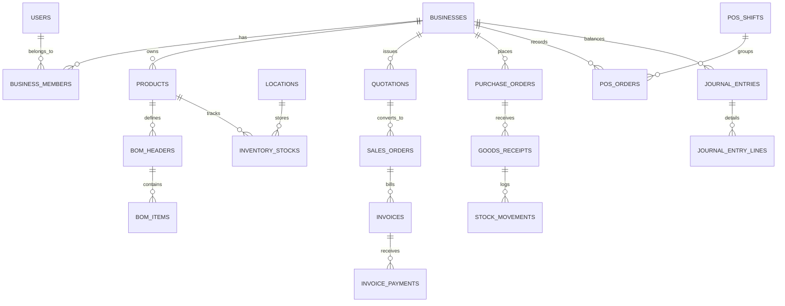

# FUNCTIONAL SPECIFICATION DOCUMENT (FSD)
## COOCA CORE — BUSINESS OPERATING SYSTEM
**Document Version:** 2.1  
**Status:** Approved Master Blueprint Specification  
**Architecture:** Shared-Database Multi-Tenant with Adaptive Dual Operating Modes  
**Operating Capability:** **Solo-Owner Mode (1 Orang)** & **Team / Delegated Mode (Owner + Karyawan)**  
**Core Principles:** **Simple, Mudah, & Otomasi Penuh (Automation as Core Experience)**  
**Primary Tech Stack:** PHP 8.3+, Laravel 11/13, MySQL 8.0, Redis, Chart.js, Alpine.js, TailwindCSS  

---

## 1. System Architecture & Topology

### 1.1 Dual-Domain Architectural Separation

Cooca UMKM memisahkan secara tegas antara **Platform Domain** (manajemen SaaS multi-tenant, billing, lisensi) dan **Tenant Domain** (sistem operasional bisnis UMKM).

```
┌─────────────────────────────────────────────────────────────────────────────┐
│                            COOCA PLATFORM DOMAIN                            │
│                        (SaaS Operator / Superadmin)                         │
│  - Plans & Pricing Engine        - Subscription Lifecycle & Billing         │
│  - AI Provider Routing & Limits  - WhatsApp Gateway Management              │
│  - 20+ Industry HPP Templates    - Tenant Usage Metering & Platform Audit   │
└──────────────────────────────────────┬──────────────────────────────────────┘
                                       │ Token / Entitlement Bridge
                                       ▼
┌─────────────────────────────────────────────────────────────────────────────┐
│                            CUSTOMER TENANT DOMAIN                           │
│                     (Multi-Tenant Business Operating System)                │
│                                                                             │
│  ┌───────────────────────────────────────────────────────────────────────┐  │
│  │ Context Resolution Middleware (Session / Token -> active_business_id)  │  │
│  └───────────────────────────────────┬───────────────────────────────────┘  │
│                                      ▼                                      │
│  ┌───────────────────────────────────────────────────────────────────────┐  │
│  │ Adaptive Operating Engine: Solo-Owner Mode vs. Team / Delegated Mode   │  │
│  └───────────────────────────────────┬───────────────────────────────────┘  │
│                                      ▼                                      │
│  ┌───────────────────────────────────────────────────────────────────────┐  │
│  │ Server-Side Authorization Boundary & BelongsToBusiness Global Scope    │  │
│  └───────────────────┬───────────────────────────────────┬───────────────┘  │
│                      ▼                                   ▼                  │
│       ┌──────────────────────────────┐   ┌───────────────────────────────┐  │
│       │ Zero-Touch Business Flow     │   │ Autonomous Intelligence Layer │  │
│       │ - Product & Dynamic BOM      │   │ - Auto-Journal Accounting     │  │
│       │ - Real-Time HPP Engine       │   │ - Real-Time Stock Engine      │  │
│       │ - Sales: Quo -> SO -> Inv    │   │ - AI Forecasting & Anomaly    │  │
│       │ - Instant / Formal Receiving │   │ - AI Action Tool Registry     │  │
│       │ - Multi-Warehouse Inventory  │   │ - WhatsApp Notification Queue │  │
│       │ - POS Touch Terminal & Shift │   │ - PDF Generation Service      │  │
│       │ - Double-Entry General Ledger│   │ - Import/Export CSV/XLSX      │  │
│       └──────────────────────────────┘   └───────────────────────────────┘  │
└─────────────────────────────────────────────────────────────────────────────┘
```

### 1.2 Multi-Tenancy & Data Isolation Rules
1. Setiap tabel bisnis wajib memiliki kolom `business_id` (tipe UUID atau `unsignedBigInteger`) berindeks (*indexed foreign key*).
2. Trait global `App\Models\Traits\BelongsToBusiness` otomatis menyuntikkan *Global Scope* pada setiap kueri Eloquent:
   ```php
   static::addGlobalScope('business', function (Builder $builder) {
       if ($businessId = Context::businessId()) {
           $builder->where($builder->getModel()->getTable() . '.business_id', $businessId);
       }
   });
   ```
3. Pembuatan record baru otomatis mengisikan `business_id` dari `Context::businessId()`.

---

### 1.3 Adaptive Operating Engine: Solo-Owner Mode vs. Team Mode

Sistem memiliki `OperatingModeResolver` yang secara dinamis menyesuaikan alur kerja dan antarmuka berdasarkan jumlah anggota aktif bisnis:

```php
final class OperatingModeResolver
{
    public static function isSoloMode(Business $business): bool
    {
        // Jika bisnis hanya memiliki 1 user aktif (Owner sendiri), aktifkan Solo Mode
        return $business->users()->count() <= 1;
    }
}
```

```
                     OPERATING MODE RESOLVER
                                │
          ┌─────────────────────┴─────────────────────┐
          ▼                                           ▼
   SOLO-OWNER MODE (1 User)                   TEAM MODE (>1 Users)
───────────────────────────────              ───────────────────────────────
• Approval bypass otomatis                   • RBAC ketat & pemisahan tugas
• Beli langsung ke stok (1-Klik)             • Alur PO formal & verifikasi gudang
• Shift kasir continuous / opsional          • Wajib buka/tutup shift kasir
• Tanpa keharusan PIN supervisor             • PIN supervisor untuk void/diskon
• Sembunyikan modul birokrasi tim            • Sembunyikan HPP riil dari kasir
```

#### Karakteristik Solo-Owner Mode:
1. **Bypass Supervisor PIN:** Karena pemilik adalah kasir sekaligus manajer, pembatalan pesanan (*void*), pengembalian dana (*refund*), atau diskon manual tidak meminta verifikasi PIN otorisasi supervisor.
2. **Instant Stock-In (1-Klik Pembelian):** Pemilik dapat mencatat belanja bahan baku dengan 1 tombol *"Beli Langsung ke Stok"*, tanpa harus melalui alur bertingkat: buat PO $\rightarrow$ kirim PO $\rightarrow$ buat formulir penerimaan barang.
3. **Continuous Cashier Register:** Shift kasir dapat berjalan terus menerus tanpa memaksa pemilik menghitung fisik laci kas setiap hari jika bisnis tidak memerlukannya.
4. **Progressive Disclosure:** Halaman manajemen tim, log riwayat approval, dan pengaturan izin staf disembunyikan sampai pemilik mengklik tombol *"Undang Karyawan Pertama"*.

#### Karakteristik Team / Delegated Mode:
1. **Perlindungan Rahasia Bisnis (*Data Obfuscation*):** Staf dengan peran `cashier` atau `sales` secara otomatis diblokir dari melihat kolom `base_cost` (HPP), `total_hpp_cost`, dan `total_gross_profit`. Kasir hanya melihat harga jual toko.
2. **Rekonsiliasi Kas Laci Wajib:** Kasir wajib memasukkan modal awal saat buka shift dan menghitung uang fisik saat tutup shift. Selisih kas $\ge \text{Rp } 50.000$ otomatis memicu peringatan (*Cash Drawer Discrepancy Alert*) ke Owner.
3. **Pemisahan Tugas Gudang & Penjualan:** Staf gudang mencatat penerimaan barang fisik dari PO tanpa akses ke laporan keuangan laba rugi.

---

## 2. Actor, Roles & RBAC Matrix

### 2.1 Role Definitions
- **Owner:** Pemilik akun bisnis. Memiliki akses `Full` ke seluruh modul bisnis, hak mengelola tim, hak mengaktifkan/membayar langganan SaaS, serta integrasi API/WhatsApp.
- **Admin:** Administrator operasional yang ditunjuk Owner. Memiliki akses penuh ke seluruh transaksi operasional (Master Data, HPP, Penjualan, Pembelian, Inventori, Keuangan, Laporan), namun **tidak memiliki akses ke Billing & Subscription SaaS**.
- **Staff (Configurable by Permissions):** Staf operasional yang hanya memiliki hak akses berdasarkan tugas spesifik:
  - *Kasir / Sales:* `pos.terminal`, `orders.view`, `orders.create`, `customers.view`, `customers.create`.
  - *Gudang / Warehouse:* `inventory.view`, `inventory.adjust`, `receiving.create`, `transfers.manage`.
  - *Keuangan / Finance:* `invoices.manage`, `payments.manage`, `expenses.manage`, `journals.view`.

### 2.2 Role & Permission Matrix

| Capability / Action | Key Permission Code | Owner (Solo / Team) | Admin | Staff (Kasir/Sales) | Staff (Gudang) | Staff (Finance) |
| :--- | :--- | :---: | :---: | :---: | :---: | :---: |
| **Kelola Pengaturan Bisnis** | `business.settings` | ✅ | ❌ | ❌ | ❌ | ❌ |
| **Kelola Anggota & Role** | `users.manage` | ✅ | ⚠️ *(Khusus)* | ❌ | ❌ | ❌ |
| **Master Produk & Resep BOM** | `products.manage` | ✅ | ✅ | ❌ | ⚠️ *(Read-only)*| ❌ |
| **Lihat HPP Riil & Margin Toko**| `costing.view_margin` | ✅ | ✅ | ❌ *(Tersembunyi)*| ❌ | ✅ |
| **Kalkulasi & Edit Resep HPP** | `costing.manage` | ✅ | ✅ | ❌ | ❌ | ⚠️ *(Read-only)*|
| **Quotation & Sales Order** | `sales.pipeline` | ✅ | ✅ | ✅ | ❌ | ⚠️ *(Read-only)*|
| **Faktur Penjualan (Invoice)** | `invoices.manage` | ✅ | ✅ | ✅ | ❌ | ✅ |
| **POS Kasir (Layar Sentuh)** | `pos.terminal` | ✅ | ✅ | ✅ | ❌ | ❌ |
| **Otorisasi Void / Diskon Besar**| `pos.supervisor_pin` | ✅ *(Auto)* | ✅ | ❌ *(Perlu PIN)* | ❌ | ❌ |
| **Purchase Order & Pemasok** | `purchasing.manage` | ✅ | ✅ | ❌ | ⚠️ *(Read-only)*| ✅ |
| **Penerimaan Barang (Receiving)**| `receiving.manage` | ✅ *(Instant)* | ✅ | ❌ | ✅ | ❌ |
| **Mutasi & Opname Stok** | `inventory.manage` | ✅ | ✅ | ❌ | ✅ | ❌ |
| **Pencatatan Beban / Biaya** | `expenses.manage` | ✅ | ✅ | ❌ | ❌ | ✅ |
| **Buku Besar & Jurnal Otomatis** | `accounting.view` | ✅ | ⚠️ | ❌ | ❌ | ✅ |
| **Laporan Finansial (Laba/Rugi)**| `reports.financial` | ✅ | ✅ | ❌ | ❌ | ✅ |
| **AI Assistant & Rekomendasi** | `ai.access` | ✅ | ✅ | ⚠️ *(Terbatas)* | ⚠️ *(Terbatas)* | ⚠️ *(Terbatas)* |
| **SaaS Billing & Langganan** | `billing.manage` | ✅ | ❌ | ❌ | ❌ | ❌ |

---

## 3. Data Model & Core Schema Specifications



### 3.1 Tabel Entitas Inti (Core Entities Schema)

#### A. Master Data & Costing
- `products`:
  - `id` (PK, UUID), `business_id` (FK), `category_id` (FK), `output_unit_id` (FK).
  - `code` (VARCHAR 64, SKU/Barcode), `name` (VARCHAR 255).
  - `type` (`stockable`, `material`, `service`, `composite`).
  - `base_cost` (DECIMAL 15,2) — Nilai HPP terhitung dari BOM aktif.
  - `selling_price` (DECIMAL 15,2) — Harga jual dasar.
  - `min_stock` (DECIMAL 12,2), `reorder_point` (DECIMAL 12,2).
  - `is_active` (BOOLEAN).
- `bom_headers` & `bom_items`:
  - Menyimpan komposisi resep per kuantitas hasil produksi (*batch yield*).
  - Alokasi biaya bahan, tenaga kerja langsung (*direct labor cost*), dan overhead.
- `product_cost_versions`:
  - Riwayat arsip HPP saat terjadi perubahan harga modal, mencatat `version_number`, `effective_date`, `calculated_hpp`, dan `reason`.

#### B. Sales Pipeline: Quotation, Sales Order, Invoice & POS
- `quotations`:
  - `id` (PK, UUID), `business_id`, `customer_id`, `quotation_number` (UNIQUE per business).
  - `date`, `expiry_date`, `subtotal`, `discount_amount`, `tax_amount`, `total_amount`.
  - `status` (`draft`, `sent`, `accepted`, `rejected`, `expired`, `cancelled`).
- `sales_orders`:
  - `id` (PK, UUID), `business_id`, `customer_id`, `quotation_id` (nullable FK).
  - `so_number` (UNIQUE per business), `order_date`, `expected_delivery_date`.
  - `status` (`draft`, `confirmed`, `partially_fulfilled`, `fulfilled`, `cancelled`).
- `invoices`:
  - `id` (PK, UUID), `business_id`, `customer_id`, `sales_order_id` (nullable FK).
  - `invoice_number` (UNIQUE per business), `issue_date`, `due_date`.
  - `subtotal`, `discount_amount`, `tax_amount`, `total_amount`, `paid_amount`, `balance_due`.
  - `total_hpp_cost`, `total_gross_profit`.
  - `status` (`unpaid`, `partially_paid`, `paid`, `overdue`, `cancelled`).
- `pos_orders`:
  - `id`, `business_id`, `pos_shift_id`, `order_number`, `total_amount`, `paid_amount`, `change_amount`, `total_hpp_cost`, `total_gross_profit`, `status` (`completed`, `voided`, `refunded`).
- `pos_shifts`:
  - `id`, `business_id`, `location_id`, `user_id` (Kasir), `register_id`.
  - `opened_at`, `closed_at`, `opening_cash`, `expected_cash`, `actual_cash`, `cash_difference`, `status` (`open`, `closed`).

#### C. Purchasing, Receiving & Inventory
- `purchase_orders`:
  - `id` (PK, UUID), `business_id`, `supplier_id`, `po_number` (UNIQUE per business).
  - `status` (`draft`, `sent`, `partially_received`, `received`, `cancelled`).
- `goods_receipts` & `goods_receipt_items`:
  - Pencatatan penerimaan riil di gudang. Memvalidasi pertambahan kuantitas di `inventory_stocks` dan memicu mutasi di `stock_movements`.
- `inventory_stocks`:
  - `id`, `business_id`, `location_id`, `product_id`, `quantity`, `last_cost`, `reorder_point`.
- `stock_movements`:
  - Buku besar inventori *immutable* yang mencatat `movement_type`, `quantity_before`, `quantity_delta`, `quantity_after`, `reference_type`, `reference_id`.

#### D. Double-Entry General Ledger
- `chart_of_accounts`:
  - Akun standar: 1000 (Kas & Bank), 1100 (Piutang Dagang), 1200 (Persediaan Barang), 2000 (Utang Dagang), 4000 (Pendapatan Penjualan), 5000 (Beban Pokok Penjualan / HPP), 6000 (Beban Operasional).
- `journal_entries` & `journal_entry_lines`:
  - Menegakkan prinsip akuntansi: $\sum \text{Debit} = \sum \text{Kredit}$.

---

## 4. Zero-Touch Automation & Detailed Module Flows

### 4.1 Otomasi Perhitungan HPP & Sinkronisasi Bahan
```
[Update Harga Bahan Baku] ──> [Memicu Event MaterialPriceUpdated]
                                         │
                                         ▼
                 [Kalkulasi Ulang Seluruh Resep BOM Terkait]
                                         │
                                         ▼
                 [Update base_cost di Tabel products]
                                         │
                                         ▼
                 [AI Evaluasi Margin Laba Kotor Terbaru]
```
1. Saat pemilik atau staf mencatat harga beli bahan baru (misal: harga minyak goreng naik dari Rp14.000 ke Rp17.000/liter), sistem otomatis mencari seluruh resep BOM yang menggunakan bahan tersebut.
2. Nilai `base_cost` (HPP modal) pada produk jadi di-update seketika tanpa perlu hitung manual.
3. Jika margin laba kotor turun di bawah target (misal $< 45\%$), mesin AI POS otomatis mengeluarkan kartu rekomendasi penyesuaian harga jual (*Smart Dynamic Pricing Suggestion*).

---

### 4.2 Otomasi Sales Pipeline & Terminal Kasir POS

#### Alur State Machine:
```
[Quotation DRAFT] ──> [SENT] ──> [ACCEPTED]
                                     │
                                     ▼ (Convert to SO)
[Sales Order DRAFT] ───────────> [CONFIRMED]
                                     │
                 ┌───────────────────┴───────────────────┐
                 ▼ (Invoicing)                           ▼ (Pengiriman)
        [Invoice UNPAID]                        [SO PARTIALLY_FULFILLED]
                 │                                        │
                 ▼ (Payment)                              ▼
        [Invoice PAID]                          [SO FULFILLED]
```

1. **Jalur Cepat Solo Owner (POS Instan):**
   - Transaksi kasir langsung memotong stok di `inventory_stocks`.
   - Mengisi buku besar mutasi `stock_movements`.
   - Menghasilkan jurnal akuntansi otomatis:
     - **Debit:** Kas / Bank (Akun 1000) sebesar Nilai Bayar Bersih.
     - **Kredit:** Pendapatan Penjualan (Akun 4000) sebesar Nilai Transaksi.
     - **Debit:** Beban Pokok Penjualan (Akun 5000) sebesar Total HPP.
     - **Kredit:** Persediaan Barang (Akun 1200) sebesar Total HPP.
2. **Jalur B2B / Pesanan Bertahap (Quotation $\rightarrow$ SO $\rightarrow$ Invoice):**
   - Penawaran harga resmi (Quotation) dapat dikonversi menjadi Pesanan Penjualan (SO) hanya dengan 1 klik.
   - Sales Order mengunci kuantitas yang dipesan (*reserved stock*) agar tidak dijual oleh kasir lain di toko fisik.
   - Faktur Penjualan (Invoice) dapat diterbitkan secara bertahap atau sekaligus.

---

### 4.3 Otomasi Pengadaan & Penerimaan (Purchasing)
- **Solo Mode (1-Klik Beli Langsung ke Stok):** Pemilik belanja bahan di pasar $\rightarrow$ input nama barang, jumlah, dan total nota $\rightarrow$ stok langsung bertambah, kas kasir berkurang, dan jurnal tercatat dalam 1 langkah.
- **Team Mode (PO $\rightarrow$ Goods Receipt):** Pemilik membuat PO $\rightarrow$ staf gudang menerima kiriman fisik dan memeriksa kuantitas $\rightarrow$ penerimaan barang memvalidasi penambahan stok riil di gudang tujuan dan mencatat utang dagang (*Accounts Payable*).

---

### 4.4 Otomasi Intelijensi Buatan (*AI Platform & Action Architecture*)

```
User Input ("Buatkan draf invoice untuk Pelanggan Budi 20 porsi Ayam Bakar")
                               │
                               ▼
┌─────────────────────────────────────────────────────────────┐
│ 1. AI Intent Parser & Context Check                         │
│    - Verifikasi user berwenang membuat invoice              │
│    - Mengambil data pelanggan Budi & Ayam Bakar via Tool    │
└──────────────────────────────┬──────────────────────────────┘
                               ▼
┌─────────────────────────────────────────────────────────────┐
│ 2. Tool Preparation & Interactive Preview Card              │
│    - AI menampilkan pratinjau: Total Rp500.000, HPP Modal   │
│    - Status: PENDING_CONFIRMATION                           │
└──────────────────────────────┬──────────────────────────────┘
                               ▼
┌─────────────────────────────────────────────────────────────┐
│ 3. Human-in-the-Loop Confirmation                           │
│    [ BATALKAN ]              [ SETUJUI & TERBITKAN DRAF ]   │
└──────────────────────────────┬──────────────────────────────┘
                               │ (User klik Setujui)
                               ▼
┌─────────────────────────────────────────────────────────────┐
│ 4. Domain Execution & Audit Log                             │
│    - InvoiceService::create() dieksekusi                    │
│    - Audit log mencatat tindakan AI yang disetujui pengguna │
└─────────────────────────────────────────────────────────────┘
```

1. **AI Zero-Mistake Safety:** AI tidak boleh melakukan mutasi data yang berdampak finansial (membuat invoice final, menghapus transaksi, mengubah jurnal, memotong stok) secara otomatis tanpa pratinjau (*preview card*) dan tombol konfirmasi dari pengguna berwenang.
2. **AI Semantic Tool Registry:** AI mengakses data bisnis secara terisolasi hanya melalui fungsi terdaftar (*Tool Registry*).
3. **AI Token Metering:** Setiap kueri mencatat konsumsi token. Paket CORE menyertakan **10.000.000 token/bulan** yang direset otomatis setiap siklus tagihan bulanan.

---

### 4.5 SaaS Entitlement & Limit Enforcement Engine

Mekanisme validasi kuota disaring pada level *Middleware*:

```php
final class CheckResourceEntitlementMiddleware
{
    public function handle(Request $request, Closure $next, string $resourceType): Response
    {
        $business = Context::requireBusiness();
        $entitlement = app(EntitlementService::class);

        if (! $entitlement->canCreateResource($business, $resourceType)) {
            if ($request->expectsJson()) {
                return response()->json([
                    'success' => false,
                    'code' => 'RESOURCE_LIMIT_EXCEEDED',
                    'message' => "Batas kuota {$resourceType} untuk paket Anda telah tercapai. Tingkatkan ke Cooca UMKM untuk kuota tanpa batas.",
                    'upgrade_url' => route('settings.billing.upgrade'),
                ], 403);
            }

            return redirect()->route('settings.billing.upgrade')
                ->with('error', "Batas kuota {$resourceType} telah tercapai. Silakan upgrade paket Anda.");
        }

        return $next($request);
    }
}
```

---

## 5. API Endpoint Specifications (RESTful Contracts)

Semua endpoint dilindungi oleh middleware sesi web atau `auth:sanctum` dengan konteks bisnis aktif.

### 5.1 Sales Pipeline Endpoints
- `GET /api/v1/sales/quotations` — Daftar surat penawaran harga.
- `POST /api/v1/sales/quotations` — Buat surat penawaran baru.
- `POST /api/v1/sales/quotations/{id}/convert-to-so` — Konversi penawaran menjadi Sales Order.
- `GET /api/v1/sales/orders` — Daftar pesanan penjualan.
- `POST /api/v1/sales/orders/{id}/generate-invoice` — Terbitkan faktur dari Sales Order.
- `GET /api/v1/sales/invoices` — Daftar faktur & status pelunasan.
- `POST /api/v1/sales/invoices/{id}/payments` — Catat pembayaran faktur.

### 5.2 Purchasing & Receiving Endpoints
- `GET /api/v1/purchasing/orders` — Daftar Purchase Order ke supplier.
- `POST /api/v1/purchasing/orders` — Terbitkan Purchase Order baru.
- `POST /api/v1/purchasing/orders/{id}/receive` — Catat penerimaan barang (Goods Receipt).
- `POST /api/v1/purchasing/instant-stock-in` — Pintasan 1-klik pembelian langsung ke stok (Solo Mode).

### 5.3 AI Assistant Endpoints
- `GET /api/v1/ai/overview` — Dashboard analitik & prediksi AI POS.
- `POST /api/v1/ai/query` — Tanya asisten natural language bahasa Indonesia.
- `POST /api/v1/ai/action-preview` — Menyiapkan draf transaksi berbasis instruksi teks AI.
- `POST /api/v1/ai/action-execute` — Eksekusi draf transaksi setelah konfirmasi manual pengguna.

---

## 6. Financial Integrity & Concurrency Controls

1. **Concurrency-Safe Document Numbering:**
   - Penomoran format `INV-YYYYMM-XXXXX`, `PO-YYYYMM-XXXXX`, `QUO-YYYYMM-XXXXX` menggunakan mekanisme penguncian atomik untuk menjamin tidak ada duplikasi nomor saat dua kasir checkout secara bersamaan.
2. **Pessimistic Locking pada Pengurangan Stok:**
   ```php
   $stock = InventoryStock::where('location_id', $locationId)
       ->where('product_id', $productId)
       ->lockForUpdate()
       ->first();
   
   if ($stock->quantity < $requiredQty) {
       throw new InsufficientStockException("Stok tidak mencukupi untuk item {$product->name}.");
   }
   $stock->decrement('quantity', $requiredQty);
   ```
3. **Double-Entry Balancing Validation:**
   - `AutoJournalService` memiliki *sanity check* ketat sebelum commit:
     ```php
     if (abs($totalDebit - $totalCredit) > 0.01) {
         throw new UnbalancedJournalException("Jurnal tidak seimbang! Total Debit: {$totalDebit} != Kredit: {$totalCredit}");
     }
     ```

---

## 7. UX & Progressive Disclosure Specifications

1. **Prinsip "Zero Technical Jargon":**
   - Pada antarmuka pengguna UMKM, istilah rumit akuntansi disederhanakan:
     - *"Akun 1000"* $\rightarrow$ *"Kas Kasir / Rekening Bank"*
     - *"Akun 1100"* $\rightarrow$ *"Pelanggan Belum Bayar (Piutang)"*
     - *"Akun 2000"* $\rightarrow$ *"Tagihan Supplier (Utang)"*
     - *"Debit / Kredit"* disembunyikan dalam tab *Lanjutan* untuk staf akuntan.
2. **Antarmuka Kasir POS Layar Sentuh:**
   - Tombol item besar dengan warna kontras, pencarian nama/SKU instan, dan kalkulator nominal uang tunai cepat (Rp10.000, Rp20.000, Rp50.000, Rp100.000, Uang Pas).
3. **Transisi Mulus saat Merekrut Karyawan Pertama:**
   - Saat Solo Owner mengundang staf pertama, sistem menampilkan panduan singkat 2 langkah: *"Tentukan Peran Karyawan (Kasir / Gudang)"* dan *"Buat PIN Supervisor Anda untuk Otorisasi Kasir"*.
