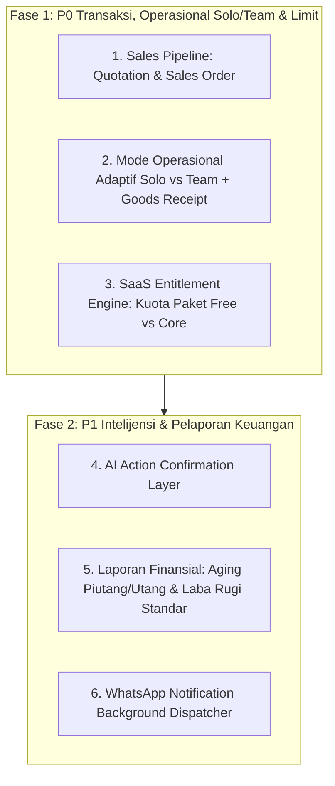

# LAPORAN AUDIT SISTEM & GAP ANALYSIS
## COOCA CORE (COOCA.ID) — BUSINESS OPERATING SYSTEM
**Versi Dokumen:** 2.1  
**Tanggal Audit:** 29 Agustus 2026  
**Referensi Dokumen:** [COOCA_CORE_PRD.md](file:///c:/laragon/www/calculator-hpp/docs/COOCA_CORE_PRD.md) & [COOCA_CORE_FSD.md](file:///c:/laragon/www/calculator-hpp/docs/COOCA_CORE_FSD.md)  
**Status Pengujian Eksisting:** 162 Passed (580 Assertions) — 100% Success  
**Fokus Utama UMKM:** **Dual Operating Modes (Solo Owner vs. Team Delegasi)**, **Kemudahan Penggunaan (UX)**, dan **Otomasi Penuh Tanpa Beban Administrasi**  

---

## 1. Ringkasan Eksekutif Hasil Audit

Audit komparatif menyeluruh telah dilakukan terhadap seluruh codebase aplikasi `calculator-hpp` (yang kini telah bertransformasi menjadi **Cooca UMKM — cooca.id**) dengan membandingkannya terhadap spesifikasi pada **Product Requirements Document (PRD)** dan **Functional Specification Document (FSD)** versi 2.1.

### Skor Kesiapan Sistem Global
| Area / Domain Sistem | Tingkat Kesiapan (Compliance) | Status |
| :--- | :---: | :---: |
| **1. Master Data & Costing / HPP Engine** | **98%** | 🟢 Siap Produksi |
| **2. Sales Pipeline & Kasir POS** | **78%** | 🟡 Parsial (Quotation & SO belum ada) |
| **3. Pengadaan & Pemasok (Purchasing)** | **80%** | 🟡 Parsial (UI Goods Receipt & Instant Stock-In) |
| **4. Inventori & Multi-Gudang** | **95%** | 🟢 Siap Produksi |
| **5. Keuangan & Akuntansi (Zero-Touch Finance)** | **88%** | 🟢 Sangat Baik (Perlu Laporan Aging & L/R) |
| **6. CRM & Loyalitas Pelanggan** | **90%** | 🟢 Siap Produksi |
| **7. Intelijensi Buatan (AI Platform)** | **80%** | 🟢 Sangat Baik (Perlu Action Confirmation) |
| **8. SaaS Entitlement & Quota Engine** | **30%** | 🔴 Kritis (Belum ada Middleware Limit) |
| **9. WhatsApp Gateway & Notifikasi** | **35%** | 🔴 Perlu Background Dispatcher |
| **10. Platform Admin & Keamanan Multi-Tenant** | **85%** | 🟢 Sangat Baik |
| **TOTAL SKOR KESIAPAN KESELURUHAN** | **76.0%** | 🟢 **Sangat Kuat Menuju Peluncuran** |

---

## 2. Matriks Gap Analysis Detail per Modul (Fokus UMKM: Solo vs. Team)

| No | Modul / Fitur (FSD & PRD) | Komponen Eksisting | Komponen Gap / Kebutuhan Tambahan UMKM | Kesiapan | Prioritas |
| :-: | :--- | :--- | :--- | :---: | :---: |
| **1** | **Master Data & HPP** | • Konversi takaran multi-satuan • Bahan baku, rendemen, susut • Resep / BOM dinamis • Tenaga kerja & mesin • Overhead dapur/pabrik • 20 Template Industri siap pakai | • Klasifikasi produk `composite` (resep dapur) & `service` (jasa) | **98%** | P2 |
| **2** | **Sales Pipeline & POS** | • Faktur Penjualan (Invoice) • Multi-tender & kembalian tunai • POS Layar sentuh & barcode • Shift kasir & rekonsiliasi laci • Struk termal 58/80mm • Void & Refund | • Model & Tabel `quotations` & `sales_orders` • **Solo Mode UX**: Bypass keharusan tutup shift harian & bypass PIN supervisor jika kasir adalah Owner | **78%** | **P0 (Kritis)** |
| **3** | **Purchasing & Pemasok** | • Database Supplier • Purchase Order (PO) • Tabel penerimaan `goods_receipts` | • UI Goods Receipt dari PO (Team Mode) • **Solo Mode UX**: Pintasan 1-klik *"Beli Langsung ke Stok"* (*Instant Stock-In*) tanpa alur PO formal | **80%** | **P0 (Kritis)** |
| **4** | **Inventori & Gudang** | • Multi-lokasi/cabang • Saldo stok real-time • Kartu stok (buku besar) • Transfer antar cabang • Stock Opname fisik barcode • Penyesuaian stok | • Modal cepat pemilihan nomor Batch / Expiry di keranjang kasir | **95%** | P1 |
| **5** | **Keuangan & Akuntansi** | • Pencatatan Beban operasional • Bagan Akun (COA) UMKM • Auto-Journaling entri ganda • Settlement gateway | • Laporan Aging Piutang (AR) & Utang (AP) • Halaman Laporan Laba Rugi (*Profit & Loss*) terstruktur | **88%** | P1 |
| **6** | **CRM & Member** | • Profil pelanggan & tiering • Poin loyalitas belanja • Voucher diskon promo • Potong poin belanja di POS | • Pemicu otomatis voucher ulang tahun (*Birthday promo*) | **90%** | P2 |
| **7** | **AI Platform** | • Proyeksi penjualan 14 hari • Prediksi stok habis (*runout*) • Deteksi fraud kasir & void • Matriks Menu Engineering BCG • Dynamic Pricing kenaikan HPP • Rekomendasi bundling promo • Asisten "Tanya AI" | • **AI Action Layer**: Pembuatan draf transaksi otomatis (Invoice/PO) dengan pratinjau & konfirmasi tombol pengguna (*Human-in-the-Loop*) | **80%** | **P0 (Kritis)** |
| **8** | **SaaS Entitlement** | • Multi-Tenant Business • User Membership & Role • RBAC Permissions | • Middleware `CheckResourceEntitlement` • Enforcing limit Free (50 produk, 20 resep, 10 inv/bln) • Halaman *Usage & Limits* • Mode *Over-Limit Read-Only* (*No Data Punishment*) | **30%** | **P0 (Kritis)** |
| **9** | **WhatsApp Integration**| • Struk digital kirim WA manual via link `api.whatsapp.com` | • Antrian background worker untuk kirim PDF Invoice & pengingat jatuh tempo otomatis via WA Gateway | **35%** | P1 |
| **10**| **Platform Admin** | • Admin auth & guard • Admin User management • System Settings | • Jembatan sinkronisasi billing/lisensi terpadu | **85%** | P1 |

---

## 3. Rincian Analisis Kebutuhan UMKM & User Experience

### 3.1 Dual Operating Modes: Kebutuhan Solo Owner vs. Team Karyawan
- **Temuan:**
  Pada implementasi saat ini, terminal kasir POS dan approval pembatalan transaksi dirancang dengan asumsi standar operasional berjenjang (karyawan memerlukan persetujuan supervisor). 
- **Kesenjangan (Gap) untuk Solo Owner:**
  Jika pengguna adalah pengusaha tunggal (*Solo-preneur* yang memasak dan melayani kasir sendiri), meminta PIN supervisor saat membatalkan item di kasir justru menjadi hambatan (*friction*). 
- **Solusi yang Ditetapkan di PRD/FSD 2.1:**
  Sistem menambahkan `OperatingModeResolver`:
  - **Solo Mode ($N_{\text{user}} = 1$):** Pembatalan (*void*), pengembalian (*refund*), dan diskon langsung disetujui tanpa dialog PIN. Disediakan tombol cepat *"Beli Langsung ke Stok"* untuk mencatat belanja pasar tanpa birokrasi PO.
  - **Team Mode ($N_{\text{user}} > 1$):** Mengaktifkan penguncian data rahasia HPP/margin modal dari kasir, mewajibkan hitung fisik kas laci saat tutup shift, dan mewajibkan PIN otorisasi supervisor.

### 3.2 Prinsip UX: Simple, Mudah, & Otomasi Penuh
- **Zero-Touch Financial Automation:**
  Pelaku UMKM tidak perlu mengerti istilah akuntansi (Debit, Kredit, COA). Setiap kali kasir checkout, faktur dibuat, atau belanja dicatat, sistem secara otonom menyusun buku besar entri-ganda.
- **Onboarding 3 Menit:**
  Pengguna baru memilih jenis industri $\rightarrow$ 20 template siap pakai langsung mengonfigurasi satuan resep, contoh bahan baku, dan rasio biaya standar $\rightarrow$ pengguna dapat langsung melayani transaksi pertama dalam waktu kurang dari 3 menit.

---

## 4. Roadmap Prioritas Eksekusi

### Rekomendasi Eksekusi:
Langkah berikutnya adalah mengeksekusi **Milestone 1 (P0)**:
1. **Membangun modul Quotation & Sales Order (Sales Pipeline)**.
2. **Menyediakan alur adaptif Solo vs Team**: Opsi *"Beli Langsung ke Stok"* dan *bypass PIN* untuk Solo Owner, serta antarmuka *Goods Receipt* dari PO untuk Team.
3. **Menerapkan SaaS Entitlement Engine** (Free Rp0 vs Core Rp129rb).
