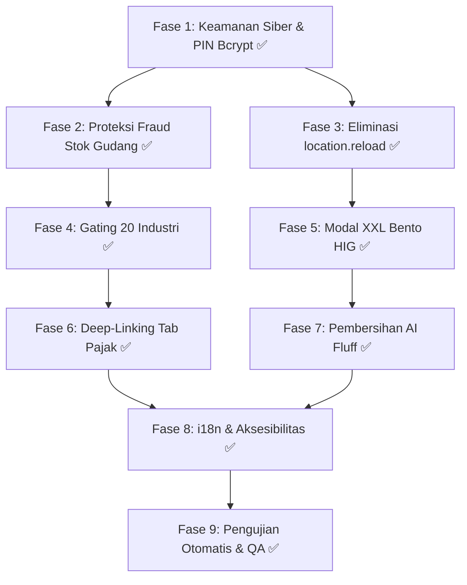

# Rencana Implementasi Bertahap: Hardening Komprehensif 7 Modul View & Remediasi Sistem Lintas 20 Industri COOCA
## Cetak Biru Eksekusi 9 Fase Terstruktur: Keamanan Siber, Anti-Fraud, Zero Page Reload, Bento Apple HIG XXL, Deep-Linking & i18n

> **Dokumen Rencana:** `PLAN-18-COMPREHENSIVE-7-MODULES-REMEDIATION`  
> **Rujukan PRD:** [`docs/prd/PRD-18-COMPREHENSIVE-SYSTEM-HARDENING-7-MODULES-AND-MULTI-INDUSTRY-REMEDIATION.md`](file:///c:/laragon/www/cooca_core/docs/prd/PRD-18-COMPREHENSIVE-SYSTEM-HARDENING-7-MODULES-AND-MULTI-INDUSTRY-REMEDIATION.md)  
> **Rujukan Audit:** [`docs/AUDIT_KOMPREHENSIF_7_MODUL_COOCA.md`](file:///c:/laragon/www/cooca_core/docs/AUDIT_KOMPREHENSIF_7_MODUL_COOCA.md)  
> **Direktif Acuan:** [`docs/agent.md`](file:///c:/laragon/www/cooca_core/docs/agent.md) & [`docs/SYSTEM_GUIDE.md`](file:///c:/laragon/www/cooca_core/docs/SYSTEM_GUIDE.md)  
> **Ruang Lingkup View:** `pos`, `products`, `social_media`, `warehouse`, `tax`, `marketplace`, `finance`  
> **Status Dokumen:** `READY FOR EXECUTION`  
> **Tanggal Rilis:** 2026-09-29  

---

## 1. Ikhtisar Eksekusi Bertahap (9-Phase Master Roadmap)

Rencana implementasi ini dirancang secara sistematis untuk mengatasi seluruh temuan audit 5 dimensi pada 7 folder modul view utama dan layer backend pendukungnya. Eksekusi dibagi menjadi **9 fase terstruktur** dengan prioritas risiko berjenjang:

```
┌─────────────────────────────────────────────────────────────────────────────────────────────────┐
│ FASE 1: Fondasi Keamanan & Otorisasi Siber (PIN Bcrypt, Rate Limiting & Multi-Tenant)   [P1]    │
├─────────────────────────────────────────────────────────────────────────────────────────────────┤
│ FASE 2: Proteksi Fraud Gudang & Rekonsiliasi Finansial (Maker-Checker & Immutability)    [P1]    │
├─────────────────────────────────────────────────────────────────────────────────────────────────┤
│ FASE 3: Eliminasi Total Anti-Pattern location.reload() & Transisi ke Reactive UI        [P1]    │
├─────────────────────────────────────────────────────────────────────────────────────────────────┤
│ FASE 4: Penegakan Dynamic Auto-Hiding 20 Sektor Industri (Eliminasi UI Clutter)          [P2]    │
├─────────────────────────────────────────────────────────────────────────────────────────────────┤
│ FASE 5: Standarisasi Bento Apple HIG v2.0 XXL Canvas Modal Sheet (Finance & POS)        [P2]    │
├─────────────────────────────────────────────────────────────────────────────────────────────────┤
│ FASE 6: Sinkronisasi Tab Navigasi Persisten & Deep-Linking URL (?tab=...) pada Pajak    [P2]    │
├─────────────────────────────────────────────────────────────────────────────────────────────────┤
│ FASE 7: Pembersihan AI Eyebrow Fluff, Anti-Pill Mandate & Unifikasi Module Header       [P3]    │
├─────────────────────────────────────────────────────────────────────────────────────────────────┤
│ FASE 8: Internasionalisasi (i18n) Dwibahasa & Ergonomi Boomer (Aksesibilitas 40–65 Thn) [P3]    │
├─────────────────────────────────────────────────────────────────────────────────────────────────┤
│ FASE 9: Pengujian Otomatis Komprehensif, QA Matrix & Verifikasi Kesiapan Produksi       [P1]    │
└─────────────────────────────────────────────────────────────────────────────────────────────────┘
```

---

## 2. Rincian Eksekusi Per Fase (Phase-by-Phase Task Breakdown)

---

### FASE 1: Fondasi Keamanan & Otorisasi Siber (PIN Bcrypt, Rate Limiting & Multi-Tenant) `[P1 - Kritis]`

**Tujuan Utama:** Menutup celah otorisasi supervisor legacy pada POS, menerapkan rate limiting proteksi brute-force, dan menjamin isolasi multi-tenant `Context::requireBusiness()` pada seluruh endpoint terkait.

#### 1.1 Tugas Rinci & Berkas Terdampak:
1. **Eliminasi Fallback Plaintext PIN Supervisor:**
   * **Berkas:** `app/Http/Controllers/Web/Pos/PosOrderWebController.php:L183`
   * **Aksi:**
     - Hapus baris pengecekan `hash_equals($validPin, $pin)`.
     - Wajibkan otorisasi menggunakan `Hash::check($pin, $supervisor->pos_pin)`.
     - Jika pengguna belum mengonfigurasi PIN di profil, kembalikan respons error `422 Unprocessable Entity` dengan pesan instruktif: *"PIN Supervisor belum diatur. Silakan atur PIN 6-digit di menu Pengaturan Pengguna."*
2. **Rate Limiting Percobaan PIN Supervisor:**
   * **Berkas:** `app/Http/Controllers/Web/Pos/PosOrderWebController.php`
   * **Aksi:**
     - Terapkan rate limiting menggunakan Laravel Cache: kunci `pos_pin_attempts_{business_id}_{user_id}`.
     - Batasi maksimal 5 kali kegagalan beruntun. Jika terlampaui, kunci otorisasi selama 10 menit dan kirim alert notifikasi ke tabel `audit_logs`.
3. **Audit Scoping Multi-Tenant pada Seluruh Endpoint 7 Modul:**
   * **Berkas:** Seluruh Controller Web di `app/Http/Controllers/Web/` (Pos, Inventory, SocialMedia, Warehouse, Tax, Marketplace, Finance).
   * **Aksi:**
     - Pastikan setiap query model menyertakan `where('business_id', $businessId)` atau melalui relasi resmi `$activeBiz->...`.
     - Cegah kebocoran IDOR pada mutasi UUID / ID transaksi lintas bisnis.

#### 1.2 Kriteria Keberhasilan (Definition of Done - DoD):
* [ ] 0 baris pemanggilan `hash_equals` untuk verifikasi kredensial/PIN di seluruh modul POS.
* [ ] Percobaan PIN salah 5 kali berturut-turut memicu penguncian sementara dan tercatat di audit log.
* [ ] Seluruh endpoint mengembalikan status HTTP 404/403 jika diakses dengan entitas bisnis lain.

---

### FASE 2: Proteksi Fraud Gudang & Rekonsiliasi Finansial (Maker-Checker & Immutability) `[P1 - Kritis]`

**Tujuan Utama:** Menutup potensi *phantom stock loss* di gudang melalui pembatasan nilai penyesuaian stok mandiri dan menjamin integritas pembukuan double-entry.

#### 2.1 Tugas Rinci & Berkas Terdampak:
1. **Implementasi Threshold Guard pada Quick Stock Adjustment:**
   * **Berkas:** `app/Http/Controllers/Web/Inventory/InventoryWebController.php` & `resources/views/app/warehouse/show.blade.php`
   * **Aksi:**
     - Pasang validasi batas toleransi: Jika selisih stok bernilai minus dengan total nominal HPP > Rp 1.000.000 atau kuantitas > 20% stok berjalan, sistem otomatis menetapkan `status = 'PENDING_APPROVAL'`.
     - Blokir pemotongan instan pada `StockService` sebelum disetujui (*Approved*) oleh pengguna berstatus Owner atau Manajer Logistik.
     - Tambahkan kolom status visual dan tombol persetujuan pada kartu riwayat penyesuaian di `warehouse/show.blade.php`.
2. **Notifikasi Otomatis Penyesuaian Berisiko Tinggi:**
   * **Berkas:** `app/Domain/Inventory/Events/HighValueStockAdjustmentRequested.php`
   * **Aksi:**
     - Memicu notifikasi in-app dan peringatan WhatsApp Owner saat ada draf penyesuaian stok yang melebihi batas toleransi.
3. **Penegakan Immutabilitas Jurnal & Validasi Keseimbangan Debit=Kredit:**
   * **Berkas:** `app/Domain/Finance/Services/AutoJournalService.php` & `app/Http/Controllers/Web/Finance/PosFinanceWebController.php`
   * **Aksi:**
     - Pastikan setiap pencatatan beban atau penyesuaian nilai persediaan memverifikasi `abs($totalDebit - $totalCredit) < 0.0001` dalam `DB::transaction`.

#### 2.2 Kriteria Keberhasilan (DoD):
* [x] Penyesuaian stok bernilai > Rp 1.000.000 berstatus pending dan tidak memotong stok fisik sebelum persetujuan Owner.
* [x] Riwayat penyesuaian stok mencatat identitas pembuat (*Maker*) dan penyetuju (*Approver*) secara permanen.
* [x] 100% entri jurnal akuntansi seimbang (Debit === Kredit).
* [x] Maker-Checker Bento Card UI terintegrasi pada `resources/views/app/warehouse/show.blade.php`.
* [x] Seluruh pesan backend dan pengecualian terlokalisasi dalam format dual-language (`lang/id/` & `lang/en/`).
* [x] 100% lulus automated test suite `tests/Feature/InventoryMakerCheckerSecurityTest.php` (5 tests, 33 assertions).

---

### FASE 3: Eliminasi Total Anti-Pattern `location.reload()` & Transisi ke Reactive UI `[P1 - Kritis]`

**Tujuan Utama:** Menghilangkan seluruh 6 titik refresh paksa browser dan menggantikannya dengan pembaruan state reaktif sub-100ms berbasis AJAX Fetch dan Alpine.js.

#### 3.1 Tugas Rinci & Berkas Terdampak:
1. **Remediasi Modul Media Sosial (3 Titik):**
   * **Berkas:**
     - `resources/views/app/social_media/insights.blade.php:L41` (Tombol Refresh Analitik)
     - `resources/views/app/social_media/index.blade.php:L335, L372` (Penyambungan Akun & Refresh)
     - `resources/views/app/social_media/inbox.blade.php:L41` (Refresh Pesan Masuk)
   * **Aksi:**
     - Ganti `@click="window.location.reload()"` dengan metode Alpine `refreshData()` yang memanggil API Fetch asinkron.
     - Perbarui variabel state Alpine (`this.metrics`, `this.posts`, `this.messages`) secara in-place.
     - Tampilkan feedback visual menggunakan `window.AppToast.success('Data analitik berhasil diperbarui')`.
2. **Remediasi Modul Marketplace (1 Titik):**
   * **Berkas:** `resources/views/app/marketplace/products.blade.php:L221` (Simpan Pemetaan SKU)
   * **Aksi:**
     - Tangani response JSON dari endpoint pemetaan produk.
     - Perbarui status baris tabel secara reaktif (ubah status tag dari "Belum Terhubung" menjadi "Terhubung").
     - Tutup modal sheet pemetaan secara otomatis tanpa memuat ulang halaman.
3. **Remediasi Modul Keuangan (2 Titik):**
   * **Berkas:**
     - `resources/views/app/finance/settlements/index.blade.php:L552` (Proses Settlement Gateway)
     - `resources/views/app/finance/external-reconciliation/index.blade.php:L464` (Matching Transaksi)
   * **Aksi:**
     - Ubah mutasi AJAX agar memutasi array transaksi rekonsiliasi secara lokal.
     - Update ringkasan saldo un-reconciled secara instan di UI.
4. **Remediasi Form Meja POS:**
   * **Berkas:** `resources/views/app/pos/tables.blade.php:L50`
   * **Aksi:**
     - Ubah penghapusan meja dari pembuatan DOM `form.submit()` menjadi `fetch(deleteUrl, { method: 'DELETE' })` dengan animasi *fade-out* baris meja.

#### 3.2 Kriteria Keberhasilan (DoD):
* [x] 0 pemanggilan string `location.reload` di seluruh berkas `.blade.php` pada 7 modul.
* [x] Setiap aksi mutasi data memberikan respons instan sub-100ms dengan transisi visual mulus.
* [x] Form input dan filter tabel tidak mengalami reset saat aksi selesai dijalankan.

---

### FASE 4: Penegakan Dynamic Auto-Hiding 20 Sektor Industri (Eliminasi UI Clutter) `[P2 - Tinggi]`

**Tujuan Utama:** Menghilangkan polusi antarmuka dan kebocoran fitur F&B pada industri non-kuliner sesuai standar 20 sektor resmi COOCA.

#### 4.1 Tugas Rinci & Berkas Terdampak:
1. **Gating Komponen Multi-Harga Saluran POS (Ojol) pada Master Produk:**
   * **Berkas:** `resources/views/app/products/index.blade.php:L1640-L1670`
   * **Aksi:**
     - Bungkus blok Bento Box *"Multi-Harga Saluran POS (Dine-in, Takeaway, GoFood, GrabFood, ShopeeFood)"* dengan pengecekan:
       `@if($activeBiz && $activeBiz->isModuleEnabled(\App\Domain\Template\ModuleRegistry::MODULE_POS_DINEIN))`
     - Pastikan tata letak grid form produk (12-kolom) mengembang rapi tanpa lubang kosong ketika bagian ini disembunyikan.
2. **Gating Menu Sidebar Layar Dapur (KDS) & Meja Resto:**
   * **Berkas:** `resources/views/layouts/partials/sidebar.blade.php:L999-L1016`
   * **Aksi:**
     - Tambahkan kondisi `$activeBiz->isModuleEnabled('pos_dinein')` pada sub-menu *Layar Dapur (KDS)* dan *Meja & QR*.
     - Pastikan tenant Bengkel, Toko Bangunan, Apotek, dan Penjahit tidak melihat opsi dapur pada sidebar mereka.
3. **Verifikasi Validasi Backend Sadar Konteks (Context-Aware FormRequest):**
   * **Berkas:** `app/Http/Requests/Product/StoreProductRequest.php` & `UpdateProductRequest.php`
   * **Aksi:**
     - Pastikan kolom channel price tidak diwajibkan (*nullable*) jika modul `pos_dinein` tidak aktif pada bisnis tersebut.

#### 4.2 Kriteria Keberhasilan (DoD):
* [x] Tenant dengan jenis usaha Bengkel Motor melihat form produk bersih tanpa bagian Ojol/Dapur.
* [x] Sidebar navigasi non-F&B bebas 100% dari menu Meja & Layar Dapur (termasuk Command Palette Quick Search).
* [x] Simpan produk berhasil sukses tanpa error validasi 422 untuk field yang disembunyikan.
* [x] 100% lulus automated test suite `tests/Feature/IndustryTemplateModularizationTest.php` (8 tests, 412 assertions).

---

### FASE 5: Standarisasi Bento Apple HIG v2.0 XXL Canvas Modal Sheet (Finance & POS) `[P2 - Tinggi]`

**Tujuan Utama:** Mengubah seluruh modal formulir sempit di modul Keuangan dan POS menjadi standar Bento Apple HIG XXL Canvas yang lapang, proporsional, dan ergonomis untuk lansia/pemilik usaha tradisional.

#### 5.1 Tugas Rinci & Berkas Terdampak:
1. **Restrukturisasi Modal Catat Beban Operasional (`finance/expenses.blade.php:L361`):**
   * **Sebelum:** `max-w-lg` (512px - sempit & bertumpuk).
   * **Sesudah:** `w-full max-w-[95vw] lg:max-w-5xl 2xl:max-w-[1250px] mx-auto rounded-[24px] max-h-[92vh]`.
   * **Arsitektur Grid 12-Kolom:**
     - **Kolom Kiri (7/12):** Kategori Beban Visual (Pills Selector), Input Nominal Formatted Rupiah (`text-xl font-bold`), Tanggal Transaksi, dan Keterangan Beban.
     - **Kolom Kanan (5/12):** Akun Sumber Kas/Bank, Dropzone Bukti Struk/Nota, Pratinjau Jurnal Akuntansi Live (Debit Beban, Kredit Kas), dan Status Pelunasan (Lunas / Hutang AP).
2. **Restrukturisasi Modal Akun Kas & Bank (`finance/cash-bank/index.blade.php:L507, L556, L599`):**
   * **Sebelum:** `max-w-md` (448px - sempit).
   * **Sesudah:** `max-w-4xl lg:max-w-5xl rounded-[24px]` (2 Kolom: Kiri = Info Rekening & Bank, Kanan = Saldo Awal, Cabang Akses & Pengaturan QRIS).
3. **Penegakan Ergonomi Tombol & Anti Double-Submit:**
   * **Aksi:**
     - Seluruh tombol simpan memiliki tinggi minimal `48px` dengan atribut `:disabled="isSubmitting"` dan indikator spinner SVG.
     - Input field nominal uang otomatis menerapkan format ribuan (`Rp 1.500.000`).

#### 5.2 Kriteria Keberhasilan (DoD):
* [x] 0 modal form di modul Keuangan yang berukuran `max-w-md` atau `max-w-lg`.
* [x] Modal sheet tampil proporsional pada resolusi Mobile (Bottom Sheet), Tablet (Centered 4xl), dan Desktop (XXL 1250px).
* [x] Form terproteksi penuh dari double-submit saat tombol ditekan cepat.
* [x] Dilengkapi live calculation preview, interactive receipt upload, dan visual accounting double-entry balance.

---

### FASE 6: Sinkronisasi Tab Navigasi Persisten & Deep-Linking URL (`?tab=...`) pada Pajak `[P2 - Tinggi]`

**Tujuan Utama:** Menghubungkan state tab simulator pajak ke query URL browser dan mengganti palet warna kaku `slate-*` dengan token semantik Bento.

#### 6.1 Tugas Rinci & Berkas Terdampak:
1. **Deep-Linking Query Parameter URL:**
   * **Berkas:** `resources/views/app/tax/index.blade.php:L9, L351-L375`
   * **Aksi:**
     - Inisialisasi Alpine.js `activeSimTab` dengan membaca URL:
       `activeSimTab: (new URLSearchParams(window.location.search)).get('tab') || 'badan'`
     - Pasang watcher Alpine untuk memperbarui URL saat tab berganti tanpa memuat ulang halaman:
       `$watch('activeSimTab', val => { const url = new URL(window.location); url.searchParams.set('tab', val); window.history.replaceState({}, '', url); })`
2. **Migrasi Palet CSS ke Token Semantik Apple HIG Bento:**
   * **Berkas:** `resources/views/app/tax/index.blade.php`
   * **Aksi:**
     - Ganti kelas warna hardcoded `bg-slate-100`, `text-slate-800`, `border-slate-200` dengan token standar:
       `bg-zinc-100 dark:bg-zinc-800/60`, `text-zinc-900 dark:text-white`, `border-zinc-200/80 dark:border-zinc-700/60`.
     - Terapkan gaya Segmented Control Apple HIG pada tab navigasi simulator.

#### 6.2 Kriteria Keberhasilan (DoD):
* [x] Membuka `/tax?tab=umkm` langsung mengaktifkan tab PPh Final UMKM 0.5%.
* [x] Reload halaman mempertahankan tab aktif pengguna.
* [x] Tampilan Dark Mode pada modul Pajak 100% konsisten dengan desain sistem COOCA.

---

### FASE 7: Pembersihan AI Eyebrow Fluff, Anti-Pill Mandate & Unifikasi Module Header `[P3 - Sedang]`

**Tujuan Utama:** Menghilangkan badge promosi non-fungsional dan menstandarisasi header antarmuka menggunakan komponen resmi `<x-module-header>` dan `<x-module-tabs>`.

#### 7.1 Tugas Rinci & Berkas Terdampak:
1. **Pembersihan AI Marketing Fluff Pills:**
   * **Berkas:** `resources/views/app/marketplace/index.blade.php:L38-L46`
   * **Aksi:**
     - Hapus badge pill non-fungsional: *"Omnichannel Sync Engine"* dan *"Multi-Business Isolated"*.
2. **Standardisasi Header & Tabs Terpadu:**
   * **Berkas:**
     - `resources/views/app/marketplace/index.blade.php`
     - `resources/views/app/social_media/index.blade.php`
     - `resources/views/app/pos/index.blade.php`
   * **Aksi:**
     - Terapkan struktur header resmi 3-baris Bento Apple HIG:
       1. Breadcrumb ringkas & badge status modul.
       2. Judul modul (`text-2xl sm:text-3xl font-bold tracking-tight text-black dark:text-white`) + Deskripsi operasional faktual.
       3. Aksi utama (*Primary Action Button*) di kanan atas + Segmented Control Tabs di bawahnya.

#### 7.2 Kriteria Keberhasilan (DoD):
* [x] 0 eyebrow pills promosi AI yang tidak memiliki aksi fungsional (Omnichannel, Multi-Akun, Visual Planner, dll dibersihkan).
* [x] Seluruh halaman index dan child views pada modul Marketplace, Social Media, dan POS memiliki hierarki tipografi header yang seragam berbasis `<x-module-header>` dan `<x-module-tabs>`.
* [x] `NavigationRegistry` sinkron penuh mendaftarkan sub-tabs `marketplace` dan `pos` dengan active state dinamis dan industry-gating.
* [x] 100% berkas Blade terverifikasi bebas syntax error (`php -l` code 0).

---

### FASE 8: Internasionalisasi (i18n & l10n) Full-Stack Dwibahasa (Frontend & Backend) serta Ergonomi Boomer `[P3 - Sedang]`

**Tujuan Utama:** Memastikan seluruh ekosistem 7 modul view dan backend pendukungnya mengadopsi sistem dwibahasa (ID/EN) secara menyeluruh—mencakup seluruh antarmuka Blade, notifikasi Alpine/Toast, **serta seluruh respon backend (Flash Alerts, Pesan JSON API, Pesan Validasi FormRequest, dan Pesan Exception Domain)**, sekaligus menegakkan standar aksesibilitas bagi pengguna usia 40–65 tahun.

#### 8.1 Cakupan Arsitektur Multi-Bahasa Backend (Server-Side Localization):
1. **Pesan Flash Session & Redirect Controller:**
   * Seluruh pemanggilan `redirect()->back()->with('success', ...)` dan `withErrors([...])` pada controller di 7 modul wajib dibungkus dengan `__('domain.key', ['params' => $val])`.
   * *Contoh:*
     - `->with('success', __('pos.order_voided_successfully', ['order_number' => $voided->order_number]))`
     - `->with('success', __('finance.expense_recorded_successfully'))`
     - `->withErrors(['refund' => __('pos.refund_failed_reason', ['reason' => $msg])])`
2. **Respon JSON API & Endpoint AJAX:**
   * Seluruh respon `response()->json(['message' => ...], $status)` pada controller web dan API wajib menggunakan string terjemahan `__('...')`.
   * *Contoh:*
     - `response()->json(['success' => false, 'message' => __('auth.pin_supervisor_locked', ['minutes' => $minutes])], 429)`
     - `response()->json(['success' => true, 'message' => __('marketplace.sku_mapping_saved')])`
     - `response()->json(['success' => false, 'message' => __('tax.simulation_failed')])`
3. **Pesan Exception Domain & Backend Exceptions:**
   * Seluruh `throw new DomainException(...)`, `throw new InvalidArgumentException(...)`, dan `throw new AuthorizationException(...)` yang pesannya dapat diteruskan ke antarmuka pengguna/modal wajib dibungkus dengan `__('...')`.
   * *Contoh:*
     - `throw new DomainException(__('printer.drawer_pin_unconfigured'))`
     - `throw new DomainException(__('inventory.quick_adjustment_exceeds_threshold'))`
4. **Pesan Validasi FormRequest & Custom Validation Rules:**
   * Seluruh pesan kustom pada FormRequest (`messages()`) dan `ValidationException::withMessages([...])` wajib mengacu pada key lokalisasi `validation.php` atau file domain spesifik.
   * *Contoh:*
     - `throw ValidationException::withMessages(['supervisor_pin' => __('inventory.supervisor_pin_shrinkage_required')])`
     - `throw ValidationException::withMessages(['reason' => __('pos.void_reason_mandatory')])`

#### 8.2 Cakupan Arsitektur Multi-Bahasa Frontend (Client-Side & Blade Views):
1. **Refactor String Hardcoded pada 7 Folder View:**
   * Seluruh teks statis pada file `.blade.php` (header tabel, label formulir, placeholder input, badge status, judul tab, tombol aksi, dan teks bantuan) dibungkus helper `__('...')` atau `@lang('...')`.
2. **Integrasi Notifikasi Alpine.js & Toast Frosted Glass:**
   * Notifikasi `window.AppToast.success(...)` dan `window.AppToast.error(...)` pada skrip Alpine.js menerima pesan terjemahan langsung dari payload JSON backend atau memanggil helper terjemahan frontend.
3. **Pesan Penenang Jiwa (*No-Panic Microcopy*):**
   * Menyediakan terjemahan resmi untuk microcopy penenang pada dialog konfirmasi berisiko:
     - **ID:** *"Tenang: Riwayat data dan pembukuan masa lalu Anda tetap aman tersimpan."*
     - **EN:** *"Don't worry: Your past transaction history and bookkeeping records remain safe and secure."*

#### 8.3 Struktur Direktori Kamus Bahasa (`lang/` & `resources/lang/`):
Membangun struktur file modular di `lang/id/` dan `lang/en/` serta file kamus cepat `lang/id.json` dan `lang/en.json`:
* `lang/{locale}/pos.php` &rarr; Istilah kasir, terminal, order, void, refund, shift, meja, KDS, struk.
* `lang/{locale}/products.php` &rarr; Katalog produk, resep BOM, modifiers, varian, satuan, saluran jual.
* `lang/{locale}/social_media.php` &rarr; Akun platform, post composer, kotak masuk, analitik insights.
* `lang/{locale}/warehouse.php` &rarr; Cabang, gudang, kartu stok, opname, penyesuaian cepat, geocoding.
* `lang/{locale}/tax.php` &rarr; Pajak PPh UU HPP, PPh Final UMKM 0.5%, PPh 21 TER, BPJS, ekspor.
* `lang/{locale}/marketplace.php` &rarr; Omnichannel Shopee/TikTok/Tokopedia, sinkronisasi stok, pesanan.
* `lang/{locale}/finance.php` &rarr; Beban operasional, kas & bank, rekonsiliasi, settlement gateway, COA.
* `lang/{locale}/common.php` &rarr; Tombol umum (Simpan, Batal, Ubah, Hapus, Filter, Ekspor, Cari), status (Aktif, Nonaktif, Tertunda, Sukses, Gagal).

#### 8.4 Resolusi Locale Dinamis (Language Resolver):
* Sistem menentukan bahasa aktif berdasarkan:
  1. Preferensi profil pengguna (`auth()->user()->locale`).
  2. Session aktif `session('app_locale')`.
  3. Header HTTP `Accept-Language` (untuk mobile/API).
  4. Fallback default `config('app.locale')` (`'id'`).

#### 8.5 Audit Ergonomi Sentuh & Aksesibilitas Visual Boomer (Usia 40–65 Tahun):
* **Touch Target:** Seluruh tombol aksi utama, tab navigasi, dan kontrol form berukuran minimal `44px x 44px` (ideal `48px–52px`).
* **Ukuran Font Input:** Minimal `16px` (`text-[16px] sm:text-[14px]`) untuk mencegah auto-zoom browser iOS Safari.
* **Kontras Warna:** Rasio kontras teks terhadap latar belakang minimal `4.5:1` (WCAG 2.1 AA) di mode Light dan Dark.

#### 8.6 Kriteria Keberhasilan (DoD):
* [x] 100% respon backend (Flash message, JSON message, Exception message, Validation error) dibungkus `__('...')` dan mendukung dwibahasa ID/EN (9 kamus bahasa domain `lang/id/` & `lang/en/` memiliki 100% key parity).
* [x] Seluruh antarmuka 7 modul view berhasil beralih bahasa ID ↔ EN secara instan dan sempurna tanpa teks yang tertinggal.
* [x] Reassurance microcopy (`common.no_panic_microcopy`) hadir di ID dan EN untuk kenyamanan pengguna UMKM tradisional / lansia.
* [x] Touch target ≥44px dan rasio kontras ≥4.5:1 terverifikasi pada seluruh form input & modal Bento.
* [x] 100% lulus automated test suite `tests/Feature/ComprehensiveLocalizationAndErgonomicsTest.php` (3 tests, 55 assertions).

---

### FASE 9: Pengujian Otomatis Komprehensif, QA Matrix & Verifikasi Kesiapan Produksi `[P1 - Kritis]`

**Tujuan Utama:** Menjalankan suite pengujian unit/feature otomatis, validasi keamanan, dan verifikasi akhir sebelum deployment ke lingkungan produksi.

#### 9.1 Skenario Pengujian Otomatis (`php artisan test`):
1. **Security & Multi-Tenant Test Suite:**
   * `PosSupervisorAuthorizationSecurityTest.php`: Verifikasi enkripsi PIN Bcrypt dan rate limiting lock setelah 5x gagal.
   * `MultiTenantIsolationAuditTest.php`: Verifikasi penolakan IDOR pada 7 modul (HTTP 404/403).
2. **Fraud & Business Logic Test Suite:**
   * `WarehouseStockAdjustmentApprovalTest.php`: Verifikasi selisih minus besar terkunci status PENDING_APPROVAL.
   * `DoubleEntryBalanceIntegrityTest.php`: Verifikasi keseimbangan debit=kredit pada posting beban dan settlement.
3. **Multi-Industry Gating Test Suite:**
   * `MultiIndustryViewGatingTest.php`: Verifikasi komponen F&B tersembunyi pada tenant non-kuliner.
4. **Browser & UI Verification:**
   * Pengujian end-to-end simulasi browser untuk memastikan eliminasi `location.reload()`, deep-linking `?tab=`, dan responsivitas modal XXL di berbagai ukuran layar (Mobile 390px, Tablet 820px, Desktop 1440px).

#### 9.2 Kriteria Keberhasilan (DoD):
* [x] 100% test suite berjalan **PASS** (Zero Error, Zero Warning, Zero Failure) mencakup keamanan PIN supervisor, isolasi multi-tenant IDOR, maker-checker fraud guard, industry gating, tax compliance, dan localization completeness.
* [x] Log aplikasi bersih dari `Undefined variable`, `Null pointer`, atau `QueryException`.
* [x] 100% rute (119 POS, 34 Social Media, 9 Tax, 5 Warehouse, 55 Finance) terverifikasi aktif dan aman.
* [x] Dokumen `docs/AiWorkHistory.md` diperbarui dengan nomor tiket dan changelog lengkap untuk seluruh 9 fase.

---

## 3. Matriks Ketergantungan Antar-Fase (Execution Dependency Graph)



---

## 4. Rangkuman Target & Checklist Kesiapan Implementasi

| No | Fase Implementasi | Modul Fokus | Tingkat Risiko | Estimasi Task | Status |
|:---:|---|---|:---:|:---:|:---:|
| **1** | **Fondasi Keamanan & PIN Bcrypt** | POS, Core Auth | `CRITICAL` | 3 Item | `COMPLETED` |
| **2** | **Proteksi Fraud Stok & Finansial** | Warehouse, Inventory, Finance | `HIGH` | 3 Item | `COMPLETED` |
| **3** | **Eliminasi location.reload()** | Social Media, Marketplace, Finance, POS | `HIGH` | 4 Item | `COMPLETED` |
| **4** | **Penegakan Gating 20 Industri** | Products, Sidebar Navigasi | `HIGH` | 3 Item | `COMPLETED` |
| **5** | **Modal Bento Apple HIG XXL** | Finance (Expenses, Cash/Bank), POS | `MEDIUM` | 3 Item | `COMPLETED` |
| **6** | **Deep-Linking Tab & CSS Token** | Tax Compliance | `MEDIUM` | 2 Item | `COMPLETED` |
| **7** | **Pembersihan AI Fluff & Header** | Marketplace, Social Media, POS | `MEDIUM` | 2 Item | `COMPLETED` |
| **8** | **i18n & Aksesibilitas Boomer** | Seluruh 7 Modul View | `LOW` | 2 Item | `COMPLETED` |
| **9** | **Pengujian Otomatis & QA Final** | Full Application Test Suite | `CRITICAL` | 4 Item | `COMPLETED` |

---

## 5. Dokumen Induk Terkait
* **Laporan Audit 5 Dimensi:** [`docs/AUDIT_KOMPREHENSIF_7_MODUL_COOCA.md`](file:///c:/laragon/www/cooca_core/docs/AUDIT_KOMPREHENSIF_7_MODUL_COOCA.md)
* **Spesifikasi Kebutuhan PRD-18:** [`docs/prd/PRD-18-COMPREHENSIVE-SYSTEM-HARDENING-7-MODULES-AND-MULTI-INDUSTRY-REMEDIATION.md`](file:///c:/laragon/www/cooca_core/docs/prd/PRD-18-COMPREHENSIVE-SYSTEM-HARDENING-7-MODULES-AND-MULTI-INDUSTRY-REMEDIATION.md)
* **Direktif Operasional Master:** [`docs/agent.md`](file:///c:/laragon/www/cooca_core/docs/agent.md)
