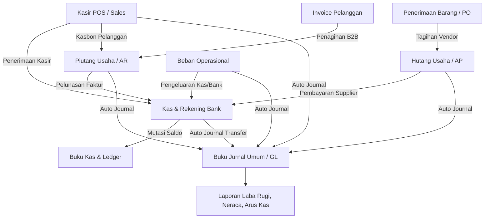

# Panduan Sistem Keuangan (Finance & Accounting) COOCA ERP

Dokumen ini merupakan panduan komprehensif mengenai arsitektur, cara kerja (workflow), aturan bisnis, data yang diolah, serta petunjuk operasional sistem keuangan dan akuntansi pada **COOCA Core ERP**.

---

## Daftar Isi
1. [Ringkasan Eksekutif & Prinsip Desain](#1-ringkasan-eksekutif--prinsip-desain)
2. [Alur Kerja Modul Keuangan (Finance Workflows)](#2-alur-kerja-modul-keuangan-finance-workflows)
   - [2.1 Kas & Rekening Bank (Cash & Bank)](#21-kas--rekening-bank-cash--bank)
   - [2.2 Pelacakan Multi-Kanal Pemasukan Kasir POS](#22-pelacakan-multi-kanal-pemasukan-kasir-pos)
   - [2.3 Hutang Usaha (Accounts Payable / AP)](#23-hutang-usaha-accounts-payable--ap)
   - [2.4 Piutang Usaha (Accounts Receivable / AR)](#24-piutang-usaha-accounts-receivable--ar)
   - [2.5 Beban Operasional (Expenses)](#25-beban-operasional-expenses)
   - [2.6 Buku Kas & Ledger Berjalan](#26-buku-kas--ledger-berjalan)
   - [2.7 Buku Jurnal Umum & Akuntansi Double-Entry](#27-buku-jurnal-umum--akuntansi-double-entry)
   - [2.8 Laporan Keuangan & Ekspor Data](#28-laporan-keuangan--ekspor-data)
3. [Katalog Data yang Diolah (Data Entities & Schema)](#3-katalog-data-yang-diolah-data-entities--schema)
4. [Integritas Data, Validasi, dan Aturan Bisnis](#4-integritas-data-validasi-dan-aturan-bisnis)
5. [Standar Prosedur Operasional (SOP Harian)](#5-standar-prosedur-operasional-sop-harian)

---

## 1. Ringkasan Eksekutif & Prinsip Desain

Modul Keuangan COOCA dirancang untuk menghubungkan seluruh aktivitas operasional bisnis—mulai dari transaksi kasir POS, pengadaan bahan/stok dari supplier, penagihan pelanggan B2B, hingga beban operasional harian—ke dalam satu ekosistem pembukuan yang **otomatis, akurat, dan berimbang**.

### Tiga Pilar Utama Keuangan COOCA:
1. **Real-Time Integration (Integrasi Langsung):**  
   Setiap transaksi di kasir (POS), gudang (*Goods Receipt*), atau invoice penjualan langsung memicu pembaruan saldo kas/bank dan entri jurnal akuntansi tanpa perlu rekapitulasi manual.
2. **Double-Entry Bookkeeping (Pembukuan Berpasangan):**  
   Setiap mutasi dana memiliki pencatatan Debit dan Kredit yang setara pada Bagan Akun (*Chart of Accounts / COA*). Sistem menjamin persamaan dasar:
   $$\text{Aset} = \text{Kewajiban} + \text{Ekuitas}$$
3. **Audit Trail & Idempotency:**  
   Setiap pergerakan uang memiliki referensi dokumen asli (`reference_type` dan `reference_id`), waktu pencatatan, saldo berjalan (*balance after*), serta ID pencatat transaksi untuk mencegah manipulasi maupun duplikasi data.

---

## 2. Alur Kerja Modul Keuangan (Finance Workflows)



---

### 2.1 Kas & Rekening Bank (Cash & Bank)
Menu ini merupakan pusat komando saldo likuid bisnis.

* **Pengelolaan Akun:**  
  Mendukung banyak akun kas dan bank (misal: *Kas Utama Kasir*, *Kas Kecil / Petty Cash*, *Rekening BCA Operasional*, *Rekening Mandiri Settlement*, dll).
* **Kas Masuk Manual (Manual Inflow):**  
  Digunakan untuk penerimaan dana di luar penjualan rutin (misal: setoran modal pemilik, penerimaan bunga bank, pengembalian kelebihan bayar).
* **Kas Keluar Manual (Manual Outflow):**  
  Digunakan untuk penarikan dana langsung non-operasional (misal: penarikan prive pemilik, pengembalian dana pinjaman).
* **Transfer Antar Rekening (Internal Transfer):**  
  Memindahkan saldo dari satu akun ke akun lain (misal: setoran tunai dari *Kas Utama* ke *Rekening Bank BCA*).
  - Sistem otomatis mencatat dua mutasi kas: **Transfer Keluar** pada rekening asal dan **Transfer Masuk** pada rekening tujuan.
  - Sistem otomatis membuat jurnal double-entry: **Debit** Akun Bank Tujuan, **Kredit** Akun Kas Asal.
  - Dilengkapi validasi mencegah transfer ke rekening yang sama (`from_account != to_account`).

---

### 2.2 Pelacakan Multi-Kanal Pemasukan Kasir POS
POS mendukung berbagai metode pembayaran, dan masing-masing dilacak jalurnya secara terpisah:

| Metode Pembayaran | Akun Tujuan Saldo | Penanganan Kas & Ledger | Perlakuan Jurnal Akuntansi |
| :--- | :--- | :--- | :--- |
| **Tunai (`cash`)** | `Kas Utama` (Cash Drawer) | Saldo masuk = `Nominal Diterima - Uang Kembalian` (*Net Cash*). Laci kasir sinkron 100% dengan fisik uang. | **Debit**: Kas Utama<br>**Kredit**: Pendapatan Penjualan |
| **QRIS (`qris`)** | Rekening Bank Operasional / E-Wallet | Masuk sebesar nominal bersih tagihan. | **Debit**: Bank / Penampung QRIS<br>**Kredit**: Pendapatan Penjualan |
| **Transfer Bank (`transfer`)** | Rekening Bank Terpilih | Masuk sebesar nominal transfer. | **Debit**: Rekening Bank Terkait<br>**Kredit**: Pendapatan Penjualan |
| **Mesin EDC Debit (`edc_debit`)** | Rekening Bank EDC | Masuk sebesar nominal gesek kartu debit. | **Debit**: Rekening Bank EDC<br>**Kredit**: Pendapatan Penjualan |
| **Mesin EDC Kredit (`edc_credit`)** | Rekening Bank Settlement EDC | Masuk sebesar nominal tagihan kartu kredit. | **Debit**: Rekening Settlement EDC<br>**Kredit**: Pendapatan Penjualan |
| **Kasbon / Store Credit (`customer_credit`)** | Akun Piutang Usaha (*AR*) | Tidak menambah kas likuid saat transaksi. Mengurangi plafon kredit pelanggan. | **Debit**: Piutang Usaha Pelanggan<br>**Kredit**: Pendapatan Penjualan |
| **Poin Loyalitas (`loyalty_points`)** | Non-Kas (Diskon / Reward) | Tidak menambah kas. Mengurangi poin member. | **Debit**: Beban Promosi / Poin<br>**Kredit**: Pendapatan Penjualan |

#### Dukungan Split Payment (Pembayaran Kombinasi):
Jika pelanggan membayar tagihan Rp 100.000 dengan **Rp 50.000 Tunai** dan **Rp 50.000 QRIS**:
1. Sistem mencatat 2 record mutasi kas terpisah menggunakan ID pembayaran masing-masing sebagai `reference_id`.
2. Kas Utama bertambah Rp 50.000, Rekening Bank bertambah Rp 50.000.
3. Jurnal umum memecah debit sesuai masing-masing akun secara atomik.

#### Dashboard Analisis Kanal Pembayaran:
Pada halaman Kas & Bank tersedia widget eksekutif berbasis Apple HIG v2.0:
- Selector periode cepat: `Hari Ini`, `Bulan Ini`, dan `Semua Waktu`.
- Kartu KPI masing-masing kanal lengkap dengan frekuensi transaksi struk dan persentase kontribusi omset.
- Bar visual distribusi pembayaran.
- Tautan langsung dari kartu metode ke Buku Kas terfilter.

---

### 2.3 Hutang Usaha (Accounts Payable / AP)
Mengelola seluruh kewajiban pembayaran bisnis kepada vendor dan supplier barang dagang atau bahan baku.

* **Terbentuk Otomatis:** Saat bagian gudang/pengadaan menerima kiriman barang melalui *Goods Receipt* (`goods_receipts`), tagihan hutang supplier langsung terbentuk.
* **Analisis Umur Hutang (AP Aging):**
  - **Lancar (Belum Jatuh Tempo):** Kewajiban yang tanggal jatuh temponya masih di masa depan.
  - **1–30 Hari:** Tagihan yang telah melewati jatuh tempo antara 1 hingga 30 hari.
  - **> 30 Hari:** Tagihan kritis yang menunggak lebih dari 30 hari.
* **Pencatatan Pembayaran Tagihan:**
  - Pengguna memilih tagihan supplier yang akan dibayar.
  - Memilih rekening sumber dana (misal: Rekening Bank BCA).
  - Sistem mencatat mutasi kas keluar dan secara otomatis membentuk jurnal:
    - **Debit:** Hutang Usaha (*Accounts Payable*)
    - **Kredit:** Rekening Bank / Kas Terpilih

---

### 2.4 Piutang Usaha (Accounts Receivable / AR)
Mengelola hak penerimaan pembayaran atas penjualan tempo B2B maupun transaksi kasbon kasir POS.

* **Terbentuk Dari:**
  - Penerbitan Faktur Penjualan B2B (`invoices`).
  - Transaksi kasir dengan metode pembayaran *Customer Store Credit* (Kasbon).
* **Analisis Umur Piutang (AR Aging):**
  - Memantau faktur lancar, lewat jatuh tempo 1–30 hari, dan lebih dari 30 hari untuk meminimalkan risiko kredit macet (*bad debt*).
* **Penerimaan Pembayaran Faktur:**
  - Saat pelanggan membayar, kasir/finance mencatat pembayaran dengan memilih akun kas/bank penampung dana.
  - Menghasilkan jurnal:
    - **Debit:** Kas / Rekening Bank Penampung
    - **Kredit:** Piutang Usaha (*Accounts Receivable*)

---

### 2.5 Beban Operasional (Expenses)
Mencatat seluruh pengeluaran operasional di luar pembelian stok dagangan (misal: gaji karyawan, biaya listrik, sewa tempat, perlengkapan toko, internet, dan transportasi).

* **Alur Pencatatan:**
  1. Pengguna memasukkan tanggal, nama pengeluaran, kategori, nominal, dan bukti struk/nota.
  2. Pengguna memilih **Bagan Akun Beban (COA Expense)** yang sesuai.
  3. Pengguna memilih **Rekening Kas/Bank Pembayar** (dari mana uang dikeluarkan).
* **Proteksi Transaksi Atomik:**
  - Dibungkus dalam mekanisme `DB::transaction`. Jika saldo akun kas pembayar tidak mencukupi atau terjadi kendala database, seluruh aksi (data beban, mutasi kas keluar, dan entri jurnal) dibatalkan bersamaan (*rollback*), sehingga data tidak mengalami distorsi.
* **Jurnal Beban Otomatis:**
  - **Debit:** Akun Beban Terpilih (misal: *Beban Listrik & Air*)
  - **Kredit:** Rekening Kas/Bank Terpilih

---

### 2.6 Buku Kas & Ledger Berjalan
Buku catatan kronologis mutasi debit/kredit saldo kas dan bank untuk tujuan rekonsiliasi dan audit.

* **Informasi Setiap Baris:** Tanggal, Akun Kas/Bank, Arah Arus (*Masuk*, *Keluar*, *Transfer Masuk*, *Transfer Keluar*), Keterangan / Referensi, Nominal Transaksi, dan Saldo Akhir Berjalan (*Balance After*).
* **Filter Multifungsi:**
  - Rekening Tertentu.
  - Jenis Arus (*Inflow*, *Outflow*, *Transfer*).
  - Metode Pembayaran POS (*Tunai*, *QRIS*, *Transfer Bank*, *EDC*).
  - Rentang Tanggal Transaksi.
  - Pencarian Teks Keterangan.

---

### 2.7 Buku Jurnal Umum & Akuntansi Double-Entry
Jantung akuntansi sistem yang mencatat semua transaksi dalam format debit dan kredit sesuai standar akuntansi keuangan (SAK).

* **Penjurnalan Otomatis (`AutoJournalService`):**
  Sistem secara otomatis membuat jurnal untuk transaksi:
  1. Penjualan POS (mencatat pendapatan, kas/bank/piutang, PPN/service, serta HPP dan pemotongan nilai persediaan).
  2. Beban Operasional.
  3. Penerbitan Faktur Penjualan B2B.
  4. Penerimaan Pembayaran Faktur Pelanggan.
  5. Penerimaan Barang dari Supplier (*Goods Receipt*).
  6. Pembayaran Hutang ke Supplier.
  7. Retur Penjualan & Refund Kasir.
  8. Retur Pembelian ke Supplier.
  9. Transfer Mutasi Antar Rekening Kas/Bank.
* **Audit Keseimbangan (Balance Integrity Check):**
  Di bagian atas antarmuka jurnal terdapat indikator status integritas:
  - **Seimbang (Valid ✓):** Total Debit = Total Kredit di seluruh entri jurnal.
  - **Selisih Pembukuan (⚠):** Menandakan adanya ketidakseimbangan yang perlu diinvestigasi.

---

### 2.8 Laporan Keuangan & Ekspor Data
Sistem menyediakan laporan analisis komprehensif yang dapat diekspor dalam format CSV / Excel:
1. **Laporan Laba Rugi (Income Statement):**  
   Menghitung Penjualan Bersih dikurangi Harga Pokok Penjualan (HPP) untuk menghasilkan Laba Kotor, lalu dikurangi seluruh Beban Operasional untuk menghasilkan Laba Bersih Periode Berjalan.
2. **Laporan Arus Kas (Cash Flow Statement):**  
   Menyajikan arus kas dari aktivitas operasi, investasi, dan pendanaan secara rinci.
3. **Laporan Umur Piutang & Hutang (Aging Reports):**  
   Daftar jatuh tempo pelanggan dan vendor untuk menjaga likuiditas perusahaan.
4. **Penilaian Persediaan & HPP (Stock Valuation & COGS):**  
   Menghitung nilai buku stok fisik dan pergerakan harga pokok barang yang terjual.

---

## 3. Katalog Data yang Diolah (Data Entities & Schema)

Berikut adalah entitas database utama yang diproses dalam siklus keuangan:

```
+-------------------------------------------------------------------------------+
|                             DATA ENTITIES MAP                                 |
+-------------------------------------------------------------------------------+
|  1. cash_accounts         -> Master rekening kas & bank                       |
|  2. cash_transactions     -> Buku mutasi kas (inflow, outflow, transfer)       |
|  3. pos_orders            -> Struk transaksi kasir POS                        |
|  4. pos_order_payments    -> Rincian kanal pembayaran POS (cash, qris, edc...) |
|  5. invoices              -> Faktur penjualan B2B (AR)                        |
|  6. invoice_payments      -> Pembayaran faktur penjualan                      |
|  7. goods_receipts        -> Penerimaan barang pengadaan (AP)                 |
|  8. supplier_payments     -> Pembayaran hutang ke vendor                      |
|  9. expenses              -> Pengeluaran beban operasional                    |
| 10. journal_entries       -> Header voucher jurnal umum                       |
| 11. journal_entry_lines   -> Baris debit dan kredit jurnal                    |
| 12. accounts              -> Bagan akun (Chart of Accounts / COA)             |
+-------------------------------------------------------------------------------+
```

### Rincian Atribut Kunci Tiap Entitas:

#### 1. `cash_accounts` (Tabel Akun Kas/Bank)
- `id`: Identitas unik UUID.
- `business_id`: ID bisnis pemilik akun.
- `name`: Nama akun (misal: *Kas Utama Kasir*, *Bank BCA*).
- `type`: Klasifikasi akun (`cash`, `bank`, `ewallet`, `other`).
- `account_number`: Nomor rekening bank (opsional).
- `bank_name`: Nama bank penerbit.
- `current_balance`: Saldo berjalan terkini (angka desimal akurat).
- `is_active`: Status aktif/non-aktif akun.

#### 2. `cash_transactions` (Buku Mutasi Kas & Ledger)
- `cash_account_id`: Relasi ke `cash_accounts`.
- `transaction_date`: Tanggal mutasi dana.
- `type`: Arah mutasi (`in` = penerimaan, `out` = pengeluaran, `transfer` = pemindahan saldo).
- `amount`: Nominal mutasi.
- `balance_after`: Saldo rekening setelah transaksi dieksekusi.
- `description`: Uraian keterangan transaksi.
- `reference_type`: Asal muasal transaksi (`pos_order_payment`, `expense`, `supplier_payment`, `invoice_payment`, `cash_transfer_out`, `cash_transfer_in`, dll).
- `reference_id`: ID dokumen sumber (misal ID pembayaran kasir atau ID beban).

#### 3. `pos_orders` & `pos_order_payments` (Penjualan POS)
- `pos_orders`: Menyimpan nomor faktur (`invoice_number`), total belanja, diskon, PPN, dan status pembayaran (`paid`, `partial`, `unpaid`).
- `pos_order_payments`: Menyimpan metode pembayaran (`payment_method`: `cash`, `qris`, `transfer`, `edc_debit`, `edc_credit`, `customer_credit`, `loyalty_points`), nominal bayar (`amount`), uang kembalian (`change_amount`), dan catatan referensi.

#### 4. `invoices` & `invoice_payments` (Piutang Penjualan B2B)
- `invoices`: Menyimpan pelanggan (`customer_id`), nomor faktur, tanggal terbit, tanggal jatuh tempo (`due_date`), total tagihan, jumlah terbayar (`paid_amount`), saldo tertunggak (`balance_due`), dan status (`draft`, `unpaid`, `partial`, `paid`, `overdue`).
- `invoice_payments`: Menyimpan tanggal pembayaran, nominal, akun kas penampung, dan nomor bukti transfer.

#### 5. `goods_receipts` & `supplier_payments` (Hutang Usaha AP)
- `goods_receipts`: Dokumen fisik penerimaan barang yang memuat total tagihan pembelian dan tanggal jatuh tempo pembayaran ke supplier.
- `supplier_payments`: Bukti pembayaran tagihan vendor yang mengurangi saldo hutang dan mengurangi saldo akun kas/bank.

#### 6. `expenses` (Beban Operasional)
- `category_id`: Kategori beban (Sewa, Gaji, Operasional, Utilitas).
- `expense_account_id`: Relasi ke COA Akun Beban (Kelas 5/6).
- `cash_account_id`: Relasi ke Akun Kas/Bank pembayar (Kelas 1).
- `amount`: Nominal beban yang dikeluarkan.
- `description`: Keterangan detail pengeluaran.
- `receipt_path`: File lampiran bukti nota / kwitansi.

#### 7. `journal_entries` & `journal_entry_lines` (Buku Jurnal Umum)
- `journal_entries`: Nomor voucher (`entry_number`), tanggal transaksi, jenis referensi, narasi keterangan umum, status posting (`posted`), dan ID user pembuat.
- `journal_entry_lines`: Relasi ke akun COA (`account_id`), posisi akun (`type`: `debit` atau `credit`), dan nominal (`amount`).

---

## 4. Integritas Data, Validasi, dan Aturan Bisnis

1. **Prinsip Pencegahan Duplikasi (Idempotensi):**  
   Pada pencatatan mutasi kas dan jurnal otomatis, sistem mengecek kombinasi `reference_type` dan `reference_id`. Jika sebuah transaksi sudah pernah dijurnal atau dicatat mutasinya, eksekusi berikutnya tidak akan menduplikasi saldo.
2. **Pencegahan Saldo Laci Kasir Palsu:**  
   Jika pelanggan belanja Rp 75.000 dan membayar dengan uang tunai Rp 100.000, uang kembalian adalah Rp 25.000. Mutasi kas yang dicatat ke `Kas Utama` adalah **Rp 75.000** (`amount - change_amount`), bukan Rp 100.000. Dengan demikian, fisik uang di laci kasir selalu cocok dengan pembukuan.
3. **Pemisahan Kasbon dari Arus Kas:**  
   Pembayaran metode `customer_credit` (kasbon pelanggan) dan `loyalty_points` (tukar poin) tidak boleh menambah saldo kas tunai atau rekening bank, melainkan dialokasikan ke akun Piutang Usaha atau Beban Poin.
4. **Pencegahan Saldo Negatif yang Tidak Wajar:**  
   Pada pengeluaran beban manual, sistem memvalidasi ketersediaan saldo pada akun kas yang dipilih untuk mencegah selisih fisik yang membingungkan kasir/finance.
5. **Keseimbangan Jurnal Mutlak:**  
   Sistem mewajibkan setiap pembuatan jurnal memenuhi syarat $\sum \text{Debit} = \sum \text{Kredit}$. Jika terjadi selisih 1 rupiah pun, sistem menandainya sebagai peringatan selisih pembukuan pada dashboard.

---

## 5. Standar Prosedur Operasional (SOP Harian)

### A. Pembukaan & Penutupan Kasir Harian (Kasir / Store Manager)
1. **Pagi Hari (Modal Awal):**
   - Periksa saldo fisik di laci kasir (*cash drawer*). Pastikan sesuai dengan saldo tercatat di akun `Kas Utama`.
2. **Sepanjang Jam Operasional:**
   - Masukkan seluruh transaksi pembayaran pelanggan sesuai metode riil (Tunai, QRIS, EDC, Kasbon).
   - Simpan struk gesek EDC dan bukti transfer bank.
3. **Malam Hari (Rekonsiliasi Kasir):**
   - Buka menu **Keuangan > Kas & Bank**.
   - Perhatikan widget **Kanal Pembayaran Kasir (POS)** dengan filter `Hari Ini`.
   - Cocokkan uang tunai fisik di laci dengan angka pada kolom **Tunai (Cash Drawer)**.
   - Cocokkan batch total mesin EDC dengan angka pada kolom **Mesin EDC**.
   - Cocokkan mutasi mutasi QRIS/Bank dengan angka pada kolom **QRIS / E-Wallet**.

### B. Pencatatan Beban Toko / Petty Cash (Finance / Admin)
1. Kumpulkan nota/kwitansi pembelian (misal: pembelian galon air, nota listrik).
2. Masuk ke menu **Keuangan > Beban Operasional > Catat Beban**.
3. Isi deskripsi, nominal, pilih Akun Beban (misal: *Beban Perlengkapan Toko*), pilih Rekening Kas pembayar (misal: *Kas Kecil*), dan unggah foto nota.
4. Klik **Simpan**. Saldo kas kecil otomatis berkurang dan jurnal terbentuk otomatis.

### C. Setoran Kasir ke Bank (Internal Transfer)
1. Saat kas tunai di toko sudah mencapai batas aman (misal terkumpul Rp 5.000.000), Store Manager menyetorkan uang ke Bank BCA.
2. Buka menu **Keuangan > Kas & Bank > Transfer Antar Akun**.
3. Pilih Akun Asal: `Kas Utama`, Akun Tujuan: `Rekening BCA`, masukkan nominal `5.000.000`, dan isi keterangan *Setoran Tunai Omset Kasir Tanggal XX*.
4. Klik **Transfer Dana**. Saldo kas toko berkurang Rp 5.000.000 dan saldo bank bertambah Rp 5.000.000 secara otomatis.

### D. Pembayaran Tagihan Supplier (AP)
1. Buka menu **Keuangan > Hutang Usaha**.
2. Pantau kolom aging untuk tagihan yang mendekati atau telah lewat jatuh tempo.
3. Pilih tagihan supplier yang akan dibayar, masukkan nomor bukti transfer bank, pilih rekening sumber pembayaran, dan konfirmasi.
4. Status tagihan otomatis berubah menjadi `Paid` (Lunas) dan saldo hutang supplier berkurang.

---

*Dokumen ini diperbarui secara berkala mengikuti pengembangan sistem COOCA Core ERP.*
