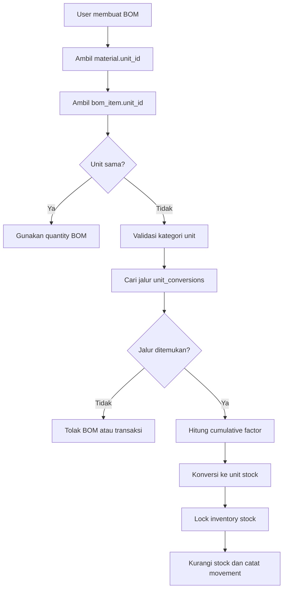

# Implementation Plan: Konversi Satuan Material ke BOM

## 1. Tujuan

Memastikan kebutuhan material pada BOM selalu dapat dibandingkan dan dikurangkan dari stok material walaupun satuannya berbeda.

Contoh:

```text
Material stock : 2 kg
BOM            : 18 gram per produk
Penjualan      : 10 produk
Pengurangan    : 18 x 10 gram = 180 gram = 0,18 kg
Sisa stock     : 1,82 kg
```

Konversi harus berlaku untuk seluruh unit yang terdaftar, bukan hanya `kg` dan `gram`.

## 2. Keputusan Arsitektur

### Tidak membuat field per jenis konversi

Jangan menambahkan field seperti `kg_to_gram`, `liter_to_ml`, atau `box_to_pcs` pada tabel material. Pendekatan tersebut tidak fleksibel.

Gunakan table relasional umum yang sudah tersedia:

```text
units
unit_conversions
```

Table ini mendukung conversion direct maupun chain:

```text
ton -> kg -> gram -> mg
liter -> ml
box -> pcs
meter -> cm -> mm
```

Satu record berarti:

```text
1 from_unit = factor to_unit
```

Contoh:

| from | to | factor |
|---|---|---:|
| kg | gram | 1000 |
| liter | ml | 1000 |
| box | pcs | 24 |

### Konversi kemasan tidak selalu global

`box` adalah jenis unit, tetapi isi `box` dapat berbeda. Karena itu `1 box = 24 pcs` tidak boleh selalu dibuat sebagai conversion global jika material lain memakai `1 box = 10 pcs`.

Untuk kasus kemasan, tambahkan table khusus yang mengikat conversion ke material dan, bila diperlukan, supplier:

```text
material_unit_conversions
- id
- business_id
- material_id
- supplier_id nullable
- from_unit_id
- to_unit_id
- factor
- is_default
- effective_from
- effective_until nullable
- created_at
- updated_at
```

Prioritas resolver:

```text
material + supplier aktif
-> material default
-> unit conversion tenant
-> unit conversion global
```

Contoh:

| Material | Supplier | Dari | Ke | Faktor |
|---|---|---|---|---:|
| Telur | Supplier A | box | pcs | 10 |
| Telur | Supplier B | box | pcs | 12 |
| Botol 250 ml | Supplier A | box | pcs | 24 |

Dengan desain ini:

```text
Purchase 20 box Telur dari Supplier A = 200 pcs
BOM memakai 1 pcs per produk
Penjualan 200 produk mengurangi 200 pcs
```

`unit_conversions` tetap dipakai untuk konversi universal seperti `kg -> gram` dan `liter -> ml`. `material_unit_conversions` dipakai untuk isi kemasan, yield, atau conversion yang bergantung pada material/supplier.

## 3. Schema Saat Ini

### `units`

| Field | Fungsi |
|---|---|
| `id` | UUID unit |
| `business_id` | `NULL` untuk global, UUID untuk tenant |
| `code` | Identifier stabil, misalnya `kg`, `g`, `ml` |
| `name` | Label yang ditampilkan ke user |
| `category` | weight, volume, quantity, length, dan lainnya |
| `is_base` | Menandai unit dasar kategori |
| `default_precision` | Presisi tampilan/perhitungan |

### `unit_conversions`

| Field | Fungsi |
|---|---|
| `id` | UUID conversion |
| `business_id` | `NULL` untuk global atau UUID tenant |
| `from_unit_id` | Unit sumber |
| `to_unit_id` | Unit tujuan |
| `factor` | Faktor perkalian |

Constraint:

```text
unique(business_id, from_unit_id, to_unit_id)
factor > 0
```

### `materials`

`materials.unit_id` adalah satuan penyimpanan stok material dan menjadi target konversi.

### `bom_items`

`bom_items.unit_id` adalah satuan pemakaian pada resep/BOM dan menjadi sumber konversi.

Tidak perlu menambahkan `material_unit_id` ke `bom_items` pada tahap awal karena dapat dibaca dari `materials.unit_id`.

Untuk conversion berbasis kemasan, resolver mengambil `material_id` dari BOM dan supplier dari batch/penerimaan. Jika supplier tidak diketahui, hanya conversion material default yang boleh dipakai; jika tidak ada, transaksi ditolak.

## 4. Alur Konversi End-to-End



Rumus:

```text
quantity_stock = quantity_bom * factor_path
quantity_stock_with_waste = quantity_stock * (1 + waste_percentage / 100)
```

Contoh chain:

```text
1 ton -> 1000 kg
1 kg  -> 1000 gram
1 ton -> 1.000.000 gram
```

## 5. Perubahan Implementasi

### Fase A: Hardening Master UOM

**Target:** model, request, controller/API UOM dan conversion.

1. Validasi kedua unit harus tersedia bagi tenant.
2. Tolak `from_unit_id == to_unit_id`.
3. Tolak `factor <= 0`.
4. Tolak conversion antar kategori berbeda, kecuali custom conversion yang disetujui.
5. Prioritaskan conversion tenant dibanding conversion global.
6. Cegah dua faktor berbeda untuk pasangan unit yang sama dalam satu konteks bisnis.
7. Tampilkan preview seperti `1 kg = 1000 gram`.
8. Deteksi cycle dan jalur ambigu. Jika ada dua jalur dengan faktor berbeda, tolak atau wajibkan conversion direct.

### Fase B: Unit Conversion Resolver

**Target:** `app/Domain/Material/UnitConversionService.php`.

Service sebaiknya mengembalikan metadata, bukan angka saja:

```php
[
    'quantity' => 180.0,
    'from_unit_id' => $gramId,
    'to_unit_id' => $kgId,
    'factor' => 0.001,
    'path' => ['gram', 'kg'],
]
```

Kebutuhan teknis:

1. Cache graph per `business_id` selama request/job.
2. Gunakan BFS/Dijkstra dengan faktor kumulatif.
3. Hanya gunakan unit dan conversion global + tenant aktif.
4. Verifikasi kategori sebelum pencarian graph.
5. Gunakan exception khusus untuk conversion hilang atau ambigu.
6. Jangan fallback ke `pcs`, unit pertama, atau unit material jika unit user invalid.
7. Round hanya pada boundary tampilan atau movement sesuai `default_precision`.

### Fase C: Validasi dan Penyimpanan BOM

**Target:** BOM service/controller/import.

1. Validasi unit BOM tersedia.
2. Validasi unit BOM compatible dengan `materials.unit_id`.
3. Pastikan `quantity > 0` dan waste `0..100`.
4. Tampilkan estimasi, misalnya `18 gram = 0,018 kg`.
5. Import BOM memakai ID hasil lookup master, bukan string sebagai foreign key.
6. Conversion hilang membuat preview error dan mencegah execute.

### Fase D: Pemotongan Stok Saat Penjualan

**Target:** `app/Domain/Inventory/StockService.php` dan caller POS/Invoice.

Untuk setiap BOM item:

```text
bom_quantity
  x product_quantity
  x waste_factor
  x conversion_factor_to_material_stock_unit
  = stock_quantity_to_deduct
```

Urutan transaksi:

1. Resolve material dan unit BOM.
2. Konversi ke `material.unit_id`.
3. Lock `inventory_stocks` dengan `SELECT ... FOR UPDATE`.
4. Validasi stok sesuai `allow_negative_stock`.
5. Kurangi quantity dalam unit material stock.
6. Catat `stock_movements.quantity_change` dalam unit material stock.
7. Commit sale secara atomic.

Jika satu item gagal dikonversi atau stok tidak cukup, seluruh penjualan rollback.

### Fase E: Purchasing, Receiving, dan Inventory

1. Stok selalu disimpan dalam `materials.unit_id`.
2. Quantity penerimaan boleh memakai unit pembelian berbeda.
3. Goods receipt mengonversi unit pembelian ke unit material.
4. WAC dihitung berdasarkan quantity setelah konversi.
5. Inventory import menampilkan unit stok material sebagai default.
6. Jika user memilih unit lain, conversion harus tersedia.
7. Stock opname mengonversi ke unit material sebelum rekonsiliasi.
8. Purchase return memakai aturan konversi yang sama.

#### Contoh order 20 box isi 10 pcs

Sebaiknya `materials.unit_id` ditetapkan sebagai unit stok terkecil yang konsisten, yaitu `pcs`. Unit pembelian disimpan pada `material_prices.purchase_unit_id` atau detail penerimaan sebagai `box`.

```text
Material stock unit : pcs
Purchase unit      : box
Isi per box        : 10 pcs
Order              : 20 box
Stock masuk        : 20 x 10 = 200 pcs
BOM                : 1 pcs per produk
Penjualan          : 20 produk
Stock keluar       : 20 x 1 = 20 pcs
Sisa               : 180 pcs
```

Jika material lain memakai `1 box = 24 pcs`, conversion-nya memiliki baris material berbeda dan tidak memengaruhi material pertama.

### Fase F: Harga Material dan Costing

`MaterialPrice.purchase_unit_id` harus menjadi konteks satuan harga.

```text
purchase_price = Rp 100.000 per kg
material stock  = gram
```

Normalisasi:

```text
price_per_stock_unit = purchase_price / converted_purchase_quantity
```

HPP BOM menggunakan quantity yang sudah dikonversi ke unit stok dan harga yang dinormalisasi ke unit sama.

## 6. Snapshot dan Perubahan Master

Tahap awal dapat menggunakan conversion master saat transaksi diposting, lalu menyimpan quantity final dan unit stock pada detail movement.

Untuk audit yang lebih kuat, tambahkan pada `bom_items` saat BOM dipublish/versioned:

```text
conversion_factor_snapshot decimal(24,12) nullable
stock_unit_id              uuid nullable
```

Alternatif history table:

```text
bom_item_unit_conversions
- id
- bom_item_id
- from_unit_id
- to_unit_id
- factor
- effective_from
- effective_until
- created_by
```

Rekomendasi: mulai dengan snapshot saat BOM dipublish. Jika conversion master berubah, BOM aktif harus direview dan republish. Transaksi yang sudah diposting tidak boleh dihitung ulang memakai conversion baru.

## 7. API dan UI

Endpoint yang dibutuhkan:

```text
GET    /units
POST   /units
PUT    /units/{unit}
GET    /unit-conversions
POST   /unit-conversions
PUT    /unit-conversions/{conversion}
DELETE /unit-conversions/{conversion}
```

UI conversion menampilkan unit asal, unit tujuan, faktor, preview, dan scope.

Pada BOM editor:

1. Tampilkan unit stok material.
2. Sediakan dropdown unit BOM yang compatible.
3. Tampilkan hasil konversi real-time.
4. Tampilkan error jika conversion belum ada.
5. Jangan izinkan publish BOM invalid.

Pada import BOM, user memilih nama/code dari dropdown. Hidden master sheet menyimpan ID dan preview menampilkan hasil konversi.

## 8. Migration Plan

### Yang sudah ada

Pastikan migration berikut dijalankan pada semua environment:

```text
create_units_table
create_unit_conversions_table
add_sequence_to_material_prices_table
```

### Migration tambahan

1. Tambahkan index:

```text
index(business_id, from_unit_id, to_unit_id)
```

2. Jika snapshot dipilih, buat `add_conversion_snapshot_to_bom_items`.
3. Perubahan `materials.unit_id` setelah ada stok harus dibatasi atau memerlukan migrasi quantity.
4. Jangan mengubah unit material existing tanpa conversion dan audit stok.
5. Buat migration `create_material_unit_conversions_table` dengan foreign key ke `businesses`, `materials`, `suppliers` nullable, dan `units` untuk from/to.
6. Tambahkan unique constraint untuk kombinasi tenant, material, supplier, from unit, dan to unit; normalisasi `supplier_id = NULL` sebagai conversion default material.
7. Tambahkan check/application validation `factor > 0`, `from_unit_id != to_unit_id`, dan kategori unit compatible.

## 9. Testing Plan

### UnitConversionService

1. Unit sama: `10 kg -> 10 kg`.
2. Direct: `2 kg -> 2000 gram`.
3. Reverse: `2000 gram -> 2 kg`.
4. Chain: `1 ton -> 1.000.000 gram`.
5. Volume: `2 liter -> 2000 ml`.
6. Quantity: `2 box -> 48 pcs`.
7. Kategori berbeda ditolak.
8. Conversion hilang ditolak.
9. Tenant conversion mengalahkan global sesuai policy.
10. Jalur ambigu ditolak atau memakai direct conversion.

### BOM dan penjualan

1. BOM gram, stok kg, sale mengurangi kg dengan benar.
2. BOM kg, stok gram, sale mengurangi gram dengan benar.
3. Waste ikut dikonversi.
4. Multi-material dengan unit berbeda berjalan atomic.
5. Conversion hilang menyebabkan rollback.
6. Stok tidak cukup menyebabkan rollback.
7. Refund mengembalikan quantity dalam unit stock.
8. POS dan Invoice memakai resolver yang sama.

### Purchasing dan costing

1. Goods receipt kg menambah material stock gram dengan benar.
2. Harga per kg dinormalisasi untuk HPP per gram.
3. WAC dihitung setelah quantity dikonversi.
4. Stock opname unit berbeda menghasilkan saldo benar.

Commands:

```bash
php artisan migrate
php artisan test tests/Feature/MaterialMasterStockBusinessRulesTest.php
php artisan test tests/Feature/UnitEngineTest.php
php artisan test tests/Feature/GoodsReceiptFeatureTest.php
php artisan test tests/Feature/InvoiceStockAndJournalIntegrationTest.php
```

## 10. Urutan Implementasi

1. Samakan migration production dan pastikan unit/conversion default tersedia.
2. Hardening CRUD master UOM dan conversion.
3. Sempurnakan `UnitConversionService` dengan metadata, cache, dan exception khusus.
4. Validasi BOM saat create/update/import.
5. Terapkan conversion pada POS dan Invoice melalui `StockService` tunggal.
6. Terapkan conversion pada receiving, inventory import, opname, dan purchase return.
7. Normalisasi harga material dan WAC.
8. Tambahkan snapshot saat BOM dipublish/versioned.
9. Tambahkan UI preview conversion dan error handling.
10. Jalankan regression test dan audit data existing.

## 11. Definition of Done

- Tidak ada field khusus per pasangan unit.
- Semua unit resmi memiliki kategori dan identifier unik.
- Conversion direct maupun chain didukung.
- BOM dan material stock boleh berbeda unit jika conversion valid.
- Penjualan, penerimaan, retur, opname, dan costing memakai quantity terkonversi.
- Conversion invalid tidak pernah menghasilkan pengurangan diam-diam.
- Movement menyimpan quantity dalam unit stock yang jelas.
- Perubahan master conversion tidak mengubah histori transaksi posted.
- POS, Invoice, Purchasing, Inventory, BOM, dan Import memakai aturan yang sama.
