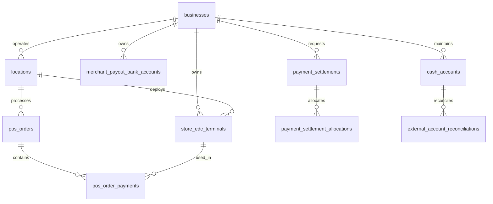

# PRD-16: Arsitektur Finansial Terpadu, Multi-Payment POS, Manajemen Mesin EDC, Cooca Pay Payout Hub & Rekonsiliasi Saldo Multi-Cabang

> **ID Dokumen:** `PRD-16-UNIFIED-FINANCIAL-ENGINE-MULTI-PAYMENT-SETTLEMENT-AND-PAYOUT-HUB`  
> **Status Dokumen:** RATIFIED & APPROVED (Siap Implementasi Bertahap)  
> **Domain Terkait:** `app/Domain/Finance/`, `app/Domain/Pos/`, `app/Domain/Payment/`, `app/Domain/Accounting/`, `app/Domain/Commerce/`  
> **Target Pengguna:** Business Owner (Pemilik Usaha), Tim Finance & Accounting, Kasir POS, Supervisor Cabang, SuperAdmin Cooca  
> **Standar Arsitektur:** `docs/agent.md`, `docs/SYSTEM_GUIDE.md`, Bento Apple HIG v2.0, Zero Third-Party Leak, Strict Owner Identity Matching  

---

## 1. Latar Belakang & Pernyataan Masalah (Problem Statement)

Modul Keuangan, Kasir POS, dan Settlement di COOCA merupakan tulang punggung operasional dan likuiditas bagi bisnis F&B, Retail, dan Jasa multi-kanal di Indonesia. Dalam praktiknya di lapangan, pelaku usaha UMKM menghadapi kompleksitas aliran dana dari beragam kanal pembayaran:
1. **Kasir Fisik POS:** Pelanggan kerap membagi pembayaran (*Split Payment*), seperti bayar sebagian uang tunai + sebagian gesek EDC BCA/Mandiri + sebagian QRIS, atau menggunakan poin loyalitas/voucher diskon.
2. **Kanal Digital Cooca:** Pembayaran *Self-Service* QR Order di Meja (*Dine-In*) dan Toko Online (*Storefront*) via **Cooca Pay (Dynamic QRIS / Virtual Account)** yang dana pembayarannya ditampung sementara oleh Cooca sebelum dicairkan ke rekening pemilik usaha.
3. **Kanal Mitra Food Delivery:** GoFood (GoBiz), GrabFood (GrabMerchant), ShopeeFood (Shopee Partner).
4. **Kanal Marketplace:** Shopee Seller, TikTok Shop, Tokopedia.

Berdasarkan hasil audit sistem komprehensif hulu-ke-hilir (*end-to-end*), ditemukan **8 kesenjangan kritis (*critical gaps*)** pada sistem saat ini:

1. **Eksposur Branding Vendor Gateway Eksternal di UI Merchant (Whitelabeling Gap):**
   * View settlement dan beberapa pesan UI masih mencantumkan nama vendor pihak ketiga (*TriPay Escrow / Fee TriPay*). Padahal secara hukum dan relasi bisnis, merchant dan pelanggan hanya bertransaksi dengan **Cooca (Cooca Pay)**. Cooca yang bertindak sebagai entitas pengelola dana dan mentransfer dana ke rekening merchant.
2. **Ketiadaan Peta Likuiditas *"Where The Money Lives"* & Unit Economics Dashboard:**
   * Modul Kas & Bank saat ini hanya menyajikan daftar saldo akun individual. Business Owner dan Tim Finance tidak memiliki ringkasan eksekutif satu layar yang memperlihatkan **Total Omzet Kotor, Total Modal HPP, Total Laba Bersih**, dan **Peta Sebaran Saldo 6 Titik** (Laci Kasir, Saldo Cooca Pay, Mesin EDC, Saldo GoBiz/Grab/Shopee, Saldo Marketplace, Rekening Bank).
3. **Ketiadaan Antarmuka Split Payment di Terminal Kasir POS:**
   * Meskipun backend `PosOrderService` menerima array `paymentsData`, antarmuka Terminal Kasir POS belum menyediakan modal interaktif untuk memilih multi-metode pembayaran dalam 1 pesanan, validasi sisa tagihan, dan perhitungan kembalian uang tunai.
4. **Ketiadaan Master Profil Mesin EDC Toko per Cabang (Store Terminals Gap):**
   * Pembayaran non-tunai kartu di kasir hanya dicatat sebagai string generik `edc_debit` / `edc_credit` tanpa mencatat nomor identitas fisik mesin (*Terminal ID / TID*), nomor *Approval Code*, dan bank penerbit (BCA, Mandiri, BRI). Hal ini menyulitkan rekonsiliasi batch settlement bank harian.
5. **Celah Keamanan & Risiko Penggelapan Penarikan Dana (Missing Strict Owner Identity Matching):**
   * Belum ada validasi otomatis yang mewajibkan bahwa rekening bank penarikan saldo Cooca Pay **harus sama persis dengan nama pemilik usaha terdaftar (*Business Owner Name*)**. Hal ini berisiko dimanfaatkan staf/kasir nakal untuk mencairkan saldo bisnis ke rekening pribadi pihak ketiga.
6. **Ketiadaan Mode Penjadwalan Pencairan Otomatis (*Auto-Payout H+1 Scheduling*):**
   * Proses rekonsiliasi dan penarikan saldo saat ini dilakukan manual per batch transaksi. Belum ada opsi bagi merchant untuk mengaktifkan *Auto-Payout H+1* (dana otomatis ditransfer Cooca setiap pagi jam 09.00 WIB ke rekening bank pemilik).
7. **Ketiadaan Lembar Rekonsiliasi Saldo Eksternal Mandiri (External Balances Gap):**
   * Untuk saldo di luar tanggung jawab Cooca (Kasir, EDC, GoBiz, Grab, Shopee, TikTok Shop), finance belum memiliki lembar kerja sistemik untuk menginput Saldo Awal per 1 bulan, mencatat penarikan dana ke rekening bank, dan mendeteksi selisih (*discrepancy*) terhadap sisa saldo riil di aplikasi mitra.
8. **Fragmentasi Multi-Cabang (Branch Isolation vs HQ Consolidation Gap):**
   * Akun kas, mesin EDC, dan lembar rekonsiliasi belum terisolasi secara granular per cabang (`location_id`), dan Finance Pusat (HQ) belum memiliki filter bento untuk melihat komparasi konsolidasian seluruh cabang vs cabang tertentu.

---

## 2. Sasaran Produk & Metrik Keberhasilan (OKRs)

| Sasaran Strategis | Metrik Keberhasilan | Target |
| :--- | :--- | :---: |
| **Whitelabel Cooca Pay** | 100% terminologi gateway eksternal dihilangkan dari antarmuka merchant/customer menjadi Cooca Pay | 100% Whitelabel |
| **Visibilitas Finansial** | Ketersediaan Bento Dashboard *"Where The Money Lives"* menampilkan Omzet, HPP, Laba & 6 Titik Saldo | Paham dalam 3 Detik |
| **Fleksibilitas Kasir** | Keberhasilan transaksi Split Payment (Tunai + EDC + QRIS + Voucher) di POS Terminal | 100% Terjurnal Seimbang |
| **Anti-Fraud Penarikan** | Eliminasi 100% penarikan ke rekening pihak ketiga (*Strict Owner Identity Matching*) | 0 Toleransi Rekening Asing |
| **Efisiensi Settlement** | Ketersediaan opsi *Auto-Payout H+1* terjadwal dan *Manual On-Demand* dengan bukti transfer resmi | < 24 Jam Cair |
| **Akurasi Rekonsiliasi** | Deteksi selisih saldo eksternal (GoBiz/Grab/Shopee/EDC) via lembar rekonsiliasi bulanan | 100% Terlacak |
| **Multi-Cabang HQ** | Isolasi data kasir per cabang & konsolidasi penuh untuk Owner di level Kantor Pusat | 100% Terisolasi & Konsolidasi |
| **Kualitas Kode & Tes** | Seluruh test suite `tests/Feature/Finance` dan `tests/Feature/Pos` lolos 100% | 0 Failure / 0 Error |

---

## 3. Spesifikasi Fungsional (Functional Requirements)

### FR-01: Ekosistem Whitelabel Cooca Pay & Escrow Management
1. Seluruh antarmuka merchant, invoice pelanggan, struk kasir, dan menu QR Order Meja **hanya menampilkan identitas Cooca / Cooca Pay**.
2. Pembayaran digital (Dynamic QRIS dan Virtual Account) diakui sebagai **Saldo Cooca Pay (Akun COA `1-1005`)**.
3. Cooca bertindak sebagai platform escrow yang menampung dana transaksi digital dan mentransferkannya langsung ke rekening bank terverifikasi milik merchant.

---

### FR-02: Bento Dashboard "Where The Money Lives" & Unit Economics
1. Pada halaman Keuangan Kas & Bank (`/finance/cash-bank`), sistem menyediakan Bento Card Eksekutif berukuran penuh yang menyajikan:
   * **Metrik Performa:** Total Omzet Penjualan Kotor, Total Modal HPP Riil, Total Beban Layanan/Komisi, dan Estimasi Laba Bersih Bisnis.
   * **Peta Likuiditas 6 Titik:**
     1. `⚡ Saldo Cooca Pay` (QR Meja & Toko Online Cooca) $\rightarrow$ Tombol aksi `[ Tarik ke Rekening ]`.
     2. `💵 Kas Fisik Laci Kasir` (Per Cabang / Total).
     3. `💳 Kliring Mesin EDC Multi-Bank` (Menunggu Batch Settlement H+1).
     4. `🛵 Saldo Mitra Food Delivery` (GoFood GoBiz, GrabMerchant, Shopee Partner).
     5. `📦 Saldo Seller Marketplace` (Shopee Seller, TikTok Shop, Tokopedia).
     6. `🏦 Rekening Bank Utama Bisnis` (BCA, Mandiri, BRI - Dana Likuid Tersedia).
2. Dilengkapi filter **Rentang Waktu (Hari Ini, Bulan Ini, Kustom)** dan **Filter Cabang (`[ Semua Cabang ]` vs `[ Cabang Tertentu ]`)**.

---

### FR-03: POS Multi-Payment Engine (Split Payment di Kasir)
1. Pada Terminal Kasir POS (`resources/views/app/pos/terminal.blade.php`), modal pembayaran mendukung penambahan **multi-metode pembayaran dalam 1 pesanan**:
   * Tombol cepat tambah metode pembayaran: `[ + Tambah Pembayaran ]`.
   * Pilihan metode: Tunai (*Cash*), Mesin EDC (pilih mesin terdaftar), QRIS Cooca Pay, Transfer Bank Toko, Kasbon Piutang Member, dan Poin Loyalitas.
2. Validasi matematis interaktif:
   * Menampilkan `Sisa Tagihan` secara *real-time* saat kasir menginput nominal metode pertama.
   * Tombol *Selesaikan Pembayaran* hanya aktif jika $\sum \text{Nominal} \ge \text{Total Tagihan}$.
3. Penanganan Uang Kembalian (*Change Amount*):
   * Jika kasir menginput uang tunai melebihi sisa tagihan, sistem menghitung kembalian dan hanya mencatat uang bersih masuk ke laci kasir (`net_cash = cash_amount - change_amount`).
4. Struk Thermal ESC/POS mencantumkan rincian seluruh metode pembayaran yang digunakan:
   ```text
   ----------------------------------------
   TOTAL TAGIHAN                  Rp 500.000
   ----------------------------------------
   - Tunai (Cash)                 Rp 100.000
   - EDC BCA (TID: 8821)          Rp 300.000
   - Cooca Pay QRIS               Rp 100.000
   ----------------------------------------
   STATUS: LUNAS (MULTI-PAYMENT)
   ```

---

### FR-04: Master Profil Mesin EDC Toko & QRIS Statis per Cabang
1. Sistem menyediakan tabel master `store_edc_terminals` yang terikat ke cabang (`location_id`):
   * `bank_name`: BCA, Mandiri, BRI, BNI, CIMB Niaga, Permata, dll.
   * `terminal_name`: Contoh *"EDC BCA Kasir Utama Jakarta"*.
   * `terminal_id_tid`: Nomor fisik Terminal ID (TID) dari bank.
   * `merchant_id_mid`: Nomor MID merchant (opsional).
   * `is_active`: Status aktif/non-aktif mesin.
2. Saat kasir POS memilih metode pembayaran EDC, sistem menyajikan dropdown mesin EDC yang terdaftar di cabangnya dan kolom input nomor *Approval Code / Trace Number*.
3. Master QRIS Statis Toko: Merchant dapat mengunggah gambar stiker QRIS toko fisik untuk opsi QR non-otomatis.

---

### FR-05: Master Rekening Penarikan Terverifikasi (*Strict Owner Identity Matching*)
1. Sistem menyediakan tabel `merchant_payout_bank_accounts` untuk menyimpan rekening penarikan dana merchant.
2. **Aturan Keamanan Mutlak (Zero Third-Party Payout):**
   * Saat merchant mendaftarkan rekening penarikan baru, sistem melakukan validasi kecocokan nama:
     $$\text{Nama Pemilik Rekening} \equiv \text{Nama Pemilik Usaha Terdaftar (Owner Name)}$$
   * Jika nama berbeda (misal nama karyawan, kasir, atau pihak ketiga), pendaftaran rekening **DITOLAK OTOMATIS OLEH SISTEM**.
3. Status rekening: `UNVERIFIED` $\rightarrow$ `VERIFIED` (setelah pencocokan identitas).
4. Opsi penandaan `is_primary` untuk menentukan rekening tujuan default pencairan otomatis.

---

### FR-06: Manajemen Payout Cooca Pay Dua Sisi (Merchant & SuperAdmin Cooca)

#### A. Sisi Merchant (Portal Bisnis):
1. **Pilihan Mode Pencairan Saldo Cooca Pay:**
   * **Mode 1: Auto-Payout H+1 (Direkomendasikan):** Setiap hari kerja jam 09:00 WIB, sistem Cooca otomatis mengajukan seluruh saldo mengendap yang siap cair ke rekening utama pemilik.
   * **Mode 2: Auto-Payout Mingguan:** Ditransfer setiap hari Senin.
   * **Mode 3: Penarikan Manual (On-Demand):** Merchant mengklik tombol `[ Tarik Saldo Cooca Pay ]` dan memasukkan nominal yang ingin dicairkan.
2. **Riwayat Penarikan Transparan:**
   * Menampilkan nomor penarikan `#SET-YYYYMMDD-XXXX`, tanggal pengajuan, nominal bruto, biaya layanan, nominal bersih, rekening tujuan, dan badge status (`PENDING`, `PROCESSING`, `COMPLETED`, `REJECTED`).
   * Tombol **`[ Lihat Bukti Transfer Resmi ]`** pada status `COMPLETED` untuk menampilkan slip transfer bank yang diunggah Admin Cooca.

#### B. Sisi SuperAdmin Cooca (Portal Admin):
1. **Antrean Settlement Payout (`/admin/settlements`):**
   * Admin Finance Cooca melihat daftar antrean status `PENDING` lengkap dengan komparasi: **Nama Pemilik Usaha vs Nama Rekening Tujuan**.
2. **Eksekusi & Approval:**
   * Admin mentransfer dana via internet banking Cooca ke rekening pemilik usaha.
   * Admin mengunggah foto/file slip bukti transfer bank (`proof_image` maks 5MB) dan memasukkan nomor referensi bank.
   * Sistem mengubah status menjadi `COMPLETED`, mencatat log admin, menerbitkan jurnal pencairan, dan mengirim notifikasi WhatsApp + Email resmi ke pemilik usaha.
3. **Penolakan (Reject):**
   * Jika ditemukan ketidaksesuaian data, admin memasukkan alasan penolakan (`rejection_reason`) $\rightarrow$ saldo pesanan otomatis dikembalikan ke saldo aktif merchant.

---

### FR-07: Lembar Rekonsiliasi Saldo Eksternal Bulanan Mandiri
1. Untuk saldo di luar tanggung jawab Cooca (Kas Fisik Kasir, EDC Bank, GoBiz, GrabMerchant, Shopee Partner, Shopee Seller, TikTok Shop, Tokopedia), Cooca menyediakan **Lembar Rekonsiliasi Saldo Eksternal (`external_account_reconciliations`)**:
2. **Alur Kerja Tim Finance:**
   * **Langkah 1 (Awal Bulan):** Finance menginput **Saldo Awal Riil (*Beginning Balance*)** per 1 bulan berdasarkan buku bank / saldo aplikasi mitra.
   * **Langkah 2 (Berjalan):** Setiap transaksi kasir POS menambah kalkulasi penerimaan sistem (*Inflow*).
   * **Langkah 3 (Pencairan):** Saat dana dari Gojek/Grab/Shopee/EDC ditarik ke rekening bank toko, finance mencatat mutasi penarikan (*Disbursed Amount*).
   * **Langkah 4 (Akhir Periode):** Finance menginput **Saldo Sisa Aktual di Aplikasi Mitra (*Actual Ending Balance*)**.
3. **Kalkulasi & Status Selisih Otomatis:**
   $$\text{Expected Ending Balance} = \text{Beginning Balance} + \text{Total Inflow POS} - \text{Total Disbursed}$$
   $$\text{Discrepancy} = \text{Actual Ending Balance} - \text{Expected Ending Balance}$$
   * Jika $\text{Discrepancy} = 0 \rightarrow$ Status: `MATCH (Cocok 100%)`.
   * Jika $\text{Discrepancy} \ne 0 \rightarrow$ Status: `DISCREPANCY (Peringatan Selisih Rp X)`.

---

### FR-08: Isolasi & Konsolidasi Multi-Cabang (Multi-Location)
1. **Isolasi Staf Kasir Cabang:**
   * Kasir Cabang Jakarta hanya dapat melihat laci kasir cabang Jakarta, mesin EDC cabang Jakarta, dan akun GoBiz cabang Jakarta.
2. **Konsolidasi Finance Pusat (HQ) & Business Owner:**
   * Memiliki akses lintas cabang dengan selector dropdown global di header modul Keuangan:
     * `[ Semua Cabang (Konsolidasian) ]`
     * `[ Cabang 1: Jakarta Pusat ]`
     * `[ Cabang 2: Bandung Dago ]`
   * Penarikan saldo Cooca Pay dapat dilakukan secara terpusat ke Rekening Bank Utama HQ dengan laporan pembagian kontribusi omzet per cabang.

---

### FR-09: Standar Jurnal Akuntansi Berpasangan (Double-Entry Engine)
Sistem secara otomatis menerbitkan entri jurnal untuk setiap peristiwa finansial:

| Peristiwa Finansial | Debit | Kredit | Keterangan |
| :--- | :--- | :--- | :--- |
| **Penjualan POS Multi-Payment** | • `1-1001` Kas Fisik<br>• `1-1008` Kliring EDC<br>• `5-5001` Beban HPP | • `4-4001` Pendapatan POS<br>• `1-1004` Persediaan Bahan | Multi-debit sesuai porsi pembayaran masing-masing. |
| **Penjualan QR Meja (Cooca Pay)** | • `1-1005` Saldo Cooca Pay<br>• `5-5001` Beban HPP | • `4-4001` Pendapatan QR Order<br>• `1-1004` Persediaan Bahan | Uang masuk ke saldo escrow Cooca Pay. |
| **Penjualan GoFood Multi-Harga** | • `1-1006` Saldo GoFood (GoBiz)<br>• `5-5001` Beban HPP | • `4-4001` Pendapatan GoFood<br>• `1-1004` Persediaan Bahan | Sesuai harga markup khusus GoFood. |
| **Cooca Payout ke Rekening Owner** | • `1-1002` Rekening Bank Owner<br>• `6-6003` Biaya Layanan Cooca | • `1-1005` Saldo Cooca Pay | Saldo Cooca Pay berkurang, Bank bertambah. |
| **Pencairan Gojek ke Bank Toko** | • `1-1002` Rekening Bank Toko<br>• `6-6003` Beban Komisi GoFood | • `1-1006` Saldo GoFood (GoBiz) | Mengakui potongan komisi platform 20%. |
| **Settlement Batch EDC Bank Toko** | • `1-1002` Rekening Bank Toko<br>• `6-6003` Biaya MDR EDC | • `1-1008` Kliring EDC Bank | Kliring EDC nol, uang masuk rekening bank. |

---

## 4. Desain Skema Basis Data & Migrasi DDL



### DDL 1: `merchant_payout_bank_accounts`
```sql
CREATE TABLE merchant_payout_bank_accounts (
    id CHAR(36) PRIMARY KEY,
    business_id CHAR(36) NOT NULL,
    location_id CHAR(36) NULL,
    bank_code VARCHAR(30) NOT NULL,
    bank_name VARCHAR(100) NOT NULL,
    account_number VARCHAR(50) NOT NULL,
    account_holder_name VARCHAR(150) NOT NULL,
    is_primary BOOLEAN DEFAULT FALSE,
    is_verified BOOLEAN DEFAULT FALSE,
    verified_at TIMESTAMP NULL,
    created_at TIMESTAMP NULL,
    updated_at TIMESTAMP NULL,
    FOREIGN KEY (business_id) REFERENCES businesses(id) ON DELETE CASCADE,
    FOREIGN KEY (location_id) REFERENCES locations(id) ON DELETE SET NULL,
    UNIQUE (business_id, bank_code, account_number)
);
```

### DDL 2: `store_edc_terminals`
```sql
CREATE TABLE store_edc_terminals (
    id CHAR(36) PRIMARY KEY,
    business_id CHAR(36) NOT NULL,
    location_id CHAR(36) NOT NULL,
    bank_name VARCHAR(50) NOT NULL,
    terminal_name VARCHAR(100) NOT NULL,
    terminal_id_tid VARCHAR(50) NOT NULL,
    merchant_id_mid VARCHAR(50) NULL,
    mdr_debit_percent DECIMAL(5,2) DEFAULT 0.15,
    mdr_credit_percent DECIMAL(5,2) DEFAULT 1.50,
    is_active BOOLEAN DEFAULT TRUE,
    created_at TIMESTAMP NULL,
    updated_at TIMESTAMP NULL,
    FOREIGN KEY (business_id) REFERENCES businesses(id) ON DELETE CASCADE,
    FOREIGN KEY (location_id) REFERENCES locations(id) ON DELETE CASCADE,
    INDEX (business_id, location_id, is_active)
);
```

### DDL 3: `external_account_reconciliations`
```sql
CREATE TABLE external_account_reconciliations (
    id CHAR(36) PRIMARY KEY,
    business_id CHAR(36) NOT NULL,
    location_id CHAR(36) NULL,
    cash_account_id CHAR(36) NOT NULL,
    channel_type VARCHAR(50) NOT NULL,
    period_month VARCHAR(7) NOT NULL,
    beginning_balance DECIMAL(15,2) DEFAULT 0.00,
    total_pos_inflow DECIMAL(15,2) DEFAULT 0.00,
    total_disbursed DECIMAL(15,2) DEFAULT 0.00,
    expected_ending_balance DECIMAL(15,2) DEFAULT 0.00,
    actual_ending_balance DECIMAL(15,2) DEFAULT 0.00,
    discrepancy_amount DECIMAL(15,2) DEFAULT 0.00,
    status VARCHAR(20) DEFAULT 'draft',
    reconciled_by CHAR(36) NULL,
    notes TEXT NULL,
    created_at TIMESTAMP NULL,
    updated_at TIMESTAMP NULL,
    FOREIGN KEY (business_id) REFERENCES businesses(id) ON DELETE CASCADE,
    FOREIGN KEY (location_id) REFERENCES locations(id) ON DELETE SET NULL,
    FOREIGN KEY (cash_account_id) REFERENCES cash_accounts(id) ON DELETE CASCADE,
    UNIQUE (business_id, cash_account_id, period_month)
);
```

---

## 5. Rencana Pengujian Nyata (Test Suite Specifications)

Seluruh logika wajib diuji dengan pengujian otomatis (*Automated Feature & Unit Tests*) sebelum dinyatakan selesai:

1. **`tests/Feature/Finance/MerchantPayoutAccountSecurityTest.php`:**
   * Test pendaftaran rekening dengan nama sama dengan owner $\rightarrow$ `PASS (Status: Verified)`.
   * Test pendaftaran rekening dengan nama berbeda (pihak ketiga) $\rightarrow$ `FAIL / DomainException (Ditolak Otomatis)`.
2. **`tests/Feature/Pos/PosMultiPaymentSplitTest.php`:**
   * Test transaksi POS dengan 3 metode pembayaran sekaligus (Tunai + EDC BCA + QRIS Cooca Pay).
   * Verifikasi saldo kas laci, kliring EDC, dan saldo Cooca Pay bertambah sesuai porsi.
   * Verifikasi jurnal akuntansi majemuk seimbang (Debit = Kredit).
3. **`tests/Feature/Finance/CoocaPayAutoPayoutSchedulingTest.php`:**
   * Test pembuatan pengajuan payout otomatis H+1 jam 09.00 WIB.
   * Test approval oleh SuperAdmin Cooca dengan upload slip bukti transfer valid.
   * Verifikasi pengiriman notifikasi WhatsApp & Email resmi ke nomor pemilik bisnis.
4. **`tests/Feature/Finance/ExternalAccountReconciliationTest.php`:**
   * Test kalkulasi rekonsiliasi: $\text{Awal} + \text{Inflow POS} - \text{Disbursed} = \text{Expected}$.
   * Test deteksi selisih jika saldo riil aplikasi berbeda dengan catatan sistem.
5. **`tests/Feature/Finance/MultiBranchFinancialIsolationTest.php`:**
   * Test isolasi akses kasir Cabang Jakarta vs Cabang Bandung.
   * Test dashboard konsolidasi HQ yang menggabungkan seluruh saldo cabang dengan filter dinamis.

---

## 6. Tahapan Peluncuran & Definisi Selesai (Definition of Done)

### Roadmap Implementasi 5 Fase:
* **Fase 1: UI QR Order & Copywriting Whitelabel (`menu.blade.php`)**  
  Penyempurnaan kartu pilihan pembayaran: *Bayar QRIS Cooca Pay* (Bebas antre, auto-dapur) vs *Bayar di Kasir* (Tunai/EDC/QR Kasir).
* **Fase 2: Migrasi Basis Data & Master Profil (`merchant_payout_bank_accounts` & `store_edc_terminals`)**  
  Penerapan migrasi basis data, pembuatan model Eloquent, dan *Strict Owner Identity Matching Service*.
* **Fase 3: POS Multi-Payment Engine & Split Payment UI**  
  Penyempurnaan antarmuka kasir POS Terminal untuk input multi-metode pembayaran, kalkulasi kembalian, dan cetak struk split payment.
* **Fase 4: Cooca Pay Payout Hub (Merchant & Admin Cooca Portal)**  
  Penyempurnaan modul settlement menjadi Payout Hub lengkap dengan opsi Auto-Payout H+1, Manual Request, dan upload bukti transfer admin.
* **Fase 5: Lembar Rekonsiliasi Saldo Eksternal & Dashboard Likuiditas Multi-Cabang**  
  Implementasi lembar rekonsiliasi bulanan dan Bento Dashboard *"Where The Money Lives"* di `/finance/cash-bank`.

### Kriteria Selesai (Definition of Done):
- [ ] Seluruh migrasi basis data dieksekusi dengan bersih (`php artisan migrate`).
- [ ] Seluruh endpoint memiliki pembatasan hak akses RBAC dan proteksi multi-tenant (`Context::requireBusiness()`).
- [ ] Validasi keamanan *Strict Owner Identity Matching* aktif dan menolak pendaftaran rekening pihak ketiga.
- [ ] Transaksi Split Payment POS menghasilkan jurnal seimbang matematis.
- [ ] Seluruh suite pengujian otomatis lolos 100% (0 error, 0 failure).
- [ ] Dokumentasi 3-Layer (`docs/AiWorkHistory.md`, `docs/system/`, `docs/SYSTEM_GUIDE.md`) diperbarui tuntas.
