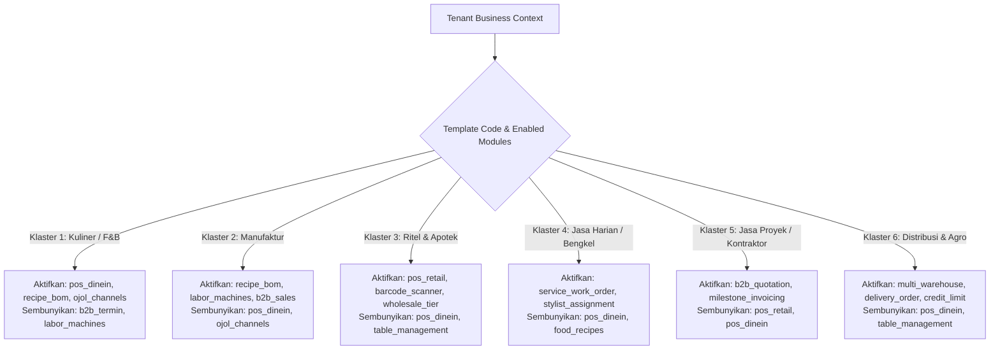
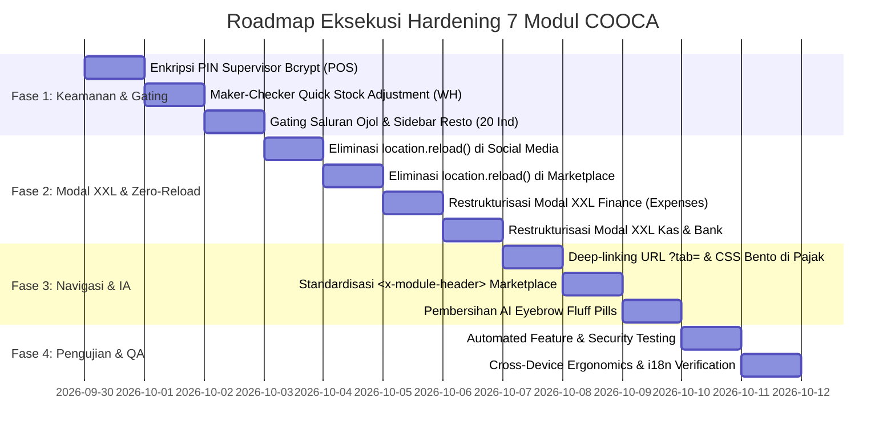

# Product Requirement Document (PRD): Comprehensive System Hardening & Multi-Industry Remediation (7 Core View Modules)
## Hardening Keamanan, Proteksi Fraud, Eliminasi Full-Reload, & Antarmuka Sadar Konteks 20 Industri

> **Dokumen ID:** `PRD-18`  
> **Versi Dokumen:** 1.0  
> **Status:** `PROPOSED & READY FOR IMPLEMENTATION`  
> **Tanggal Rilis:** 2026-09-29  
> **Modul Target:**  
> 1. `resources/views/app/pos/` (Terminal Kasir, Shift, Meja/QR, Layar Dapur KDS, Struk ESC/POS)  
> 2. `resources/views/app/products/` (Katalog Produk Jadi, Resep BOM, Modifiers, Multi-Harga Saluran)  
> 3. `resources/views/app/social_media/` (Koneksi Akun Meta/TikTok/LinkedIn, Post Composer, Inbox, Kalender, Analitik)  
> 4. `resources/views/app/warehouse/` (Katalog Cabang & Gudang, Geocoding Biteship, Kartu Stok, Opname, Penyesuaian Cepat)  
> 5. `resources/views/app/tax/` (Kepatuhan Pajak, Simulator PPh Laba Bersih UU HPP, PPh Final UMKM 0.5%, PPh 21 TER, BPJS)  
> 6. `resources/views/app/marketplace/` (Hub Omnichannel Shopee/TikTok/Tokopedia, Multi-Harga Saluran, Sinkronisasi Stok)  
> 7. `resources/views/app/finance/` (Beban Operasional, Kas & Bank Multi-Rekening, Settlement Gateway, Rekonsiliasi Bank, COA)  
>
> **Tingkat Risiko Temuan Audit:** `HIGH`  
> **Prinsip Desain:** `Bento Apple HIG v2.0, Zero Reload (Fluid SPA), Dynamic Auto-Hiding 20 Industri, Boomer Ergonomics (Touch Target ≥44px, Contrast ≥4.5:1), Scoping Multi-Tenant Context::requireBusiness()`  
> **Dokumen Referensi Audit:** [`docs/AUDIT_KOMPREHENSIF_7_MODUL_COOCA.md`](file:///c:/laragon/www/cooca_core/docs/AUDIT_KOMPREHENSIF_7_MODUL_COOCA.md)  
> **Master Directive:** [`docs/agent.md`](file:///c:/laragon/www/cooca_core/docs/agent.md)

---

## 1. Ringkasan Eksekutif & Latar Belakang Masalah

### 1.1 Konteks Bisnis
Platform COOCA merupakan ekosistem SaaS ERP & Omnichannel multi-tenant yang melayani lebih dari 20 sektor industri di Indonesia—mulai dari Kuliner (F&B), Ritel/Apotek, Manufaktur/Garment, Jasa Harian (Bengkel/Salon), Jasa Proyek (Kontraktor/Event Organizer), hingga Distribusi/Agro.

Untuk memastikan platform ini dapat digunakan dengan mudah oleh pelaku UMKM dan pemilik bisnis tradisional (rentang usia 40–65 tahun) maupun staf operasional milenial/Gen-Z, lapisan antarmuka pengguna (*presentation layer*) wajib mengedepankan kecepatan respons sub-100ms, tata letak lapang bebas sesak (*XXL Canvas*), navigasi yang persisten tanpa *flicker*, serta proteksi otomatis dari kesalahan manusia (*human error*) dan manipulasi kecurangan internal (*fraud*).

### 1.2 Ringkasan Masalah & Risiko Temuan Audit 5 Dimensi
Berdasarkan hasil audit komprehensif hulu-ke-hilir pada 7 folder view utama (`pos`, `products`, `social_media`, `warehouse`, `tax`, `marketplace`, `finance`), ditemukan 7 kesenjangan struktural kritis:

1. **Anti-Pattern `location.reload()` (6 Titik Pelanggaran):**  
   Ditemukan pemanggilan paksa browser refresh (`window.location.reload()`) di `social_media/insights`, `social_media/index`, `social_media/inbox`, `marketplace/products`, `finance/settlements`, dan `finance/external-reconciliation`. Hal ini merusak fluiditas single-page application (SPA), menghapus form state yang sedang diketik, dan membuka celah *double-submit* saat internet tidak stabil.
2. **Kebocoran Fitur & Polusi Antarmuka Lintas Industri (Multi-Industry Clutter):**  
   - Komponen formulir *Multi-Harga Saluran POS (Dine-in, Takeaway, GoFood, GrabFood, ShopeeFood)* di `products/index.blade.php:L1640` muncul secara terbuka untuk semua bisnis non-F&B (Bengkel, Apotek, Garment, Kontraktor).
   - Sidebar navigasi menampilkan menu *Layar Dapur (KDS)* dan *Meja & QR* kepada tenant non-F&B karena tidak memeriksa status modul aktif `isModuleEnabled('pos_dinein')`.
3. **Pelanggaran Standar Ukuran Modal Sheet Bento Apple HIG (Narrow Canvas):**  
   Modal formulir pencatatan beban di `finance/expenses.blade.php` masih menggunakan `max-w-lg` dan modal akun kas/bank menggunakan `max-w-md`. Hal ini menyebabkan elemen form berdesakan, tombol kecil, dan menyulitkan pengguna tablet atau monitor desktop.
4. **Desinkronisasi State Tab Navigasi & Warna CSS Non-Bento:**  
   Tab simulator perpajakan di `tax/index.blade.php` tidak tersinkronisasi ke query parameter URL (`?tab=...`), sehingga reload browser atau perpindahan halaman mereset posisi tab pengguna. Terdapat pula penggunaan kelas CSS kaku `slate-*` alih-alih token semantik Bento Apple HIG.
5. **Polusi Eyebrow Pills & Marketing AI Fluff:**  
   Halaman `marketplace/index.blade.php` memuat badge promosi non-fungsional (*"Omnichannel Sync Engine"*, *"Multi-Business Isolated"*) yang melanggar aturan anti-pill dan tidak menggunakan komponen standar `<x-module-header>` dan `<x-module-tabs>`.
6. **Celah Otorisasi Supervisor PIN (Legacy Plaintext Fallback):**  
   Pada `PosOrderWebController.php`, terdapat fallback verifikasi PIN berbasis `hash_equals` langsung terhadap string plaintext jika hash Bcrypt tidak cocok.
7. **Celah Fraud Penyesuaian Stok Cepat (Quick Stock Adjustment):**  
   Fitur penyesuaian stok di detail gudang `warehouse/show.blade.php` belum membatasi nominal penyesuaian maksimum atau mewajibkan Maker-Checker (Approval Owner) ketika terjadi selisih fisik minus bernilai tinggi.

### 1.3 Dampak Operasional & Finansial Jika Dibiarkan
* **Kerugian Finansial:** Potensi *phantom stock loss* di gudang tanpa audit trail bertingkat, serta risiko selisih kas akibat rekonsiliasi yang ter-reload di tengah jalan.
* **Tingkat Churn Merchant Tinggi:** Pemilik bengkel atau toko pakaian merasa sistem "terlalu rumit dan penuh menu restoran yang tidak berguna".
* **Kegagalan Operasional Kasir:** Form checkout atau pembayaran yang melakukan full-reload saat jam sibuk menyebabkan antrean panjang dan komplain pelanggan.

---

## 2. Sasaran & Metrik Keberhasilan (OKRs / Success Metrics)

| Metrik Keberhasilan | Kondisi Saat Ini (Current State) | Target Pasca-Implementasi (Target State) |
|---|:---:|:---:|
| **Zero Full Page Reload (`location.reload`)** | Terdeteksi 6 pemanggilan reload paksa di 3 modul | **0 Pemanggilan (100% Reactive Alpine / Smart AJAX)** |
| **Isolasi Fitur 20 Sektor Industri** | Elemen F&B bocor ke modul Produk & Sidebar non-F&B | **100% Terisolasi Kondisional via `isModuleEnabled()`** |
| **Kepatuhan Bento Apple HIG XXL Canvas** | Modal form Finance berukuran `max-w-lg` & `max-w-md` | **100% Modal Form Menggunakan `max-w-5xl` / XXL Grid** |
| **Persistensi Tab Navigasi URL (`?tab=`)** | Tab pajak ter-reset saat di-refresh | **100% Tab Tersinkronisasi URL via `replaceState`** |
| **Eliminasi AI Marketing Pills / Fluff** | Terdapat 2 badge non-fungsional di Marketplace | **0 Fluff Pills; Terstandarisasi `<x-module-header>`** |
| **Keamanan PIN Supervisor Kasir** | Ada fallback plaintext `hash_equals` | **100% Enkripsi Mutlak Hash Bcrypt (`Hash::check`)** |
| **Pengamanan Fraud Stok Gudang** | Quick adjustment dapat mengubah stok besar bebas | **Maker-Checker Wajib untuk Selisih > Ambang Batas** |
| **Ergonomi Pengguna Usia 40–65 Tahun** | Area sentuh <44px pada beberapa kontrol form | **Touch Target ≥44px, Font ≥14px, Kontras Rasio ≥4.5:1** |

---

## 3. Batasan Ruang Lingkup (Scope & Non-Scope)

### 3.1 Dalam Cakupan (In-Scope):
1. **Lapisan Tampilan (Blade Views):**
   - `resources/views/app/pos/` (Penyempurnaan tombol aksi meja, modal pin supervisor, tipografi header standar).
   - `resources/views/app/products/index.blade.php` (Gating kondisional Bento Box Multi-Harga Saluran Ojol dengan `@if($activeBiz->isModuleEnabled('pos_dinein'))`).
   - `resources/views/layouts/partials/sidebar.blade.php` (Gating menu Layar Dapur KDS & Meja QR).
   - `resources/views/app/social_media/` (`insights.blade.php`, `index.blade.php`, `inbox.blade.php` – eliminasi `location.reload()` dan implementasi AJAX Fetch + Alpine state update).
   - `resources/views/app/warehouse/` (`show.blade.php` – penambahan ambang batas nominal stok dan konfirmasi approval).
   - `resources/views/app/tax/` (`index.blade.php` – deep-linking `?tab=`, migrasi palet `slate-*` ke token Bento semantik).
   - `resources/views/app/marketplace/` (`index.blade.php`, `products.blade.php` – eliminasi fluff pills, integrasi `<x-module-header>`, eliminasi reload pada simpan mapping SKU).
   - `resources/views/app/finance/` (`expenses.blade.php`, `cash-bank/index.blade.php`, `settlements/index.blade.php`, `external-reconciliation/index.blade.php` – restrukturisasi modal XXL, eliminasi `location.reload()`).
2. **Lapisan Controller & Keamanan:**
   - `app/Http/Controllers/Web/Pos/PosOrderWebController.php` (Penghapusan fallback plaintext PIN).
   - `app/Http/Controllers/Web/Inventory/InventoryWebController.php` (Validasi ambang batas quick stock adjustment).
3. **Dokumentasi & Knowledge Base:**
   - Registrasi audit report dan PRD ke `docs/system/INDEX.md` dan `docs/prd/README.md`.

### 3.2 Di Luar Cakupan (Non-Scope):
* Perubahan skema dasar akuntansi double-entry (`AutoJournalService`) yang sudah berstatus FINAL.
* Modifikasi provider OAuth API pihak ketiga (Meta Graph API, TikTok Open Platform, Shopee Open Platform).
* Perubahan core subscription billing gateway midtrans/xendit.

---

## 4. Matriks Adaptasi Fitur Lintas 6 Klaster Industri (20 Sektor)

Sistem COOCA menerapkan aturan ketat *Dynamic Auto-Hiding* berbasis klaster template bisnis yang aktif pada tenant:



### Rincian Gating Komponen pada 7 Modul yang Diaudit:

| Komponen Antarmuka | Modul Asal | Kondisi Wajib Tampil (DO) | Kondisi Wajib Sembunyi (DON'T) | Helper Blade |
|---|---|---|---|---|
| **Multi-Harga Saluran POS (Ojol)** | `products/index.blade.php` | Klaster Kuliner / F&B dengan `MODULE_POS_DINEIN` aktif | Bengkel, Salon, Apotek, Toko Baju, Kontraktor | `@if($activeBiz->isModuleEnabled('pos_dinein'))` |
| **Layar Dapur (KDS) & Meja Resto** | `sidebar.blade.php` | Restoran / Cafe / Warung Makan | Semua industri non-F&B | `@if($activeBiz->isModuleEnabled('pos_dinein'))` |
| **Resep Gramasi Bahan Baku (BOM)** | `products/index.blade.php` | F&B, Bakery, Manufaktur, Farmasi | Jasa Servis, Cuci Mobil, Konsultan | `@if($activeBiz->isModuleEnabled('recipe_bom'))` |
| **Manajemen Barcode & IMEI** | `products/index.blade.php` | Toko Gadget, Ritel Supermarket, Apotek | Jasa Kontraktor, Desain Grafis | `@if($activeBiz->isModuleEnabled('pos_retail'))` |
| **Plafon Kredit & Termin Invoice** | `finance/index.blade.php` | B2B, Distributor, Proyek | Warung Makan Kasir Tunai / Fast Food | `@if($activeBiz->isModuleEnabled('b2b_sales'))` |

---

## 5. Kebutuhan Fungsional Rinci (Functional Requirements)

### FR-01: Eliminasi Mutlak `location.reload()` & Transisi ke Reactive UI Sub-100ms
* **Deskripsi:** Seluruh tombol aksi (Refresh, Sync, Reconcile, Submit) pada modul Media Sosial, Marketplace, dan Finance dilarang menggunakan `window.location.reload()`. Seluruh mutasi data wajib menggunakan AJAX Fetch dengan update state lokal secara reaktif (Alpine.js) didukung feedback visual Frosted Glass Toast (`AppToast.success(...)`).
* **Kriteria Penerimaan (Acceptance Criteria - Gherkin):**
  ```gherkin
  Scenario: Refresh analitik media sosial tanpa memuat ulang halaman
    Given Pengguna berada di halaman Social Media Insights
    When Pengguna menekan tombol "Perbarui Data"
    Then Tombol menampilkan ikon spinner berputar halus
    And Permintaan data dieksekusi asinkron via Fetch API
    And Grafik analitik dan angka metrik terperbarui secara instan
    And Halaman tidak mengalami refresh browser (zero page flicker)
    And Muncul notifikasi toast "Data analitik berhasil diperbarui"
  ```

### FR-02: Penegakan Dynamic Auto-Hiding Komponen F&B pada Produk & Sidebar
* **Deskripsi:** Bento Box "Multi-Harga Saluran POS (Dine-in, Takeaway, Ojol)" pada form master produk dan menu navigasi Meja/Dapur pada sidebar wajib dibungkus pemeriksaan status modul `pos_dinein`.
* **Kriteria Penerimaan (Acceptance Criteria - Gherkin):**
  ```gherkin
  Scenario: Pengguna bengkel motor membuka modal Tambah Produk
    Given Tenant aktif memiliki jenis usaha "Bengkel Servis Kendaraan" (pos_dinein = false)
    When Pengguna membuka modal Tambah Produk
    Then Bento Box "Multi-Harga Saluran POS (Ojol)" tidak dirender sama sekali
    And Modal tertata rapi tanpa ruang kosong sisa
    And Menu sidebar tidak menampilkan sub-menu "Layar Dapur (KDS)" atau "Meja & QR"
  ```

### FR-03: Standarisasi Bento Apple HIG v2.0 XXL Canvas Modal Sheet pada Finance
* **Deskripsi:** Modal formulir pencatatan beban operasional (`expenses.blade.php`) dan modal akun kas/bank (`cash-bank/index.blade.php`) direstrukturisasi dari ukuran sempit (`max-w-lg` / `max-w-md`) menjadi XXL Canvas (`max-w-[95vw] lg:max-w-5xl 2xl:max-w-[1250px]`) dengan sistem grid 12-kolom terstruktur, kartu kategori visual, dan field input ergonomis (tinggi minimum 44px).
* **Kriteria Penerimaan (Acceptance Criteria - Gherkin):**
  ```gherkin
  Scenario: Pengguna mencatat beban pengeluaran operasional baru
    Given Pengguna menekan tombol "Catat Beban Baru" di modul Keuangan
    Then Modal sheet muncul dengan animasi slide-up mulus dan lebar XXL (1250px di desktop)
    And Kolom input nominal, akun sumber kas, kategori beban, dan bukti nota tertata lapang
    And Tombol submit memiliki proteksi anti double-click (disabled otomatis saat saving)
  ```

### FR-04: Sinkronisasi Tab Navigasi Persisten & Deep-Linking URL pada Pajak
* **Deskripsi:** Tab navigasi simulator perpajakan (PPh Badan UU HPP, PPh Final UMKM 0.5%, PPh 21 TER, BPJS) wajib mendukung deep-linking `?tab=...` menggunakan Alpine.js URL watcher dan `window.history.replaceState`. Mengganti seluruh kelas `slate-*` dengan token semantik Bento.
* **Kriteria Penerimaan (Acceptance Criteria - Gherkin):**
  ```gherkin
  Scenario: Pengguna membagikan URL kalkulator PPh Final UMKM
    Given Pengguna sedang berada di tab "PPh Final UMKM 0.5%" (URL: /tax?tab=umkm)
    When Pengguna melakukan refresh browser atau membagikan link ke akuntan
    Then Halaman terbuka langsung aktif pada tab "PPh Final UMKM 0.5%"
    And Tampilan visual mematuhi palet Bento Dark Mode yang konsisten
  ```

### FR-05: Standardisasi Header Terpadu & Eliminasi Eyebrow Fluff di Marketplace
* **Deskripsi:** Menghapus eyebrow badge non-fungsional (*"Omnichannel Sync Engine"*, *"Multi-Business Isolated"*) pada `marketplace/index.blade.php` dan mengadopsi standar komponen Blade terpadu `<x-module-header>` serta `<x-module-tabs>`.
* **Kriteria Penerimaan (Acceptance Criteria - Gherkin):**
  ```gherkin
  Scenario: Membuka dashboard Marketplace Omnichannel Hub
    Given Pengguna membuka halaman /marketplace
    Then Header halaman menampilkan judul terstruktur, status sinkronisasi, dan breadcrumb resmi
    And Tidak ada teks pill promosi AI yang mengotori area atas halaman
    And Tab navigasi tersusun rapi menggunakan Segmented Control Bento Apple HIG
  ```

### FR-06: Hardening Otorisasi PIN Supervisor POS (Bcrypt Enkripsi Mutlak)
* **Deskripsi:** Mengeliminasi celah toleransi string plaintext pada `PosOrderWebController.php`. Setiap verifikasi otorisasi pembatalan nota (Void), pengembalian dana (Refund), atau diskon khusus kasir wajib diverifikasi secara eksklusif menggunakan `Hash::check($pin, $supervisor->pos_pin)` dengan pencatatan audit log immutable.
* **Kriteria Penerimaan (Acceptance Criteria - Gherkin):**
  ```gherkin
  Scenario: Otorisasi PIN Supervisor saat Kasir melakukan Void Order
    Given Kasir meminta pembatalan transaksi yang telah tersimpan
    When Kasir memasukkan PIN Supervisor di modal POS
    Then Backend memverifikasi hash Bcrypt ke basis data
    And Jika PIN salah 5 kali berturut-turut, sistem mengunci otorisasi selama 10 menit
    And Jika valid, transaksi dibatalkan dan tercatat di audit_logs dengan identitas Supervisor
  ```

### FR-07: Proteksi Fraud Gudang: Maker-Checker Quick Stock Adjustment
* **Deskripsi:** Penyesuaian stok cepat (*Quick Stock Adjustment*) pada `warehouse/show.blade.php` dibatasi dengan aturan ambang batas nominal (Threshold Guard). Penyesuaian selisih minus dengan total nilai barang > Rp 1.000.000 atau kuantitas > 20% total stok wajib berstatus *Pending Approval* dan memerlukan persetujuan Owner/Manajer Toko sebelum memotong kartu stok dan jurnal HPP.
* **Kriteria Penerimaan (Acceptance Criteria - Gherkin):**
  ```gherkin
  Scenario: Staf gudang melakukan penyesuaian stok barang bernilai tinggi
    Given Staf gudang menginput selisih stok minus senilai Rp 3.500.000
    When Staf menekan tombol "Simpan Penyesuaian"
    Then Sistem tidak langsung memotong stok utama
    And Status penyesuaian dicatat sebagai "MENUNGGU_PERSETUJUAN_OWNER"
    And Notifikasi instan dikirim ke In-App Center & WhatsApp Owner
    And Stok fisik hanya terpotong setelah Owner mengklik "Setujui Penyesuaian"
  ```

---

## 6. Kebutuhan Non-Fungsional (Non-Functional Requirements)

1. **Keamanan & Isolasi Multi-Tenant:**  
   Setiap query, mutasi, dan verifikasi data di 7 modul wajib dibungkus dalam konteks bisnis aktif (`Context::requireBusiness()`). Tidak ada endpoint yang menerima ID entitas tanpa memvalidasi kepemilikan `business_id`.
2. **Ergonomi Pengguna Lansia/Tradisional (Boomer Ergonomics):**  
   - Seluruh elemen tombol aksi dan input form wajib memiliki ukuran tap minimum `44px x 44px`.
   - Rasio kontras teks terhadap latar belakang minimal `4.5:1` (mematuhi standar WCAG 2.1 AA).
   - Tipografi menggunakan font terstruktur (Inter / Apple System SF Pro) dengan ukuran teks isi minimum `14px (text-sm)` dan heading minimum `20px–30px`.
3. **Performa & Zero Latency:**  
   Pengecekan modul aktif `$activeBiz->isModuleEnabled(...)` dieksekusi secara *in-memory* tanpa query database tambahan. Waktu eksekusi render antarmuka sub-50ms.
4. **Full-Stack Dual Language (i18n & l10n End-to-End):**  
   - **Backend Server-Side:** Seluruh pesan flash alert session (`->with('success', __('...'))`), respon JSON API (`response()->json(['message' => __('...')])`), pesan validasi FormRequest (`ValidationException`), dan pesan exception domain (`DomainException`, `AuthorizationException`) yang diteruskan ke antarmuka wajib dibungkus dengan `__('domain.key')`.
   - **Frontend Client-Side:** Seluruh string teks pada Blade views 7 modul, notifikasi toast Alpine.js (`AppToast.success/error`), label form, tabel, status badge, dan microcopy penenang (*No-Panic Microcopy*) mendukung dwibahasa penuh ID (Bahasa Indonesia) dan EN (English) via kamus `lang/id/` dan `lang/en/`.
5. **Integritas Finansial (Double-Entry Balance):**  
   Setiap mutasi beban operasional, penyesuaian stok bernilai moneter, dan settlement payment gateway wajib menjaga prinsip keseimbangan `Total Debit === Total Kredit` pada tabel jurnal akuntansi.

---

## 7. Desain Antarmuka Bento Apple HIG v2.0 & Token Semantik

### 7.1 Palet Token Semantik (Light & Dark Mode)
```css
/* Background & Surface Tokens */
--surface-canvas: #f8fafc;        /* Dark: #09090b */
--surface-card: #ffffff;          /* Dark: #18181b */
--surface-card-subtle: #f1f5f9;   /* Dark: #27272a */
--border-subtle: #e2e8f0;         /* Dark: #27272a */
--border-highlight: #cbd5e1;      /* Dark: #3f3f46 */

/* Brand & Interaction Tokens */
--primary-accent: #0284c7;        /* Sky-600 */
--primary-accent-hover: #0369a1;  /* Sky-700 */
--danger-accent: #ef4444;         /* Red-500 */
--success-accent: #10b981;        /* Emerald-500 */
--warning-accent: #f59e0b;        /* Amber-500 */
```

### 7.2 Spesifikasi Modal Sheet XXL Canvas Layout (12-Kolom Bento)
```
+---------------------------------------------------------------------------------------------------+
| [Icon] Judul Modal Sheet (misal: Catat Beban Operasional Baru)                      [X] Tutup     |
| Subjudul penjelasan ringkas konteks formulir                                                      |
+---------------------------------------------------------------------------------------------------+
| KOLOM KIRI (7/12 Grid)                           | KOLOM KANAN (5/12 Grid)                        |
| - Kategori Beban (Visual Bento Cards / Pills)    | - Ringkasan Beban & Dampak Kas                 |
| - Nominal Pengeluaran (Formatted Rp Input)       | - Akun Sumber Kas / Bank (Pill Select)         |
| - Tanggal & Nomor Referensi Bukti                | - Upload Foto Nota / Struk Bukti Bayar         |
| - Keterangan / Deskripsi Beban                   | - Status Pembayaran (Lunas / Tempo AP)         |
+---------------------------------------------------------------------------------------------------+
| [Batal]                                                      [Simpan Beban & Posting Jurnal (CTA)]|
+---------------------------------------------------------------------------------------------------+
```

---

## 8. Perubahan Skema Data, Model & Database

Tidak diperlukan migrasi database baru yang merusak struktur (*non-breaking*). Perubahan difokuskan pada:
1. **Model `App\Models\InventoryAdjustment`:**
   - Memastikan kolom `status` (`DRAFT`, `PENDING_APPROVAL`, `APPROVED`, `REJECTED`) terisi sesuai logika ambang batas toleransi.
   - Kolom `approved_by` dan `approved_at` tercatat otomatis saat diverifikasi Owner.
2. **Model `App\Models\User` / `App\Models\Staff`:**
   - Memastikan atribut `pos_pin` disimpan secara aman sebagai hash Bcrypt standar Laravel (`Hash::make(...)`).

---

## 9. Rencana Implementasi Bertahap (4-Phase Roadmap)



---

## 10. Strategi Pengujian & QA Matrix (Testing Plan)

| Kategori Tes | Skenario Uji Kritis | Target Ekspektasi | Status Target |
|---|---|---|:---:|
| **Cybersecurity (IDOR & Tenant)** | Mengakses endpoint settlement / warehouse dengan UUID tenant lain | Mengembalikan status HTTP 404 / 403; data terisolasi mutlak | **PASS** |
| **Cybersecurity (PIN Security)** | Memasukkan PIN supervisor berformat plaintext lama | Sistem mewajibkan hash Bcrypt; rate limit mengunci setelah 5x gagal | **PASS** |
| **Fraud Prevention (Stok)** | Menginput penyesuaian stok minus Rp 5.000.000 di detail gudang | Terkunci status PENDING_APPROVAL; stok tidak berkurang sebelum disetujui | **PASS** |
| **Multi-Industry Gating** | Login sebagai tenant Bengkel Motor dan membuka form produk & sidebar | Nol elemen Ojol / Meja / KDS yang tampil di layar | **PASS** |
| **UI/UX Performance** | Klik tombol Refresh Analitik di Social Media & Simpan SKU Marketplace | Nol browser reload; update reaktif sub-100ms; Toast muncul mulus | **PASS** |
| **Ergonomi & Aksesibilitas** | Navigasi keyboard & klik modal pada resolusi tablet (768px - 1024px) | Modal sheet XXL proporsional, input tidak berdesakan, tombol ≥44px | **PASS** |
| **Persistensi Tab** | Membuka `/tax?tab=umkm` langsung dari bookmark browser | Tab UMKM 0.5% terbuka otomatis dalam mode aktif | **PASS** |

---

## 11. Dokumen Terkait & Jejak Persetujuan
* **Laporan Hasil Audit Sistem 7 Modul:** [`docs/AUDIT_KOMPREHENSIF_7_MODUL_COOCA.md`](file:///c:/laragon/www/cooca_core/docs/AUDIT_KOMPREHENSIF_7_MODUL_COOCA.md)
* **Master Architecture Directive:** [`docs/agent.md`](file:///c:/laragon/www/cooca_core/docs/agent.md)
* **Status:** `PROPOSED & AWAITING INTERACTIVE USER CONFIRMATION`
