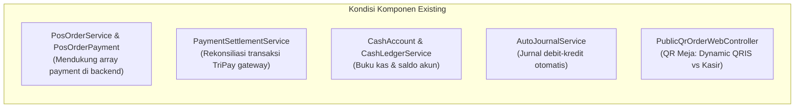
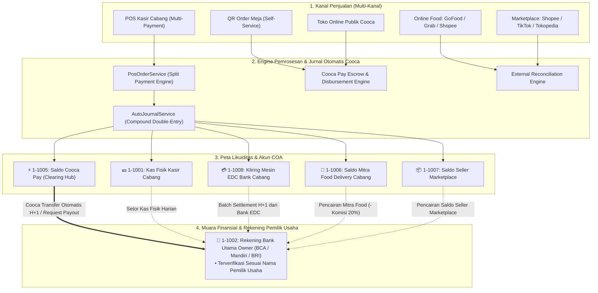

# Audit Sistem Keuangan Existing & Cetak Biru Arsitektur Finansial Terpadu COOCA
## *(Multi-Payment, Multi-Cabang, Multi-EDC, Payout Hub & Rekonsiliasi Omnichannel)*

> **Status Dokumen:** COMPLETE & RATIFIED  
> **Target Pengguna:** Tim Finance, Business Owner (Merchant), Kasir POS, SuperAdmin Cooca, Tim Rekayasa Sistem  
> **Klasifikasi:** Dokumen Arsitektur & Analisis Celah (*System Gap Analysis & Target Architecture Blueprint*)  
> **File Lokasi:** `docs/system/architecture/financial-engine-multi-payment-and-settlement-audit.md`  

---

## 1. Executive Summary & Latar Belakang

Platform **COOCA** dirancang sebagai *Business Operating System (BOS)* terintegrasi untuk bisnis F&B, Retail, dan Jasa multi-kanal di Indonesia. Dalam praktiknya, pelaku usaha UMKM tidak hanya mengandalkan transaksi kasir tatap muka, namun mengelola ekosistem multi-pembayaran yang kompleks:
1. **POS Kasir Fisik:** Transaksi Tunai (*Cash*), Mesin EDC Multi-Bank (BCA, Mandiri, BRI, BNI), QRIS Statis Toko, Transfer Manual, Kasbon Piutang Member, dan Poin Loyalitas.
2. **Kanal Digital Cooca:** Pembayaran *Self-Service* QR Order di Meja (*Dine-In*) dan Toko Online (*Storefront / Pre-Order*) via **Cooca Pay (Dynamic QRIS / Virtual Account)**.
3. **Kanal Food Delivery:** GoFood (GoBiz), GrabFood (GrabMerchant), ShopeeFood (Shopee Partner).
4. **Kanal Marketplace:** Shopee Seller, TikTok Shop, Tokopedia.

Dokumen ini menyajikan hasil **Audit Sistem Existing (As-Is)**, memetakan **Kesenjangan Sistem (*Gap Analysis*)** terhadap target yang disepakati, serta menetapkan **Cetak Biru Solusi Target (To-Be Architecture)** yang mencakup:
* **Transparansi Unit Economics & Lokasi Dana (*Where The Money Lives*)**.
* **Dukungan Penuh Multi-Payment (*Split Payment*)**.
* **Dukungan Multi-Cabang (*Multi-Location Isolation & HQ Consolidation*)**.
* **Manajemen Payout Cooca Pay Dua Sisi (Merchant & Admin Cooca) dengan Aturan Ketat *Strict Owner Identity Matching***.
* **Rekonsiliasi Terpandu untuk Saldo Eksternal (Kasir, EDC, Food App, Marketplace)**.

---

## 2. Audit Sistem Existing (As-Is System Audit)

Berdasarkan penelusuran hulu-ke-hilir pada modul POS, Toko Online, Keuangan, Settlement, dan Akuntansi:



### Inventaris Modul Keuangan Saat Ini:
* `app/Domain/Pos/PosOrderService.php`: Memproses checkout POS, mendukung `sales_channel` (`gofood`, `grabfood`, `shopeefood`, `dine_in`, `takeaway`), dan memproses array `paymentsData`.
* `app/Models/PosOrderPayment.php`: Menyimpan baris pembayaran per order (`cash`, `qris`, `edc_debit`, `edc_credit`, `transfer`, `customer_credit`, `loyalty_points`).
* `app/Domain/Finance/PaymentSettlementService.php`: Memproses rekonsiliasi pembayaran gateway non-tunai, mengalokasikan gross/fee/net, dan menyelesaikan payout.
* `app/Http/Controllers/Admin/AdminSettlementController.php`: Antarmuka SuperAdmin Cooca untuk menyetujui payout dengan upload bukti transfer bank atau menolak pengajuan.
* `app/Models/CashAccount.php` & `CashTransaction.php`: Mencatat saldo akun tipe `cash`, `bank`, dan `ewallet`.
* `app/Domain/Accounting/AutoJournalService.php`: Mencatat jurnal double-entry otomatis untuk penjualan, pelunasan piutang, HPP, beban operasional, dan settlement.

---

## 3. Analisis Kesenjangan Sistem (System Gap Analysis)

Berikut adalah matriks kesenjangan antara kondisi sistem saat ini (*As-Is*) dengan kebutuhan ideal operasional bisnis (*To-Be*):

| No | Dimensi Kebutuhan | Kondisi Sistem Saat Ini (*As-Is*) | Target Kebutuhan Sistem (*To-Be Goals*) | Status Kesenjangan (*Gap*) |
| :-: | :--- | :--- | :--- | :---: |
| **1** | **Branding Ekosistem Cooca Pay** | View settlement masih mengekspos istilah vendor teknis (*"TriPay Escrow / Fee TriPay"*). | **100% Whitelabel Cooca:** Merchant dan pelanggan hanya berinteraksi dengan **Saldo Cooca Pay**. Cooca yang menampung dan mentransfer dana ke merchant. | **GAP TINGGI (P1)** |
| **2** | **Visibilitas Lokasi Dana (*Where The Money Lives*)** | Dashboard kas hanya menampilkan daftar saldo akun terpisah tanpa visualisasi sebaran likuiditas per kanal. | **Executive Bento Dashboard:** Memperlihatkan Omzet, Modal HPP, Laba Bersih, dan Peta Sebaran Saldo 6 Titik (Kasir, Cooca Pay, EDC, Food App, Marketplace, Bank). | **GAP TINGGI (P1)** |
| **3** | **Sistem Multi-Payment (*Split Payment*)** | Backend `PosOrderService` mendukung array, namun UI Terminal POS belum menyediakan modal split payment dinamis dengan kalkulasi instrumen majemuk. | **Interactive Split Payment UI:** Kasir bebas menggabungkan Tunai + EDC BCA + QRIS Cooca dalam 1 pesanan dengan validasi sisa tagihan & kembalian akurat. | **GAP TINGGI (P1)** |
| **4** | **Manajemen Multi-EDC per Cabang** | Pembayaran EDC hanya mencatat kode generik `edc_debit`/`edc_credit` tanpa identitas fisik mesin bank. | **Master Terminal Mesin EDC (`store_edc_terminals`):** Menyimpan daftar mesin EDC (BCA, Mandiri, BRI) terikat cabang beserta nomor Terminal ID (TID) dan Approval Code. | **GAP SEDANG (P2)** |
| **5** | **Manajemen Rekening Penarikan (*Payout Accounts*)** | Rekening penarikan hanya berupa input string manual bebas saat rekonsiliasi. | **Master Rekening Bank Terverifikasi:** Menyimpan data bank merchant dengan **Strict Owner Identity Matching** (Nama pemilik rekening wajib identik dengan pemilik usaha). | **GAP KRITIS (P1)** |
| **6** | **Jadwal & Penarikan Saldo Cooca Pay** | Penarikan dana dilakukan secara manual ad-hoc per pemilihan invoice/order. | **Dual Payout Mode:** Opsi **Auto-Payout H+1 Terjadwal Pagi (09:00 WIB)** atau **Request Penarikan Manual On-Demand** dengan audit trail bukti transfer. | **GAP TINGGI (P1)** |
| **7** | **Rekonsiliasi Saldo Eksternal (Kasir, EDC, Food, MP)** | Belum ada lembar kerja pencatatan saldo awal bulanan dan komparasi saldo riil mitra eksternal. | **Modul Rekonsiliasi Eksternal:** Finance menginput Saldo Awal per 1 bulan, mutasi bertambah dari POS, input nominal penarikan, dan sistem menghitung selisih (*Discrepancy*). | **GAP TINGGI (P1)** |
| **8** | **Isolasi & Konsolidasi Multi-Cabang** | Transaksi memiliki `location_id`, namun akun kas, terminal EDC, dan lembar rekonsiliasi belum terfilter tegas per cabang. | **Branch-Scoped Ledger & HQ Consolidation:** Kasir terisolasi per cabang; Owner & Finance Pusat memiliki filter All Branches vs Cabang Tertentu. | **GAP TINGGI (P1)** |

---

## 4. Cetak Biru Arsitektur Finansial Terpadu (To-Be Architecture Blueprint)



---

## 5. Spesifikasi Basis Data & Skema Entitas Baru

### 5.1 Master Rekening Penarikan Terverifikasi (`merchant_payout_bank_accounts`)
Menjamin dana Cooca Pay hanya bisa dicairkan ke rekening yang **identik dengan nama pemilik usaha terdaftar (*Strict Owner Identity Matching*)**.

```sql
CREATE TABLE merchant_payout_bank_accounts (
    id CHAR(36) PRIMARY KEY,
    business_id CHAR(36) NOT NULL,
    location_id CHAR(36) NULL,                  -- NULL = Rekening Utama HQ, atau spesifik Cabang
    bank_code VARCHAR(30) NOT NULL,             -- BCA, MANDIRI, BRI, BNI, JAGO, SEABANK, PERMATA
    bank_name VARCHAR(100) NOT NULL,            -- PT Bank Central Asia Tbk
    account_number VARCHAR(50) NOT NULL,        -- Nomor Rekening
    account_holder_name VARCHAR(150) NOT NULL,  -- WAJIB SAMA PERSIS DENGAN NAMA PEMILIK USAHA
    is_primary BOOLEAN DEFAULT FALSE,          -- Rekening Utama Penarikan
    is_verified BOOLEAN DEFAULT FALSE,         -- Status Verifikasi Identitas
    verified_at TIMESTAMP NULL,
    created_at TIMESTAMP NULL,
    updated_at TIMESTAMP NULL,
    FOREIGN KEY (business_id) REFERENCES businesses(id) ON DELETE CASCADE,
    FOREIGN KEY (location_id) REFERENCES locations(id) ON DELETE SET NULL,
    UNIQUE (business_id, bank_code, account_number)
);
```

### 5.2 Master Mesin EDC Toko Terikat Cabang (`store_edc_terminals`)
Menyimpan profil mesin EDC per cabang untuk mendukung rekonsiliasi nomor batch settlement bank.

```sql
CREATE TABLE store_edc_terminals (
    id CHAR(36) PRIMARY KEY,
    business_id CHAR(36) NOT NULL,
    location_id CHAR(36) NOT NULL,              -- Terikat ke Cabang Tertentu
    bank_name VARCHAR(50) NOT NULL,             -- BCA, Mandiri, BRI, BNI
    terminal_name VARCHAR(100) NOT NULL,        -- Contoh: EDC BCA Kasir 1 Jakarta
    terminal_id_tid VARCHAR(50) NOT NULL,       -- Nomor TID Mesin Fisik
    merchant_id_mid VARCHAR(50) NULL,           -- Nomor MID Toko
    mdr_debit_percent DECIMAL(5,2) DEFAULT 0.15,
    mdr_credit_percent DECIMAL(5,2) DEFAULT 1.50,
    is_active BOOLEAN DEFAULT TRUE,
    created_at TIMESTAMP NULL,
    updated_at TIMESTAMP NULL,
    FOREIGN KEY (business_id) REFERENCES businesses(id) ON DELETE CASCADE,
    FOREIGN KEY (location_id) REFERENCES locations(id) ON DELETE CASCADE,
    INDEX (business_id, location_id, is_active)
);
```

### 5.3 Lembar Rekonsiliasi Saldo Eksternal Bulanan (`external_account_reconciliations`)
Menyediakan wadah bagi tim finance untuk menginput saldo awal, mencatat penarikan dana, dan membandingkan saldo sisa riil mitra vs kalkulasi sistem Cooca.

```sql
CREATE TABLE external_account_reconciliations (
    id CHAR(36) PRIMARY KEY,
    business_id CHAR(36) NOT NULL,
    location_id CHAR(36) NULL,                  -- Terikat ke Cabang Tertentu / Konsolidasi
    cash_account_id CHAR(36) NOT NULL,          -- Akun Kas / Bank / E-Wallet Terkait
    channel_type VARCHAR(50) NOT NULL,          -- gofood, grabfood, shopee_seller, tiktok_shop, edc_bca, cash_drawer
    period_month VARCHAR(7) NOT NULL,           -- Format YYYY-MM (misal: 2026-10)
    
    beginning_balance DECIMAL(15,2) DEFAULT 0,  -- Saldo Awal diinput Finance per 1 Bulan
    total_pos_inflow DECIMAL(15,2) DEFAULT 0,   -- Penjualan tercatat di POS Cooca
    total_disbursed DECIMAL(15,2) DEFAULT 0,    -- Total dana yang ditarik/dicairkan ke Bank
    expected_ending_balance DECIMAL(15,2) DEFAULT 0, -- (Awal + Inflow - Disbursed)
    actual_ending_balance DECIMAL(15,2) DEFAULT 0,   -- Saldo riil di aplikasi mitra per akhir periode
    discrepancy_amount DECIMAL(15,2) DEFAULT 0,      -- Selisih (Actual - Expected)
    
    status VARCHAR(20) DEFAULT 'draft',         -- draft, matched, discrepancy, closed
    reconciled_by CHAR(36) NULL,
    notes TEXT NULL,
    created_at TIMESTAMP NULL,
    updated_at TIMESTAMP NULL,
    FOREIGN KEY (business_id) REFERENCES businesses(id) ON DELETE CASCADE,
    FOREIGN KEY (location_id) REFERENCES locations(id) ON DELETE SET NULL,
    FOREIGN KEY (cash_account_id) REFERENCES cash_accounts(id) ON DELETE CASCADE,
    UNIQUE (business_id, cash_account_id, period_month)
);
```

---

## 6. Standar Jurnal Akuntansi Double-Entry Terpadu

| Peristiwa Transaksi | Sisi Debit | Sisi Kredit | Dampak Likuiditas |
| :--- | :--- | :--- | :--- |
| **POS Split Payment (Rp 100rb Tunai + Rp 300rb EDC BCA)** | • `1-1001` Kas Fisik `Rp 100.000`<br>• `1-1008` Kliring EDC BCA `Rp 300.000`<br>• `5-5001` HPP `Rp 180.000` | • `4-4001` Pendapatan POS `Rp 400.000`<br>• `1-1004` Persediaan Bahan `Rp 180.000` | Kas fisik laci bertambah Rp 100rb, Kliring EDC bertambah Rp 300rb. |
| **Penjualan QR Meja / Toko Cooca Pay (Rp 200rb)** | • `1-1005` Saldo Cooca Pay `Rp 200.000`<br>• `5-5001` HPP `Rp 90.000` | • `4-4001` Pendapatan QR/Online `Rp 200.000`<br>• `1-1004` Persediaan Bahan `Rp 90.000` | Saldo Cooca Pay bertambah Rp 200rb siap ditarik. |
| **Penjualan GoFood (Rp 150rb)** | • `1-1006` Saldo GoFood `Rp 150.000`<br>• `5-5001` HPP `Rp 60.000` | • `4-4001` Pendapatan GoFood `Rp 150.000`<br>• `1-1004` Persediaan Bahan `Rp 60.000` | Saldo GoBiz bertambah Rp 150rb di aplikasi Gojek. |
| **Cooca Payout ke Rekening Owner (Rp 5jt, Fee Rp 35rb)** | • `1-1002` Bank BCA Owner `Rp 4.965.000`<br>• `6-6003` Biaya Layanan Cooca `Rp 35.000` | • `1-1005` Saldo Cooca Pay `Rp 5.000.000` | Saldo Cooca Pay menjadi Rp 0, Rekening Bank bertambah Rp 4.965.000. |
| **Pencairan Gojek ke Rekening Toko (Rp 1jt, Komisi 20%)** | • `1-1002` Bank BCA Toko `Rp 800.000`<br>• `6-6003` Beban Komisi GoFood `Rp 200.000` | • `1-1006` Saldo GoFood `Rp 1.000.000` | Saldo GoBiz berkurang Rp 1jt, Rekening Bank bertambah Rp 800rb. |

---

## 7. Desain Antarmuka Eksekutif Bento Apple HIG

### 7.1 Dashboard Likuiditas Finansial Terpadu (`/finance/cash-bank`)
Menyajikan matriks konsolidasi multi-cabang dengan visualisasi lokasi saldo secara transparan:

```
┌──────────────────────────────────────────────────────────────────────────────────────────────────────────┐
│ KONSOLIDASI FINANSIAL BISNIS                                   [ FILTER: SEMUA CABANG (KONSOLIDASI) ▼ ]  │
├──────────────────────────────────────────────────────────────────────────────────────────────────────────┤
│ 📊 PERFORMA PENJUALAN KONSOLIDASIAN (OKTOBER 2026)                                                       │
│ • Total Omzet Penjualan : Rp 128.500.000 (Cabang JKT: Rp 72jt | Cabang BDG: Rp 56.5jt)                 │
│ • Total Modal HPP Riil  : Rp  58.200.000                                                                 │
│ • Laba Kotor Bisnis     : Rp  70.300.000 (Gross Margin: 54.7%)                                           │
├──────────────────────────────────────────────────────────────────────────────────────────────────────────┤
│ 📍 PETA LIKUIDITAS & LOKASI DANA KONSOLIDASIAN                                                          │
│                                                                                                          │
│ 1. ⚡ SALDO COOCA PAY (Semua Cabang)       : Rp 18.450.000  → [ Tarik ke Rekening Owner ]                │
│ 2. 💵 KAS FISIK LACI (Semua Cabang)        : Rp  8.200.000  (JKT: Rp 4.5jt | BDG: Rp 3.7jt)              │
│ 3. 💳 MESIN EDC MULTI-BANK (Kliring H+1)   : Rp 24.150.000  (EDC BCA JKT: Rp 14jt | EDC Mandiri BDG: Rp 10.15jt)│
│ 4. 🛵 SALDO MITRA FOOD DELIVERY            : Rp 28.200.000  (GoBiz JKT & BDG | GrabMerchant)             │
│ 5. 📦 SALDO SELLER MARKETPLACE             : Rp 34.500.000  (Shopee & TikTok Shop Seller)                │
│ 6. 🏦 REKENING BANK UTAMA HQ (BCA 8820xxxx): Rp 15.000.000  (Dana Likuid Pemilik)                        │
├──────────────────────────────────────────────────────────────────────────────────────────────────────────┤
│ 🎯 TOTAL ESTIMASI LIKUIDITAS BISNIS: Rp 128.500.000                                                      │
└──────────────────────────────────────────────────────────────────────────────────────────────────────────┘
```

---

## 8. Roadmap & Urutan Implementasi Teknis

| Fase | Modul Terdampak | Rincian Pekerjaan Rekayasa |
| :---: | :--- | :--- |
| **Fase 1** | **UI QR Order Meja** ([`menu.blade.php`](file:///c:/laragon/www/cooca_core/resources/views/public/qr-order/menu.blade.php)) | Perbarui pilihan metode pembayaran: *Bayar QRIS Cooca Pay* (Bebas antre, auto-proses dapur) vs *Bayar di Kasir* (Tunai/EDC/QR Kasir). |
| **Fase 2** | **Master Rekening Penarikan & EDC Toko** | Buat migration `merchant_payout_bank_accounts` dan `store_edc_terminals` dengan validasi *Strict Owner Identity Matching*. |
| **Fase 3** | **Cooca Payout Hub & Payout Management** | Perbarui modul settlement merchant dan admin portal menjadi **Cooca Pay Payout Hub** dengan opsi Auto-Payout H+1 & Manual Request. |
| **Fase 4** | **POS Multi-Payment (Split Payment)** | Tambahkan modal interaktif di POS Terminal untuk input multi-metode pembayaran (Tunai + EDC + QRIS + Voucher) per transaksi. |
| **Fase 5** | **Lembar Rekonsiliasi Eksternal** | Bangun antarmuka rekonsiliasi bulanan untuk Saldo Awal, Inflow POS, Penarikan, dan Sisa Saldo GoBiz/Shopee/EDC per cabang. |

---

> **Persetujuan Dokumen:** Dokumen ini menjadi rujukan resmi rekayasa sistem (*Architecture Specification & Standard of Procedure*) untuk seluruh pengembangan modul keuangan, POS, dan payment gateway di ekosistem COOCA.
