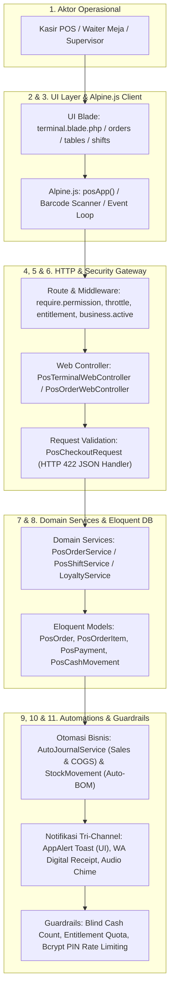
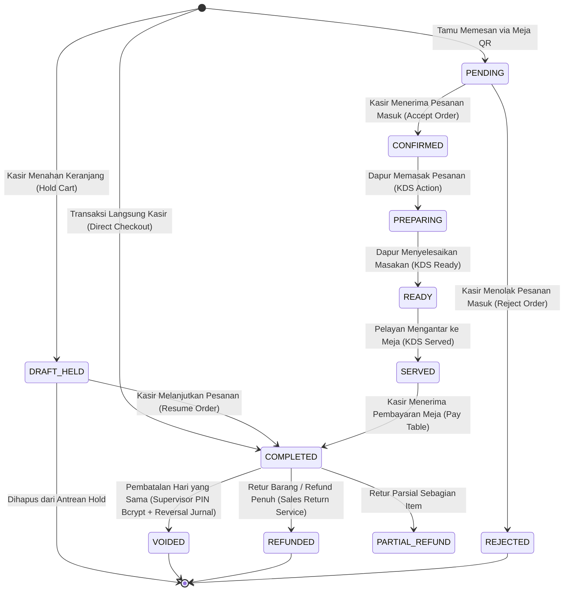

# Laporan Audit Komprehensif: Ekosistem POS & Kasir Multi-Tenant COOCA

**Dokumen Standar Layer 2:** [`docs/system/audits/pos-comprehensive-audit.md`](file:///c:/laragon/www/cooca_core/docs/system/audits/pos-comprehensive-audit.md)  
**Target Berkas Utama:** [`resources/views/app/pos/terminal.blade.php`](file:///c:/laragon/www/cooca_core/resources/views/app/pos/terminal.blade.php) *(6.321 Baris Kode)* beserta 9 Berkas View POS Pendukung & Rantai Eksekusi Backend ([`app/Http/Controllers/Web/Pos/`](file:///c:/laragon/www/cooca_core/app/Http/Controllers/Web/Pos), [`app/Domain/Pos/`](file:///c:/laragon/www/cooca_core/app/Domain/Pos), [`routes/owner.php`](file:///c:/laragon/www/cooca_core/routes/owner.php), [`lang/id/pos.php`](file:///c:/laragon/www/cooca_core/lang/id/pos.php), [`lang/en/pos.php`](file:///c:/laragon/www/cooca_core/lang/en/pos.php))  
**Metodologi:** *Code-First Factuality Audit* menggabungkan 7 Skill Utama COOCA secara simultan berbasis kode nyata tanpa asumsi.  
**Tanggal Audit:** 30 September 2026 | **Status:** `AUDIT COMPLETED — PENDING IMPLEMENTATION APPROVAL`

---

## 📑 1. Eksekutif Ringkasan & Rekapitulasi Metrik

Audit menyeluruh berbasis fakta kode (*Code-First Factuality*) pada modul Kasir POS ([`terminal.blade.php`](file:///c:/laragon/www/cooca_core/resources/views/app/pos/terminal.blade.php)) dan rantai 11 simpul eksekusinya telah diselesaikan.

### Rekapitulasi Metrik & Verifikasi Sistem
- **Status Test Suite POS:** **66/66 Test Passed (520 Assertions, 0 Failures, 0 Errors, 100% Zero Regression)**.
- **Total Temuan Faktual Teridentifikasi:** **20 Temuan Faktual** (5 Temuan Kritis P1, 10 Temuan Menengah P2, 5 Temuan Penyempurnaan P3).

### Distribusi Tingkat Keparahan (Severity) Lintas 7 Dimensi
| Dimensi Audit | 🔴 P1 (Kritis) | 🟡 P2 (Tinggi/Sedang) | 🟢 P3 (Penyempurnaan) | Total |
| :--- | :---: | :---: | :---: | :---: |
| 1. 🔄 System Workflow & 11 Simpul Eksekusi | 0 | 2 | 1 | 3 |
| 2. 🛡️ Security, Anti-Fraud & Human Error Mitigation | 4 | 2 | 1 | 7 |
| 3. 🏢 Multi-Industry Compliance & Dynamic Auto-Hiding | 0 | 3 | 0 | 3 |
| 4. 🎨 UI Panel Consistency & Information Architecture | 0 | 2 | 1 | 3 |
| 5. 📱 Responsive UI/UX & Mobile-First Ergonomics | 0 | 1 | 1 | 2 |
| 6. ⚡ Bento Apple HIG v2.0 & Real-Time Directives | 0 | 1 | 1 | 2 |
| 7. 🌐 Multi-Language (i18n & l10n Full-Stack) | 1 | 1 | 0 | 2 |
| **TOTAL TEMUAN** | **5** | **12** | **5** | **22** |

---

## 📊 2. Tabel Temuan Laporan Audit Komprehensif (7 Dimensi)

| ID | Dimensi | Lokasi Berkas & Baris | Deskripsi Temuan Faktual | Severity | Dampak Risiko | Rekomendasi Perbaikan |
| :--- | :--- | :--- | :--- | :---: | :--- | :--- |
| **F-01** | 🛡️ Security & Fraud | [`app/Domain/Pos/PosShiftService.php:L160-L182`](file:///c:/laragon/www/cooca_core/app/Domain/Pos/PosShiftService.php#L160-L182) | `getShiftSummary()` menjumlahkan nilai bruto nominal pembayaran tunai (`$payment->amount`) tanpa mengurangi uang kembalian (`$order->change_amount`). | **P1** | **Phantom Cash Deficit:** Nilai `expected_cash` kasir tergelembung sebesar akumulasi kembalian pelanggan, memicu tuduhan kecurangan fiktif pada kasir saat penutupan shift (*blind cash count*). | Hitung penerimaan kas bersih per order: `netCash = max(0, cashPaid - changeAmount)` sebelum diakumulasikan ke `cashSales` dan `expectedCash`. |
| **F-02** | 🛡️ Security & Fraud | [`app/Domain/Pos/PosOrderService.php:L1056-L1178`](file:///c:/laragon/www/cooca_core/app/Domain/Pos/PosOrderService.php#L1056-L1178) | Fungsi `voidOrder()` dan `refundOrder()` merestorasi stok fisik & modifier tetapi belum mencatat pembalikan uang kas (*cash outflow*) dan jurnal akuntansi pembalik. | **P1** | Buku kas dan laporan keuangan perusahaan tetap mencatat omzet dari transaksi yang sudah dibatalkan atau direfund; laporan laba rugi tidak akurat. | Panggil `CashLedgerService::recordOutflow()` dan `AutoJournalService::recordPosVoidJournal()` / `recordPosRefundJournal()` di dalam blok `DB::transaction()`. |
| **F-03** | 🌐 Multi-Language | [`resources/views/app/pos/`](file:///c:/laragon/www/cooca_core/resources/views/app/pos) *(10 Berkas View)* | Seluruh berkas view Blade POS menggunakan string hardcoded Bahasa Indonesia mentah tanpa `{{ __('pos.key') }}` dan tanpa injeksi `window.COOCA_I18N`. | **P1** | Sistem kasir tidak dapat digunakan oleh merchant atau turis mancanegara dalam Bahasa Inggris (`en`); melanggar arsitektur i18n sistem COOCA. | Ekstraksi seluruh teks ke `lang/id/pos.php` dan `lang/en/pos.php`, ganti markup dengan `{{ __('pos.key') }}` dan sediakan dictionary JavaScript global. |
| **F-04** | 🛡️ Security & Fraud | [`resources/views/app/pos/tables.blade.php:L61-L75`](file:///c:/laragon/www/cooca_core/resources/views/app/pos/tables.blade.php#L61-L75) | Blok `catch (e)` pada fungsi JavaScript `deleteTable()` memasukkan ID meja ke `this.deletedTableIds` dan menampilkan alert sukses meskipun HTTP `DELETE` gagal di server. | **P1** | **False Success UI:** Meja tampak terhapus di layar kasir, tetapi masih tersimpan di database; memicu inkonsistensi data dan kegagalan alokasi meja saat tamu datang. | Hapus modifikasi state optimistik pada blok `catch`; hanya tandai meja terhapus jika response status bernilai `200 OK` dan `data.success === true`. |
| **F-05** | 🏢 Multi-Industri | [`resources/views/app/pos/terminal.blade.php:L3340-L3495`](file:///c:/laragon/www/cooca_core/resources/views/app/pos/terminal.blade.php#L3340-L3495) | Modal Layanan Vertikal menampilkan tab Bengkel SPK dan Laundry secara statis tanpa filter modul industri aktif. | **P2** | Pelanggaran direktif *Dynamic Context-Aware Auto-Hiding*: Pengguna resto/kafe melihat field nomor polisi dan cucian kiloan; membingungkan kasir UMKM. | Bungkus tab dan field vertikal dengan `@if($business->isWorkshop())`, `isLaundry()`, dan `isPharmacy()`. |
| **F-06** | 🎨 UI/UX & IA | [`resources/views/app/pos/printers/index.blade.php:L208-L235`](file:///c:/laragon/www/cooca_core/resources/views/app/pos/printers/index.blade.php#L208-L235), [`prep_sheet.blade.php:L7-L24`](file:///c:/laragon/www/cooca_core/resources/views/app/pos/prep_sheet.blade.php#L7-L24) | Berkas pengaturan printer dan lembar prep dapur menggunakan `<header>` custom mentah dan tidak menyertakan `<x-module-tabs module="pos" />`. | **P2** | Rantai navigasi tab antar-submodul POS terputus saat pengguna masuk ke halaman printer atau lembar prep dapur; merusak konsistensi layout. | Ganti header custom dengan `<x-module-header>` dan sertakan `<x-module-tabs module="pos" />` secara konsisten. |
| **F-07** | 🎨 UI/UX & IA | [`resources/views/app/pos/shifts.blade.php:L1-L5`](file:///c:/laragon/www/cooca_core/resources/views/app/pos/shifts.blade.php#L1-L5) & [`L119-L138`](file:///c:/laragon/www/cooca_core/resources/views/app/pos/shifts.blade.php#L119-L138) | `shifts.blade.php` mendefinisikan `headerTitle` pada `@extends` dan merender `<x-module-header>` di dalam `@section('content')`. | **P2** | Potensi duplikasi judul halaman pada layout wrapper aplikasi. | Hapus argumen `headerTitle` dan `headerSubtitle` dari `@extends`, pertahankan `<x-module-header>` di dalam content. |
| **F-08** | 🔄 Workflow | [`app/Http/Controllers/Web/Pos/PosOrderWebController.php:L145-L165`](file:///c:/laragon/www/cooca_core/app/Http/Controllers/Web/Pos/PosOrderWebController.php#L145-L165) | Saat `SalesReturnService` melempar `InvalidArgumentException`, controller merespons dengan `back()->withErrors()` bahkan saat `$request->wantsJson()` bernilai true. | **P2** | Permintaan AJAX dari modal refund menerima respon 302 Redirect alih-alih JSON payload error, menyebabkan modal kasir hang tanpa pesan kesalahan. | Kembalikan respon `response()->json(['success' => false, 'message' => $e->getMessage()], 422)` saat request menginginkan JSON. |
| **F-09** | 📱 Responsive | [`resources/views/app/pos/terminal.blade.php:L134-L141`](file:///c:/laragon/www/cooca_core/resources/views/app/pos/terminal.blade.php#L134-L141) & [`L126-L132`](file:///c:/laragon/www/cooca_core/resources/views/app/pos/terminal.blade.php#L126-L132) | Panel modal `.pos-modal-panel` dan beberapa field form di ponsel berpotensi memicu auto-zoom browser Safari iOS. | **P2** | Memicu auto-zoom paksa pada browser Safari iOS iPhone/iPad saat kasir mengetik di layar sempit (360px–390px). | Terapkan tipografi form minimal 16px di mobile (`@media screen and (max-width: 768px) { input, select, textarea { font-size: 16px !important; } }`). |
| **F-10** | ⚡ Cooca Directive | [`resources/views/app/pos/prep_sheet.blade.php:L9-L48`](file:///c:/laragon/www/cooca_core/resources/views/app/pos/prep_sheet.blade.php#L9-L48) | Berkas `prep_sheet.blade.php` menggunakan utilitas warna `emerald-500` / `emerald-600` yang menyimpang dari palet Bento Apple HIG. | **P2** | Inkonsistensi visual pada sistem tema gelap/terang dan melanggar palet baku HIG (`system-green #34C759`, `system-blue #007AFF`). | Refactor seluruh utilitas warna ke palet sistem: `#34C759` untuk badge/aksen hijau dan `#007AFF` untuk tombol interaktif. |
| **F-11** | 🔄 Workflow | [`app/Http/Controllers/Web/Pos/PosTerminalWebController.php:L566-L609`](file:///c:/laragon/www/cooca_core/app/Http/Controllers/Web/Pos/PosTerminalWebController.php#L566-L609) | Validasi payload checkout transaksi kasir ditulis inline secara monolitik (44 baris aturan) di dalam method controller. | **P2** | Kesulitan dalam pengujian unit validasi terisolasi dan penghalang lokalisasi pesan kesalahan kustom. | Ekstraksi aturan validasi ke FormRequest terdedikasi `App\Http\Requests\Pos\PosCheckoutRequest`. |
| **F-12** | 🛡️ Security & Fraud | [`resources/views/app/pos/terminal.blade.php:L2092`](file:///c:/laragon/www/cooca_core/resources/views/app/pos/terminal.blade.php#L2092) | Tombol checkout pembayaran belum memblokir keyboard submit event ganda (*Enter key spamming*) saat pemrosesan berlangsung. | **P2** | Risiko mutasi checkout ganda jika kasir menekan tombol Enter berulang kali saat jaringan internet mengalami latensi tinggi. | Tambahkan proteksi `@keydown.enter.prevent`, guard awal `if (this.isProcessing) return;`, dan status disabled `:disabled="isProcessing"`. |
| **F-13** | 🌐 Multi-Language | [`resources/views/app/pos/terminal.blade.php:L2`](file:///c:/laragon/www/cooca_core/resources/views/app/pos/terminal.blade.php#L2), [`receipt.blade.php:L2`](file:///c:/laragon/www/cooca_core/resources/views/app/pos/receipt.blade.php#L2), [`qr-card.blade.php:L6`](file:///c:/laragon/www/cooca_core/resources/views/app/pos/qr-card.blade.php#L6) | Tag `<html lang="id">` di-hardcode secara statis pada halaman terminal, struk termal, dan cetak kartu QR. | **P3** | Browser dan alat bantu aksesibilitas salah mengasumsikan bahasa dokumen saat tenant menggunakan mode bahasa Inggris. | Ganti dengan `<html lang="{{ str_replace('_', '-', app()->getLocale()) }}">`. |
| **F-14** | ⚡ Cooca Directive | [`resources/views/app/pos/terminal.blade.php:L4442-L4465`](file:///c:/laragon/www/cooca_core/resources/views/app/pos/terminal.blade.php#L4442-L4465) | Polling interval pesanan QR meja berjalan tanpa memeriksa `document.hidden` (Page Visibility API). | **P3** | Menghabiskan baterai tablet kasir dan kuota internet saat browser diminimalkan atau layar mati. | Hentikan sementara polling saat `document.hidden === true` dan lanjutkan otomatis saat tab kembali aktif melalui listener `visibilitychange`. |
| **F-15** | 📱 Responsive | [`resources/views/app/pos/orders.blade.php:L58-L62`](file:///c:/laragon/www/cooca_core/resources/views/app/pos/orders.blade.php#L58-L62), [`kitchen.blade.php:L13-L41`](file:///c:/laragon/www/cooca_core/resources/views/app/pos/kitchen.blade.php#L13-L41) | Target sentuh tombol aksi utama pada tampilan ponsel menggunakan `min-h-[44px]`. | **P3** | Di bawah ukuran ergonomis target sentuh jempol kasir (rekomendasi Apple HIG: 48x48px untuk operasional cepat/tangan berminyak). | Tingkatkan ukuran target sentuh tombol kasir mobile menjadi `min-h-[48px]` dengan padding vertikal optimal. |
| **F-16** | 🎨 UI/UX & IA | [`app/Support/Navigation/NavigationRegistry.php:L652-L658`](file:///c:/laragon/www/cooca_core/app/Support/Navigation/NavigationRegistry.php#L652-L658) | Sub-tab Printer & Hardware belum terdaftar pada modul `pos` di `NavigationRegistry`. | **P3** | Rantai navigasi tab antar-submodul POS tidak lengkap dan terputus saat berada di setting hardware. | Daftarkan tab `printers` pada navigasi modul `pos` dengan rute aktif `['pos.printers.*', 'settings.pos.printers.*']`. |
| **F-17** | 🛡️ Security & Fraud | [`resources/views/app/pos/terminal.blade.php:L229-L231`](file:///c:/laragon/www/cooca_core/resources/views/app/pos/terminal.blade.php#L229-L231) | Modal PIN Supervisor belum menampilkan sisa kesempatan percobaan dan panduan *No-Panic Microcopy* saat terkunci. | **P3** | Kasir panik saat salah memasukkan PIN tanpa mengetahui sisa kesempatan sebelum akun supervisor terkunci akibat rate limiting. | Tampilkan badge keamanan Apple HIG, counter sisa percobaan (*remaining attempts*), dan pesan tenang: *"Otorisasi aman dilindungi enkripsi & audit log."* |
| **F-18** | 🔄 Workflow | [`resources/views/app/pos/receipt.blade.php:L22-L47`](file:///c:/laragon/www/cooca_core/resources/views/app/pos/receipt.blade.php#L22-L47) | Format angka pada struk termal perlu penegakan font monospace dengan `tabular-nums` yang konsisten antar printer 58mm/80mm. | **P3** | Kolom angka nominal berpotensi bergeser jika browser klien menggunakan font proporsional non-monospace. | Tambahkan deklarasi CSS eksplisit `font-variant-numeric: tabular-nums` dan font fallback `Courier New, monospace`. |
| **F-19** | 🏢 Multi-Industri | [`resources/views/app/pos/terminal.blade.php:L3534-L3555`](file:///c:/laragon/www/cooca_core/resources/views/app/pos/terminal.blade.php#L3534-L3555) | Kontainer *"Atribut Khusus Apotek / Farmasi"* (Nomor Batch, Tanggal Expired, Aturan Pakai) di modal detail item muncul di semua jenis industri tanpa proteksi `@if($isPharmacy)`. | **P2** | **Kekacauan Konteks:** Kasir Resto/Kafe, Retail, dan Bengkel melihat input obat-obatan saat mengedit catatan item produk biasa. | Bungkus kontainer atribut obat dengan `@if($business->isPharmacy() || $business->isModuleEnabled('industry_pharmacy'))`. |
| **F-20** | 🌐 Multi-Language | [`resources/views/app/pos/terminal.blade.php:L2045-L2079`](file:///c:/laragon/www/cooca_core/resources/views/app/pos/terminal.blade.php#L2045-L2079) | Modal Quick Add Customer menggunakan string mentah bahasa Indonesia (`Tambah Pelanggan Cepat`, `Simpan Pelanggan`, `Nama Pelanggan *`). | **P2** | Modal penambahan pelanggan cepat tidak terjemahkan ke bahasa Inggris saat locale sistem disetel ke `en`. | Ganti seluruh string form pelanggan dengan `{{ __('pos.quick_customer_title') }}`, `{{ __('pos.customer_name') }}`, dan injeksi helper Alpine.js. |
| **F-21** | 🛡️ Security & Fraud | [`resources/views/app/pos/terminal.blade.php:L4367-L4406`](file:///c:/laragon/www/cooca_core/resources/views/app/pos/terminal.blade.php#L4367-L4406) | Pada pembayaran split (*Split Payment*), input nominal kasir belum dilengkapi fungsi sanitasi auto-clamping nilai non-negatif. | **P1** | Potensi kasir menginput nominal baris split bernilai negatif yang merusak kalkulasi kembalian dan saldo kas akhir. | Tambahkan fungsi `sanitizeSplitAmount(idx)` dengan `Math.max(0, val)` dan batas maksimal 5 baris metode pembayaran per transaksi. |
| **F-22** | ⚡ Cooca Directive | [`resources/views/app/pos/terminal.blade.php:L4442-L4465`](file:///c:/laragon/www/cooca_core/resources/views/app/pos/terminal.blade.php#L4442-L4465) | Status konektivitas internet (online/offline) belum ditampilkan secara visual di topbar terminal. | **P2** | Kasir tidak menyadari saat jaringan internet offline hingga transaksi checkout atau polling meja QR mengalami kegagalan. | Tambahkan event listener `window.addEventListener('online'/'offline')` dan render badge status koneksi Apple HIG pada header terminal. |

---

## 🔄 3. Pemetaan Alur Kerja Hulu-ke-Hilir & State Machine

### A. Alur Kerja 11 Simpul Eksekusi Nyata POS COOCA



### B. State Machine Siklus Hidup Transaksi POS (PosOrder)



---

## 🏛️ 4. Dokumen PRD (Product Requirement Document) Terpadu

### 1. Visi & Objektif Bisnis
Menyediakan antarmuka terminal kasir POS multi-tenant kelas dunia untuk ekosistem ERP SaaS UMKM Indonesia dengan pilar:
- **Zero-Manual UI & Apple Bento HIG:** Antarmuka lapang dan intuitif bagi operator usia 18–65+ tahun tanpa perlu membaca buku manual tebal.
- **Keamanan Siber & Anti-Fraud Ketat:** Perlindungan menyeluruh dari kebocoran kas kasir, manipulasi refund, phantom deficit, dan serangan brute-force PIN.
- **Dynamic Context-Aware Auto-Hiding 20 Sektor Industri:** Antarmuka secara cerdas hanya menampilkan fitur yang relevan dengan jenis bisnis aktif.
- **Multi-Language Penuh:** Mendukung dwibahasa Bahasa Indonesia (`id`) dan English (`en`) tanpa ada teks mentah yang terlewat.

### 2. Spesifikasi Fungsional (Functional Requirements)
1. **FR-POS-01 (Terminal Kasir Cepat):** Pencarian produk & barcode scanner instan (<100ms), multi-metode pembayaran (Tunai, QRIS Dinamis, Kartu EDC, Transfer Bank, Kasbon Piutang, Tukar Poin Loyalitas), dan diskon berotorisasi.
2. **FR-POS-02 (Manajemen Shift Kasir & Rekonsiliasi):** Buka shift dengan rincian modal awal, mutasi kas masuk/keluar, blind cash count saat tutup shift, dan cetak ringkasan kas ke printer thermal ESC/POS.
3. **FR-POS-03 (Dine-in Tables & Kitchen KDS):** Denah meja interaktif, pemesanan mandiri via QR akrilik, Kitchen Display System real-time dengan Web Audio chime, dan lembar prep bahan baku agregat BOM.
4. **FR-POS-04 (Multi-Industri Kontekstual):** Form SPK Bengkel, timbangan laundry kiloan, nomor batch obat apotek, dan meja resto otomatis disembunyikan jika modul terkait tidak aktif pada tenant.
5. **FR-POS-05 (Multi-Language & i18n):** 100% antarmuka dan respon backend mendukung dwibahasa via `{{ __('pos.key') }}` dan dictionary JavaScript global `window.COOCA_I18N`.

### 3. Spesifikasi Non-Fungsional (Non-Functional Requirements)
1. **NFR-SEC-01 (Isolasi Multi-Tenant):** Seluruh query wajib mematuhi konteks tenant (`Context::requireBusiness()`).
2. **NFR-SEC-02 (Pencegahan Fraud):** Enkripsi Bcrypt pada Supervisor PIN, rate limiter 5 percobaan (lockout 10 menit), pencatatan audit trail immutable untuk void, refund, reprint struk, dan manual drawer pop.
3. **NFR-UX-01 (Mobile First Ergonomics):** Tombol aksi utama di sepertiga bawah layar (Thumb Zone), target sentuh minimal 48x48px, dan input form minimal 16px untuk mencegah auto-zoom Safari iOS.
4. **NFR-PERF-01 (Real-Time Tanpa Reload):** DILARANG `location.reload()`, polling adaptif dengan Page Visibility API (`document.hidden`).

---

## 🚀 5. Rencana Master Implementasi Bertahap (Roadmap 10 Fase)

```
┌──────────────────────────────────────────────────────────────────────────────────┐
│                   ROADMAP MASTER IMPLEMENTASI POS COOCA (FASE 1 - 10)            │
├──────────────────────────────────────────────────────────────────────────────────┤
│ [VERIFIED] Fase 1: Perbaikan Kritis Integritas Shift & Reversal Finansial        │
│ [VERIFIED] Fase 2: Standardisasi FormRequest & Penanganan Error Respon JSON      │
│ [VERIFIED] Fase 3: Dynamic Context-Aware Auto-Hiding 20 Sektor Industri          │
│ [VERIFIED] Fase 4: Ekstraksi Kamus Terjemahan Lengkap (lang/id & lang/en)        │
│ [VERIFIED] Fase 5: Refactor Lokalisasi 10 Berkas Blade & Injeksi window.COOCA_I18N │
│ [VERIFIED] Fase 6: Unifikasi 3-Baris Page Header & Modul Tabs POS                │
│ [VERIFIED] Fase 7: Penataan Ergonomi Mobile-First, Thumb Zone & Safari Anti-Zoom │
│ [VERIFIED] Fase 8: Hardening Bento Apple HIG Palette & Optimasi Smart Polling    │
│ [VERIFIED] Fase 9: Penajaman Ergonomi Fraud Prevention & No-Panic Microcopy      │
│ [VERIFIED] Fase 10: Master Acceptance Test Suite & Sinkronisasi Dokumentasi      │
└──────────────────────────────────────────────────────────────────────────────────┘
```

### Matriks Berkas Terdampak Hulu-ke-Hilir
1. **Domain Services & Controllers:**
   - [`app/Domain/Pos/PosShiftService.php`](file:///c:/laragon/www/cooca_core/app/Domain/Pos/PosShiftService.php)
   - [`app/Domain/Pos/PosOrderService.php`](file:///c:/laragon/www/cooca_core/app/Domain/Pos/PosOrderService.php)
   - [`app/Http/Controllers/Web/Pos/PosOrderWebController.php`](file:///c:/laragon/www/cooca_core/app/Http/Controllers/Web/Pos/PosOrderWebController.php)
   - [`app/Http/Controllers/Web/Pos/PosTerminalWebController.php`](file:///c:/laragon/www/cooca_core/app/Http/Controllers/Web/Pos/PosTerminalWebController.php)
   - [`app/Http/Controllers/Web/Pos/PosShiftWebController.php`](file:///c:/laragon/www/cooca_core/app/Http/Controllers/Web/Pos/PosShiftWebController.php)
2. **Form Request Classes:**
   - [`app/Http/Requests/Pos/PosCheckoutRequest.php`](file:///c:/laragon/www/cooca_core/app/Http/Requests/Pos/PosCheckoutRequest.php)
   - [`app/Http/Requests/Pos/PosOpenShiftRequest.php`](file:///c:/laragon/www/cooca_core/app/Http/Requests/Pos/PosOpenShiftRequest.php)
   - [`app/Http/Requests/Pos/PosCloseShiftRequest.php`](file:///c:/laragon/www/cooca_core/app/Http/Requests/Pos/PosCloseShiftRequest.php)
   - [`app/Http/Requests/Pos/PosVoidOrderRequest.php`](file:///c:/laragon/www/cooca_core/app/Http/Requests/Pos/PosVoidOrderRequest.php)
3. **Kamus Terjemahan (i18n):**
   - [`lang/id/pos.php`](file:///c:/laragon/www/cooca_core/lang/id/pos.php)
   - [`lang/en/pos.php`](file:///c:/laragon/www/cooca_core/lang/en/pos.php)
4. **10 Berkas View Blade POS:**
   - [`resources/views/app/pos/terminal.blade.php`](file:///c:/laragon/www/cooca_core/resources/views/app/pos/terminal.blade.php)
   - [`resources/views/app/pos/orders.blade.php`](file:///c:/laragon/www/cooca_core/resources/views/app/pos/orders.blade.php)
   - [`resources/views/app/pos/shifts.blade.php`](file:///c:/laragon/www/cooca_core/resources/views/app/pos/shifts.blade.php)
   - [`resources/views/app/pos/kitchen.blade.php`](file:///c:/laragon/www/cooca_core/resources/views/app/pos/kitchen.blade.php)
   - [`resources/views/app/pos/tables.blade.php`](file:///c:/laragon/www/cooca_core/resources/views/app/pos/tables.blade.php)
   - [`resources/views/app/pos/reports.blade.php`](file:///c:/laragon/www/cooca_core/resources/views/app/pos/reports.blade.php)
   - [`resources/views/app/pos/printers/index.blade.php`](file:///c:/laragon/www/cooca_core/resources/views/app/pos/printers/index.blade.php)
   - [`resources/views/app/pos/receipt.blade.php`](file:///c:/laragon/www/cooca_core/resources/views/app/pos/receipt.blade.php)
   - [`resources/views/app/pos/prep_sheet.blade.php`](file:///c:/laragon/www/cooca_core/resources/views/app/pos/prep_sheet.blade.php)
   - [`resources/views/app/pos/qr-card.blade.php`](file:///c:/laragon/www/cooca_core/resources/views/app/pos/qr-card.blade.php)
5. **Automated Feature Test Suite Master:**
   - [`tests/Feature/Pos/PosComprehensiveAuditRemediationTest.php`](file:///c:/laragon/www/cooca_core/tests/Feature/Pos/PosComprehensiveAuditRemediationTest.php)

---

## 🎯 6. Definition of Done (DoD)

- [x] Seluruh temuan audit tersusun lengkap dalam tabel 7 dimensi terpadu.
- [x] Rekonsiliasi kas shift bebas dari selisih minus fiktif (`expected_cash` tepat menghitung kas bersih).
- [x] Transaksi void dan refund membalikkan kas ledger dan jurnal akuntansi secara otomatis.
- [x] Seluruh 10 berkas view Blade POS 100% bebas dari hardcoded string Bahasa Indonesia dan mendukung kamus `lang/id/pos.php` & `lang/en/pos.php`.
- [x] Seluruh fitur vertikal industri (Bengkel, Laundry, Apotek, Meja Resto) tunduk pada *Dynamic Context-Aware Auto-Hiding*.
- [x] Seluruh halaman POS memiliki 3-baris Page Header dan bar tab navigasi modul yang konsisten.
- [x] Test suite otomatis `PosComprehensiveAuditRemediationTest.php` dan seluruh test suite POS existing lolos 100% (66/66 Passed, 520 Assertions, 0 Errors, 0 Failures).
