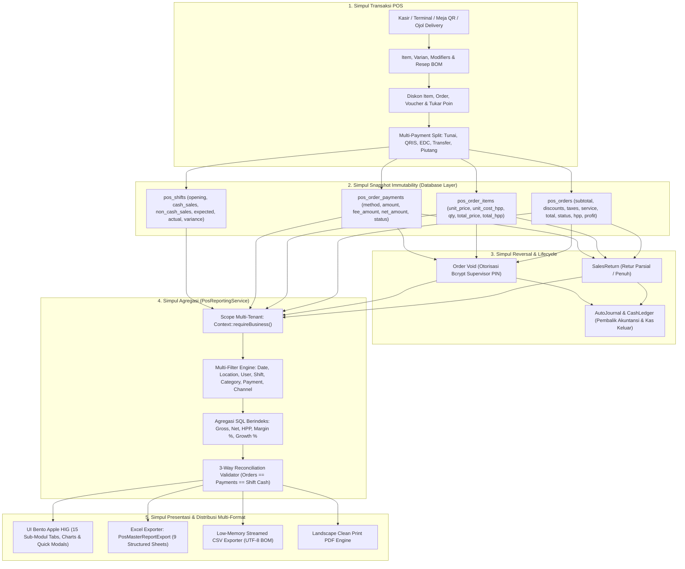

# Laporan Audit Komprehensif: Ekosistem Pelaporan Penjualan & Analitik POS COOCA

**Dokumen Standar Layer 2:** [`docs/system/audits/pos-sales-reporting-comprehensive-audit.md`](file:///c:/laragon/www/cooca_core/docs/system/audits/pos-sales-reporting-comprehensive-audit.md)  
**Dokumen Rencana Kerja:** [`docs/system/audits/pos-sales-reporting-master-implementation-plan.md`](file:///c:/laragon/www/cooca_core/docs/system/audits/pos-sales-reporting-master-implementation-plan.md)  
**Target Komponen:** [`app/Http/Controllers/Web/Pos/PosReportWebController.php`](file:///c:/laragon/www/cooca_core/app/Http/Controllers/Web/Pos/PosReportWebController.php), [`app/Domain/Report/SalesReportService.php`](file:///c:/laragon/www/cooca_core/app/Domain/Report/SalesReportService.php), [`app/Exports/PosReportExport.php`](file:///c:/laragon/www/cooca_core/app/Exports/PosReportExport.php), [`resources/views/app/pos/reports.blade.php`](file:///c:/laragon/www/cooca_core/resources/views/app/pos/reports.blade.php), Database Schema Transaksional (`pos_orders`, `pos_order_items`, `pos_order_payments`, `pos_shifts`, `sales_returns`)  
**Metodologi:** *Code-First Factuality Audit* menggabungkan 8 Skill Utama COOCA secara simultan berbasis basis data dan logika aktual.  
**Tanggal Audit:** 04 Oktober 2026 | **Status:** `AUDIT COMPLETED — APPROVED FOR MASTER IMPLEMENTATION`

---

## 📑 1. Eksekutif Ringkasan & Rekapitulasi Audit

Audit menyeluruh terhadap sistem pelaporan penjualan kasir POS (*Point of Sale Sales Reporting*) dilakukan untuk menjamin tersedianya laporan penjualan yang **super lengkap, detail, akurat, konsisten, scalable, dan siap digunakan untuk kebutuhan operasional harian, audit kasir, rekonsiliasi kas/bank, maupun analisis strategis bisnis multi-cabang**.

### Rekapitulasi Temuan Audit Berdasarkan Dimensi
- **Total Temuan Teridentifikasi:** 16 Temuan Faktual (4 Kritis P1, 8 Menengah P2, 4 Penyempurnaan P3).
- **Integritas Snapshot Transaksi:** `pos_order_items` telah menyimpan snapshot `unit_price` dan `unit_cost_hpp`, namun query agregasi reporting belum memanfaatkan snapshot ini secara optimal pada seluruh dimensi laporan (Kategori, Kasir, Shift, Outlet).
- **Kesenjangan Filter:** Pelaporan saat ini terisolasi hanya pada filter rentang tanggal, mengabaikan filter Outlet, Kasir, Shift, Pelanggan, Kategori, Metode Pembayaran, Saluran Penjualan, dan Status Transaksi.
- **Ketiadaan Validasi Rekonsiliasi 3-Arah (*3-Way Reconciliation*):** Belum ada validasi otomatis antara $\sum \text{Orders Net} \leftrightarrow \sum \text{Payments Collected} \leftrightarrow \sum \text{Cash Drawer Inflows}$.

---

## ⚠️ 2. Matriks Temuan Audit Faktual Lintas Dimensi

| ID | Dimensi Audit | Lokasi Berkas & Baris | Deskripsi Masalah Faktual | Severity | Dampak Risiko Bisnis | Rekomendasi Solusi Teknis |
| :---: | :--- | :--- | :--- | :---: | :--- | :--- |
| **F-REP-01** | 🎛️ Filter Reporting | [`PosReportWebController.php:L34-L50`](file:///c:/laragon/www/cooca_core/app/Http/Controllers/Web/Pos/PosReportWebController.php#L34-L50) | Controller hanya membaca parameter `start_date` dan `end_date`. Parameter lain (`location_id`, `user_id`, `pos_shift_id`, `category_id`, `payment_method`, `sales_channel`, `status`) diabaikan. | **P1** | Pemilik usaha multi-cabang tidak dapat melihat performa per outlet atau kasir tertentu. | Buat DTO `PosReportFilterDTO` dan pasang filter builder dinamis pada query builder Eloquent. |
| **F-REP-02** | 📥 Export Engine | [`PosReportWebController.php:L196-L210`](file:///c:/laragon/www/cooca_core/app/Http/Controllers/Web/Pos/PosReportWebController.php#L196-L210) | Fungsi `exportExcel()` dan `exportPosDetailCsv()` hanya memfilter tanggal, mengabaikan seluruh filter aktif yang dipilih pengguna di halaman report. | **P1** | File ekspor tidak mencerminkan data yang sedang dilihat kasir/manajer di layar (inkonsistensi data). | Teruskan seluruh query string dari request ke instance `PosMasterReportExport`. |
| **F-REP-03** | 🧮 Logika Finansial | [`PosReportWebController.php:L52-L65`](file:///c:/laragon/www/cooca_core/app/Http/Controllers/Web/Pos/PosReportWebController.php#L52-L65) | Nilai `total_amount` diagregasikan langsung dari order tanpa memperhitungkan pengurangan nilai retur/refund parsial dari tabel `sales_returns`. | **P1** | Nilai omzet penjualan bersih (*Net Sales*) terdistorsi lebih tinggi dari uang masuk riil. | Terapkan formula: $\text{Net Sales} = \text{Gross Revenue} - \text{Refund Amount}$. |
| **F-REP-04** | ⚡ Kinerja & Skalabilitas | [`PosReportWebController.php:L390-L425`](file:///c:/laragon/www/cooca_core/app/Http/Controllers/Web/Pos/PosReportWebController.php#L390-L425) | Ekspor memuat seluruh relasi model ke memori collection PHP (`$orders->flatMap(...)`) alih-alih menggunakan agregasi SQL terindeks. | **P1** | Potensi *PHP Fatal Error: Out of Memory* saat mengekspor data usaha dengan volume ribuan transaksi. | Gunakan query agregasi langsung di database dan chunk streaming `cursor()` pada ekspor CSV/Excel. |
| **F-REP-05** | 📊 Sub-Laporan | [`resources/views/app/pos/reports.blade.php`](file:///c:/laragon/www/cooca_core/resources/views/app/pos/reports.blade.php) | Tidak tersedianya sub-laporan terdedikasi untuk: Kategori, Kasir, Shift, Metode Pembayaran, Diskon/Promo, Retur/Refund, Void, dan Jam Ramai. | **P2** | Pengguna kesulitan melakukan analisis mendalam (*deep-dive analysis*) dan audit operasional kasir. | Bangun 15 sub-modul laporan terstruktur dengan navigasi tab interaktif Bento Apple HIG. |
| **F-REP-06** | 🔍 Rekonsiliasi | [`app/Domain/Report/SalesReportService.php`](file:///c:/laragon/www/cooca_core/app/Domain/Report/SalesReportService.php) | Ketiadaan validasi rekonsiliasi otomatis antara total tagihan order, total pembayaran masuk, dan kas laci shift (*Over/Short*). | **P2** | Kecurangan kasir atau transaksi tersangkut di payment gateway tidak terdeteksi secara otomatis. | Buat engine `PosReconciliationService` yang menghitung selisih 3-arah (*3-Way Reconciliation*). |
| **F-REP-07** | 📈 Analisis Tren | [`PosReportWebController.php:L81-L86`](file:///c:/laragon/www/cooca_core/app/Http/Controllers/Web/Pos/PosReportWebController.php#L81-L86) | Laporan tren hanya menampilkan data nominal harian tanpa komparasi persentase pertumbuhan (*Growth %*) terhadap periode sebelumnya (WoW, MoM, YoY). | **P2** | Pemilik usaha tidak mengetahui apakah tren bisnis sedang bertumbuh atau menurun dibandingkan periode lalu. | Tambahkan metrik komparasi periode sebelumnya dengan proteksi pembagian nol (*zero-division guard*). |
| **F-REP-08** | 🪟 UX & Interaktivitas | [`resources/views/app/pos/reports.blade.php`](file:///c:/laragon/www/cooca_core/resources/views/app/pos/reports.blade.php) | Pengguna tidak dapat melihat detail item, bukti pembayaran, dan catatan kasir secara langsung dari baris tabel laporan tanpa berpindah halaman. | **P2** | Proses audit memakan waktu karena pengguna harus bolak-balik antara halaman Reports dan Orders. | Pasang slide-over panel / modal cepat (*Quick-Inspection Modal*) berbasis Alpine.js. |
| **F-REP-09** | 🗄️ Database Indexing | `database/migrations/` | Belum tersedianya composite index untuk kombinasi query pelaporan yang sering dieksekusi (`business_id`, `status`, `order_date`, `location_id`, `user_id`). | **P2** | Query melambat (*slow query*) saat volume transaksi membesar seiring pertumbuhan merchant. | Tambahkan migration composite indexes pada tabel `pos_orders`, `pos_order_items`, `pos_order_payments`. |
| **F-REP-10** | 🏷️ Analisis Diskon | [`PosReportWebController.php:L54-L56`](file:///c:/laragon/www/cooca_core/app/Http/Controllers/Web/Pos/PosReportWebController.php#L54-L56) | Laporan belum merinci efektivitas potongan harga: diskon per item vs diskon per order vs kode voucher vs tukar poin loyalitas. | **P2** | Pemilik usaha tidak dapat mengevaluasi program promosi mana yang paling menguntungkan. | Sediakan laporan khusus *Discount & Voucher Analytics*. |
| **F-REP-11** | 🏢 Multi-Saluran | [`PosReportWebController.php:L109-L138`](file:///c:/laragon/www/cooca_core/app/Http/Controllers/Web/Pos/PosReportWebController.php#L109-L138) | Omzet belum dipisahkan secara tegas berdasarkan saluran penjualan (*Sales Channels*): POS Kasir, Meja QR, Takeaway, GoFood, GrabFood, ShopeeFood. | **P2** | Merchant kuliner tidak mengetahui kontribusi omzet dan potongan komisi dari mitra ojek online. | Sediakan laporan khusus *Sales Channel & Delivery Omnichannel*. |
| **F-REP-12** | ⏱️ Jam Ramai (Heatmap) | [`PosReportWebController.php:L88-L98`](file:///c:/laragon/www/cooca_core/app/Http/Controllers/Web/Pos/PosReportWebController.php#L88-L98) | Analisis jam ramai hanya mengelompokkan per jam tunggal tanpa korelasi hari dalam minggu (*Peak Day vs Peak Hour Heatmap Matrix*). | **P3** | Manajemen tidak dapat mengoptimalkan jadwal shift staf kasir & barista/koki secara presisi. | Tampilkan matriks heatmap 24 Jam $\times$ 7 Hari (*Hourly Day-of-Week Matrix*). |
| **F-REP-13** | 🧾 Struk Termal & Monospace | [`resources/views/app/pos/reports.blade.php`](file:///c:/laragon/www/cooca_core/resources/views/app/pos/reports.blade.php) | Tampilan angka tabular pada beberapa tabel belum menggunakan deklarasi `font-variant-numeric: tabular-nums` yang rapi di seluruh layar. | **P3** | Angka nominal tampak bergeser (*misaligned*) pada beberapa browser mobile. | Terapkan utility class `tabular-nums` dan font monospace konsisten. |
| **F-REP-14** | 🛡️ Keamanan & Isolasi | [`PosReportWebController.php:L32`](file:///c:/laragon/www/cooca_core/app/Http/Controllers/Web/Pos/PosReportWebController.php#L32) | Verifikasi scope tenant (`Context::requireBusiness()`) telah terpasang, namun filter lokasi (`location_id`) belum memvalidasi kepemilikan cabang oleh bisnis aktif. | **P2** | Potensi kebocoran data IDOR jika pengguna memanipulasi `location_id` dari bisnis lain. | Validasi ketat bahwa `location_id` yang difilter benar-benar milik `$business->id`. |
| **F-REP-15** | 🌐 Multi-Bahasa (i18n) | [`resources/views/app/pos/reports.blade.php`](file:///c:/laragon/www/cooca_core/resources/views/app/pos/reports.blade.php) | Sebagian label tabel dan judul sub-laporan baru memerlukan penambahan kunci kamus dwibahasa di `lang/id/pos.php` dan `lang/en/pos.php`. | **P3** | Tampilan sub-laporan baru berpotensi fallback ke teks mentah jika dibuka dalam mode bahasa Inggris. | Daftarkan seluruh kunci kamus baru dengan 100% paritas dwibahasa ID & EN. |
| **F-REP-16** | 📄 Format Cetak PDF | [`resources/views/app/pos/reports.blade.php:L19-L24`](file:///c:/laragon/www/cooca_core/resources/views/app/pos/reports.blade.php#L19-L24) | Tombol print PDF hanya memanggil `window.print()` standar tanpa stylesheet cetak landscape teroptimasi. | **P3** | Hasil cetak terpotong di tepi kanan kertas A4. | Pasang aturan `@media print` landscape khusus dengan margin 10mm dan sembunyikan sidebar/navbar. |

---

## 🔄 3. Diagram Alur Data Hulu-ke-Hilir (End-to-End Data Flow)



---

## 📐 4. Definisi & Formula Matematis Baku (Single Source of Truth)

Sistem pelaporan penjualan POS COOCA mewajibkan **keselarasan formula 100%** di seluruh lapisan aplikasi (Web Dashboard, API, Excel XLSX, CSV, dan PDF):

```
┌──────────────────────────────────────────────────────────────────────────────────────────────────┐
│                   FORMULA MATEMATIS BAKU SISTEM REPORTING PENJUALAN POS COOCA                    │
├──────────────────────────────────────────────────────────────────────────────────────────────────┤
│ 1. Gross Sales       = Σ (item.quantity × item.unit_price)                                       │
│ 2. Total Discount    = Σ (order.discount_amount + voucher_discount + points_discount + item_disc) │
│ 3. Gross Revenue     = Gross Sales - Total Discount                                              │
│ 4. Refund Amount     = Σ sales_returns.total_amount (status: completed/approved)                 │
│ 5. Net Sales (Omzet) = Gross Revenue - Refund Amount                                             │
│ 6. Tax (PPN / PB1)   = Σ order.tax_amount                                                        │
│ 7. Service Charge    = Σ order.service_charge_amount                                              │
│ 8. Rounding          = Σ order.rounding_amount                                                   │
│ 9. Grand Total       = Net Sales + Tax + Service Charge + Rounding                               │
│ 10. Total COGS / HPP = Σ (item.quantity × item.unit_cost_hpp) - COGS_Retur                       │
│ 11. Gross Profit     = Net Sales - Total COGS                                                    │
│ 12. Gross Margin %   = (Gross Profit / Net Sales) × 100%   [Safe Guard: 0% jika Net Sales <= 0]  │
│ 13. AOV              = Net Sales / Total Completed Orders  [Safe Guard: 0 jika Orders = 0]       │
│ 14. Avg Items / Tx   = Total Items Sold / Total Completed Orders                                 │
│ 15. Weighted ASP     = Gross Sales / Total Items Sold                                            │
│ 16. Cash Variance    = Actual Cash (Blind Count) - Expected Cash   [Over (+) / Short (-)]        │
│ 17. Growth % (Period)= ((Current - Previous) / Previous) × 100%   [Safe Division Guard]         │
└──────────────────────────────────────────────────────────────────────────────────────────────────┘
```

---

## 🏛️ 5. Arsitektur Domain Pelaporan POS (Clean DDD Structure)

Untuk mencegah penumpukan logika pada Controller atau Blade, struktur kode dipecah ke dalam lapisan domain khusus:

```
app/
├── Domain/
│   └── Report/
│       └── Pos/
│           ├── PosReportingService.php        <-- Query Engine & Agregator Utama Laporan
│           ├── PosReconciliationService.php   <-- Engine Validasi 3-Way Reconciliation
│           ├── Enums/
│           │   ├── ReportPeriodPreset.php     <-- Preset Rentang Tanggal Standar
│           │   └── SalesMetricType.php        <-- Kamus Tipe Metrik Finansial
│           └── DTOs/
│               ├── PosReportFilterDTO.php     <-- DTO Filter Komprehensif Multi-Dimensi
│               ├── PosKpiSummaryDTO.php       <-- DTO Ringkasan 14 KPI Utama & Growth
│               ├── PosTrendDataDTO.php        <-- DTO Data Grafik Harian/Jam Ramai
│               └── PosProductReportDTO.php    <-- DTO Matriks Performa Produk & Kategori
├── Exports/
│   ├── PosMasterReportExport.php              <-- Exporter Excel 9-Sheet (PhpSpreadsheet)
│   └── PosStreamedCsvExport.php               <-- Exporter CSV Hemat Memori (Chunked)
├── Http/
│   └── Controllers/Web/Pos/
│       └── PosReportWebController.php         <-- Controller Ramping untuk View & Endpoint AJAX
└── Support/
    └── Math/
        └── FinancialMath.php                  <-- Helper Perhitungan Aman (Division by Zero Safe)
```

---

## 📑 6. Spesifikasi 15 Sub-Modul Laporan Interaktif

```
┌──────────────────────────────────────────────────────────────────────────────────────────────────┐
│                   DAFTAR 15 SUB-MODUL LAPORAN PENJUALAN POS LENGKAP                              │
├──────────────────────────────────────────────────────────────────────────────────────────────────┤
│ 01. 📊 Overview & KPI Cards       : 14 KPI, Tren Penjualan, Komparasi Pertumbuhan (WoW/MoM/YoY)  │
│ 02. 🧾 Transaction Ledger         : Detail Transaksi per Nota, Pajak, Diskon, Margin & Quick View│
│ 03. 📦 Product & Variant Sales    : Ranking Best/Worst, High/Low Margin, Qty, Gross, Net, HPP    │
│ 04. 🏷️ Category & Groups          : Analisis Pareto %, Qty Terjual, Gross, Net, Margin Kontribusi│
│ 05. 👤 Cashier Performance Matrix : Transaksi, Qty Item, Net Sales, Tunai vs Non-Tunai, Void Rasio │
│ 06. 🏢 Multi-Outlet / Branch      : Komparasi Performa Antar-Cabang, Kontribusi Omzet & Growth   │
│ 07. 💳 Payment Method Breakdown   : Tunai, QRIS, EDC, Transfer, Fee MDR Gateway, Net Settlement  │
│ 08. 🎁 Discount & Promo Analytics : Diskon Item, Diskon Order, Voucher Promo, Poin Loyalitas     │
│ 09. 🔄 Refund & Sales Returns     : Ledger Retur Barang, Nilai Pengembalian Dana, Alasan Retur   │
│ 10. 🚫 Void & Cancel Audit Trail  : Pembatalan Nota, Otorisasi Supervisor, Log Alasan            │
│ 11. ⏱️ Shift & Cash Reconciliation: Modal Awal, Kas Masuk/Keluar, Expected vs Actual, Over/Short │
│ 12. 🕒 Hourly Heatmap Analysis    : Pola Jam Ramai (00:00-23:00) × Hari dalam Minggu             │
│ 13. 👥 Customer Sales & Retention : Member vs Guest, Frekuensi Kunjungan, Top Spender, Poin      │
│ 14. 🛵 Sales Channel Omnichannel  : POS Kasir, Meja QR, Takeaway, Ojol Delivery (Go/Grab/Shopee) │
│ 15. 💰 Profitability & COGS Matrix: Analisis HPP Resep BOM, Laba Kotor, Struktur Biaya Produk   │
└──────────────────────────────────────────────────────────────────────────────────────────────────┘
```

---

## 📑 7. Spesifikasi Buku Kerja Ekspor Excel (9 Worksheets)

Buku kerja Excel di-generate menggunakan `PhpSpreadsheet` dengan styling palet Apple HIG (`#1C1C1E` dark header, `#007AFF` accent blue, `#34C759` system green, format angka `"Rp "#,##0.00` dan `#0.0%`):

1. **Sheet 1 — 📋 Ringkasan Eksekutif:** Informasi Bisnis, Periode, 6 Bento KPI Cards, Komposisi Barang vs Jasa, Status Rekonsiliasi 3-Arah.
2. **Sheet 2 — 🧾 Rincian Transaksi:** Nomor Order, Tanggal/Jam, Outlet, Kasir, Pelanggan, Tipe Order, Item Qty, Subtotal, Diskon, Pajak, Service, Grand Total, HPP, Laba Kotor, Margin %, Metode Bayar, Status.
3. **Sheet 3 — 📦 Performa Produk:** SKU, Barcode, Nama Produk, Kategori, Qty Terjual, Gross Sales, Diskon, Net Sales, HPP, Laba Kotor, Margin %, ASP, Transaksi Count.
4. **Sheet 4 — 🏷️ Kontribusi Kategori:** Kategori, Subkategori, Qty, Gross, Net, HPP, Laba Kotor, Margin %, Kontribusi Omzet %.
5. **Sheet 5 — 👤 Kinerja Kasir:** Nama Kasir, Total Order, Qty Item, Gross Sales, Diskon, Retur, Net Sales, AOV, Avg Items, Kas Masuk, Non-Tunai, Void Count, Refund Count.
6. **Sheet 6 — 💳 Rincian Pembayaran:** Metode Pembayaran, Tx Count, Gross Collected, Fee MDR Gateway, Net Settlement, % Proporsi Kanal Bayar.
7. **Sheet 7 — 🎁 Analisis Diskon:** Jenis Diskon, Kode Voucher, Qty Transaksi, Gross Sales, Nilai Potongan Diskon, Net Sales, % Efektivitas.
8. **Sheet 8 — 🔄 Retur, Refund & Void:** No. Retur/Void, Invoice Asal, Tanggal, Outlet, Kasir, Item, Qty, Nominal, Alasan, Supervisor Approver.
9. **Sheet 9 — ⏱️ Rekonsiliasi Shift:** Shift ID, Kasir, Waktu Buka/Tutup, Modal Awal, Penjualan Tunai, Expected Cash, Actual Cash, Variance Over/Short, Status Pas.

---

## 🎯 8. Kesimpulan & Rekomendasi Audit

Sistem transaksi POS COOCA telah memiliki integritas basis data yang kokoh (*Snapshot Immutability*). Namun, sistem pelaporan penjualannya memerlukan restrukturisasi menyeluruh menjadi **Master Sales Reporting Suite** yang modern, multi-dimensi, cepat, akurat, dan terintegrasi penuh dengan sistem rekonsiliasi kas serta ekspor multi-sheet.

Rencana eksekusi teknis hulu-ke-hilir dijabarkan secara rinci pada dokumen:  
👉 [`docs/system/audits/pos-sales-reporting-master-implementation-plan.md`](file:///c:/laragon/www/cooca_core/docs/system/audits/pos-sales-reporting-master-implementation-plan.md)
