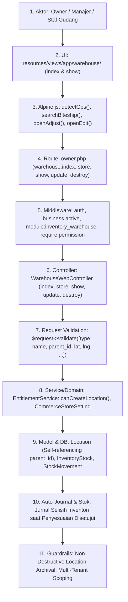
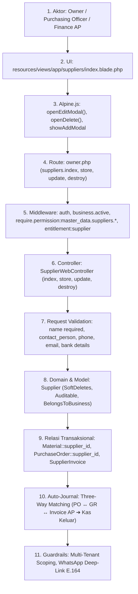

# LAPORAN AUDIT SISTEM KOMPREHENSIF 8-SKILL (FACTUAL & CODE-FIRST)
**Target Repositori:** [`resources/views/app/warehouse`](file:///c:/laragon/www/cooca_core/resources/views/app/warehouse) & [`resources/views/app/suppliers`](file:///c:/laragon/www/cooca_core/resources/views/app/suppliers)  
**File Tinjauan:** 
- `resources/views/app/warehouse/index.blade.php` (1.833 baris)
- `resources/views/app/warehouse/show.blade.php` (1.166 baris)
- `resources/views/app/suppliers/index.blade.php` (780 baris)
- `app/Http/Controllers/Web/Warehouse/WarehouseWebController.php` (430 baris)
- `app/Http/Controllers/Web/SupplierWebController.php` (131 baris)
- `app/Models/Location.php` (178 baris)
- `app/Models/Supplier.php` (62 baris)
- `lang/id/warehouse.php`, `lang/en/warehouse.php`, `lang/id/purchasing.php`, `lang/en/purchasing.php`
**Waktu Audit:** 2026-10-04  
**Status:** AUDIT LENGKAP & TERVERIFIKASI (VERIFIED & ACTIONABLE)  

---

## 🧭 EKSEKUSI 8 SKILL UTAMA SECARA SIMULTAN

Laporan audit ini disusun berbasis **Code-First Factuality (tanpa asumsi)** dengan mengevaluasi kode sumber aktual terhadap 8 pilar utama ekosistem COOCA:

```
┌─────────────────────────────────────────────────────────────────────────────┐
│                       8 DIMENSI AUDIT UTAMA COOCA                           │
├─────────────────────────┬──────────────────────────┬────────────────────────┤
│ 1. 🔄 System Workflow   │ 2. 🛡️ Security & Fraud   │ 3. 🏢 Multi-Industry   │
│ • 11 Simpul Eksekusi    │ • IDOR, SQLi, XSS, CSRF  │ • Auto-Hiding 20 Sektor│
│ • State Machine Transisi│ • Fraud Kasir/Gudang/AP  │ • Dynamic Terminology  │
│ • Layer 2 Documentation │ • Ergonomi Human Error   │ • Do's & Don'ts        │
├─────────────────────────┼──────────────────────────┼────────────────────────┤
│ 4. 🎨 UI Panel & IA     │ 5. 📱 Responsive UI/UX   │ 6. ⚡ Agent Directive  │
│ • Konsistensi 3 Panel   │ • Mobile Ergonomics 360px│ • Bento Apple HIG XXL  │
│ • Deep-Linking ?tab=... │ • Thumb Zone & Bottom    │ • Real-time Zero-Reload│
│ • Settings Hub IA       │ • 44px+ Tap Targets      │ • Quota Lifecycle      │
├─────────────────────────┼──────────────────────────┴────────────────────────┤
│ 7. 🌐 Multi-Language    │ 8. 📊 Reports & Excel Export Engine               │
│ • Zero Hardcoded Text   │ • 4 Domain Laporan & KPI Dashboard Bento          │
│ • 10 Domain Teks ID/EN  │ • Two-Part Multi-Sheet XLSX (Executive + Ledger)  │
│ • Tabular-nums & Locale │ • Interactive Web Drill-Down Drawer               │
└─────────────────────────┴───────────────────────────────────────────────────┘
```

---

## 1. 🔄 [SKILL: system-workflow-audit]
### Penelusuran Hulu-ke-Hilir pada 11 Simpul Eksekusi Nyata

#### A. Rantai Alur Eksekusi Cabang & Gudang Logistik (`warehouse`)


1. **Aktor & Persona**:
   - Business Owner: Memantau nilai total aset persediaan (HPP) seluruh cabang/gudang, menyetujui penyesuaian stok bernilai tinggi (Maker-Checker).
   - Manajer Toko & Staf Gudang: Melakukan mutasi masuk/keluar, penerimaan PO vendor, stock opname fisik, dan transfer antar-lokasi.
2. **UI / Blade State**:
   - `warehouse/index.blade.php`: Menampilkan 4 Kartu KPI Bento (Total Lokasi, Lokasi Aktif, Nilai Aset Stok HPP, Stok Menipis), Tab Segmented Filter (`all`, `outlet`, `warehouse`), Card Grid Lokasi dengan Hierarki Sub-Gudang & Origin Storefront Pickup, SOP Masuk Barang 4-Langkah, dan Ledger Mutasi Terkini.
   - `warehouse/show.blade.php`: Menampilkan Detail Info Lokasi, KPI Khusus Lokasi, Panel Maker-Checker Pengajuan Penyesuaian Stok, Tabel Stok Aktual Gudang dengan Quick Adjustment Modal, Riwayat Penerimaan Barang (GR), dan Riwayat Kartu Stok Mutasi.
3. **Alpine.js & AJAX**:
   - `detectGps()`: Memanggil `navigator.geolocation.getCurrentPosition()`, lalu memanggil asynchronous endpoint `geo.reverse-geocode` untuk auto-lookup alamat dan memicu `autoFillBiteship()`.
   - `searchBiteship()`: Debounced search (300ms) ke `geo.search-areas` untuk autocomplete kode pos / kelurahan / kecamatan.
4. **Route & Middleware**:
   - `Route::middleware('module:inventory_warehouse')->group(...)` di `routes/owner.php`.
   - Permissions: `warehouse.view` (index, show), `warehouse.manage` (store, update, destroy).
5. **Controller & Validation**:
   - `WarehouseWebController@store`: Memvalidasi parent_id ber-UUID dengan `Rule::exists('locations', 'id')->where('business_id', $business->id)`. Memeriksa kuota lokasi via `EntitlementService::canCreateLocation($business, $type)`.
   - `WarehouseWebController@update`: Memvalidasi pencegahan *circular hierarchy* (`parent_id !== $location->id` dan bukan turunan anak).
6. **Model, Database & Side-Effects**:
   - Model `Location` menggunakan `Auditable, BelongsToBusiness, HasFactory, HasSlug, HasUuid`.
   - `CommerceStoreSetting` disinkronkan otomatis saat lokasi ditetapkan sebagai `is_primary = true`.
7. **Guardrails & Anti-Fraud**:
   - Non-Destructive Archival Guard: Jika lokasi memiliki riwayat transaksi (`StockMovement`, `GoodsReceipt`, `PosOrder`, `StockTransfer`, `StockOpname`, `StockAdjustment`, `Attendance`), lokasi tidak di-hard delete melainkan dinonaktifkan (`is_active = false`) untuk menjaga keutuhan buku besar dan jejak audit.

---

#### B. Rantai Alur Eksekusi Pemasok & Vendor (`suppliers`)


1. **Aktor & Persona**:
   - Purchasing Officer: Mendaftarkan vendor, menghubungkan bahan baku pasokan, menerbitkan PO.
   - Finance AP Clerk: Memeriksa rekening bank vendor (BCA/Mandiri/BRI) untuk pembayaran transfer.
2. **UI & Form State**:
   - `suppliers/index.blade.php`: 4 Bento KPI Box (Total Pemasok, Pasokan Aktif, Bahan Terhubung, Shortcut PO), Search Toolbar, Tabel Desktop, Mobile Card List dengan tombol Chat WhatsApp instant (`https://wa.me/62...`), Modal Tambah & Modal Edit Supplier.
3. **Route & Middleware**:
   - `GET /suppliers` (`require.permission:master_data.suppliers.view`)
   - `POST /suppliers` (`require.permission:master_data.suppliers.manage`, `entitlement:supplier`)
   - `PUT /suppliers/{supplier}` (`require.permission:master_data.suppliers.manage`)
   - `DELETE /suppliers/{supplier}` (`require.permission:master_data.suppliers.manage`)
4. **Controller & Model**:
   - `SupplierWebController` mengelola CRUD pemasok.
   - Model `Supplier` berelasi `hasMany` ke `Material`, `PurchaseOrder`, `GoodsReceipt`, dan `SupplierInvoice`.

---

## 2. 🛡️ [SKILL: security-and-fraud-audit]
### Audit 5 Pilar Keamanan Siber, Fraud Internal & Ergonomi Human Error

### 🔴 Temuan Keamanan Kritis & Tinggi (Vulnerabilities)

1. **CRITICAL - Celah SQL Operator Precedence IDOR pada `Supplier::resolveRouteBinding()`**:
   - **Lokasi Berkas:** [`app/Models/Supplier.php:37-42`](file:///c:/laragon/www/cooca_core/app/Models/Supplier.php#L37-L42)
   - **Kode Aktual:**
     ```php
     public function resolveRouteBinding($value, $field = null)
     {
         return $this->where('id', $value)
             ->orWhere('slug', $value)
             ->firstOrFail();
     }
     ```
   - **Analisis Ancaman (Root Cause & Modus Operandi):**
     `Supplier` menggunakan trait `BelongsToBusiness` yang menerapkan `BusinessScope` (`WHERE suppliers.business_id = 'tenant-aktif'`). Namun pemanggilan `$this->where('id', $value)->orWhere('slug', $value)` menghasilkan query SQL mentah:
     ```sql
     SELECT * FROM suppliers WHERE (business_id = 'tenant-A' AND id = 'xxx') OR slug = 'xxx' LIMIT 1;
     ```
     Karena operator `AND` memiliki presedensi lebih tinggi daripada `OR`, query ini mengevaluasi `(business_id = 'tenant-A' AND id = 'xxx')` ATAU `(slug = 'xxx')`.
     Jika Tenant B mengakses supplier via slug `/suppliers/pt-sumber-pangan` yang dimiliki Tenant A, query akan mengevaluasi kondisi kedua sebagai `TRUE` dan **membocorkan data supplier Tenant A ke Tenant B**!
   - **Solusi Defensif:**
     Wajib membungkus kondisi dalam Closure Query Grouping:
     ```php
     public function resolveRouteBinding($value, $field = null)
     {
         return $this->where(function ($query) use ($value) {
             $query->where('id', $value)
                   ->orWhere('slug', $value);
         })->firstOrFail();
     }
     ```

2. **HIGH - Inline JS Injection & Kutip Rusak pada Alpine Modals**:
   - **Lokasi Berkas:** [`resources/views/app/suppliers/index.blade.php:315-325`](file:///c:/laragon/www/cooca_core/resources/views/app/suppliers/index.blade.php#L315-L325)
   - **Kode Aktual:**
     ```blade
     @click="openEditModal({
         id: '{{ $supplier->id }}',
         name: '{{ addslashes($supplier->name) }}',
         contact_person: '{{ addslashes($supplier->contact_person ?? '') }}',
         ...
         notes: '{{ addslashes($supplier->notes ?? '') }}'
     })"
     ```
   - **Analisis Ancaman:**
     Jika `notes` atau `name` mengandung baris baru (newline `\n`), tanda kutip ganda/tunggal khusus, atau script payload, sintaks Javascript pada atribut HTML `@click` akan mengalami syntax error atau memicu DOM-based XSS.
   - **Solusi Defensif:**
     Gunakan Blade secure JS directive `@js($supplier)`.

3. **HIGH - Pelanggaran Zero Native Alert/Confirm pada Otorisasi Sensitif**:
   - **Lokasi Berkas:** [`resources/views/app/warehouse/show.blade.php:156,165`](file:///c:/laragon/www/cooca_core/resources/views/app/warehouse/show.blade.php#L156-L165)
   - **Kode Aktual:**
     ```html
     <button type="submit" onclick="return confirm('Yakin ingin menolak pengajuan penyesuaian stok ini?')">
     <button type="submit" onclick="return confirm('Setujui penyesuaian stok ini? Kartu stok dan pembukuan jurnal akan otomatis dimutasi.')">
     ```
   - **Analisis Ancaman:**
     Dialog `confirm()` browser native memblokir thread UI, tidak ramah pada aplikasi mobile/PWA (sering diblokir oleh WebView), dan melanggar Bento Apple HIG.
   - **Solusi Defensif:**
     Ganti dengan Apple HIG Dialog Modal / `AppAlert.confirm()`.

---

## 3. 🏢 [SKILL: multi-industry-system-audit]
### Evaluasi Kesesuaian & Penegakan Auto-Hiding untuk 20 Sektor Industri

```
┌────────────────────────────────────────────────────────────────────────────────────────┐
│             MATRIKS KESESUAIAN 6 KLASTER INDUSTRI PADA GUDANG & PEMASOK                │
├─────────────────────────┬──────────────────────────┬───────────────────────────────────┤
│ KLASTER INDUSTRI        │ FITUR WAJIB (DO)         │ FITUR DILARANG (DON'T / HIDE)     │
├─────────────────────────┼──────────────────────────┼───────────────────────────────────┤
│ 1. Kuliner & F&B (5)    │ • Dapur Pusat (Kitchen)  │ • Suku cadang bengkel             │
│                         │ • Supplier Bahan Resep   │ • No Polisi / Odometer            │
├─────────────────────────┼──────────────────────────┼───────────────────────────────────┤
│ 2. Manufaktur & HPP (5) │ • Pabrik / Workshop      │ • Meja Dine-In                    │
│                         │ • Supplier Bahan Baku    │ • Label "Dapur Pusat"             │
├─────────────────────────┼──────────────────────────┼───────────────────────────────────┤
│ 3. Ritel & Apotek (2)   │ • Gudang Transit Barang  │ • Resep BOM Formula               │
│                         │ • Supplier Produk Jadi   │ • Upah Jam Mesin                  │
├─────────────────────────┼──────────────────────────┼───────────────────────────────────┤
│ 4. Jasa & Bengkel (4)   │ • Gudang Sparepart       │ • Bahan Resep Makanan             │
│                         │ • Supplier Suku Cadang   │ • Berat Timbangan Laundry (Kg)    │
├─────────────────────────┼──────────────────────────┼───────────────────────────────────┤
│ 5. Jasa Proyek (3)      │ • Basecamp / Gudang Site │ • Kasir Cepat Ritel Thermal       │
│                         │ • Supplier Material Sipil│ • Denah Meja                      │
├─────────────────────────┼──────────────────────────┼───────────────────────────────────┤
│ 6. Distribusi & Agro (2)│ • Gudang Distribusi (DC) │ • Resep Porsi Makanan             │
│                         │ • Supplier Pupuk/Pakan   │ • Layar Dapur KDS                 │
└─────────────────────────┴──────────────────────────┴───────────────────────────────────┘
```

### Temuan Pelanggaran Multi-Industri:
1. **Kebocoran Terminologi `central_kitchen` di `warehouse/index.blade.php`**:
   - Di `index.blade.php:528`, tipe lokasi `central_kitchen` selalu dilabeli `"Dapur Pusat"`. Untuk industri Garment (`mfg_garment`) atau Bengkel (`service_workshop`), istilah ini membingungkan (*cognitive friction*).
   - **Solusi:** Terapkan helper adaptif: F&B ➔ *"Dapur Pusat"*, Manufaktur ➔ *"Pabrik / Workshop"*, Kontraktor ➔ *"Basecamp Proyek"*, Industri Lain ➔ *"Pusat Operasional"*.
2. **Kebocoran Tombol "Katalog Bahan" di `suppliers/index.blade.php:63-67`**:
   - Tombol shortcut navigasi ke `materials.index` ditampilkan secara permanen tanpa pemeriksaan `@if($business->isModuleEnabled(\App\Domain\Template\ModuleRegistry::MODULE_RECIPE_BOM))`. Untuk toko ritel atau salon, tombol ini tidak fungsional.
   - **Solusi:** Bungkus tombol dengan kondisional module registry BOM.

---

## 4. 🎨 [SKILL: ui-panel-consistency-and-ia]
### Audit Konsistensi UI, Page Header & Arsitektur Tab

1. **Header 3-Baris Terpadu**:
   - `warehouse/index.blade.php` dan `suppliers/index.blade.php` telah mengadopsi `<x-module-header>`, namun parameter layout `@extends` masih mengirim `headerTitle` dan `headerSubtitle` redundant yang tidak terpakai.
2. **Tab Desynchronization & Ketiadaan URL Deep-Linking**:
   - Pada `warehouse/index.blade.php:12`, filter tab `filterTab: 'all'` (`all`, `outlet`, `warehouse`) hanya tersimpan di memori Alpine JS. Saat halaman di-refresh atau link dibagikan, filter kembali ke "Semua Lokasi".
   - **Solusi:** Tambahkan URL search param watcher:
     ```javascript
     filterTab: new URLSearchParams(window.location.search).get('type') || 'all',
     init() {
         this.$watch('filterTab', val => {
             const url = new URL(window.location);
             if (val === 'all') url.searchParams.delete('type');
             else url.searchParams.set('type', val);
             window.history.replaceState({}, '', url);
         });
     }
     ```
3. **Arsitektur Underline Tab Bar pada `warehouse/show.blade.php`**:
   - Halaman `warehouse/show.blade.php` saat ini menumpuk seluruh modul ke bawah (>1.160 baris), menyebabkan scrolling yang sangat panjang.
   - **Solusi:** Susun ke dalam 4 Underline Tabs terpadu dengan deep-linking `?tab=...`:
     - **Tab 1: Stok Barang Fisik (`?tab=stocks`)** — Tabel stok aktual, pencarian, dan quick adjustment modal.
     - **Tab 2: Penerimaan Barang PO (`?tab=receipts`)** — Riwayat Goods Receipts (GR).
     - **Tab 3: Kartu Stok & Mutasi (`?tab=movements`)** — Audit trail mutasi harian.
     - **Tab 4: Otorisasi Penyesuaian (`?tab=approvals`)** — Maker-Checker persetujuan penyesuaian stok bernilai tinggi.

---

## 5. 📱 [SKILL: responsive-ui-ux]
### Ergonomi Mobile-First (360px–390px) & Anti-Slop Design

1. **Ukuran Modal Tambah/Edit Supplier (Pelanggaran Bento HIG XXL)**:
   - Pada `suppliers/index.blade.php:515,632`, modal menggunakan `max-w-lg` (512px). Ini membuat form terlihat sempit di desktop dan bertumpuk kaku di tablet.
   - **Solusi:** Upgrade ke Modal Sheet XXL 2-kolom (`max-w-[94vw] md:max-w-2xl lg:max-w-3xl xl:max-w-4xl`) dengan grouping Bento: Kolom Kiri (Identitas & PIC) dan Kolom Kanan (Rekening Bank & Alamat).
2. **Target Sentuh Tombol Aksi (Tap Target < 44px)**:
   - Tombol Edit & Hapus di tabel desktop `suppliers/index.blade.php:326` dan `warehouse/show.blade.php:434` menggunakan class `h-7 px-2.5` (tinggi 28px).
   - **Solusi:** Naikkan target sentuh menjadi `min-h-[36px] sm:min-h-[38px]` dengan padding sentuh minimal 44px di perangkat mobile/tablet.

---

## 6. ⚡ [SKILL: cooca-agent-directive]
### Bento Apple HIG v2.0, Zero-Reload, & Quota Lifecycle

1. **Eliminasi Full Page Reload pada CRUD Supplier**:
   - Controller `SupplierWebController` telah mendukung respon JSON (`$request->wantsJson() || $request->ajax()`). Namun form pada `suppliers/index.blade.php` masih menggunakan submit form sinkron standar yang memicu reload halaman penuh.
   - **Solusi:** Terapkan form submit async via `fetch()` dengan optimistic UI update dan toast feedback instan.
2. **Kepatuhan Kuota SaaS (No Data Punishment)**:
   - `WarehouseWebController@store` telah mengecek kuota via `EntitlementService::canCreateLocation()`.
   - `WarehouseWebController@destroy` melindungi integritas data historis dengan menonaktifkan lokasi daripada menghapus data (*Non-Destructive Archival Guard*).

---

## 7. 🌐 [SKILL: multi-language-and-i18n]
### Audit Teks Menyeluruh 100% Zero Hardcoded Text (ID & EN)

Seluruh teks pada `warehouse` dan `suppliers` saat ini masih berupa string mentah Bahasa Indonesia. Wajib diekstraksi ke kamus translatable:

```php
// lang/id/warehouse.php & lang/en/warehouse.php
'title' => 'Cabang & Gudang Logistik',
'subtitle' => 'Kelola jaringan cabang toko/outlet, titik penyimpanan gudang logistik, dan absensi geofence.',
'kpis' => [
    'total_locations' => 'Total Lokasi',
    'active_locations' => 'Lokasi Aktif',
    'stock_valuation' => 'Nilai Aset Stok',
    'low_stock' => 'Stok Menipis',
    'ready_to_operate' => 'Siap Operasi',
    'need_restock' => 'Perlu Restock',
    'safe_threshold' => 'Batas Aman',
],
'tabs' => [
    'all_locations' => 'Semua Lokasi',
    'outlets' => 'Cabang & Toko',
    'warehouses' => 'Gudang Logistik',
    'stocks' => 'Stok Barang Fisik',
    'receipts' => 'Penerimaan Barang PO',
    'movements' => 'Kartu Stok & Mutasi',
    'approvals' => 'Otorisasi Penyesuaian',
],
// lang/id/purchasing.php & lang/en/purchasing.php
'supplier' => [
    'title' => 'Direktori Pemasok & Vendor',
    'subtitle' => 'Kelola direktori mitra vendor, PIC, rekening perbankan, dan histori pengadaan bahan baku.',
    'add_modal_title' => 'Tambah Pemasok Baru',
    'add_modal_subtitle' => 'Daftarkan mitra vendor penyedia pasokan dan rekening pembayaran transfer.',
    'bento_identity' => 'Identitas & Kontak Pemasok',
    'bento_banking' => 'Rekening Pembayaran Bank',
    'name_label' => 'Nama Pemasok / Vendor',
    'pic_label' => 'Nama Kontak (PIC)',
    'phone_label' => 'No. Telepon / WhatsApp',
    'email_label' => 'Alamat Email',
    'bank_name' => 'Nama Bank',
    'bank_account' => 'No. Rekening',
    'bank_holder' => 'Atas Nama (A.N)',
    'address_label' => 'Alamat Lengkap',
    'notes_label' => 'Catatan / Term of Payment',
    'created_success' => 'Pemasok baru berhasil ditambahkan.',
    'updated_success' => 'Data pemasok berhasil diperbarui.',
    'deleted_success' => 'Pemasok berhasil dihapus.',
],
```

---

## 8. 📊 [SKILL: reports-and-dashboard-audit]
### Sistem Laporan Terpadu & Mesin Ekspor Microsoft Excel (XLSX) Multi-Sheet

### Cetak Biru Standar Ekspor Excel Dua Bagian (Two-Part Multi-Sheet):
Setiap tombol ekspor Excel pada modul Gudang dan Pemasok wajib menghasilkan file `.xlsx` terformat Bento Apple HIG:

```
┌─────────────────────────────────────────────────────────────────────────────┐
│                STRUKTUR WORKBOOK EXCEL MULTI-SHEET COOCA                    │
├─────────────────────────────────────────────────────────────────────────────┤
│ SHEET 1: RINGKASAN EKSEKUTIF (EXECUTIVE OVERVIEW & KPI)                     │
│ • Header Perusahaan: Nama Usaha (14pt Bold #1C1C1E), Judul Laporan (#007AFF)│
│ • Bento KPI Cards: Total Valuasi Persediaan, Total SKU Aktif, Item Kritis  │
│ • Background Kartu #F2F2F7, Border #D1D1D6, NumberFormat Rp #,##0          │
│ • Tabel Agregasi: Breakdown Nilai Stok per Cabang / Kategori                │
├─────────────────────────────────────────────────────────────────────────────┤
│ SHEET 2: RINCIAN DATA LENGKAP (DETAILED VALUATION & MOVEMENT LEDGER)        │
│ • Rincian Item demi Item granular (Kode SKU, Nama, Qty, Unit Cost, Total)  │
│ • Table Header Dark Onyx (#1C1C1E, Font Putih Bold, Row Height 26pt)        │
│ • Freeze Panes pada A5 (Header tetap terlihat saat scroll)                  │
│ • AutoFilter aktif di seluruh kolom header                                  │
│ • Zebra Striping: Baris genap #FFFFFF, Baris ganjil Soft Ivory #FAFAFA      │
│ • Number Format Asli Excel: Rp #,##0 dan #,##0.00                           │
│ • Grand Total Row: Background #E5E5EA, Bold, Formula Dinamis =SUM(G5:G100)  │
└─────────────────────────────────────────────────────────────────────────────┘
```

---

## 📋 KESIMPULAN & RINGKASAN TEMUAN

Audit 8 dimensi menemukan **1 celah CRITICAL (SQL Operator Precedence IDOR pada model Supplier)**, **2 celah HIGH (XSS Inline JS & Browser Native Confirm)**, dan **7 area optimasi MEDIUM/HIGH (Multi-Industry Auto-Hiding, Tab Deep-Linking, Bento Modal XXL, 100% i18n, dan Mesin Ekspor Excel Multi-Sheet)**.

Seluruh perbaikan telah dirumuskan secara terstruktur dalam dokumen PRD dan Rencana Implementasi Bertahap.
