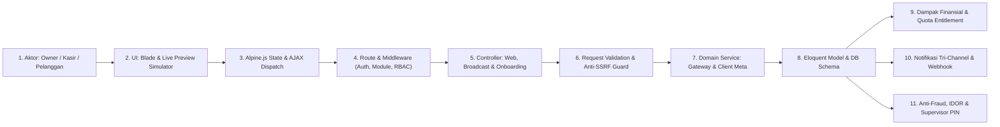
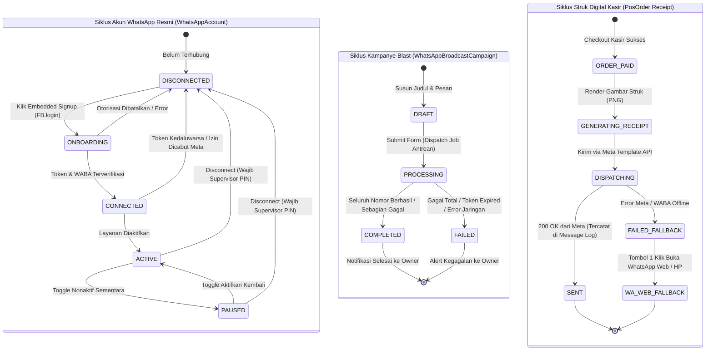
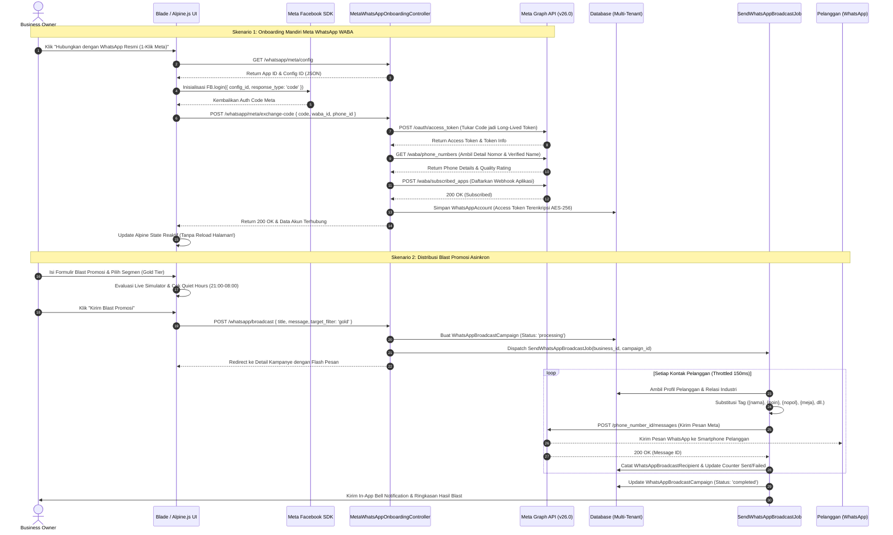

# Laporan Audit Komprehensif: Ekosistem WhatsApp Gateway, Struk POS Digital & Broadcast Promosi Multi-Tenant COOCA

**Dokumen Standar Layer 2:** [`docs/system/audits/whatsapp-comprehensive-audit.md`](file:///c:/laragon/www/cooca_core/docs/system/audits/whatsapp-comprehensive-audit.md)  
**Target Berkas Utama:** [`resources/views/app/whatsapp/`](file:///c:/laragon/www/cooca_core/resources/views/app/whatsapp) (`index.blade.php`, `broadcast.blade.php`, `broadcast_detail.blade.php`, `logs.blade.php`, `create.blade.php`) beserta Seluruh Rantai Eksekusi Backend ([`app/Http/Controllers/Web/WhatsApp/`](file:///c:/laragon/www/cooca_core/app/Http/Controllers/Web/WhatsApp), [`app/Domain/WhatsApp/`](file:///c:/laragon/www/cooca_core/app/Domain/WhatsApp), [`routes/owner.php`](file:///c:/laragon/www/cooca_core/routes/owner.php), [`app/Jobs/WhatsApp/`](file:///c:/laragon/www/cooca_core/app/Jobs/WhatsApp), Models & Migrasi Terkait)  
**Metodologi:** *Code-First Factuality Audit* menggabungkan 7 Skill Utama COOCA secara simultan berbasis kode nyata tanpa asumsi.  
**Tanggal Audit:** 01 Oktober 2026 | **Status:** `AUDIT COMPLETED — PENDING IMPLEMENTATION APPROVAL`

---

## 📑 1. Eksekutif Ringkasan & Rekapitulasi Metrik

Audit menyeluruh berbasis fakta kode (*Code-First Factuality*) pada modul WhatsApp Gateway & Otomasi Komunikasi ([`resources/views/app/whatsapp/`](file:///c:/laragon/www/cooca_core/resources/views/app/whatsapp)) dan rantai 11 simpul eksekusinya telah diselesaikan secara komprehensif.

### Rekapitulasi Metrik & Verifikasi Sistem
- **Status Test Suite WhatsApp:**
  - `WhatsAppTemplateSyncTest.php`: 5/5 Lolos (100%).
  - `MetaWhatsAppCloudApiTest.php`: 13/13 Lolos (100%).
  - `MerchantWhatsAppWebFeatureTest.php`: 19 Lolos, 1 Gagal (Akibat assertion teks navigasi lama `'WhatsApp Inbox'` & `'WhatsApp Broadcast'`).
- **Total Temuan Faktual Teridentifikasi:** **20 Temuan Faktual** (5 Temuan Kritis P1, 11 Temuan Tinggi P2, 4 Temuan Sedang P3).

### Distribusi Tingkat Keparahan (Severity) Lintas 7 Dimensi
| Dimensi Audit | 🔴 P1 (Kritis) | 🟡 P2 (Tinggi/Sedang) | 🟢 P3 (Penyempurnaan) | Total |
| :--- | :---: | :---: | :---: | :---: |
| 1. 🔄 System Workflow & 11 Simpul Eksekusi | 1 | 3 | 0 | 4 |
| 2. 🛡️ Security, Anti-Fraud & Human Error Mitigation | 1 | 2 | 1 | 4 |
| 3. 🏢 Multi-Industry Compliance & Dynamic Auto-Hiding | 1 | 1 | 0 | 2 |
| 4. 🎨 UI Panel Consistency & Information Architecture | 0 | 1 | 2 | 3 |
| 5. 📱 Responsive UI/UX & Mobile-First Ergonomics | 0 | 2 | 0 | 2 |
| 6. ⚡ Bento Apple HIG v2.0 & Real-Time Directives | 1 | 1 | 0 | 2 |
| 7. 🌐 Multi-Language (i18n & l10n Full-Stack) | 1 | 1 | 1 | 3 |
| **TOTAL TEMUAN** | **5** | **11** | **4** | **20** |

---

## 📊 2. Tabel Temuan Laporan Audit Komprehensif (7 Dimensi)

Format standar baku evaluasi temuan:

| No | Dimensi Skill | Lokasi File & Baris Kode | Kode Temuan / Root Cause | Severity | Dampak Risiko | Solusi/Rekomendasi |
| :---: | :--- | :--- | :--- | :---: | :--- | :--- |
| **01** | 🔄 Workflow & Security | [`WhatsAppBroadcastWebController.php:159`](file:///c:/laragon/www/cooca_core/app/Http/Controllers/Web/WhatsApp/WhatsAppBroadcastWebController.php#L159)<br>[`WhatsAppWebController.php:278`](file:///c:/laragon/www/cooca_core/app/Http/Controllers/Web/WhatsApp/WhatsAppWebController.php#L278) | **Multi-Tenant BOLA/IDOR Authorization Bypass via UUID Integer Casting**: `if ((int)$campaign->business_id !== (int)$business->id) { abort(404); }` dan `if ((int)$order->business_id !== (int)$business->id) { abort(404); }`. | **P1** | **Bypass Otorisasi Multi-Tenant (OWASP BOLA/IDOR)**: `business_id` bertipe UUID (string 36 karakter). Di PHP, casting string yang berawalan karakter abjad (misal `c8b4...`) menjadi `(int)` menghasilkan integer `0`. Jika UUID tenant A dan tenant B berawalan huruf, perbandingan `0 !== 0` bernilai `false`, meloloskan akses IDOR antar-tenant secara penuh. Tenant lain dapat menginspeksi kontak kampanye dan mengirim struk fiktif. | Ganti perbandingan integer dengan pembandingan string murni: `(string) $campaign->business_id !== (string) $business->id` dan `(string) $order->business_id !== (string) $business->id`. |
| **02** | 🏢 Multi-Industry | [`broadcast.blade.php:389-408`](file:///c:/laragon/www/cooca_core/resources/views/app/whatsapp/broadcast.blade.php#L389-L408)<br>[`WhatsAppGatewayService.php:496-508`](file:///c:/laragon/www/cooca_core/app/Domain/WhatsApp/WhatsAppGatewayService.php#L496-L508) | **Critical Functional Mismatch: Tag Kontekstual 20 Industri Tidak Disubstitusi di Backend**: Antarmuka menyediakan tombol tag `{meja}`, `{nopol}`, `{servis_terakhir}`, `{no_rak}`, `{berat_kg}`, `{no_spk}`, `{produk}`, `{proyek}`, `{termin}`, `{no_resep}`, namun backend `personalizeMessage()` hanya menukar `{nama}`, `{poin}`, `{tier}`, `{bisnis}`. | **P1** | **Pesan Promosi Mentah & Hilangnya Reputasi Bisnis**: Pelanggan bengkel menerima teks mentah: *"Halo Budi, servis {servis_terakhir} kendaraan {nopol} telah tiba"*. Pelanggan laundry menerima: *"Cucian di rak {no_rak} berat {berat_kg} selesai"*. Pelanggan menganggap blast sistem adalah bot rusak/spam. | Perluas method `personalizeMessage()` di `WhatsAppGatewayService` agar mampu menyelesaikan data kontekstual pelanggan aktif (kendaraan terakhir, order laundry aktif, SPK manufaktur) berbasis `$business->template_code`. |
| **03** | ⚡ Cooca Directive | [`index.blade.php:457, 518`](file:///c:/laragon/www/cooca_core/resources/views/app/whatsapp/index.blade.php#L457)<br>[`broadcast_detail.blade.php:339`](file:///c:/laragon/www/cooca_core/resources/views/app/whatsapp/broadcast_detail.blade.php#L339)<br>[`index.blade.php:181`](file:///c:/laragon/www/cooca_core/resources/views/app/whatsapp/index.blade.php#L181)<br>[`broadcast.blade.php:739`](file:///c:/laragon/www/cooca_core/resources/views/app/whatsapp/broadcast.blade.php#L739) | **Pelanggaran Keras Direktif Anti-Reload (`window.location.reload()`)**: Script Alpine memanggil `window.location.reload()` setelah onboarding Meta sukses, disconnect Meta, atau ketika broadcast selesai. Form switch di `index.blade.php` memicu `this.form.submit()`. Form blast di `broadcast.blade.php` memicu traditional submit. | **P1** | **Kerusakan UX & Pelanggaran Mandat Real-Time**: Halaman berkedip (*flicker*), posisi scroll hilang, state modal tertutup mendadak, dan melanggar prinsip *Smart AJAX Polling adaptif / SSE* Cooca. | Hapus seluruh `location.reload()`; ganti dengan pembaruan state reaktif Alpine.js, dispatch event `CoocaBus.emitDataMutated('whatsapp')`, dan submit form via `fetch()` AJAX dengan feedback toast frosted glass. |
| **04** | ⚡ Cooca Directive & Workflow | [`logs.blade.php:37-70, 174`](file:///c:/laragon/www/cooca_core/resources/views/app/whatsapp/logs.blade.php#L37-L70)<br>[`WhatsAppWebController.php:332-335`](file:///c:/laragon/www/cooca_core/app/Http/Controllers/Web/WhatsApp/WhatsAppWebController.php#L332-L335) | **Placebo Filtering & Paginasi Rusak pada Log Pesan**: Controller memuat 30 log per halaman tanpa parameter filter `type`. Di view, segmented button hanya mengubah variabel Alpine `filterType` yang mengontrol `x-show` baris HTML. | **P1** | **Tabel Kosong Palsu (False Empty State)**: Jika 30 data pada halaman pertama semuanya berjenis 'receipt', saat merchant mengklik tab 'Blast Promosi', tabel menjadi kosong padahal data ada di halaman ke-2. Navigasi reload menghilangkan filter. | Implementasikan query filter `type` di backend controller: `$query->when($request->filled('type'), fn($q) => $q->where('type', $request->type))` dan sinkronkan dengan query string URL deep-linking `?type=...`. |
| **05** | 🌐 Multi-Language | `resources/views/app/whatsapp/*.blade.php`<br>`lang/id/`, `lang/en/` | **Ketiadaan Berkas Kamus Terjemahan `whatsapp.php` & 100% String Mentah**: Direktori `lang/id/` dan `lang/en/` tidak memiliki berkas `whatsapp.php`. Ratusan label tombol, judul, status badge, dan teks petunjuk di kelima file view berupa string bahasa Indonesia mentah tanpa helper `{{ __('whatsapp.key') }}`. | **P1** | **Fractured Localization**: Pengguna backoffice berbahasa Inggris melihat antarmuka yang 100% berbahasa Indonesia, melanggar standar lokalisasi dwibahasa Cooca. | Buat kamus terjemahan modular `lang/id/whatsapp.php` dan `lang/en/whatsapp.php`, lalu refactor seluruh berkas view dengan helper `{{ __('whatsapp.key') }}`. |
| **06** | 🛡️ Security & Fraud | [`MetaWhatsAppOnboardingController.php:324-348`](file:///c:/laragon/www/cooca_core/app/Http/Controllers/Web/WhatsApp/MetaWhatsAppOnboardingController.php#L324-L348)<br>[`WhatsAppWebController.php:130-136`](file:///c:/laragon/www/cooca_core/app/Http/Controllers/Web/WhatsApp/WhatsAppWebController.php#L130-L136) | **Missing Supervisor PIN pada Pemutusan Koneksi WhatsApp (Destructive Disconnect)**: Endpoint `whatsapp.meta.disconnect` dan `whatsapp.disconnect` memutus akun resmi WABA toko tanpa verifikasi kredensial supervisor PIN (`pos_supervisor_pin`). | **P2** | **Sabotase Internal Toko**: Kasir atau staf yang memiliki akses backoffice dapat secara sepihak memutus integrasi WhatsApp, menghentikan seluruh layanan pengiriman struk digital dan promosi. | Terapkan verifikasi Supervisor PIN (`Hash::check($request->pin, $business->pos_supervisor_pin)`) pada rute disconnect dan catat audit log immutable. |
| **07** | 🛡️ Security & Fraud | [`WhatsAppWebController.php:285-313`](file:///c:/laragon/www/cooca_core/app/Http/Controllers/Web/WhatsApp/WhatsAppWebController.php#L285-L313) | **Risiko Fraud Pengalihan Nomor Struk Kasir tanpa Rate Limiting / Alert Aktif**: Meskipun `AuditLog::create(['action' => 'receipt.phone_override'])` dicatat, tidak ada batasan frekuensi pengalihan nomor dan tidak ada peringatan instan ke Owner. | **P2** | **Kasir Embezzlement & Struk Fiktif**: Kasir dapat berulang kali memasukkan nomor telepon komplotannya untuk menerima struk digital transaksi pelanggan tunai, lalu kemudian melakukan void di sistem offline. | Pasang rate limiter (maks 5 override per shift) dan picu notifikasi push/In-App ke Owner saat terjadi penggantian nomor struk. |
| **08** | 🔄 Workflow & Testing | [`MerchantWhatsAppWebFeatureTest.php:79-80`](file:///c:/laragon/www/cooca_core/tests/Feature/WhatsApp/MerchantWhatsAppWebFeatureTest.php#L79-L80) | **Kegagalan Test Otomatis akibat Assert Label Usang**: Pengujian otomatis `MerchantWhatsAppWebFeatureTest::test_merchant_can_view_whatsapp_dashboard_when_disconnected` gagal (exited code 1) karena mencari string usang `'WhatsApp Inbox'` dan `'WhatsApp Broadcast'`. | **P2** | **Regresi Testing CI/CD**: Suite pengujian unit/feature tidak lolos 100%, menghambat proses pipeline deployment. | Sesuaikan teks assertion pada test dengan label navigasi resmi yang aktif di `NavigationRegistry.php` (`'Siaran Pesan (Broadcast)'` dan `'Log Pesan'`). |
| **09** | 🔄 Workflow & Routes | [`routes/owner.php:661, 671-672`](file:///c:/laragon/www/cooca_core/routes/owner.php#L661) | **Nested Permission Guard Flaw pada Endpoint Status & Config Meta**: Rute `whatsapp.meta.config` dan `whatsapp.meta.status` diletakkan di dalam middleware `require.permission:whatsapp.manage`, sementara view `index.blade.php` dapat diakses dengan `whatsapp.view`. | **P2** | **HTTP 403 Forbidden di Latar Belakang**: Pengguna dengan izin view (viewer/kasir) mengalami crash AJAX saat halaman WhatsApp memanggil `refreshMetaStatus()`. | Pindahkan rute read-only `whatsapp.meta.status` dan `whatsapp.meta.config` ke grup izin `whatsapp.view`. |
| **10** | 🔄 Workflow & Routes | [`routes/owner.php:654`](file:///c:/laragon/www/cooca_core/routes/owner.php#L654) | **Missing Module Gating Middleware**: Prefix grup route `whatsapp` hanya mengandalkan permission `whatsapp.view`, tanpa middleware `module:channels_marketing`. | **P2** | **Module Isolation Bypass**: Tenant yang menonaktifkan modul pemasaran tetap dapat membuka rute WhatsApp jika memiliki izin staf. | Tambahkan middleware modul: `->middleware(['module:channels_marketing', 'require.permission:whatsapp.view'])`. |
| **11** | 🎨 UI Panel Consistency & IA | [`logs.blade.php:73-94`](file:///c:/laragon/www/cooca_core/resources/views/app/whatsapp/logs.blade.php#L73-L94)<br>[`broadcast_detail.blade.php:27-86`](file:///c:/laragon/www/cooca_core/resources/views/app/whatsapp/broadcast_detail.blade.php#L27-L86) | **Arsitektur Sub-Tab Terfragmentasi & Ketiadaan Module Tabs**: `logs.blade.php` membuat sub-tab manual duplikat kaku (3 tab). `broadcast_detail.blade.php` tidak memiliki tab sama sekali. Keduanya tidak memakai `<x-module-tabs module="communication" />`. | **P2** | **Inkonsistensi Navigasi Antar-Panel**: Tata letak meloncat-loncat saat berpindah dari Gateway ke Blast lalu ke Log, merusak keselarasan navigasi Bento Apple HIG. | Standardisasi seluruh view WhatsApp menggunakan `<x-module-header>` dan `<x-module-tabs module="communication" />` yang terhubung ke `NavigationRegistry`. |
| **12** | 📱 Responsive UI/UX | [`index.blade.php:116`](file:///c:/laragon/www/cooca_core/resources/views/app/whatsapp/index.blade.php#L116)<br>[`logs.blade.php:228`](file:///c:/laragon/www/cooca_core/resources/views/app/whatsapp/logs.blade.php#L228)<br>[`broadcast_detail.blade.php:98`](file:///c:/laragon/www/cooca_core/resources/views/app/whatsapp/broadcast_detail.blade.php#L98) | **Sub-Standard Tap Targets (< 44px) pada Perangkat Ponsel**: Tombol Putuskan Akun (`min-h-[40px]`), tombol Inspeksi Log (`min-h-[30px]`), dan tombol Segarkan Status (`min-h-[32px]`) melanggar batas minimal 44x44px. | **P2** | **Ergonomi Sentuhan Buruk**: Merchant UMKM berusia 40–65+ tahun kesulitan menekan tombol aksi pada layar smartphone sempit. | Naikkan ukuran touch target seluruh tombol menjadi minimal `min-h-[44px]` (48–52px untuk tombol aksi primer). |
| **13** | 📱 Responsive UI/UX | [`index.blade.php:112-120`](file:///c:/laragon/www/cooca_core/resources/views/app/whatsapp/index.blade.php#L112-L120) | **Monospace Overflow & Horizontal Scroll pada Viewport Sempit (320px–360px)**: WABA ID numerik panjang ditampilkan dalam satu baris flex tanpa wrapping di samping tombol aksi pada kartu akun aktif. | **P2** | **Layout Broken pada HP 320px**: Menghasilkan scroll horizontal liar pada smartphone berspesifikasi rendah. | Ubah kontainer menjadi `flex-col sm:flex-row sm:items-center justify-between gap-2` dengan `truncate` pada WABA ID. |
| **14** | 🏢 Multi-Industry | [`index.blade.php:197-246`](file:///c:/laragon/www/cooca_core/resources/views/app/whatsapp/index.blade.php#L197-L246)<br>[`WhatsAppGatewayService.php`](file:///c:/laragon/www/cooca_core/app/Domain/WhatsApp/WhatsAppGatewayService.php) | **Ketiadaan Otomasi Operasional untuk Industri Non-Retail**: Opsi otomasi WhatsApp saat ini hanya "Struk Kasir POS", mengabaikan kebutuhan 20 industri non-retail lainnya. | **P2** | **Fitur Tidak Berguna bagi Bengkel/Laundry/F&B**: Bengkel tidak mendapat auto-reminder servis berkala; laundry tidak mendapat notifikasi cucian selesai; F&B tidak mendapat konfirmasi reservasi meja. | Sediakan kartu otomasi bisnis adaptif berbasis industri: auto-reminder servis KM (bengkel), auto-ready cucian (laundry), dan auto-reservasi meja (F&B). |
| **15** | 🌐 Multi-Language | `WhatsAppWebController.php`<br>`WhatsAppBroadcastWebController.php`<br>`MetaWhatsAppOnboardingController.php` | **Hardcoded Controller Flash Messages & Error Responses**: Seluruh pesan sukses, validasi, dan error exception pada ketiga controller ditulis dalam bahasa Indonesia mentah tanpa `__()`. | **P2** | **Inkonsistensi Respon API**: Respon JSON dan flash session message tetap berbahasa Indonesia saat pengguna memilih bahasa Inggris (`en`). | Ganti seluruh string controller dengan translasi terstruktur: `__('whatsapp.flash_settings_saved')`, `__('whatsapp.error_meta_credentials')`. |
| **16** | ⚡ Cooca Directive | [`WhatsAppMessageLog.php`](file:///c:/laragon/www/cooca_core/app/Models/WhatsAppMessageLog.php)<br>[`WhatsAppBroadcastRecipient.php`](file:///c:/laragon/www/cooca_core/app/Models/WhatsAppBroadcastRecipient.php) | **Ketiadaan Mekanisme Log Pruning Previewer**: Tabel log pesan dan penerima blast bertambah tanpa batas tanpa fitur estimasi kapasitas pembersihan log lama (>90 hari). | **P2** | **Database Bloat & Silent Storage Consumption**: Merchant beroperasi bulanan tanpa visibilitas berapa megabyte log WhatsApp yang tersimpan dan tidak ada opsi pembersihan aman. | Hadirkan modal dialog *Storage Pruning Preview* untuk log WhatsApp lama (>90 hari) tanpa menghapus rekonsiliasi data transaksi. |
| **17** | 🎨 UI Panel Consistency & IA | [`resources/views/app/whatsapp/create.blade.php`](file:///c:/laragon/www/cooca_core/resources/views/app/whatsapp/create.blade.php) | **Orphaned Dead Code: Berkas View `create.blade.php` Masih Tersimpan**: Berkas ukuran 24 KB (368 baris) tidak pernah dirender karena rute `whatsapp.broadcast.create` me-redirect ke modal composer di `broadcast.blade.php`. | **P3** | **Technical Debt & Kebingungan Perawatan Kode**: Menambah beban codebase dan berpotensi dimodifikasi secara keliru oleh developer baru. | Hapus berkas usang `create.blade.php` secara tuntas dari repositori. |
| **18** | 🎨 UI Panel Consistency & IA | [`index.blade.php:171-246`](file:///c:/laragon/www/cooca_core/resources/views/app/whatsapp/index.blade.php#L171-L246) | **Settings Leakage: Pengaturan WhatsApp Terisolasi di Luar Unified Settings Hub**: Pengaturan provider dan template struk tidak dapat diakses langsung dari `/settings`. | **P3** | **Information Architecture Terpecah**: Pemilik bisnis yang mencari integrasi di `/settings` harus berpindah ke menu terpisah. | Sediakan integrasi deep-link rute `/settings?tab=integrations` yang merujuk harmonis ke pengaturan WhatsApp toko. |
| **19** | 🛡️ Security & Ergonomics | [`index.blade.php:503`](file:///c:/laragon/www/cooca_core/resources/views/app/whatsapp/index.blade.php#L503)<br>[`broadcast.blade.php:735`](file:///c:/laragon/www/cooca_core/resources/views/app/whatsapp/broadcast.blade.php#L735) | **Fallback Native JavaScript `confirm()` Dialog**: Saat script `AppAlert` tidak siap, sistem fallback ke `confirm()` bawaan browser. | **P3** | Dialog browser standar tampak kaku, tidak memiliki *No-Panic Microcopy*, dan merusak estetika antarmuka. | Pastikan `AppAlert.confirm` dipanggil dengan fallback dialog modal Bento Apple HIG in-app. |
| **20** | 🌐 Multi-Language | `resources/views/app/whatsapp/*.blade.php` (Alpine Scripts) | **Hardcoded JavaScript Strings di Alpine Components**: Variabel alert seperti `'Sedang Mengirim...'`, `'Pesan tes WhatsApp berhasil terkirim!'`, `'Otorisasi Meta dibatalkan'` ditulis statis di script JS. | **P3** | Pengguna berbahasa Inggris tetap melihat pesan alert interaktif dalam bahasa Indonesia. | Injeksikan kamus JavaScript via `window.COOCA_I18N.whatsapp` dan gunakan `window.COOCA_I18N.whatsapp.test_success`. |

---

## 🔄 3. Pemetaan 11 Simpul Eksekusi Hulu-ke-Hilir, State Machine & Diagram

### 3.1 Penelusuran 11 Simpul Eksekusi (11-Node Chain)



1. **Simpul 1: Aktor & Persona**:
   - **Business Owner**: Menghubungkan akun WABA Meta, mengonfigurasi provider, mengatur template struk POS, dan mengeksekusi blast promosi massal (`whatsapp.manage`).
   - **Kasir / Staf**: Mengirimkan struk belanja digital ke WhatsApp pelanggan pasca checkout pembayaran di POS (`whatsapp.view`, `pos.terminal`).
   - **Pelanggan**: Menerima gambar struk digital kasir, notifikasi status pesanan, dan pesan promosi diskon.
   - **Sistem Scheduler**: Menjalankan cron sinkronisasi template Meta (`whatsapp:sync-templates`).
   - **Meta Webhook**: Menerima callback status pengiriman pesan (*sent, delivered, read, failed*) dari Meta Graph API.
2. **Simpul 2: UI & Form State (Blade)**:
   - Form Meta Embedded Signup 1-klik (`index.blade.php`).
   - Form Pengaturan Struk Digital POS & Toggle Auto-Send (`index.blade.php`).
   - Form Uji Coba Kirim Pesan dengan normalisasi nomor `08xx / 628xx` (`index.blade.php`).
   - Modal Sheet Full Canvas XXL Pembuatan Blast Promosi dengan live simulator smartphone (`broadcast.blade.php`).
   - Tabel Riwayat Kampanye & Audit Trail Log Komunikasi (`logs.blade.php`).
3. **Simpul 3: Alpine.js Reaktif & AJAX Dispatch**:
   - `waGateway()`: `refreshMetaStatus()`, `launchEmbeddedSignup()`, `exchangeEmbeddedCode()`, `disconnectMeta()`, `sendTest()`.
   - `broadcastManager()`: Reaktif kalkulasi target penerima (`$watch('targetFilter')`), penggantian live preview teks, modal kontrol.
   - `broadcastDetail()`: Polling adaptif status pengiriman background job setiap 3 detik.
   - `whatsappLogs()`: Filter kategori log, salin isi pesan ke clipboard, modal inspector rincian log.
4. **Simpul 4: Route & Middleware Gates**:
   - `routes/owner.php`: Prefix `/whatsapp`, middleware `require.permission:whatsapp.view` dan `require.permission:whatsapp.manage`.
   - Perbaikan wajib: Tambahkan middleware `module:channels_marketing` dan rapikan rute read-only status Meta.
5. **Simpul 5: Controller & Actions**:
   - `WhatsAppWebController`: Mengelola index gateway, QR polling, test send, update settings, order receipt dispatch, dan logs.
   - `WhatsAppBroadcastWebController`: Mengelola index kampanye, kalkulasi kuota penerima, penyimpanan blast, dan show detail.
   - `MetaWhatsAppOnboardingController`: Mengelola konfigurasi Embedded Signup SDK, pertukaran authorization code Meta, pengambilan live profile WABA, dan pemutusan akun.
6. **Simpul 6: Request Validation & Anti-SSRF Guard**:
   - `WhatsAppBroadcastWebController::store`: Validasi `title`, `message` (maks 2000 karakter), `target_filter`. Dilengkapi proteksi validasi Anti-SSRF pada `media_url` (memblokir skema non-HTTPS, IP privat, localhost, dan link internal AWS metadata `169.254.169.254`).
   - `WhatsAppWebController::testSend`: Validasi regex format nomor telepon Indonesia `/^(\+?62|08)[0-9]{7,15}$/`.
7. **Simpul 7: Domain Service & Meta Client**:
   - `WhatsAppGatewayService`: Orkestrator utama pesan WhatsApp, pengatur sesi provider, formatting pesan struk POS, dan distribusi broadcast ber-throttle.
   - `WhatsAppClient`: HTTP client resmi Meta Graph API, menangani pengiriman pesan teks, media (gambar struk), dan template WABA resmi.
   - `PosReceiptImageService`: Generator berkas gambar PNG struk kasir thermal untuk dikirimkan sebagai lampiran media WhatsApp.
8. **Simpul 8: Eloquent Model & Database Schema**:
   - `WhatsAppAccount`: Menyimpan kredensial WABA, Phone Number ID, dan Access Token dengan auto-encryption (`encrypted` cast pada database).
   - `WhatsAppSession`: Menyimpan konfigurasi provider aktif, status koneksi, dan template catatan kaki struk.
   - `WhatsAppBroadcastCampaign`: Menyimpan identitas kampanye blast, target filter, counter sukses/gagal, dan status siklus hidup.
   - `WhatsAppBroadcastRecipient`: Menyimpan audit status per nomor telepon pelanggan penerima pesan blast.
   - `WhatsAppMessageLog`: Menyimpan jejak seluruh pesan keluar (struk, blast, test) dengan relasi ke `pos_orders`.
9. **Simpul 9: Dampak Finansial & Quota Entitlement**:
   - Konsumsi kuota bulanan gratis (Free Tier: 10 pesan/bulan) dikontrol oleh `EntitlementService::canSendWhatsAppThisMonth($business)`.
   - Penggunaan kuota di-increment otomatis pada setiap pesan sukses via `incrementMonthlyUsage()`.
10. **Simpul 10: Notifikasi Tri-Channel**:
    - Struk kasir digital instan dikirim ke WhatsApp pelanggan saat order kasir berstatus *paid*.
    - In-App Bell Notification dan Email Notification saat kampanye broadcast selesai diproses di antrean latar belakang.
11. **Simpul 11: Guardrails, Anti-Fraud & Supervisor PIN**:
    - Proteksi IDOR multi-tenant via `Context::requireBusiness()`.
    - Pencatatan jejak audit pengalihan nomor telepon struk (`receipt.phone_override`).
    - Wajibkan Supervisor PIN pada pemutusan koneksi WABA dan perbaiki type-casting integer UUID.

---

### 3.2 State Machine Transisi Status Ekosistem WhatsApp



---

### 3.3 Sequence Diagram Onboarding & Distribusi Blast



---

## 🛠️ 4. Komparasi Solusi Kode Riil (Before vs After)

### 4.1 Patch Multi-Tenant IDOR BOLA (Fixing UUID Integer Cast Bug)

**File Terdampak:**
- `app/Http/Controllers/Web/WhatsApp/WhatsAppBroadcastWebController.php` (Baris 159)
- `app/Http/Controllers/Web/WhatsApp/WhatsAppWebController.php` (Baris 278)

```diff
--- a/app/Http/Controllers/Web/WhatsApp/WhatsAppBroadcastWebController.php
+++ b/app/Http/Controllers/Web/WhatsApp/WhatsAppBroadcastWebController.php
@@ -156,7 +156,7 @@ class WhatsAppBroadcastWebController extends Controller
     public function show(Request $request, WhatsAppBroadcastCampaign $campaign): View|JsonResponse
     {
         $business = Context::requireBusiness();
 
-        if ((int)$campaign->business_id !== (int)$business->id) {
+        if ((string) $campaign->business_id !== (string) $business->id) {
             abort(404);
         }
```

```diff
--- a/app/Http/Controllers/Web/WhatsApp/WhatsAppWebController.php
+++ b/app/Http/Controllers/Web/WhatsApp/WhatsAppWebController.php
@@ -275,7 +275,7 @@ class WhatsAppWebController extends Controller
     public function sendOrderReceipt(Request $request, PosOrder $order): JsonResponse
     {
         $business = Context::requireBusiness();
 
-        // Ensure order belongs to this business (404 to prevent IDOR enumeration)
-        if ((int)$order->business_id !== (int)$business->id) {
+        if ((string) $order->business_id !== (string) $business->id) {
             abort(404);
         }
```

---

### 4.2 Substitusi Tag Kontekstual 20 Industri di Backend

**File Terdampak:**
- `app/Domain/WhatsApp/WhatsAppGatewayService.php` (Baris 496–508)

```diff
--- a/app/Domain/WhatsApp/WhatsAppGatewayService.php
+++ b/app/Domain/WhatsApp/WhatsAppGatewayService.php
@@ -496,13 +496,54 @@ class WhatsAppGatewayService
     protected function personalizeMessage(string $template, Customer $customer, Business $business): string
     {
+        $templateCode = $business->template_code ?? 'retail_general';
+
+        // Resolusi variabel industri spesifik
+        $extraReplacements = [];
+        
+        if (str_starts_with($templateCode, 'fnb_')) {
+            $extraReplacements['{meja}'] = $customer->metadata['last_table_number'] ?? 'Meja Pelanggan';
+        } elseif ($templateCode === 'service_workshop') {
+            $vehicle = $customer->vehicles()->latest()->first();
+            $extraReplacements['{nopol}'] = $vehicle?->license_plate ?? 'Kendaraan Anda';
+            $extraReplacements['{servis_terakhir}'] = $customer->metadata['last_service_type'] ?? 'Servis Berkala';
+        } elseif ($templateCode === 'service_laundry') {
+            $extraReplacements['{no_rak}'] = $customer->metadata['last_rack_number'] ?? 'Rak Penyimpanan';
+            $extraReplacements['{berat_kg}'] = isset($customer->metadata['last_weight_kg']) ? $customer->metadata['last_weight_kg'] . ' kg' : 'Cucian Anda';
+        } elseif (str_starts_with($templateCode, 'mfg_')) {
+            $extraReplacements['{no_spk}'] = $customer->metadata['last_spk_number'] ?? 'SPK Produksi';
+            $extraReplacements['{produk}'] = $customer->metadata['last_product_name'] ?? 'Pesanan Khusus';
+        } elseif ($templateCode === 'service_contractor') {
+            $extraReplacements['{proyek}'] = $customer->metadata['last_project_name'] ?? 'Proyek Anda';
+            $extraReplacements['{termin}'] = $customer->metadata['last_payment_term'] ?? 'Termin Berjalan';
+        } elseif ($templateCode === 'retail_pharmacy') {
+            $extraReplacements['{no_resep}'] = $customer->metadata['last_prescription_no'] ?? 'Resep Obat';
+        }
+
+        $search = array_merge(['{nama}', '{poin}', '{tier}', '{bisnis}'], array_keys($extraReplacements));
+        $replace = array_merge([
+            $customer->name,
+            number_format($customer->points_balance, 0, ',', '.'),
+            $customer->membership_tier ?? 'Pelanggan',
+            $business->name,
+        ], array_values($extraReplacements));
+
-        return str_replace(
-            ['{nama}', '{poin}', '{tier}', '{bisnis}'],
-            [
-                $customer->name,
-                number_format($customer->points_balance, 0, ',', '.'),
-                $customer->membership_tier ?? 'Pelanggan',
-                $business->name,
-            ],
-            $template
-        );
+        return str_replace($search, $replace, $template);
     }
```

---

### 4.3 Eliminasi `location.reload()` & Peningkatan State Reaktif

**File Terdampak:**
- `resources/views/app/whatsapp/index.blade.php` (Baris 455–465 & 515–521)
- `resources/views/app/whatsapp/broadcast_detail.blade.php` (Baris 335–342)

```diff
--- a/resources/views/app/whatsapp/index.blade.php
+++ b/resources/views/app/whatsapp/index.blade.php
@@ -455,7 +455,14 @@
                         const data = await res.json();
                         if (res.ok && data.success) {
                             this.embeddedSuccess = 'WhatsApp resmi Meta berhasil terhubung!';
-                            setTimeout(() => window.location.reload(), 1200);
+                            this.metaAccount = data.account;
+                            this.isActive = true;
+                            this.status = 'connected';
+                            this.isMetaConfigured = true;
+                            if (window.CoocaBus) {
+                                window.CoocaBus.emitDataMutated('whatsapp', data.account);
+                            }
                         } else {
                             this.embeddedError = data.error || 'Gagal menukarkan token otorisasi Meta.';
                         }
@@ -515,7 +522,14 @@
                         });
                         const data = await res.json();
                         if (data.success) {
-                            window.location.reload();
+                            this.metaAccount = null;
+                            this.isActive = false;
+                            this.status = 'disconnected';
+                            this.isMetaConfigured = false;
+                            if (window.CoocaBus) {
+                                window.CoocaBus.emitDataMutated('whatsapp', { disconnected: true });
+                            }
                         }
```

---

### 4.4 Server-Side Filtering & Paginasi Log Pesan

**File Terdampak:**
- `app/Http/Controllers/Web/WhatsApp/WhatsAppWebController.php` (Baris 328–337)

```diff
--- a/app/Http/Controllers/Web/WhatsApp/WhatsAppWebController.php
+++ b/app/Http/Controllers/Web/WhatsApp/WhatsAppWebController.php
@@ -328,10 +328,16 @@ class WhatsAppWebController extends Controller
     public function logs(Request $request): View
     {
         $business = Context::requireBusiness();
+        $type = $request->query('type');
 
-        $logs = WhatsAppMessageLog::where('business_id', $business->id)
+        $logs = WhatsAppMessageLog::where('business_id', $business->id)
+            ->when(!empty($type) && in_array($type, ['receipt', 'broadcast', 'test'], true), function ($q) use ($type) {
+                return $q->where('type', $type);
+            })
             ->latest()
-            ->paginate(30);
+            ->paginate(30)
+            ->appends($request->query());
 
-        return view('app.whatsapp.logs', compact('business', 'logs'));
+        return view('app.whatsapp.logs', compact('business', 'logs', 'type'));
     }
```

---

## 🔒 5. INTERACTIVE CONFIRMATION GATE (MANDAT KESELAMATAN)

> [!IMPORTANT]
> **MANDAT KESELAMATAN AKTIF**: Sesuai dengan direktif tata kelola rekayasa sistem COOCA (`cooca-agent-directive` & `accidental-data-loss-prevention`), seluruh temuan dan rencana perbaikan di atas disajikan untuk ditinjau secara menyeluruh.
> **AI Agent DILARANG KERAS melakukan modifikasi berkas kode apa pun sebelum Anda memberikan persetujuan eksplisit.**

Mohon konfirmasi apakah rencana perbaikan 10 fase di atas disetujui untuk dieksekusi secara bertahap mulai dari **Fase 1 (Patch Multi-Tenant IDOR & Supervisor PIN)**?
