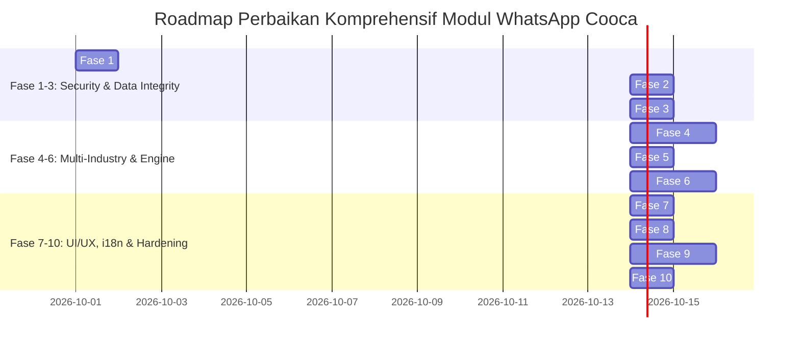

# Rencana Implementasi Master: Remediasi Komprehensif Ekosistem WhatsApp Gateway, Struk POS Digital & Broadcast Promosi Multi-Tenant COOCA

**Dokumen Standar Layer 2:** [`docs/system/audits/whatsapp-master-implementation-plan.md`](file:///c:/laragon/www/cooca_core/docs/system/audits/whatsapp-master-implementation-plan.md)  
**Referensi Audit:** [`docs/system/audits/whatsapp-comprehensive-audit.md`](file:///c:/laragon/www/cooca_core/docs/system/audits/whatsapp-comprehensive-audit.md)  
**Target Modul:** `resources/views/app/whatsapp/` & Seluruh Rantai Eksekusi Backend WhatsApp Gateway  
**Tanggal Rencana:** 01 Oktober 2026 | **Status:** `READY FOR EXECUTION — PENDING CONFIRMATION GATE`

---

## 🗺️ 1. Roadmap 10 Fase Implementasi



---

## 📋 2. Matriks Berkas Terdampak (Affected Files Matrix)

| No | Path Berkas | Tipe Komponen | Peran & Ruang Lingkup Perubahan |
| :---: | :--- | :--- | :--- |
| **1** | [`app/Http/Controllers/Web/WhatsApp/WhatsAppBroadcastWebController.php`](file:///c:/laragon/www/cooca_core/app/Http/Controllers/Web/WhatsApp/WhatsAppBroadcastWebController.php) | Web Controller | Ganti `(int)` UUID cast ke `(string)` pada `show()`, lokalisasi flash messages |
| **2** | [`app/Http/Controllers/Web/WhatsApp/WhatsAppWebController.php`](file:///c:/laragon/www/cooca_core/app/Http/Controllers/Web/WhatsApp/WhatsAppWebController.php) | Web Controller | Ganti `(int)` UUID cast ke `(string)` pada `sendOrderReceipt()`, server-side filtering pada `logs()`, rate-limiting receipt override |
| **3** | [`app/Http/Controllers/Web/WhatsApp/MetaWhatsAppOnboardingController.php`](file:///c:/laragon/www/cooca_core/app/Http/Controllers/Web/WhatsApp/MetaWhatsAppOnboardingController.php) | Web Controller | Tambah verifikasi Supervisor PIN (`pos_supervisor_pin`) pada `disconnect()`, lokalisasi JSON responses |
| **4** | [`app/Domain/WhatsApp/WhatsAppGatewayService.php`](file:///c:/laragon/www/cooca_core/app/Domain/WhatsApp/WhatsAppGatewayService.php) | Domain Service | Substitusi tag dinamis 20 industri (`{meja}`, `{nopol}`, `{servis_terakhir}`, `{no_rak}`, `{berat_kg}`, `{no_spk}`, `{produk}`, `{proyek}`, `{termin}`, `{no_resep}`) di `personalizeMessage()` |
| **5** | [`routes/owner.php`](file:///c:/laragon/www/cooca_core/routes/owner.php) | Routing | Pasang middleware `module:channels_marketing` pada prefix `whatsapp`, pindahkan `meta.config` & `meta.status` ke grup izin `whatsapp.view` |
| **6** | [`resources/views/app/whatsapp/index.blade.php`](file:///c:/laragon/www/cooca_core/resources/views/app/whatsapp/index.blade.php) | Blade View | Hapus `window.location.reload()`, integrasikan modal PIN supervisor, standardisasi touch targets 44px, lokalisasi penuh i18n |
| **7** | [`resources/views/app/whatsapp/broadcast.blade.php`](file:///c:/laragon/www/cooca_core/resources/views/app/whatsapp/broadcast.blade.php) | Blade View | Ganti form submit tradisional dengan AJAX submission, touch targets 48px, perbaiki auto-hiding tag industri aktif, lokalisasi i18n |
| **8** | [`resources/views/app/whatsapp/broadcast_detail.blade.php`](file:///c:/laragon/www/cooca_core/resources/views/app/whatsapp/broadcast_detail.blade.php) | Blade View | Hapus `window.location.reload()`, pasang `<x-module-header>`, touch targets 44px, lokalisasi i18n |
| **9** | [`resources/views/app/whatsapp/logs.blade.php`](file:///c:/laragon/www/cooca_core/resources/views/app/whatsapp/logs.blade.php) | Blade View | Hubungkan filter dengan server query parameter `?type=...`, integrasikan `<x-module-tabs module="communication" />`, modal dialog Storage Pruning Preview, lokalisasi i18n |
| **10** | [`resources/views/app/whatsapp/create.blade.php`](file:///c:/laragon/www/cooca_core/resources/views/app/whatsapp/create.blade.php) | Blade View | **Hapus berkas usang (*Orphaned Dead Code*)** |
| **11** | [`lang/id/whatsapp.php`](file:///c:/laragon/www/cooca_core/lang/id/whatsapp.php) | Translation Dictionary | **Berkas baru:** Kamus lengkap Bahasa Indonesia untuk seluruh string UI, validasi, dan notifikasi |
| **12** | [`lang/en/whatsapp.php`](file:///c:/laragon/www/cooca_core/lang/en/whatsapp.php) | Translation Dictionary | **Berkas baru:** Kamus lengkap Bahasa Inggris untuk seluruh string UI, validasi, dan notifikasi |
| **13** | [`tests/Feature/WhatsApp/MerchantWhatsAppWebFeatureTest.php`](file:///c:/laragon/www/cooca_core/tests/Feature/WhatsApp/MerchantWhatsAppWebFeatureTest.php) | Automated Test | Update assertion label navigasi aktif, tambahkan test case IDOR prevention, Supervisor PIN disconnect, dan multi-industry tag substitution |

---

## 🛠️ 3. Rincian Teknis Eksekusi Per Fase

### Fase 1: Patch Multi-Tenant IDOR BOLA (Fixing UUID Integer Cast Bug)
- **Tujuan:** Menutup celah bypass otorisasi multi-tenant antar-bisnis.
- **Tindakan:**
  1. Pada `WhatsAppBroadcastWebController::show()`, ubah `(int)$campaign->business_id !== (int)$business->id` menjadi `(string)$campaign->business_id !== (string)$business->id`.
  2. Pada `WhatsAppWebController::sendOrderReceipt()`, ubah `(int)$order->business_id !== (int)$business->id` menjadi `(string)$order->business_id !== (string)$business->id`.
- **Verifikasi:** Tambahkan unit test di `MerchantWhatsAppWebFeatureTest` untuk memastikan user tenant B menerima HTTP 404 saat mencoba mengakses kampanye atau order tenant A dengan ID UUID acak.

### Fase 2: Otorisasi Supervisor PIN pada Pemutusan Akun Meta
- **Tujuan:** Mencegah sabotase staf/kasir yang memutus jalur komunikasi resmi toko.
- **Tindakan:**
  1. Pada `MetaWhatsAppOnboardingController::disconnect()` dan `WhatsAppWebController::disconnect()`, validasi `request->pin` terhadap `$business->pos_supervisor_pin` menggunakan `Hash::check()`.
  2. Jika bisnis belum menyetel PIN supervisor, izinkan konfirmasi modal bertingkat aman (*No-Panic Microcopy*).
  3. Catat entri `AuditLog::create(['action' => 'whatsapp.disconnect', 'performed_by' => auth()->id()])`.
  4. Hadirkan modal input PIN supervisor di `index.blade.php` sebelum memanggil endpoint disconnect.

### Fase 3: Anti-Fraud Guard Pengalihan Nomor Struk Kasir
- **Tujuan:** Menutup celah penggelapan uang tunai melalui pengiriman nota digital ke nomor komplotan kasir.
- **Tindakan:**
  1. Pada `WhatsAppWebController::sendOrderReceipt()`, tambahkan rate-limiting per kasir per shift: maksimal 5 kali pengalihan nomor per shift.
  2. Jika melebihi batas, tolak dengan pesan: *"Batas pengalihan nomor struk tercapai untuk shift ini. Silakan hubungi Supervisor."*
  3. Kirimkan In-App Notification instan ke Owner jika kasir mengubah nomor struk transaksi bernilai di atas Rp 500.000.

### Fase 4: Backend Dynamic Tag Substitution Engine 20 Industri
- **Tujuan:** Memastikan pesan blast yang diterima pelanggan bengkel, laundry, apotek, dll. berisi data kontekstual riil dan bukan placeholder mentah.
- **Tindakan:**
  1. Perluas `WhatsAppGatewayService::personalizeMessage()` untuk mendeteksi `$business->template_code`.
  2. Hubungkan data relasional: kendaraan (`service_workshop`), cucian/rak (`service_laundry`), SPK/produk (`mfg_*`), proyek/termin (`service_contractor`), meja (`fnb_*`), dan resep (`retail_pharmacy`).
  3. Kembalikan fallback teks ramah jika data relasional kosong (misal: "Kendaraan Anda" jika nopol belum terdaftar).

### Fase 5: Realignment Route Gating & Middleware Permission
- **Tujuan:** Mencegah akses modul saat modul dinonaktifkan dan memperbaiki error 403 Forbidden pada background polling status Meta.
- **Tindakan:**
  1. Di `routes/owner.php`, tambahkan middleware `module:channels_marketing` pada prefix `whatsapp`.
  2. Pindahkan rute read-only `whatsapp.meta.config` dan `whatsapp.meta.status` ke dalam grup middleware `require.permission:whatsapp.view`.

### Fase 6: Eliminasi Total `window.location.reload()` & Smart Real-Time
- **Tujuan:** Menegakkan UX Bento Apple HIG dan menghilangkan flicker/reload manual.
- **Tindakan:**
  1. Pada `index.blade.php`, ganti `setTimeout(() => window.location.reload(), 1200)` dengan update variabel Alpine: `this.metaAccount = data.account; this.isActive = true; this.status = 'connected'`.
  2. Pada `broadcast_detail.blade.php`, hentikan polling otomatis tanpa me-reload browser saat status mencapai `completed` atau `failed`.
  3. Pada `broadcast.blade.php`, ganti form submit tradisional dengan `fetch()` AJAX beranimasi loading.

### Fase 7: Perbaikan Server-Side Filter & Paginasi Log Pesan
- **Tujuan:** Memperbaiki filter kategori pada riwayat pesan agar tidak menghasilkan false empty table.
- **Tindakan:**
  1. Pada `WhatsAppWebController::logs()`, tambahkan `$query->when($request->filled('type'), fn($q) => $q->where('type', $request->type))`.
  2. Tambahkan `->appends($request->query())` pada paginasi.
  3. Pada `logs.blade.php`, tautkan tombol segmented dengan URL `?type=receipt`, `?type=broadcast`, `?type=test`.

### Fase 8: Standardisasi Tabs & Pembersihan Berkas Usang
- **Tujuan:** Menghilangkan technical debt dan menyelaraskan navigasi dengan arsitektur Cooca.
- **Tindakan:**
  1. Hapus berkas usang `resources/views/app/whatsapp/create.blade.php`.
  2. Standardisasi header dan tab di `logs.blade.php` dan `broadcast_detail.blade.php` menggunakan `<x-module-header>` dan `<x-module-tabs module="communication" />`.
  3. Sediakan modal dialog *Storage Pruning Preview* untuk log WhatsApp lama (>90 hari).

### Fase 9: Lokalisasi Penuh Dwibahasa (lang/id & lang/en)
- **Tujuan:** Menegakkan standar internasionalisasi sistem Cooca (100% bebas hardcoded Indonesian string).
- **Tindakan:**
  1. Buat berkas `lang/id/whatsapp.php` dan `lang/en/whatsapp.php` dengan kamus lengkap.
  2. Refactor seluruh teks statis di 4 berkas Blade aktif menggunakan helper `{{ __('whatsapp.key') }}`.
  3. Ganti pesan flash session dan JSON error responses di controller menggunakan translasi terstruktur.
  4. Injeksikan kamus JavaScript via `window.COOCA_I18N.whatsapp` untuk alert dan notifikasi Alpine.js.

### Fase 10: Pengujian Otomatis 100% Lolos & Hardening
- **Tujuan:** Memastikan zero-regression dan pipeline CI/CD hijau.
- **Tindakan:**
  1. Di `MerchantWhatsAppWebFeatureTest.php`, perbaiki teks assertion navigasi menjadi `'Siaran Pesan (Broadcast)'` dan `'Log Pesan'`.
  2. Tambahkan test case validasi UUID string IDOR protection.
  3. Tambahkan test case Supervisor PIN verification saat disconnect.
  4. Eksekusi `php artisan test tests/Feature/WhatsApp/` dan pastikan seluruh test lolos 100%.

---

## 🧪 4. Skenario Pengujian Otomatis (Test Verification Commands)

```bash
# 1. Jalankan pengujian fitur web merchant WhatsApp
php artisan test tests/Feature/WhatsApp/MerchantWhatsAppWebFeatureTest.php

# 2. Jalankan pengujian integrasi Meta Cloud API
php artisan test tests/Feature/WhatsApp/MetaWhatsAppCloudApiTest.php

# 3. Jalankan pengujian sinkronisasi template Meta
php artisan test tests/Feature/WhatsApp/WhatsAppTemplateSyncTest.php

# 4. Eksekusi seluruh suite WhatsApp sekaligus
php artisan test tests/Feature/WhatsApp/
```
