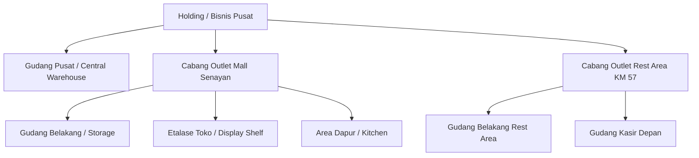

# Kompilasi Studi Kasus Bisnis & Solusi Arsitektur COOCA

> **Status:** CURRENT STATE & ARCHITECTURAL BLUEPRINT  
> **Terakhir Diverifikasi:** 2026-09-27  
> **Ruang Lingkup:** Kompilasi seluruh studi kasus operasional, alur transaksi, multi-harga industri, hierarki cabang-gudang, dan diferensiasi cabang yang telah dianalisis dan dirumuskan.

---

## 📑 Daftar Kasus (Case Studies Index)

1. [Case 1: Paket Menu Kombo & Product Bundling (F&B & Retail)](#case-1-paket-menu-kombo--product-bundling)
2. [Case 2: Multi-Harga Saluran Penjualan & Ojek Online (POS Channel Pricing)](#case-2-multi-harga-saluran-penjualan--ojek-online-pos-channel-pricing)
3. [Case 3: Portal Karyawan & Presensi Mandiri Berbasis Geolocation (Staff Portal RBAC)](#case-3-portal-karyawan--presensi-mandiri-berbasis-geolocation-staff-portal-rbac)
4. [Case 4: Multi-Harga Lintas Karakter Industri (F&B, Retail, Bengkel, Grosir) - Do's & Don'ts](#case-4-multi-harga-lintas-karakter-industri-fnb-retail-bengkel-grosir---dos--donts)
5. [Case 5: Hubungan Cabang, Outlet, dan Gudang Multi-Hierarki (1 Cabang Banyak Gudang & Gudang Pusat)](#case-5-hubungan-cabang-outlet-dan-gudang-multi-hierarki-1-cabang-banyak-gudang--gudang-pusat)
6. [Case 6: Ketersediaan Produk & Diferensiasi Harga per Cabang (Rest Area / Bandara vs Kota)](#case-6-ketersediaan-produk--diferensiasi-harga-per-cabang-rest-area--bandara-vs-kota)

---

## Case 1: Paket Menu Kombo & Product Bundling

### Latar Belakang & Masalah
Bisnis F&B dan retail sering menjual paket kombo (contoh: *Paket Kenyang Hemat = 1 Nasi + 1 Ayam Goreng + 1 Es Teh*) dengan harga paket khusus yang lebih terjangkau daripada membeli satuan.

### Solusi & Aturan Sistem
* **Relasi Bundling:** Model `ProductBundleItem` menampung item anak (`child_product_id`) dan kuantitas pemakaian (`quantity`).
* **Akumulasi HPP Otomatis:** HPP paket kombo dihitung secara dinamis dari akumulasi HPP item anak $\sum(\text{HPP Anak} \times \text{Qty})$, sehingga margin laba paket selalu terukur akurat.
* **Aturan Stok Efektif (Bottleneck / Min-Max):**
  $$\text{Stok Tersedia Paket} = \min_{i \in \text{komponen}} \left( \left\lfloor \frac{\text{Stok Fisik Item Anak}_i}{\text{Kebutuhan per Paket}_i} \right\rfloor \right)$$
* **Auto-Deduction di Kasir POS:** Saat paket terjual di kasir, sistem tidak memotong stok fiktif paket, melainkan langsung mendebit stok fisik bahan baku / produk anak secara proporsional.
* **Recursive Void & Stock Return:** Jika nota transaksi dibatalkan atau void, stok masing-masing komponen anak dikembalikan ke gudang yang bersangkutan.
* **Proteksi Circular Bundling:** Sistem memvalidasi agar Paket A tidak dapat berisi Paket A atau rantai sirkular paket lainnya.

*Dokumentasi Lengkap:* [`docs/system/workflows/product-bundling-and-combo-flow.md`](file:///c:/laragon/www/cooca_core/docs/system/workflows/product-bundling-and-combo-flow.md)

---

## Case 2: Multi-Harga Saluran Penjualan & Ojek Online (POS Channel Pricing)

### Latar Belakang & Masalah
Penjualan melalui platform pesan antar daring (GoFood, GrabFood, ShopeeFood) membebankan komisi platform sebesar 15% - 25%. Merchant membutuhkan penetapan harga yang berbeda per saluran agar margin keuntungan tidak tergerus oleh komisi aplikasi.

### Solusi & Aturan Sistem
* **Tabel Harga Saluran:** Tabel `product_channel_prices` menyimpan `(product_id, channel, price)` untuk 5 saluran: `dine_in`, `takeaway`, `gofood`, `grabfood`, dan `shopeefood`.
* **POS Channel Switcher:** Di terminal POS kasir, tersedia selektor saluran pesanan di atas keranjang belanja.
* **Realtime Cart Recalculation:** Saat kasir mengganti saluran (misal dari *Dine In* ke *GoFood*), seluruh item di keranjang secara otomatis menyesuaikan harganya mengikuti matriks harga saluran tersebut.
* **Pelacakan No. Order Referensi:** Jika memilih saluran online ojol, muncul input field untuk mencatat nomor pesanan dari aplikasi ojol (misal: `GF-104928`).
* **Thermal Receipt & KDS Badge:** Struk kasir ESC/POS dan layar Kitchen Display System mencetak badge saluran yang mencolok beserta nomor referensi agar barista/dapur tidak keliru membungkus pesanan.

*Dokumentasi Lengkap:* [`docs/system/workflows/pos-channel-pricing-and-delivery-flow.md`](file:///c:/laragon/www/cooca_core/docs/system/workflows/pos-channel-pricing-and-delivery-flow.md)

---

## Case 3: Portal Karyawan & Presensi Mandiri Berbasis Geolocation (Staff Portal RBAC)

### Latar Belakang & Masalah
Karyawan operasional (kasir, barista, waiter, staf gudang) membutuhkan akses mandiri via ponsel untuk melakukan absensi, melihat slip gaji, pinjaman kasbon, dan mengajukan cuti. Namun, mereka tidak boleh mengakses menu backoffice sensitif seperti laba rugi, HPP, atau pengaturan perusahaan.

### Solusi & Aturan Sistem
* **Dedicated Route `/portal`:** Rute antarmuka mobile-first Bento Apple HIG terpisah dari `/dashboard`.
* **Role-Based Redirect Guard:** Middleware otomatis mengarahkan staf non-owner/non-manager ke portal mandiri.
* **Presensi Geofencing & Selfie:** Presensi masuk/pulang mengharuskan izin GPS (validasi radius meter dari outlet) serta swafoto kamera depan untuk mencegah manipulasi kehadiran (*titip absen*).
* **Penyaringan Menu Cepat Berbasis Izin (RBAC):** Modul cepat di portal disaring berdasarkan wewenang:
  - Kasir hanya melihat tombol Terminal POS.
  - Staf gudang hanya melihat mutasi stok.
  - Staf tanpa izin backoffice melihat kartu informasi ringkas dan riwayat pribadi tanpa menu yang dilarang.

*Dokumentasi Lengkap:* [`docs/system/workflows/staff-portal-and-attendance-flow.md`](file:///c:/laragon/www/cooca_core/docs/system/workflows/staff-portal-and-attendance-flow.md)

---

## Case 4: Multi-Harga Lintas Karakter Industri (F&B, Retail, Bengkel, Grosir) - Do's & Don'ts

### Latar Belakang & Masalah
Karakter multi-harga pada setiap jenis industri memiliki karakteristik yang sangat berbeda. Menggunakan satu logika yang kaku dapat menimbulkan kekacauan operasional atau kerugian finansial.

### Matriks Karakteristik Industri
1. **F&B / Kafe / Resto:**
   - Dominasi: *Channel-based* (Dine In vs Delivery Ojol) dan *Time-based* (Happy Hour / Promo Event).
   - Fokus: Kecepatan kasir memilih tipe meja/saluran.
2. **Retail / Minimarket / Fashion:**
   - Dominasi: *Volume Tier Pricing* (Beli 1 @ Rp 10.000, Beli 3 @ Rp 27.000, Beli 1 Dus @ Rp 95.000) dan *Customer Loyalty Tier* (Member Bronze, Silver, Gold).
   - Fokus: Otomatisasi barcode scanning tanpa input manual kasir.
3. **Bengkel / Servis Otomotif:**
   - Dominasi: *Job Order Pricing* (Pemisahan Harga Sparepart vs Ongkos Jasa Mekanik) dan *Fleet/Corporate Contracts* (Tarif khusus mobil armada ekspedisi atau langganan instansi).
   - Fokus: Integrasi estimasi Surat Perintah Kerja (PKB/WO) ke faktur akhir.
4. **Grosir / Distributor / B2B:**
   - Dominasi: *Negotiated Contract Pricing* (Tiap toko pelanggan punya matriks harga khusus) dan *Payment Term / Credit Limit* (Harga tunai beda dengan harga tempo 30 hari).
   - Fokus: Validasi plafon piutang sebelum pesanan diantar.

### Panduan Do's & Don'ts Universal
* **DO:**
  - Tetapkan **Master Base Price** sebagai jangkar akuntansi pusat.
  - Snapshot harga final yang disepakati langsung ke baris transaksi (`sale_items.unit_price`), bukan referensi live, agar audit keuangan masa lalu tidak berubah.
  - Berikan otorisasi PIN Supervisor jika kasir hendak memberikan potongan harga di luar sistem.
* **DON'T:**
  - Jangan mengubah data di tabel master `products` ketika harga cabang atau channel berubah.
  - Jangan izinkan kasir mengetik manual harga di POS tanpa audit trail.
  - Jangan mencampuradukkan HPP bahan fisik dengan biaya jasa/labor.

---

## Case 5: Hubungan Cabang, Outlet, dan Gudang Multi-Hierarki (1 Cabang Banyak Gudang & Gudang Pusat)

### Latar Belakang & Masalah
Struktur fisik bisnis berkembang:
- Perusahaan memiliki 1 Gudang Pusat (Central Distribution Center / Hub).
- Satu cabang outlet fisik bisa memiliki beberapa gudang penyimpanan internal: Gudang Transit/Belakang (*Backroom Storage*), Etalase Depan (*Display Shelf*), dan Dapur (*Kitchen/Bar*).

### Kondisi Skema Berjalan Saat Ini
Tabel `locations` menggunakan struktur flat dengan kolom `type` (`outlet`, `warehouse`, `central_kitchen`). Semua lokasi berada langsung di bawah tenant (`business_id`).

### Solusi Arsitektur Hierarki 3 Tingkat
Untuk mengakomodasi 1 cabang memiliki banyak gudang internal:

* **Skema Kolom `parent_id`:** Menambahkan kolom `parent_id` self-referencing pada tabel `locations`.
  - Jika `parent_id = NULL`: Merupakan Cabang Utama (Outlet Utama) atau Gudang Pusat Independen.
  - Jika `parent_id = [Outlet_ID]`: Merupakan sub-gudang internal di bawah cabang tersebut.
* **Alokasi Sumber Stok POS:** Terminal kasir pada cabang tersebut diarahkan untuk memotong stok dari sub-gudang operasional depan (*Display Shelf* atau *Kitchen*).
* **Internal Stock Transfer:** Mutasi stok dari Gudang Belakang ke Etalase Depan dicatat melalui dokumen pemindahan internal tanpa mempengaruhi laporan penjualan.
* **Status Implementasi:** Telah diimplementasikan penuh dan diverifikasi 100% via unit/feature test suite (`tests/Feature/BranchWarehouseHierarchyTest.php`).

*Dokumentasi Lengkap:* [`docs/system/workflows/multi-hierarchy-branch-and-warehouse-flow.md`](file:///c:/laragon/www/cooca_core/docs/system/workflows/multi-hierarchy-branch-and-warehouse-flow.md)

---

## Case 6: Ketersediaan Produk & Diferensiasi Harga per Cabang (Rest Area / Bandara vs Kota)

### Latar Belakang & Masalah
Perusahaan retail dan F&B memiliki banyak cabang dengan karakteristik lokasi berbeda:
- **Cabang Kota (Reguler):** Menjual katalog lengkap dengan harga standar master.
- **Cabang Rest Area Tol / Bandara:** Biaya sewa tempat dan logistik pengiriman barang jauh lebih tinggi, sehingga harga jual dan HPP diset lebih tinggi. Selain itu, menu tertentu yang memerlukan alat masak besar tidak disediakan di cabang rest area.

### Kondisi Implementasi & Mekanisme
* **Tabel Relasi:** `branch_product_prices` menyimpan `(location_id, product_id, price, cost_price, is_available)`.
* **Workflow Master Produk:**
  1. Pemilik bisnis membuka katalog produk dan mengklik tombol **`[Cabang]`**.
  2. Modal Bento menampilkan seluruh daftar cabang.
  3. Pemilik dapat mengaktifkan **Harga Khusus** (misal Rest Area Rp 32.000 vs Master Rp 25.000) dan menentukan HPP khusus cabang.
  4. Pemilik dapat mengaktifkan/menonaktifkan ketersediaan menu di cabang tersebut melalui switch **`is_available`**.

### Temuan Evaluasi & Penyempurnaan yang Diperlukan
1. **Penyempurnaan Filter POS Terminal:**
   - Memastikan query katalog kasir menggunakan klausa `whereNotIn('id', $disabledBranchProductIds)` saat `is_available = false`, agar produk yang dilarang di cabang Rest Area benar-benar lenyap dari etalase kasir Rest Area.
2. **Penyempurnaan UI Modal:**
   - Memisahkan kontrol toggle *Ketersediaan Cabang* dari toggle *Harga Khusus*, agar produk berharga normal dapat dimatikan di cabang tertentu tanpa harus mengisi form harga khusus.
3. **Resolusi Harga Bertingkat (Hierarki Resolusi):**
   - Urutan prioritas harga kasir: **Harga Khusus Cabang** (Rest Area) menjadi dasar (*base*) sebelum persentase markup saluran online (GoFood/GrabFood) diaplikasikan.
