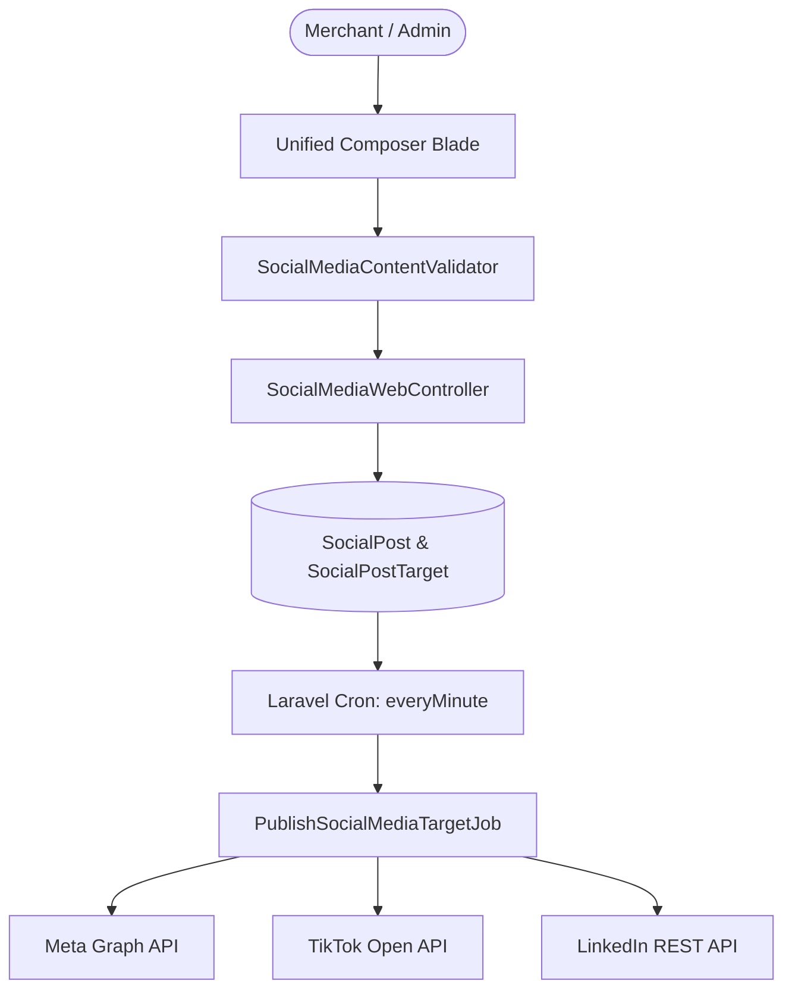

# Modul Media Sosial & Integrasi Platform Meta / TikTok / LinkedIn

> **Layer 2: System Knowledge Document**  
> **Ruang Lingkup:** Integrasi Meta Graph API (Instagram Professional, Facebook Pages, Threads), TikTok Content Posting API, dan LinkedIn Developer Platform (OAuth 2.0 OpenID Connect & UGC Post Publishing) untuk Superadmin Platform Cooca dan Tenant UMKM.

---

## 1. Arsitektur & Peran Modul

Modul Media Sosial melayani dua domain utama:
1. **Platform Center (Superadmin Cockpit)**: Publikasi konten resmi Cooca Indonesia (`@cooca.indonesia`, Facebook Page `Cooca Indonesia`, TikTok, dan LinkedIn), manajemen kotak masuk interaksi/komentar, konfigurasi kredensial platform dinamis, serta dasbor analitik & pertumbuhan organik.
2. **Merchant Hub (Tenant UMKM)**: Penautan akun bisnis merchant (Meta 1-Klik, TikTok 1-Klik, LinkedIn 1-Klik), Unified Omnichannel Composer, penjadwalan konten multi-saluran, auto-refresh token, moderasi komentar, dan penegakan batas karakter serta guardrail industri.

---

## 2. Platform & Provider Matrix

| Platform | Provider Key | Protokol Autentikasi | Batas Karakter Caption Resmi | Aturan Berkas Media | Scopes / Izin Resmi |
| :--- | :--- | :--- | :--- | :--- | :--- |
| **Facebook Pages** | `meta` | OAuth 2.0 (Page Token) | **63.206 karakter** | Feed text, image, video, reel | `pages_show_list`, `pages_read_engagement`, `pages_manage_posts` |
| **Instagram Business** | `meta` | Meta Graph API | **2.200 karakter** | Photo (min 1), Carousel (2-10 items), Reels (9:16), Story | `instagram_basic`, `instagram_content_publish`, `instagram_manage_comments`, `instagram_manage_insights` |
| **Threads** | `meta` | Threads API (`graph.threads.net`) | **500 karakter** | Text, Single Image, Video | `threads_basic`, `threads_content_publish` |
| **TikTok** | `tiktok` | Open API v2 Auth Code | **2.200 karakter** | Direct video posting, Photo Mode (2-35 images) | `user.info.basic`, `video.publish`, `video.upload` |
| **LinkedIn** | `linkedin` | OAuth 2.0 OpenID Connect | **3.000 karakter** | UGC Post feed text, image attachment via Digital Media Asset API | `openid`, `profile`, `email`, `w_member_social` |

---

## 3. Standar Batas Karakter & Kebijakan Caption Terpisah

### A. Batas Karakter Resmi API
- **Threads (500 Karakter)**: Batas mutlak resmi API Meta Threads adalah 500 karakter.
- **Instagram & TikTok (2.200 Karakter)**: Batas standar media sosial berbasis visual.
- **LinkedIn (3.000 Karakter)**: Batas artikel pendek / post profesional.
- **Facebook (63.206 Karakter)**: Batas postingan teks panjang.

### B. Mekanisme Peringatan & Kustomisasi Caption Threads (> 500 Karakter)
1. **Peringatan Interaktif Real-Time**:
   - Jika pengguna memilih channel **Threads** dan mengetik caption utama $> 500$ karakter, antarmuka komposer memunculkan banner peringatan interaktif berwarna oranye:
     > *"Caption utama Anda (:count karakter) melebihi batas resmi Threads (500 karakter). Saluran lain tetap dapat menggunakan caption panjang ini. Buat versi ringkas khusus untuk Threads agar dapat dipublikasikan."*
2. **Tombol 1-Klik Kustomisasi Threads**:
   - Disediakan tombol aksi 1-klik: `[ + Buat Caption Khusus Threads (Maks 500 Karakter) ]`.
   - Menekan tombol ini otomatis membuka accordion kustomisasi saluran Threads, menyalin teks terpotong rapi ($\le 500$ karakter) atau mengizinkan user menginput caption spesifik Threads.
3. **Fleksibilitas Input**:
   - **Mode 1: Mapping 1 Caption untuk Semua Saluran (Default)**: Caption utama otomatis digunakan untuk seluruh target channel yang dipilih.
   - **Mode 2: Input Caption Terpisah per Saluran**: Setiap platform dapat diisi caption yang berbeda sesuai gaya komunikasi (misal: Threads lebih santai & singkat, LinkedIn lebih formal, Instagram visual & deskriptif).

---

## 4. Kebijakan Hashtag COOCA (Maksimal 5 Hashtag Unik)

- **Batasan**: Maksimal **5 hashtag unik** per postingan / channel.
- **Normalisasi & Deduplikasi**: Sistem melakukan case-insensitive deduplication (misal: `#UMKM`, `#umkm`, dan `#Umkm` dihitung sebagai 1 hashtag unik).
- **Enforcement Multi-Layer**:
  - **Client-Side (Alpine.js)**: Live indicator counter (`# X / 5`) berubah warna menjadi merah jika melebihi 5 hashtag, dengan pesan peringatan interaktif.
  - **Backend Validator (`SocialMediaContentValidator`)**: Memvalidasi seluruh hashtag sebelum masuk ke antrean publikasi. Jika $> 5$, sistem menolak dengan pesan error deskriptif.

---

## 5. Guardrail 20 Sektor Industri Bisnis UMKM Indonesia

Sistem mengintegrasikan panduan etika & kepatuhan hukum kontekstual berdasarkan sektor bisnis tenant (`$business->industry`):
1. **Apotek & Farmasi**: Kepatuhan BPOM & Kemenkes (larangan klaim obat keras/psikotropika tanpa resep dokter).
2. **Klinik, Kecantikan & Estetika**: Kepatuhan UU PDP No. 27/2022 & Informed Consent (larangan posting rekam medis/foto pasien tanpa persetujuan tertulis).
3. **Petshop & Klinik Hewan**: Kepatuhan UU Peternakan (larangan jual-beli satwa dilindungi/langka dan obat keras hewan).
4. **Bengkel, Karoseri & Otomotif**: Kepatuhan UU PDP (wajib menyamarkan/blur nomor polisi kendaraan pelanggan).
5. **Salon & Barbershop**: Kepatuhan privasi (wajib meminta izin sebelum mempublikasikan foto *before-after* pelanggan).
6. **Kuliner & F&B**: Panduan Golden Hours posting (10:30-11:30 WIB & 16:30-18:00 WIB untuk lonjakan pesanan).
7. **Percetakan & Manufaktur**: Kepatuhan Hak Cipta & Kerahasiaan Klien (larangan publikasi desain milik klien yang terikat NDA).
8. **Retail & Sektor Lainnya**: Anti-fraud guardrail (deteksi nomor rekening pribadi tidak resmi pada caption).

---

## 6. Standarisasi Multi-Bahasa (i18n) & UI Konsisten

- Seluruh tampilan modul Media Sosial (`posts`, `index`, `calendar`, `inbox`, `insights`) 100% menggunakan kamus terjemahan modular:
  - `lang/id/social_media.php` (Bahasa Indonesia)
  - `lang/en/social_media.php` (English)
- Bebas dari hardcoded strings, mendukung perpindahan bahasa instan via `SetLocaleMiddleware`.
- **Smart Auto-Polling**: Halaman Inbox & Insights dilengkapi auto-polling cerdas di latar belakang untuk memperbarui interaksi komentar dan metrik tanpa me-refresh browser.

---

## 7. Engine Penjadwalan & Job Eksekusi

