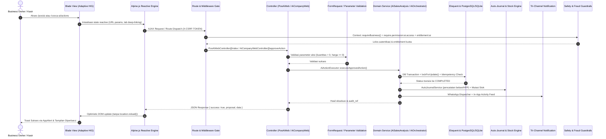
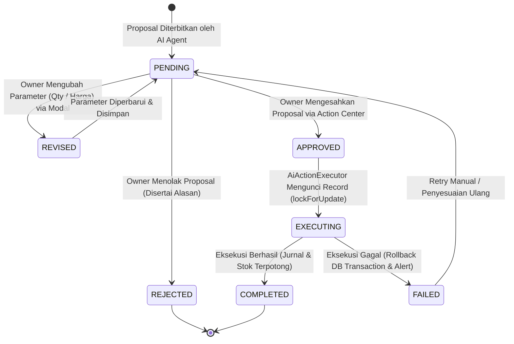

# Alur Kerja COOCA AI Suite: POS Intelligence & Autonomous Virtual Office (Layer 2)

> **Status:** CURRENT STATE (Faktual Terverifikasi)  
> **Modul Terkait:** `resources/views/app/ai/*`, `app/Http/Controllers/Web/Ai/*`, `app/Domain/Ai/*`, `routes/owner.php`  
> **Hierarki Kebenaran:** Aktual Implementasi > Database Schema > Tests > Dokumentasi Lama > Asumsi (DILARANG).

---

## 1. Ikhtisar Ekosistem AI (Overview)

COOCA AI Suite mengintegrasikan dua pilar kecerdasan buatan operasional bisnis:
1. **POS Intelligence & Predictive Analytics (`/pos/ai`):** Analisis prediktif omzet 14 hari (dekomposisi tren linear OLS + bobot musiman 7 hari), sistem peringatan dini kehabisan stok (*velocity*, *runout days*, dan *safety stock*), matriks profitabilitas portofolio produk (BCG / Menu Engineering Matrix), rekomendasi penyesuaian harga pintar (*smart pricing*), deteksi anomali/fraud kasir (Z-score outlier), dan segmentasi perilaku pelanggan (RFM Matrix).
2. **Autonomous Digital Company & AI Workforce (`/cooca-ai`):** Struktur korporasi digital otonom dengan hierarki C-Level (Executive Office, Operations Office, Growth Office), Maker-Checker Action Proposal Gate, Audit Trail riwayat kerja, dan dukungan Multi-Provider BYOAI (OpenAI, Anthropic, Google Gemini, Groq, DeepSeek).

---

## 2. Peta 11 Simpul Eksekusi Hulu-ke-Hilir

---

## 3. Transisi Status Maker-Checker (State Machine)

---

## 4. Keamanan Siber & Pencegahan Fraud Internal

1. **Strict Multi-Tenant Isolation:** Seluruh eksekusi query Eloquent dibatasi oleh `Context::requireBusiness()`. Parameter `$proposal` pada route binding secara ketat diverifikasi apakah `business_id === Context::business()->id`. Percobaan IDOR lintas tenant akan melempar `ModelNotFoundException` (404/403).
2. **Double-Submit Prevention & Reaktivitas Bebas Reload:**
   - Variabel state Alpine `isSubmitting` dan `actionInProgressId` mengunci tombol konfirmasi secara asinkron.
   - Tidak ada pemanggilan `window.location.reload()`. Kartu proposal yang telah disetujui langsung dihapus secara reaktif dari DOM menggunakan filter reactive `processedProposalIds: []`.
3. **Idempotency Guard:**
   - Tabel `ai_action_proposals` menerapkan `UNIQUE (business_id, idempotency_key)`.
   - Eksekutor menggunakan `DB::transaction()` dan `lockForUpdate()` untuk mencegah *race condition* approval ganda.
4. **Peringatan Bertingkat Risiko Tinggi (High/Critical Risk):**
   - Proposal dengan `risk_level` bernilai `HIGH` atau `CRITICAL` memicu dialog konfirmasi dua tahap via `AppAlert.confirm` sebelum request HTTP dikirim ke backend.

---

## 5. Standarisasi Tampilan Apple HIG & Mobile-First

1. **Adaptive Theming:** Mendukung mode terang (*light mode*) dan gelap (*dark mode*) secara adaptif menggunakan token Tailwind `bg-white dark:bg-zinc-900`, `border-slate-200 dark:border-white/10`, serta `text-slate-900 dark:text-white`. Tidak ada warna neon atau pill badge gradien berlebihan.
2. **Zero Unicode Emoji:** Seluruh ikon representasional menggunakan pustaka Lucide SVG (`<i data-lucide="..."></i>`) dengan ukuran terkalibrasi (14px - 20px).
3. **Dual-View Mobile First:**
   - Layar `< md`: Menampilkan kartu bertumpuk (*card stacks*) yang ringkas dan ramah sentuhan.
   - Layar `>= md`: Menampilkan tabel tabular dengan `font-mono tabular-nums`.
   - Ukuran tap target seluruh tombol aksi memenuhi standar Apple Human Interface Guidelines ($\ge 44 \times 44\text{ px}$).
4. **Drill-Down Modal Sheet:** Tampilan modal inspeksi penuh (Full-Size XXL) untuk eksplorasi inventori dan detail parameter eksekusi dengan opsi ekspor data CSV.

---

## 6. Standar Multibahasa (i18n & l10n)

- Draf terjemahan Layer 1 tersimpan di `lang/id/ai.php` dan `lang/en/ai.php`.
- Client-side JavaScript mengonsumsi `window.COOCA_I18N` dan `window.COOCA_LOCALE`.
- Format angka dan mata uang otomatis beradaptasi (`Rp 1.000.000` pada locale `id` dan `IDR 1,000,000` pada locale `en`).

---

## 7. Pengujian Otomatis (Automated Test Suite)

- `tests/Feature/PosAiEngineTest.php`: Memvalidasi kalkulasi proyeksi omset, runout days, deteksi anomali Z-score, matriks BCG, rekomendasi harga, segmentasi RFM, dan antarmuka AI POS (8 tests, 47 assertions).
- `tests/Feature/AiCompanyWorkflowTest.php`: Memvalidasi aksesibilitas lobby AI Office, listing usulan aksi maker-checker, siklus revisi/persetujuan/penolakan, dan pengalihan 301 permanen dari rute warisan `/ai/*` ke canonical `/cooca-ai/*` (4 tests, 17 assertions).
