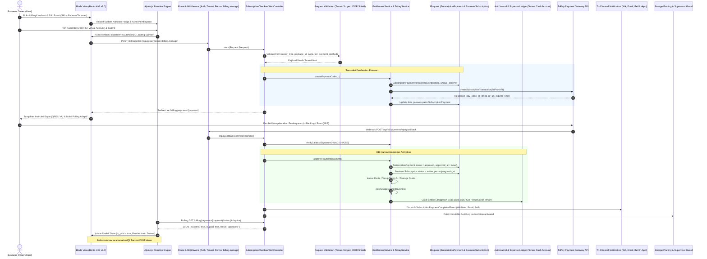
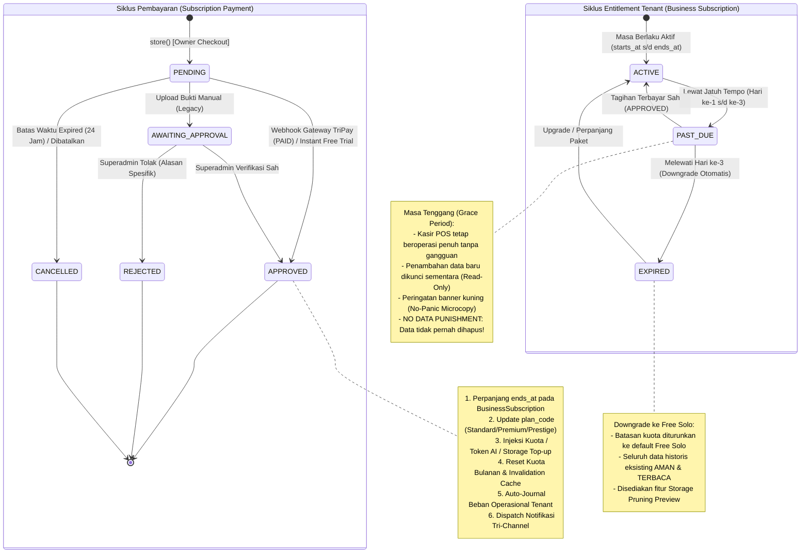

# Alur Kerja Siklus Hidup SaaS Billing, Pembayaran Gateway & Entitlement Kuota (Billing & Entitlement Workflow)

> **Status Dokumen:** `CURRENT STATE (VERIFIED)`  
> **Aktor Terlibat:** Business Owner, Staf Keuangan/Kasir, Superadmin Platform, Gateway TriPay API, Background Cron Worker  
> **Modul Terkait:** SaaS Billing, Limits, Finance/CashLedger, Cloud Storage, AI Engine, Tri-Channel Notifications  
> **Dokumen Rujukan:** [`docs/AUDIT_KOMPREHENSIF_BILLING_7_SKILL.md`](file:///c:/laragon/www/cooca_core/docs/AUDIT_KOMPREHENSIF_BILLING_7_SKILL.md) & [`docs/system/modules/saas-billing.md`](file:///c:/laragon/www/cooca_core/docs/system/modules/saas-billing.md)

---

## 1. Arsitektur 11 Simpul Eksekusi Hulu-ke-Hilir



---

## 2. State Machine Transisi Status Pembayaran & Entitlement Tenant



---

## 3. Rincian 11 Simpul Eksekusi Nyata

### Simpul 1: User / Aktor
- **Business Owner:** Pemegang otoritas penuh keuangan; memilih paket, melakukan pembayaran via TriPay, memantau penggunaan kuota, dan mengelola pembersihan storage.
- **Staf / Kasir:** Dibatasi ketat hanya dengan hak akses operasional kasir; diblokir dari rute pembayaran dan konfigurasi paket (`require.permission:billing.manage`).
- **Superadmin:** Mengelola katalog paket (`BillingPackage`), memantau log webhook pembayaran, dan memverifikasi pesanan manual bila diperlukan.
- **Payment Gateway (TriPay API):** Aktor eksternal otomatis yang menghasilkan nomor Virtual Account, string QRIS dinamis, dan mengirimkan callback webhook HMAC-SHA256 saat dana diterima dari bank pembayar.

### Simpul 2: UI / Blade
- Mengadopsi prinsip **Bento Apple HIG v2.0**:
  - Struktur 3-Baris Page Header terpadu (`<x-module-header>`): Overline modul, H1 Title + Status Badge lisensi, dan Subtitle informatif.
  - Tab navigasi segmented control terpadu (`<x-module-tabs module="billing" />`) dengan deep-linking URL query `?tab=...`.
  - Format angka moneter dengan font monospace tabular `font-mono tabular-nums`.
  - Menghilangkan scroll horizontal pada layar sempit 320px–360px dengan stacked card view responsif.

### Simpul 3: Alpine.js / AJAX Reaktivitas
- **Smart Adaptive Polling:** Polling status mutasi gateway dihentikan secara otomatis saat tab browser diminimalkan (`document.hidden`) menggunakan Page Visibility API.
- **Zero Page Reload:** Menghapus total `window.location.reload()`. Ketika pembayaran sah terdeteksi, state `isPaid = true` mengubah tampilan secara reaktif di DOM seketika.
- **Double-Submit Protection:** Tombol submit checkout dan order dikunci dengan `:disabled="isSubmitting"` untuk mencegah multi-order duplikat.

### Simpul 4: Route & Middleware
- Seluruh rute dilindungi oleh isolasi tenant `Context::requireBusiness()` dan permission bertingkat:
  - Hak Akses Baca (`require.permission:billing.view`): `/billing/limits`, `/billing/history`, `/billing/payments/{payment}`, `/billing/payments/{payment}/invoice`.
  - Hak Akses Kelola (`require.permission:billing.manage`): `/billing/checkout`, `/billing/order`, `/billing/storage/recalculate`, `/billing/storage/files/{storageFile}`.
- Rute bypass bebas bayar `/billing/upgrade` ditutup secara permanen pada lingkungan produksi.

### Simpul 5: Controller
- [`SubscriptionCheckoutWebController`](file:///c:/laragon/www/cooca_core/app/Http/Controllers/Web/Billing/SubscriptionCheckoutWebController.php): Mengelola alur checkout, inisialisasi TriPay, polling status, faktur, dan riwayat pesanan.
- [`BillingAndLimitWebController`](file:///c:/laragon/www/cooca_core/app/Http/Controllers/Web/Billing/BillingAndLimitWebController.php): Mengelola dasbor pemantauan kuota, sinkronisasi storage, dan daftar file tenant.
- [`TripayCallbackController`](file:///c:/laragon/www/cooca_core/app/Http/Controllers/Api/V1/Payment/TripayCallbackController.php): Memverifikasi tanda tangan HMAC-SHA256 callback dan mengeksekusi aktivasi lisensi otomatis.

### Simpul 6: Request Validation
- Memvalidasi pilihan paket terhadap tabel `billing_packages` yang aktif:
  ```php
  'package_id' => ['nullable', 'uuid', Rule::exists('billing_packages', 'id')->where('is_active', true)],
  'cycle' => ['nullable', 'string', 'in:monthly,annual'],
  'tier' => ['nullable', 'string', 'in:standard,premium,prestige'],
  'payment_method' => ['required', 'string', 'in:' . implode(',', $validCodes)],
  ```

### Simpul 7: Domain Action / Service
- [`EntitlementService`](file:///c:/laragon/www/cooca_core/app/Domain/Billing/EntitlementService.php): Mengatur alokasi kuota 4-tier, perpanjangan masa aktif `ends_at`, serta pembersihan cache entitlement (`clearUsageCache`).
- [`TripayService`](file:///c:/laragon/www/cooca_core/app/Domain/Payment/TripayService.php): Membuka transaksi API ke TriPay, menghitung fee transaksi, dan memverifikasi HMAC signature.
- [`StorageTrackingService`](file:///c:/laragon/www/cooca_core/app/Domain/Storage/StorageTrackingService.php): Melacak kapasitas fisik disk dan menghapus berkas aman strictly per-tenant.

### Simpul 8: Eloquent Model & DB Schema
- `BusinessSubscription`: Menyimpan status lisensi (`active`, `past_due`, `expired`), plan code (`standard_monthly`, dll.), kuota AI, serta timestamps masa aktif.
- `SubscriptionPayment`: Menyimpan detail transaksi, nomor pesanan (`SUB-XXXX`), kode bayar VA, URL gambar QRIS, nominal total, dan status verifikasi.
- `StorageFile`: Menyimpan metadata berkas (nama, ukuran dalam bytes, kategori, modul, path disk, status).

### Simpul 9: Auto-Journal & Buku Kas Tenant
- Ketika pembayaran langganan disetujui (`status = approved`), sistem membukukan pencatatan pengeluaran operasional software pada buku kas tenant:
  - **Kategori Beban:** Beban Operasional / Langganan Sistem SaaS
  - **Arus Kas:** Kas Keluar (*Cash Outflow*) pada `CashTransaction` tenant untuk menjaga keakuratan laporan laba rugi bulanan UMKM.

### Simpul 10: Notifikasi Tri-Channel
- **In-App Bell:** Notifikasi real-time ke ikon lonceng dashboard pemilik usaha saat pesanan dibuat dan saat pembayaran berhasil diverifikasi.
- **Email:** Mengirimkan salinan kuitansi resmi dan faktur PDF ke email pemilik akun via `PaymentApprovedInvoiceMail`.
- **WhatsApp Gateway:** Mengirimkan pesan konfirmasi pelunasan otomatis beserta tautan invoice resmi langsung ke nomor WhatsApp pemilik usaha.

### Simpul 11: Guardrails & Perlindungan Human Error
- **No Data Punishment:** Saat tenant mengalami penurunan lisensi (*downgrade*) atau keterlambatan bayar, data produk, transaksi, dan histori tidak pernah dihapus secara sepihak oleh sistem.
- **Storage Pruning Preview:** Menyediakan dialog konfirmasi dua langkah (*No-Panic Microcopy*) sebelum menghapus berkas penyimpanan cloud, lengkap dengan verifikasi keterikatan berkas aktif.
- **Grace Period (3 Hari):** Memberikan toleransi keterlambatan bayar selama 3 hari di mana kasir POS tetap dapat bertransaksi secara normal.

---

## 4. Matriks Isolasi Multi-Industri (Dynamic Context-Aware Auto-Hiding)

Modul Billing menyesuaikan visualisasi kartu kuota berdasarkan 20 sektor industri aktif:
- **Sektor Jasa (Bengkel, Car Wash, Barbershop, Salon, Laundry):** Kartu kuota **Meja Kasir POS (Dine-In)** dan **Resep HPP (BOM)** otomatis disembunyikan menggunakan pengecekan `@if($business->isModuleEnabled(...))`.
- **Sektor Ritel & Grosir (Minimarket, Toko Kelontong, Fashion, Bangunan):** Menampilkan kuota Produk, Outlet Gudang, Pelanggan, dan Struk Transaksi Kasir, sementara kuota Meja Makan disembunyikan.
- **Sektor Kuliner & F&B (Restoran, Kafe, Bakery):** Menampilkan seluruh metrik kuota secara lengkap termasuk Meja Dine-In, Resep Bahan Baku (BOM), dan Kitchen Display System (KDS).
