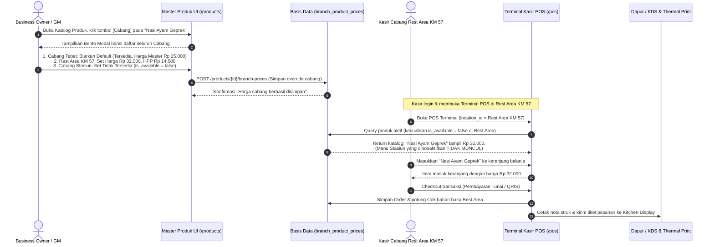

# Alur Ketersediaan Produk & Multi-Harga per Cabang (Branch Assortment & Pricing Flow)

> **Status:** CURRENT STATE & OPERATIONAL GUIDE  
> **Terakhir Diverifikasi:** 2026-09-27  
> **Ruang Lingkup:** Pengaturan ketersediaan produk per cabang (*Branch Assortment*), diferensiasi harga jual & HPP khusus cabang (*Rest Area / Bandara vs Kota*), penyaringan etalase kasir POS, dan resolusi saluran penjualan.

---

## 1. Lokasi Menu & Akses Pengguna

| Peran Pengguna | Lokasi Navigasi di COOCA | Hak Akses (Permissions) | Tujuan |
| :--- | :--- | :--- | :--- |
| **Owner / General Manager** | Sidebar Utama ➔ **Katalog Produk & Model HPP** (`/products`) ➔ Tombol **`[Cabang]`** pada baris produk | `products.manage`, `products.view` + Tier Premium | Menentukan cabang mana saja yang menjual produk serta mengatur harga jual dan HPP khusus per cabang. |
| **Kasir / Store Manager** | Sidebar / Navigasi Cepat ➔ **Terminal POS** (`/pos`) ➔ Pilih Lokasi Cabang (`/pos?location_id={UUID}`) | `pos.access`, `pos.orders.create` | Mengoperasikan penjualan di cabang; katalog kasir secara otomatis hanya menampilkan produk yang tersedia di cabang tersebut dengan harga khusus yang berlaku. |

---

## 2. Diagram Alur Kerja End-to-End (Workflow)



---

## 3. Panduan Penggunaan Langkah demi Langkah (SOP)

### Langkah 1: Membuka Pengaturan Cabang pada Produk
1. Masuk ke aplikasi COOCA menggunakan akun berwenang (*Owner* atau *Manager*).
2. Di menu navigasi samping, klik **Katalog Produk & Model HPP**.
3. Cari produk yang ingin diatur (misal: `"Kopi Susu Gula Aren"`).
4. Pada kolom **Aksi** di tabel desktop (atau tombol menu di kartu mobile), klik tombol **`[Cabang]`** berikon gedung cabang.

```
+-----------------------------------------------------------------------------------------+
| KATALOG PRODUK & MODEL HPP                                             [+ Tambah Produk]|
+-----------------------------------------------------------------------------------------+
| KODE     | NAMA PRODUK            | KATEGORI  | HARGA MASTER | STOK  | AKSI             |
+----------+------------------------+-----------+--------------+-------+------------------+
| KOP-001  | Kopi Susu Gula Aren   | Minuman   | Rp 20.000    | 120   | [Edit] [Cabang]  |
+-----------------------------------------------------------------------------------------+
                                                                             ^
                                                                             Klik di sini
```

### Langkah 2: Mengatur Ketersediaan & Multi-Harga di Modal Bento
Setelah modal terbuka, Anda akan melihat informasi master produk di bagian atas (Harga Pusat: Rp 20.000, HPP Pusat: Rp 8.000) dan daftar seluruh cabang:

```
+---------------------------------------------------------------------------------------+
|  🏢 Pengaturan Ketersediaan & Multi-Harga Cabang                                  [X] |
|  Produk: Kopi Susu Gula Aren (KOP-001) | Harga Pusat: Rp 20.000 | HPP: Rp 8.000       |
+---------------------------------------------------------------------------------------+
|  Aksi Cepat: [✓ Aktifkan Semua Cabang]  [✕ Nonaktifkan Semua]  [Reset ke Master]      |
+---------------------------------------------------------------------------------------+
|  [Card Cabang 1: Outlet Tebet (Kota)]                                                 |
|  Status: [✓ Tersedia untuk Dijual]          Harga Khusus: [ ] Gunakan Harga Khusus    |
|  Keterangan: Mengikuti harga master katalog pusat (Rp 20.000, HPP Rp 8.000)          |
+---------------------------------------------------------------------------------------+
|  [Card Cabang 2: Rest Area KM 57]                                                     |
|  Status: [✓ Tersedia untuk Dijual]          Harga Khusus: [✓] Gunakan Harga Khusus    |
|                                                                                       |
|  Harga Jual Cabang (Rp)*                   HPP Khusus Cabang (Rp, Opsional)           |
|  [Rp 28.000                   ]            [Rp 9.500                      ]           |
|  Estimasi Margin Cabang: 66.1% (Laba Kotor: Rp 18.500 per cup)                        |
+---------------------------------------------------------------------------------------+
|  [Card Cabang 3: Kios Drive-Thru Stasiun]                                             |
|  Status: [✕ Tidak Dijual di Cabang Ini]     Harga Khusus: [ ]                         |
|  Keterangan: Produk dinonaktifkan dari etalase kasir cabang ini.                      |
+---------------------------------------------------------------------------------------+
|                                                           [Batal] [Simpan Perubahan]  |
+---------------------------------------------------------------------------------------+
```

1. **Untuk Cabang Reguler (Harga Master):**
   - Pastikan switch **Tersedia untuk Dijual** aktif (*Hijau*).
   - Biarkan switch **Gunakan Harga Khusus** nonaktif. Cabang ini otomatis mengikuti harga master pusat.
2. **Untuk Cabang Khusus (Rest Area / Bandara):**
   - Pastikan switch **Tersedia untuk Dijual** aktif (*Hijau*).
   - Centang switch **Gunakan Harga Khusus** (*Biru*).
   - Masukkan nominal **Harga Jual Cabang** (contoh: `28000`).
   - Masukkan nominal **HPP Khusus Cabang** jika biaya bahan baku atau ongkos angkut ke lokasi tersebut lebih tinggi (contoh: `9500`).
3. **Untuk Cabang yang Tidak Menjual Menu Ini:**
   - Matikan switch **Tersedia untuk Dijual** (*Abu-abu/Merah*).
   - Sistem menandai bahwa produk ini tidak boleh dijual di cabang bersangkutan.
4. Klik tombol **`[Simpan Perubahan]`**.

---

## 4. Perilaku Sistem di Terminal Kasir POS

Saat kasir di masing-masing cabang membuka Terminal POS:

1. **Di Cabang Tebet (Kota):**
   - Kasir melihat `"Kopi Susu Gula Aren"` seharga **Rp 20.000**.
2. **Di Cabang Rest Area KM 57:**
   - Kasir melihat `"Kopi Susu Gula Aren"` seharga **Rp 28.000**.
   - Saat kasir menjual via pesanan kasir, laba kotor yang dicatat pembukuan menggunakan HPP khusus cabang (Rp 9.500).
3. **Di Cabang Stasiun:**
   - `"Kopi Susu Gula Aren"` **TIDAK MUNCUL** di katalog menu kasir.
   - Jika kasir mencoba mengetik barcode produk tersebut di kotak pencarian, sistem memblokir dengan notifikasi: *"Produk tidak tersedia untuk dijual di cabang ini."*

---

## 5. Hierarki Resolusi Harga Kasir (Price Resolution Order)

Jika bisnis menggunakan kombinasi **Branch Pricing (Cabang)** dan **Channel Pricing (Dine In vs Ojol)**:

```
[ Master Product Base Price ] (Jangkar Dasar: misal Rp 20.000)
             │
             ▼
[ Apakah Cabang Memiliki Harga Khusus? ]
   ├── YA  ──> Gunakan [ Harga Khusus Cabang ] (misal Rest Area Rp 28.000)
   └── TIDAK ─> Gunakan [ Master Product Price ] (misal Rp 20.000)
             │
             ▼
[ Apakah Transaksi Menggunakan Saluran Khusus (Ojol / GoFood)? ]
   ├── YA  ──> Saluran Ojol mengambil harga dasar cabang sebagai basis acuan,
   │           sehingga kasir Rest Area tetap menjual di atas harga standar kota.
   └── TIDAK ─> Gunakan Harga Jual Cabang yang telah ditentukan.
```

---

## 6. Aturan Integritas & Keamanan (Security & Multi-Tenant Guard)
1. **Tenant Isolation:** Parameter `location_id` dan `product_id` selalu divalidasi terhadap `business_id` aktif via `Context::requireBusiness()`. Pengguna tidak dapat memanipulasi cabang milik tenant lain.
2. **Paket Langganan (SaaS Entitlement):** Fitur Multi-Harga per Cabang dilindungi oleh sistem entitlement paket (memerlukan tier Premium atau Add-On Multi-Branch). Staf pada paket Starter/Standard akan menerima modal edukasi upgrade fitur.
3. **Immutability Nota Penjualan:** Perubahan harga cabang di masa mendatang tidak akan pernah mengubah harga pada nota atau jurnal akuntansi transaksi yang sudah selesai di masa lalu.
