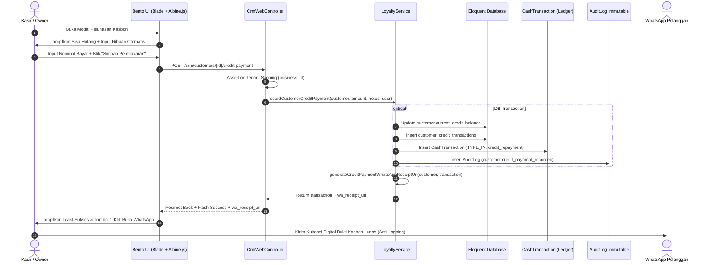

# Alur Kerja Sistem: CRM Loyalitas, Pelanggan & Pusat Bantuan Feedback

> **Layer 2: System Workflow Specification**  
> **Status:** CURRENT STATE (Kondisi Sistem Berjalan & Terverifikasi)  
> **Modul Terkait:** [`resources/views/app/customers/`](file:///c:/laragon/www/cooca_core/resources/views/app/customers), [`resources/views/app/crm/`](file:///c:/laragon/www/cooca_core/resources/views/app/crm), [`resources/views/app/feedback/`](file:///c:/laragon/www/cooca_core/resources/views/app/feedback), [`CustomerWebController`](file:///c:/laragon/www/cooca_core/app/Http/Controllers/Web/CustomerWebController.php), [`CrmWebController`](file:///c:/laragon/www/cooca_core/app/Http/Controllers/Web/Crm/CrmWebController.php), [`FeedbackWebController`](file:///c:/laragon/www/cooca_core/app/Http/Controllers/Web/FeedbackWebController.php), [`LoyaltyService`](file:///c:/laragon/www/cooca_core/app/Domain/Crm/LoyaltyService.php)

---

## 1. Ikhtisar Alur Kerja (Workflow Overview)

Modul Pelanggan, Loyalitas CRM, dan Feedback mengelola seluruh siklus hidup interaksi pelanggan dan komunikasi dukungan teknis di platform Cooca. Alur kerja ini mencakup 4 subsistem terintegrasi:

1. **Direktori Pelanggan & Manajemen Piutang Komersial**: Pendaftaran profil pelanggan, penetapan termin tempo pembayaran, pencatatan alamat ganda (penagihan/pengiriman), dan pemantauan riwayat transaksi faktur.
2. **Program Loyalitas Member & Poin Belanja**: Akumulasi poin belanja otomatis dari transaksi kasir POS, evaluasi kenaikan tier member, dan penukaran poin menjadi potongan diskon belanja.
3. **Kupon Voucher Promosi Kasir**: Pembuatan kupon diskon persentase atau nominal tetap dengan batasan kuota dan masa berlaku untuk transaksi kasir POS.
4. **Pusat Bantuan, Laporan Kendala & Usulan Fitur**: Manajemen tiket laporan bug dan usulan fitur oleh tenant ke tim pengembang platform dengan pelacakan persentase progres.

---

## 2. Pemetaan 11 Simpul Eksekusi Nyata

```
1. User / Aktor        : Business Owner, Kasir POS, Store Manager, Pelanggan
2. UI / Blade View     : app/customers/index.blade.php, app/crm/members.blade.php, app/crm/vouchers.blade.php, app/feedback/*
3. Alpine.js / AJAX    : Filter aktif, kalkulator kasbon, modal sheet XXL, live search, salin voucher
4. Route & Middleware  : routes/owner.php (auth:web, require.permission:*, entitlement:customer)
5. Controller          : CustomerWebController, CrmWebController, FeedbackWebController
6. Request Validation  : Validasi input form (unique voucher per business_id, sanitasi string)
7. Service / Domain    : LoyaltyService, StorageTrackingService
8. Eloquent Model & DB : Customer, Voucher, CustomerPointHistory, CustomerCreditTransaction, BugReport
9. Auto-Journal & Stok : CashTransaction (TYPE_IN) pada pelunasan kasbon, sinkronisasi buku kas aktif
10. Tri-Channel Notif  : In-App Toast, Struk Digital WhatsApp wa.me, Email Notification
11. Guardrails         : Anti-Lapping Shield, Multi-Tenant IDOR Guard, Double-Submit Protection, No-Panic Dialog
```

---

## 3. Diagram Alur Data & Interaksi (Mermaid)

### 3.1 State Machine Transisi Status Pelanggan & Loyalitas

```mermaid
stateDiagram-v2
    direction TB

    state "Siklus Pelanggan & Loyalitas CRM" as CRM_FLOW {
        [*] --> NEW_CONTACT : Tambah Kontak (Customer::create)
        
        NEW_CONTACT --> REGULAR_CUSTOMER : Transaksi Perdana Kasir POS
        REGULAR_CUSTOMER --> MEMBER_BRONZE : Poin Aktif (Total Belanja < 1jt)
        MEMBER_BRONZE --> MEMBER_SILVER : Total Belanja >= 1jt
        MEMBER_SILVER --> MEMBER_GOLD : Total Belanja >= 5jt
        MEMBER_GOLD --> MEMBER_PLATINUM : Total Belanja >= 15jt
        
        REGULAR_CUSTOMER --> CREDIT_DEBTOR : Belanja Kasbon / Tempo
        
        state "Siklus Pelunasan Kasbon (Anti-Lapping Shield)" as CREDIT_PAYMENT {
            CREDIT_DEBTOR --> PARTIAL_PAID : Bayar Sebagian (Auto-Journal Kas IN)
            PARTIAL_PAID --> CREDIT_DEBTOR : Hutang Berkurang
            CREDIT_DEBTOR --> FULLY_PAID : Bayar Lunas (Auto-Journal Kas IN + Audit Log)
            FULLY_PAID --> REGULAR_CUSTOMER : Saldo Kasbon = Rp 0
        }

        REGULAR_CUSTOMER --> INACTIVE : Tidak Ada Transaksi > 180 Hari
        REGULAR_CUSTOMER --> SOFT_DELETED : Hapus Pelanggan (Soft Delete)
    }

    state "Siklus Tiket Feedback" as FEEDBACK_FLOW {
        [*] --> OPEN_OR_SUBMITTED : Laporan Dikirim
        OPEN_OR_SUBMITTED --> TRIAGED : Ditinjau Superadmin
        TRIAGED --> IN_PROGRESS : Dikerjakan Engineering
        IN_PROGRESS --> RESOLVED : Selesai (Progress 100%)
        RESOLVED --> CLOSED : Ditutup
    }
```

### 3.2 Sequence Diagram: Transaksi Pelunasan Kasbon Pelanggan



---

## 4. Aturan Bisnis & Guardrails Utama

1. **Anti-Lapping Protection**: Pelunasan piutang wajib diverifikasi tidak melebihi sisa piutang, tercatat di mutasi kas aktif, dan menyediakan nota WhatsApp resmi.
2. **Tenant Scoping Mandatori**: Seluruh model wajib ter-scope `business_id` aktif (`BelongsToBusiness`).
3. **Poin Belanja & Tiering**: Penghitungan poin belanja dan penentuan status keanggotaan terotomasi penuh tanpa proses manual.
4. **Soft Delete Immutability**: Pelanggan yang dihapus tidak menghapus rekaman transaksi historis masa lalu.
