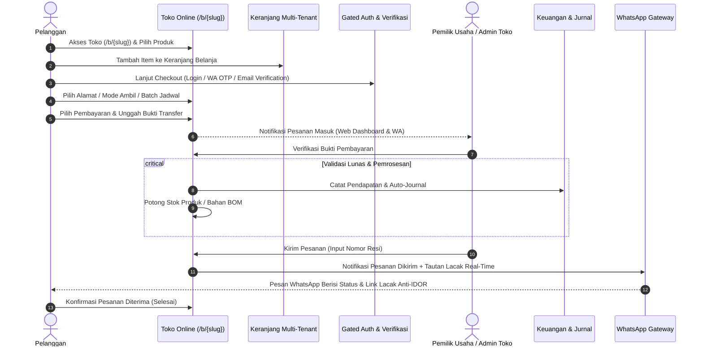

# Alur Kerja Belanja Toko Online (Customer Storefront Flow)

> **Status:** VERIFIED  
> **Aktor Terlibat:** Pelanggan Publik, Merchant (Pemilik Toko), Kurir / Ekspedisi, Subsistem Otomasi  
> **Modul Terkait:** Commerce, Customer Portal, Product, Inventory, Finance, WhatsApp

---

## 1. Diagram Alur Kerja End-to-End

---

## 2. Rincian Langkah Operasional

### Langkah 1: Eksplorasi Toko Publik (`/b/{slug}`)
* **Akses Publik:** Pelanggan membuka tautan toko tanpa kewajiban login awal (*frictionless discovery*).
* **Pemilihan Produk:** Melihat katalog produk, gambar detail, varian harga (misal: *Ukuran/Warna*), serta ketersediaan stok aktual.

### Langkah 2: Keranjang Belanja Multi-Tenant (Isolated Cart)
* Item dimasukkan ke keranjang belanja pelanggan.
* Sistem mengikat keranjang belanja pada `business_id` toko terkait untuk menjamin pemisahan transaksi antar-tenant secara mutlak.

### Langkah 3: Gerbang Autentikasi & Verifikasi (Gated Checkout)
* Untuk menyelesaikan transaksi dan menjamin keaslian pembeli:
  - Pelanggan login menggunakan akun global (`auth:customer`) via Google SSO atau nomor WhatsApp OTP.
  - Alamat pengiriman, nomor telepon aktif, dan catatan pesanan diverifikasi sebelum kalkulasi biaya kirim dilakukan.

### Langkah 4: Pemilihan Metode Pengiriman & Pembayaran
* **Mode Pengiriman:** Kurir Toko / Ekspedisi (dihitung via `commerce_shipping_rules`) atau Ambil Sendiri (*Pickup*).
* **Batch Terjadwal:** Jika toko menerapkan sistem PO terjadwal (katering/bakery), pembeli memilih tanggal batch distribusi yang tersedia.
* **Unggah Bukti Bayar:** Pembeli mentransfer ke nomor rekening/QRIS toko dan mengunggah foto struk transfer (`commerce_payment_proofs`).

### Langkah 5: Konfirmasi Merchant & Eksekusi Otomasi
* Merchant menerima notifikasi instan di dashboard dan pesan WhatsApp.
* Merchant memeriksa bukti transfer dan menekan tombol:
  `[ ✅ Verifikasi & Proses Pesanan ]`.
* Sesaat setelah ditekan:
  - Stok produk atau bahan baku resep BOM otomatis dipotong (*Auto-Stock Deduction*).
  - Pembukuan akuntansi otomatis terbentuk (*Auto-Journaling*).
  - Status pesanan berganti menjadi `processing`.

### Langkah 6: Pelacakan Mandiri Anti-IDOR (`/customer/orders/{id}`)
* Pelanggan dapat memantau status pesanan dan lokasi resi secara live di portal pelanggan.
* **Proteksi IDOR Shield:** Sistem memverifikasi bahwa `customer_id` pada pesanan cocok dengan identitas pengguna yang sedang terautentikasi. Permintaan yang mencoba menebak ID pesanan pengguna lain langsung ditolak dengan HTTP 403 Forbidden.
