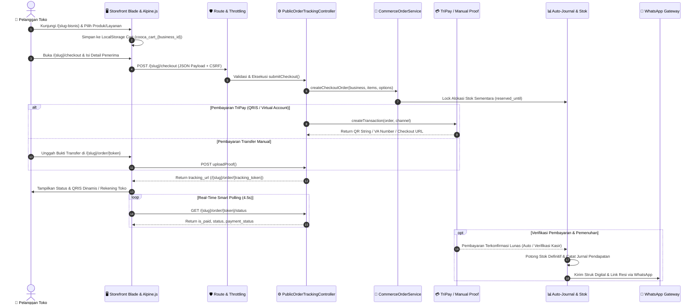

# Alur Kerja Belanja Toko Online (Customer Storefront Workflow)

> **Status:** VERIFIED & COMPREHENSIVELY AUDITED  
> **Aktor Terlibat:** Pelanggan Publik (Guest), Pelanggan Login Google SSO (`auth:customer`), Merchant (Pemilik Toko & Kasir), Kurir / Ekspedisi Logistik, Payment Gateway (TriPay)  
> **Modul Terkait:** Commerce, Storefront, Product, Inventory, Finance, WhatsApp Gateway, Multi-Language (i18n)  
> **Master Rujukan:** [`docs/agent.md`](file:///c:/laragon/www/cooca_core/docs/agent.md), [`docs/SYSTEM_GUIDE.md`](file:///c:/laragon/www/cooca_core/docs/SYSTEM_GUIDE.md)

---

## 1. Diagram Alur Data & State Machine Hulu-ke-Hilir

```mermaid
sequenceDiagram
    autonumber
    actor Cust as 👤 Pelanggan Toko
    participant UI as 🖥️ Storefront Blade & Alpine.js
    participant Route as 🛡️ Route & Throttling
    participant Ctrl as ⚙️ PublicOrderTrackingController
    participant Svc as 💼 CommerceOrderService
    participant Gate as 💳 TriPay / Manual Proof
    participant Fin as 📊 Auto-Journal & Stok
    participant WA as 📲 WhatsApp Gateway

    Cust->>UI: Kunjungi /{slug-bisnis} & Pilih Produk/Layanan
    UI->>UI: Simpan ke LocalStorage Cart (cooca_cart_{business_id})
    Cust->>UI: Buka /{slug}/checkout & Isi Detail Penerima
    UI->>Route: POST /{slug}/checkout (JSON Payload + CSRF)
    Route->>Ctrl: Validasi & Eksekusi submitCheckout()
    Ctrl->>Svc: createCheckoutOrder(business, items, options)
    Svc->>Fin: Lock Alokasi Stok Sementara (reserved_until)
    
    alt Pembayaran TriPay (QRIS / Virtual Account)
        Ctrl->>Gate: createTransaction(order, channel)
        Gate-->>Ctrl: Return QR String / VA Number / Checkout URL
    else Pembayaran Transfer Manual
        Cust->>UI: Unggah Bukti Transfer di /{slug}/order/{token}
        UI->>Ctrl: POST uploadProof()
    end
    
    Ctrl-->>UI: Return tracking_url (/{slug}/order/{tracking_token})
    UI->>Cust: Tampilkan Status & QRIS Dinamis / Rekening Toko
    
    loop Real-Time Smart Polling (4.5s)
        UI->>Ctrl: GET /{slug}/order/{token}/status
        Ctrl-->>UI: Return is_paid, status, payment_status
    end

    opt Verifikasi Pembayaran & Pemenuhan
        Gate-->>Fin: Pembayaran Terkonfirmasi Lunas (Auto / Verifikasi Kasir)
        Fin->>Fin: Potong Stok Definitif & Catat Jurnal Pendapatan
        Fin->>WA: Kirim Struk Digital & Link Resi via WhatsApp
    end
```

---

## 2. 11 Simpul Eksekusi Hulu-ke-Hilir

### Simpul 1: User / Aktor
- **Pelanggan Tamu (Public Guest):** Dapat menjelajah katalog, membaca artikel, memasukkan item ke keranjang, dan melakukan checkout instan tanpa login awal (*frictionless*).
- **Pelanggan Terautentikasi (`auth:customer`):** Login melalui Google SSO untuk sinkronisasi keranjang belanja multi-device dan riwayat pesanan mandiri.
- **Host & Member Pesanan Bersama (Group Order):** Mengelola keranjang patungan kantor/keluarga lengkap dengan rincian split-bill otomatis.

### Simpul 2: UI / Blade Views
- Seluruh antarmuka mengadopsi prinsip desain **COOCA Bento Apple HIG**: geometri squircle kontinu, touch-target 44px+, font input 16px (anti-zoom iOS), tipografi angka SF Pro `tabular-nums`, dan bebas emoji.
- 100% teks antarmuka diikat ke kamus terjemahan modular `{{ __('storefront....') }}`.

### Simpul 3: Alpine.js & Reaktivitas Klien
- Keranjang belanja global (`$store.cart`) diinisialisasi dengan isolasi kunci `cooca_cart_{business_id}`.
- Smart polling asinkron setiap 4.5 detik mendeteksi status pelunasan pembayaran gateway TriPay secara real-time tanpa reload halaman manual.
- Data dari backend di-passing aman menggunakan blade directive `@js([...])`.

### Simpul 4: Route & Middleware
- Canonical routing `/{slug}/...` dilindungi regex proteksi keyword sistem reserved (`admin`, `pos`, `api`, `auth`, dll.).
- Throttling adaptif: Checkout (`throttle:30,1`), Upload Bukti (`throttle:10,60`), Reservasi (`throttle:10,5`).

### Simpul 5: Controller Layer
- `PublicStorefrontController`: Melayani pembacaan beranda, katalog, detail produk, tentang kami, reservasi, kontak, dan artikel dengan proteksi multi-tenant.
- `PublicOrderTrackingController`: Menangani mutasi transaksi checkout, permintaan pesanan khusus (RFQ), Customer PO multi-drop, kalkulasi ongkos kirim, dan pelacakan live status.

### Simpul 6: Request Validation
- Memastikan array `items` memiliki minimal 1 produk, kuantitas berupa bilangan positif (`gt:0`), berkas bukti transfer berformat valid (JPG, PNG, WEBP, PDF) dengan ukuran maksimal 5 MB.

### Simpul 7: Service / Domain Action
- `CommerceOrderService`: Mengorkestrasi pembuatan pesanan dan memvalidasi harga satuan resmi langsung dari database (anti-price tampering).
- `CommerceShippingService`: Menghitung tarif pengiriman berdasarkan aturan kurir toko atau integrasi logistik Biteship.
- `ReservationBookingService`: Memeriksa ketersediaan meja dan slot waktu booking secara otomatis.

### Simpul 8: Eloquent Model & DB Schema
- Seluruh entitas terikat secara mutlak pada relasi `business_id`.
- Composite indexing pada `[business_id, tracking_token]` dan `[business_id, status, created_at]` menjamin query sub-50ms.

### Simpul 9: Auto-Journal & Engine Stok
- Saat pesanan dibuat, sistem mencatat `reserved_until` untuk mengunci alokasi stok sementara.
- Saat pembayaran dinyatakan lunas (`isPaid() === true`), stok barang / bahan baku BOM dipotong secara definitif, dan jurnal akuntansi double-entry langsung terposting ke akun Kas/Bank dan Pendapatan.

### Simpul 10: Notifikasi Tri-Channel
- **In-App:** Live polling status otomatis mengabarkan konfirmasi pembayaran seketika.
- **WhatsApp:** Struk digital dan URL pelacakan anti-IDOR dikirimkan via Meta Cloud API / tautan fallback `wa.me`.
- **Email:** Faktur resmi dikirimkan secara asinkron via Laravel Queue.

### Simpul 11: Guardrails & Safety Policy
- Validasi status toko aktif (`is_active = true`) dan landing page publikasi (`is_published = true`).
- Pengalihan otomatis (*auto-hide redirect*) jika pelanggan mencoba mengakses halaman/fitur yang dinonaktifkan oleh pemilik toko.

---

## 3. Matriks Dynamic Context-Aware Auto-Hiding 20 Sektor Industri

| Klaster Industri | Sektor Bisnis | Opsi Makan di Tempat (Dine-In) | Terminologi Reservasi | Mode Pengiriman Dominan |
|---|---|---|---|---|
| **F&B / Kuliner** | Resto, Kafe, Katering, Bakery | ✅ **Aktif** (Pilihan Meja) | *Reservasi Meja & Ruangan* | Delivery, Ambil di Toko, Makan di Tempat |
| **Retail & Dagang** | Butik, Minimarket, Gadget, Petshop, Bangunan | ❌ **Otomatis Sembunyi** | *Janji Temu Konsultasi Produk* | Ekspedisi Kurir & Ambil di Toko |
| **Otomotif & Reparasi** | Bengkel Mobil/Motor, Car Wash, Variasi | ❌ **Otomatis Sembunyi** | *Booking Jadwal Servis & Perawatan* | Layanan di Bengkel & Home Service |
| **Jasa Profesional & Personal** | Klinik Pratama, Apotek, Salon, Laundry | ❌ **Otomatis Sembunyi** | *Booking Treatment / Jadwal Dokter* | Ambil/Antar Laundry, Datang ke Klinik/Salon |
| **Manufaktur & Kerajinan** | Konveksi/Garmen, Makanan Oleh-oleh, Mebel | ❌ **Otomatis Sembunyi** | *Konsultasi Desain & Sampling PO* | Pengiriman Kargo & PO Terjadwal |
| **Agribisnis & Peternakan** | Pertanian Hidroponik, Peternakan | ❌ **Otomatis Sembunyi** | *Kunjungan Kebun / Pemesanan Bibit* | Distribusi Pengiriman Rutin / Pickup |

---

## 4. Standarisasi Multi-Bahasa (i18n & l10n)

Sistem Storefront Publik COOCA mendukung lokalisasi penuh:
- **Bahasa Indonesia (`id`):** Kamus modular di [`lang/id/storefront.php`](file:///c:/laragon/www/cooca_core/lang/id/storefront.php).
- **English (`en`):** Kamus modular di [`lang/en/storefront.php`](file:///c:/laragon/www/cooca_core/lang/en/storefront.php).
- **Format Uang:** Terformat dengan `tabular-nums` (`Rp 250.000` pada locale ID dan `IDR 250,000` pada locale EN).
- **Format Tanggal:** Menggunakan `translatedFormat('l, d F Y')` yang adaptif terhadap `app()->getLocale()`.
