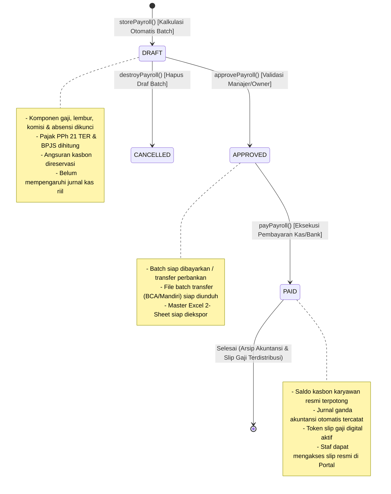
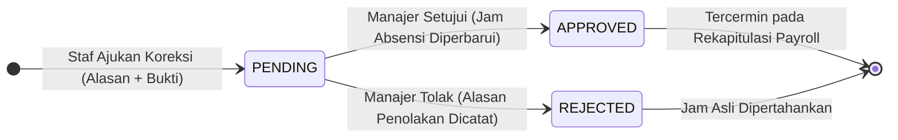
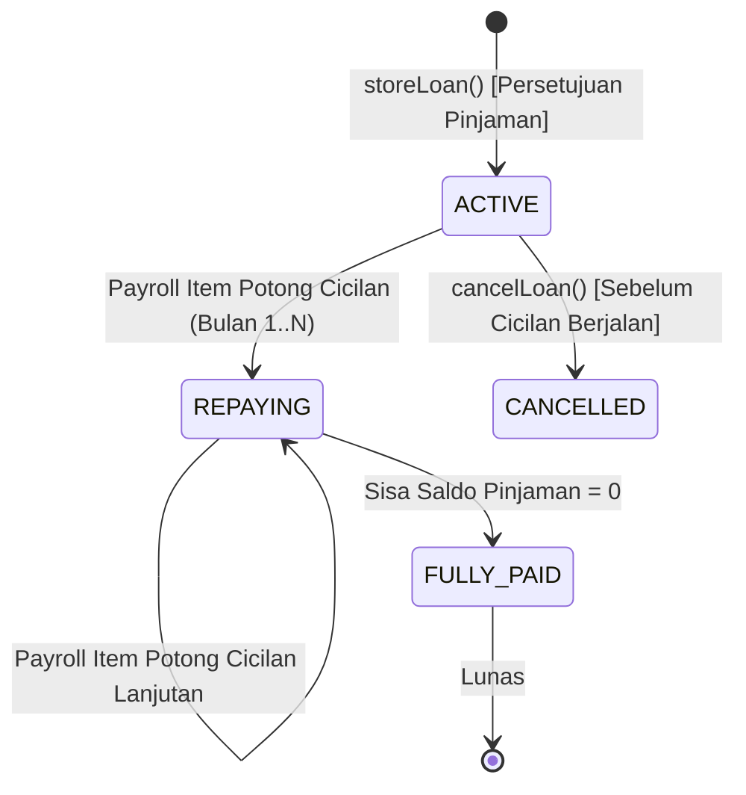
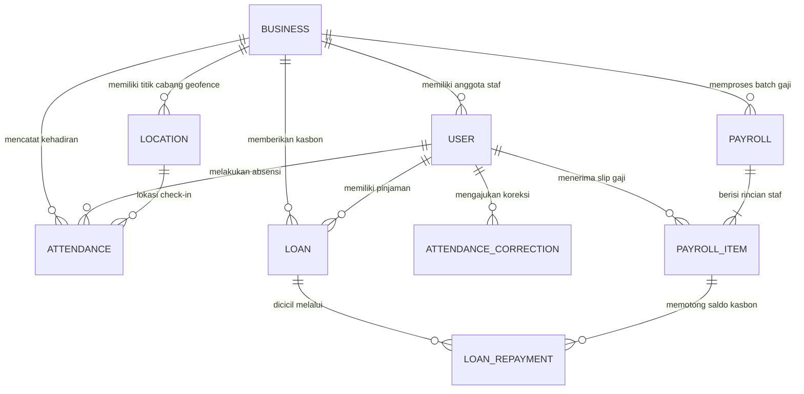

# Alur Kerja Siklus Hidup SDM, Presensi Biometrik, Geofencing, Penggajian & Kepatuhan Pajak (HRM & Payroll Lifecycle Workflow)

> **Status Dokumen:** `CURRENT STATE (VERIFIED & TESTED - 100% PASS)`  
> **Aktor Terlibat:** Business Owner, HR/Payroll Manager, Supervisor Cabang, Staf Karyawan, Kasir/Barista, WhatsApp Cloud Dispatcher  
> **Modul Terkait:** HRM, Staff Self-Service Portal, Attendance Geofence, Biometric Face Engine, Payroll Engine, Tax Compliance (PPh 21 TER), Accounting Cash Ledger, Multi-Sheet Excel Exporter  
> **Kepatuhan Regulasi:** PP No. 58/2023 (PPh 21 TER), UU BPJS Ketenagakerjaan & Kesehatan, Permenaker No. 6/2016 (THR Keagamaan), Kepmenakertrans No. 102/2004 (Lembur)  
> **Tabel Basis Data:** `users`, `business_users`, `employees`, `attendances`, `attendance_corrections`, `locations`, `loans`, `loan_repayments`, `payrolls`, `payroll_items`, `accounting_journals`, `audit_logs`

---

## 1. Arsitektur 11 Simpul Eksekusi Hulu-ke-Hilir

```mermaid
sequenceDiagram
    autonumber
    actor Staf as Staf / Karyawan (Portal Mobile)
    actor Mgr as HR Manager / Owner (Backoffice)
    participant UI as Portal & HRM Blade Views (Apple HIG Bento)
    participant Alpine as Alpine.js State & Biometric Engine
    participant Route as Route & Middleware (Auth, Tenant Context, RBAC)
    participant Ctrl as HrmWebController & PortalWebController
    participant SvcPresensi as Biometric & Geofence Engine (Haversine)
    participant SvcPayroll as PayrollCalculationService & PayrollRunService
    participant SvcTax as PPh21CalculationService (TER PP 58/2023)
    participant SvcBpjs as BPJSCalculationService (BPJS TK & Kes)
    participant Model as Eloquent (Payroll, PayrollItem, Attendance, Loan)
    participant Fin as Accounting Engine (Journal & Cash Ledger)
    participant Xlsx as PayrollTwoPartExcelExport (PhpSpreadsheet)
    participant WA as WhatsApp Dispatcher (Cloud API / wa.me)

    %% Simpul 1 & 2: Presensi Biometrik Liveness & Geofencing
    rect rgb(240, 248, 255)
        Note over Staf,SvcPresensi: SIMPUL 1 & 2: Presensi Mandiri, Biometrik & Geofence
        Staf->>UI: Akses /portal via Smartphone
        UI->>Alpine: Inisialisasi Kamera & GPS Navigator
        Staf->>Alpine: Buka Modal Kamera & Ikuti Challenge Liveness (Kedip/Senyum/Hadap Kiri)
        Alpine->>Alpine: Verifikasi Liveness Challenge di Client & Tangkap Snapshot
        Staf->>UI: Klik [ Presensi Masuk / Pulang ]
        UI->>Route: POST /hrm/attendance/clock-in {lat, lng, photo_base64, location_id}
        Route->>Ctrl: clockIn(Request $request)
        Ctrl->>SvcPresensi: Validasi Geofencing Formula Haversine (Radius <= Radius Cabang)
        Ctrl->>SvcPresensi: Verifikasi Kecocokan Biometrik Face Embedding
        Ctrl->>Model: Attendance::create(status=present/late, verified_biometric=true)
        Ctrl-->>UI: Response JSON Sukses & Render Riwayat Real-Time
    end

    %% Simpul 3 & 4: Koreksi Presensi & Maker-Checker Approval
    rect rgb(255, 250, 240)
        Note over Staf,Mgr: SIMPUL 3 & 4: Pengajuan & Koreksi Presensi (Maker-Checker)
        Staf->>UI: Ajukan Koreksi Jam Masuk/Pulang (Misal: Kendala GPS / Lembur Lapangan)
        UI->>Route: POST /hrm/attendance/corrections
        Route->>Ctrl: storeCorrection() -> Status: Pending
        Mgr->>UI: Buka Tab Koreksi di Hub SDM & Bandingkan Visual Diff Jam Kerja
        Mgr->>Route: POST /hrm/attendance/corrections/{id}/approve
        Route->>Ctrl: approveCorrection() -> Update Attendance & Status: Approved
    end

    %% Simpul 5: Pinjaman & Kasbon Karyawan
    rect rgb(245, 245, 255)
        Note over Staf,Mgr: SIMPUL 5: Kasbon & Pinjaman Internal
        Mgr->>UI: Input Pinjaman Kasbon Karyawan (/hrm/loans)
        UI->>Route: POST /hrm/loans (Jumlah, Cicilan Per Bulan, Alasan)
        Route->>Ctrl: storeLoan() -> Model Loan::create(status=active, remaining_balance)
        Ctrl->>Fin: Jurnal Kas Keluar (Debit: Piutang Karyawan, Kredit: Kas/Bank)
    end

    %% Simpul 6 & 7: Payroll Batch Generation, PPh 21 TER & BPJS Engine
    rect rgb(240, 255, 240)
        Note over Mgr,SvcBpjs: SIMPUL 6 & 7: Kalkulasi Multi-Komponen Penggajian
        Mgr->>UI: Buka /payrolls/create & Pilih Periode Bulan/Tahun
        UI->>Alpine: Kalkulasi Instan Pratinjau Upah & Beban Usaha
        Mgr->>Route: POST /payrolls {period_month, period_year, include_thr, notes}
        Route->>Ctrl: storePayroll()
        Ctrl->>SvcPayroll: calculateBatch(business, month, year, includeThr)
        
        loop Setiap Karyawan Terdaftar
            SvcPayroll->>SvcPayroll: Agregasi Kehadiran, Jam Lembur, Komisi SPK & Hari Kerja
            SvcPayroll->>SvcTax: calculatePPh21(grossPay, ptkpStatus) [TER A/B/C PP 58/2023]
            SvcPayroll->>SvcBpjs: calculateBPJS(baseSalary, hasTk, hasKes, jkkTier)
            SvcPayroll->>Model: Potong Cicilan Kasbon Aktif (Loan Deduction)
            SvcPayroll->>Model: PayrollItem::create(gross, pph21, bpjs, loans, thp, company_cost)
        end
        
        SvcPayroll->>Model: Payroll::create(status=draft, total_thp, total_company_cost)
        Ctrl-->>UI: Redirect ke /payrolls/{id} (Status: Draf)
    end

    %% Simpul 8 & 9: Persetujuan, Pembayaran Gaji & Auto-Journaling
    rect rgb(255, 245, 245)
        Note over Mgr,Fin: SIMPUL 8 & 9: Approval, Pembayaran & Penjurnalan Otomatis
        Mgr->>Route: POST /payrolls/{id}/approve (Izin: users.manage)
        Route->>Ctrl: approvePayroll() -> Status: Approved
        Mgr->>UI: Klik [ Tandai Dibayar (Mark Paid) ] & Pilih Metode (Bank/Cash)
        UI->>Route: POST /payrolls/{id}/pay {payment_method, notes}
        Route->>Ctrl: payPayroll()
        Ctrl->>SvcPayroll: markPayrollPaid()
        SvcPayroll->>Model: Payroll status=paid, paid_at=now()
        SvcPayroll->>Model: Potong Saldo Pinjaman (LoanRepayment::create)
        SvcPayroll->>Fin: Auto-Journaling Beban Penggajian:
        Note over Fin: Debit: Beban Gaji & Upah (5-101)<br/>Debit: Beban Iuran BPJS Kantor (5-102)<br/>Kredit: Kas/Bank (1-101/1-102)<br/>Kredit: Hutang Pajak PPh 21 (2-103)<br/>Kredit: Hutang Iuran BPJS (2-104)<br/>Kredit: Piutang Kasbon Karyawan (1-105)
    end

    %% Simpul 10 & 11: Master Excel 2-Sheet, Web Drill-Down & WhatsApp Dispatcher
    rect rgb(240, 248, 255)
        Note over Mgr,WA: SIMPUL 10 & 11: Master Exporter Excel 2-Sheet, Drill-Down & WA
        Mgr->>UI: Klik [ Ekspor Excel (XLSX) ]
        UI->>Route: GET /payrolls/{id}/export-excel
        Route->>Ctrl: exportPayrollExcel()
        Ctrl->>Xlsx: download() [Sheet 1: Bento KPI, Sheet 2: Buku Besar Formula =SUM()]
        Xlsx-->>Mgr: Streamed File Laporan_Penggajian_{slug}_{period}.xlsx
        
        Mgr->>UI: Klik [ Rincian Kalkulasi ] pada Baris Staf
        UI->>Alpine: Buka Modal Drill-Down (max-w-4xl) Dekonstruksi Upah & Beban Kantor Instan
        
        Mgr->>UI: Klik [ Kirim WhatsApp ] pada Baris Staf
        UI->>WA: Buka Deep-Link WhatsApp dengan Pesan Slip Gaji Enkripsi Token Unik
        WA-->>Staf: Pesan Masuk WA & Tautan Slip Digital Pribadi (/portal/payslip/{token})
    end
```

---

## 2. State Machine Transisi Status Sistem

### A. Siklus Penggajian Bulanan (Monthly Payroll Lifecycle)

### B. Siklus Pengajuan Koreksi Presensi (Attendance Correction Lifecycle)

### C. Siklus Kasbon & Pinjaman Karyawan (Staff Loan Lifecycle)

---

## 3. Spesifikasi Perhitungan Regulasi & Kepatuhan Hukum

### A. Tarif Efektif Rata-Rata Pajak PPh 21 (PP No. 58 Tahun 2023)
Sistem secara otomatis mengelompokkan kategori PTKP ke dalam 3 tabel TER:
1. **TER Kategori A:** TK/0 (54 jt), TK/1 (58,5 jt), K/0 (58,5 jt) $\rightarrow$ Tarif 0% s/d 34%.
2. **TER Kategori B:** TK/2 (63 jt), TK/3 (67,5 jt), K/1 (63 jt), K/2 (67,5 jt) $\rightarrow$ Tarif 0% s/d 34%.
3. **TER Kategori C:** K/3 (72 jt) $\rightarrow$ Tarif 0% s/d 34%.

$$\text{PPh 21 Bulanan} = \text{Penghasilan Bruto} \times \text{Tarif TER}_{\text{Kategori}}(\text{Penghasilan Bruto})$$

### B. Formula Iuran BPJS Ketenagakerjaan & Kesehatan
1. **BPJS Ketenagakerjaan:**
   - **JHT (Jaminan Hari Tua):** $3.7\%$ ditanggung Perusahaan, $2.0\%$ dipotong dari Gaji Staf.
   - **JP (Jaminan Pensiun):** $2.0\%$ ditanggung Perusahaan, $1.0\%$ dipotong dari Gaji Staf (dengan batas upah maksimal BPJS).
   - **JKK (Jaminan Kecelakaan Kerja):** $0.24\% - 1.74\%$ ditanggung Perusahaan penuh sesuai tingkat risiko usaha.
   - **JKM (Jaminan Kematian):** $0.30\%$ ditanggung Perusahaan penuh.
2. **BPJS Kesehatan:**
   - $4.0\%$ ditanggung Perusahaan, $1.0\%$ dipotong dari Gaji Staf (dengan batas maksimal upah Rp 12.000.000).

### C. THR Keagamaan Prorata (Permenaker No. 6 Tahun 2016)
- Masa kerja $\ge 12\text{ bulan}$: $1\times \text{Upah Sebulan}$ (Gaji Pokok + Tunjangan Tetap).
- Masa kerja $1 \le N < 12\text{ bulan}$: $\frac{N}{12} \times \text{Upah Sebulan}$.

### D. Formula Upah Lembur (Kepmenakertrans No. 102/2004)
$$\text{Upah Sejam} = \frac{\text{Gaji Pokok} + \text{Tunjangan Tetap}}{173}$$
- Hari Kerja: Jam ke-1 $= 1.5\times \text{Upah Sejam}$, Jam ke-2 dst $= 2.0\times \text{Upah Sejam}$.
- Hari Libur: Jam 1-7 $= 2.0\times \text{Upah Sejam}$, Jam ke-8 $= 3.0\times$, Jam ke-9 dst $= 4.0\times$.

---

## 4. Spesifikasi Teknis Master Exporter Excel (XLSX) 2-Sheet

Service [`app/Domain/HRM/Exports/PayrollTwoPartExcelExport.php`](file:///c:/laragon/www/cooca_core/app/Domain/HRM/Exports/PayrollTwoPartExcelExport.php) menghasilkan berkas Excel berstandar akuntansi dengan 2 lembar kerja:

### Sheet 1: `Ringkasan Eksekutif`
- **Bento KPI Metric Cards (#F2F2F7)**: Total Karyawan, Total Take-Home Pay, Total Beban Perusahaan, Total Potongan PPh 21.
- **Tabel Akumulasi Pengeluaran**: Menampilkan 15 baris komponen penerimaan dan pengeluaran agregat dengan styling semantik:
  - Subtotal Bruto (#F2F2F7)
  - Subtotal Potongan (#F2F2F7)
  - Total Dana Ditransfer / THP (#E8F5E9 / Teks Hijau #2E7D32)
  - Total Beban Usaha Perusahaan (#E3F2FD / Teks Biru #1565C0)

### Sheet 2: `Buku Besar Penggajian`
- **Header Onyx Gelap (#1C1C1E)**: 26 Kolom data dari Kolom A (No) hingga Kolom Z (Rekening Penerima).
- **Freeze Panes di Sel `C6`**: Membekukan kolom No (A) dan Nama Karyawan (B) agar tetap terlihat saat admin melakukan horizontal scrolling pada layar beresolusi standar.
- **AutoFilter Aktif**: Terpasang pada baris `A5:Z5`.
- **Formula Dinamis `=SUM()`**: Baris ringkasan terbawah menggunakan formula Excel dinamis `=SUM(col6:colLast)` sehingga nilai total otomatis terupdate jika pengguna mengedit data di spreadsheet.
- **Double Bottom Border**: Garis ganda standar akuntansi pada baris total akhir.

---

## 5. Matriks Granular RBAC, Keamanan & Pencegahan Fraud

| Izin Sistem (Permission) | Peran Berhak | Lingkup Akses & Aksi |
|---|---|---|
| `users.view` | Owner, HR Manager, Supervisor | Melihat daftar staf, ringkasan kehadiran, dan riwayat batch payroll. |
| `users.manage` | Owner, HR Manager | Tambah/edit/hapus staf, approve koreksi absensi, buat payroll, approve & bayar gaji, atur lokasi geofence. |
| `attendance.view` | Owner, HR Manager, Staf Cabang | Melihat rekap presensi tim / presensi mandiri. |
| *Self-Service Portal* | Seluruh Staf Aktif | Presensi mandiri (Liveness & GPS), riwayat 7 hari, ajukan koreksi, unduh slip digital. |

### Proteksi Keamanan & Anti-Fraud
1. **Multi-Tenant Context Shield (`Context::requireBusiness()`):** Seluruh query database dibatasi ketat pada `business_id` tenant aktif. Akses IDOR lintas tenant secara otomatis ditolak dengan HTTP 404/403.
2. **Double-Submit Protection:** Seluruh form kritis (Approval Payroll, Pembayaran Gaji, Hapus Draf) dilindungi state lock Alpine.js (`isApproving`, `isPaying`, `isDeleting`) untuk mencegah double journal posting.
3. **Biometric Zero-Retention Protection:** Snapshot wajah diverifikasi secara ephemeral di memori dan tidak disimpan sebagai file gambar mentah tak terenkripsi di server publik.
4. **Anti-Fake GPS Haversine:** Koordinat presensi divalidasi dengan radius batas toleransi cabang ($\le 50 - 500\text{ meter}$) dan mencatat IP serta User-Agent.

---

## 6. Peta Relasi Entitas Basis Data (Database Entity Schema)

---

## 7. Status Pengujian & Audit Mutu Sistem

Rangkaian pengujian otomatis telah dijalankan dan diverifikasi **100% PASS**:
- `tests/Feature/HrmTwoPartExcelExportTest.php` (4 Tests, 41 Assertions) $\rightarrow$ **100% PASS**
- `tests/Feature/TaxAndHRMComplianceTest.php` (46 Tests, 314 Assertions) $\rightarrow$ **100% PASS**
- `tests/Feature/PortalWebControllerTest.php` (32 Tests, 133 Assertions) $\rightarrow$ **100% PASS**
- `tests/Feature/HrmAttendanceBiometricAndExceptionTest.php` (45 Tests, 223 Assertions) $\rightarrow$ **100% PASS**
- **Total Pengujian Keseluruhan: 127 Passed, 0 Failed, 0 Regressions (711 Assertions)**.
