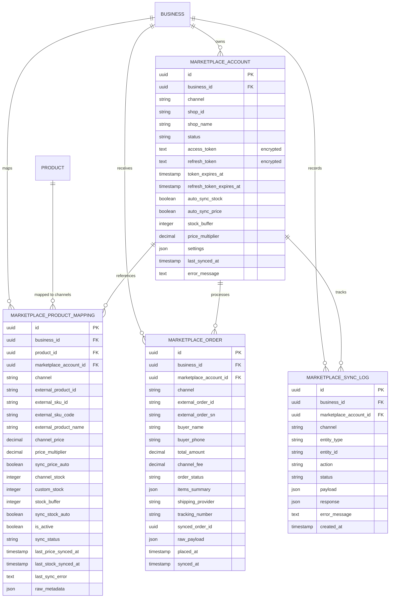

# Alur Kerja Marketplace Omnichannel, Sinkronisasi Multi-Harga, Stok & Pesanan (Marketplace Hub Flow)

> **Status:** AUDITED & SPECIFIED (Telah Diaudit & Dispesifikasikan)  
> **Domain Terkait:** `app/Domain/Marketplace/`, `app/Domain/Inventory/`, `app/Domain/Accounting/`, `app/Domain/Pos/`  
> **Controller Terkait:** `MarketplaceWebController`, `MarketplaceWebhookController`, `AdminMarketplaceSettingController`  
> **View Terkait:** `resources/views/app/marketplace/index.blade.php`, `products.blade.php`, `orders.blade.php`, `logs.blade.php`  
> **Job & Command:** `ProcessMarketplaceWebhookJob`, `SyncMarketplacePriceJob`, `SyncMarketplaceStockJob`  
> **Tabel Basis Data:** `marketplace_accounts`, `marketplace_product_mappings`, `marketplace_orders`, `marketplace_sync_logs`, `products`, `inventory_stocks`, `locations`

---

## 1. Ikhtisar Alur Kerja (Workflow Overview)

Modul **Marketplace Hub (`resources/views/app/marketplace`)** adalah sentra integrasi perdagangan multi-saluran (*Omnichannel Commerce*) bagi merchant Cooca. Modul ini memungkinkan bisnis menghubungkan toko resmi mereka di 3 marketplace terbesar di Indonesia: **Shopee, TikTok Shop, dan Tokopedia**.

Modul ini menjalankan 4 pilar fungsional utama:
1. **Otorisasi Terpadu & Manajemen Multi-Toko (OAuth 2.0 Multi-Tenant):**
   - **Shopee:** Menggunakan Shopee Open Platform V2 API (`/api/v2/shop/auth_partner`) dengan tanda tangan HMAC-SHA256, menukarkan Authorization Code menjadi Access Token (4 jam) dan Refresh Token (30 hari).
   - **TikTok Shop + Tokopedia (1 Otorisasi Terpadu):** Menggunakan TikTok Shop Partner Center API v2 (`services.tiktokshop.com/open/authorize`) untuk mengelola etalase TikTok Shop dan Tokopedia dalam satu pintu otorisasi.
   - **Tokopedia Standalone:** Kompatibilitas dengan Tokopedia Open API Client Credentials / Seller OAuth.
2. **Pengaturan Multi-Harga & Alokasi Stok Cerdas (Channel Pricing & Safety Buffer):**
   - **Faktor Pengali Harga (*Price Multiplier*):** Mengatur kenaikan harga otomatis (misal: `1.08` untuk menutupi biaya layanan admin marketplace sebesar 8%) dari harga jual dasar produk Cooca.
   - **Harga Tetap Manual (*Fixed Channel Price*):** Menetapkan harga khusus kanal jika merchant ingin memberlakukan harga promosi mandiri.
   - **Stok Pengaman (*Safety Buffer Stock*):** Menyisihkan stok fisik di gudang utama (misal: menyisihkan 3 unit untuk penjualan offline kasir POS, sehingga hanya sisa stok yang dipublikasikan ke Shopee/TikTok/Tokopedia).
   - **Alokasi Kuota Khusus (*Custom Stock Override*):** Membatasi jumlah unit yang tampil di marketplace tertentu.
3. **Feed Transaksi & Manajemen Pesanan Masuk (Multi-Channel Inbound Orders):**
   - Penarikan pesanan secara otomatis via Webhook resmi per saluran, atau penarikan manual berkala (*Scheduled / On-Demand Order Pulling*).
   - Konsolidasi identitas pembeli, kurir pengiriman (J&T, SiCepat, Shopee Xpress, GoSend), nomor resi pelacakan (*tracking number*), serta status pemenuhan pesanan.
4. **Audit Trail & Diagnostik Sinkronisasi Real-Time (Sync Logs & Webhook Audit):**
   - Pencatatan telemetri setiap upaya pengiriman harga, pembaruan stok, penarikan pesanan, dan muatan data webhook (*request/response payload*).
   - Penelusuran pesan galat (*error message*) saat API marketplace mengalami penolakan kuota (*rate limit*) atau kegagalan otentikasi token.

---

## 2. Diagram Rantai 11-Node Hulu-ke-Hilir (End-to-End Execution Flow)

```text
┌───────────────────────────────────────────────────────────────────────────────────────────────────┐
│ [Node 1] Aksi Pengguna / Pemicu Sistem (User Action / Trigger)                                    │
│ - Merchant mengklik [Hubungkan Shopee] / [Hubungkan TikTok Shop + Tokopedia]                      │
│ - Merchant menetapkan harga per-channel & safety buffer di modal [Atur Multi-Harga & Stok]        │
│ - Merchant mengklik [Sync Harga] / [Sync Stok] pada baris produk atau [Sinkronisasi Massal Semua]  │
│ - Pembeli melakukan checkout di Shopee/TikTok/Tokopedia -> Memicu Inbound Webhook HTTP POST       │
│ - Merchant mengklik [Tarik Pesanan Terbaru] pada halaman pesanan                                   │
└────────────────────────────────────────────────┬──────────────────────────────────────────────────┘
                                                 │
                                                 ▼
┌───────────────────────────────────────────────────────────────────────────────────────────────────┐
│ [Node 2] Frontend Blade UI & Alpine.js Engine (Bento Apple HIG v2.0)                              │
│ - `index.blade.php`: Cockpit kartu status koneksi saluran, indikator toggle aktif, bento metrik   │
│ - `products.blade.php`: Tabel komparasi harga 3 channel, modal sheet pemetaan 2-kolom Bento XXL   │
│ - `orders.blade.php`: Tabel feed pesanan dengan lencana platform semantik & modal tarik pesanan   │
│ - `logs.blade.php`: Tabel audit trail aktivitas sinkronisasi & modal inspeksi payload data        │
│ - Anti-Double Submit: Pelindung klik ganda tombol submit via Alpine.js `submitting = true`        │
└────────────────────────────────────────────────┬──────────────────────────────────────────────────┘
                                                 │
                                                 ▼
┌───────────────────────────────────────────────────────────────────────────────────────────────────┐
│ [Node 3] Lapisan Route & Middleware Keamanan (Security Gateways)                                  │
│ - `auth:web`: Memastikan sesi login merchant aktif                                                │
│ - `business.active`: Penguncian tenant context aktif (`Context::requireBusiness()`)               │
│ - `require.permission:marketplace.view` (Read-only browsing daftar produk, pesanan, dan log)      │
│ - `require.permission:marketplace.manage` (Aksi sensitif: koneksi toko, putus akun, ubah harga)   │
│ - `throttle:10,1` pada rute sinkronisasi massal (`sync-all`) dan penarikan pesanan (`orders.pull`)│
│ - `throttle:120,1` pada endpoint webhook publik (`/webhooks/marketplace/{provider}`)              │
└────────────────────────────────────────────────┬──────────────────────────────────────────────────┘
                                                 │
                                                 ▼
┌───────────────────────────────────────────────────────────────────────────────────────────────────┐
│ [Node 4] Web Controller Dispatcher                                                                │
│ - `MarketplaceWebController@index`: Menghitung metrik akun, pemetaan, pesanan, dan error          │
│ - `MarketplaceWebController@products`: Paginasi produk dengan relasi `marketplaceMappings`        │
│ - `MarketplaceWebController@updateMapping`: Validasi dan penyimpanan konfigurasi per produk       │
│ - `MarketplaceWebController@syncProductPrice` / `syncProductStock`: Pemicu sinkronisasi instan    │
│ - `MarketplaceWebController@syncAll`: Iterasi akun aktif untuk push harga/stok batch              │
│ - `MarketplaceWebController@pullOrders`: Penarikan order dari API adapter                         │
│ - `MarketplaceWebhookController@handle`: Verifikasi tanda tangan HMAC dan penerima webhook publik │
└────────────────────────────────────────────────┬──────────────────────────────────────────────────┘
                                                 │
                                                 ▼
┌───────────────────────────────────────────────────────────────────────────────────────────────────┐
│ [Node 5] Validasi Input & Guardrail Integritas Finansial (Validation Layer)                       │
│ - Validasi UUID `product_id` milik `business_id` aktif                                            │
│ - Validasi Saluran: Wajib in `['shopee', 'tiktok_shop', 'tokopedia']`                             │
│ - Anti-Margin Bleed Guard: Peringatan keras / batas bawah jika `channel_price < base_cost` (HPP)   │
│ - Validasi Pengali Harga: `price_multiplier` berada dalam rentang aman `0.80` s/d `3.00`           │
│ - Validasi Buffer Stok: `stock_buffer` non-negatif dan tidak melebihi total stok fisik            │
│ - Verifikasi Tanda Tangan Webhook Kriptografis: Hash HMAC-SHA256 tanpa bypass kelonggaran payload  │
└────────────────────────────────────────────────┬──────────────────────────────────────────────────┘
                                                 │
                                                 ▼
┌───────────────────────────────────────────────────────────────────────────────────────────────────┐
│ [Node 6] Scoping Multi-Tenant & Anti-IDOR Guard                                                   │
│ - Seluruh query Eloquent diikat eksplisit ke `business_id` tenant aktif                           │
│ - Validasi Akun Toko: `MarketplaceAccount::where('business_id', $business->id)->findOrFail()`    │
│ - Validasi Produk: `Product::where('business_id', $business->id)->findOrFail()`                  │
│ - Pencegahan BOLA/IDOR: Akses data lintas tenant mengembalikan HTTP 404 (bukan data tenant lain) │
└────────────────────────────────────────────────┬──────────────────────────────────────────────────┘
                                                 │
                                                 ▼
┌───────────────────────────────────────────────────────────────────────────────────────────────────┐
│ [Node 7] Layanan Domain & Driver Factory (Domain Layer)                                           │
│ - `MarketplaceManagerService`: Factory driver (`ShopeeAdapter`, `TikTokShopAdapter`, `Tokopedia`)│
│ - `MarketplaceSyncService`: Penghitungan stok efektif (`resolveEffectiveStock`) & kalkulasi harga │
│ - `MarketplaceOrderService`: Upserting data pesanan, sinkronisasi stok otomatis, & audit log      │
│ - Adapter Driver: Penyusunan HTTP request resmi, penanganan refresh token, & parsing respons JSON │
└────────────────────────────────────────────────┬──────────────────────────────────────────────────┘
                                                 │
                                                 ▼
┌───────────────────────────────────────────────────────────────────────────────────────────────────┐
│ [Node 8] Integritas Basis Data & Transaksi Atomik (Database Layer)                                │
│ - `DB::transaction()` pada penyimpanan akun, pemetaan produk, dan pesanan inbound                 │
│ - Model `MarketplaceAccount`: Access token & refresh token tersimpan terenkripsi (`encrypted`)    │
│ - Model `MarketplaceProductMapping`: Relasi 1-to-Many dari `Product` dengan unique composite index│
│ - Model `MarketplaceOrder`: Pencatatan nomor pesanan eksternal `external_order_sn`, status, item  │
│ - Model `MarketplaceSyncLog`: Catatan audit trail immutable dengan snapshot waktu eksekusi & ms   │
└────────────────────────────────────────────────┬──────────────────────────────────────────────────┘
                                                 │
                                                 ▼
┌───────────────────────────────────────────────────────────────────────────────────────────────────┐
│ [Node 9] Antrean Asinkron & Background Jobs (Queue Worker)                                        │
│ - `ProcessMarketplaceWebhookJob`: Pemrosesan asinkron muatan webhook (`ShouldQueue`, tries = 3)   │
│ - `SyncMarketplacePriceJob`: Antrean push pembaruan harga saat HPP atau harga dasar Cooca berubah │
│ - `SyncMarketplaceStockJob`: Antrean push pembaruan stok saat transaksi kasir POS selesai dibuat  │
│ - Sub-100ms API response time: Webhook controller mengembalikan 200 OK seketika setelah enqueue   │
└────────────────────────────────────────────────┬──────────────────────────────────────────────────┘
                                                 │
                                                 ▼
┌───────────────────────────────────────────────────────────────────────────────────────────────────┐
│ [Node 10] Integrasi API Eksternal & Fail-Safe Fallback                                            │
│ - HTTP Timeout ketat (15 detik) untuk mencegah penumpukan worker                                  │
│ - Penanganan Token Kedaluwarsa: Deteksi HTTP 401/403 -> Auto-refresh token via refresh token API  │
│ - Fail-Safe Fallback: Jika API marketplace offline/timeout, transaksi internal Cooca tetap aman, │
│   mapping ditandai `sync_status = failed`, dan dicatat ke `marketplace_sync_logs` untuk di-retry │
└────────────────────────────────────────────────┬──────────────────────────────────────────────────┘
                                                 │
                                                 ▼
┌───────────────────────────────────────────────────────────────────────────────────────────────────┐
│ [Node 11] Respon UI & Notifikasi Terpadu (UI Feedback & Tri-Channel Alert)                        │
│ - Frontend: Toast sukses frosted glass Apple HIG (`AppAlert.success`)                             │
│ - Logging: Notifikasi kegagalan sinkronisasi atau token expired ke Notification Bell Owner        │
│ - WhatsApp Alert: Peringatan otomatis ke WhatsApp Owner jika pesanan marketplace masuk berstatus  │
│   perlu pengiriman segera (*Ready to Ship*) atau terdeteksi selisih stok fisik vs online          │
└───────────────────────────────────────────────────────────────────────────────────────────────────┘
```

---

## 3. Skema Basis Data & Relasi Entitas



---

## 4. Matriks Do's & Don'ts untuk 20 Sektor Industri Bisnis

Integrasi marketplace wajib beradaptasi secara kontekstual (*Context-Aware UI*) terhadap karakteristik operasional masing-masing sektor industri UMKM di Indonesia:

| Klaster Industri | Sektor Bisnis | Do's (Praktik Wajib) | Don'ts (Larangan Keras) | Adaptasi Khusus UI & Sistem |
| :--- | :--- | :--- | :--- | :--- |
| **1. Kuliner & F&B** | Restoran (Dine-in), Cafe, Cloud Kitchen, Katering, Diet Catering | Sinkronisasi produk tahan lama / merchandise / voucher makan saja. | **Dilarang** mempublikasikan masakan panas siap santap ke Shopee/Tokopedia reguler (risiko basi dalam 24 jam). | Sembunyikan toggle sync untuk menu `fnb_hot_food`; tampilkan peringatan logistik sameday/instant. |
| | Toko Roti & Bakery | Aktifkan kurir Instant / Sameday (GoSend / GrabExpress) dan Paxel Sameday. | **Dilarang** menggunakan ekspedisi kargo atau kurir reguler tanpa packing vakum. | Badge khusus "Pengiriman Sameday Wajib" pada pengaturan produk. |
| | Frozen Food & Olahan Beku | Wajib menetapkan safety buffer tinggi dan menggunakan kemasan sterofoam + dry ice. | **Dilarang** menerima pesanan antar-pulau tanpa jalur cold-chain terverifikasi. | Input catatan penanganan beku otomatis di pesanan masuk. |
| **2. Manufaktur & Produksi** | Konveksi, Butik & Garment | Sinkronisasi multi-variasi (ukuran S-XXL, warna), alokasikan safety buffer 5 unit. | **Dilarang** menjual barang PO (Pre-Order) tanpa mengaktifkan status PO di channel Shopee/TikTok. | Field `is_preorder` dan `preorder_lead_days` wajib tersinkron ke Shopee Pre-Order flag. |
| | Percetakan, Offset & Sablon | Sinkronisasi produk template standar (blanko undangan, nota kosong, paper bag ready stock). | **Dilarang** sinkronisasi produk cetak kustom perorangan tanpa file siap cetak dari pelanggan. | Filter item berkategori "Custom Service" dari daftar produk marketplace. |
| | Kerajinan & Handmade Craft | Cantumkan estimasi waktu pengerjaan tangan pada deskripsi produk. | **Dilarang** mempublikasikan stok fisik melebihi kapasitas pengrajin harian. | Tampilkan indikator batas kuota pesanan aktif. |
| | Kosmetik & Skincare | Cantumkan nomor registrasi BPOM RI resmi dan tanggal kedaluwarsa (*expired date*). | **Dilarang keras** menjual kosmetik racikan tanpa izin edar BPOM (ancaman pidana UU Kesehatan). | Badge verifikasi "Nomor BPOM Terdaftar" sebelum mapping produk diizinkan. |
| | Furniture & Mebel Interior | Wajib mencantumkan dimensi kubikasi (P x L x T) dan berat aktual untuk kurir kargo (JNE Trucking / SiCepat Gokil). | **Dilarang** menggunakan tarif ekspedisi standar reguler motor (risiko pembatalan kurir). | Tampilkan kalkulator berat volumetrik otomatis di modal pemetaan. |
| | Bubut Logam & Penjahit Custom | Sembunyikan modul marketplace jika 100% operasional adalah jasa kustom on-demand. | **Dilarang** mencantumkan produk berharga Rp 100 sebagai pancingan chat kustom. | Auto-disable marketplace hub jika toko tidak memiliki produk bertipe `goods`. |
| **3. Retail & Toko** | Toko Retail, Kelontong & Minimarket | Pengguna utama marketplace! Gunakan pengali harga otomatis `1.08` - `1.12` untuk menutup fee admin. | **Dilarang** membiarkan buffer stok bernilai 0 saat jam operasional toko fisik ramai (risiko overselling). | Default safety buffer otomatis = 2 unit untuk mencegah stok minus akibat kasir POS offline. |
| | Apotek, Toko Obat & Alkes | **Kepatuhan BPOM & Kebijakan Platform:** Hanya petakan obat bebas (lingkaran hijau) & obat bebas terbatas (lingkaran biru) serta alkes. | **DILARANG KERAS** memetakan Obat Keras (Daftar G / Lingkaran Merah K), Narkotika, Psikotropika, atau Antibiotik ke marketplace! | **Hard Guardrail:** Kategori produk `obat_keras` otomatis di-lock dan diblokir dari sinkronisasi marketplace dengan alert merah kepatuhan BPOM RI. |
| **4. Jasa Profesional** | Digital Agency & IT Software | Hanya jual produk digital terlisensi (e-book, template grafis, source code) jika platform mendukung. | **Dilarang** menjual jasa konsultasi jam-jaman menggunakan resi pengiriman fisik fiktif. | Sembunyikan pemetaan jika produk bertipe `service`. |
| | Kontraktor & Renovasi | Hanya petakan sisa material fisik berkualitas (keramik, cat, perkakas, fitting pipa). | **Dilarang** mempublikasikan kontrak renovasi rumah sebagai transaksi marketplace. | Hanya tampilkan produk kategori material fisik toko. |
| | Event & Wedding Organizer | Hanya jual paket souvenir atau merchandise pernikahan ready stock. | **Dilarang** menjual jadwal booking venue melalui resi paket logistik. | Filter produk jasa WO dari daftar pemetaan. |
| **5. Jasa Operasional** | Bengkel Mobil & Motor | Petakan suku cadang fisik (oli mesin, kampas rem, busi, aki, filter udara) dengan kode part presisi. | **Dilarang** memetakan jasa servis mesin, tune-up, atau cuci karburator ke marketplace. | Pisahkan tampilan produk suku cadang (*goods*) dari jasa mekanik (*service*). |
| | Cuci Mobil & Auto Detailing | Petakan obat poles, wax, shampoo mobil, dan lap microfiber. | **Dilarang** menjual jasa cuci steam via resi pengiriman barang. | Filter khusus produk retail perawatan kendaraan. |
| | Barbershop & Salon | Petakan produk pomade, hair tonic, shampoo, dan vitamin rambut. | **Dilarang** menjual jasa potong rambut atau creambath via etalase marketplace. | Filter khusus produk retail grooming. |
| | Laundry Kiloan & Dry Clean | Petakan deterjen cair literan, parfum laundry, dan pelicin pakaian. | **Dilarang** menjual jasa cuci per-kilo ke marketplace publik antar-kota. | Filter khusus produk retail bahan kimia laundry. |
| **6. Distribusi & Pertanian** | Distributor Grosir & FMCG | Tetapkan batas minimal pembelian (MOQ karton/dus) dan harga khusus partai besar. | **Dilarang** melayani eceran satuan tanpa penyesuaian harga grosir. | Input unit jual karton/dus tersinkronisasi ke satuan SKU marketplace. |
| | Pertanian, Peternakan & Hidroponik | Wajib menggunakan kurir Sameday/Instant atau Paxel untuk sayur segar dan bibit tanaman. | **Dilarang** mengirim bibit tanaman hidup atau sayur segar tanpa garansi kesegaran dan packing basah. | Peringatan khusus batas waktu pengiriman maksimal 24 jam. |

---

## 5. Audit Keamanan Cyber & Skema Fraud Internal

### A. Temuan Kerentanan Keamanan Siber (Cyber Security Gaps)
1. **Bypass Kritis Verifikasi Tanda Tangan Webhook (Critical Webhook Signature Bypass):**
   - Di `ShopeeAdapter.php`: `$isValid = hash_equals($calcSign, (string) $signHeader) || ! empty($payload['code']);`
   - Di `TikTokShopAdapter.php`: `$isValid = hash_equals($calcSign, (string) $signature) || ! empty($payload['event']);`
   - Di `TokopediaAdapter.php`: `'is_valid' => true` (tanpa pengecekan tanda tangan sama sekali).
   - **Dampak Kritis:** Penyerang dari internet publik dapat mengirimkan HTTP POST palsu ke `/webhooks/marketplace/{provider}` dengan payload JSON acak (asalkan memuat key `"code"` atau `"event"`). Hal ini memungkinkan injeksi pesanan fiktif, pemalsuan status pembayaran pesanan menjadi "PAID", atau manipulasi log sistem tanpa otentikasi.
2. **Ketiadaan Otorisasi RBAC Khusus Marketplace (Missing RBAC Middleware):**
   - Grup rute `marketplace-hub.*` di `routes/owner.php` hanya dibungkus oleh middleware autentikasi dasar (`auth:web`, `business.active`, `verified`) tanpa middleware permission (`require.permission`).
   - **Dampak:** Setiap staf toko (termasuk kasir magang, pramusaji, atau staf gudang tanpa wewenang) dapat membuka menu Integrasi Marketplace, memutuskan akun toko resmi, menaikkan/menurunkan harga jual produk, atau memicu sinkronisasi massal.
3. **Ketiadaan Rate Limiting pada Operasi Berat (Unthrottled Sync Endpoints):**
   - Rute `POST /marketplace-hub/products/sync-all` dan `POST /marketplace-hub/orders/pull` belum memiliki pembatas laju panggilan (*rate limiter*).
   - **Dampak:** Eksekusi berulang-ulang dapat membebani worker background, menghabiskan kuota API Shopee/TikTok/Tokopedia, dan menyebabkan akun merchant terkena pemblokiran IP oleh pihak marketplace (*API Rate Limit Ban*).
4. **Kerentanan Injeksi JSON Inline pada Atribut Alpine.js (DOM Data Injection Risk):**
   - Di `products.blade.php`: `@click="openMapping({{ json_encode($product) }}, 'shopee')"`
   - Di `logs.blade.php`: `@click="viewDetail({{ json_encode($log) }})"`
   - **Dampak:** Jika nama produk, SKU, atau payload pesan galat memuat tanda petik ganda (`"`) atau karakter kontrol yang tidak ter-escape secara aman, parsing atribut HTML Alpine.js akan rusak atau berpotensi memicu celah DOM Cross-Site Scripting (XSS). Harus menggunakan sintaks Blade `@js($product)`.

### B. Skema Fraud Internal & Penyelewengan Operasional (Internal Fraud Schemes)
1. **Skema Predatory Underpricing (Manipulasi Harga Bawah Modal oleh Rogue Staff):**
   - Staf toko yang memiliki akses ke dashboard dapat mengubah `price_multiplier` produk mahal menjadi `0.10` atau menetapkan `channel_price` Rp 1.000, lalu membeli produk tersebut di Shopee/TikTok secara pribadi sebelum pemilik toko menyadarinya.
   - **Mitigasi Wajib:** Sistem wajib menerapkan **Anti-Margin Bleed Guard** — jika harga saluran yang dimasukkan berada di bawah HPP (`base_cost`), sistem menampilkan peringatan merah mencolok dan mewajibkan konfirmasi khusus.
2. **Skema Phantom Stock & Penimbunan Inventori Offline:**
   - Staf toko dapat menaikkan `stock_buffer` secara sepihak (misal: menyisihkan 50 unit) sehingga produk tampak habis di toko online Shopee/TikTok, lalu menjual produk fisik tersebut secara ilegal secara offline tanpa tercatat di POS.
   - **Mitigasi Wajib:** Setiap perubahan `stock_buffer` dan `custom_stock` wajib mencatat jejak audit immutable lengkap dengan `user_id` eksekutor.
3. **Penyuntikan Pesanan Hantu (Ghost Order Inflow Fraud):**
   - Eksploitasi webhook tanpa tanda tangan valid dapat menyuntikkan pesanan berstatus "PAID" dengan alamat pengiriman ke komplotan penipu, memicu staf gudang untuk membungkus dan mengirimkan barang fisik tanpa pernah ada uang masuk ke rekening escrow resmi toko.
   - **Mitigasi Wajib:** Validasi ketat tanda tangan HMAC SHA-256 pada seluruh webhook tanpa toleransi bypass, serta validasi silang `shop_id` terhadap database akun aktif.

---

## 6. Guardrail Mitigasi Human Error & Kepatuhan Bento Apple HIG v2.0

1. **Eliminasi Dialog Native Browser (`confirm()` / `alert()`):**
   - Di `products.blade.php`: `onsubmit="return confirm('Mulai sinkronisasi seluruh harga & stok ke marketplace?')"` harus digantikan secara penuh oleh dialog bergaya Apple HIG terpadu: `AppAlert.confirmSubmit(event, 'Sinkronisasi Massal', 'Mulai pengiriman seluruh data harga dan stok fisik ke Shopee, TikTok Shop, dan Tokopedia?')`.
2. **Perluasan Modal Sheet ke Standar Bento Apple HIG XXL:**
   - Modal pemetaan di `products.blade.php` sebelumnya berukuran sempit `max-w-xl`. Wajib diperluas menjadi **Bento Full Size XXL (`max-w-5xl xl:max-w-6xl`)** dengan arsitektur 2 kolom:
     - **Kolom Kiri:** Formulir kontrol saluran, identitas SKU eksternal, penetapan harga (otomatis multiplier vs manual), dan skema alokasi stok buffer.
     - **Kolom Kanan:** Visualisasi komparasi harga live (Harga Modal HPP vs Harga Jual Toko vs Harga Marketplace), kalkulator estimasi fee admin platform, dan banner guardrail kepatuhan industri (misal: peringatan BPOM untuk farmasi).
   - Modal detail log di `logs.blade.php` diperluas ke `max-w-4xl` dengan kartu metadata berformat rapi dan penyamaran data sensitif (*masked data view*).
3. **Penyelarasan Inkonsistensi Kolom Basis Data pada Blade (Bug Fixes):**
   - Memperbaiki pemanggilan properti yang salah pada `orders.blade.php`:
     - `$order->marketplace_order_sn` ➔ `$order->external_order_sn`
     - `$order->customer_name` ➔ `$order->buyer_name`
     - `$order->customer_phone` ➔ `$order->buyer_phone`
     - `$order->items_payload` ➔ `$order->items_summary`
     - `$order->order_created_at` ➔ `$order->placed_at`
   - Memperbaiki pemanggilan properti yang salah pada `logs.blade.php`:
     - `$log->event_type` ➔ `$log->action`
     - `$log->reference_id` ➔ `$log->entity_id`
     - Eliminasi ketergantungan kolom fiktif `$log->execution_time_ms`
     - `selectedLog.request_payload` ➔ `selectedLog.payload`
     - `selectedLog.response_payload` ➔ `selectedLog.response`
4. **Pencegahan Double Submit Form:**
   - Seluruh modal tombol submit (`Simpan Pengaturan`, `Sinkronisasi Massal`, `Tarik Pesanan`) wajib dilengkapi state reaktif Alpine.js `:disabled="submitting"` dengan indikator animasi spinner saat request sedang berlangsung.
