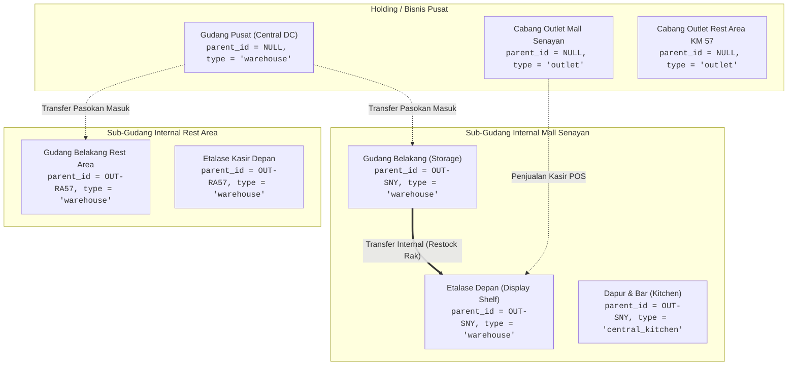

# Alur & Panduan Teknis: Hubungan Cabang, Outlet, dan Gudang Multi-Hierarki (1 Cabang Banyak Gudang & Gudang Pusat)

> **Status:** CURRENT STATE & ARCHITECTURAL SPECIFICATION  
> **Terakhir Diverifikasi:** 2026-09-27  
> **Ruang Lingkup:** Model data hierarki lokasi, relasi self-referencing `parent_id`, diferensiasi Gudang Pusat vs Cabang Mandiri vs Sub-Gudang Cabang, agregasi stok efektif POS terminal, dan proteksi integritas multi-tenant.

---

## 1. Latar Belakang & Kebutuhan Bisnis

Struktur fisik logistik dan operasional perusahaan multi-cabang berkembang mengikuti skala usaha:
1. **Perusahaan Memiliki Gudang Pusat (Central Distribution Center / Hub):**
   - Menampung penerimaan kontainer besar dari supplier/pabrik.
   - Tidak melayani penjualan ritel walk-in/kasir secara langsung.
   - Bertindak sebagai sumber pasokan (*replenishment source*) untuk seluruh cabang.
2. **Satu Cabang Outlet Memiliki Beberapa Titik Penyimpanan Fisik (Sub-Warehouses):**
   - **Gudang Belakang (Backroom Storage):** Tempat penyimpanan stok cadangan, karton, dus, dan karung bahan baku.
   - **Etalase Depan (Front Display Shelf / Floor):** Tempat barang dipajang di rak depan kasir dan siap diambil pembeli.
   - **Dapur / Bar (Kitchen & Bar Area):** Tempat bahan baku racikan, sirup, kopi, dan makanan olahan siap diproduksi oleh barista/koki.
3. **Kebutuhan Kasir & Logistik:**
   - Kasir di terminal POS dapat bertransaksi pada tingkat Cabang Utama ataupun langsung pada stasiun Sub-Gudang (misal Etalase Depan).
   - Saat kasir bertransaksi pada tingkat Cabang, sistem secara cerdas menghitung total ketersediaan stok di cabang tersebut (akumulasi sub-gudang) dan memotong stok dari sub-gudang yang menyimpan barang tersebut tanpa membuat stok cabang fiktif.
   - Pemindahan barang dari Gudang Belakang ke Etalase Depan dicatat secara rapi melalui dokumen `StockTransfer` internal tanpa mencatatkan omzet penjualan semu.

---

## 2. Diagram Arsitektur & Struktur Hierarki



---

## 3. Skema Database & Relasi Model

### Tabel `locations`
| Kolom | Tipe | Keterangan |
|---|---|---|
| `id` | UUID (PK) | Pengenal unik lokasi |
| `business_id` | UUID (FK) | Isolasi multi-tenant |
| `parent_id` | UUID (FK, Nullable) | Menunjuk ke `locations.id`. `NULL` = Root (Gudang Pusat / Cabang Mandiri). Terisi = Sub-Gudang di bawah cabang |
| `name` | VARCHAR(100) | Nama lokasi fisik |
| `type` | ENUM | `'outlet'`, `'warehouse'`, `'central_kitchen'` |
| `code` | VARCHAR(50) | Kode unik lokasi (contoh: `DC-01`, `OUT-SNY`, `SNY-DISP`) |
| `is_primary` | BOOLEAN | Penanda titik operasi/pickup utama toko |
| `is_active` | BOOLEAN | Status operasional lokasi |

### Relasi Eloquent pada Model `Location`
```php
// app/Models/Location.php
public function parent(): BelongsTo
{
    return $this->belongsTo(self::class, 'parent_id');
}

public function children(): HasMany
{
    return $this->hasMany(self::class, 'parent_id');
}

public function childWarehouses(): HasMany
{
    return $this->hasMany(self::class, 'parent_id')->where('type', 'warehouse');
}

public function isRoot(): bool
{
    return empty($this->parent_id);
}

public function isSubWarehouse(): bool
{
    return ! empty($this->parent_id);
}

public function isCentralWarehouse(): bool
{
    return $this->type === 'warehouse' && empty($this->parent_id);
}
```

---

## 4. Resolusi Stok & Pemotongan Transaksi POS

### 1. Perhitungan Stok Efektif Bertingkat (`calculateEffectiveStock`)
Saat modul POS atau katalog menanyakan stok untuk cabang tertentu:
```php
// app/Models/Location.php
public static function resolveLocationIds(string $locationId): array
{
    $childIds = self::where('parent_id', $locationId)->pluck('id')->all();
    return array_merge([$locationId], $childIds);
}
```
Ketika kasir bertransaksi di `Outlet Mall Senayan`:
- Sistem mengecek `$locIds = Location::resolveLocationIds($selectedLocationId);`
- Query agregasi `whereIn('location_id', $locIds)` menjumlahkan ketersediaan fisik di `Outlet Mall Senayan` (jika ada), `Etalase Depan`, dan `Gudang Belakang`.
- Jika kasir sengaja memilih stasiun spesifik `Etalase Depan`, hanya stok rak depan yang dihitung.

### 2. Auto-Routing Lokasi Pemotongan Stok (`StockService::deductForProductSale`)
Saat kasir menyelesaikan transaksi di tingkat Cabang Utama:
1. Sistem terlebih dahulu memeriksa apakah stok tercatat langsung pada ID Cabang tersebut. Jika ada stok $> 0$, stok didebit dari cabang.
2. Jika stok di cabang $= 0$, sistem secara dinamis memeriksa sub-gudang anak (`childIds`) dan mendebit dari sub-gudang yang memegang stok fisik (misalnya `Etalase Depan`).
3. Seluruh mutasi tercatat transparan di tabel `stock_movements` lengkap dengan `location_id` aktual dan nomor nota POS.

---

## 5. Antarmuka Pengguna (Bento Apple HIG)

### 1. Modal Tambah & Edit Gudang Logistik
- **Lokasi Menu:** Navigasi ke **Katalog & Logistik** → **Cabang & Gudang** → Klik tombol **`[+ Gudang Logistik]`**.
- **Field Hierarki Induk Cabang:**
  - Dropdown: *"Induk Cabang / Outlet (Opsional)"*
  - Opsi: `-- Tanpa Induk (Gudang Pusat / Mandiri) --` atau daftar Cabang aktif.
  - Helper copy Apple HIG yang jelas: *"Kosongkan jika gudang ini adalah Gudang Pusat (DC) perusahaan. Pilih cabang jika gudang ini berlokasi di dalam outlet fisik (seperti Gudang Belakang, Etalase Depan, atau Dapur/Bar)."*

### 2. Tampilan Kartu Bento Titik Lokasi
- **Gudang Pusat:** Menampilkan lencana warna biru `#007AFF`: `Gudang Pusat (DC)` dengan ikon `boxes`.
- **Sub-Gudang Cabang:** Menampilkan lencana warna ungu `#5856D6`: `Sub-Gudang: [Nama Cabang]` dengan ikon `corner-down-right`.
- **Cabang yang Memiliki Anak:** Menampilkan lencana warna hijau `#34C759`: `X Sub-Gudang` (misal `2 Sub-Gudang`) yang merinci titik penyimpanan internal cabang tersebut.

---

## 6. Hardening Keamanan & Guardrails

1. **Proteksi Multi-Tenant:**
   - Validasi ketat `Rule::exists('locations', 'id')->where('business_id', $business->id)` memastikan pengguna tidak dapat memilih induk cabang milik bisnis/perusahaan lain.
2. **Anti-Circular Parenting Guard:**
   - Lokasi dilarang menjadi induk bagi dirinya sendiri (`parent_id !== location.id`).
   - Lokasi induk dilarang memilih sub-gudang anaknya sendiri sebagai induknya (*anti-ancestor cycle*).
3. **Pemisahan Otorisasi Kasir & Gudang:**
   - Kasir POS hanya diizinkan memilih cabang/stasiun yang menjadi hak otorisasi shift kerjanya.
   - Mutasi antar sub-gudang wajib menggunakan dokumen `StockTransfer` resmi.
