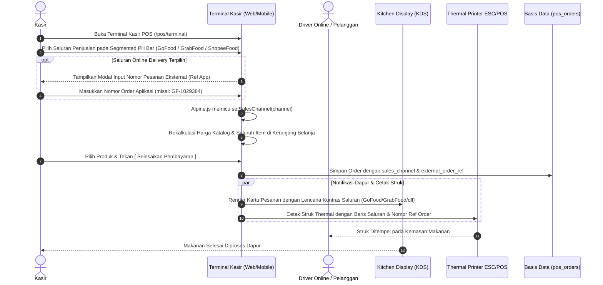

# Alur Kerja Multi-Harga Saluran Penjualan POS (POS Channel Pricing & Online Delivery Workflow)

> **Status:** COMPLETE  
> **Aktor Terlibat:** Kasir POS, Tim Dapur / Barista, Pelanggan / Driver Ojek Online, Pemilik Toko (Owner)  
> **Modul Terkait:** POS, F&B Sales Channels, Products, Kitchen Display (KDS), Thermal Receipt  
> **Tabel Basis Data:** `products`, `product_channel_prices`, `pos_orders`, `pos_order_items`, `pos_registers`

---

## 1. Diagram Alur Kerja End-to-End



---

## 2. Rincian Langkah Operasional

### Langkah 1: Penetapan Multi-Harga Saluran di Master Produk
1. **Navigasi:** Pengguna membuka Master Produk (`/products`).
2. **Bento Box "Multi-Harga Saluran POS (F&B)":**
   - Pada modal tambah atau ubah produk, tersedia kolom isian harga untuk 5 kanal penjualan:
     - `dine_in`: Harga standar makan di tempat (default mengikuti `price` utama produk).
     - `takeaway`: Harga pesanan bawa pulang / bungkus.
     - `gofood`: Harga khusus GoFood (mengakomodasi potongan komisi 15–20%).
     - `grabfood`: Harga khusus GrabFood.
     - `shopeefood`: Harga khusus ShopeeFood.
3. **Persistensi Data:** Disimpan ke tabel `product_channel_prices` dengan composite unique constraint (`business_id`, `product_id`, `sales_channel`).

---

### Langkah 2: Pemilihan Saluran di Terminal Kasir POS (POS Terminal Pill Bar)
1. **Segmented Channel Selector Pill Bar:**
   - Terletak di header utama Terminal Kasir POS (`resources/views/app/pos/terminal.blade.php`).
   - Mengadopsi prinsip Apple HIG segmented control dengan 5 tombol tab:
     - 🍽️ `Dine In` (Warna netral slate)
     - 🥡 `Takeaway` (Warna aksen orange)
     - 🛵 `GoFood` (Warna brand hijau Gojek `#00AA13`)
     - 🛵 `GrabFood` (Warna brand hijau Grab `#00B14F`)
     - 🛵 `ShopeeFood` (Warna brand oranye Shopee `#EE4D2D`)
2. **Reaktivitas Alpine.js (`setSalesChannel`):**
   - Saat kasir mengeklik salah satu tab kanal:
     - State `salesChannel` diperbarui seketika.
     - Fungsi `getProductPrice(product)` membaca kamus `product.channel_prices[salesChannel]`. Jika belum ditentukan harga khusus saluran, sistem secara anggun menggunakan fallback ke harga dasar `product.price`.
     - Seluruh item yang sudah berada di keranjang belanja kasir (`cart.items`) secara instan dihitung ulang harga satuannya (*auto-recalculated*).

---

### Langkah 3: Penandaan Nomor Pesanan Eksternal (External Order Reference)
1. **Pemicu Dialog Input:**
   - Saat kasir memilih saluran online delivery (`gofood`, `grabfood`, atau `shopeefood`), sistem menampilkan dialog modal sheet ramah kasir untuk memasukkan nomor order dari aplikasi pengemudi online.
2. **Penyimpanan State:**
   - Nomor referensi (contoh: `GF-8849201`) disimpan pada state `externalOrderRef`.
   - Kasir dapat melihat atau mengubah nomor referensi ini kapan saja langsung dari ringkasan keranjang belanja sebelum checkout.

---

### Langkah 4: Checkout & Rekapitulasi Finansial
1. **Payload Transaksi:**
   - Kasir menekan `[ Simpan & Selesaikan Pembayaran ]`.
   - Request checkout mengirim parameter:
     - `sales_channel`: string kode kanal (`dine_in`, `takeaway`, `gofood`, `grabfood`, `shopeefood`).
     - `external_order_ref`: string nomor pesanan ojek online (opsional untuk dine-in/takeaway).
2. **Persistensi Backend:**
   - `PosOrderService::checkout()` dan `createOrderFromTable()` memvalidasi dan menyimpan kedua field tersebut ke tabel `pos_orders`.
   - Perhitungan HPP (`total_hpp_cost`) tetap menggunakan modal riil produk atau kombo, sedangkan pendapatan mencerminkan harga khusus saluran, sehingga laba kotor per saluran dapat dianalisis secara akurat.

---

### Langkah 5: Tampilan Dapur (Kitchen Display System / KDS)
1. **Lencana Visual Berbeda:**
   - Pada layar KDS Dapur (`/pos/kitchen`), kartu Kanban pesanan menampilkan badge kontras tinggi di bagian header tiket:
     - GoFood: Badge hijau tebal dengan teks `GoFood [GF-XXXX]`.
     - GrabFood: Badge hijau toska dengan teks `GrabFood [GB-XXXX]`.
     - ShopeeFood: Badge oranye dengan teks `ShopeeFood [SF-XXXX]`.
     - Takeaway: Badge oranye `Bungkus / Takeaway`.
2. **Fungsi Operasional:** Koki dan barista dapat membedakan secara instan mana pesanan yang harus dikemas ke dalam kantong takeaway/plastik driver dan mana yang harus disajikan di piring/gelas dine-in.

---

### Langkah 6: Struk Pembelian Fisik & Thermal ESC/POS
1. **Pencetakan Thermal:**
   - Struk thermal cetak (`receipt.blade.php`) dan rendering gambar struk (`PosReceiptImageService.php`) mencantumkan baris identitas saluran:
     ```text
     Saluran: GOFOOD
     No. Ref : GF-8849201
     ```
2. **Struk Kemasan Pengemudi:** Memudahkan kasir menempelkan struk pada kantong belanjaan untuk dicocokkan oleh driver ojek online saat pengambilan pesanan.

---

## 3. Matriks Kanal Penjualan (Sales Channels Matrix)

| Kode Saluran | Label UI | Warna Lencana | Butuh No. Ref Eksternal? | Karakteristik Operasional |
| :--- | :--- | :--- | :---: | :--- |
| `dine_in` | Dine In (Makan di Tempat) | Slate Netral | Tidak | Disajikan di piring/gelas, terikat nomor meja |
| `takeaway` | Takeaway (Bungkus) | Oranye | Opsional | Dikemas dalam kantong takeaway untuk pelanggan walk-in |
| `gofood` | GoFood | Hijau `#00AA13` | **Sangat Disarankan** | Harga markup komisi, dikemas khusus driver Gojek |
| `grabfood` | GrabFood | Hijau `#00B14F` | **Sangat Disarankan** | Harga markup komisi, dikemas khusus driver Grab |
| `shopeefood` | ShopeeFood | Oranye `#EE4D2D` | **Sangat Disarankan** | Harga markup komisi, dikemas khusus driver Shopee |
