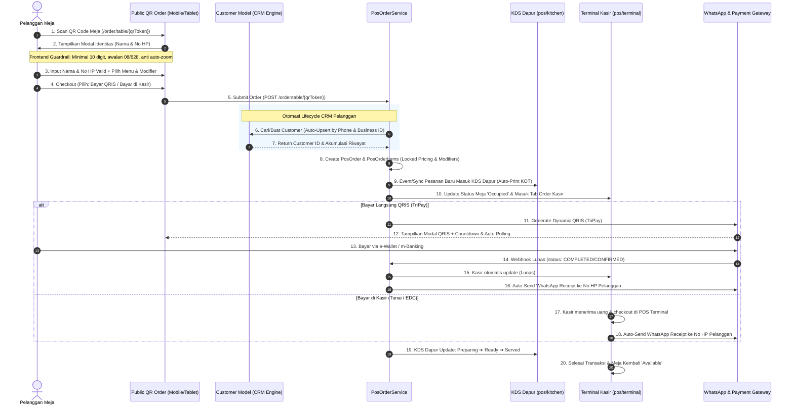

# PANDUAN ALUR KERJA: PUBLIC QR-ORDER ➔ POS & CUSTOMER CRM INTEGRATION

> **Status:** APPROVED & BINDING  
> **Modul Terkait:** [`resources/views/public/qr-order/`](file:///c:/laragon/www/cooca_core/resources/views/public/qr-order) ➔ [`resources/views/app/pos/`](file:///c:/laragon/www/cooca_core/resources/views/app/pos) ➔ [`app/Domain/Pos/`](file:///c:/laragon/www/cooca_core/app/Domain/Pos) ➔ [`app/Models/Customer.php`](file:///c:/laragon/www/cooca_core/app/Models/Customer.php)  
> **Standar UI:** Apple Human Interface Guidelines v2.0 Bento XXL Canvas  

---

## 1. PETA ALUR HULU-KE-HILIR (END-TO-END WORKFLOW)



---

## 2. INTEGRASI OTOMATIS DATA PELANGGAN (CUSTOMER CRM AUTO-CONNECT)

### 2.1 Masalah Saat Ini (Current Defect)
Pada kode sebelumnya di [`PosOrderService@createQrOrder`](file:///c:/laragon/www/cooca_core/app/Domain/Pos/PosOrderService.php#L639), data pemesan hanya dicatat pada kolom teks mentah `customer_name_guest` dan `customer_phone_guest`. Akibatnya:
1. **Tidak Ada Rekam Jejak Pelanggan**: Data pemesan tidak masuk ke tabel `customers`, sehingga Owner kehilangan database nomor kontak pelanggan setia.
2. **Poin Loyalitas Hilang**: Pelanggan tidak mendapatkan poin membership atau riwayat belanja (`total_spent`).
3. **WhatsApp Struk Digital Terhambat**: Pengiriman nota otomatis via WhatsApp tidak memiliki referensi relasi model customer.

### 2.2 Arsitektur Standar Auto-Upsert CRM
Setiap pesanan QR Order yang masuk wajib melakukan normalisasi nomor telepon dan *auto-upsert* ke model [`Customer`](file:///c:/laragon/www/cooca_core/app/Models/Customer.php):

```php
// 1. Normalisasi Nomor HP ke Standar Indonesia (628...)
$normalizedPhone = preg_replace('/[^0-9]/', '', $customerPhone);
if (str_starts_with($normalizedPhone, '08')) {
    $normalizedPhone = '62' . substr($normalizedPhone, 1);
} elseif (str_starts_with($normalizedPhone, '8')) {
    $normalizedPhone = '62' . $normalizedPhone;
}

// 2. Auto-Connect / Upsert Customer Entity
$customer = Customer::where('business_id', $business->id)
    ->where('phone', $normalizedPhone)
    ->first();

if (! $customer) {
    $customerCode = 'CUST-' . strtoupper(substr(uniqid(), -6));
    $customer = Customer::create([
        'business_id' => $business->id,
        'code' => $customerCode,
        'name' => $customerName,
        'phone' => $normalizedPhone,
        'segment' => 'retail',
        'membership_tier' => 'regular',
        'is_active' => true,
    ]);
} else {
    // Update nama jika sebelumnya berupa nama umum/kosong
    if (empty($customer->name) || $customer->name === 'Pelanggan Meja') {
        $customer->update(['name' => $customerName]);
    }
}

// 3. Tautkan Customer ID ke PosOrder
$order->update([
    'customer_id' => $customer->id,
    'customer_name_guest' => $customerName,
    'customer_phone_guest' => $normalizedPhone,
]);
```

---

## 3. GUARDRAIL NOMOR TELEPON & USER EXPERIENCE (FRONTEND PRE-VALIDATION)

### 3.1 Aturan Validasi Nomor Telepon
- **Minimal Karakter:** 10 digit (contoh: `0812345678`).
- **Maksimal Karakter:** 15 digit.
- **Format yang Diterima:** Awalan `08...`, `628...`, atau `+628...`.
- **Sanitasi Input Otomatis:** Menghapus spasi, tanda hubung (`-`), dan karakter non-numerik secara instan saat pengguna mengetik.

### 3.2 Indikator Visual & State Interaktif Apple HIG
1. **Pesan Bantuan Real-Time**:
   - Jika `< 10 digit`: Menampilkan helper text oranye tenang: *"Minimal 10 digit nomor telepon aktif"* dengan ikon info Lucide.
   - Jika valid: Menampilkan badge hijau lembut *"Nomor valid untuk struk WhatsApp"*.
2. **Button Guard**: Tombol `[ Mulai Pilih Menu ]` dan `[ Kirim Pesanan ]` otomatis berstatus `disabled` dan opacity 50% jika nama `< 2 karakter` atau nomor telepon `< 10 digit`.
3. **Anti Auto-Zoom iOS**: Seluruh kolom input teks dan tel menerapkan kelas `text-[16px] sm:text-xs` untuk mencegah browser iPhone memperbesar layar secara paksa.

---

## 4. MATRIKS INTEGRASI PUBLIC QR ORDER DENGAN 20 SEKTOR INDUSTRI

| Klaster Industri | Sektor Bisnis | Perilaku Khusus QR Order & Hubungannya ke POS |
| :--- | :--- | :--- |
| **Klaster F&B** | Restoran Dine-In, Cafe / Kopi, Bakery / Cake | **Wajib Aktif**: KDS Dapur otomatis mencetak tiket KOT, meja otomatis 'Occupied', modifier es/gula/topping wajib didukung. |
| **Klaster Jasa** | Bengkel & Servis, Barbershop & Salon, Carwash, Laundry Kiloan | **Mode Antrean / Self-Check-in**: Scan QR meja/kursi tunggu untuk input keluhan & pilih paket servis, otomatis masuk antrean SPK mekanik/kapster. |
| **Klaster Ritel** | Minimarket, Toko Kelontong, Fashion, Kosmetik, Pet Shop | **Katalog Digital Mandiri**: Scan QR rak barang untuk cek harga, spesifikasi, dan stok cabang secara mandiri tanpa memanggil pramuniaga. |
| **Klaster Medis** | Apotek, Klinik Pratama, Optik | **Pemesanan Antrean Resep**: Upload foto resep atau pilih obat non-keras dari ruang tunggu. |
| **Klaster Proyek** | Material & Bangunan, Percetakan, Toko Komputer | **Katalog Estimasi**: Pemilihan varian bahan dan perhitungan estimasi biaya sebelum ke meja sales. |
