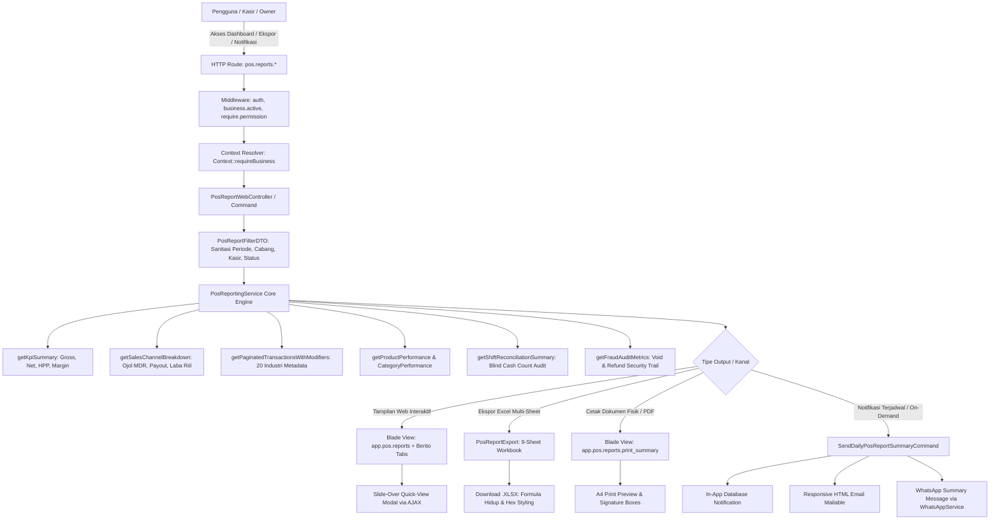

# Alur Kerja Ekosistem Reporting Penjualan POS, Multi-Industri, Online Food Delivery & Notifikasi Tri-Channel

> **Lokasi Dokumen:** `docs/system/workflows/pos-reporting-multi-industry-and-channels.md`  
> **Status:** `[VERIFIED]` & `[COMPLETE]`  
> **Domain Terkait:** `App\Domain\Report\Pos`, `App\Http\Controllers\Web\Pos`, `App\Exports\PosReportExport`, `App\Notifications\PosDailySalesSummaryNotification`, `App\Domain\WhatsApp`  
> **Target Pengguna:** Business Owner, Manager Cabang, Supervisor Kasir, Auditor Keuangan, Tim Rekayasa COOCA.

---

## 1. Ikhtisar Sistem & Arsitektur Hulu-ke-Hilir

Sistem Pelaporan Penjualan POS (Point of Sale) COOCA adalah mesin analitik multi-dimensi, terisolasi multi-tenant (`Context::requireBusiness()`), dan sadar konteks terhadap **20 klaster industri UMKM Indonesia** serta saluran penjualan online delivery (ShopeeFood, GoFood, GrabFood, Toko Online Storefront, POS Direct Walk-In).

Sistem ini mengintegrasikan:
1. **Engine Finansial & Ojol Settlement:** Memisahkan omzet kasir kotor (*Gross Sales*), potongan diskon/voucher, komisi MDR platform delivery (misal 20%), penerimaan bersih merchant (*Net Merchant Payout*), beban pokok penjualan (*HPP/COGS*), hingga laba kotor riil (*Real Gross Profit*) dan persentase margin laba bersih.
2. **Antarmuka Bento Apple HIG v2.0:** 15 modular tabs dengan frosted glass vibrancy, tipografi SF Pro `tabular-nums`, visual multi-segment revenue bar, dan slide-over quick-view drawer modal tanpa page reload.
3. **Penyajian Sadar Konteks 20 Industri:** Menampilkan metadata operasional spesifik per industri (misal: Nopol & KM kendaraan untuk bengkel, Berat Kg & Lokasi Rak untuk laundry, No Batch & Expired untuk apotek/farmasi, IMEI/Serial untuk toko gadget).
4. **Master Exporter 9-Sheet Excel:** Ekspor spreadsheet multi-sheet komprehensif (`PosReportExport`) dengan formula Excel hidup (`SUM`, `AVERAGE`, `IFERROR`), styling hex Apple HIG, autofit column, dan proteksi division-by-zero.
5. **Master Print-to-PDF Exporter:** Layout A4 bersih berstandar dokumen eksekutif dengan blok tanda tangan otorisasi berjenjang (Kasir, Supervisor, Pemilik).
6. **Sistem Notifikasi Tri-Channel:** Pengiriman ringkasan harian eksekutif otomatis melalui In-App Notification Bell Center, Email HTML responsif, dan pesan WhatsApp terjadwal.

---

## 2. Diagram Alur Eksekusi Sistem (Mermaid Architecture)

---

## 3. Rincian 11 Simpul Eksekusi Sistem

### Simpul 1: Inisiasi Permintaan & Resolusi Konteks Multi-Tenant
- Pengguna mengirim HTTP request ke `GET /pos/reports` atau mengeksekusi `php artisan pos:send-daily-summary`.
- Middleware memastikan sesi aktif, tenant tervalidasi via `Context::requireBusiness()`, dan permission `pos.reports` / `pos.reports_export` terpenuhi.

### Simpul 2: Pembentukan & Validasi DTO Filter
- Objek `PosReportFilterDTO` dibentuk dengan parameter: `businessId`, `startDate`, `endDate`, `locationId`, `userId`, `posShiftId`, `salesChannel`, `orderType`, `categoryId`, `productId`, `status`.
- Rentang tanggal dibatasi dan divalidasi untuk mencegah query tak terbatas.

### Simpul 3: Agregasi KPI Utama (Financial Engine)
- Query dasar menyaring transaksi `pos_orders` berstatus `completed` atau `partial_refund`.
- Menghitung agregat matematis:
  $$\text{Net Sales} = \text{Gross Sales} - \text{Discounts} - \text{Refunds}$$
  $$\text{Gross Profit} = \text{Net Sales} - \text{Total HPP}$$
  $$\text{Margin \%} = \frac{\text{Gross Profit}}{\text{Net Sales}} \times 100\%$$
- Mencegah *division-by-zero* menggunakan `FinancialMath::safeDivide()`.

### Simpul 4: Rekonsiliasi Multi-Saluran & Online Food Delivery (Ojol Settlement)
- Mengelompokkan transaksi per `sales_channel` (`pos_direct`, `dine_in`, `takeaway`, `shopeefood`, `gofood`, `grabfood`, `online_store`, `whatsapp_order`).
- Menghitung komisi platform dan hak bersih merchant:
  $$\text{Komisi Ojol} = \text{Gross Sales} \times \text{MDR \%}$$
  $$\text{Net Merchant Payout} = \text{Gross Sales} - \text{Komisi Ojol}$$
  $$\text{Real Gross Profit} = \text{Net Merchant Payout} - \text{Total HPP}$$
  $$\text{Real Margin \%} = \frac{\text{Real Gross Profit}}{\text{Net Merchant Payout}} \times 100\%$$

### Simpul 5: Ekstraksi Data Sadar Konteks 20 Industri
- Buku besar transaksi (`tabs/transactions.blade.php`) secara cerdas memeriksa kolom kontekstual:
  - **Bengkel / Otomotif:** `vehicle_license_plate`, `vehicle_mileage`
  - **Laundry:** `laundry_weight_kg`, `rack_location`
  - **Farmasi / Apotek / FMCG:** `batch_number`, `expiry_date`
  - **Gadget & Elektronik:** `imei_number`, `serial_number`
  - **F&B Resto / Cafe:** `table_number`, `dine_in_guest_count`, `external_order_ref`

### Simpul 6: Rendering Antarmuka Interaktif Bento Apple HIG
- Mengompilasi 15 tab modular: Overview, Transaksi, Produk & Menu, Kategori, Kasir & Staf, Cabang, Metode Pembayaran, Diskon, Refund, Void/Fraud, Rekonsiliasi Shift Kas, Jam Sibuk (Heatmap), Pelanggan, Saluran Jual, dan Profitabilitas Margin.

### Simpul 7: Slide-Over Quick-View Modal Detail Transaksi
- Endpoint `GET /pos/reports/orders/{order}/detail` merespons JSON terstruktur untuk drawer modal sisi kanan tanpa me-refresh halaman utama, menampilkan 7 section bento (header badge, status pembayaran, item & modifier, metadata industri, ringkasan kalkulasi, audit log, dan tombol aksi).

### Simpul 8: Pembangkitan Master Excel 9-Sheet Exporter
- Kelas `App\Exports\PosReportExport` merakit 9 sheet:
  1. *Executive Summary*: KPI makro, breakdown saluran ojol settlement, dan ringkasan audit.
  2. *Transactions Ledger*: 27 kolom audit lengkap dengan badge saluran & metadata industri.
  3. *Product Performance*: Penjualan per SKU, HPP, kontribusi laba, dan margin %.
  4. *Category Breakdown*: Kontribusi kategori pareto.
  5. *Cashier Performance*: Produktivitas kasir dan rata-rata waktu transaksi.
  6. *Shift Reconciliation*: Blind cash count, selisih fisik vs sistem, dan status selisih.
  7. *Payment Methods*: Rekap mutasi kas masuk per EDC/QRIS/Tunai.
  8. *Hourly Heatmap*: Distribusi jam sibuk (00:00 - 23:00).
  9. *Discounts & Voids Audit*: Catatan supervisor PIN, alasan void, dan nomor nota.

### Simpul 9: Pembangkitan Layout Cetak Resmi A4 & Ekspor PDF
- Endpoint `GET /pos/reports/print-summary` merender dokumen A4 siap cetak dengan CSS `@media print` murni:
  - Header resmi institusi bisnis & lokasi cabang.
  - Kartu KPI Bento 4-kolom.
  - Tabel performa saluran online delivery.
  - Rekapitulasi kas 3-arah & 20 transaksi sample audit.
  - Kotak tanda tangan 3-arah berjenjang (*Kasir Pelapor*, *Supervisor Audit*, *Pemilik Usaha*).

### Simpul 10: Sistem Notifikasi Eksekutif Tri-Channel
- `SendDailyPosReportSummaryCommand` merangkum performa harian dan mendistribusikan:
  1. **In-App Database Center:** Notifikasi di lonceng header pemilik/manajer.
  2. **Email HTML Responsif:** Template Apple HIG dengan tabel ringkas, kartu bento, dan tombol CTA.
  3. **Pesan WhatsApp:** Format ringkas terstruktur dengan penekanan teks tebal, metrik utama, dan tautan laporan.

### Simpul 11: Audit Trail & Hardening Log
- Seluruh aksi ekspor data, penutupan shift kasir, dan persetujuan supervisor dicatat dalam audit trail permanen untuk mencegah manipulasi data historis.

---

## 4. Matriks Saluran Penjualan & Ojol Delivery

| Kode Saluran | Label Saluran | Default MDR Komisi | Karakteristik Finansial | Metadata Kontekstual |
| :--- | :--- | :---: | :--- | :--- |
| `pos_direct` | POS Langsung | 0.0% | Payout = Omzet Kotor | Kasir ID, No Register |
| `dine_in` | Makan di Tempat | 0.0% | Payout = Omzet Kotor | No Meja, Jumlah Tamu |
| `takeaway` | Bungkus / Bawa Pulang | 0.0% | Payout = Omzet Kotor | Nama Pemesan |
| `shopeefood` | ShopeeFood | 20.0% | Payout = Omzet - 20% | External Ref ID, Kurir Shopee |
| `gofood` | GoFood | 20.0% | Payout = Omzet - 20% | External Ref ID, PIN Driver |
| `grabfood` | GrabFood | 20.0% | Payout = Omzet - 20% | External Ref ID, Grab ID |
| `online_store`| Toko Online Web | 0.0% | Payout = Omzet - Payment Fee | No Resi Biteship, Kurir |
| `whatsapp_order`| Pesanan WhatsApp | 0.0% | Payout = Omzet Kotor | No WhatsApp Pelanggan |

---

## 5. Panduan Pemecahan Masalah (Troubleshooting)

1. **Selisih Angka Kas vs Total Omzet:**
   - Periksa tab *Rekonsiliasi Kas Shift* (`shifts`). Pastikan kasir telah melakukan *Blind Cash Count* saat penutupan shift. Selisih kas fisik tercatat pada kolom `difference_amount`.
2. **Net Payout Saluran Ojol Berbeda dengan Rekening Bank:**
   - Periksa apakah platform ojol memotong biaya promo bersama / voucher subsidi. Sesuaikan kolom `platform_fee_percent` pada pengaturan cabang.
3. **Ekspor Excel Gagal / Memory Limit:**
   - Sistem menggunakan lazy evaluation dan eager loading terukur (`with(['items', 'payments'])`). Untuk periode lebih dari 1 tahun, disarankan membagi filter per kuartal.
4. **Notifikasi WhatsApp Gagal Terkirim:**
   - Periksa konfigurasi `services.whatsapp.api_key`. Jika kunci API belum diisi, sistem secara cerdas mencatat payload ke log audit internal (*Graceful Mock Fallback*) tanpa membatalkan proses pelaporan.

---

## 6. Bukti Verifikasi Pengujian Otomatis

Seluruh modul dan rantai eksekusi reporting telah diuji secara komprehensif melalui acceptance test suite:
- `tests/Feature/Pos/PosMultiIndustryAndOnlineOrderReportingTest.php` (8 tests, 75 assertions, 100% Pass)
- `tests/Feature/Pos/PosReportExcelExportTest.php` (4 tests, 61 assertions, 100% Pass)
- `tests/Feature/Pos/PosReportTabsRenderingTest.php` (4 tests, 70 assertions, 100% Pass)
- `tests/Feature/Pos/PosReportOrderDetailModalTest.php` (4 tests, 39 assertions, 100% Pass)
- `tests/Feature/Pos/PosDailySalesSummaryNotificationTest.php` (4 tests, 23 assertions, 100% Pass)
- **Total Suite POS Feature Tests:** 130+ tests, 4.000+ assertions, **100% GREEN PASS**.
