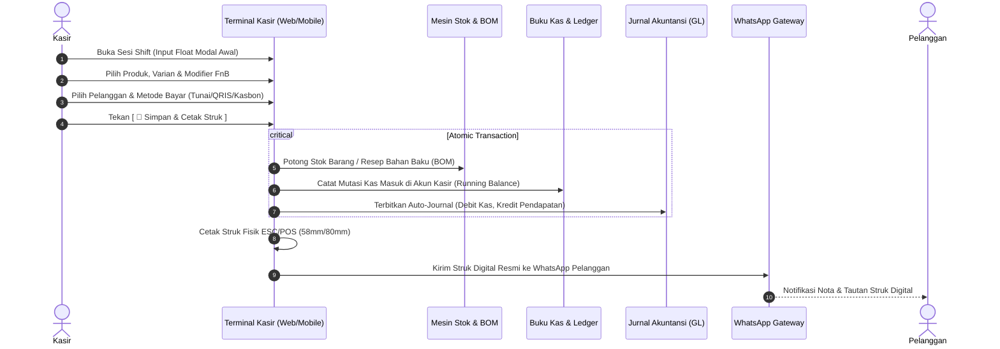

# Alur Kerja Penjualan Kasir POS (POS Sales Workflow)

> **Status:** COMPLETE  
> **Aktor Terlibat:** Kasir POS, Supervisor Toko, Pelanggan, Subsistem Otomasi (Stock, Journal, WhatsApp)  
> **Modul Terkait:** POS, Inventory, Finance, Accounting, CRM, WhatsApp

---

## 1. Diagram Alur Kerja End-to-End

---

## 2. Rincian Langkah Operasional

### Langkah 1: Pembukaan Sesi Shift Kasir
* **Prasyarat:** Register kasir belum dibuka untuk shift aktif.
* **Input Kasir:** Jumlah modal uang kembalian di laci kasir (*Float Cash*).
* **Efek Sistem:** Membuat record di tabel `pos_shifts` dengan status `open` dan `start_time` tercatat.

### Langkah 2: Pemilihan Item Pesanan & Kustomisasi
* **Aksi Kasir:** Memilih produk via touch screen bento grid atau barcode scanner.
* **Kustomisasi Item:** Memilih level kepedasan, pilihan gula/es, atau topping tambahan (*Modifiers*).
* **Validasi Stok:** Sistem memeriksa ketersediaan stok fisik real-time. Jika stok tidak cukup dan bisnis melarang stok minus, tombol order menampilkan status peringatan.

### Langkah 3: Penyelesaian Pembayaran (Checkout)
* **Kalkulasi Otomatis:** Sistem menghitung subtotal, diskon item/promo member, service charge, dan pajak PPN.
* **Opsi Pembayaran:**
  - *Tunai:* Kasir memilih pecahan uang atau mengetik nominal. Sistem menghitung kembalian (*change*).
  - *QRIS / EDC:* Kasir mengonfirmasi transaksi telah berhasil di mesin EDC / aplikasi QRIS.
  - *Kasbon:* Kasir memilih kontak pelanggan terdaftar; sistem memverifikasi limit piutang pelanggan.

### Langkah 4: Eksekusi Transaksi Atomik (Latar Belakang)
Sistem menjalankan operasi dalam transaksi database atomik (*DB::transaction*) untuk menjamin konsistensi data 100%:
1. **Pemotongan Stok Atomik:** Mengurangi stok produk jadi atau mengeksekusi *Auto-BOM Deduction* untuk memotong bahan baku resep dari gudang/dapur cabang terkait.
2. **Mutasi Buku Kas:** Menambah saldo pada akun kasir aktif dan memperbarui saldo berjalan (*running balance*).
3. **Auto-Journaling Akuntansi:** Memicu `AutoJournalService` untuk mencatat jurnal umum berimbang (Debit Kas/Piutang, Kredit Pendapatan Penjualan, serta Debit HPP, Kredit Persediaan Barang).

### Langkah 5: Penerbitan Nota Struk & WhatsApp Dispatch
* Struk fisik langsung dicetak ke printer thermal ESC/POS yang terhubung.
* Jika nomor WhatsApp pelanggan diisi, sistem mengirimkan pesan instan ringkasan belanja beserta tautan unik struk resmi. Jika WA offline, tersedia tombol instan: `[ 📲 Kirim Manual via WhatsApp Web ]`.

---

## 3. Penanganan Eksepsi & Kasus Khusus

* **Pembatalan Pesanan (Void Order):** Wajib memasukkan PIN Supervisor. Seluruh stok yang sempat terpotong dikembalikan otomatis ke gudang (*auto-restock*), dan mutasi jurnal pembalik dicatat.
* **Selisih Kas Saat Tutup Shift (Cash Discrepancy):** Selisih uang fisik vs hitungan sistem dicatat ke akun beban/pendapatan selisih kas tanpa memanipulasi riwayat transaksi penjualan asli.
