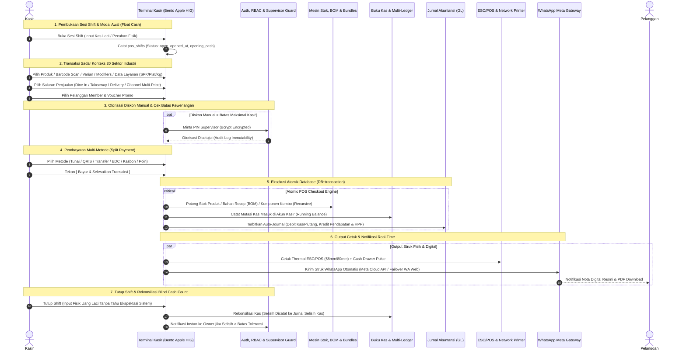

# Alur Kerja Penjualan Kasir POS (POS Sales & Multi-Industry Terminal Flow)

> **Status:** COMPLETE  
> **Aktor Terlibat:** Kasir POS, Supervisor Toko, Pelanggan, Subsistem Otomasi (Stock, Journal, WhatsApp, Hardware Printer)  
> **Modul Terkait:** POS, Inventory, Finance, Accounting, CRM, WhatsApp, Hardware Printers  
> **Cakupan:** 20 Sektor Industri UMKM Indonesia (F&B, Manufaktur, Ritel, Jasa Harian, Proyek, Distribusi)

---

## 1. Diagram Alur Kerja End-to-End Hulu-ke-Hilir


```mermaid
sequenceDiagram
    autonumber
    actor Kasir
    participant POS as Terminal Kasir (Bento Apple HIG)
    participant SEC as Auth, RBAC & Supervisor Guard
    participant Stock as Mesin Stok, BOM & Bundles
    participant Fin as Buku Kas & Multi-Ledger
    participant GL as Jurnal Akuntansi (GL)
    participant Print as ESC/POS & Network Printer
    participant WA as WhatsApp Meta Gateway
    actor Pelanggan

    Note over Kasir, POS: 1. Pembukaan Sesi Shift & Modal Awal (Float Cash)
    Kasir->>POS: Buka Sesi Shift (Input Kas Laci / Pecahan Fisik)
    POS->>POS: Catat pos_shifts (Status: open, opened_at, opening_cash)

    Note over Kasir, POS: 2. Transaksi Sadar Konteks 20 Sektor Industri
    Kasir->>POS: Pilih Produk / Barcode Scan / Varian / Modifiers / Data Layanan (SPK/Plat/Kg)
    Kasir->>POS: Pilih Saluran Penjualan (Dine In / Takeaway / Delivery / Channel Multi-Price)
    Kasir->>POS: Pilih Pelanggan Member & Voucher Promo

    Note over Kasir, SEC: 3. Otorisasi Diskon Manual & Cek Batas Kewenangan
    opt Diskon Manual > Batas Maksimal Kasir
        POS->>SEC: Minta PIN Supervisor (Bcrypt Encrypted)
        SEC-->>POS: Otorisasi Disetujui (Audit Log Immutability)
    end

    Note over Kasir, POS: 4. Pembayaran Multi-Metode (Split Payment)
    Kasir->>POS: Pilih Metode (Tunai / QRIS / Transfer / EDC / Kasbon / Poin)
    Kasir->>POS: Tekan [ Bayar & Selesaikan Transaksi ]

    Note over POS, GL: 5. Eksekusi Atomik Database (DB::transaction)
    critical Atomic POS Checkout Engine
        POS->>Stock: Potong Stok Produk / Bahan Resep (BOM) / Komponen Kombo (Recursive)
        POS->>Fin: Catat Mutasi Kas Masuk di Akun Kasir (Running Balance)
        POS->>GL: Terbitkan Auto-Journal (Debit Kas/Piutang, Kredit Pendapatan & HPP)
    end

    Note over POS, WA: 6. Output Cetak & Notifikasi Real-Time
    par Output Struk Fisik & Digital
        POS->>Print: Cetak Thermal ESC/POS (58mm/80mm) + Cash Drawer Pulse
        POS->>WA: Kirim Struk WhatsApp Otomatis (Meta Cloud API / Failover WA Web)
        WA-->>Pelanggan: Notifikasi Nota Digital Resmi & PDF Download
    end

    Note over Kasir, SEC: 7. Tutup Shift & Rekonsiliasi Blind Cash Count
    Kasir->>POS: Tutup Shift (Input Fisik Uang Laci Tanpa Tahu Ekspektasi Sistem)
    POS->>Fin: Rekonsiliasi Kas (Selisih Dicatat ke Jurnal Selisih Kas)
    POS->>SEC: Notifikasi Instan ke Owner jika Selisih > Batas Toleransi
```

---

## 2. Rincian Langkah Operasional Hulu-ke-Hilir

### Langkah 1: Pembukaan Sesi Shift Kasir (Shift Opening)
1. **Prasyarat:** Kasir login dengan akun aktif yang memiliki izin `pos.terminal` atau `pos.orders`.
2. **Input Kasir:** Modal awal kas di laci kasir (*Float Cash / Opening Cash*), dapat dihitung manual atau menggunakan *Kalkulator Pecahan Uang Fisik* (Rp 100.000 s/d koin).
3. **Efek Sistem:** Membuat record pada tabel `pos_shifts` dengan status `open`, mengunci register kasir untuk kasir aktif, dan mencatat waktu buka shift secara presisi.

### Langkah 2: Pemilihan Item & Personalisasi Kontekstual 20 Sektor
1. **Katalog & Pencarian Cerdas:** Kasir memilih item via Bento Touch Grid, pencarian instan nama/SKU, atau Barcode Gun USB/Bluetooth listener.
2. **Dukungan Varian & Resep Modifiers (F&B):** Memilih varian ukuran/suhu dan topping tambahan. Sistem secara real-time menghitung delta harga dan mengambil snapshot bahan baku terkait.
3. **Data Spesifik Industri (Context-Aware Form):**
   - **Bengkel Otomotif (`service_workshop`):** Input Nomor Plat Polisi, Model Kendaraan, Odometer KM, dan Pilih Montir/Teknisi.
   - **Laundry Kiloan (`service_laundry`):** Input Berat Timbangan (Kg), Nomor Rak Penyimpanan, dan Estimasi Selesai.
   - **Apotek & Farmasi (`retail_pharmacy`):** Input Nomor Batch, Tanggal Kadaluarsa (ED), dan Aturan Pakai Dosis Obat.
   - **Restoran & Cafe (`fnb_resto` / `fnb_cafe`):** Pilih Nomor Meja / Sesi Meja Aktif dan Sinkronisasi Reservasi Storefront.
   - **Cloud Kitchen (`fnb_cloud_kitchen`):** Pilih Saluran Online (GoFood, GrabFood, ShopeeFood) dan Input Nomor Pesanan Pengemudi Luar.

### Langkah 3: Penentuan Saluran Penjualan & Multi-Harga
1. Kasir memilih saluran penjualan aktif (`Dine In`, `Takeaway`, `GoFood`, `GrabFood`, `ShopeeFood`).
2. Alpine.js secara reaktif menghitung ulang seluruh item di keranjang belanja sesuai matriks `product_channel_prices`. Jika harga kanal khusus belum dikonfigurasi, sistem menggunakan harga dasar produk (*fallback*).

### Langkah 4: Validasi Promo, Voucher & Poin Loyalitas
1. **Diskon Manual:** Kasir dapat memberikan diskon fixed atau persentase. Jika persentase melebihi batas kewenangan kasir (`max_cashier_discount_percent`), modal otorisasi PIN Supervisor wajib diverifikasi.
2. **Voucher Promo:** Kode voucher diverifikasi secara asinkron ke server (`/pos/validate-voucher`). Sistem memastikan batas minimal belanja, masa berlaku, dan kuota pemakaian sebelum memotong total tagihan.
3. **Tukar Poin Member:** Pelanggan terdaftar dapat menukarkan saldo poin loyalitas menjadi potongan belanja langsung.

### Langkah 5: Penyelesaian Pembayaran (Multi-Payment Engine)
1. **Metode Tunggal:** Tunai (dengan kalkulasi kembalian dan rekomendasi pecahan uang pas), QRIS Statis/Dinamis, Transfer Bank, EDC Debit/Kredit, atau Kasbon (Pay Later).
2. **Split Payment:** Pembayaran gabungan (contoh: sebagian Tunai Rp 100.000 dan sisanya QRIS Rp 150.000) dengan validasi matematis presisi tanpa selisih pembulatan.
3. **EDC Machine Binding:** Kasir memilih mesin EDC fisik (`store_edc_terminals`) dan menginput nomor referensi trace audit perbankan.

### Langkah 6: Eksekusi Transaksi Atomik Database
Sistem membungkus seluruh mutasi dalam satu transaksi database atomik (`DB::transaction`):
1. **Pemotongan Stok Atomik:**
   - Produk Fisik Langsung: Mengurangi saldo stok di outlet/gudang aktif.
   - Resep BOM / Dapur: Mengurangi bahan baku mentah melalui `Auto-BOM Deduction`.
   - Paket Kombo / Bundling: Memotong stok seluruh komponen anak secara rekursif.
2. **Mutasi Buku Kas Kasir:** Menambahkan penerimaan kas bersih ke akun kasir dan mencatat mutasi buku besar kas berjalan (`CashLedgerService`).
3. **Auto-Journaling Akuntansi:** Menghasilkan jurnal umum berimbang otomatis:
   - Debit: Kas / Bank / Piutang Usaha
   - Kredit: Pendapatan Penjualan POS
   - Debit: Beban Pokok Penjualan (HPP Riil)
   - Kredit: Persediaan Barang Dagang / Bahan Baku
4. **Poin Loyalitas:** Menambahkan poin reward ke profil pelanggan terdaftar (`LoyaltyService`).

### Langkah 7: Penerbitan Struk Thermal & Digital WhatsApp
1. **Cetak Struk ESC/POS:** Mengirim instruksi cetak ke printer thermal (58mm/80mm) via Direct LAN/WiFi, USB Agent, atau Bluetooth. Memicu pulsa pembuka laci kas (*Cash Drawer Kick-Out*).
2. **Kirim Struk WhatsApp:** Otomatis mendistribusikan ringkasan transaksi beserta tautan web struk resmi ke nomor WhatsApp pelanggan. Jika gateway offline, kasir dapat menekan tombol 1-klik failover WhatsApp Web.

### Langkah 8: Penutupan Shift & Rekonsiliasi Blind Cash Count
1. **Blind Cash Count:** Kasir menghitung dan menginput total uang fisik di laci tanpa melihat angka ekspektasi sistem terlebih dahulu.
2. **Deteksi Selisih Kas:** Sistem membandingkan saldo aktual vs ekspektasi:
   - *Selisih Lebih (Overage):* Dijurnal otomatis ke Pendapatan Selisih Kas.
   - *Selisih Kurang (Shortage):* Dijurnal otomatis ke Beban Selisih Kas.
3. **Audit Alert:** Jika selisih kas melampaui toleransi, alert otomatis dikirimkan ke WhatsApp & Email Business Owner.

---

## 3. Matriks Keamanan & Anti-Fraud Kasir POS

| Modus Fraud / Celah Risiko | Mekanisme Pertahanan Sistem | Penegakan Backend & Validasi |
| :--- | :--- | :--- |
| **Pencurian Kas via Void Struk** | Pembatalan transaksi pasca bayar wajib PIN Supervisor 6 digit. | Bcrypt check + Restock atomik + Reverse Journal + Audit Log immutable. |
| **Kasir Mengurangi Uang Laci (Skimming)** | Penutupan shift wajib **Blind Cash Count**. Ekspektasi sistem disembunyikan dari UI kasir. | Server-side variance calculation. Selisih langsung terjurnal & dilaporkan ke Owner. |
| **Diskon Siluman / Kongkalikong** | Diskon manual di atas batas kewenangan (misal > 10%) wajib PIN Supervisor. | Validasi backend menolak checkout jika diskon > threshold tanpa supervisor approval. |
| **Pembukaan Laci Kas Tanpa Transaksi** | Fitur No-Sale Drawer Pop wajib memasukkan alasan dan diverifikasi PIN. | Rate limit (throttle: 5,1 menit) + Pencatatan jejak audit forensik lengkap. |
| **Manipulasi Harga via Script Client** | Harga produk dihitung ulang secara independen di server berdasarkan data DB/channel. | Server-side price resolution mengabaikan payload `unit_price` yang dimodifikasi browser. |
| **Serangan SSRF via Printer LAN** | Validasi interface IP printer memblokir endpoint metadata cloud & loopback. | Sanitizer IP menolak `169.254.169.254`, `127.0.0.1`, dan membatasi port ke standar ESC/POS. |

---

## 4. Matriks Do's & Don'ts untuk 20 Sektor Industri Bisnis

```
┌──────────────────────────────────────────────────────────────────────────────────┐
│ KLASTER 1: KULINER & F&B (7 Sektor)                                             │
│ Sektor: Resto (fnb_resto), Cafe (fnb_cafe), Bakery (fnb_bakery),                │
│         Cloud Kitchen (fnb_cloud_kitchen), Catering (fnb_catering),             │
│         Frozen Food (fnb_frozen_food), Diet Catering (fnb_catering_diet)        │
├──────────────────────────────────────────────────────────────────────────────────┤
│ DO:                                                                              │
│  ✓ Tampilkan manajemen Meja & Sesi Dine-in untuk resto dan cafe.                │
│  ✓ Tampilkan bar multi-harga saluran (GoFood, GrabFood, ShopeeFood, Takeaway).  │
│  ✓ Tampilkan modal modifier varian rasa, suhu, topping & level kepedasan.        │
│  ✓ Tampilkan integrasi reservasi meja hari ini dari Storefront.                 │
│  ✓ Sediakan Daily Batch Prep Sheet untuk katering dan central kitchen.          │
│ DON'T:                                                                           │
│  ✗ DILARANG menampilkan formulir Nomor Plat Kendaraan, Montir & Odometer Bengkel.│
│  ✗ DILARANG menampilkan input berat timbangan Kg & Lokasi Rak Laundry.           │
│  ✗ DILARANG menampilkan kolom aturan pakai dosis obat farmasi apotek.           │
└──────────────────────────────────────────────────────────────────────────────────┘

┌──────────────────────────────────────────────────────────────────────────────────┐
│ KLASTER 2: JASA OPERASIONAL HARIAN (4 Sektor)                                   │
│ Sektor: Bengkel Otomotif (service_workshop), Barbershop/Salon (service_barbershop),│
│         Laundry Kiloan (service_laundry), Cuci Mobil (service_autodetailing)     │
├──────────────────────────────────────────────────────────────────────────────────┤
│ DO:                                                                              │
│  ✓ Bengkel: Wajib tampilkan Plat Nomor, Model Kendaraan, KM Odometer, & Montir.  │
│  ✓ Laundry: Wajib tampilkan Berat (Kg), Lokasi Rak, & Estimasi Selesai Ambil.   │
│  ✓ Barbershop/Salon: Tampilkan pemilih Kapster / Hairstylist & durasi treatment. │
│  ✓ Cuci Mobil: Tampilkan Plat Nomor, Ukuran Kendaraan, & Nomor Antrean Bay.     │
│  ✓ Potong otomatis stok suku cadang, oli, deterjen, atau produk grooming.       │
│ DON'T:                                                                           │
│  ✗ DILARANG menampilkan denah Meja Dine-in atau tombol reservasi meja makan.    │
│  ✗ DILARANG menampilkan integrasi KDS dapur bar makanan & minuman.              │
│  ✗ DILARANG menampilkan tombol saluran online delivery makanan (GoFood/GrabFood).│
└──────────────────────────────────────────────────────────────────────────────────┘

┌──────────────────────────────────────────────────────────────────────────────────┐
│ KLASTER 3: RETAIL & TOKO (2 Sektor)                                             │
│ Sektor: Toko Retail & Minimarket (retail_reseller), Apotek & Alkes (retail_pharmacy)│
├──────────────────────────────────────────────────────────────────────────────────┤
│ DO:                                                                              │
│  ✓ Minimarket: Barcode scanner ultra-cepat, bulk quantity editor, uang pas pills.│
│  ✓ Apotek: Wajib kolom Nomor Batch, Tanggal Kadaluarsa (ED), & Dosis Pemakaian. │
│  ✓ Apotek: Hard guardrail peringatan resep dokter untuk obat keras (Golongan G). │
│  ✓ Cetak struk kasir ringkas 58mm/80mm dalam hitungan < 2 detik.                │
│ DON'T:                                                                           │
│  ✗ DILARANG menampilkan denah meja makan, pemesanan meja QR, atau KDS dapur.    │
│  ✗ DILARANG menampilkan formulir kendaraan montir bengkel.                      │
└──────────────────────────────────────────────────────────────────────────────────┘

┌──────────────────────────────────────────────────────────────────────────────────┐
│ KLASTER 4: MANUFAKTUR, PRODUKSI & TAILOR (7 Sektor)                              │
│ Sektor: Konveksi (mfg_garment), Logam Presisi (mfg_precision),                  │
│         Mebel/Kayu (mfg_furniture), Kerajinan (mfg_craft),                      │
│         Percetakan (mfg_printing), Kosmetik (mfg_cosmetics),                    │
│         Penjahit Custom (mfg_tailor_custom)                                     │
├──────────────────────────────────────────────────────────────────────────────────┤
│ DO:                                                                              │
│  ✓ Sediakan opsi pembayaran DP (Down Payment) / Termin dan pelunasan bertahap.  │
│  ✓ Input spesifikasi kustom pelanggan (Ukuran PxL/Meteran, Bahan, Warna, Desain).│
│  ✓ Catat nomor SPK / Antrean Produksi dan integrasikan ke HPP Resep BOM.        │
│ DON'T:                                                                           │
│  ✗ DILARANG memaksakan workflow ritel kilat tanpa pencatatan spesifikasi kustom. │
│  ✗ DILARANG menampilkan denah meja resto atau pengemasan makanan takeaway.      │
└──────────────────────────────────────────────────────────────────────────────────┘

┌──────────────────────────────────────────────────────────────────────────────────┐
│ KLASTER 5 & 6: JASA PROFESIONAL, KONTRAKTOR, DISTRIBUSI & AGRI (5 Sektor)       │
│ Sektor: Agency (service_agency), Kontraktor (service_contractor),               │
│         Event Organizer (service_event), Distributor FMCG (distributor_fmcg),   │
│         Pertanian & Hidroponik (agri_farming)                                   │
├──────────────────────────────────────────────────────────────────────────────────┤
│ DO:                                                                              │
│  ✓ Verifikasi limit piutang pelanggan (Customer Credit / Kasbon) secara ketat.  │
│  ✓ Konversi penawaran harga / invoice termin proyek ke pencatatan POS.          │
│  ✓ Multi-gudang stok tracking dan multi-satuan (Karton, Dus, Pcs, Kg).          │
│ DON'T:                                                                           │
│  ✗ DILARANG menampilkan menu meja restoran, KDS dapur, atau montir bengkel.     │
└──────────────────────────────────────────────────────────────────────────────────┘
```

---

## 5. Definition of Done & Standar Kualitas POS

* **Zero Scope Creep:** Modifikasi kode terfokus secara tepat sasaran pada komponen POS dan layanannya.
* **100% Test Pass:** Seluruh pengujian unit dan integrasi POS wajib lolos tanpa regresi.
* **Apple HIG Bento Compliance:** Antarmuka responsif tanpa dialog browser native (`alert()` / `confirm()`), tanpa emoji di tombol/judul/badge, dan modal sheet berukuran lapang XXL.
* **Strict Multi-Tenant Isolation:** Seluruh query wajib terikat pada `business_id` aktif dengan proteksi IDOR tanpa celah.
