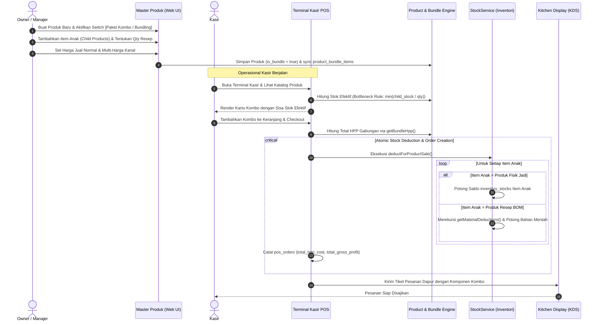

# Alur Kerja Paket Kombo & Bundling Produk (Product Bundling & Combo Workflow)

> **Status:** COMPLETE  
> **Aktor Terlibat:** Pengelola Toko / Owner, Kasir POS, Subsistem Inventori, Mesin Costing & HPP, Dapur/KDS  
> **Modul Terkait:** Products, Inventory, POS, Costing, Kitchen Display (KDS)  
> **Tabel Basis Data:** `products`, `product_bundle_items`, `inventory_stocks`, `inventory_movements`, `pos_orders`, `pos_order_items`

---

## 1. Diagram Alur Kerja End-to-End

---

## 2. Rincian Langkah Operasional

### Langkah 1: Konfigurasi Kombo pada Master Produk (Backoffice Web)
1. **Navigasi:** Pengguna membuka menu **Katalog & Logistik ➔ Produk** (`/products`).
2. **Pembukaan Canvas:** Pengguna menekan tombol `[ + Tambah Produk ]` yang membuka Modal-First XXL Form Canvas.
3. **Aktivasi Kombo:**
   - Pengguna menyalakan switch toggle **"Paket Kombo / Bundling"**.
   - Input tipe produk otomatis dialihkan dan formulir membuka Bento Box **"Konfigurasi Item Paket Kombo"**.
4. **Penyusunan Komponen Anak (Child Items Repeater):**
   - Pengguna memilih produk anak dari dropdown `allProducts` (dilengkapi proteksi circular reference: produk tidak dapat memilih dirinya sendiri).
   - Menentukan kuantitas kebutuhan per paket (misal: 1x Burger Sapi + 1x Es Teh Manis).
   - Sistem secara reaktif (`Alpine.js`) menghitung:
     - **Estimasi Total HPP Modal:** Penjumlahan akumulatif dari `base_cost` atau HPP aktif resep BOM masing-masing produk anak dikali kuantitasnya.
     - **Estimasi Nilai Normal:** Penjumlahan harga jual satuan produk anak jika dibeli terpisah.
5. **Persistensi Data:**
   - Controller `ProductWebController::store()` atau `update()` memvalidasi payload `bundle_items` (`child_product_id`, `quantity`).
   - Menyimpan atribut `is_bundle = true` pada tabel `products` dan menyinkronkan baris anak ke tabel `product_bundle_items`.

---

### Langkah 2: Evaluasi Stok Real-Time & Aturan Bottleneck (Bottleneck Stock Rule)
Produk kombo **tidak memiliki stok fisik langsung**. Ketersediaan stok kombo sepenuhnya ditentukan oleh ketersediaan item-item anak yang menyusunnya.

* **Rumus Stok Efektif (Bottleneck):**
  $$\text{Effective Bundle Stock} = \min_{i=1}^{n} \left( \left\lfloor \frac{\text{Physical Stock}(\text{Child}_i)}{\text{Required Qty}(\text{Child}_i)} \right\rfloor \right)$$
* **Logika Eksekusi:**
  - Metode `Product::calculateEffectiveStock(?string $locationId)` dan `Product::calculateEffectiveAvailableStock(?string $locationId)` mengiterasi seluruh `bundleItems`.
  - Jika stok salah satu produk anak bernilai $\le 0$ atau tidak mencukupi rasio kuantitas minimalnya, maka stok paket kombo **seketika bernilai `0.0`** (Out of Stock).
  - Kasir POS secara real-time melihat stok maksimal kombo yang dapat dijual saat itu juga tanpa risiko *overselling*.

---

### Langkah 3: Akumulasi HPP & Integritas Finansial (HPP Accumulation)
* **Rumus Akuntansi HPP Kombo:**
  $$\text{Bundle HPP} = \sum_{i=1}^{n} \left( \text{Unit HPP}(\text{Child}_i) \times \text{Required Qty}(\text{Child}_i) \right)$$
* **Penyelesaian Unit HPP (`Product::getBundleHpp()`):**
  - Untuk setiap produk anak, sistem mengambil harga modal dasar (`base_cost`). Jika produk anak memiliki resep BOM dengan kalkulasi costing aktif, sistem mengambil nilai costing run terakhir.
* **Pencatatan Transaksi (`PosOrderService`):**
  - Saat kasir melakukan checkout order kombo, `PosOrderService::checkout()` dan `createOrderFromTable()` mengeksekusi `$product->getBundleHpp()`.
  - Field `total_hpp_cost` pada `pos_orders` mencatat total modal riil gabungan seluruh komponen kombo.
  - Laba kotor transaksi dihitung presisi:
    $$\text{total\_gross\_profit} = \text{total\_amount} - \text{total\_hpp\_cost}$$
  - Mencegah distorsi laba rugi bisnis pada laporan keuangan akuntansi.

---

### Langkah 4: Pemotongan Stok Atomik Rekursif (Atomic Stock Deduction)
Saat pesanan kasir berstatus lunas (`paid`), `StockService::deductForProductSale()` memproses produk kombo secara atomik di dalam `DB::transaction`:

1. **Deteksi Tipe Kombo:** Sistem mendeteksi `$productModel->isBundle() === true`.
2. **Iterasi Produk Anak:**
   - Loop membaca seluruh relasi `bundleItems`.
   - Menghitung kuantitas anak yang harus dipotong: $\text{Deduction Qty} = \text{Order Qty} \times \text{Item Required Qty}$.
3. **Penanganan Dualitas Tipe Anak:**
   - **Kasus A (Anak bertipe Produk Fisik / Finished Good):** Sistem langsung mengurangi saldo stok produk anak pada tabel `inventory_stocks` di lokasi/cabang kasir terkait, serta mencatat kartu mutasi `inventory_movements` (tipe `sale`).
   - **Kasus B (Anak bertipe Resep / BOM):** Melalui `Product::getMaterialDeductions()` (Case 0), sistem merekursi bahan baku mentah resep anak dan memotong stok bahan baku dapur terkait.
4. **Pencegahan Duplikasi:** Tabel `pos_order_items` hanya mencatat 1 baris untuk paket kombo, sedangkan kartu stok mencatat mutasi transparan untuk masing-masing komponen anak.

---

### Langkah 5: Pengembalian Stok saat Pembatalan / Refund (Refund Restock)
Jika supervisor kasir menyetujui *Refund* atau *Void* pesanan kombo:
* `StockService::restoreForPosRefund()` mendeteksi item pesanan dengan `product->isBundle() === true`.
* Sistem secara otomatis mengembalikan stok ke masing-masing produk anak atau bahan baku BOM resep anak secara proporsional.
* Menjamin tidak ada stok yang "hilang" atau "tersangkut" pasca pembatalan transaksi.

---

## 3. Penanganan Eksepsi & Edge Cases

| Skenario | Perilaku Sistem | Tindakan Kasir / Manajer |
| :--- | :--- | :--- |
| **Salah satu produk anak habis** | Stok paket kombo otomatis menjadi `0.0`. Tombol tambah di kasir menampilkan status nonaktif / stok habis. | Restock produk anak atau nonaktifkan sementara paket kombo dari master produk. |
| **Kuantitas produk anak pecahan desimal (misal 0.5 kg)** | Sistem menggunakan fungsi `floor()` untuk menghitung stok paket utuh yang dapat dirakit. | Memastikan ketersediaan unit bahan baku di gudang. |
| **Produk kombo memilih dirinya sendiri (Circular)** | Validasi backend di `ProductWebController` memblokir `child_product_id == parent_product_id`. | Sistem menampilkan notifikasi error validasi formulir. |
| **Multi-cabang / Multi-lokasi** | Evaluasi stok bottleneck dihitung spesifik berdasarkan `$locationId` cabang kasir aktif. | Kasir hanya memotong stok dari lokasi/gudang cabang tempat kasir bertugas. |
