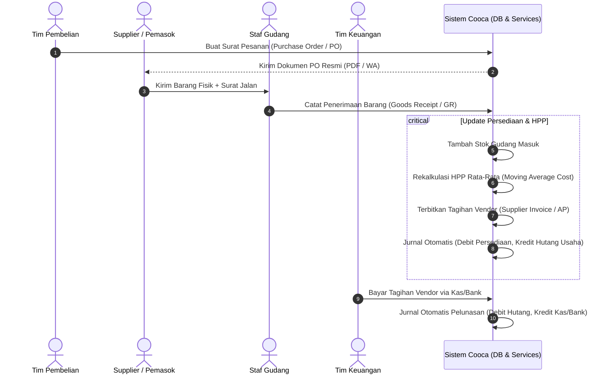

# Alur Kerja Pengadaan & Penerimaan Barang (Purchasing & Goods Receipt Workflow)

> **Status:** COMPLETE  
> **Aktor Terlibat:** Manajer Pembelian, Staf Gudang, Pemasok (Vendor), Bagian Keuangan  
> **Modul Terkait:** Purchasing, Inventory, Finance, Accounting

---

## 1. Diagram Alur Kerja End-to-End

---

## 2. Rincian Langkah Operasional

### Langkah 1: Pembuatan Purchase Order (PO)
* **Aktor:** Manajer Pembelian atau Owner.
* **Input:** Pilihan supplier terdaftar, daftar bahan baku atau produk jadi, kuantitas order, satuan beli (misal: *Karung 25kg*), dan harga satuan yang disepakati.
* **Status Awal:** `draft` ➔ `approved / sent`. Dokumen PO resmi dapat dicetak PDF atau dikirim via WhatsApp ke kontak supplier.

### Langkah 2: Kedatangan Fisik & Penerimaan Barang (Goods Receipt)
* **Aktor:** Staf Gudang / Logistik.
* **Pencocokan Dokumen:** Staf memeriksa nomor PO asal, memverifikasi kesesuaian fisik barang, tanggal kedaluwarsa (*batch/expiry date*), dan jumlah barang yang diterima.
* **Penerimaan Sebagian (*Partial Goods Receipt*):** Jika supplier baru mengirim 30 dari 50 unit yang dipesan, sistem mencatat GR parsial. Sisa 20 unit tetap berstatus *outstanding* pada PO hingga pengiriman berikutnya tiba.

### Langkah 3: Eksekusi Otomasi Sistem (Saat GR Disimpan)
1. **Peningkatan Saldo Stok Fisik:** Menambah stok di gudang tujuan dalam satuan terkecil (*base unit*) berdasarkan faktor konversi.
2. **Rekalkulasi Harga Modal Rata-Rata (*Moving Average*):**  
   Harga modal acuan diperbarui otomatis dengan formula moving average berbobot.
3. **Penerbitan Hutang Usaha (AP Invoice):**  
   Sistem secara otomatis membuat dokumen Tagihan Pemasok (`supplier_invoices`) dengan nominal setara nilai barang yang telah diterima fisik.
4. **Auto-Journaling Akuntansi:**  
   - Debit: **Akun Persediaan Bahan / Barang** (Aset)
   - Kredit: **Hutang Usaha Pemasok / AP** (Kewajiban)

### Langkah 4: Pelunasan Tagihan Pemasok (Vendor Payment)
* **Aktor:** Bagian Keuangan / Owner.
* **Proses:** Membuka menu Hutang Usaha (*Accounts Payable*), memilih faktur yang jatuh tempo, memilih akun kas atau rekening bank pembayar, dan mengeksekusi pembayaran.
* **Efek Sistem:**
  - Status tagihan berubah menjadi `paid`.
  - Saldo rekening bank berkurang secara riil.
  - Auto-Journal: Debit **Hutang Usaha (AP)**, Kredit **Kas & Rekening Bank**.

---

## 3. Penanganan Ketidaksesuaian & Retur Pembelian (Purchase Return)

* Jika barang yang diterima rusak (*damaged*) atau tidak sesuai pesanan:
  1. Staf membuat dokumen **Retur Pembelian (*Purchase Return*)**.
  2. Sistem memotong stok gudang sebesar barang yang diretur.
  3. Mengurangi saldo hutang usaha ke vendor atau mencatat nota kredit (*Credit Note*).
  4. Auto-journal membalik entri hutang dan persediaan secara proporsional.
