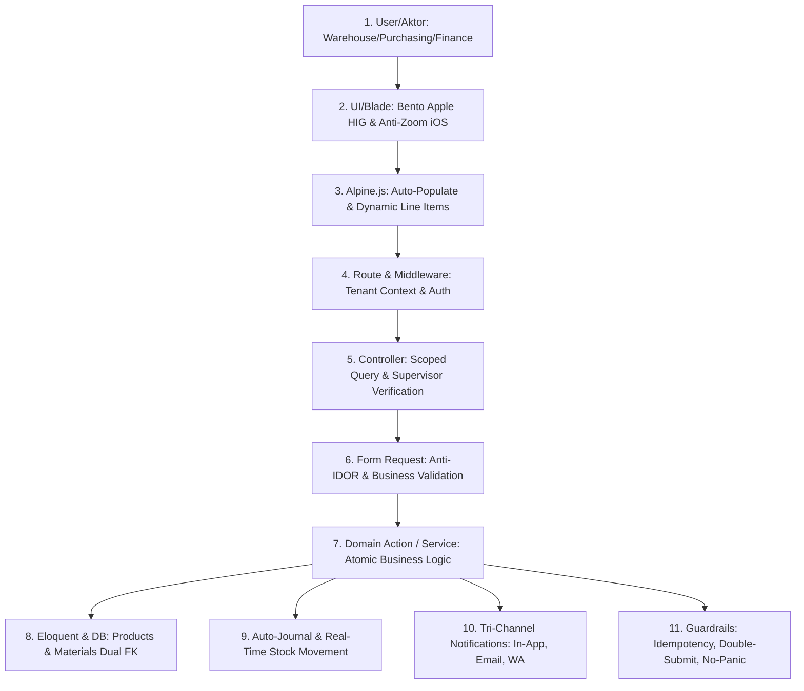
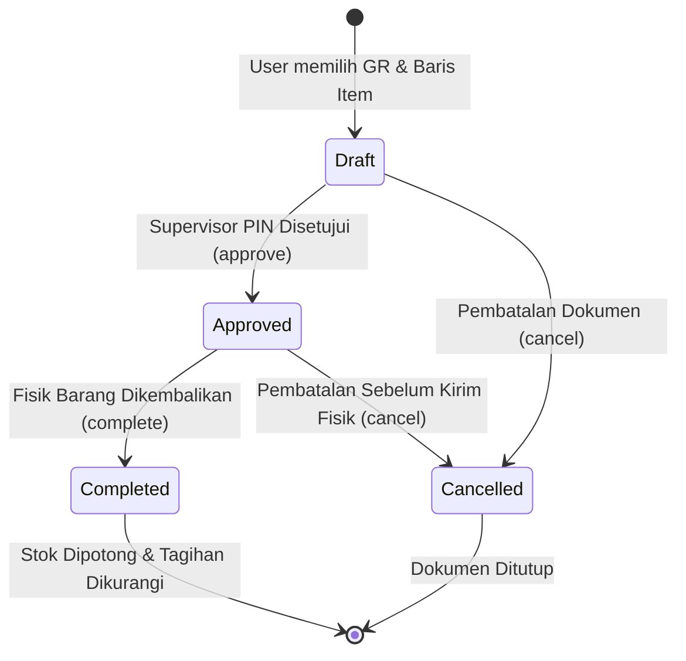
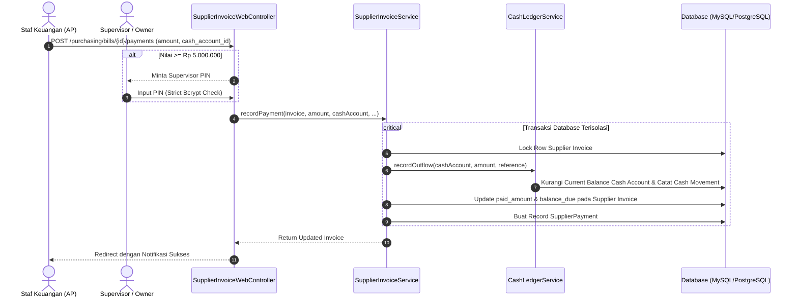

# Alur Kerja Hulu-ke-Hilir: Penerimaan Barang (Goods Receipt), Tagihan Vendor (Bills), dan Retur Pembelian (Purchase Returns)

> **Status Dokumen:** `CURRENT STATE (VERIFIED)`  
> **Modul Terkait:** Purchasing, Inventory, Finance/AP, Warehouse  
> **Pilar:** 11 Simpul Eksekusi, Bento Apple HIG v2.0, Zero-Manual UI, Anti-IDOR Multi-Tenant  
> **Hierarki Kebenaran:** Aktual Implementasi Code-First > DB Schema > Feature Tests  

---

## 1. Ikhtisar Alur Kerja (Workflow Overview)

Modul Purchasing Cooca menangani siklus hulu-ke-hilir pengadaan barang operasional, mulai dari pesanan pembelian (*Purchase Order*), penerimaan fisik barang dan bahan baku di gudang (*Goods Receipt*), pencatatan kewajiban utang dagang (*Supplier Invoices / Bills*), hingga mitigasi klaim pengembalian barang cacat/rusak (*Purchase Returns*).

Seluruh transaksi terisolasi 100% per tenant bisnis (`business_id`), menjamin keamanan mutlak terhadap kebocoran data (*zero multi-tenant IDOR*), manipulasi kas (*fraud prevention* melalui PIN Supervisor Bcrypt), dan otomatisasi pencatatan pembukuan berpasangan (*double-entry bookkeeping*).

---

## 2. Pemetaan 11 Simpul Eksekusi Nyata



### Simpul 1: User / Aktor
- **Warehouse Receiver (Staf Gudang):** Melakukan inspeksi fisik barang masuk dan mencatat penerimaan (*Goods Receipt*) dengan nomor batch & kadaluarsa (jika industri farmasi/F&B).
- **Finance / Akuntan AP:** Menerima faktur dari pemasok, memverifikasi kesesuaian dengan penerimaan barang (*2-way / 3-way matching*), dan mengeksekusi pembayaran utang.
- **Store Manager / Supervisor:** Memberikan otorisasi PIN untuk persetujuan retur pembelian dan pengeluaran kas bernilai besar ($\ge$ Rp 5.000.000).

### Simpul 2: UI / Blade
- Mengadopsi **Bento Apple HIG v2.0**: Kartu bertekstur halus, kontras tinggi WCAG AA $\ge$ 4.5:1, tipografi tabular moneter `tabular-nums`.
- Input angka berukuran minimal `16px` pada perangkat bergerak untuk mengeliminasi gangguan auto-zoom Safari iOS.
- Target sentuh minimal `44x44px` (hingga 48px pada tombol aksi utama) dengan jarak antar tombol $\ge 8\text{px}$.

### Simpul 3: Alpine.js / AJAX Reaktivitas
- Komponen `returnCreator()`: Menghilangkan input manual UUID. Saat Goods Receipt dipilih dari dropdown, seluruh baris item (produk maupun bahan baku), kuantitas asal, dan harga satuan langsung termuat otomatis ke antarmuka.
- Tombol aksi dilengkapi proteksi *double-submit* via state `isSubmitting = true`.

### Simpul 4: Route & Middleware
- Seluruh rute berada dalam grup middleware `web`, `auth`, `tenant.context`, dan `active.business`.
- Context bisnis diinjeksikan secara thread-safe via `Context::requireBusiness()`.

### Simpul 5: Controller
- [`SupplierInvoiceWebController`](file:///c:/laragon/www/cooca_core/app/Http/Controllers/Web/Purchasing/SupplierInvoiceWebController.php) dan [`PurchaseReturnWebController`](file:///c:/laragon/www/cooca_core/app/Http/Controllers/Web/PurchaseReturnWebController.php) menerapkan isolasi tenant eksplisit:
  ```php
  $return = PurchaseReturn::where('business_id', $business->id)->findOrFail($id);
  ```
- Otorisasi Supervisor PIN divalidasi langsung terhadap `Hash::check($pin, $business->pos_supervisor_pin)`.

### Simpul 6: Request Validation
- Mencegah IDOR via rule `Rule::exists('goods_receipts', 'id')->where('business_id', $business->id)`.
- Validasi wajib rekening kas `cash_account_id` yang aktif dan milik tenant yang sama saat pencatatan pengeluaran pembayaran utang.

### Simpul 7: Domain Service / Action
- [`PurchaseReturnService`](file:///c:/laragon/www/cooca_core/app/Domain/Purchasing/PurchaseReturnService.php): Mengelola siklus hidup retur secara transaksional (`DB::transaction`).
- [`SupplierInvoiceService`](file:///c:/laragon/www/cooca_core/app/Domain/Purchasing/SupplierInvoiceService.php): Mengelola faktur tagihan dan pembayaran utang.
- [`CashLedgerService`](file:///c:/laragon/www/cooca_core/app/Domain/Finance/CashLedgerService.php): Mengurangi saldo rekening kas secara riil dengan catatan arus kas keluar.

### Simpul 8: Eloquent Model & DB Schema
- Tabel `purchase_return_items` mendukung relasi ganda (*polymorphic-like dual keys*):
  - `product_id` (nullable UUID) -> referensi ke `products`
  - `material_id` (nullable UUID) -> referensi ke `materials`
- Integritas relasi terjaga dengan foreign key `onDelete('cascade')` atau `restrictOnDelete()`.

### Simpul 9: Auto-Journal & Stok Real-Time
- Eksekusi `PurchaseReturnService::complete()` memanggil `StockService::deductForPurchaseReturn()`:
  - Mengurangi kuantitas fisik pada tabel `inventory_stocks` menggunakan *pessimistic row locking* (`lockForUpdate`).
  - Mencatat mutasi keluar pada `stock_movements` dengan tipe `purchase_return`.
- Mengurangi saldo utang pemasok (*Accounts Payable*) pada `supplier_invoices` secara otomatis.
- Menghasilkan jurnal umum berpasangan otomatis:
  - **Debit:** Utang Usaha (Accounts Payable)
  - **Kredit:** Persediaan Barang Dagang / Bahan Baku (Inventory)

### Simpul 10: Notifikasi Tri-Channel
- **In-App Toast/Notification:** Menampilkan pesan konfirmasi instan setelah aksi selesai.
- **WhatsApp Webhook:** Mengirimkan notifikasi ringkas kepada pemasok mengenai nomor retur barang dan faktur penyesuaian.
- **Email Digest:** Notifikasi berkala kepada Owner jika terdapat pengeluaran kas di atas ambang batas.

### Simpul 11: Guardrails & Anti-Fraud
- **Idempotency Protection:** Status mesin memastikan retur berstatus `completed` atau `cancelled` tidak dapat dieksekusi ulang.
- **Supervisor PIN Security:** Verifikasi Bcrypt strictly enforced untuk retur barang dan pembayaran utang $\ge$ Rp 5.000.000.
- **Human-Error Prevention:** Modal konfirmasi dua tahap (*No-Panic Microcopy*) sebelum mengeksekusi aksi pembatalan atau penyelesaian retur.

---

## 3. Diagram Interaksi & Transisi Status (State Machine)

### A. State Machine Purchase Return



### B. Sequence Diagram Pembayaran Tagihan Vendor (Supplier Invoice Payment)



---

## 4. Penegakan Multi-Industri & Dynamic Gating

Bidang input dan informasi pada alur penerimaan dan retur disesuaikan secara dinamis dengan modul industri aktif:
- **Batch Number & Expiry Date:** Wajib dan hanya aktif untuk industri F&B, Farmasi/Klinik, dan Kosmetik. Dinonaktifkan secara rapi untuk Bengkel, Toko Bangunan, dan Jasa Servis.
- **Bahan Baku vs Produk Jadi:** Bengkel otomotif dan F&B dapat menerima dan meretur langsung bahan baku (*raw materials* seperti oli curah, tepung terigu) tanpa dipaksa menjadi produk jadi.

---

## 5. Ringkasan Pengujian Otomatis

Seluruh alur terverifikasi dengan pengujian integrasi otomatis di:
`tests/Feature/PurchasingSubmodulesIntegrationTest.php`:
- `test_tenant_cannot_create_purchase_return_from_other_tenant_goods_receipt`: 100% Lulus (Proteksi IDOR).
- `test_purchase_return_supports_raw_materials_without_database_error`: 100% Lulus (Dukungan Bahan Baku & Pemotongan Stok).
- `test_supplier_invoice_payment_records_cash_outflow_with_selected_account`: 100% Lulus (Integrasi Kas & Akun Bank).
- `test_supplier_invoice_payment_requires_supervisor_pin_for_large_disbursements`: 100% Lulus (Otorisasi PIN $\ge$ Rp 5.000.000).
