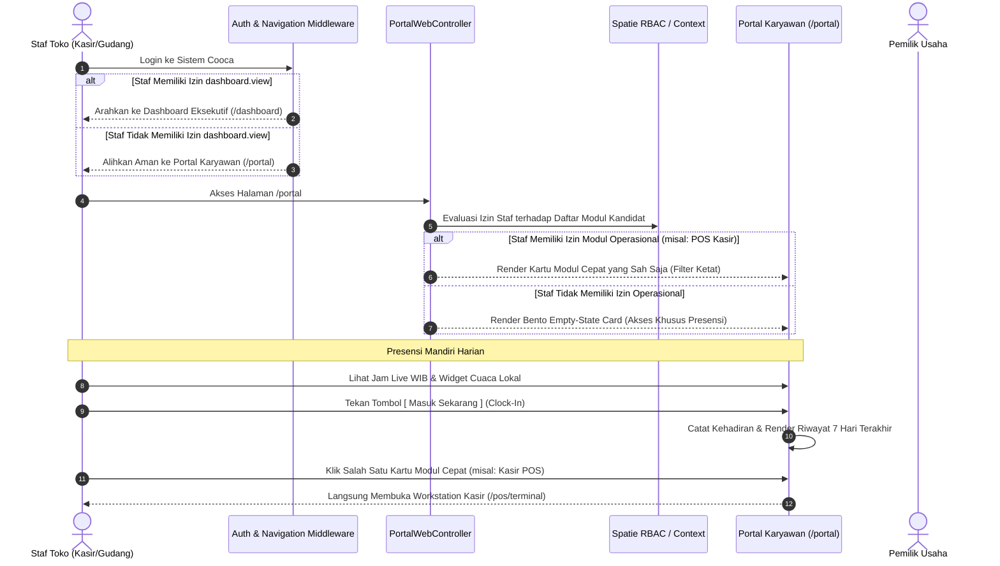

# Alur Kerja Portal Karyawan & Presensi Mandiri (Staff Portal & Attendance Workflow)

> **Status:** COMPLETE  
> **Aktor Terlibat:** Staf Kasir, Barista, Koki Dapur, Staf Gudang, Supervisor, Pemilik Toko (Owner)  
> **Modul Terkait:** HRM, Staff Portal, RBAC Permissions, Navigation, Workstation Shortcuts  
> **Tabel Basis Data:** `users`, `business_users`, `roles`, `permissions`, `attendances`

---

## 1. Diagram Alur Kerja End-to-End

---

## 2. Rincian Langkah Operasional

### Langkah 1: Pengalihan Aman Berbasis Hak Akses (Role Permission Guard)
1. **Pencegahan Error 403 & Redirect Loop:**
   - Halaman `/dashboard` dilindungi izin `dashboard.view` untuk menjaga kerahasiaan omzet, laba rugi, dan metrik eksekutif.
   - Pengguna dengan role staf non-manajerial (seperti Kasir atau Barista) yang mencoba mengakses menu root atau dashboard dialihkan secara mulus (*graceful redirect*) ke `/portal`.
2. **Ruang Kerja Personal:** Halaman `/portal` berfungsi sebagai pangkalan awal operasional staf untuk presensi harian dan navigasi cepat ke workstation mereka.

---

### Langkah 2: Penyaringan Ketat Kartu Modul Cepat (Strict RBAC Filtering)
1. **Daftar Modul Kandidat:**
   Pada `PortalWebController::index()`, sistem mendefinisikan modul kandidat beserta izin wajibnya:
   - **Mesin Kasir (POS):** Izin `pos.view` ➔ Rute `pos.terminal`
   - **Pesanan Penjualan:** Izin `orders.view` ➔ Rute `orders.index`
   - **Katalog Produk:** Izin `products.view` ➔ Rute `products.index`
   - **Gudang & Lokasi:** Izin `warehouse.view` ➔ Rute `warehouse.index`
   - **Stok & Mutasi:** Izin `inventory.view` ➔ Rute `inventory.stocks`
   - **Pengadaan (PO):** Izin `purchasing.view` ➔ Rute `purchasing.index`
   - **Penerimaan Barang (GR):** Izin `goods_receipt.view` ➔ Rute `purchasing.goods-receipts.index`
   - **Data Pelanggan:** Izin `customers.view` ➔ Rute `customers.index`
2. **Aturan Evaluasi:**
   - Pemilik usaha (`Context::isOwner()`) secara otomatis melihat seluruh modul operasional.
   - Staf biasa disaring menggunakan `Context::hasPermission($mod['permission'])`.
   - **Pemisahan Rute:** Modul gudang (`warehouse.view`) dan mutasi stok (`inventory.view`) dipisahkan secara tegas untuk mencegah insiden akses 403 Forbidden bagi staf yang hanya berhak melihat saldo stok.

---

### Langkah 3: Penanganan Kondisi Tanpa Hak Akses (Bento Empty State)
1. **Pendeteksian:**
   Jika `count($quickModules) === 0`, staf tidak memiliki satupun izin modul operasional di atas (contoh: staf magang yang hanya bertugas absen).
2. **Bento Empty State Card:**
   - Ditampilkan di `resources/views/app/portal/index.blade.php`.
   - Menampilkan ikon Apple HIG `shield-alert` berwarna amber/sky lembut.
   - Memberikan pesan informatif: *"Halaman ini difokuskan untuk pencatatan presensi kerja harian Anda. Modul operasional belum diaktifkan oleh Pemilik Usaha."*
   - Menghilangkan kebingungan staf dan mencegah tombol rusak/link mati.

---

### Langkah 4: Presensi Mandiri Karyawan (Self-Service Attendance)
1. **Informasi Kontekstual Real-Time:**
   - Jam digital live dengan zona waktu lokal (WIB / WITA / WIT).
   - Widget cuaca lokal terintegrasi (Open-Meteo API) dan salam personal ramah (*greeting*).
2. **Aksi Presensi:**
   - **Clock In (Masuk Kerja):** Staf menekan tombol besar `[ Masuk Sekarang ]` saat tiba di toko. Sistem mencatat jam datang, status tepat waktu / terlambat, dan lokasi cabang.
   - **Clock Out (Pulang Kerja):** Tombol berubah menjadi `[ Pulang Sekarang ]` setelah staf absen masuk.
3. **Audit Trail Kehadiran 7 Hari Terakhir:**
   - Tabel ringkas menampilkan riwayat presensi satu pekan ke belakang (tanggal, jam masuk, jam pulang, total jam kerja, dan status kehadiran).

---

## 3. Matriks Peran Staf & Hak Akses Portal

| Peran Staf | Izin Akses | Modul Cepat yang Muncul di Portal | Akses Presensi |
| :--- | :--- | :--- | :---: |
| **Pemilik Usaha (Owner)** | Penuh | Seluruh modul (POS, Gudang, Stok, PO, GR, CRM) | ✅ |
| **Kasir POS** | `pos.view`, `orders.view` | Mesin Kasir (POS), Pesanan Penjualan | ✅ |
| **Staf Gudang** | `warehouse.view`, `inventory.view`, `goods_receipt.view` | Gudang & Lokasi, Stok & Mutasi, Penerimaan Barang (GR) | ✅ |
| **Staf Pembelian** | `purchasing.view` | Pengadaan (PO) | ✅ |
| **Staf Khusus Presensi** | *(Tanpa izin operasional)* | Empty State Card (0 Modul) | ✅ |
