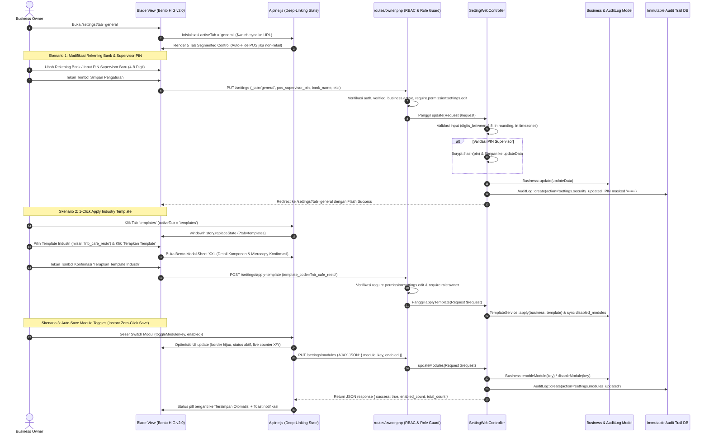

# Alur Kerja Pusat Pengaturan Terpadu (Unified Settings Hub Workflow)

> **Status:** COMPLETE  
> **Aktor Terlibat:** Business Owner, Supervisor Toko, Staff Admin  
> **Modul Terkait:** SettingWebController, BusinessTypeTemplate, ModuleRegistry, AuditLog, BusinessLocation, Currency, Apple HIG Bento Canvas  
> **Tabel Basis Data:** `businesses`, `business_memberships`, `business_type_templates`, `business_locations`, `currencies`, `audit_logs`

---

## 1. Diagram Alur Kerja Hulu-ke-Hilir (11 Simpul Eksekusi)

---

## 2. Rincian 11 Simpul Eksekusi Nyata

| Simpul | Nama Komponen | Deskripsi & Penegakan Teknis |
| :--- | :--- | :--- |
| **Simpul 1** | **User / Aktor** | Business Owner (pemegang wewenang penuh) dan Staf Admin (hanya izin baca/edit non-owner jika diberikan). |
| **Simpul 2** | **UI / Blade View** | [`resources/views/app/settings/index.blade.php`](file:///c:/laragon/www/cooca_core/resources/views/app/settings/index.blade.php) berarsitektur Apple HIG v2.0 Bento Canvas XXL 2-kolom di desktop, cards responsif di mobile (`hidden md:block` / `md:hidden`), dan input font minimal 16px (`text-[16px] sm:text-[15px]`) untuk mengeliminasi bug auto-zoom Safari iOS. |
| **Simpul 3** | **Alpine.js Client Logic** | Inisialisasi state reaktif `activeTab` dengan `$watch` yang merefleksikan perubahan tab ke query parameter URL via `window.history.replaceState` tanpa mereload halaman. Mengatur interaksi filter template industri dan modal sheet konfirmasi. |
| **Simpul 4** | **Route & Middleware** | [`routes/owner.php`](file:///c:/laragon/www/cooca_core/routes/owner.php#L369-L373) dilindungi oleh middleware stack berlapis: `auth:web`, `wa.otp`, `business.active`, `profile.complete`, `verified`, `require.permission:settings.view/edit`, dan `require.role:owner` untuk aksi struktural (apply-template, update-modules). |
| **Simpul 5** | **Controller Layer** | [`SettingWebController.php`](file:///c:/laragon/www/cooca_core/app/Http/Controllers/Web/SettingWebController.php) dioptimasi dengan eliminasi 11 query database berulang pada method `index()`. Menggunakan relasi langsung `Context::requireBusiness()` untuk isolasi multi-tenant mutlak. |
| **Simpul 6** | **Request Validation** | Validasi tipe data ketat: `pos_supervisor_pin` (`nullable|string|digits_between:4,8`), `rounding_strategy` (`in:none,round_100,round_500,round_1000`), `timezone` (`TimezoneHelper::isValid`), `template_code` (`exists:business_type_templates,code`). |
| **Simpul 7** | **Service / Domain Action** | `BusinessTemplateService` menangani instansiasi akun biaya default, komponen HPP, dan sinkronisasi modul fitur nonaktif sesuai matriks industri `ModuleRegistry`. |
| **Simpul 8** | **Eloquent & DB Schema** | Mutasi data pada entitas `businesses` (rekening bank, PIN ter-hash Bcrypt, format pembulatan, jam operasional) dan `business_landing_pages` (jam buka storefront publik). |
| **Simpul 9** | **Auto-Journal & Stok** | Tidak ada mutasi persediaan langsung; namun pembatasan diskon kasir (`pos_max_cashier_discount_percent`) menjadi guardrail utama untuk melindungi integritas margin HPP di modul POS. |
| **Simpul 10** | **Audit Trail Logging** | Pencatatan otomatis ke `audit_logs` saat terjadi modifikasi data sensitif (rekening bank, PIN supervisor, kuota diskon kasir). PIN supervisor selalu dimaskir sebagai `••••••` untuk mencegah kebocoran kredensial. |
| **Simpul 11** | **Guardrails Keamanan** | Penegakan model event `AuditLog::updating` append-only (tidak dapat dimanipulasi), proteksi IDOR lintas tenant melalui `Context::requireBusiness()`, dan proteksi double-submit pada seluruh form tombol simpan. |

---

## 3. Matriks Dynamic Context-Aware Auto-Hiding (20 Industri)

Untuk menjamin antarmuka bersih dan relevan bagi setiap sektor bisnis UMKM, elemen pengaturan secara otomatis disembunyikan berdasarkan modul aktif:

| Elemen Pengaturan | Syarat Visibilitas Modul | Perilaku Saat Modul Nonaktif |
| :--- | :--- | :--- |
| **Diskon Kasir & Otorisasi PIN** | `isModuleEnabled('pos_retail')` atau `isModuleEnabled('pos_dinein')` | Bagian form POS di Tab General otomatis disembunyikan sepenuhnya dari pandangan. |
| **Tab 3: WhatsApp Receipt** | `isModuleEnabled('pos_retail')` atau `isModuleEnabled('pos_dinein')` | Tab dinonaktifkan dari Segmented Control bar, atau menampilkan kartu edukasi ramah untuk mengaktifkan modul POS di Tab Modul. |
| **Multi-Cabang & Jam Operasional** | Selalu aktif (Core Tenant Ops) | Menampilkan cabang dalam bentuk Bento Grid di desktop dan Swipeable Compact Cards di ponsel sempit. |
| **Modul Fitur Khusus Klaster** | Berdasarkan preset template industri | Tab Modul mengelompokkan 25+ modul ke dalam 4 klaster bisnis terpadu dengan deskripsi terjemahan dwibahasa (ID/EN). |

---

## 4. Standar UI/UX Bento Apple HIG v2.0 & Mobile Ergonomics

1. **Struktur 3-Baris Page Header:**
   - **Baris 1 (Overline):** Teks kategori kecil tanpa bingkai kapsul (`settings.overline`).
   - **Baris 2 (H1 & Action):** Judul utama tegas (`settings.header_title`), badge status tenant, dan tombol aksi simpan di kanan atas desktop.
   - **Baris 3 (Subtitle):** Penjelasan fungsional ringkas 1 baris (`settings.header_subtitle`).
2. **Tab Navigasi Deep-Linked:**
   - Menggunakan Segmented Control Apple HIG dengan URL sync reaktif (`?tab=general`, `?tab=operations`, `?tab=wa_receipt`, `?tab=templates`, `?tab=modules`).
   - Mencegah kehilangan state saat browser di-refresh.
3. **Zona Ibu Jari & Tombol Responsif:**
   - Seluruh elemen sentuh (tombol, input, switch toggle) memenuhi standar ergonomi minimal 44x44px.
   - Tombol simpan memiliki status loading visual dan proteksi double-submit.
4. **Transformasi Tabel Cabang di Mobile:**
   - Tampilan desktop memanfaatkan tabel lapang ber-zebra striping halus.
   - Layar sempit (<768px) otomatis bertransformasi menjadi kartu ringkas terisolasi dengan badge status buka/tutup yang jelas.

---

## 5. Rujukan File & Kode Sumber

- **Routing:** [`routes/owner.php`](file:///c:/laragon/www/cooca_core/routes/owner.php#L368-L373)
- **Controller:** [`app/Http/Controllers/Web/SettingWebController.php`](file:///c:/laragon/www/cooca_core/app/Http/Controllers/Web/SettingWebController.php)
- **Blade Template:** [`resources/views/app/settings/index.blade.php`](file:///c:/laragon/www/cooca_core/resources/views/app/settings/index.blade.php)
- **Kamus Bahasa (ID):** [`lang/id/settings.php`](file:///c:/laragon/www/cooca_core/lang/id/settings.php)
- **Kamus Bahasa (EN):** [`lang/en/settings.php`](file:///c:/laragon/www/cooca_core/lang/en/settings.php)
- **Automated Feature Test:** [`tests/Feature/SettingWebTest.php`](file:///c:/laragon/www/cooca_core/tests/Feature/SettingWebTest.php), [`tests/Feature/SettingsModulesAutoSaveTest.php`](file:///c:/laragon/www/cooca_core/tests/Feature/SettingsModulesAutoSaveTest.php)
